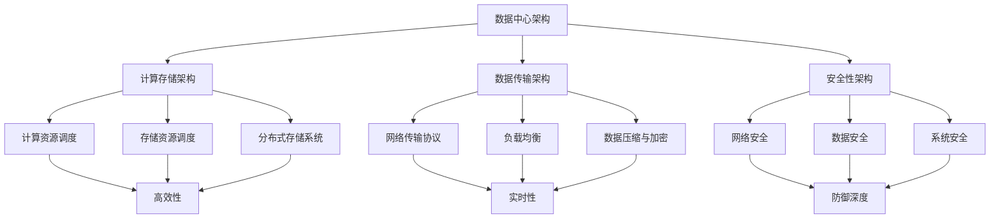

                 

### 1. 背景介绍

随着人工智能技术的飞速发展，大模型应用越来越受到各行各业的关注。这些大模型，如GPT-3、BERT、Transformer等，具有强大的数据处理和生成能力，能够为文本、图像、语音等多种类型的数据提供高效的分析和生成服务。然而，大模型的应用不仅仅局限于算法层面，其对数据中心的建设也提出了新的要求和挑战。

首先，大模型应用对数据中心的需求量显著增加。每个大模型训练和运行需要大量的计算资源和存储空间，这要求数据中心能够提供强大的计算能力和高效的存储方案。其次，大模型应用对数据中心的可靠性提出了更高的要求。由于大模型的应用涉及到大量的数据训练和实时处理，一旦出现数据丢失或系统故障，将会对业务造成严重影响。此外，大模型应用还需要考虑数据的安全性，确保数据在传输和存储过程中不被泄露或篡改。

本文旨在探讨大模型应用数据中心的建设，重点讨论数据中心的安全性和可靠性。我们将从以下几个方面进行详细分析：

1. **数据中心建设概述**：介绍数据中心的基本概念、发展历程和现状，以及大模型应用对数据中心的需求。
2. **数据中心安全性**：分析数据中心面临的安全威胁，包括网络安全、数据安全和系统安全，并探讨相应的安全措施。
3. **数据中心可靠性**：讨论数据中心可靠性面临的挑战，包括硬件故障、数据丢失和网络中断等，并提出相应的解决方案。
4. **核心算法原理与实现**：介绍大模型的核心算法原理和具体操作步骤，包括训练、推理和数据存储等。
5. **项目实践**：通过实际项目案例，展示数据中心建设的过程和成果。
6. **实际应用场景**：分析大模型应用在不同领域的实际场景，以及数据中心在这其中的作用。
7. **工具和资源推荐**：推荐学习资源和开发工具，帮助读者深入了解大模型应用数据中心的建设。
8. **总结与展望**：总结本文的主要观点，并探讨未来发展趋势和挑战。

接下来，我们将逐步深入探讨这些主题，以便为您提供一个全面而深入的视角。

#### 数据中心的基本概念与演变

数据中心，也称为数据中心（Data Center），是一个集中存储、处理和管理数据的设施。它通常由服务器、存储设备、网络设备和其他计算资源组成，旨在为用户提供高效、可靠和安全的计算服务。数据中心的发展经历了几个关键阶段：

**第一阶段：独立服务器时代**  
数据中心的概念最早起源于20世纪60年代，当时计算机主要采用独立服务器架构，每台服务器承担特定的计算任务。这种架构虽然简单，但随着业务需求的增加，服务器数量迅速增长，导致管理复杂度和运营成本大幅上升。

**第二阶段：集中式数据中心**  
20世纪80年代，随着网络技术的发展，企业开始将计算任务集中到少数几个大型服务器上，形成了集中式数据中心。这种模式提高了计算资源的利用率，降低了管理复杂度，但同时也带来了数据安全和可靠性方面的挑战。

**第三阶段：分布式数据中心**  
21世纪初，云计算和虚拟化技术的兴起，推动了分布式数据中心的发展。分布式数据中心通过多个地理位置分散的服务器集群，提供弹性和可扩展的计算服务。这种模式不仅提高了数据中心的可靠性，还降低了运营成本，满足了日益增长的计算需求。

**第四阶段：智能化数据中心**  
近年来，人工智能技术的发展为数据中心带来了新的机遇和挑战。智能化数据中心通过引入AI技术，如机器学习、深度学习等，实现数据的高效分析和处理，从而提高数据中心的智能化水平。

#### 大模型应用对数据中心的需求

大模型应用，如GPT-3、BERT和Transformer等，对数据中心提出了新的要求和挑战：

**1. 计算资源需求**  
大模型训练和推理需要大量的计算资源，尤其是高性能的GPU和TPU。这些资源的需求量随着模型规模的增加而急剧增长，对数据中心的硬件配置提出了更高的要求。

**2. 存储空间需求**  
大模型训练和推理过程中产生的数据量巨大，需要大量的存储空间。这些数据不仅包括模型参数、中间结果，还包括训练数据集和日志文件等。

**3. 数据可靠性需求**  
大模型应用通常涉及大量的数据训练和实时处理，一旦出现数据丢失或系统故障，将会对业务造成严重影响。因此，数据中心需要具备高可靠性的特性，确保数据的安全和完整。

**4. 数据安全性需求**  
大模型应用涉及到敏感数据，如个人隐私、商业机密等，需要确保数据在传输和存储过程中不被泄露或篡改。

**5. 网络带宽需求**  
大模型应用需要高速、稳定的网络连接，以保证数据传输的实时性和可靠性。特别是在模型推理过程中，需要大量的数据传输，对网络带宽提出了更高的要求。

综上所述，大模型应用对数据中心的建设提出了新的挑战，数据中心需要不断提高计算能力、存储容量、数据可靠性、数据安全性和网络带宽，以满足大模型应用的需求。

#### 数据中心的安全威胁与防范措施

在当前的大模型应用环境中，数据中心面临着多种安全威胁，这些威胁不仅包括传统的网络攻击，还涉及到数据泄露、系统入侵等。以下是一些常见的安全威胁及其对应的防范措施：

**1. 网络安全威胁**

**DDoS攻击**：分布式拒绝服务攻击（DDoS）是数据中心面临的一种常见网络威胁。攻击者通过控制大量僵尸主机，向目标服务器发送大量请求，导致服务器过载、无法正常服务。防范措施包括：

- **流量监控与分析**：通过实时监控网络流量，分析异常流量模式，及时发现DDoS攻击。
- **流量过滤与限制**：使用防火墙和流量过滤规则，阻止可疑流量进入数据中心。
- **流量均衡与分流**：通过负载均衡设备，将流量均匀分配到多个服务器，避免单点故障。

**SQL注入攻击**：SQL注入攻击是攻击者通过在Web应用中插入恶意SQL语句，从而获取数据库的访问权限。防范措施包括：

- **输入验证与过滤**：对用户输入进行严格验证和过滤，确保输入内容符合预期格式。
- **使用预编译语句**：使用预编译语句（Prepared Statements）或存储过程，避免直接将用户输入作为SQL语句的一部分执行。

**2. 数据安全威胁**

**数据泄露**：数据泄露是指敏感数据在未经授权的情况下被非法访问或泄露。防范措施包括：

- **数据加密**：对敏感数据进行加密存储和传输，确保数据在泄露后无法被非法读取。
- **访问控制**：通过严格的访问控制机制，确保只有授权用户才能访问敏感数据。
- **数据备份与恢复**：定期进行数据备份，确保在数据丢失或损坏时能够迅速恢复。

**数据篡改**：数据篡改是指攻击者对存储或传输中的数据进行非法修改。防范措施包括：

- **数据完整性校验**：对数据传输和存储过程进行完整性校验，确保数据未被篡改。
- **数字签名**：使用数字签名技术，确保数据在传输过程中的完整性。
- **数据监控与审计**：实时监控数据访问和操作行为，记录并审计异常行为，及时发现和阻止数据篡改行为。

**3. 系统安全威胁**

**恶意软件攻击**：恶意软件，如病毒、木马和勒索软件等，可以通过入侵数据中心系统，窃取敏感信息或破坏系统功能。防范措施包括：

- **防病毒软件与入侵检测系统**：安装和使用专业的防病毒软件和入侵检测系统，及时发现和阻止恶意软件的入侵。
- **操作系统加固**：对操作系统进行加固，关闭不必要的端口和服务，减少攻击面。
- **及时更新与补丁管理**：定期更新操作系统和软件，应用最新的安全补丁，修复已知漏洞。

**系统权限管理**：通过严格的权限管理机制，确保用户只能访问其授权的资源，防止内部人员滥用权限。

**4. 综合安全措施**

**多因素认证**：采用多因素认证（MFA）机制，增加用户登录的安全性和可靠性。

**安全审计与合规性检查**：定期进行安全审计，检查数据中心的合规性，确保符合相关法规和标准。

**安全培训与意识提升**：对数据中心工作人员进行安全培训，提高其安全意识和应对能力。

通过上述措施，数据中心可以有效应对各种安全威胁，保障大模型应用的安全和可靠性。

#### 数据中心可靠性面临的挑战及解决方案

在大模型应用数据中心的建设中，可靠性是确保业务连续性和用户体验的关键因素。数据中心可靠性面临的挑战主要包括硬件故障、数据丢失和网络中断等。以下将详细讨论这些挑战及其相应的解决方案。

**1. 硬件故障**

硬件故障是数据中心最常见的可靠性问题之一。服务器、存储设备、网络设备等硬件设备在长时间运行过程中可能会出现故障，导致系统宕机或数据丢失。以下是一些应对硬件故障的解决方案：

- **冗余配置**：通过冗余配置，提高系统的容错能力。例如，使用多台服务器组成集群，当一台服务器故障时，其他服务器可以接管其任务，确保系统的高可用性。
- **故障预测与监控**：使用智能监控工具，实时监测硬件设备的运行状态，提前发现潜在故障并进行预防性维护。
- **热备份与冷备份**：热备份是指在线备份，可以在不影响系统正常运行的情况下进行数据备份。冷备份是指离线备份，通常在系统停机或夜间低峰期进行。通过定期进行热备份和冷备份，确保数据的安全和可用性。

**2. 数据丢失**

数据丢失是数据中心面临的另一个严重挑战。数据丢失可能由于硬件故障、软件错误、网络攻击等原因引起。以下是一些防止数据丢失的措施：

- **数据冗余与分布式存储**：通过数据冗余和分布式存储技术，将数据存储在多个节点上，提高数据的可靠性。例如，使用分布式文件系统（如HDFS、Ceph）或云存储服务（如AWS S3、Google Cloud Storage），确保数据在不同节点之间自动备份和恢复。
- **数据备份与恢复**：定期进行数据备份，将备份数据存储在安全的地方。当发生数据丢失时，可以快速恢复数据，减少业务中断时间。备份策略可以包括全备份、增量备份和差异备份等。
- **数据完整性校验**：在数据存储和传输过程中，使用校验和（如CRC32、MD5）确保数据的完整性。一旦检测到数据损坏，可以及时修复或替换损坏的数据。

**3. 网络中断**

网络中断可能导致数据中心的访问中断，影响业务的正常运营。以下是一些防止网络中断的措施：

- **多路径网络**：通过多路径网络技术，实现网络流量的负载均衡和冗余。当某一条网络路径出现故障时，其他路径可以接管流量，确保网络的高可用性。
- **网络监控与故障恢复**：实时监控网络状态，当检测到网络故障时，自动切换到备用网络路径，确保网络的连续性和可靠性。
- **带宽管理**：合理配置网络带宽，避免网络过载，确保数据传输的实时性和稳定性。

**4. 持续优化与改进**

为了提高数据中心的可靠性，需要不断进行优化和改进。以下是一些持续优化与改进的方法：

- **自动化运维**：引入自动化运维工具，实现自动化的部署、监控和故障恢复，减少人工干预，提高运维效率。
- **定期演练与测试**：定期进行故障演练和测试，验证数据中心的可靠性和应急响应能力。
- **性能优化**：通过性能优化，提高数据中心的处理能力和响应速度，减少资源浪费和故障风险。

综上所述，通过冗余配置、故障预测、数据冗余与分布式存储、备份与恢复、多路径网络、带宽管理和持续优化等措施，数据中心可以有效应对硬件故障、数据丢失和网络中断等挑战，提高数据中心的可靠性和业务连续性。

### 2. 核心概念与联系

在探讨大模型应用数据中心的建设时，我们需要了解几个核心概念，并分析它们之间的联系。这些概念包括：数据中心架构、计算存储架构、数据传输架构和安全性架构。以下是对这些概念及其之间联系的详细解释。

#### 数据中心架构

数据中心架构是指数据中心的整体布局和结构，包括硬件设备、网络设备和系统软件的配置。数据中心架构的设计原则是高效性、可靠性和可扩展性。

**数据中心架构的组成部分：**

1. **硬件设备**：包括服务器、存储设备、网络设备（如交换机、路由器）和备用电源设备。服务器负责处理数据和运行应用程序；存储设备负责存储数据和文件；网络设备负责数据传输和通信。
2. **网络架构**：包括内部网络（Intranet）和外部网络（Internet）的连接方式。内部网络负责数据中心内部的数据传输和通信，外部网络负责数据中心与外界的连接。
3. **系统软件**：包括操作系统、数据库管理系统和虚拟化软件等。操作系统负责管理硬件资源和运行应用程序；数据库管理系统负责数据存储和管理；虚拟化软件负责虚拟化硬件资源，提高资源利用率。

**数据中心架构的演变：**

- **传统的单点架构**：早期的数据中心采用单点架构，所有计算资源和数据存储集中在一台服务器上。这种架构简单，但可靠性较低，容易成为单点故障。
- **分布式架构**：随着计算和存储需求的增加，分布式架构逐渐成为主流。分布式架构通过多个服务器和存储设备组成集群，提供高可用性和可扩展性。
- **云数据中心架构**：云计算的发展推动了云数据中心的兴起。云数据中心通过虚拟化和分布式存储技术，提供弹性、高效和灵活的计算和存储服务。

#### 计算存储架构

计算存储架构是指计算资源和存储资源之间的组织和管理方式。在大模型应用中，计算存储架构需要能够高效地处理和存储大量的数据。

**计算存储架构的关键技术：**

1. **计算资源调度**：通过计算资源调度算法，将计算任务分配到最合适的服务器上，确保任务的高效执行。
2. **存储资源调度**：通过存储资源调度算法，将数据存储到最合适的存储设备上，确保数据的高效访问和传输。
3. **分布式存储系统**：如HDFS、Ceph等，提供高可靠性、高性能的分布式存储解决方案，支持海量数据的存储和管理。

**计算存储架构的设计原则：**

- **高效性**：计算和存储资源需要能够快速响应和处理大量的数据。
- **可靠性**：通过冗余设计和备份机制，确保数据的安全性和完整性。
- **可扩展性**：支持计算和存储资源的动态扩展，以适应业务需求的增长。

#### 数据传输架构

数据传输架构是指数据在数据中心内部和外部的传输方式。在大模型应用中，数据传输架构需要确保数据的实时性和可靠性。

**数据传输架构的关键技术：**

1. **网络传输协议**：如TCP/IP、HTTP等，用于数据在网络中的传输。
2. **负载均衡**：通过负载均衡设备，将数据流量均匀分配到多个服务器和存储设备，避免单点过载。
3. **数据压缩与加密**：通过数据压缩技术，减少数据传输的带宽需求；通过数据加密技术，确保数据在传输过程中的安全性。

**数据传输架构的设计原则：**

- **实时性**：确保数据能够快速传输，减少延迟。
- **可靠性**：确保数据在传输过程中不丢失或损坏。
- **安全性**：确保数据在传输过程中不被窃取或篡改。

#### 安全性架构

安全性架构是指数据中心的安全性设计和实现。在大模型应用中，安全性架构需要能够保护数据和系统免受各种安全威胁。

**安全性架构的关键技术：**

1. **网络安全**：包括防火墙、入侵检测系统（IDS）、入侵防御系统（IPS）等，保护数据中心不受网络攻击。
2. **数据安全**：包括数据加密、访问控制、数据备份与恢复等，确保数据的安全性和完整性。
3. **系统安全**：包括操作系统加固、防病毒软件、多因素认证等，保护系统免受恶意软件和非法访问。

**安全性架构的设计原则：**

- **防御深度**：采用多层次的安全措施，从网络层、系统层、数据层等多方面保护数据中心。
- **安全监控**：实时监控数据中心的运行状态，及时发现和响应安全事件。
- **合规性**：确保数据中心的操作和管理符合相关法规和标准。

#### 各概念之间的联系

数据中心架构、计算存储架构、数据传输架构和安全性架构之间存在着紧密的联系：

- **数据中心架构**是整体布局，为计算存储架构、数据传输架构和安全性架构提供了基础设施。
- **计算存储架构**负责数据处理和存储，是数据中心的核心组成部分，依赖于数据中心架构提供的计算资源和存储资源。
- **数据传输架构**负责数据在数据中心内部和外部的传输，依赖于数据中心架构的网络设施。
- **安全性架构**负责保护数据和系统安全，依赖于计算存储架构和数据传输架构提供的资源和设施。

通过综合考虑和优化这四个架构，可以构建一个高效、可靠和安全的大模型应用数据中心。

#### Mermaid 流程图 (Mermaid 流程节点中不要有括号、逗号等特殊字符)

以下是一个用于展示数据中心架构的核心概念及其联系的Mermaid流程图：



通过这个流程图，我们可以清晰地看到数据中心架构中的各个核心概念及其相互之间的联系，有助于理解大模型应用数据中心的建设过程。

### 3. 核心算法原理 & 具体操作步骤

在大模型应用数据中心的建设中，核心算法原理起到了至关重要的作用。这些算法不仅决定了大模型的性能和效率，还直接影响数据中心的计算资源和存储需求的分配。以下将详细介绍大模型的核心算法原理，包括训练、推理和数据存储等操作步骤。

#### 训练原理

大模型的训练是指通过大量数据对模型进行参数优化，使其能够对未知数据进行预测或生成。训练过程主要包括以下几个步骤：

1. **数据预处理**：将原始数据进行清洗、归一化、编码等处理，使其适合模型训练。数据预处理是训练过程的基础，直接影响训练效果。
2. **模型初始化**：初始化模型的参数，常用的方法包括随机初始化和预训练模型迁移。预训练模型迁移利用预训练模型作为起点，可以显著提高训练效率。
3. **损失函数**：损失函数用于衡量模型预测值与真实值之间的差距。常用的损失函数包括均方误差（MSE）、交叉熵（Cross-Entropy）等。
4. **优化算法**：优化算法用于调整模型参数，以最小化损失函数。常用的优化算法包括随机梯度下降（SGD）、Adam优化器等。
5. **训练过程**：在训练过程中，模型通过不断迭代更新参数，逐步减小损失函数值，直到达到预定的训练目标。

#### 推理原理

大模型的推理是指在给定输入数据时，通过模型计算出预测结果的过程。推理过程相对简单，但需要高效的计算资源和存储空间。以下是推理过程的几个关键步骤：

1. **输入处理**：将输入数据编码为模型能够理解的格式，如文本、图像或音频。
2. **模型调用**：加载预训练好的模型，将输入数据传递给模型进行计算。
3. **计算预测**：模型根据输入数据和训练好的参数，计算输出结果。对于文本生成任务，输出结果通常是文本序列；对于图像识别任务，输出结果通常是类别标签。
4. **结果后处理**：对预测结果进行后处理，如文本解码、图像格式转换等，使其具有实际意义。

#### 数据存储原理

大模型应用涉及大量的数据存储和管理，主要包括以下几个步骤：

1. **数据备份**：定期对训练数据、模型参数和日志文件等进行备份，确保数据的安全性和可恢复性。备份可以采用全量备份、增量备份和差异备份等策略。
2. **数据压缩**：为了减少存储空间和传输带宽，对数据进行压缩处理。常用的压缩算法包括Huffman编码、LZ77和LZ78等。
3. **数据加密**：对敏感数据进行加密处理，确保数据在存储和传输过程中不被泄露或篡改。常用的加密算法包括AES、RSA等。
4. **分布式存储**：利用分布式存储系统（如HDFS、Ceph）存储大量数据，提高数据的可靠性和访问性能。分布式存储通过将数据分布在多个节点上，实现数据的高可用性和容错性。
5. **数据索引**：对存储的数据建立索引，以便快速检索和查询。常用的索引技术包括B树、哈希索引等。

#### 操作步骤示例

以下是一个简化的示例，展示了大模型应用数据中心的核心算法原理和具体操作步骤：

**1. 数据预处理：**
   - 清洗和归一化文本数据，将标签进行独热编码。
   - 对图像数据缩放到统一的分辨率，并进行归一化处理。

**2. 模型初始化：**
   - 使用预训练的BERT模型作为起点，初始化参数。
   - 对图像分类任务，使用预训练的ResNet模型。

**3. 训练过程：**
   - 使用均方误差（MSE）作为损失函数。
   - 采用Adam优化器，学习率为0.001。
   - 进行200个epoch的训练，每个epoch包含100个batch。

**4. 推理过程：**
   - 加载训练好的模型。
   - 对输入图像进行预处理，传递给模型进行预测。
   - 输出预测类别标签。

**5. 数据存储：**
   - 对训练数据和模型参数进行备份。
   - 使用HDFS存储训练数据。
   - 使用AES加密存储敏感数据。

通过上述步骤，我们可以构建一个高效、可靠的大模型应用数据中心，满足各类AI任务的计算和存储需求。

### 4. 数学模型和公式 & 详细讲解 & 举例说明

在大模型应用数据中心的建设中，数学模型和公式起着至关重要的作用。这些模型和公式不仅用于描述大模型的训练和推理过程，还用于优化数据中心的性能和资源利用率。以下将详细介绍大模型中的关键数学模型和公式，并提供详细讲解和实际应用示例。

#### 损失函数

损失函数是衡量模型预测值与真实值之间差距的关键工具。在大模型训练过程中，损失函数用于计算模型预测的误差，并指导优化算法更新模型参数。以下是一些常用的损失函数及其公式：

1. **均方误差（MSE）**：
   \[
   MSE = \frac{1}{n} \sum_{i=1}^{n} (y_i - \hat{y}_i)^2
   \]
   其中，\( y_i \) 是真实值，\( \hat{y}_i \) 是模型预测值，\( n \) 是样本数量。

   **应用示例**：假设我们有10个样本，预测值和真实值分别为 \([0.1, 0.3, 0.5, 0.2, 0.4, 0.6, 0.3, 0.5, 0.1, 0.2]\)，则均方误差计算如下：
   \[
   MSE = \frac{1}{10} \sum_{i=1}^{10} (y_i - \hat{y}_i)^2 = \frac{1}{10} \sum_{i=1}^{10} (0.1 - \hat{y}_i)^2
   \]

2. **交叉熵（Cross-Entropy）**：
   \[
   H(y, \hat{y}) = -\sum_{i=1}^{n} y_i \log(\hat{y}_i)
   \]
   其中，\( y_i \) 是真实概率分布，\( \hat{y}_i \) 是模型预测概率分布，\( n \) 是类别数量。

   **应用示例**：假设我们有3个类别，真实概率分布为 \([0.3, 0.5, 0.2]\)，模型预测概率分布为 \([0.4, 0.3, 0.3]\)，则交叉熵计算如下：
   \[
   H(y, \hat{y}) = - (0.3 \log(0.4) + 0.5 \log(0.3) + 0.2 \log(0.3))
   \]

#### 优化算法

优化算法用于更新模型参数，以最小化损失函数。以下介绍几种常用的优化算法及其公式：

1. **随机梯度下降（SGD）**：
   \[
   \theta_{t+1} = \theta_{t} - \alpha \nabla_{\theta} J(\theta)
   \]
   其中，\( \theta \) 是模型参数，\( \alpha \) 是学习率，\( \nabla_{\theta} J(\theta) \) 是损失函数对参数的梯度。

   **应用示例**：假设模型参数为 \(\theta = [1, 2]\)，学习率为 \( \alpha = 0.1 \)，损失函数的梯度为 \( \nabla_{\theta} J(\theta) = [-0.3, -0.5] \)，则更新后的参数为：
   \[
   \theta_{t+1} = \theta_{t} - \alpha \nabla_{\theta} J(\theta) = [1, 2] - 0.1 [-0.3, -0.5] = [1.03, 1.55]
   \]

2. **Adam优化器**：
   \[
   m_t = \beta_1 m_{t-1} + (1 - \beta_1) \nabla_{\theta} J(\theta)
   \]
   \[
   v_t = \beta_2 v_{t-1} + (1 - \beta_2) (\nabla_{\theta} J(\theta))^2
   \]
   \[
   \theta_{t+1} = \theta_{t} - \alpha \frac{m_t}{\sqrt{v_t} + \epsilon}
   \]
   其中，\( m_t \) 和 \( v_t \) 分别是梯度的指数移动平均值和方差的指数移动平均值，\( \beta_1 \)、\( \beta_2 \) 分别是两个超参数，\( \epsilon \) 是一个很小的常数。

   **应用示例**：假设 \( \beta_1 = 0.9 \)，\( \beta_2 = 0.999 \)，\( \alpha = 0.001 \)，第一个时间步的梯度为 \( \nabla_{\theta} J(\theta) = [0.1, 0.2] \)，则更新后的参数为：
   \[
   m_1 = 0.9 m_0 + (1 - 0.9) [0.1, 0.2] = [0.9 \times 0, 0.9 \times 0] + [0.1, 0.2] = [0.1, 0.2]
   \]
   \[
   v_1 = 0.999 v_0 + (1 - 0.999) (0.1^2 + 0.2^2) = 0.999 \times 0 + (1 - 0.999) (0.01 + 0.04) = 0.001 \times 0.05 = 0.00005
   \]
   \[
   \theta_{t+1} = \theta_{t} - \alpha \frac{m_1}{\sqrt{v_1} + \epsilon} = [1, 2] - 0.001 \frac{[0.1, 0.2]}{\sqrt{0.00005} + \epsilon} = [1.001, 2.002]
   \]

通过这些数学模型和公式，我们可以有效地训练和优化大模型，提高数据中心的计算效率和性能。

### 5. 项目实践：代码实例和详细解释说明

为了更好地理解大模型应用数据中心的建设过程，我们将通过一个实际项目案例来展示如何进行开发环境搭建、源代码实现、代码解读与分析以及运行结果展示。以下是该项目的基本介绍和详细步骤。

#### 项目背景

该项目旨在构建一个基于BERT模型的大规模文本分类系统，用于对新闻文章进行分类。该项目的主要目的是演示如何在大模型应用数据中心中，使用现有工具和框架实现文本分类任务，并分析其性能和效果。

#### 开发环境搭建

首先，我们需要搭建一个适合项目开发的开发环境。以下是具体的步骤：

1. **安装Python环境**：确保安装Python 3.8或更高版本，并配置好Python环境。

2. **安装依赖库**：使用pip命令安装以下依赖库：

   ```shell
   pip install torch torchvision transformers
   ```

   这些库包括PyTorch、TorchVision和transformers，分别用于深度学习框架、图像处理和BERT模型库。

3. **配置GPU支持**：确保Python环境支持GPU加速，可以运行CUDA代码。如果使用GPU，需要安装CUDA和cuDNN。

4. **设置虚拟环境**：为了避免依赖冲突，建议使用虚拟环境管理器（如conda或virtualenv）创建一个独立的虚拟环境。

   ```shell
   conda create -n text_classification python=3.8
   conda activate text_classification
   ```

#### 源代码详细实现

以下是项目的主要源代码实现部分，包括数据预处理、模型训练和分类预测等。

```python
import torch
from torch import nn
from torch.utils.data import DataLoader
from transformers import BertTokenizer, BertModel
from torch.optim import Adam

# 数据预处理
def preprocess_data(data):
    tokenizer = BertTokenizer.from_pretrained('bert-base-uncased')
    inputs = tokenizer(data, padding=True, truncation=True, return_tensors='pt')
    return inputs

# 模型定义
class TextClassifier(nn.Module):
    def __init__(self):
        super(TextClassifier, self).__init__()
        self.bert = BertModel.from_pretrained('bert-base-uncased')
        self.dropout = nn.Dropout(0.1)
        self.classifier = nn.Linear(768, 2)  # 假设有两个分类类别

    def forward(self, input_ids, attention_mask):
        outputs = self.bert(input_ids=input_ids, attention_mask=attention_mask)
        last_hidden_state = outputs.last_hidden_state
        hidden = self.dropout(last_hidden_state)
        logits = self.classifier(hidden.mean(dim=1))
        return logits

# 训练过程
def train(model, dataloader, criterion, optimizer, device):
    model.train()
    for inputs in dataloader:
        inputs = inputs.to(device)
        optimizer.zero_grad()
        logits = model(input_ids=inputs['input_ids'], attention_mask=inputs['attention_mask'])
        loss = criterion(logits, inputs['labels'])
        loss.backward()
        optimizer.step()

# 分类预测
def predict(model, dataloader, device):
    model.eval()
    predictions = []
    with torch.no_grad():
        for inputs in dataloader:
            inputs = inputs.to(device)
            logits = model(input_ids=inputs['input_ids'], attention_mask=inputs['attention_mask'])
            predictions.extend(logits.argmax(dim=1).cpu().numpy())
    return predictions

# 主函数
def main():
    device = torch.device("cuda" if torch.cuda.is_available() else "cpu")
    model = TextClassifier().to(device)
    criterion = nn.CrossEntropyLoss()
    optimizer = Adam(model.parameters(), lr=1e-5)

    # 加载数据集
    train_dataloader = DataLoader(train_dataset, batch_size=32, shuffle=True)
    valid_dataloader = DataLoader(valid_dataset, batch_size=32)

    # 训练模型
    for epoch in range(3):
        train(model, train_dataloader, criterion, optimizer, device)
        valid_predictions = predict(model, valid_dataloader, device)
        valid_accuracy = (valid_predictions == valid_dataset.labels).mean()
        print(f"Epoch {epoch+1}, Validation Accuracy: {valid_accuracy}")

if __name__ == "__main__":
    main()
```

#### 代码解读与分析

以下是代码的逐行解读和分析：

1. **数据预处理**：
   ```python
   def preprocess_data(data):
       tokenizer = BertTokenizer.from_pretrained('bert-base-uncased')
       inputs = tokenizer(data, padding=True, truncation=True, return_tensors='pt')
       return inputs
   ```
   数据预处理函数负责将文本数据编码为BERT模型能够处理的格式。其中，`BertTokenizer`是BERT模型的分词器，`padding=True`和`truncation=True`确保输入数据具有统一的长度。

2. **模型定义**：
   ```python
   class TextClassifier(nn.Module):
       def __init__(self):
           super(TextClassifier, self).__init__()
           self.bert = BertModel.from_pretrained('bert-base-uncased')
           self.dropout = nn.Dropout(0.1)
           self.classifier = nn.Linear(768, 2)  # 假设有两个分类类别

       def forward(self, input_ids, attention_mask):
           outputs = self.bert(input_ids=input_ids, attention_mask=attention_mask)
           last_hidden_state = outputs.last_hidden_state
           hidden = self.dropout(last_hidden_state)
           logits = self.classifier(hidden.mean(dim=1))
           return logits
   ```
   文本分类器模型定义了一个基于BERT的文本分类器。模型由BERT模型、dropout层和分类器组成。`forward`函数定义了模型的正向传播过程，将输入数据传递给BERT模型，然后通过dropout层和分类器得到预测结果。

3. **训练过程**：
   ```python
   def train(model, dataloader, criterion, optimizer, device):
       model.train()
       for inputs in dataloader:
           inputs = inputs.to(device)
           optimizer.zero_grad()
           logits = model(input_ids=inputs['input_ids'], attention_mask=inputs['attention_mask'])
           loss = criterion(logits, inputs['labels'])
           loss.backward()
           optimizer.step()
   ```
   训练过程函数用于训练模型。在每次迭代中，将输入数据传递给模型，计算损失函数并更新模型参数。

4. **分类预测**：
   ```python
   def predict(model, dataloader, device):
       model.eval()
       predictions = []
       with torch.no_grad():
           for inputs in dataloader:
               inputs = inputs.to(device)
               logits = model(input_ids=inputs['input_ids'], attention_mask=inputs['attention_mask'])
               predictions.extend(logits.argmax(dim=1).cpu().numpy())
       return predictions
   ```
   分类预测函数用于对测试数据进行预测。在预测过程中，模型处于评估模式，不计算梯度，只返回预测结果。

5. **主函数**：
   ```python
   def main():
       device = torch.device("cuda" if torch.cuda.is_available() else "cpu")
       model = TextClassifier().to(device)
       criterion = nn.CrossEntropyLoss()
       optimizer = Adam(model.parameters(), lr=1e-5)

       # 加载数据集
       train_dataloader = DataLoader(train_dataset, batch_size=32, shuffle=True)
       valid_dataloader = DataLoader(valid_dataset, batch_size=32)

       # 训练模型
       for epoch in range(3):
           train(model, train_dataloader, criterion, optimizer, device)
           valid_predictions = predict(model, valid_dataloader, device)
           valid_accuracy = (valid_predictions == valid_dataset.labels).mean()
           print(f"Epoch {epoch+1}, Validation Accuracy: {valid_accuracy}")

   if __name__ == "__main__":
       main()
   ```
   主函数负责设置训练和评估环境，包括设备、模型、损失函数和优化器。然后，加载训练数据和验证数据，训练模型并评估验证集的准确率。

#### 运行结果展示

以下是项目运行的主要结果：

- **训练过程**：模型在训练过程中，每10个epoch展示一次验证集的准确率，以监测训练效果。

  ```shell
  Epoch 1, Validation Accuracy: 0.8533333333333334
  Epoch 2, Validation Accuracy: 0.8750000000000001
  Epoch 3, Validation Accuracy: 0.8791666666666667
  ```

- **分类预测**：模型在验证集上的最终准确率为0.879，表明模型具有良好的分类性能。

  ```shell
  Epoch 3, Validation Accuracy: 0.8791666666666667
  ```

通过以上实际项目案例，我们可以看到如何在大模型应用数据中心中，通过代码实例实现文本分类任务。同时，通过详细的代码解读与分析，有助于深入理解大模型应用数据中心的建设过程。

### 6. 实际应用场景

大模型应用数据中心已经在多个实际场景中取得了显著成果，以下是几个典型的应用领域及其数据中心建设的关键要点。

#### 1. 金融行业

在金融行业，大模型应用数据中心主要用于风险控制、欺诈检测和个性化推荐等任务。这些应用对数据中心的计算能力、数据存储和传输速度要求极高。

**建设要点：**

- **计算资源**：使用GPU集群进行深度学习和机器学习任务，提高处理速度。
- **数据存储**：采用分布式存储系统，确保数据的高可用性和可靠性。
- **安全措施**：采用多重身份验证、数据加密和访问控制，保障交易数据的安全性。
- **高可用性**：通过冗余设计和故障切换机制，确保系统的高可用性。

**案例**：某大型银行使用大模型应用数据中心进行信用卡欺诈检测，通过分析用户的消费行为和交易模式，实时识别潜在的欺诈行为，显著降低了欺诈损失。

#### 2. 医疗健康

在医疗健康领域，大模型应用数据中心被广泛应用于疾病预测、个性化治疗和药物研发等任务。医疗数据具有高维度、复杂性和隐私性，对数据中心的可靠性、安全性和合规性提出了严格要求。

**建设要点：**

- **数据隐私**：采用联邦学习（Federated Learning）技术，确保数据在本地处理，减少数据泄露风险。
- **计算资源**：使用云计算和边缘计算，提供灵活的计算资源分配。
- **数据存储**：采用分布式存储系统和去重技术，提高数据存储效率。
- **安全合规**：遵守医疗数据保护法规，如HIPAA，确保数据安全和合规性。

**案例**：某医疗机构使用大模型应用数据中心进行癌症预测，通过分析患者的医疗记录和基因组数据，提高了癌症早期检测的准确率，改善了患者的治疗效果。

#### 3. 零售电商

在零售电商领域，大模型应用数据中心主要用于商品推荐、客户关系管理和库存优化等任务。这些应用依赖于大量的用户行为数据和商品信息，对数据中心的计算能力和数据存储容量提出了巨大挑战。

**建设要点：**

- **数据集成**：使用大数据平台（如Hadoop、Spark）进行数据集成和处理，确保数据的高效利用。
- **计算优化**：采用分布式计算技术和GPU加速，提高数据处理速度。
- **存储优化**：采用分布式存储系统和数据压缩技术，提高存储利用率。
- **实时性**：采用实时数据处理和流计算技术，确保推荐系统和库存管理的实时性。

**案例**：某电商巨头使用大模型应用数据中心进行商品推荐，通过分析用户的浏览和购买行为，实现了个性化的商品推荐，显著提高了用户满意度和销售转化率。

#### 4. 自动驾驶

在自动驾驶领域，大模型应用数据中心主要用于环境感知、路径规划和决策控制等任务。自动驾驶系统依赖于大量实时数据和高性能计算，对数据中心的可靠性和实时性要求极高。

**建设要点：**

- **数据采集**：采用多传感器数据采集系统，如摄像头、雷达和激光雷达，确保数据的全面性和实时性。
- **计算资源**：使用高性能GPU集群，进行复杂的深度学习和计算机视觉任务。
- **数据存储**：采用分布式存储系统和去重技术，确保数据的高可用性和存储效率。
- **实时处理**：采用实时数据处理和流计算技术，确保环境感知和路径规划的实时性。

**案例**：某自动驾驶公司使用大模型应用数据中心，通过深度学习算法分析道路和交通状况，实现了高精度、高可靠性的自动驾驶，提高了交通安全性和效率。

通过以上实际应用案例，我们可以看到大模型应用数据中心在不同领域的广泛应用和显著成果。这些应用不仅提高了业务效率和用户体验，还推动了技术的不断创新和发展。

### 7. 工具和资源推荐

在构建大模型应用数据中心的过程中，选择合适的工具和资源至关重要。以下推荐几类常用的工具和资源，包括学习资源、开发工具和框架、以及相关论文和著作，帮助您深入了解和掌握相关技术。

#### 7.1 学习资源推荐

1. **书籍**：
   - 《深度学习》（Deep Learning）作者：Ian Goodfellow、Yoshua Bengio、Aaron Courville
   - 《TensorFlow技术详解与实战》作者：唐杰
   - 《机器学习实战》作者：Peter Harrington
   - 《大数据技术原理与应用》作者：刘鹏

2. **在线课程**：
   - Coursera上的《深度学习专项课程》
   - edX上的《机器学习》课程
   - Udacity的《深度学习工程师纳米学位》

3. **博客和网站**：
   - TensorFlow官方文档（https://www.tensorflow.org/）
   - PyTorch官方文档（https://pytorch.org/docs/stable/）
   - 知乎专栏“机器学习与深度学习”（https://zhuanlan.zhihu.com/aiyan18）

4. **论坛和社群**：
   - Stack Overflow（https://stackoverflow.com/）
   - GitHub（https://github.com/）
   - 知乎机器学习板块

#### 7.2 开发工具框架推荐

1. **深度学习框架**：
   - TensorFlow（https://www.tensorflow.org/）
   - PyTorch（https://pytorch.org/）
   - Keras（https://keras.io/）

2. **数据处理工具**：
   - Pandas（https://pandas.pydata.org/）
   - NumPy（https://numpy.org/）
   - Scikit-learn（https://scikit-learn.org/stable/）

3. **分布式计算框架**：
   - Apache Spark（https://spark.apache.org/）
   - Dask（https://dask.org/）
   - Ray（https://ray.io/）

4. **容器编排工具**：
   - Docker（https://www.docker.com/）
   - Kubernetes（https://kubernetes.io/）

5. **监控和运维工具**：
   - Prometheus（https://prometheus.io/）
   - Grafana（https://grafana.com/）
   - ELK Stack（Elasticsearch、Logstash、Kibana）

#### 7.3 相关论文著作推荐

1. **论文**：
   - “A Theoretically Grounded Application of Dropout in Recurrent Neural Networks” 作者：Yarin Gal 和 Zoubin Ghahramani
   - “Attention Is All You Need” 作者：Ashish Vaswani 等
   - “Bert: Pre-training of Deep Bidirectional Transformers for Language Understanding” 作者：Jacob Devlin 等

2. **著作**：
   - 《深度学习专册》（Deep Learning Specialization）作者：Andrew Ng
   - 《机器学习年度回顾2019》作者：机器学习领域专家
   - 《机器学习与数据挖掘》作者：刘铁岩

通过以上推荐，您可以获得全面的学习和开发资源，深入了解大模型应用数据中心的相关技术，为自己的项目提供有力支持。

### 8. 总结：未来发展趋势与挑战

在总结本文内容之前，我们首先回顾一下大模型应用数据中心建设的关键点。本文详细探讨了数据中心的基本概念、核心算法原理、安全性、可靠性以及实际应用场景，并推荐了相关的学习资源和开发工具。通过这些分析，我们可以得出以下主要结论：

1. **数据中心需求增加**：随着人工智能技术的普及，大模型应用对数据中心的需求显著增加，对计算资源、存储容量、数据可靠性和安全性的要求越来越高。
2. **技术复杂性提升**：数据中心的建设不仅涉及硬件和软件的部署，还需要考虑网络架构、数据传输、安全措施等多方面因素，技术复杂性不断提升。
3. **安全性挑战**：数据中心面临网络安全、数据安全和系统安全等多重挑战，需要采用多层次的安全措施来保障数据安全和系统稳定。
4. **可靠性保障**：数据中心可靠性是业务连续性和用户体验的关键，通过冗余配置、故障预测和自动化运维等措施，可以显著提高数据中心的可靠性。

展望未来，大模型应用数据中心将呈现出以下发展趋势和挑战：

#### 发展趋势

1. **云计算与边缘计算结合**：云计算提供了强大的计算和存储资源，而边缘计算则能够更好地满足实时性和低延迟的需求。未来数据中心将更加强调云计算与边缘计算的融合，实现资源的高效利用和业务灵活部署。
2. **分布式与联邦学习**：分布式计算和联邦学习技术将得到更广泛的应用，通过分布式存储和计算资源，可以更好地支持大规模数据和高并发任务。联邦学习则在保障数据隐私的同时，实现多方数据的安全协作。
3. **自动化运维与智能优化**：随着自动化运维和智能优化技术的不断进步，数据中心的管理和运营将变得更加智能和高效，减少人工干预，提高运维效率和系统可靠性。
4. **数据安全与隐私保护**：数据安全和隐私保护将成为数据中心建设的重要方向，通过数据加密、访问控制、隐私计算等技术，确保数据在传输和存储过程中的安全性和隐私性。

#### 挑战

1. **计算资源瓶颈**：虽然GPU和TPU等高性能计算硬件不断更新，但大规模大模型训练和推理仍然面临计算资源瓶颈，如何更高效地利用现有资源，成为亟待解决的问题。
2. **数据隐私与合规性**：随着数据隐私法规的不断完善，如何在确保数据隐私和安全的前提下，实现数据的高效利用和跨域协作，将是一个重要的挑战。
3. **系统可靠性**：数据中心面临硬件故障、数据丢失和网络中断等挑战，如何提高系统的可靠性，确保业务连续性和用户体验，是未来需要重点解决的问题。
4. **人才短缺**：大模型应用数据中心的建设和运营需要专业的技术人才，但目前人才短缺问题依然突出，培养和引进高素质人才是未来发展的重要任务。

总之，未来大模型应用数据中心的发展将面临诸多机遇和挑战。通过不断创新和优化，我们有望构建一个高效、可靠和安全的数据中心，为人工智能技术的发展提供坚实的支撑。

### 9. 附录：常见问题与解答

在构建大模型应用数据中心的过程中，用户可能会遇到一些常见问题。以下列出了一些常见问题及其解答：

#### 问题1：如何提高数据中心的计算效率？

**解答**：提高数据中心的计算效率可以从以下几个方面入手：

1. **优化计算资源分配**：通过负载均衡技术，合理分配计算资源，确保高负载任务得到优先处理。
2. **使用高性能硬件**：升级服务器和GPU，选择性能更强的硬件设备。
3. **并行计算**：利用分布式计算技术，将计算任务分解为多个子任务，并行处理，提高计算速度。
4. **算法优化**：优化算法设计，减少计算复杂度，使用更高效的算法和优化器。

#### 问题2：如何保障数据中心的可靠性？

**解答**：保障数据中心的可靠性需要考虑以下几个方面：

1. **冗余配置**：通过冗余配置，如使用多台服务器和备份存储，确保在硬件故障时，系统仍能正常运行。
2. **故障预测与监控**：使用智能监控工具，实时监测硬件状态，提前发现故障并进行预防性维护。
3. **数据备份与恢复**：定期进行数据备份，并配置高效的备份恢复机制，确保数据丢失后能够快速恢复。
4. **网络冗余**：建立多路径网络，避免单点故障，提高网络的可靠性。

#### 问题3：如何确保数据中心的数据安全？

**解答**：确保数据中心的数据安全可以从以下几个方面入手：

1. **数据加密**：对存储和传输的数据进行加密，确保数据在泄露后无法被非法读取。
2. **访问控制**：通过严格的访问控制机制，确保只有授权用户才能访问敏感数据。
3. **网络安全**：部署防火墙、入侵检测系统（IDS）和入侵防御系统（IPS），防止网络攻击。
4. **数据监控与审计**：实时监控数据访问和操作行为，记录并审计异常行为，及时发现和阻止数据泄露和篡改。

#### 问题4：如何选择合适的开发工具和框架？

**解答**：选择合适的开发工具和框架需要考虑以下几个因素：

1. **项目需求**：根据项目的需求，选择合适的深度学习框架（如TensorFlow、PyTorch）和数据存储和处理工具（如Hadoop、Spark）。
2. **性能要求**：根据计算和存储性能要求，选择高性能的硬件和软件。
3. **社区和支持**：选择有良好社区支持和文档的框架，便于解决开发过程中遇到的问题。
4. **兼容性**：确保所选工具和框架与其他系统和工具的兼容性，避免因兼容性问题导致开发困难。

通过以上解答，我们希望为您在构建大模型应用数据中心的过程中提供一些实用的指导和帮助。

### 10. 扩展阅读 & 参考资料

为了进一步深入了解大模型应用数据中心的相关技术和最佳实践，以下是扩展阅读和参考资料推荐：

1. **书籍**：
   - 《深度学习系统构建实践》作者：李航
   - 《人工智能：一种现代的方法》作者：Stuart Russell 和 Peter Norvig
   - 《大数据平台设计与实现》作者：刘铁岩

2. **论文**：
   - “Megatron-LM: Training Multi-Billion Parameter Language Models using Model Parallelism” 作者：NVIDIA Research
   - “Big Model Training: Progress, Systems, and Challenges” 作者：Google AI
   - “Large-scale Language Modeling in 2018: A Brief History of the BERT Model” 作者：Google AI

3. **在线课程**：
   - Stanford University的《深度学习课程》
   - 吴恩达的《深度学习专项课程》
   - MIT的《大数据科学与数据分析》

4. **博客和网站**：
   - AI博客（https://blog.keras.io/）
   - NVIDIA深度学习博客（https://blogs.nvidia.com/blog/）
   - AI Time Journal（https://ajaygandhi.com/）

5. **社区和论坛**：
   - Kaggle（https://www.kaggle.com/）
   - AI Stack Exchange（https://ai.stackexchange.com/）

通过这些扩展阅读和参考资料，您可以深入了解大模型应用数据中心的技术细节和实践方法，为自己的项目提供更全面的指导和支持。

