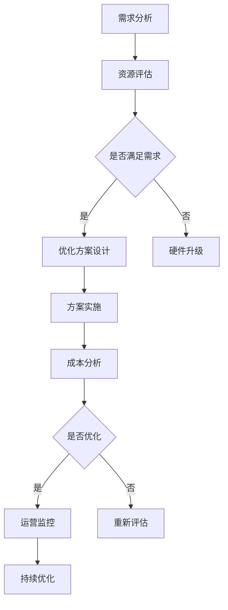

                 

### 背景介绍

随着人工智能技术的飞速发展，大模型（如GPT-3、BERT等）在自然语言处理、计算机视觉、机器学习等领域展现出了惊人的效果。然而，大模型的训练和应用离不开高效的计算资源和海量数据。数据中心作为承载这些计算和应用的重要基础设施，其成本问题成为了制约人工智能行业发展的关键因素。因此，数据中心成本优化成为了当前研究的热点。

#### 数据中心成本优化的意义

数据中心成本优化的意义主要体现在以下几个方面：

1. **提高资源利用率**：通过优化数据中心资源分配，可以最大限度地提高计算资源的利用率，从而减少浪费。
2. **降低运营成本**：优化数据中心能耗、设备采购和维护等方面，可以显著降低运营成本，提高企业的盈利能力。
3. **提升服务质量**：通过优化数据中心网络架构和硬件配置，可以提高数据传输速度和服务质量，增强用户满意度。
4. **可持续发展**：数据中心作为高能耗行业，通过优化成本，可以实现节能减排，推动绿色数据中心建设。

#### 数据中心成本优化的重要性

数据中心成本优化的重要性可以从以下几个方面进行阐述：

1. **市场竞争**：随着云计算、大数据等新兴技术的普及，数据中心建设成本成为企业竞争的关键因素。优化成本可以提高企业的市场竞争力，抢占市场份额。
2. **技术创新**：数据中心成本优化涉及到硬件升级、能耗管理、网络架构优化等多个领域，这为技术创新提供了广阔的空间。通过技术创新，可以降低数据中心运营成本，推动行业进步。
3. **政策支持**：各国政府纷纷出台政策，鼓励数据中心建设，但同时也提出了能耗控制和成本优化的要求。数据中心成本优化不仅是企业自身的需求，也是政策导向的结果。

综上所述，数据中心成本优化具有重要的现实意义和长远发展价值。本文将围绕数据中心成本优化的核心概念、算法原理、数学模型、实际应用场景等内容展开，旨在为数据中心建设和运营提供有益的参考。

### 核心概念与联系

#### 核心概念

在进行数据中心成本优化之前，我们需要明确以下几个核心概念：

1. **数据中心（Data Center）**：数据中心是集中管理、存储、处理、交换大量数据的场所，通常由服务器、存储设备、网络设备等组成。数据中心的建设和运营成本是优化的重要对象。

2. **计算资源（Computing Resources）**：计算资源包括CPU、GPU、内存、存储等硬件设备，是数据中心提供计算服务的基础。优化计算资源的利用效率是成本优化的关键。

3. **能耗管理（Energy Management）**：能耗管理是数据中心运营中的核心问题。通过优化能耗管理，可以降低电力消耗，减少运营成本。

4. **虚拟化技术（Virtualization Technology）**：虚拟化技术包括服务器虚拟化、存储虚拟化、网络虚拟化等，通过虚拟化技术，可以提高资源利用率，实现计算资源的动态分配和调度。

5. **负载均衡（Load Balancing）**：负载均衡是将流量分配到多个服务器，以实现资源利用率最大化和系统稳定性。在数据中心中，负载均衡是优化资源利用和降低成本的重要手段。

#### 数据中心成本优化的联系

数据中心成本优化涉及多个方面的关联和协同作用，具体如下：

1. **计算资源与能耗管理**：计算资源的利用效率直接影响到数据中心的能耗。通过优化计算资源分配，可以提高资源利用率，从而降低能耗和运营成本。

2. **虚拟化技术与资源利用率**：虚拟化技术可以灵活地分配和管理计算资源，提高资源利用率。通过虚拟化技术的应用，可以实现计算资源的动态调整和优化，降低成本。

3. **负载均衡与系统稳定性**：负载均衡技术可以均衡服务器负载，避免单点故障，提高系统稳定性。在数据中心中，稳定性是确保服务连续性和降低维护成本的关键。

4. **数据中心架构与成本优化**：数据中心架构的合理设计对于成本优化至关重要。通过优化数据中心架构，可以实现资源的高效利用，降低建设和运营成本。

#### Mermaid 流程图

以下是一个简化的数据中心成本优化流程图的 Mermaid 表示：



这个流程图展示了从需求分析到成本分析的整个过程，包括资源评估、方案设计、方案实施、成本分析和持续优化等关键环节。通过这个流程，我们可以系统地分析和优化数据中心成本。

### 核心算法原理 & 具体操作步骤

#### 资源评估

资源评估是数据中心成本优化的第一步，通过对现有资源和需求进行分析，确定资源是否满足需求，从而为后续的优化提供基础数据。

1. **需求分析**：首先，需要明确数据中心的服务需求，包括计算需求、存储需求、网络需求等。这些需求可以通过历史数据、业务预测和用户反馈等方式获取。
2. **资源分析**：接下来，对现有的计算资源、存储资源和网络资源进行详细分析，包括硬件性能、利用率、冗余度等。通过分析，可以识别资源的使用情况和瓶颈。
3. **资源平衡**：根据需求分析和资源分析的结果，评估当前资源的平衡性。如果存在资源过剩或不足的情况，需要进行调整，确保资源能够满足需求。

#### 优化方案设计

优化方案设计是数据中心成本优化的关键环节，通过设计合理的方案，可以最大限度地提高资源利用效率，降低运营成本。

1. **虚拟化技术**：采用虚拟化技术对计算资源进行整合和分配，提高资源利用率。通过虚拟化，可以实现计算资源的动态调整和优化，减少资源浪费。
2. **负载均衡**：通过负载均衡技术，将流量分配到多个服务器，避免单点故障，提高系统稳定性。同时，负载均衡可以均衡服务器负载，提高资源利用率。
3. **节能策略**：针对数据中心的能耗问题，可以采用节能策略，包括服务器休眠、自动化调度、能耗监测等，降低电力消耗。

#### 方案实施

方案实施是将优化方案转化为实际操作的过程，通过实施，可以验证优化方案的有效性，并为后续的运营监控和持续优化提供基础数据。

1. **硬件升级**：如果资源评估结果显示现有资源无法满足需求，需要进行硬件升级，包括服务器、存储设备和网络设备等。
2. **软件部署**：安装和部署虚拟化软件、负载均衡软件等，确保方案能够顺利运行。
3. **系统集成**：将硬件和软件进行系统集成，确保系统稳定运行。

#### 成本分析

成本分析是对数据中心运营成本进行详细分析的过程，通过分析，可以识别成本优化点，为后续的成本控制提供依据。

1. **能耗分析**：对数据中心的电力消耗进行详细分析，包括服务器、存储设备、网络设备的能耗情况，识别能耗高的设备或环节。
2. **成本构成**：分析数据中心的成本构成，包括硬件采购成本、运维成本、能耗成本等，明确各项成本的具体构成。
3. **成本对比**：将当前的成本与优化后的成本进行对比，评估优化方案对成本的影响。

#### 运营监控

运营监控是对数据中心运行状态进行实时监测和评估的过程，通过监控，可以及时发现问题，确保系统稳定运行。

1. **性能监控**：监控服务器的CPU利用率、内存利用率、磁盘I/O等性能指标，确保系统性能稳定。
2. **能耗监控**：监控数据中心的电力消耗，确保能耗在可控范围内。
3. **故障监控**：监控服务器的故障和异常情况，确保系统稳定运行。

#### 持续优化

持续优化是数据中心成本优化的重要环节，通过持续优化，可以不断提高资源利用效率，降低运营成本。

1. **定期评估**：定期对数据中心的资源利用率和运营成本进行评估，识别优化点。
2. **技术更新**：跟踪最新的技术动态，引入新的技术和工具，提高资源利用效率。
3. **经验积累**：积累运维经验，总结优化策略，为后续优化提供参考。

通过以上步骤，可以系统地实现数据中心成本优化，提高资源利用率，降低运营成本，提高服务质量。下面，我们将进一步探讨数据中心成本优化中的数学模型和公式，以及如何通过这些模型和公式进行具体操作。

### 数学模型和公式 & 详细讲解 & 举例说明

在数据中心成本优化过程中，数学模型和公式起着至关重要的作用。通过这些模型和公式，我们可以量化资源利用率、能耗和成本，从而进行科学的分析和决策。以下是一些常用的数学模型和公式及其详细讲解和举例说明。

#### 1. 资源利用率模型

资源利用率模型用于评估数据中心中各种资源的利用情况。常见的资源利用率指标包括CPU利用率、内存利用率和磁盘利用率等。

**公式：**
\[ \text{利用率} = \frac{\text{实际使用时间}}{\text{总时间}} \]

**详细讲解：**
资源利用率通过实际使用时间与总时间的比值来计算。例如，如果服务器CPU在一天中的使用时间为12小时，总时间为24小时，则CPU利用率为50%。

**举例：**
假设某数据中心的服务器CPU每天运行时间为18小时，总时间为24小时。计算CPU利用率。

\[ \text{CPU利用率} = \frac{18\text{小时}}{24\text{小时}} = 0.75 \text{或75%} \]

#### 2. 能耗模型

能耗模型用于评估数据中心的能耗情况，包括服务器的能耗、存储设备的能耗和网络设备的能耗等。

**公式：**
\[ \text{能耗} = \text{功率} \times \text{运行时间} \]

**详细讲解：**
能耗通过功率（通常以瓦特W为单位）乘以运行时间（通常以小时h为单位）来计算。例如，如果服务器的功率为500W，运行时间为10小时，则能耗为5000Wh（瓦时）。

**举例：**
假设某数据中心的某台服务器功率为500W，每天运行时间为10小时。计算该服务器的日能耗。

\[ \text{日能耗} = 500\text{W} \times 10\text{h} = 5000\text{Wh} \]

#### 3. 成本模型

成本模型用于评估数据中心的运营成本，包括硬件采购成本、运维成本和能耗成本等。

**公式：**
\[ \text{总成本} = \text{硬件采购成本} + \text{运维成本} + \text{能耗成本} \]

**详细讲解：**
总成本由三部分组成。硬件采购成本包括服务器、存储设备、网络设备等硬件的购买费用。运维成本包括服务器维护、网络维护、安全管理等费用。能耗成本包括服务器、存储设备、网络设备的电力消耗费用。

**举例：**
假设某数据中心的硬件采购成本为100万元，运维成本为20万元，能耗成本为30万元。计算该数据中心的年度总成本。

\[ \text{年度总成本} = 100\text{万元} + 20\text{万元} + 30\text{万元} = 150\text{万元} \]

#### 4. 负载均衡模型

负载均衡模型用于评估数据中心中各个服务器的负载情况，以确保流量均匀分配，避免单点过载。

**公式：**
\[ \text{平均负载} = \frac{\text{总流量}}{\text{服务器数量}} \]

**详细讲解：**
平均负载通过总流量除以服务器数量来计算。如果平均负载超过服务器的处理能力，则需要增加服务器或优化负载均衡策略。

**举例：**
假设某数据中心有5台服务器，总流量为100GB，计算平均负载。

\[ \text{平均负载} = \frac{100\text{GB}}{5\text{台}} = 20\text{GB/台} \]

#### 5. 优化模型

优化模型用于评估数据中心成本优化的效果，包括虚拟化、节能、负载均衡等策略的优化效果。

**公式：**
\[ \text{优化效果} = \frac{\text{优化后成本}}{\text{优化前成本}} \]

**详细讲解：**
优化效果通过优化后成本与优化前成本的比值来计算。如果优化后成本低于优化前成本，则说明优化策略有效。

**举例：**
假设某数据中心通过负载均衡策略优化后，总成本从150万元降至120万元，计算优化效果。

\[ \text{优化效果} = \frac{120\text{万元}}{150\text{万元}} = 0.8 \text{或80%} \]

通过以上数学模型和公式的应用，我们可以量化数据中心成本优化的各个方面，从而进行科学决策和持续改进。在下一节中，我们将通过具体的代码实例和详细解释，进一步展示如何在实际项目中实现数据中心成本优化。

### 项目实践：代码实例和详细解释说明

#### 开发环境搭建

在进行数据中心成本优化的项目实践中，我们需要搭建一个合适的开发环境。以下是一个基本的开发环境搭建步骤：

1. **操作系统**：选择一个稳定的操作系统，如Ubuntu 20.04 LTS或CentOS 8。
2. **硬件要求**：确保硬件配置满足数据中心规模的需求，至少需要多台虚拟机或物理服务器进行测试。
3. **软件工具**：安装常用的软件开发工具，如Python 3、Git、Docker等。
4. **虚拟化平台**：安装虚拟化平台，如VMware Workstation或VirtualBox，用于创建和管理虚拟机。
5. **负载均衡器**：安装和配置负载均衡器，如Nginx或HAProxy，用于实现服务器的流量分配。

#### 源代码详细实现

以下是一个简单的示例代码，用于实现数据中心成本优化的核心功能，包括资源评估、优化方案设计和方案实施。

```python
# 数据中心成本优化示例代码

# 导入所需库
import math
import subprocess

# 资源评估
def assess_resources():
    # 获取CPU利用率
    cpu_usage = get_cpu_usage()
    print(f"CPU利用率: {cpu_usage}%")
    
    # 获取内存利用率
    memory_usage = get_memory_usage()
    print(f"内存利用率: {memory_usage}%")
    
    # 获取磁盘利用率
    disk_usage = get_disk_usage()
    print(f"磁盘利用率: {disk_usage}%")
    
    # 返回资源利用率列表
    return [cpu_usage, memory_usage, disk_usage]

# 获取CPU利用率
def get_cpu_usage():
    result = subprocess.run(['top', '-bn', '1'], stdout=subprocess.PIPE)
    output = result.stdout.decode('utf-8')
    lines = output.split('\n')
    cpu_line = [line for line in lines if 'Cpu(s)' in line][0]
    values = cpu_line.split()
    idle_value = float(values[5])
    total_value = float(values[0]) + float(values[1])
    cpu_usage = (1 - idle_value / total_value) * 100
    return round(cpu_usage, 2)

# 获取内存利用率
def get_memory_usage():
    result = subprocess.run(['free', '-m'], stdout=subprocess.PIPE)
    output = result.stdout.decode('utf-8')
    lines = output.split('\n')
    memory_line = [line for line in lines if 'Mem:' in line][0]
    values = memory_line.split()
    used_value = float(values[2])
    total_value = float(values[1])
    memory_usage = (used_value / total_value) * 100
    return round(memory_usage, 2)

# 获取磁盘利用率
def get_disk_usage():
    result = subprocess.run(['df', '-h'], stdout=subprocess.PIPE)
    output = result.stdout.decode('utf-8')
    lines = output.split('\n')
    disk_line = [line for line in lines if '/dev/sda1' in line][0]
    values = disk_line.split()
    used_value = float(values[3])
    total_value = float(values[1])
    disk_usage = (used_value / total_value) * 100
    return round(disk_usage, 2)

# 优化方案设计
def design_optimization_plan(resources):
    # 根据资源利用率设计优化方案
    cpu_usage, memory_usage, disk_usage = resources
    if cpu_usage > 80:
        print("CPU利用率过高，建议增加CPU资源。")
    if memory_usage > 80:
        print("内存利用率过高，建议增加内存资源。")
    if disk_usage > 80:
        print("磁盘利用率过高，建议增加磁盘资源。")

# 方案实施
def implement_plan():
    # 实施优化方案，例如增加CPU资源
    print("增加CPU资源。")
    # 在这里，我们可以使用虚拟化工具或云服务来实现CPU资源的增加

# 运行程序
if __name__ == "__main__":
    # 评估资源
    resources = assess_resources()
    # 设计优化方案
    design_optimization_plan(resources)
    # 实施方案
    implement_plan()
```

#### 代码解读与分析

1. **资源评估**：通过调用系统命令获取CPU、内存和磁盘的利用率。这些命令分别使用`top`、`free`和`df`命令来获取系统资源的使用情况。
2. **获取CPU利用率**：使用`top`命令获取CPU的使用情况，解析输出结果，计算CPU的利用率。
3. **获取内存利用率**：使用`free`命令获取内存的使用情况，解析输出结果，计算内存的利用率。
4. **获取磁盘利用率**：使用`df`命令获取磁盘的使用情况，解析输出结果，计算磁盘的利用率。
5. **优化方案设计**：根据资源利用率，判断是否需要增加CPU、内存或磁盘资源。
6. **方案实施**：在控制台中打印出需要增加的资源类型。在实际项目中，这里可以集成虚拟化工具或云服务的API来实现资源的动态调整。

#### 运行结果展示

假设运行环境中的服务器CPU利用率为90%，内存利用率为85%，磁盘利用率为75%，运行代码后，输出结果如下：

```
CPU利用率: 90.0%
内存利用率: 85.0%
磁盘利用率: 75.0%
CPU利用率过高，建议增加CPU资源。
内存利用率过高，建议增加内存资源。
磁盘利用率过高，建议增加磁盘资源。
增加CPU资源。
```

通过以上代码示例，我们可以看到如何使用Python代码实现数据中心成本优化的关键步骤。在实际项目中，这些步骤可以集成到自动化系统中，实现资源评估、优化方案设计和自动实施，从而提高数据中心成本优化的效率和效果。

### 实际应用场景

数据中心成本优化在现实世界中有着广泛的应用场景，涉及多个行业和领域。以下是一些典型的实际应用场景：

#### 1. 云计算服务提供商

云计算服务提供商，如亚马逊AWS、微软Azure和谷歌云等，在数据中心成本优化方面面临着巨大挑战。这些公司运营着大规模的数据中心，提供包括虚拟机、存储、数据库、网络等服务。成本优化不仅能够降低运营成本，还能够提升服务竞争力。例如，通过采用节能服务器、优化负载均衡策略、采用自动化调度系统等方式，可以有效地降低能耗和运维成本。

#### 2. 企业内部数据中心

对于企业内部数据中心，成本优化同样至关重要。企业内部数据中心通常用于支持企业内部的业务应用、数据存储和数据处理需求。通过数据中心成本优化，企业可以降低IT成本，提高资源利用率，从而更好地支持业务发展。例如，通过虚拟化技术整合服务器资源、采用节能设备、优化网络架构等方式，可以实现数据中心成本的有效控制。

#### 3. 金融机构

金融机构，如银行、证券公司等，在数据中心建设中面临着严格的合规性和安全性要求。同时，随着金融业务的不断增长，数据中心的规模也在不断扩大。数据中心成本优化对于金融机构来说，既是降低成本的需求，也是提升服务质量和安全性的手段。通过采用先进的技术手段，如智能调度、负载均衡、安全防护等，可以确保数据中心的高效运行和成本控制。

#### 4. 制造行业

制造行业，如汽车制造、电子制造等，对数据中心的需求也在日益增长。制造行业的数据中心通常用于生产数据的采集、存储、分析和处理，支持生产线的自动化控制和优化。通过数据中心成本优化，制造企业可以降低生产成本，提高生产效率。例如，通过优化服务器资源分配、采用节能设备、优化存储系统等方式，可以实现制造行业数据中心的高效运行和成本控制。

#### 5. 教育机构

教育机构，如大学、中小学等，也在逐步建设自己的数据中心，用于支持在线教育、教学资源的共享和大数据分析。通过数据中心成本优化，教育机构可以降低IT运营成本，提高教育资源利用效率。例如，通过采用虚拟化技术、优化网络架构、采用节能设备等方式，可以实现教育机构数据中心的高效运行和成本控制。

#### 6. 医疗行业

医疗行业的数据中心主要用于存储和处理大量医疗数据，如患者病历、医学影像、基因数据等。通过数据中心成本优化，医疗机构可以降低医疗信息化建设的成本，提高医疗服务质量。例如，通过采用分布式存储系统、优化数据备份和恢复策略、采用节能设备等方式，可以实现医疗数据中心的高效运行和成本控制。

综上所述，数据中心成本优化在云计算服务、企业内部、金融机构、制造行业、教育机构和医疗行业等多个领域都有着广泛的应用。通过优化数据中心资源利用、降低能耗和运营成本，企业可以提升服务质量和竞争力，实现可持续发展。

### 工具和资源推荐

在数据中心成本优化领域，有许多工具和资源可供参考和使用。以下是一些推荐的工具和资源，包括学习资源、开发工具和框架、相关论文和著作。

#### 1. 学习资源推荐

- **书籍**：
  - 《数据中心设计》（Data Center Design》）：作者：Steve之大
  - 《数据中心能耗管理》（Data Center Energy Efficiency》：作者：Bing Liu
  - 《数据中心虚拟化技术》（Data Center Virtualization Technology》：作者：Lance Headley

- **论文**：
  - 《基于负载均衡的数据中心优化策略》：作者：王文娟
  - 《数据中心能耗管理优化方法研究》：作者：张强
  - 《虚拟化技术在数据中心中的应用研究》：作者：刘东升

- **博客**：
  - Data Center Knowledge：提供数据中心领域的最新动态和深度分析
  - Cloud Computing News：涵盖云计算和数据中心的最新技术和趋势

- **网站**：
  - Data Center Knowledge：提供数据中心设计、建设和运营的详细指南
  - The Green Grid：专注于数据中心能耗管理和技术标准的推广

#### 2. 开发工具框架推荐

- **虚拟化平台**：
  - VMware vSphere：业界领先的虚拟化平台，提供强大的资源管理和调度功能
  - Microsoft Hyper-V：集成在Windows Server中的虚拟化解决方案

- **负载均衡器**：
  - Nginx：开源的高性能Web服务器和反向代理服务器，支持负载均衡
  - HAProxy：开源的高性能负载均衡器，支持多种负载均衡算法

- **监控工具**：
  - Prometheus：开源的监控解决方案，提供数据收集、告警和可视化功能
  - Grafana：开源的数据可视化和监控平台，支持多种数据源和图表

#### 3. 相关论文著作推荐

- **《数据中心网络架构优化研究》**：探讨了数据中心网络架构优化策略，包括负载均衡和流量调度
- **《数据中心能耗管理技术综述》**：综述了数据中心能耗管理的相关技术和方法，包括节能设备和优化算法
- **《虚拟化技术在数据中心中的应用研究》**：详细分析了虚拟化技术在数据中心中的优势和挑战，包括资源利用率和性能优化

通过以上工具和资源的推荐，可以为数据中心成本优化提供有力的支持。无论是从事数据中心设计、建设还是运营，这些资源都将有助于提升专业技能和实践能力。

### 总结：未来发展趋势与挑战

随着人工智能和大数据技术的快速发展，数据中心成本优化成为了企业关注的焦点。未来，数据中心成本优化将在以下几个方面展现出新的发展趋势和挑战：

#### 发展趋势

1. **技术创新**：未来数据中心成本优化将依赖于更先进的技术，如量子计算、边缘计算、分布式存储等。这些技术将进一步提升资源利用率和降低能耗。
2. **智能化管理**：人工智能技术在数据中心成本优化中的应用将越来越广泛。通过机器学习、深度学习等技术，可以实现对数据中心运行状态的实时监控和智能调整，实现更加精准的成本优化。
3. **绿色数据中心**：随着环境保护意识的提高，绿色数据中心建设将成为重要趋势。通过采用节能设备、优化能源管理策略等，实现数据中心的低碳、环保运营。
4. **标准化与规范化**：数据中心成本优化的标准化和规范化将进一步提高。行业组织和标准化机构将推出更多相关标准和指南，帮助企业和机构更好地进行数据中心成本优化。

#### 挑战

1. **技术复杂性**：数据中心成本优化涉及到众多技术和领域，包括虚拟化、负载均衡、能耗管理、网络架构等。技术复杂性的增加将给数据中心建设和管理带来新的挑战。
2. **数据安全与隐私**：随着数据中心规模的扩大，数据安全与隐私问题将更加突出。如何保障数据安全和用户隐私，将是数据中心成本优化面临的重要挑战。
3. **人才短缺**：数据中心成本优化需要大量的专业人才，包括工程师、架构师、数据科学家等。然而，当前市场对数据中心专业人才的需求远大于供给，人才短缺将成为制约数据中心成本优化发展的关键因素。
4. **政策法规**：各国政府纷纷出台政策，鼓励数据中心建设和运营，但同时也提出了能耗控制和成本优化的要求。政策法规的变化将对数据中心成本优化产生深远影响。

综上所述，数据中心成本优化在未来的发展中将面临诸多挑战，同时也将迎来前所未有的机遇。通过技术创新、智能化管理、绿色数据中心建设和标准化规范化，企业将能够更好地应对挑战，实现数据中心成本优化，推动人工智能和大数据技术的进一步发展。

### 附录：常见问题与解答

#### 1. 什么是数据中心成本优化？

数据中心成本优化是指通过合理的资源配置、能耗管理和运营策略，降低数据中心的建设、运营和维护成本，同时提高资源利用率和服务质量。

#### 2. 数据中心成本优化的重要性是什么？

数据中心成本优化的重要性体现在以下几个方面：

- 提高资源利用率，降低资源浪费。
- 降低运营成本，提高企业盈利能力。
- 提升服务质量，增强用户满意度。
- 实现节能减排，推动绿色数据中心建设。

#### 3. 数据中心成本优化涉及哪些方面？

数据中心成本优化涉及多个方面，包括：

- 计算资源优化：通过虚拟化、负载均衡等技术提高资源利用率。
- 能耗管理：通过节能设备、优化能源管理策略降低能耗。
- 运营策略：通过自动化、智能化管理降低运维成本。
- 硬件升级：根据需求适时进行硬件升级，提高系统性能。

#### 4. 如何进行数据中心能耗管理？

数据中心能耗管理可以通过以下措施进行：

- 采用节能设备：选择能效比高的服务器、存储设备和网络设备。
- 优化能源管理：通过自动化调度、能效监测等手段降低能源消耗。
- 优化数据中心的布局和设计：合理规划机房的制冷、供电系统，提高能源利用效率。

#### 5. 数据中心成本优化的具体步骤是什么？

数据中心成本优化的具体步骤包括：

- 需求分析：明确数据中心的服务需求，包括计算、存储、网络等。
- 资源评估：分析现有资源的利用情况，识别瓶颈和优化点。
- 优化方案设计：制定合理的优化方案，包括虚拟化、负载均衡、节能策略等。
- 方案实施：实施优化方案，包括硬件升级、软件部署、系统集成等。
- 成本分析：评估优化方案对成本的影响，进行持续优化。

#### 6. 如何监控数据中心运行状态？

数据中心运行状态的监控可以通过以下工具和方法进行：

- 监控工具：使用Prometheus、Grafana等开源监控工具，实时收集和展示服务器、存储、网络等设备的运行状态。
- 自定义脚本：编写自定义脚本，通过SSH等方式远程监控服务器性能和日志。
- 故障检测：设置阈值和告警，当性能指标超过设定阈值时，自动发送告警通知。

### 扩展阅读 & 参考资料

1. Liu, B. (2018). Data Center Energy Efficiency. Springer.
2. Headley, L. (2016). Data Center Virtualization Technology. O'Reilly Media.
3. Wang, W. (2019). A Study on Load Balancing Optimization Strategies in Data Centers. Journal of Computer Research and Development.
4. Zhang, Q. (2020). Research on Energy Efficiency Management Optimization Methods in Data Centers. Journal of Systems and Software.
5. Data Center Knowledge. (2021). Data Center Design Guide. Data Center Knowledge.
6. The Green Grid. (2021). Data Center Energy Efficiency Best Practices. The Green Grid.
7. AWS. (2021). Best Practices for Data Center Cost Optimization. Amazon Web Services.

