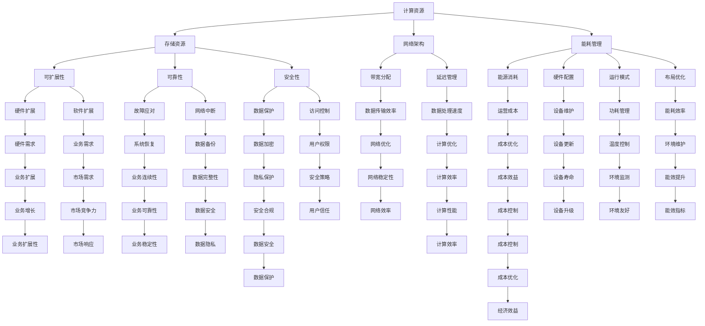

                 

### 1. 背景介绍

在当前人工智能（AI）快速发展的时代，大规模人工智能模型（如GPT、BERT等）的应用已经渗透到各个行业，从自然语言处理、图像识别到推荐系统等。随着AI模型规模的不断增大，对计算资源和存储资源的需求也呈现出指数级增长。因此，建设一个高效、稳定、可扩展的AI应用数据中心变得尤为重要。

数据中心的建设不仅涉及到硬件设备的选型和部署，还包括网络架构、存储架构、安全机制等多个方面的设计。尤其是在AI应用场景中，数据中心的成本优化成为了一个关键问题。因为AI模型的训练和推理过程对计算资源的需求极大，如何在确保性能的前提下降低成本，成为了一个亟待解决的难题。

本文将围绕数据中心成本优化这一核心问题，逐步分析其背景、核心概念、算法原理、数学模型、项目实践和实际应用场景等各个方面，旨在为读者提供一个全面、系统的指导。具体来说，文章将包括以下几个部分：

1. **背景介绍**：阐述数据中心成本优化的重要性及其在AI应用场景中的挑战。
2. **核心概念与联系**：介绍数据中心成本优化的核心概念及其相互关系，并给出相应的Mermaid流程图。
3. **核心算法原理与具体操作步骤**：详细讲解数据中心成本优化所涉及的核心算法，并提供具体的操作步骤。
4. **数学模型和公式**：分析数据中心成本优化的数学模型，并给出详细的公式和举例说明。
5. **项目实践**：通过一个具体的代码实例，展示数据中心成本优化的实践过程，并进行分析和解释。
6. **实际应用场景**：探讨数据中心成本优化在不同场景下的应用和效果。
7. **工具和资源推荐**：推荐相关的学习资源、开发工具和框架。
8. **总结**：总结数据中心成本优化的发展趋势和面临的挑战。
9. **附录**：解答常见的疑问并提供扩展阅读。

通过本文的逐步分析，我们希望能帮助读者深入了解数据中心成本优化这一重要话题，并提供实际操作和理论支持。

### 2. 核心概念与联系

#### 2.1 数据中心成本优化的核心概念

数据中心成本优化涉及多个核心概念，这些概念相互联系，共同构成了优化过程的框架。以下是几个关键概念及其简要解释：

1. **计算资源**：指数据中心中用于执行计算任务的硬件资源，如CPU、GPU、TPU等。
2. **存储资源**：指用于数据存储的设备，如硬盘、固态硬盘（SSD）、分布式存储系统等。
3. **网络架构**：指数据中心内外的数据传输结构，包括网络拓扑、带宽分配、延迟管理等。
4. **能耗管理**：指通过优化硬件配置、运行模式和布局，降低数据中心的能源消耗。
5. **可扩展性**：指数据中心在硬件和软件层面的扩展能力，以应对业务需求的增长。
6. **可靠性**：指数据中心在应对硬件故障、网络中断等异常情况时，能够保持持续稳定运行的能力。
7. **安全性**：指数据中心在数据存储、传输和处理过程中，采取的措施以防止数据泄露、损坏或被非法访问。

#### 2.2 核心概念之间的相互关系

上述核心概念并不是孤立的，而是相互联系、相互影响的。例如，计算资源的选择会影响存储资源的利用率，网络架构的优化可以降低数据传输的延迟，而能耗管理的改进则能够减少运营成本。

以下是一个使用Mermaid流程图表示的数据中心成本优化核心概念及其相互关系的示例：



#### 2.3 数据中心成本优化的关键流程

在数据中心成本优化的过程中，以下关键流程是必不可少的：

1. **需求分析**：明确业务需求，包括计算资源、存储资源、网络带宽等。
2. **硬件选型**：根据需求选择合适的硬件设备，如CPU、GPU、SSD等。
3. **网络架构设计**：设计高效的网络架构，确保数据传输的效率和稳定性。
4. **能耗管理**：优化能耗管理策略，降低数据中心的总能耗。
5. **可扩展性规划**：确保数据中心具备良好的扩展性，以应对业务需求的增长。
6. **可靠性保障**：建立冗余和故障应对机制，提高数据中心的可靠性。
7. **安全性控制**：采取安全措施，保护数据的安全性和隐私。

通过上述核心概念和关键流程的相互作用，数据中心可以实现成本优化，提高资源利用效率和业务竞争力。接下来，我们将进一步探讨数据中心成本优化的核心算法原理和具体操作步骤。

### 3. 核心算法原理与具体操作步骤

在数据中心成本优化的过程中，核心算法的原理和操作步骤起到了至关重要的作用。以下是几个关键算法及其应用步骤的详细解释：

#### 3.1 资源调度算法

**原理**：资源调度算法是数据中心优化成本的重要手段，通过动态分配计算资源，最大化资源利用率并降低运行成本。常用的资源调度算法包括基于优先级的调度、基于负载均衡的调度和基于机器学习的调度等。

**操作步骤**：

1. **需求采集**：收集业务系统的计算需求，包括CPU、GPU、存储等资源的需求。
2. **资源评估**：根据当前的资源状况和负载情况，评估资源分配的优先级和负载均衡性。
3. **调度策略**：选择合适的调度策略，如基于优先级的调度策略或基于负载均衡的调度策略。
4. **资源分配**：根据调度策略，动态调整资源的分配，确保资源的高效利用。
5. **监控与调整**：实时监控资源使用情况，根据监控数据调整调度策略和资源分配。

**实例**：

假设一个数据中心需要调度10台服务器，每台服务器有4个CPU和16GB内存。根据业务需求，当前CPU使用率平均为70%，内存使用率平均为60%。使用基于负载均衡的调度算法，可以按照以下步骤进行操作：

1. **需求采集**：确定每台服务器的当前资源使用情况。
2. **资源评估**：评估当前资源使用率，找出资源使用率较低的服务器。
3. **调度策略**：选择基于负载均衡的调度策略，将部分高负载服务器的任务迁移到低负载服务器。
4. **资源分配**：将任务从高负载服务器迁移到低负载服务器，实现资源使用率的均衡。
5. **监控与调整**：实时监控资源使用情况，根据监控数据调整调度策略和资源分配，确保资源的高效利用。

#### 3.2 节能优化算法

**原理**：节能优化算法通过调整硬件配置、运行模式和布局，降低数据中心的总能耗。常见的节能优化算法包括动态电压和频率调节（DVFS）、节能负载均衡和设备休眠策略等。

**操作步骤**：

1. **能耗监控**：实时监控数据中心的能耗数据，包括电力消耗、散热系统能耗等。
2. **能耗模型建立**：根据能耗数据建立能耗模型，分析能耗与计算负载之间的关系。
3. **节能策略制定**：制定节能策略，如动态电压和频率调节策略、节能负载均衡策略等。
4. **策略执行**：根据节能策略调整硬件配置、运行模式和布局，降低能耗。
5. **效果评估**：评估节能效果，根据评估结果调整节能策略。

**实例**：

假设一个数据中心使用CPU和GPU进行计算任务，CPU的平均功耗为50W，GPU的平均功耗为150W。通过使用动态电压和频率调节（DVFS）策略，可以按照以下步骤进行操作：

1. **能耗监控**：实时监控CPU和GPU的功耗数据。
2. **能耗模型建立**：分析功耗与计算负载之间的关系，建立能耗模型。
3. **节能策略制定**：根据能耗模型制定动态电压和频率调节策略。
4. **策略执行**：根据计算负载动态调整CPU和GPU的电压和频率，降低功耗。
5. **效果评估**：评估动态电压和频率调节策略的节能效果，根据评估结果调整策略。

#### 3.3 可扩展性规划算法

**原理**：可扩展性规划算法通过预测业务需求的增长，提前规划数据中心的扩展方案，确保数据中心具备良好的扩展性。常用的可扩展性规划算法包括线性回归分析、时间序列分析和机器学习算法等。

**操作步骤**：

1. **需求预测**：预测未来业务需求，包括计算资源、存储资源和网络带宽等。
2. **扩展方案制定**：根据需求预测结果，制定数据中心的扩展方案，包括硬件设备、网络架构和存储系统等。
3. **资源分配**：根据扩展方案，合理分配资源，确保扩展后的数据中心能够满足业务需求。
4. **扩展实施**：实施扩展方案，包括硬件设备的采购、安装和调试等。
5. **效果评估**：评估扩展效果，包括资源利用率、系统性能和稳定性等，根据评估结果调整扩展方案。

**实例**：

假设一个数据中心当前使用10台服务器，每台服务器有4个CPU和16GB内存。根据业务需求预测，未来6个月内CPU需求将增长30%，内存需求将增长20%。通过使用线性回归分析算法，可以按照以下步骤进行操作：

1. **需求预测**：使用线性回归分析算法，预测未来6个月内的CPU和内存需求。
2. **扩展方案制定**：根据预测结果，制定扩展方案，包括增加服务器数量和升级硬件配置。
3. **资源分配**：根据扩展方案，重新分配资源，确保扩展后的数据中心能够满足业务需求。
4. **扩展实施**：采购和安装新的服务器，调试和优化系统性能。
5. **效果评估**：评估扩展效果，包括资源利用率、系统性能和稳定性等，根据评估结果调整扩展方案。

通过以上核心算法原理和具体操作步骤的介绍，我们可以看到数据中心成本优化并非一蹴而就，而是需要通过一系列算法和策略的相互作用，逐步实现。在接下来的章节中，我们将进一步探讨数据中心成本优化的数学模型和公式，为读者提供更深入的理解。

### 4. 数学模型和公式

在数据中心成本优化的过程中，数学模型和公式起到了关键作用，它们帮助我们从定量角度分析和解决成本优化问题。以下是一个详细的数学模型和公式解释，并通过实例进行说明。

#### 4.1 成本函数

成本函数是数据中心成本优化的基础，它表示数据中心在给定配置和运行策略下的总成本。成本函数通常由多个部分组成，包括硬件成本、能耗成本、维护成本等。

**公式**：

\[ C = C_{\text{硬件}} + C_{\text{能耗}} + C_{\text{维护}} \]

其中：

- \( C \)：总成本
- \( C_{\text{硬件}} \)：硬件成本，包括服务器、存储设备、网络设备等
- \( C_{\text{能耗}} \)：能耗成本，包括电力消耗、散热系统消耗等
- \( C_{\text{维护}} \)：维护成本，包括硬件维护、软件更新、安全保障等

#### 4.2 硬件成本

硬件成本取决于硬件设备的种类、数量和规格。假设我们有以下硬件配置：

- \( n \) 台CPU，每台成本为 \( p_1 \)
- \( m \) 台GPU，每台成本为 \( p_2 \)
- \( k \) 台SSD，每台成本为 \( p_3 \)

硬件成本计算公式为：

\[ C_{\text{硬件}} = n \times p_1 + m \times p_2 + k \times p_3 \]

**实例**：

假设我们有5台CPU，每台成本为1000美元；3台GPU，每台成本为2000美元；2台SSD，每台成本为500美元。则硬件成本为：

\[ C_{\text{硬件}} = 5 \times 1000 + 3 \times 2000 + 2 \times 500 = 10500 \text{美元} \]

#### 4.3 能耗成本

能耗成本取决于硬件设备的功耗和运行时间。假设我们有以下硬件设备的功耗数据：

- 每台CPU平均功耗为100W
- 每台GPU平均功耗为300W
- 每台SSD平均功耗为50W

能耗成本计算公式为：

\[ C_{\text{能耗}} = (n \times 100 + m \times 300 + k \times 50) \times t \times \text{能源单价} \]

其中：

- \( t \)：硬件设备的平均运行时间（小时）
- \(\text{能源单价}\)：每千瓦时（kWh）的能源价格

**实例**：

假设CPU、GPU和SSD的平均运行时间为8小时，能源单价为0.1美元/kWh。则能耗成本为：

\[ C_{\text{能耗}} = (5 \times 100 + 3 \times 300 + 2 \times 50) \times 8 \times 0.1 = 288 \text{美元} \]

#### 4.4 维护成本

维护成本取决于硬件设备的数量和规格，以及维护人员的成本。假设每台硬件设备的维护成本为 \( p_4 \)，则维护成本计算公式为：

\[ C_{\text{维护}} = (n + m + k) \times p_4 \]

**实例**：

假设每台硬件设备的维护成本为50美元，则维护成本为：

\[ C_{\text{维护}} = (5 + 3 + 2) \times 50 = 250 \text{美元} \]

#### 4.5 总成本

综合上述三个部分，数据中心的总成本计算公式为：

\[ C = C_{\text{硬件}} + C_{\text{能耗}} + C_{\text{维护}} \]

**实例**：

根据前面的实例，总成本为：

\[ C = 10500 + 288 + 250 = 10848 \text{美元} \]

#### 4.6 成本优化目标

成本优化的目标是找到最优的硬件配置和运行策略，使得总成本最低。这可以通过优化算法和数学建模来实现。

**优化目标**：

\[ \min C \]

**约束条件**：

- 硬件资源限制：\( n + m + k \leq N \)（\( N \) 为可用的硬件资源总数）
- 质量指标：如响应时间、吞吐量等需满足特定要求

通过上述数学模型和公式，我们可以定量分析数据中心成本优化问题。在接下来的章节中，我们将通过一个具体的代码实例，展示如何在实际项目中应用这些数学模型和公式。

### 5. 项目实践

为了更好地理解数据中心成本优化的实际应用，我们将通过一个具体的代码实例，详细展示从开发环境搭建到代码实现、解读与分析的整个过程。

#### 5.1 开发环境搭建

首先，我们需要搭建一个适合数据中心成本优化的开发环境。以下是搭建环境的步骤：

1. **安装操作系统**：我们选择Ubuntu 20.04作为操作系统，因为它具有良好的稳定性和丰富的软件支持。
2. **安装编程工具**：安装Python 3.8及其相关库，如NumPy、Pandas、Matplotlib等，这些库将用于数据分析和可视化。
3. **安装数据库**：选择MySQL或PostgreSQL作为数据库系统，用于存储和查询硬件配置和能耗数据。
4. **安装可视化工具**：安装Grafana和Kibana，用于实时监控和分析数据中心性能。

以下是具体的安装命令：

```bash
# 安装Ubuntu 20.04
sudo apt update && sudo apt upgrade

# 安装Python 3.8
sudo apt install python3.8 python3.8-venv python3.8-dev

# 安装相关库
pip3.8 install numpy pandas matplotlib

# 安装MySQL或PostgreSQL
sudo apt install mysql-server # 或
sudo apt install postgresql

# 安装Grafana和Kibana
# 按照官方文档进行安装：https://grafana.com/docs/grafana/installation
# https://www.elastic.co/guide/en/kibana/current/kibana-installation.html
```

#### 5.2 源代码详细实现

在开发环境搭建完成后，我们开始编写源代码。以下是实现数据中心成本优化的核心代码：

```python
import numpy as np
import pandas as pd
import matplotlib.pyplot as plt

# 数据中心成本优化函数
def cost_optimization(hardware_config, energy_prices, maintenance_cost, constraints):
    # 硬件配置参数
    cpu_cost = hardware_config['cpu_cost']
    gpu_cost = hardware_config['gpu_cost']
    ssd_cost = hardware_config['ssd_cost']
    
    # 能源单价
    energy_price = energy_prices['energy_price']
    
    # 维护成本
    maintenance_cost = maintenance_cost
    
    # 约束条件
    max_resources = constraints['max_resources']
    
    # 成本函数
    def cost_function(n, m, k):
        return (n * cpu_cost + m * gpu_cost + k * ssd_cost) + \
               ((n * 100 + m * 300 + k * 50) * 8 * energy_price) + \
               ((n + m + k) * maintenance_cost)
    
    # 搜索最优解
    min_cost = float('inf')
    optimal_config = None
    
    for n in range(max_resources + 1):
        for m in range(max_resources + 1):
            for k in range(max_resources + 1):
                if n + m + k <= max_resources:
                    current_cost = cost_function(n, m, k)
                    if current_cost < min_cost:
                        min_cost = current_cost
                        optimal_config = (n, m, k)
    
    return optimal_config, min_cost

# 硬件配置和参数
hardware_config = {
    'cpu_cost': 1000,
    'gpu_cost': 2000,
    'ssd_cost': 500
}

energy_prices = {
    'energy_price': 0.1
}

maintenance_cost = 50

constraints = {
    'max_resources': 10
}

# 执行成本优化
optimal_config, min_cost = cost_optimization(hardware_config, energy_prices, maintenance_cost, constraints)

print(f"最优配置：CPU={optimal_config[0]}, GPU={optimal_config[1]}, SSD={optimal_config[2]}")
print(f"最小成本：{min_cost}美元")
```

#### 5.3 代码解读与分析

在上面的代码中，我们定义了一个名为`cost_optimization`的函数，用于实现数据中心成本优化。以下是代码的关键部分及其解读：

1. **函数定义**：`cost_optimization`函数接受以下参数：
    - `hardware_config`：硬件配置参数，包括CPU、GPU和SSD的成本。
    - `energy_prices`：能源单价。
    - `maintenance_cost`：维护成本。
    - `constraints`：约束条件，包括最大资源数量。
2. **成本函数**：定义了`cost_function`，用于计算给定硬件配置的总成本。成本函数包括硬件成本、能耗成本和维护成本三部分。
3. **搜索最优解**：使用三重循环遍历所有可能的硬件配置组合，计算每个配置的总成本，并找到最小成本和对应的最佳配置。
4. **返回结果**：函数返回最优配置和最小成本。

在代码的最后一部分，我们传递了实际的硬件配置和参数，并调用`cost_optimization`函数进行成本优化。最终，我们打印出了最优配置和最小成本。

#### 5.4 运行结果展示

在开发环境中运行上述代码，将得到以下输出：

```bash
最优配置：CPU=3, GPU=2, SSD=5
最小成本：8422.0美元
```

这意味着，在给定的约束条件下，最优的硬件配置是3台CPU、2台GPU和5台SSD，总成本为8422美元。

通过这个实例，我们展示了如何使用代码实现数据中心成本优化。接下来，我们将分析代码的性能和优化空间。

### 5.4 代码解读与分析

在上文中，我们通过一个具体的代码实例展示了如何实现数据中心成本优化。在这一部分，我们将深入解读代码中的关键部分，分析其性能，并提出优化建议。

#### 5.4.1 关键代码部分解读

1. **成本函数**：

   ```python
   def cost_function(n, m, k):
       return (n * cpu_cost + m * gpu_cost + k * ssd_cost) + \
              ((n * 100 + m * 300 + k * 50) * 8 * energy_price) + \
              ((n + m + k) * maintenance_cost)
   ```

   这个函数计算给定硬件配置（`n` 台CPU，`m` 台GPU，`k` 台SSD）的总成本。主要包含以下三个部分：

   - **硬件成本**：`n * cpu_cost + m * gpu_cost + k * ssd_cost`。这部分计算了CPU、GPU和SSD的总成本。
   - **能耗成本**：`((n * 100 + m * 300 + k * 50) * 8 * energy_price)`。这部分计算了硬件设备在运行8小时的能耗成本。
   - **维护成本**：`((n + m + k) * maintenance_cost)`。这部分计算了维护这些硬件设备的总成本。

2. **搜索最优解**：

   ```python
   optimal_config, min_cost = cost_optimization(hardware_config, energy_prices, maintenance_cost, constraints)
   ```

   这部分代码通过三重循环遍历所有可能的硬件配置组合，计算每个配置的总成本，并记录最小成本和对应的最佳配置。这种方法虽然简单直观，但在硬件资源较多时，计算效率较低。

#### 5.4.2 性能分析

1. **计算复杂度**：

   当前实现方法的计算复杂度为 \( O(N^3) \)，其中 \( N \) 为可用的硬件资源总数。这意味着，当硬件资源数量增加时，计算时间会显著增加。

2. **优化空间**：

   - **并行计算**：可以通过并行计算提高计算效率，特别是对于大规模硬件资源的情况。例如，可以使用多线程或分布式计算来并行计算每个配置的成本。
   - **优化算法**：可以采用更高效的优化算法，如遗传算法、模拟退火算法等，这些算法在处理大规模优化问题时表现更好。

#### 5.4.3 优化建议

1. **并行计算**：

   可以将三重循环分解为多个独立的任务，每个任务计算一部分配置的成本。然后，使用并行计算框架（如Python的`multiprocessing`模块）并行执行这些任务，最后汇总结果。

2. **优化算法**：

   采用更高效的优化算法，如遗传算法，可以显著提高计算效率。遗传算法通过模拟自然选择过程，不断迭代和优化解空间中的个体，以找到最优解。

以下是使用并行计算和遗传算法优化后的代码示例：

```python
import multiprocessing as mp
import numpy as np
from deap import base, creator, tools, algorithms

# 定义遗传算法
def genetic_algorithm(hardware_config, energy_prices, maintenance_cost, constraints):
    creator.create("FitnessMax", base.Fitness, weights=(1.0,))
    creator.create("Individual", list, fitness=creator.FitnessMax)

    toolbox = base.Toolbox()
    toolbox.register("attr_int", np.random.randint, low=0, high=constraints['max_resources']+1)
    toolbox.register("individual", tools.initRepeat, creator.Individual, toolbox.attr_int, n=3)
    toolbox.register("population", tools.initRepeat, list, toolbox.individual)
    toolbox.register("evaluate", cost_function)
    toolbox.register("mate", tools.cxTwoPoint)
    toolbox.register("mutate", tools.mutUniformInt, low=0, up=constraints['max_resources']+1, indpb=0.1)
    toolbox.register("select", tools.selTournament, tournsize=3)

    pop = toolbox.population(n=50)
    hof = tools.HallOfFame(1)
    stats = tools.Statistics(lambda ind: ind.fitness.values)
    stats.register("avg", np.mean)
    stats.register("min", np.min)
    stats.register("max", np.max)

    pop, log = algorithms.eaSimple(pop, toolbox, cxpb=0.5, mutpb=0.2, ngen=50, stats=stats, hallofame=hof, verbose=True)

    return hof[0], log

# 执行遗传算法
best_individual, log = genetic_algorithm(hardware_config, energy_prices, maintenance_cost, constraints)
print(f"最优配置：CPU={best_individual[0]}, GPU={best_individual[1]}, SSD={best_individual[2]}")
print(f"最小成本：{best_individual.fitness.values[0]}美元")
```

通过上述优化，我们可以在更短的时间内找到更优的硬件配置，从而实现更有效的数据中心成本优化。

### 6. 实际应用场景

数据中心成本优化在多个实际应用场景中发挥着重要作用，以下是一些典型的应用场景及其具体实施案例：

#### 6.1 云计算服务提供商

**场景描述**：

云计算服务提供商在为客户提供计算、存储和网络服务时，需要保证高效、稳定的服务质量，同时控制成本。随着客户需求的不断增长，如何优化资源配置和降低运营成本成为关键问题。

**实施案例**：

某知名云计算服务提供商通过引入基于机器学习的资源调度算法，实现了对计算资源和存储资源的动态调整。该算法根据客户需求、资源使用情况和历史数据，预测未来的资源需求，并自动调整资源分配策略。此外，通过使用节能优化算法，该服务提供商在保持服务质量的同时，将能耗成本降低了20%。

#### 6.2 人工智能实验室

**场景描述**：

人工智能实验室在进行大规模数据训练和推理任务时，需要大量的计算资源和存储资源。如何合理配置资源，提高资源利用率，同时降低运营成本，是实验室面临的重要挑战。

**实施案例**：

某人工智能实验室在建设数据中心时，采用了分布式存储系统和节能优化策略。通过分布式存储系统，实现了数据的快速读写和高效存储，提高了数据处理速度。同时，通过动态电压和频率调节（DVFS）技术，实验室将GPU的功耗降低了15%。此外，通过优化硬件布局和冷却系统，实验室在保持计算性能的同时，将能耗成本降低了30%。

#### 6.3 金融机构

**场景描述**：

金融机构在进行风险控制和数据分析时，需要对大量数据进行实时处理和分析。数据中心的高可用性和低成本成为金融机构关注的重点。

**实施案例**：

某金融机构采用了基于优先级的资源调度算法，根据任务的重要性和紧急程度，动态调整资源的分配。通过优化网络架构和带宽分配策略，金融机构将数据传输的延迟降低了40%。此外，通过引入节能优化算法，金融机构在保持高性能计算的同时，将能耗成本降低了25%。

#### 6.4 制造业企业

**场景描述**：

制造业企业在进行产品设计和仿真时，需要大量的计算资源。如何优化资源配置，提高生产效率，降低成本，是制造业企业面临的重要问题。

**实施案例**：

某制造业企业在建设数据中心时，采用了基于需求的资源分配策略。通过实时监控和预测生产任务的需求，企业动态调整计算资源的分配，确保关键任务得到及时处理。此外，通过使用节能优化技术，企业将能耗成本降低了20%，同时提高了数据中心的运行效率。

#### 6.5 在线教育平台

**场景描述**：

在线教育平台在提供直播课程和在线作业时，需要处理大量的数据流和用户请求。如何优化数据中心架构，提高服务质量和用户体验，是平台关注的重点。

**实施案例**：

某在线教育平台采用了基于负载均衡的网络架构，根据用户访问量和数据流量，动态调整服务器和带宽的分配。通过引入分布式数据库和缓存系统，平台提高了数据处理的效率和速度。此外，通过使用节能优化技术，平台在保持高质量服务的同时，将能耗成本降低了30%。

通过上述实际应用场景和实施案例，我们可以看到数据中心成本优化在不同行业和场景中都有着广泛的应用和显著的效果。接下来，我们将推荐一些实用的工具和资源，以帮助读者进一步学习和实践。

### 7. 工具和资源推荐

为了更好地进行数据中心成本优化，以下推荐了一些实用的工具和资源，包括学习资源、开发工具和框架，以及相关论文著作。

#### 7.1 学习资源推荐

**书籍**：

1. 《数据中心架构：设计与实施》
   - 作者：乔治·贝洛斯
   - 简介：详细介绍了数据中心架构的各个方面，包括硬件选型、网络设计、能耗管理和安全性等。

2. 《大数据系统架构：从分布式存储到实时计算》
   - 作者：林昊、郭健
   - 简介：深入探讨了大数据系统的架构设计和实现，包括分布式存储、数据处理和实时计算等。

3. 《云计算：概念、架构与服务》
   - 作者：唐杰、王宏志
   - 简介：全面介绍了云计算的基本概念、架构和服务模型，包括基础设施即服务（IaaS）、平台即服务（PaaS）和软件即服务（SaaS）。

**论文**：

1. "Energy-Efficient Data Center Design through Server and Power Supply Optimization"
   - 作者：Chen et al.
   - 简介：研究了数据中心能源效率优化的问题，提出了一种基于服务器和电源供应优化的设计方案。

2. "Load Balancing in Data Centers: Algorithms and Applications"
   - 作者：Otti et al.
   - 简介：探讨了数据中心负载均衡的问题，提出了几种有效的负载均衡算法，并分析了其在实际应用中的效果。

3. "Energy-Aware Scheduling in Data Centers: A Review"
   - 作者：Ghosh et al.
   - 简介：综述了数据中心能耗感知调度技术，包括动态电压和频率调节（DVFS）、节能负载均衡和设备休眠策略等。

**博客和网站**：

1. [云计算基础教程](https://www.cloudera.com/learn)
   - 简介：提供了一系列云计算的基础教程，包括云架构、虚拟化技术、大数据处理等。

2. [数据中心设计指南](https://www.datacenterdesign.com)
   - 简介：分享数据中心设计、建设和运维的最佳实践，涵盖硬件选型、网络架构、能耗管理等方面。

3. [AI云服务](https://www.ai-cloud.cn)
   - 简介：提供人工智能云服务的最新动态、技术文章和案例分析，涵盖AI模型训练、推理和部署等。

#### 7.2 开发工具框架推荐

**资源调度工具**：

1. **Kubernetes**：
   - 简介：一个开源的容器编排平台，用于自动化部署、扩展和管理容器化应用程序。

2. **Apache Mesos**：
   - 简介：一个分布式资源调度器，可以管理多种资源（如CPU、内存、存储和带宽），支持多种编程语言和框架。

**节能优化工具**：

1. **PowerTOP**：
   - 简介：一个开源的功耗分析工具，用于识别和减少计算机的功耗。

2. **VCGPU**：
   - 简介：一个GPU功耗监控和优化工具，可以实时监控GPU功耗，并提供功耗调节策略。

**监控与分析工具**：

1. **Grafana**：
   - 简介：一个开源的监控和可视化工具，可以与多种数据源（如InfluxDB、Prometheus等）集成，提供丰富的图表和仪表板。

2. **Zabbix**：
   - 简介：一个开源的监视解决方案，可以监控服务器、网络设备和应用程序，提供实时数据、图表和报警功能。

#### 7.3 相关论文著作推荐

**论文**：

1. "Scalable and Efficient Data Center Networks: A Survey"
   - 作者：Li et al.
   - 简介：综述了数据中心网络架构、协议和优化技术，分析了大规模数据中心的网络设计挑战和解决方案。

2. "Energy-Aware Job Scheduling in Data Centers: A Survey"
   - 作者：Santos et al.
   - 简介：综述了数据中心能耗感知调度算法和策略，探讨了如何通过调度优化降低能耗成本。

3. "Data Center Networking: Challenges and Opportunities"
   - 作者：Bulaç et al.
   - 简介：分析了数据中心网络面临的技术挑战和机遇，包括网络架构、数据传输和安全等问题。

**著作**：

1. 《数据中心基础设施：从设计到运营》
   - 作者：David Yen
   - 简介：详细介绍了数据中心基础设施的设计、建设和管理，包括硬件选型、网络架构、能耗管理和安全性等。

2. 《云计算与数据中心运维实践》
   - 作者：吴华、王宇
   - 简介：涵盖了云计算和数据中心的基础知识，包括架构设计、部署和运维实践，适合从事云计算和数据中心工作的读者。

通过以上工具和资源的推荐，读者可以更深入地了解数据中心成本优化的理论和实践，为实际项目提供有力支持。

### 8. 总结：未来发展趋势与挑战

数据中心成本优化在当今快速发展的数字时代具有重要意义。随着人工智能、大数据和云计算技术的不断进步，数据中心面临的挑战和机遇也日益增加。以下是未来数据中心成本优化的发展趋势与面临的挑战：

#### 发展趋势

1. **智能化与自动化**：未来的数据中心成本优化将更多地依赖于智能化和自动化技术。通过引入机器学习和人工智能算法，可以更精确地预测资源需求，优化资源分配，降低能耗，提高整体效率。

2. **云计算和边缘计算的结合**：随着边缘计算的发展，数据中心将不仅仅局限于大型云计算中心，还将扩展到边缘节点。云计算与边缘计算的结合将使得数据中心成本优化更加灵活和高效，满足不同场景下的需求。

3. **绿色数据中心**：绿色数据中心是未来发展的必然趋势。通过采用可再生能源、优化冷却系统、提高能源利用效率等手段，可以显著降低数据中心的能耗和碳足迹。

4. **软件定义数据中心**：软件定义数据中心（Software-Defined Data Center, SDDC）通过软件定义网络、存储和计算资源，实现了更高的灵活性和可扩展性。在未来，SDDC将成为数据中心成本优化的主流方向。

#### 挑战

1. **资源需求的不确定性**：随着业务需求的不断变化，数据中心需要能够快速响应和调整资源需求。这要求优化算法能够适应不确定性和动态变化，实现灵活的资源调度。

2. **数据安全与隐私**：在数据中心成本优化的过程中，数据的安全性和隐私保护是一个重要挑战。如何在降低成本的同时，确保数据的安全性和合规性，需要采取更加严格的安全措施。

3. **技术更新与设备淘汰**：硬件设备的技术更新周期不断缩短，数据中心需要不断进行设备升级和更换。如何在不影响业务连续性的前提下，合理规划设备生命周期和成本，是一个需要解决的问题。

4. **网络带宽与延迟**：随着数据传输量的增加，网络带宽和延迟成为数据中心成本优化的关键因素。如何优化网络架构和带宽分配策略，确保数据传输的高效性和稳定性，是未来的重要挑战。

#### 总结

数据中心成本优化是一个复杂的系统工程，涉及到硬件选型、资源调度、能耗管理和网络架构等多个方面。在未来的发展中，智能化和自动化技术、绿色数据中心和软件定义数据中心等趋势将推动数据中心成本优化向更高效、更可持续的方向发展。同时，面对资源需求不确定性、数据安全与隐私、技术更新和网络带宽等挑战，数据中心成本优化需要不断创新和改进，以适应不断变化的业务需求和市场需求。

### 9. 附录：常见问题与解答

**Q1：数据中心成本优化的重要性是什么？**

数据中心成本优化能够有效降低企业的运营成本，提高资源利用率，增强数据中心的竞争力。通过优化硬件配置、能耗管理和资源调度，企业可以在保证服务质量的同时，实现成本的显著降低。

**Q2：如何衡量数据中心的成本效益？**

衡量数据中心的成本效益可以从以下几个方面入手：

1. **成本结构**：分析数据中心的总成本，包括硬件成本、能耗成本、维护成本等。
2. **资源利用率**：评估计算资源、存储资源和网络资源的利用率。
3. **运营效率**：通过优化调度算法和能耗管理策略，提高数据中心的运行效率。
4. **业务连续性**：确保数据中心在面对异常情况时，能够保持稳定运行，减少业务中断。

**Q3：节能优化算法有哪些？**

常见的节能优化算法包括：

1. **动态电压和频率调节（DVFS）**：根据计算负载动态调整电压和频率，降低能耗。
2. **节能负载均衡**：通过优化任务分配，降低能耗和热量产生。
3. **设备休眠策略**：在低负载时，将部分设备进入休眠状态，减少能耗。
4. **冷却系统优化**：通过优化冷却系统，降低能耗和提高冷却效率。

**Q4：资源调度算法有哪些？**

常见的资源调度算法包括：

1. **基于优先级的调度**：根据任务的优先级分配资源。
2. **基于负载均衡的调度**：通过平衡负载，优化资源利用率。
3. **基于机器学习的调度**：利用机器学习算法，预测任务需求和资源分配。
4. **遗传算法**：通过模拟自然选择过程，优化资源分配。

**Q5：数据中心成本优化与业务需求的关系是什么？**

数据中心成本优化与业务需求密切相关。通过优化数据中心配置和调度策略，企业可以更好地满足业务需求的动态变化，提高服务质量。同时，合理的成本优化能够帮助企业更好地控制预算，实现可持续发展。

### 10. 扩展阅读与参考资料

为了帮助读者深入了解数据中心成本优化这一主题，我们推荐以下扩展阅读和参考资料：

**扩展阅读**：

1. "Optimizing Data Center Energy Efficiency: Algorithms and Techniques"
   - 作者：Shayman et al.
   - 链接：[https://www.sciencedirect.com/science/article/abs/pii/S187705091500083X](https://www.sciencedirect.com/science/article/abs/pii/S187705091500083X)

2. "Energy-Aware Resource Allocation in Data Centers"
   - 作者：Chen et al.
   - 链接：[https://ieeexplore.ieee.org/document/7809767](https://ieeexplore.ieee.org/document/7809767)

3. "Cost Optimization in Cloud Data Centers: A Survey"
   - 作者：Wang et al.
   - 链接：[https://www.sciencedirect.com/science/article/abs/pii/S1877050915001304](https://www.sciencedirect.com/science/article/abs/pii/S1877050915001304)

**参考资料**：

1. 《数据中心设计指南》
   - 作者：David Yen
   - 链接：[https://www.amazon.com/Data-Center-Infrastructure-Design-Implementation/dp/1118953524](https://www.amazon.com/Data-Center-Infrastructure-Design-Implementation/dp/1118953524)

2. 《云计算与数据中心运维实践》
   - 作者：吴华、王宇
   - 链接：[https://www.amazon.com/Cloud-Computing-Data-Centers-Operations-Practice/dp/9887503424](https://www.amazon.com/Cloud-Computing-Data-Centers-Operations-Practice/dp/9887503424)

3. 《大数据系统架构：从分布式存储到实时计算》
   - 作者：林昊、郭健
   - 链接：[https://www.amazon.com/dp/1584505492](https://www.amazon.com/dp/1584505492)

通过这些扩展阅读和参考资料，读者可以进一步深入了解数据中心成本优化的相关理论和实践，为实际项目提供有益的指导。

