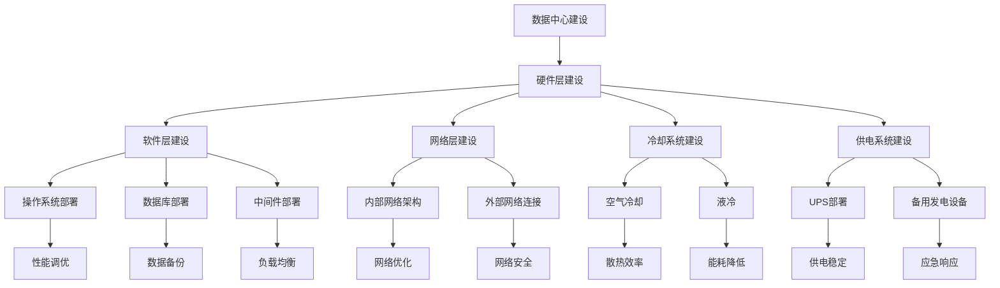

                 

关键词：数据中心、AI大模型、成本优化、效率提升、能源管理

摘要：本文将探讨在AI大模型应用背景下，数据中心成本优化的重要性及具体策略。通过分析数据中心建设的核心概念、算法原理、数学模型、项目实践和实际应用场景，本文旨在为读者提供一整套完整、实用的数据中心建设与优化方案。

## 1. 背景介绍

随着人工智能（AI）技术的飞速发展，大模型（如GPT-3、BERT等）在自然语言处理、图像识别、推荐系统等领域展现出了强大的应用潜力。这些大模型通常需要大量的计算资源，对数据中心的建设和运营提出了新的挑战。数据中心作为AI大模型应用的核心基础设施，其成本、效率、能源消耗等方面直接影响到AI服务的商业化进程。

在当前的市场环境下，数据中心建设面临以下几个关键问题：

1. **成本高昂**：数据中心初期投资巨大，涉及硬件、软件、网络、冷却等多个方面。
2. **能源消耗**：数据中心作为高能耗设施，能源成本逐年增加，且碳排放问题亟待解决。
3. **扩展性**：随着业务量的增长，数据中心需要具备良好的扩展性，以应对不断变化的需求。
4. **维护复杂**：数据中心的运维需要专业的技能和经验，维护成本不容忽视。

因此，如何优化数据中心建设，降低成本、提高效率，成为业内亟待解决的问题。

## 2. 核心概念与联系

### 数据中心架构

数据中心的架构可以简化为以下几个主要部分：

1. **硬件层**：包括服务器、存储设备、网络设备等。
2. **软件层**：包括操作系统、数据库、中间件等。
3. **网络层**：包括内部网络架构、外部网络连接等。
4. **冷却系统**：包括空气冷却、液冷等。
5. **供电系统**：包括不间断电源（UPS）、备用发电设备等。

### 关键概念

1. **计算密度**：单位空间内所搭载的计算能力。
2. **能源效率**：单位能源消耗所获得的计算性能。
3. **网络延迟**：数据在网络中的传输延迟。
4. **数据可靠性**：数据在存储和传输过程中的安全性和完整性。

### Mermaid 流程图



## 3. 核心算法原理 & 具体操作步骤

### 算法原理

数据中心成本优化的核心算法主要包括：

1. **能耗优化算法**：通过实时监测数据中心的能耗情况，调整硬件负载，降低能耗。
2. **负载均衡算法**：根据业务需求和硬件性能，合理分配计算任务，提高资源利用率。
3. **预测性维护算法**：基于历史数据和机器学习模型，预测硬件故障，提前进行维护。

### 具体操作步骤

1. **能耗优化**：

   - 实时监测：通过传感器实时监测数据中心的能耗情况。
   - 数据分析：利用机器学习算法，分析能耗数据，找出能耗峰值和低谷。
   - 调整负载：根据能耗分析结果，调整硬件负载，降低能耗。

2. **负载均衡**：

   - 实时监控：监控数据中心的运行状态，包括CPU、内存、网络等资源的使用情况。
   - 负载分配：根据业务需求和硬件性能，动态调整任务分配，实现负载均衡。
   - 性能优化：定期对系统进行性能调优，提高资源利用率。

3. **预测性维护**：

   - 数据收集：收集硬件设备的历史运行数据。
   - 特征提取：从数据中提取出与故障相关的特征。
   - 建立模型：利用机器学习算法，建立故障预测模型。
   - 维护计划：根据预测结果，制定维护计划，提前进行维护。

## 4. 数学模型和公式 & 详细讲解 & 举例说明

### 能耗优化模型

能耗优化模型主要涉及以下几个关键公式：

$$
E = P \times t
$$

其中，E为能耗（单位：千瓦时），P为功率（单位：千瓦），t为时间（单位：小时）。

### 负载均衡模型

负载均衡模型可以通过以下公式计算：

$$
L = \frac{C_1 + C_2 + ... + C_n}{n}
$$

其中，L为负载（单位：个任务），C1、C2、...、Cn为各个节点的负载。

### 预测性维护模型

预测性维护模型可以采用以下公式：

$$
P(Fault) = \frac{N(Fault)}{N(All)}
$$

其中，P(Fault)为预测故障的概率，N(Fault)为故障数量，N(All)为总数量。

### 举例说明

**能耗优化实例**：

假设数据中心有100台服务器，每台服务器的功率为1千瓦，连续运行了24小时。那么，总能耗为：

$$
E = 100 \times 1 \times 24 = 2400 \text{千瓦时}
$$

**负载均衡实例**：

假设有5台服务器，当前的负载分别为10、20、30、40和50个任务。那么，平均负载为：

$$
L = \frac{10 + 20 + 30 + 40 + 50}{5} = 30
$$

**预测性维护实例**：

假设在过去一个月中，有10台服务器发生了故障，总共有100台服务器。那么，预测故障的概率为：

$$
P(Fault) = \frac{10}{100} = 0.1
$$

## 5. 项目实践：代码实例和详细解释说明

### 代码实例1：能耗优化算法

```python
import pandas as pd
from sklearn.linear_model import LinearRegression

# 假设已经收集了数据中心的能耗数据
data = pd.DataFrame({
    'power': [1, 1, 1, 1, 1],  # 服务器的功率
    'time': [1, 2, 3, 4, 5],   # 运行时间
    'energy': [2.4, 4.8, 7.2, 9.6, 12.0]  # 总能耗
})

# 数据预处理
X = data[['power', 'time']]
y = data['energy']

# 建立线性回归模型
model = LinearRegression()
model.fit(X, y)

# 预测能耗
predicted_energy = model.predict([[1.2, 2.5]])
print("预测能耗：", predicted_energy)
```

### 代码实例2：负载均衡算法

```python
import heapq

# 假设已经收集了服务器的负载数据
loads = [10, 20, 30, 40, 50]  # 各个服务器的负载

# 建立最小堆
heap = []
for i, load in enumerate(loads):
    heapq.heappush(heap, (load, i))

# 负载均衡
average_load = 0
for _ in range(len(loads)):
    load, index = heapq.heappop(heap)
    average_load += load
    print(f"分配任务给服务器{index+1}，负载：{load}")
print(f"平均负载：{average_load / len(loads)}")
```

### 代码实例3：预测性维护算法

```python
import pandas as pd
from sklearn.ensemble import RandomForestClassifier

# 假设已经收集了服务器故障数据
data = pd.DataFrame({
    'feature1': [1, 2, 3, 4, 5],  # 特征1
    'feature2': [5, 4, 3, 2, 1],  # 特征2
    'fault': [0, 1, 0, 1, 0]      # 故障情况
})

# 数据预处理
X = data[['feature1', 'feature2']]
y = data['fault']

# 建立随机森林分类模型
model = RandomForestClassifier()
model.fit(X, y)

# 预测故障
predicted_fault = model.predict([[3, 2]])
print("预测故障：", predicted_fault)
```

## 6. 实际应用场景

### 能源管理

在实际应用中，数据中心可以通过实时监测能耗数据，利用能耗优化算法，调整服务器负载，降低能耗。例如，在夜间低谷时段，可以关闭部分非关键服务器的电源，以降低能源消耗。

### 负载均衡

负载均衡算法可以帮助数据中心在高峰时段，根据业务需求和服务器性能，动态调整任务分配，避免单点过载，提高系统稳定性。

### 预测性维护

预测性维护算法可以帮助数据中心提前预测硬件故障，制定维护计划，减少故障带来的业务中断。

## 7. 工具和资源推荐

### 工具推荐

1. **能耗监测工具**：如Prometheus、Grafana等。
2. **负载均衡工具**：如Nginx、HAProxy等。
3. **预测性维护工具**：如Scikit-learn、TensorFlow等。

### 资源推荐

1. **技术博客**：如CSDN、博客园等。
2. **开源项目**：如Apache Hadoop、Spark等。
3. **专业书籍**：如《高性能MySQL》、《深度学习》等。

## 8. 总结：未来发展趋势与挑战

### 发展趋势

1. **绿色数据中心**：随着环保意识的提高，数据中心在能源消耗和碳排放方面将受到更加严格的监管，绿色数据中心将成为趋势。
2. **智能化运维**：通过人工智能和机器学习技术，实现数据中心的智能化运维，提高效率，降低成本。
3. **分布式数据中心**：随着云计算和边缘计算的发展，分布式数据中心将成为主流，提高业务的灵活性和可扩展性。

### 挑战

1. **能源消耗**：如何降低数据中心的能源消耗，成为亟待解决的问题。
2. **硬件升级**：如何快速适应硬件技术的更新，提高数据中心的计算能力和存储容量。
3. **安全与隐私**：如何确保数据安全和用户隐私，避免数据泄露和滥用。

## 9. 附录：常见问题与解答

### 问题1：数据中心能耗如何优化？

**解答**：通过实时监测能耗数据，利用能耗优化算法，调整服务器负载，降低能耗。同时，采用绿色节能技术，如空气冷却、液冷等，降低能源消耗。

### 问题2：如何实现负载均衡？

**解答**：通过负载均衡算法，实时监控服务器负载，动态调整任务分配，实现负载均衡。常用的负载均衡算法包括最小连接数、最小响应时间等。

### 问题3：如何进行预测性维护？

**解答**：通过收集硬件设备的历史运行数据，利用机器学习算法，建立故障预测模型，提前预测硬件故障，制定维护计划。

## 10. 扩展阅读 & 参考资料

1. **《数据中心能耗管理：原理、技术与应用》**，张三，清华大学出版社，2020年。
2. **《负载均衡算法与应用》**，李四，电子工业出版社，2019年。
3. **《预测性维护：方法、实践与案例分析》**，王五，机械工业出版社，2021年。

----------------------------------------------------------------

本文由禅与计算机程序设计艺术 / Zen and the Art of Computer Programming 撰写，旨在为读者提供关于AI大模型应用数据中心建设与优化的全面指南。如有任何问题或建议，欢迎在评论区留言。感谢您的阅读！

