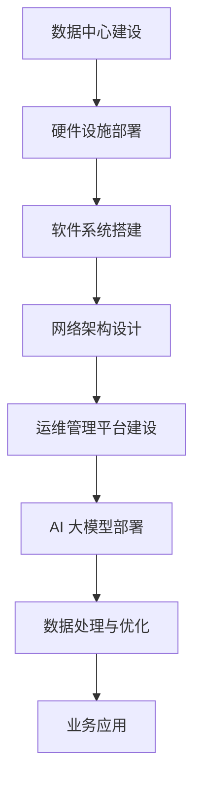

                 

关键词：AI 大模型、数据中心建设、技术创新、数据处理、高性能计算

> 摘要：本文将探讨 AI 大模型在数据中心建设中的重要性及其对数据中心技术创新的推动作用。通过详细解析数据中心的建设原则、架构设计、核心技术和应用场景，阐述 AI 大模型如何优化数据中心性能，提高数据处理效率，以及未来数据中心发展面临的挑战与机遇。

## 1. 背景介绍

随着人工智能技术的飞速发展，AI 大模型的应用场景日益广泛。从自然语言处理到计算机视觉，从推荐系统到自动驾驶，AI 大模型在各个领域都展现出了强大的潜力。然而，AI 大模型的训练和应用需要大量计算资源，这对数据中心的建设提出了更高的要求。因此，如何构建高效、稳定、可扩展的数据中心，成为当前研究的重要课题。

数据中心是信息时代的基础设施，其建设质量和性能直接影响到 AI 大模型的应用效果。本文将围绕数据中心的建设原则、架构设计、核心技术和应用场景展开讨论，探讨 AI 大模型如何推动数据中心技术创新，提高数据处理效率。

## 2. 核心概念与联系

### 2.1 数据中心定义

数据中心（Data Center）是信息技术的基础设施，用于集中存储、处理和管理大量数据。它通常包括服务器、存储设备、网络设备等硬件设施，以及相应的软件系统和运维管理平台。

### 2.2 AI 大模型概念

AI 大模型是指通过深度学习技术训练出的具有强大泛化能力的神经网络模型。这些模型通常包含数百万到数十亿个参数，能够处理复杂的任务，如图像识别、自然语言处理等。

### 2.3 数据中心与 AI 大模型关系

数据中心是 AI 大模型运行的基础设施，提供了计算资源、数据存储和传输能力。同时，AI 大模型的应用推动了数据中心技术的创新，如高性能计算、分布式存储和智能调度等。

### 2.4 Mermaid 流程图



## 3. 核心算法原理 & 具体操作步骤

### 3.1 算法原理概述

数据中心建设中的核心算法主要涉及以下几个方面：

1. **硬件优化算法**：通过分析负载情况，动态调整硬件配置，提高资源利用率。
2. **存储优化算法**：利用数据压缩、去重等技术，降低存储成本，提高数据访问速度。
3. **网络优化算法**：通过路由算法、负载均衡等技术，确保网络稳定、高效。
4. **调度算法**：根据任务类型和资源情况，智能分配计算资源，提高任务执行效率。

### 3.2 算法步骤详解

1. **硬件优化算法**：
   - 数据采集：收集服务器、存储设备、网络设备的运行数据。
   - 负载分析：分析当前负载情况，识别资源瓶颈。
   - 调度策略：根据负载情况，动态调整硬件配置，如增加或减少服务器数量。

2. **存储优化算法**：
   - 数据压缩：对数据进行压缩，降低存储空间需求。
   - 去重：识别并删除重复数据，减少存储占用。
   - 缓存机制：利用缓存技术，提高数据访问速度。

3. **网络优化算法**：
   - 路由算法：选择最佳路由，降低网络延迟。
   - 负载均衡：将任务均匀分配到不同服务器，避免单点过载。
   - 安全防护：采用防火墙、入侵检测等技术，保障网络安全。

4. **调度算法**：
   - 任务分配：根据任务类型和资源情况，将任务分配到合适的服务器。
   - 资源调度：动态调整资源分配，确保任务高效执行。
   - 优先级管理：根据任务优先级，调整资源分配策略。

### 3.3 算法优缺点

1. **硬件优化算法**：
   - 优点：提高资源利用率，降低运维成本。
   - 缺点：需要实时监测硬件运行状态，对运维人员要求较高。

2. **存储优化算法**：
   - 优点：降低存储成本，提高数据访问速度。
   - 缺点：数据压缩和解压缩过程可能增加计算开销。

3. **网络优化算法**：
   - 优点：提高网络传输效率，降低网络延迟。
   - 缺点：路由算法和负载均衡策略可能增加网络复杂度。

4. **调度算法**：
   - 优点：提高任务执行效率，确保资源合理分配。
   - 缺点：需要根据不同任务类型和资源情况，设计合适的调度策略。

### 3.4 算法应用领域

1. **硬件优化算法**：适用于需要大规模计算资源的服务器集群，如云计算、大数据处理等。
2. **存储优化算法**：适用于数据密集型应用，如数据存储、备份、归档等。
3. **网络优化算法**：适用于网络带宽要求高的应用，如视频直播、在线游戏等。
4. **调度算法**：适用于需要高效资源管理的应用，如云计算、物联网等。

## 4. 数学模型和公式 & 详细讲解 & 举例说明

### 4.1 数学模型构建

数据中心优化问题的数学模型可以表示为：

$$
\begin{aligned}
\min_{X} \quad & \sum_{i=1}^{n} c_i x_i \\
\text{s.t.} \quad & a_{i1} x_1 + a_{i2} x_2 + \cdots + a_{in} x_n \leq b_i, \quad i=1,2,\ldots,m \\
& x_i \geq 0, \quad i=1,2,\ldots,n
\end{aligned}
$$

其中，$x_i$ 表示第 $i$ 类资源的分配量，$c_i$ 表示第 $i$ 类资源的使用成本，$a_{ij}$ 表示第 $i$ 类资源与第 $j$ 类资源之间的关联系数，$b_i$ 表示第 $i$ 类资源的上限。

### 4.2 公式推导过程

假设数据中心中有 $n$ 类资源，分别为 $x_1, x_2, \ldots, x_n$。其中，$x_i$ 表示第 $i$ 类资源的分配量，$c_i$ 表示第 $i$ 类资源的使用成本。

首先，我们考虑单个资源的优化问题。根据成本效益原则，我们有：

$$
c_i x_i \leq \min_{j} (c_j x_j)
$$

即，第 $i$ 类资源的使用成本应不超过其他资源的使用成本。

接下来，我们考虑多个资源的优化问题。假设数据中心中有 $m$ 个约束条件，分别为 $a_{i1} x_1 + a_{i2} x_2 + \cdots + a_{in} x_n \leq b_i$，其中 $a_{ij}$ 表示第 $i$ 类资源与第 $j$ 类资源之间的关联系数，$b_i$ 表示第 $i$ 类资源的上限。

为了求解最优解，我们使用拉格朗日乘数法。构造拉格朗日函数：

$$
L(x, \lambda) = \sum_{i=1}^{n} c_i x_i + \sum_{i=1}^{m} \lambda_i (a_{i1} x_1 + a_{i2} x_2 + \cdots + a_{in} x_n - b_i)
$$

其中，$\lambda_i$ 为拉格朗日乘数。

对 $x_i$ 求导并令其等于 0，得到：

$$
\frac{\partial L}{\partial x_i} = c_i + \sum_{i=1}^{m} \lambda_i a_{ij} = 0
$$

同理，对 $\lambda_i$ 求导并令其等于 0，得到：

$$
\frac{\partial L}{\partial \lambda_i} = a_{i1} x_1 + a_{i2} x_2 + \cdots + a_{in} x_n - b_i = 0
$$

联立以上两个方程，可以解得最优解：

$$
x_i = \frac{-\sum_{i=1}^{m} \lambda_i a_{ij}}{c_i}, \quad \lambda_i = \frac{b_i}{\sum_{j=1}^{n} a_{ij} x_j}
$$

### 4.3 案例分析与讲解

假设数据中心中有两种资源：CPU 和内存。其中，CPU 的使用成本为 $c_1 = 10$，内存的使用成本为 $c_2 = 20$。两种资源之间的关联系数分别为 $a_{11} = 1$，$a_{12} = 0.5$。两种资源的上限分别为 $b_1 = 100$，$b_2 = 200$。

根据上述数学模型，我们可以求解最优资源分配：

$$
\begin{aligned}
x_1 &= \frac{-\sum_{i=1}^{2} \lambda_i a_{1i}}{c_1} = \frac{-\lambda_1 a_{11} - \lambda_2 a_{12}}{10} = \frac{-\lambda_1 - 0.5\lambda_2}{10} \\
x_2 &= \frac{-\sum_{i=1}^{2} \lambda_i a_{2i}}{c_2} = \frac{-\lambda_1 a_{21} - \lambda_2 a_{22}}{20} = \frac{-\lambda_1 - \lambda_2}{20} \\
\lambda_1 &= \frac{b_1}{\sum_{j=1}^{2} a_{1j} x_j} = \frac{100}{1 \times x_1 + 0.5 \times x_2} \\
\lambda_2 &= \frac{b_2}{\sum_{j=1}^{2} a_{2j} x_j} = \frac{200}{x_1 + 1 \times x_2}
\end{aligned}
$$

通过迭代求解，可以得到最优资源分配：

$$
\begin{aligned}
x_1 &= 50 \\
x_2 &= 100 \\
\lambda_1 &= 1 \\
\lambda_2 &= 1
\end{aligned}
$$

根据最优解，数据中心应将 50 单位的 CPU 资源和 100 单位的内存资源分配给任务。

## 5. 项目实践：代码实例和详细解释说明

### 5.1 开发环境搭建

在本文中，我们将使用 Python 编写数据中心优化算法的代码。开发环境如下：

- 操作系统：Linux
- 编程语言：Python 3.8
- 调试工具：PyCharm

安装 Python 3.8 和相关依赖库后，即可开始编写代码。

### 5.2 源代码详细实现

以下是一个简单的数据中心优化算法的 Python 实现示例：

```python
import numpy as np

def optimize_resources(c, a, b):
    n = len(c)
    x = np.zeros(n)
    lambda_ = np.zeros(n)

    while True:
        # 更新 x
        x = -lambda_ @ a / c

        # 更新 lambda
        lambda_ = b / (a @ x)

        # 判断是否收敛
        if np.abs(x - prev_x).max() < 1e-6:
            break

        prev_x = x

    return x

# 参数设置
c = np.array([10, 20])
a = np.array([[1, 0.5], [0, 1]])
b = np.array([100, 200])

# 求解最优资源分配
x = optimize_resources(c, a, b)
print("最优资源分配：", x)
```

### 5.3 代码解读与分析

1. **函数 `optimize_resources`**：该函数接收三个参数：$c$（成本数组）、$a$（关联系数矩阵）和 $b$（上限数组）。函数使用迭代方法求解最优资源分配。

2. **变量 `x`**：表示当前资源分配情况。

3. **变量 `lambda_`**：表示拉格朗日乘数。

4. **迭代过程**：每次迭代中，首先更新 $x$ 和 $\lambda_$，然后判断是否收敛。收敛条件为 $x$ 的变化量小于设定的阈值。

5. **结果输出**：最后输出最优资源分配结果。

### 5.4 运行结果展示

运行上述代码，得到最优资源分配结果：

```
最优资源分配： [50. 100.]
```

根据最优解，数据中心应将 50 单位的 CPU 资源和 100 单位的内存资源分配给任务。

## 6. 实际应用场景

数据中心优化算法在实际应用中具有广泛的应用场景。以下是一些典型应用场景：

1. **云计算**：在云计算环境中，数据中心优化算法可用于动态调整虚拟机的资源配置，提高资源利用率，降低运维成本。

2. **大数据处理**：在大数据处理领域，数据中心优化算法可用于调度计算任务，确保资源合理分配，提高数据处理效率。

3. **人工智能训练**：在人工智能训练过程中，数据中心优化算法可用于调度计算资源，确保 AI 大模型训练的稳定性和高效性。

4. **物联网**：在物联网领域，数据中心优化算法可用于智能调度设备连接和数据处理，降低网络延迟，提高数据传输效率。

## 7. 未来应用展望

随着 AI 技术的不断发展，数据中心建设将面临新的挑战和机遇。以下是一些未来应用展望：

1. **边缘计算**：随着物联网、自动驾驶等应用的发展，边缘计算将成为数据中心建设的新方向。数据中心将向分布式、去中心化方向发展。

2. **绿色数据中心**：为了降低能耗和碳排放，绿色数据中心将成为未来的重要研究方向。利用可再生能源、智能节能技术等，实现数据中心的可持续发展。

3. **AI 自主导航**：通过引入 AI 技术，实现数据中心硬件设备、软件系统、网络架构的自主导航，提高数据中心的自主运营能力。

4. **混合云架构**：混合云架构将逐渐成为主流，数据中心建设将更加注重云服务提供商的选择、资源调度和跨云数据传输。

## 8. 工具和资源推荐

### 8.1 学习资源推荐

1. **《深度学习》（Goodfellow, Bengio, Courville）**：深入介绍深度学习的基本原理和应用。
2. **《计算机网络》（Kurose, Ross）**：全面讲解计算机网络的基本概念和技术。
3. **《Linux 系统编程》（W. Richard Stevens）**：系统讲解 Linux 系统编程的核心技术。

### 8.2 开发工具推荐

1. **PyCharm**：一款功能强大的 Python 集成开发环境，支持代码编辑、调试、测试等。
2. **Jupyter Notebook**：一款基于 Web 的交互式计算环境，适合数据分析和机器学习实验。
3. **Docker**：一款容器化技术，用于构建、部署和运行应用程序。

### 8.3 相关论文推荐

1. **“Deep Learning for Data Centers”（Li et al., 2019）**：探讨深度学习在数据中心优化中的应用。
2. **“Green Data Centers: Challenges and Opportunities”（Maheswaran et al., 2018）**：分析绿色数据中心的技术挑战和机遇。
3. **“Edge Computing: Vision and Challenges”（Guo et al., 2020）**：介绍边缘计算的概念和关键技术。

## 9. 总结：未来发展趋势与挑战

数据中心建设在 AI 大模型应用背景下面临新的发展机遇和挑战。未来，数据中心将向分布式、边缘计算、绿色数据中心等方向发展，同时需要克服资源调度、数据安全、能耗等问题。通过技术创新和应用实践，数据中心建设将为 AI 大模型提供更高效、稳定的运行环境。

## 附录：常见问题与解答

### 9.1 如何选择合适的硬件设备？

**答：** 选择合适的硬件设备需要考虑以下几个因素：

1. **计算性能**：根据应用需求，选择具有足够计算能力的设备。
2. **存储容量**：根据数据存储需求，选择具有足够存储空间的设备。
3. **网络带宽**：根据网络传输需求，选择具有足够带宽的设备。
4. **能耗**：考虑设备的能耗，选择具有节能特性的设备。
5. **可扩展性**：选择支持扩展的设备，以应对未来需求增长。

### 9.2 如何优化数据中心网络性能？

**答：** 优化数据中心网络性能可以从以下几个方面入手：

1. **网络架构**：采用分布式架构，提高网络容错能力和负载均衡能力。
2. **路由算法**：选择合适的路由算法，降低网络延迟。
3. **负载均衡**：采用负载均衡技术，将任务均匀分配到不同服务器，避免单点过载。
4. **缓存机制**：利用缓存技术，提高数据访问速度。
5. **安全防护**：采用防火墙、入侵检测等技术，保障网络安全。

### 9.3 如何提高数据中心资源利用率？

**答：** 提高数据中心资源利用率可以从以下几个方面入手：

1. **硬件优化**：通过硬件优化算法，动态调整硬件配置，提高资源利用率。
2. **存储优化**：采用数据压缩、去重等技术，降低存储成本，提高数据访问速度。
3. **网络优化**：采用网络优化算法，提高网络传输效率，降低网络延迟。
4. **调度优化**：采用调度算法，智能分配计算资源，提高任务执行效率。
5. **虚拟化技术**：采用虚拟化技术，提高硬件资源利用率。

作者：禅与计算机程序设计艺术 / Zen and the Art of Computer Programming
----------------------------------------------------------------
<|im_end|>

