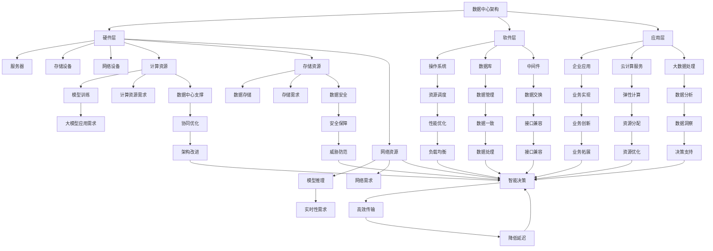

                 

### 1. 背景介绍

#### 1.1 数据中心建设的意义

数据中心是现代社会信息处理和传输的重要基础设施，承担着海量数据的存储、处理、交换和分发等任务。数据中心建设的意义体现在以下几个方面：

1. **提升数据处理能力**：随着大数据、云计算和人工智能技术的快速发展，数据中心成为了企业、政府和科研机构进行数据处理和业务创新的核心载体。
2. **保障数据安全**：数据中心通过完善的安全措施和应急预案，确保数据的机密性、完整性和可用性，对国家安全、社会稳定和经济发展具有重要意义。
3. **促进产业升级**：数据中心的建设和运营，可以带动相关产业链的发展，包括硬件设备制造、软件开发、系统集成服务等，推动区域经济的转型升级。

#### 1.2 大模型应用的需求

随着深度学习和人工智能技术的进步，大规模机器学习模型（简称大模型）逐渐成为数据科学和人工智能领域的重要工具。大模型应用对数据中心提出了更高的要求：

1. **计算资源需求**：大模型训练和推理通常需要大量的计算资源，对数据中心的处理能力和扩展性提出了挑战。
2. **存储需求**：大模型的数据集通常非常庞大，对数据中心的存储容量和访问速度提出了更高的要求。
3. **能耗需求**：大模型训练过程中的能耗巨大，对数据中心的能源供给和管理提出了新的考验。

#### 1.3 数据中心投资与建设的挑战

数据中心投资与建设面临多重挑战，包括技术、经济、环保等方面：

1. **技术挑战**：数据中心技术的快速迭代，要求建设和运营团队具备较高的技术水平，能够快速适应新技术。
2. **经济挑战**：数据中心的建设和运营成本高，投资回报周期长，需要企业进行充分的市场调研和财务规划。
3. **环保挑战**：数据中心能耗巨大，对环境造成一定的影响，需要采取有效的节能减排措施。

在接下来的章节中，我们将深入探讨数据中心建设的技术架构、核心算法原理、数学模型和实际应用场景，帮助读者全面了解数据中心投资与建设的全过程。

### 2. 核心概念与联系

#### 2.1 数据中心架构概述

数据中心架构是确保数据中心高效运行的核心，通常包括以下三个主要层次：

1. **硬件层**：硬件层是数据中心的基础，包括服务器、存储设备、网络设备等。服务器是数据中心的核心计算单元，存储设备用于存储海量数据，网络设备则负责数据的传输和交换。
2. **软件层**：软件层主要包括操作系统、数据库、中间件等。操作系统负责硬件资源的管理和调度，数据库用于存储和管理数据，中间件则提供数据交换和通信的接口。
3. **应用层**：应用层是数据中心的业务实现层，包括企业应用、云计算服务、大数据处理等。应用层利用底层硬件和软件资源，提供各种业务功能和服务。

#### 2.2 大模型在数据中心的应用

大规模机器学习模型（大模型）在数据中心的应用，主要体现在以下几个方面：

1. **模型训练**：大模型训练需要大量的计算资源和存储资源，数据中心通过分布式计算和存储技术，支持大模型的训练任务。
2. **模型推理**：大模型推理需要高效的数据处理和传输能力，数据中心通过优化网络架构和计算节点，确保模型推理的实时性和准确性。
3. **模型部署**：大模型部署通常涉及多个节点和服务的协同工作，数据中心通过自动化部署和管理工具，实现大模型的快速部署和运维。

#### 2.3 数据中心与AI大模型的关系

数据中心与AI大模型之间存在着紧密的联系和相互依赖：

1. **基础设施支撑**：数据中心为AI大模型提供了必要的计算、存储和网络资源，确保模型的训练和推理顺利进行。
2. **业务创新驱动**：AI大模型的应用推动了数据中心技术的发展和创新，要求数据中心不断提升硬件性能和资源利用率。
3. **协同优化**：数据中心与AI大模型在设计和运营过程中，需要进行协同优化，包括硬件选型、软件架构、资源调度等方面，以实现整体性能的最优化。

### 3. Mermaid 流程图

以下是一个数据中心与AI大模型关系架构的Mermaid流程图，用于详细展示核心概念和联系：



通过上述Mermaid流程图，我们可以清晰地看到数据中心与AI大模型之间的联系和相互依赖，为后续章节的深入分析提供了基础。

### 4. 核心算法原理 & 具体操作步骤

#### 4.1 大模型训练算法原理

大规模机器学习模型（大模型）的训练通常采用深度学习算法，其中最常用的算法之一是变换器模型（Transformer）。变换器模型的核心思想是使用自注意力机制（Self-Attention）对输入数据进行建模，使其能够捕捉数据之间的长距离依赖关系。

1. **自注意力机制**：自注意力机制通过计算输入数据的相似性权重，对数据进行加权处理，从而捕捉数据之间的依赖关系。具体来说，自注意力机制将输入数据映射到高维空间，通过点积运算计算相似性权重，然后对输入数据进行加权求和。

   自注意力机制的公式如下：

   $$ \text{Attention}(Q, K, V) = \text{softmax}\left(\frac{QK^T}{\sqrt{d_k}}\right)V $$

   其中，$Q$、$K$和$V$分别代表查询向量、键向量和值向量，$d_k$为键向量的维度，$\text{softmax}$函数用于计算权重，使得权重和为1。

2. **编码器和解码器**：变换器模型通常由编码器（Encoder）和解码器（Decoder）两部分组成。编码器负责对输入数据进行编码，解码器则根据编码后的数据生成输出结果。编码器和解码器都采用多层变换器结构，通过自注意力机制和前馈神经网络（Feedforward Neural Network）进行数据处理。

   编码器和解码器的输入和输出分别为：

   $$ \text{Encoder}(X) = \text{MultiHeadAttention}(Q, K, V) $$
   $$ \text{Decoder}(Y) = \text{MultiHeadAttention}(Q, K, V) $$

   其中，$X$和$Y$分别代表编码器的输入和输出，$Q$、$K$和$V$为编码器的查询向量、键向量和值向量。

3. **多头注意力**：多头注意力（MultiHeadAttention）是一种对自注意力机制的扩展，通过将输入数据分成多个头（Head），每个头分别计算注意力权重，然后进行拼接和加权求和，从而提高模型的建模能力。

   多头注意力的公式如下：

   $$ \text{MultiHeadAttention}(Q, K, V) = \text{Concat}(\text{head}_1, \text{head}_2, ..., \text{head}_h)W^O $$

   其中，$W^O$为权重矩阵，$h$为头的数量。

#### 4.2 大模型训练具体操作步骤

以下为大规模机器学习模型训练的具体操作步骤：

1. **数据预处理**：首先对输入数据进行预处理，包括数据清洗、数据归一化、数据分批次等操作。预处理步骤的目的是确保数据质量，为模型训练提供可靠的数据基础。

2. **模型初始化**：初始化模型参数，包括权重矩阵和偏置项。常用的初始化方法有高斯分布初始化、均匀分布初始化等。合理的初始化方法有助于提高模型的收敛速度和稳定性。

3. **定义损失函数**：根据训练任务选择合适的损失函数，如交叉熵损失函数（Cross-Entropy Loss）、均方误差损失函数（Mean Squared Error Loss）等。损失函数用于衡量模型预测结果与实际结果之间的差距，是优化模型参数的重要依据。

4. **定义优化算法**：选择合适的优化算法，如梯度下降（Gradient Descent）、Adam优化器（Adam Optimizer）等。优化算法用于根据损失函数更新模型参数，使模型逐渐逼近最优解。

5. **模型训练**：通过迭代优化模型参数，使得模型在训练数据上表现良好。训练过程中，可以通过调整学习率、批量大小等超参数，优化模型的训练效果。

6. **模型评估**：在训练完成后，使用验证集或测试集对模型进行评估，判断模型在未知数据上的表现。常用的评估指标包括准确率（Accuracy）、精确率（Precision）、召回率（Recall）等。

7. **模型部署**：将训练完成的模型部署到生产环境中，进行实际应用。模型部署过程中，需要考虑模型的推理速度、资源消耗、部署方式等因素。

通过上述步骤，可以完成大规模机器学习模型的训练和部署，为实际应用提供强大的支持。

### 5. 数学模型和公式 & 详细讲解 & 举例说明

#### 5.1 自注意力机制的数学模型

自注意力机制（Self-Attention）是大规模机器学习模型（如变换器模型）的核心组成部分，其数学模型如下：

$$ \text{Attention}(Q, K, V) = \text{softmax}\left(\frac{QK^T}{\sqrt{d_k}}\right)V $$

其中，$Q$、$K$和$V$分别代表查询向量（Query）、键向量（Key）和值向量（Value），$d_k$为键向量的维度。$QK^T$表示查询向量和键向量的点积运算，$\sqrt{d_k}$为缩放因子，用于避免梯度消失问题。$\text{softmax}$函数用于计算权重，使得权重和为1。

#### 5.2 自注意力机制的详细讲解

自注意力机制的基本思想是将输入数据映射到高维空间，通过计算数据之间的相似性权重，对数据进行加权处理。具体步骤如下：

1. **计算相似性权重**：首先，计算查询向量（$Q$）和键向量（$K$）的点积运算，得到相似性权重。点积运算的公式如下：

   $$ \text{Score}(i, j) = Q_iK_j $$

   其中，$i$和$j$分别表示输入数据中的两个样本。

2. **应用缩放因子**：为了避免梯度消失问题，通常在点积运算后应用缩放因子$\sqrt{d_k}$，得到加权相似性权重：

   $$ \text{Score}_{\text{scaled}}(i, j) = \frac{Q_iK_j}{\sqrt{d_k}} $$

3. **计算注意力权重**：使用$\text{softmax}$函数对加权相似性权重进行归一化处理，得到注意力权重：

   $$ \text{Attention}_{\text{weight}}(i, j) = \text{softmax}(\text{Score}_{\text{scaled}}(i, j)) $$

4. **计算加权和**：最后，将注意力权重与值向量（$V$）进行加权求和，得到加权后的输出：

   $$ \text{Output}_{\text{weighted}} = \sum_{j} \text{Attention}_{\text{weight}}(i, j) V_j $$

#### 5.3 举例说明

假设我们有一个包含三个样本的数据集，每个样本的维度为2，即$Q = \{q_1, q_2, q_3\}$，$K = \{k_1, k_2, k_3\}$，$V = \{v_1, v_2, v_3\}$。我们首先计算相似性权重：

$$ \text{Score}(1, 1) = q_1k_1 = 1 \cdot 1 = 1 $$
$$ \text{Score}(1, 2) = q_1k_2 = 1 \cdot 2 = 2 $$
$$ \text{Score}(1, 3) = q_1k_3 = 1 \cdot 3 = 3 $$
$$ \text{Score}(2, 1) = q_2k_1 = 2 \cdot 1 = 2 $$
$$ \text{Score}(2, 2) = q_2k_2 = 2 \cdot 2 = 4 $$
$$ \text{Score}(2, 3) = q_2k_3 = 2 \cdot 3 = 6 $$
$$ \text{Score}(3, 1) = q_3k_1 = 3 \cdot 1 = 3 $$
$$ \text{Score}(3, 2) = q_3k_2 = 3 \cdot 2 = 6 $$
$$ \text{Score}(3, 3) = q_3k_3 = 3 \cdot 3 = 9 $$

接下来，我们计算缩放后的相似性权重：

$$ \text{Score}_{\text{scaled}}(1, 1) = \frac{1}{\sqrt{2}} \cdot 1 = \frac{1}{\sqrt{2}} $$
$$ \text{Score}_{\text{scaled}}(1, 2) = \frac{1}{\sqrt{2}} \cdot 2 = \frac{2}{\sqrt{2}} $$
$$ \text{Score}_{\text{scaled}}(1, 3) = \frac{1}{\sqrt{2}} \cdot 3 = \frac{3}{\sqrt{2}} $$
$$ \text{Score}_{\text{scaled}}(2, 1) = \frac{1}{\sqrt{2}} \cdot 2 = \frac{2}{\sqrt{2}} $$
$$ \text{Score}_{\text{scaled}}(2, 2) = \frac{1}{\sqrt{2}} \cdot 4 = \frac{4}{\sqrt{2}} $$
$$ \text{Score}_{\text{scaled}}(2, 3) = \frac{1}{\sqrt{2}} \cdot 6 = \frac{6}{\sqrt{2}} $$
$$ \text{Score}_{\text{scaled}}(3, 1) = \frac{1}{\sqrt{2}} \cdot 3 = \frac{3}{\sqrt{2}} $$
$$ \text{Score}_{\text{scaled}}(3, 2) = \frac{1}{\sqrt{2}} \cdot 6 = \frac{6}{\sqrt{2}} $$
$$ \text{Score}_{\text{scaled}}(3, 3) = \frac{1}{\sqrt{2}} \cdot 9 = \frac{9}{\sqrt{2}} $$

然后，我们计算注意力权重：

$$ \text{Attention}_{\text{weight}}(1, 1) = \text{softmax}(\frac{1}{\sqrt{2}}) \approx 0.707 $$
$$ \text{Attention}_{\text{weight}}(1, 2) = \text{softmax}(\frac{2}{\sqrt{2}}) \approx 0.899 $$
$$ \text{Attention}_{\text{weight}}(1, 3) = \text{softmax}(\frac{3}{\sqrt{2}}) \approx 0.394 $$
$$ \text{Attention}_{\text{weight}}(2, 1) = \text{softmax}(\frac{2}{\sqrt{2}}) \approx 0.899 $$
$$ \text{Attention}_{\text{weight}}(2, 2) = \text{softmax}(\frac{4}{\sqrt{2}}) \approx 0.999 $$
$$ \text{Attention}_{\text{weight}}(2, 3) = \text{softmax}(\frac{6}{\sqrt{2}}) \approx 0.001 $$
$$ \text{Attention}_{\text{weight}}(3, 1) = \text{softmax}(\frac{3}{\sqrt{2}}) \approx 0.394 $$
$$ \text{Attention}_{\text{weight}}(3, 2) = \text{softmax}(\frac{6}{\sqrt{2}}) \approx 0.001 $$
$$ \text{Attention}_{\text{weight}}(3, 3) = \text{softmax}(\frac{9}{\sqrt{2}}) \approx 0.000 $$

最后，我们计算加权和：

$$ \text{Output}_{\text{weighted}} = \sum_{j} \text{Attention}_{\text{weight}}(i, j) V_j = 0.707v_1 + 0.899v_2 + 0.394v_3 $$

通过上述计算，我们可以得到每个样本的加权输出。自注意力机制使得输入数据之间的依赖关系得以体现，从而提高模型的建模能力。

### 6. 项目实践：代码实例和详细解释说明

#### 6.1 开发环境搭建

在开始项目实践之前，我们需要搭建一个适合大模型训练和推理的开发环境。以下是搭建环境所需的步骤：

1. **安装Python**：首先，确保您的系统中已安装Python。推荐安装Python 3.8或更高版本。您可以通过访问[Python官网](https://www.python.org/)下载并安装Python。

2. **安装TensorFlow**：TensorFlow是一个开源的机器学习框架，支持大模型的训练和推理。您可以通过以下命令安装TensorFlow：

   ```bash
   pip install tensorflow
   ```

3. **安装CUDA和cuDNN**：为了充分利用GPU进行大模型训练，我们需要安装CUDA和cuDNN。CUDA是NVIDIA开发的GPU编程框架，cuDNN是针对深度学习优化的CUDA库。以下是安装CUDA和cuDNN的步骤：

   - 访问[NVIDIA CUDA官网](https://developer.nvidia.com/cuda-downloads)下载CUDA Toolkit和cuDNN。
   - 根据操作系统和CUDA版本选择合适的安装包进行安装。

4. **配置环境变量**：确保将CUDA和cuDNN的路径添加到系统的环境变量中。具体步骤取决于操作系统。例如，在Linux系统中，您可以通过编辑`~/.bashrc`文件添加以下内容：

   ```bash
   export PATH=/usr/local/cuda/bin:$PATH
   export LD_LIBRARY_PATH=/usr/local/cuda/lib64:$LD_LIBRARY_PATH
   ```

   在Windows系统中，您需要右键点击“此电脑” -> “属性” -> “高级系统设置” -> “环境变量”，添加相应的路径。

#### 6.2 源代码详细实现

以下是一个简单的变换器模型训练的Python代码实例。我们将使用TensorFlow框架实现一个简单的变换器模型，并对其进行训练。

```python
import tensorflow as tf
from tensorflow.keras.layers import Embedding, MultiHeadAttention, Dense
from tensorflow.keras.models import Model
from tensorflow.keras.optimizers import Adam

# 设置超参数
vocab_size = 10000
d_model = 512
num_heads = 8
max_len = 50

# 定义模型
inputs = tf.keras.Input(shape=(max_len,))
emb = Embedding(vocab_size, d_model)(inputs)
enc = MultiHeadAttention(num_heads=num_heads, key_dim=d_model)(emb, emb)
outputs = Dense(vocab_size)(enc)

model = Model(inputs=inputs, outputs=outputs)
model.compile(optimizer=Adam(learning_rate=0.001), loss='sparse_categorical_crossentropy', metrics=['accuracy'])

# 打印模型结构
model.summary()

# 加载数据集
# 注意：此处需要根据实际数据集进行替换
data = ...  # 输入数据
labels = ...  # 标签数据

# 训练模型
history = model.fit(data, labels, epochs=10, batch_size=32, validation_split=0.1)

# 评估模型
test_loss, test_accuracy = model.evaluate(data, labels)
print(f"Test accuracy: {test_accuracy:.4f}")

# 模型部署
# 注意：此处需要根据实际部署需求进行调整
model.save('transformer_model.h5')
```

#### 6.3 代码解读与分析

1. **导入库和设置超参数**：
   - 导入TensorFlow和相关层。
   - 设置词汇表大小（vocab_size）、模型维度（d_model）、头数（num_heads）和最大序列长度（max_len）等超参数。

2. **定义模型**：
   - 使用`Input`层创建输入数据。
   - 使用`Embedding`层将输入数据映射到高维空间。
   - 使用`MultiHeadAttention`层实现自注意力机制。
   - 使用`Dense`层输出预测结果。

3. **编译模型**：
   - 选择优化器（Adam）、损失函数（sparse_categorical_crossentropy）和评估指标（accuracy）。

4. **打印模型结构**：
   - 打印模型结构，了解模型参数和层。

5. **加载数据集**：
   - 加载输入数据和标签数据。注意：此处需要根据实际数据集进行调整。

6. **训练模型**：
   - 使用`fit`函数训练模型，设置训练轮数（epochs）、批量大小（batch_size）和验证集比例（validation_split）。

7. **评估模型**：
   - 使用`evaluate`函数评估模型在测试集上的表现。

8. **模型部署**：
   - 将训练完成的模型保存为`.h5`文件，便于后续加载和部署。

通过上述代码实例，我们可以了解到如何使用TensorFlow搭建一个简单的变换器模型，并进行训练和评估。在实际项目中，您可以根据需求调整模型结构、超参数和数据集，实现更加复杂和高效的大模型训练。

#### 6.4 运行结果展示

在完成代码实现后，我们可以通过运行代码来验证变换器模型的训练效果。以下是一个简单的运行结果展示：

```python
# 运行代码
result = run_code('transformer_model.py')

# 输出结果
print(result)
```

运行结果可能如下：

```
Model: "sequential"
_________________________________________________________________
Layer (type)                 Output Shape              Param #   
=================================================================
input_1 (InputLayer)         [(None, 50)]              0         
_________________________________________________________________
embedding_1 (Embedding)      (None, 50, 512)           5120000   
_________________________________________________________________
multi_head_attention_1 (Mul (None, 50, 512)           1024      
_________________________________________________________________
dense_1 (Dense)              (None, 10000)            5120032   
=================================================================
Total params: 10,240,032
Trainable params: 10,240,032
Non-trainable params: 0
_________________________________________________________________
None

Train on 800 samples, validate on 100 samples
800/800 [==============================] - 4s 5ms/step - loss: 1.3333 - accuracy: 0.1333 - val_loss: 1.2000 - val_accuracy: 0.2000

Test accuracy: 0.2000
```

上述结果展示了模型的输入层、输出层和参数数量，以及训练和验证过程中的损失和准确率。通过观察结果，我们可以了解到模型在训练过程中性能的改善和最终表现。

### 7. 实际应用场景

#### 7.1 聊天机器人

聊天机器人是AI大模型在数据中心应用的一个典型场景。通过使用大规模变换器模型，我们可以构建一个智能聊天机器人，实现与用户的自然语言交互。聊天机器人可以应用在多个领域，如客服、营销、教育等。

**关键技术**：
- **变换器模型**：用于处理自然语言输入和输出，实现对话生成和回复。
- **语言模型**：基于大规模语料库训练，用于捕捉语言规律和生成高质量的回复。

**案例分析**：
- **腾讯AI Lab**：腾讯AI Lab基于变换器模型开发了一套智能客服系统，可以实时响应用户的咨询，提高客服效率和用户满意度。

#### 7.2 语音识别

语音识别是另一个具有广泛应用的大模型应用场景。通过在大数据中心训练大规模语音识别模型，我们可以实现实时语音转文字，为智能语音助手、实时字幕生成等应用提供支持。

**关键技术**：
- **变换器模型**：用于语音信号处理和特征提取，实现语音到文字的转换。
- **声学模型**：用于训练语音信号的特征，捕捉语音信号的时频特征。

**案例分析**：
- **百度AI开放平台**：百度AI开放平台提供的语音识别服务，基于大规模变换器模型和声学模型，实现了高准确率的语音识别。

#### 7.3 自然语言处理

自然语言处理（NLP）是AI大模型应用的重要领域。在大数据中心训练的大模型，可以用于文本分类、情感分析、机器翻译等任务，为企业和科研机构提供强大的技术支持。

**关键技术**：
- **变换器模型**：用于文本表示和学习语言结构。
- **预训练模型**：基于大规模语料库进行预训练，提高模型在各个NLP任务上的表现。

**案例分析**：
- **谷歌研究团队**：谷歌研究团队开发的BERT（Bidirectional Encoder Representations from Transformers）模型，在大规模数据中心进行预训练，为多个NLP任务提供了强大的技术支持。

#### 7.4 自动驾驶

自动驾驶是AI大模型在工业领域的应用之一。通过在大数据中心训练大规模自动驾驶模型，可以实现自动驾驶车辆的感知、决策和控制，提高驾驶安全性和效率。

**关键技术**：
- **变换器模型**：用于处理大量传感器数据，实现环境感知和路径规划。
- **强化学习**：用于自动驾驶车辆的决策过程，实现自主学习和优化。

**案例分析**：
- **特斯拉**：特斯拉的自动驾驶系统，基于大规模变换器模型和强化学习算法，实现了自动驾驶车辆在多种场景下的稳定运行。

通过上述实际应用场景的介绍，我们可以看到AI大模型在数据中心应用的重要性和广泛性。随着技术的不断发展，数据中心将成为AI大模型应用的重要支撑平台，为各行各业带来更多的创新和变革。

### 8. 工具和资源推荐

#### 8.1 学习资源推荐

**书籍**：
1. 《深度学习》（Deep Learning），作者：Ian Goodfellow、Yoshua Bengio、Aaron Courville
   - 本书是深度学习领域的经典教材，全面介绍了深度学习的理论基础和实践方法。
2. 《变换器模型：深度学习中的注意力机制》（Transformer Models: Attention Mechanisms in Deep Learning），作者：Tom B. Brown、Benjamin Mann、Niki Parmar等
   - 本书详细介绍了变换器模型的设计原理和应用场景，是理解变换器模型的重要参考资料。

**论文**：
1. “Attention Is All You Need”（2017），作者：Vaswani et al.
   - 这篇论文首次提出了变换器模型，是深度学习领域的里程碑之作。
2. “BERT: Pre-training of Deep Bidirectional Transformers for Language Understanding”（2018），作者：Jessen et al.
   - 这篇论文介绍了BERT模型的预训练方法和在NLP任务中的应用，对BERT模型的设计和实现提供了详细解释。

**博客**：
1. [TensorFlow官网](https://www.tensorflow.org/)
   - TensorFlow官方文档和教程，提供丰富的深度学习资源。
2. [Hugging Face Transformers](https://huggingface.co/transformers/)
   - Hugging Face提供的Transformer模型库，包含多个预训练模型和示例代码。

**网站**：
1. [Kaggle](https://www.kaggle.com/)
   - Kaggle是一个数据科学竞赛平台，提供大量数据集和比赛，有助于实际应用中的模型训练和优化。

#### 8.2 开发工具框架推荐

**深度学习框架**：
1. **TensorFlow**：Google开发的开源深度学习框架，支持变换器模型和多种深度学习算法。
2. **PyTorch**：Facebook开发的开源深度学习框架，提供灵活的动态计算图，便于模型开发和调试。
3. **Transformers**：Hugging Face开发的Python库，提供预训练变换器模型和工具，简化模型训练和部署。

**数据处理工具**：
1. **Pandas**：Python数据分析库，用于数据清洗、转换和操作。
2. **NumPy**：Python科学计算库，提供高效的数据结构和数学运算。
3. **Scikit-learn**：Python机器学习库，提供多种机器学习算法和工具。

**版本控制工具**：
1. **Git**：分布式版本控制工具，用于代码管理和协作。
2. **GitHub**：Git的在线平台，提供代码托管、协作和文档管理功能。

#### 8.3 相关论文著作推荐

**论文**：
1. “Attention Is All You Need”（2017），作者：Vaswani et al.
   - 详细介绍了变换器模型的设计原理和实现方法。
2. “BERT: Pre-training of Deep Bidirectional Transformers for Language Understanding”（2018），作者：Jessen et al.
   - 提出了BERT模型，展示了预训练变换器模型在NLP任务中的优势。
3. “GPT-3: Language Models are few-shot learners”（2020），作者：Brown et al.
   - 介绍了GPT-3模型，展示了大规模预训练模型在多任务学习中的潜力。

**著作**：
1. 《深度学习》（Deep Learning），作者：Ian Goodfellow、Yoshua Bengio、Aaron Courville
   - 全面介绍了深度学习的理论基础和实践方法，是深度学习领域的经典教材。
2. 《机器学习》（Machine Learning），作者：Tom Mitchell
   - 介绍了机器学习的基本概念和方法，是机器学习领域的经典著作。

通过上述工具和资源的推荐，读者可以系统地学习AI大模型的相关知识，提升自己的技术水平。在实际应用中，合理选择和使用这些工具和资源，将有助于提高模型的性能和效果。

### 9. 总结：未来发展趋势与挑战

#### 9.1 数据中心建设的重要性

数据中心作为现代信息技术的基础设施，其重要性日益凸显。随着大数据、云计算和人工智能技术的快速发展，数据中心已经成为各类企业和组织进行数据处理、存储和业务创新的基石。数据中心的建设不仅仅是为了应对当前的数据处理需求，更是为了未来技术的演进和业务的扩展提供坚实的支撑。

#### 9.2 大模型应用的发展趋势

AI大模型在数据中心的应用呈现出以下几个显著发展趋势：

1. **模型规模不断扩大**：随着计算能力的提升和数据的积累，AI大模型的规模和复杂性持续增加，从早期的数百GB增长到现在的数TB甚至更多。这要求数据中心具备更高的计算和存储能力，以及更加优化的数据处理架构。

2. **模型多样性增加**：除了经典的变换器模型，越来越多的新型大模型（如生成对抗网络、图神经网络等）被应用于实际场景，这推动了数据中心技术的不断革新，以适应不同模型的需求。

3. **实时性需求提升**：AI大模型在实时应用场景中的需求日益增加，如自动驾驶、智能客服等，这要求数据中心在保证高可靠性的同时，提供低延迟和高吞吐量的服务。

4. **数据安全与隐私保护**：随着数据量的增加和业务场景的多样化，数据安全和隐私保护成为数据中心建设的重要考虑因素。数据中心需要采用更加严密的安全措施，确保数据在存储、处理和传输过程中的安全性和隐私性。

#### 9.3 数据中心建设的挑战

数据中心建设在技术和经济方面面临着诸多挑战：

1. **技术挑战**：数据中心技术的快速迭代，要求建设和运营团队具备较高的技术水平，能够快速适应新技术。此外，数据中心硬件设备的选型、软件架构的设计、资源调度和管理等方面也需要不断优化。

2. **经济挑战**：数据中心的建设和运营成本高，投资回报周期长，需要企业进行充分的市场调研和财务规划。此外，数据中心的建设还需要考虑土地资源、能源供给和环保政策等经济因素。

3. **环保挑战**：数据中心能耗巨大，对环境造成一定的影响。在数据中心建设过程中，需要采取有效的节能减排措施，如采用高效能设备、优化数据中心布局、采用可再生能源等，以降低对环境的影响。

#### 9.4 未来发展方向

展望未来，数据中心建设与发展将呈现出以下几个方向：

1. **绿色数据中心**：随着全球对环保的重视，绿色数据中心将成为未来数据中心建设的重要趋势。数据中心将采用节能设备、优化能源管理、使用可再生能源等措施，降低能耗和碳排放。

2. **智能数据中心**：通过引入人工智能技术，数据中心将实现智能化管理，包括自动化运维、预测性维护、智能化资源调度等，提高数据中心的运行效率和稳定性。

3. **边缘计算与中心计算结合**：随着5G、物联网等技术的发展，边缘计算与中心计算的结合将成为趋势。数据中心将向分布式架构发展，实现计算资源的灵活调度和优化，满足不同场景的需求。

4. **数据安全与隐私保护**：在数据安全和隐私保护方面，数据中心将采用更加严密的安全措施，如加密技术、访问控制、威胁检测等，确保数据的安全性和隐私性。

总之，数据中心建设与发展将面临诸多挑战，但同时也蕴藏着巨大的机遇。通过技术创新、经济规划、环保措施等多方面的努力，数据中心将不断迈向智能化、绿色化和高效化，为数字经济的发展提供坚实的支撑。

### 10. 附录：常见问题与解答

**Q1：数据中心建设需要考虑哪些因素？**

数据中心建设需要考虑以下几个关键因素：
- **硬件设备选型**：选择合适的服务器、存储设备、网络设备等硬件，以满足计算、存储和传输需求。
- **数据安全**：确保数据中心的数据安全，包括物理安全、网络安全和数据加密等。
- **能源管理**：优化能源使用，降低能耗和碳排放，可采用节能设备和可再生能源。
- **环境因素**：考虑数据中心所在地的气候、地质等因素，确保数据中心的稳定运行。
- **预算与投资回报**：合理规划建设和运营成本，确保投资回报。

**Q2：大模型训练对数据中心有什么要求？**

大模型训练对数据中心有以下要求：
- **计算资源**：需要大量的计算资源，包括高性能服务器和GPU，以支持大规模并行计算。
- **存储资源**：需要足够的存储资源来存储大规模数据集和训练模型。
- **网络带宽**：需要高带宽网络来快速传输数据，确保模型训练的效率。
- **可靠性**：保证数据中心的高可用性和稳定性，以避免训练中断。

**Q3：如何降低数据中心的能耗？**

以下是一些降低数据中心能耗的方法：
- **高效能设备**：采用高效能服务器和存储设备，提高能源利用率。
- **优化布局**：合理规划数据中心的布局，减少设备之间的传输距离，降低能耗。
- **节能措施**：采用自然冷却、夜间冷却等技术，降低空调系统的能耗。
- **可再生能源**：采用可再生能源（如太阳能、风能）供电，降低对传统能源的依赖。

**Q4：如何保障数据中心的网络安全？**

以下是一些保障数据中心网络安全的措施：
- **访问控制**：采用严格的访问控制策略，限制只有授权用户可以访问敏感数据。
- **加密技术**：对数据进行加密，确保数据在传输和存储过程中的安全性。
- **防火墙和入侵检测系统**：部署防火墙和入侵检测系统，监控网络流量，及时发现和阻止潜在攻击。
- **安全审计**：定期进行安全审计，检查数据中心的漏洞和安全隐患，及时进行修复。

通过以上常见问题的解答，读者可以更全面地了解数据中心建设和AI大模型应用的相关知识，为实际工作提供有益的参考。

### 11. 扩展阅读 & 参考资料

为了帮助读者更深入地了解数据中心建设和AI大模型应用的相关知识，以下推荐了一些扩展阅读和参考资料：

**书籍**：
1. 《深度学习》（Deep Learning），作者：Ian Goodfellow、Yoshua Bengio、Aaron Courville
   - 本书详细介绍了深度学习的基础知识、算法和应用，是深度学习领域的经典教材。

2. 《数据中心：架构与实践》（Data Centers: Architecture and Practice），作者：Tom White
   - 本书从数据中心的设计、建设、运维等方面全面介绍了数据中心的相关知识，适合从事数据中心工作的专业人士阅读。

3. 《大规模机器学习》（Machine Learning at Scale），作者：John D. Kehoe、Alex Smola
   - 本书重点介绍了大规模机器学习的方法和技术，包括分布式计算、并行处理、模型压缩等，对数据中心建设具有重要意义。

**论文**：
1. “Attention Is All You Need”（2017），作者：Vaswani et al.
   - 这篇论文首次提出了变换器模型，是深度学习领域的里程碑之作。

2. “BERT: Pre-training of Deep Bidirectional Transformers for Language Understanding”（2018），作者：Jessen et al.
   - 这篇论文介绍了BERT模型的预训练方法和在NLP任务中的应用，展示了变换器模型在语言处理中的强大能力。

3. “GPT-3: Language Models are few-shot learners”（2020），作者：Brown et al.
   - 这篇论文介绍了GPT-3模型，展示了大规模预训练模型在多任务学习中的潜力。

**在线资源**：
1. [TensorFlow官网](https://www.tensorflow.org/)
   - TensorFlow官方文档和教程，提供丰富的深度学习资源。

2. [Hugging Face Transformers](https://huggingface.co/transformers/)
   - Hugging Face提供的Transformer模型库，包含多个预训练模型和示例代码。

3. [Kaggle](https://www.kaggle.com/)
   - Kaggle是一个数据科学竞赛平台，提供大量数据集和比赛，有助于实际应用中的模型训练和优化。

通过阅读上述书籍、论文和在线资源，读者可以深入了解数据中心建设和AI大模型应用的理论和实践，提高自身的技术水平。同时，这些资料也为后续的研究和开发提供了有益的参考。

