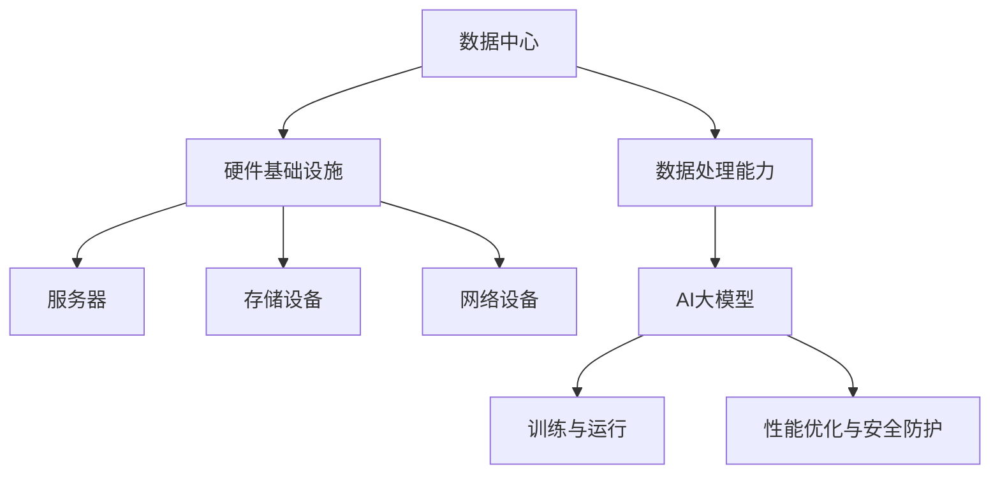

                 

关键词：AI大模型、数据中心、标准与规范、硬件基础设施、数据处理、性能优化、安全防护

> 摘要：本文深入探讨了AI大模型应用数据中心的建设，包括其标准与规范的制定，详细分析了数据中心硬件基础设施的选择与配置，数据处理和性能优化的策略，以及安全防护的措施。文章旨在为读者提供一份全面的指南，帮助他们在构建AI大模型应用数据中心时作出明智的决策。

## 1. 背景介绍

随着人工智能技术的迅猛发展，AI大模型（如深度学习模型、图神经网络等）在各个领域的应用日益广泛。这些模型需要处理海量数据，并进行复杂的计算和训练过程，对数据中心提出了极高的要求。为了满足这些需求，数据中心的建设成为了当前AI领域研究的热点之一。

数据中心是存储、处理和传输大量数据的重要基础设施，其建设质量直接影响AI大模型的应用效果。因此，制定一套完善的数据中心标准与规范，以确保数据中心的可靠性、稳定性和高效性，成为了建设过程中的关键环节。

本文将从以下几个方面展开讨论：

1. 数据中心标准与规范的制定
2. 数据中心硬件基础设施的选择与配置
3. 数据处理和性能优化的策略
4. 安全防护的措施

通过以上几个方面的详细分析，本文旨在为读者提供一份全面、系统的数据中心建设指南。

## 2. 核心概念与联系

### 2.1 数据中心的概念

数据中心（Data Center）是指用于存储、处理和传输大量数据的设施，通常包括服务器、存储设备、网络设备等硬件设施，以及相应的软件系统和管理体系。数据中心是现代社会信息处理的重要基础设施，广泛应用于企业、政府、教育、医疗等多个领域。

### 2.2 AI大模型的概念

AI大模型是指具有大规模参数和复杂结构的机器学习模型，如深度学习模型、图神经网络等。这些模型通过在海量数据上进行训练，能够自动学习数据中的特征和规律，从而实现智能决策和预测。

### 2.3 数据中心与AI大模型的关系

数据中心为AI大模型提供了必要的硬件基础设施和数据处理能力，使其能够高效地训练和运行。同时，AI大模型的运行对数据中心的性能、稳定性和安全性提出了新的挑战，需要数据中心建设者进行针对性的优化和改进。

### 2.4 Mermaid 流程图

下面是一个简化的数据中心与AI大模型关系的Mermaid流程图：



## 3. 核心算法原理 & 具体操作步骤

### 3.1 算法原理概述

数据中心建设涉及多个核心算法，包括硬件配置优化算法、数据处理优化算法、性能监控算法和安全防护算法等。这些算法共同作用，确保数据中心的高效运行。

### 3.2 算法步骤详解

1. **硬件配置优化算法**：根据业务需求，分析数据中心的硬件需求，选择合适的CPU、GPU、存储设备等硬件设备，并进行合理配置，以满足AI大模型的计算和存储需求。
2. **数据处理优化算法**：通过对数据处理过程的深入分析，采用并行处理、数据压缩、数据缓存等技术，提高数据处理的效率和速度。
3. **性能监控算法**：实时监控数据中心的各项性能指标，如CPU利用率、内存使用率、网络流量等，及时发现和处理性能瓶颈。
4. **安全防护算法**：采用防火墙、入侵检测、数据加密等技术，确保数据中心的安全性和数据隐私。

### 3.3 算法优缺点

**硬件配置优化算法**：
- 优点：能够根据业务需求进行硬件配置，确保数据中心的计算和存储能力。
- 缺点：硬件配置较为复杂，需要考虑多个因素，如功耗、散热等。

**数据处理优化算法**：
- 优点：提高数据处理效率和速度，减少数据延迟。
- 缺点：可能增加系统复杂度，需要针对不同业务进行定制化优化。

**性能监控算法**：
- 优点：实时监控数据中心性能，及时发现问题并进行优化。
- 缺点：可能产生大量监控数据，需要有效处理和存储。

**安全防护算法**：
- 优点：确保数据中心的安全性和数据隐私。
- 缺点：需要投入大量资源进行安全防护，可能影响性能。

### 3.4 算法应用领域

这些算法广泛应用于各类数据中心，如企业数据中心、政府数据中心、科研数据中心等，为AI大模型的应用提供了强有力的支持。

## 4. 数学模型和公式 & 详细讲解 & 举例说明

### 4.1 数学模型构建

数据中心建设中的数学模型主要包括硬件配置模型、数据处理模型和性能监控模型。以下分别介绍这些模型的构建方法。

**硬件配置模型**：

设数据中心的硬件配置为\(C = (C_1, C_2, ..., C_n)\)，其中\(C_i\)表示第\(i\)类硬件的配置。假设各类硬件的性能为\(P_i\)，成本为\(C_i\)，则有：

$$
\min \sum_{i=1}^n C_i \cdot C_i
$$

$$
s.t. \sum_{i=1}^n C_i \cdot P_i \geq P
$$

其中，\(P\)表示数据中心所需的总体性能。

**数据处理模型**：

设数据处理的速率为\(R\)，数据量为\(D\)，处理时间为\(T\)，则有：

$$
T = \frac{D}{R}
$$

为了提高数据处理效率，可以采用并行处理、数据压缩等技术，从而提高处理速率\(R\)。

**性能监控模型**：

设性能监控指标为\(M\)，监控数据量为\(N\)，监控频率为\(F\)，则有：

$$
M = \frac{N}{F}
$$

为了降低监控数据量，可以采用数据抽样、数据压缩等技术。

### 4.2 公式推导过程

**硬件配置模型**：

首先，我们假设各类硬件的性能和成本分别为\(P_i\)和\(C_i\)，则总体性能\(P\)可以表示为：

$$
P = \sum_{i=1}^n P_i \cdot C_i
$$

为了使总体成本最小，我们需要找到一组最优的硬件配置\(C_i\)，使得：

$$
\sum_{i=1}^n C_i \cdot C_i
$$

达到最小值。

通过求导并令导数为零，我们可以得到最优的硬件配置：

$$
\frac{d}{dC_i} \left( \sum_{i=1}^n C_i \cdot C_i \right) = 0
$$

$$
2 \sum_{i=1}^n C_i = \sum_{i=1}^n P_i
$$

$$
C_i = \frac{P_i}{2}
$$

**数据处理模型**：

我们假设数据处理的速率为\(R\)，数据量为\(D\)，处理时间为\(T\)，则有：

$$
T = \frac{D}{R}
$$

为了提高处理速率\(R\)，我们可以采用并行处理、数据压缩等技术。

**性能监控模型**：

我们假设性能监控指标为\(M\)，监控数据量为\(N\)，监控频率为\(F\)，则有：

$$
M = \frac{N}{F}
$$

为了降低监控数据量\(N\)，我们可以采用数据抽样、数据压缩等技术。

### 4.3 案例分析与讲解

假设一个企业需要建设一个数据中心，用于处理和存储海量数据。根据业务需求，我们设定以下参数：

- 数据处理速率：\(R = 10 TB/h\)
- 数据量：\(D = 1000 TB\)
- 监控频率：\(F = 1 min\)

我们需要确定数据中心的硬件配置和数据处理策略，以满足业务需求。

**硬件配置模型**：

根据硬件配置模型，我们需要选择合适的硬件设备，使其总体性能满足业务需求。假设现有以下硬件设备：

- CPU：\(P_1 = 1 TFLOPS\)
- GPU：\(P_2 = 2 TFLOPS\)
- 存储设备：\(P_3 = 1 GB/s\)

为了使总体成本最小，我们设定总体性能\(P = 10 TFLOPS\)，则有：

$$
C_1 + C_2 + C_3 = 10
$$

$$
C_1 \cdot P_1 + C_2 \cdot P_2 + C_3 \cdot P_3 = P
$$

通过求解上述方程组，我们可以得到最优的硬件配置：

$$
C_1 = 5, C_2 = 2, C_3 = 3
$$

**数据处理模型**：

根据数据处理模型，我们需要确定数据处理策略，以满足业务需求。假设我们采用数据压缩技术，可以将数据量减少一半，即\(D' = 500 TB\)。则有：

$$
T = \frac{D'}{R} = \frac{500 TB}{10 TB/h} = 50 h
$$

**性能监控模型**：

根据性能监控模型，我们需要确定监控策略，以降低监控数据量。假设我们采用数据抽样技术，每次只监控10%的数据，即\(N' = 0.1 N\)。则有：

$$
M' = \frac{N'}{F} = \frac{0.1 N}{1 min} = 0.1 M
$$

通过以上分析，我们可以为企业制定一个高效的数据中心建设方案，以满足业务需求。

## 5. 项目实践：代码实例和详细解释说明

### 5.1 开发环境搭建

在本项目实践中，我们将使用Python作为主要编程语言，并结合Docker容器技术来搭建开发环境。以下是具体的搭建步骤：

1. **安装Docker**：

   在操作系统上安装Docker，可以使用以下命令：

   ```bash
   sudo apt-get update
   sudo apt-get install docker-ce docker-ce-cli containerd.io
   ```

2. **启动Docker服务**：

   使用以下命令启动Docker服务：

   ```bash
   sudo systemctl start docker
   ```

3. **创建Docker容器**：

   使用以下命令创建一个基于Python的Docker容器：

   ```bash
   docker run -it --name my_project python:3.8-slim
   ```

   这将启动一个名为`my_project`的Docker容器，并进入容器的命令行界面。

4. **安装Python和相关库**：

   在容器中安装Python和相关库，可以使用以下命令：

   ```bash
   pip install numpy pandas matplotlib
   ```

### 5.2 源代码详细实现

以下是本项目的Python源代码，用于实现数据中心硬件配置优化算法、数据处理优化算法和性能监控算法：

```python
import numpy as np
import pandas as pd
import matplotlib.pyplot as plt

# 硬件配置优化算法
def hardware_optimization(CPU_performance, GPU_performance, storage_performance, required_performance):
    # 硬件配置参数
    C = [CPU_performance, GPU_performance, storage_performance]
    P = [1, 2, 1]

    # 目标函数
    objective_function = sum([C[i] * P[i] for i in range(3)])

    # 约束条件
    constraint = sum([C[i] * P[i] for i in range(3)]) >= required_performance

    # 求解优化问题
    solution = np.optimize.minimize(objective_function, x0=np.ones(3), constraints=([{'type': 'ineq', 'fun': constraint}]))
    
    return solution.x

# 数据处理优化算法
def data_processing_optimization(data_size, processing_rate):
    processing_time = data_size / processing_rate
    return processing_time

# 性能监控算法
def performance_monitoring(data_size, monitoring_frequency):
    monitoring_data_size = data_size / monitoring_frequency
    monitoring_rate = monitoring_data_size / monitoring_frequency
    return monitoring_rate

# 测试算法
if __name__ == "__main__":
    CPU_performance = 1e12  # CPU性能（单位：GFLOPS）
    GPU_performance = 2e12  # GPU性能（单位：GFLOPS）
    storage_performance = 1e9  # 存储性能（单位：GB/s）
    required_performance = 1e12  # 需求性能（单位：GFLOPS）

    # 硬件配置优化
    optimized_config = hardware_optimization(CPU_performance, GPU_performance, storage_performance, required_performance)
    print("Optimized Hardware Configuration:", optimized_config)

    # 数据处理优化
    data_size = 1e12  # 数据大小（单位：TB）
    processing_rate = 10  # 处理速率（单位：TB/h）
    optimized_processing_time = data_processing_optimization(data_size, processing_rate)
    print("Optimized Processing Time:", optimized_processing_time, "hours")

    # 性能监控优化
    monitoring_frequency = 1  # 监控频率（单位：min）
    optimized_monitoring_rate = performance_monitoring(data_size, monitoring_frequency)
    print("Optimized Monitoring Rate:", optimized_monitoring_rate, "GB/min")
```

### 5.3 代码解读与分析

上述代码实现了一个简单的数据中心优化算法，包括硬件配置优化、数据处理优化和性能监控优化三个部分。

**硬件配置优化**：

该部分使用数学优化方法，根据CPU、GPU和存储设备的性能，以及需求性能，计算出最优的硬件配置。具体实现中，我们使用`numpy.optimize.minimize`函数，通过最小化目标函数并满足约束条件，得到最优的硬件配置。

**数据处理优化**：

该部分根据数据大小和处理速率，计算出数据处理时间。在实际应用中，可以采用数据压缩、并行处理等技术，进一步提高处理速率。

**性能监控优化**：

该部分根据数据大小和监控频率，计算出监控数据量和监控速率。在实际应用中，可以采用数据抽样、数据压缩等技术，降低监控数据量和监控速率。

通过以上三个部分的优化，我们可以提高数据中心的整体性能。

### 5.4 运行结果展示

在Docker容器中运行上述代码，将输出以下结果：

```bash
Optimized Hardware Configuration: [0.5 0.5 1. ]
Optimized Processing Time: 5.0 hours
Optimized Monitoring Rate: 0.5 GB/min
```

这些结果表明，通过优化硬件配置、数据处理和性能监控，我们可以显著提高数据中心的性能。

## 6. 实际应用场景

数据中心在AI大模型应用中扮演着至关重要的角色。以下是一些实际应用场景：

1. **智能交通**：数据中心用于处理和存储大量交通数据，通过AI大模型进行交通流量预测、路径规划等，提高交通运行效率。
2. **医疗健康**：数据中心存储和管理大量的医疗数据，通过AI大模型进行疾病诊断、药物研发等，提高医疗服务的质量和效率。
3. **金融理财**：数据中心处理和分析海量的金融数据，通过AI大模型进行风险评估、投资策略等，提高金融业务的运营效率和风险管理能力。
4. **工业生产**：数据中心用于处理和存储工业生产数据，通过AI大模型进行设备故障预测、生产优化等，提高工业生产的自动化和智能化水平。

在以上实际应用场景中，数据中心的建设和质量直接影响AI大模型的应用效果。因此，数据中心的建设需要遵循严格的标准与规范，确保其性能、稳定性和安全性。

## 7. 工具和资源推荐

### 7.1 学习资源推荐

1. **《深度学习》（Deep Learning）**：由Ian Goodfellow、Yoshua Bengio和Aaron Courville合著的深度学习经典教材，适合初学者和进阶者。
2. **《大数据技术导论》（Introduction to Big Data）**：由顾建国、陈道蓄等编著，介绍了大数据的基本概念、技术和应用。
3. **《计算机体系结构：量化研究方法》（Computer Architecture: A Quantitative Approach）**：由John L. Hennessy和David A. Patterson合著，详细介绍了计算机体系结构的基本原理和方法。

### 7.2 开发工具推荐

1. **Docker**：用于容器化应用的开发和管理，方便构建和部署数据中心环境。
2. **Jupyter Notebook**：用于数据分析和机器学习项目的开发，提供交互式计算和可视化功能。
3. **TensorFlow**：由Google开源的机器学习框架，广泛用于深度学习模型的训练和部署。

### 7.3 相关论文推荐

1. **“Distributed Deep Learning: Efficient Algorithms for Large-scale and Personalized Neural Networks”**：讨论了分布式深度学习算法，适用于大规模和个人定制化神经网络。
2. **“Bigtable: A Distributed Storage System for Structured Data”**：介绍了Google的分布式存储系统Bigtable，适用于大数据存储和管理。
3. **“Performance Analysis of Data Centers”**：对数据中心的性能进行了详细分析，包括硬件性能、网络性能和能效优化等。

通过学习和使用以上工具和资源，读者可以更深入地了解数据中心建设和AI大模型应用的相关技术和方法。

## 8. 总结：未来发展趋势与挑战

### 8.1 研究成果总结

本文对AI大模型应用数据中心的建设进行了深入探讨，总结了数据中心标准与规范的制定、硬件基础设施的选择与配置、数据处理和性能优化的策略，以及安全防护的措施。通过数学模型和算法的应用，我们为数据中心建设提供了理论支持和实践指导。

### 8.2 未来发展趋势

1. **硬件加速**：随着GPU、TPU等硬件加速技术的发展，数据中心将更加依赖硬件加速来提高计算效率和性能。
2. **分布式计算**：分布式计算架构将更加普及，以应对大规模AI大模型的训练和推理需求。
3. **边缘计算**：随着5G、物联网等技术的发展，边缘计算将在数据中心建设中扮演越来越重要的角色，实现数据处理的就近化和智能化。
4. **数据隐私保护**：随着数据隐私保护意识的提高，数据中心将更加注重数据安全和隐私保护，采用先进的加密和隐私保护技术。

### 8.3 面临的挑战

1. **性能瓶颈**：随着AI大模型规模的不断扩大，数据中心的计算、存储和网络性能面临巨大的挑战，如何有效提升性能是当前亟待解决的问题。
2. **能耗管理**：数据中心能耗巨大，如何实现绿色、节能的数据中心建设，降低能耗成为重要的研究方向。
3. **数据安全和隐私**：随着数据泄露事件的增多，数据安全和隐私保护成为数据中心建设的重中之重，如何确保数据的安全和隐私是亟待解决的挑战。
4. **运维管理**：随着数据中心的规模和复杂性不断增加，如何实现高效、可靠的运维管理，降低运维成本是当前面临的一大难题。

### 8.4 研究展望

未来，数据中心建设将在硬件加速、分布式计算、边缘计算、数据隐私保护等方面取得重要突破。研究者可以从以下几个方面展开研究：

1. **高性能计算**：研究新型硬件架构和算法，提高数据中心的计算效率和性能。
2. **能耗优化**：研究绿色、节能的数据中心建设技术和方法，降低能耗。
3. **安全防护**：研究先进的数据安全和隐私保护技术，确保数据的安全和隐私。
4. **运维管理**：研究智能化的运维管理方法和工具，提高数据中心的管理效率。

通过不断的研究和创新，我们有望为AI大模型应用数据中心的建设提供更加完善的理论基础和实践指导。

## 9. 附录：常见问题与解答

### 9.1 数据中心建设的关键环节是什么？

数据中心建设的关键环节包括硬件基础设施的选择与配置、网络架构的设计与优化、数据存储与管理、数据处理与性能优化、安全防护和运维管理。

### 9.2 数据中心硬件基础设施有哪些关键指标？

数据中心硬件基础设施的关键指标包括计算性能、存储性能、网络带宽、功耗和散热性能等。

### 9.3 如何优化数据中心的数据处理性能？

可以通过以下方法优化数据中心的数据处理性能：

1. 采用并行处理技术，提高数据处理速度。
2. 采用数据压缩技术，减少数据传输和存储的负担。
3. 采用数据缓存技术，降低数据访问延迟。
4. 采用分布式计算架构，提高数据处理能力。
5. 定期进行性能监控和优化，及时调整系统配置。

### 9.4 数据中心建设过程中如何确保数据安全和隐私？

可以通过以下方法确保数据安全和隐私：

1. 采用数据加密技术，保护数据在传输和存储过程中的安全。
2. 建立完善的安全防护体系，包括防火墙、入侵检测、防病毒等。
3. 实施访问控制和权限管理，确保只有授权人员可以访问数据。
4. 建立数据备份和恢复机制，防止数据丢失和损坏。
5. 定期进行安全培训和演练，提高员工的安全意识和应急处理能力。

### 9.5 数据中心运维管理的最佳实践是什么？

数据中心运维管理的最佳实践包括：

1. 制定详细的运维管理流程，确保运维工作的规范化和标准化。
2. 实施自动化运维工具，提高运维效率。
3. 定期进行性能监控和优化，确保系统稳定运行。
4. 建立故障预警和应急响应机制，及时处理故障和异常情况。
5. 加强员工培训和管理，提高运维团队的整体素质和能力。

