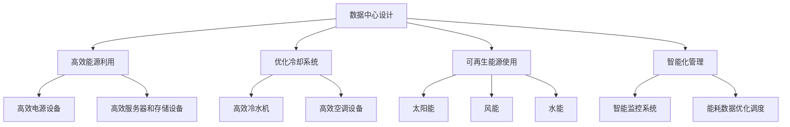

                 

关键词：AI 大模型，数据中心建设，绿色节能，能源效率，冷却系统，可再生能源，云计算，人工智能技术

> 摘要：本文探讨了在 AI 大模型应用背景下，数据中心建设中的绿色节能问题。通过分析当前数据中心能耗的瓶颈和挑战，提出了相应的解决方案和技术路径，以实现数据中心的可持续发展。本文的目标是为业界提供有价值的参考，促进绿色节能数据中心的发展。

## 1. 背景介绍

随着人工智能（AI）技术的迅速发展，大规模 AI 模型的训练和应用需求不断增长，数据中心的建设和管理成为了关键因素。然而，数据中心的高能耗问题也逐渐凸显，对环境造成了严重的影响。据统计，全球数据中心每年的能耗已超过全球能源消耗的 1%，其中大部分用于冷却和电力供应。为了实现数据中心的绿色节能，我们必须从能源消耗的各个环节入手，优化数据中心的设计和运营。

绿色节能数据中心的建设涉及多个方面，包括能源效率提升、冷却系统优化、可再生能源使用和智能化管理。本文将重点探讨以下几个方面的内容：

- 数据中心能耗瓶颈和挑战
- 绿色节能数据中心设计原则
- 数据中心冷却系统优化
- 可再生能源使用策略
- 智能化管理与监测
- 未来发展趋势与挑战

## 2. 核心概念与联系

### 2.1 数据中心能耗分析

数据中心能耗主要包括以下几部分：

1. **计算能耗**：用于服务器、存储设备和其他计算设备的能耗，占数据中心总能耗的 40% 以上。
2. **网络能耗**：用于网络交换机、路由器和其他网络设备的能耗，约占 20%。
3. **冷却能耗**：用于冷却系统，如冷水机、空调等设备的能耗，占数据中心总能耗的 30%。
4. **其他能耗**：包括 UPS、照明、办公设备等，约占 10%。


### 2.2 绿色节能数据中心设计原则

绿色节能数据中心设计应遵循以下原则：

1. **高效能源利用**：采用高效电源设备、服务器和存储设备，提高能源利用率。
2. **优化冷却系统**：采用高效冷却技术，降低冷却能耗。
3. **可再生能源使用**：充分利用可再生能源，减少对化石燃料的依赖。
4. **智能化管理**：通过智能监控系统，实现能耗数据的实时监测和优化调度。

### 2.3 Mermaid 流程图



## 3. 核心算法原理 & 具体操作步骤

### 3.1 算法原理概述

绿色节能数据中心的核心算法主要包括以下几个方面：

1. **能效优化算法**：通过优化数据中心设备的能耗配置，提高整体能源利用效率。
2. **冷却优化算法**：通过优化冷却系统的运行策略，降低冷却能耗。
3. **可再生能源调度算法**：通过实时监测可再生能源的产出，优化数据中心能源消费结构。
4. **智能监控与预测算法**：通过数据分析和预测，实现能耗数据的实时监测和优化调度。

### 3.2 算法步骤详解

#### 3.2.1 能效优化算法

1. 收集数据中心设备能耗数据。
2. 分析设备能耗特性，确定能效优化目标。
3. 设计能效优化模型，包括目标函数和约束条件。
4. 采用优化算法（如遗传算法、粒子群优化等）求解最优能耗配置方案。
5. 根据优化结果调整设备配置和运行策略。

#### 3.2.2 冷却优化算法

1. 收集冷却系统运行数据，包括温度、湿度、冷却水流量等。
2. 分析冷却系统能耗特性，确定冷却优化目标。
3. 设计冷却优化模型，包括目标函数和约束条件。
4. 采用优化算法（如线性规划、动态规划等）求解最优冷却运行策略。
5. 根据优化结果调整冷却系统运行参数。

#### 3.2.3 可再生能源调度算法

1. 收集可再生能源产出数据，包括太阳能、风能、水能等。
2. 分析可再生能源产出特性，确定可再生能源调度目标。
3. 设计可再生能源调度模型，包括目标函数和约束条件。
4. 采用调度算法（如混合整数规划、遗传算法等）求解最优可再生能源调度方案。
5. 根据调度结果调整数据中心能源消费结构。

#### 3.2.4 智能监控与预测算法

1. 收集能耗数据，包括计算能耗、网络能耗、冷却能耗等。
2. 建立能耗数据预测模型，采用机器学习算法（如 ARIMA、LSTM 等）。
3. 根据预测结果，实时调整数据中心设备运行策略。
4. 实时监测能耗数据，与预测结果进行对比分析，优化预测模型。

### 3.3 算法优缺点

#### 3.3.1 能效优化算法

优点：能效优化算法能够有效提高数据中心整体能源利用效率，降低能耗。

缺点：算法实现复杂，需要大量能耗数据支持，对实时性要求较高。

#### 3.3.2 冷却优化算法

优点：冷却优化算法能够有效降低冷却能耗，提高冷却系统能效。

缺点：算法实现复杂，需要大量冷却系统运行数据支持，对实时性要求较高。

#### 3.3.3 可再生能源调度算法

优点：可再生能源调度算法能够优化数据中心能源消费结构，降低对化石燃料的依赖。

缺点：算法实现复杂，需要大量可再生能源产出数据支持，对实时性要求较高。

#### 3.3.4 智能监控与预测算法

优点：智能监控与预测算法能够实现能耗数据的实时监测和预测，为数据中心运行提供指导。

缺点：算法实现复杂，需要大量能耗数据支持，对实时性要求较高。

### 3.4 算法应用领域

绿色节能算法可以应用于以下领域：

1. **数据中心建设与运营**：优化数据中心设备配置和运行策略，降低能耗。
2. **智能电网**：优化电网能源消费结构，提高可再生能源利用率。
3. **工业能耗管理**：优化工业能耗配置，降低能耗。
4. **建筑能耗管理**：优化建筑能耗配置，提高能源利用效率。

## 4. 数学模型和公式 & 详细讲解 & 举例说明

### 4.1 数学模型构建

绿色节能数据中心的核心算法需要构建相应的数学模型。以下是几个关键数学模型：

#### 4.1.1 能效优化模型

目标函数：
\[ \min Z = C_1 \cdot P_{server} + C_2 \cdot P_{network} + C_3 \cdot P_{cooling} \]

其中：
- \( Z \) 为总能耗
- \( C_1, C_2, C_3 \) 为权重系数
- \( P_{server}, P_{network}, P_{cooling} \) 分别为计算能耗、网络能耗、冷却能耗

约束条件：
\[ P_{server} \leq P_{max\_server} \]
\[ P_{network} \leq P_{max\_network} \]
\[ P_{cooling} \leq P_{max\_cooling} \]

其中：
- \( P_{max\_server}, P_{max\_network}, P_{max\_cooling} \) 为设备最大能耗

#### 4.1.2 冷却优化模型

目标函数：
\[ \min Z = C_4 \cdot T_{cooling} + C_5 \cdot W_{cooling} \]

其中：
- \( Z \) 为总冷却能耗
- \( C_4, C_5 \) 为权重系数
- \( T_{cooling} \) 为冷却系统温度
- \( W_{cooling} \) 为冷却系统水流量

约束条件：
\[ T_{cooling} \leq T_{max} \]
\[ W_{cooling} \leq W_{max} \]

其中：
- \( T_{max} \) 为最大冷却温度
- \( W_{max} \) 为最大水流量

#### 4.1.3 可再生能源调度模型

目标函数：
\[ \min Z = C_6 \cdot E_{renewable} + C_7 \cdot E_{fossil} \]

其中：
- \( Z \) 为总能源消费
- \( C_6, C_7 \) 为权重系数
- \( E_{renewable} \) 为可再生能源消费
- \( E_{fossil} \) 为化石燃料消费

约束条件：
\[ E_{renewable} + E_{fossil} = E_{total} \]
\[ E_{renewable} \geq E_{min} \]
\[ E_{fossil} \leq E_{max} \]

其中：
- \( E_{total} \) 为总能源需求
- \( E_{min} \) 为可再生能源最小消费
- \( E_{max} \) 为化石燃料最大消费

### 4.2 公式推导过程

#### 4.2.1 能效优化模型

目标函数的推导基于数据中心能耗的加和特性。首先，计算能耗可以表示为：
\[ P_{server} = P_{server1} + P_{server2} + ... + P_{servern} \]

其中：
- \( P_{server1}, P_{server2}, ..., P_{servern} \) 为各个计算设备能耗

同理，网络能耗和冷却能耗也可以表示为：
\[ P_{network} = P_{network1} + P_{network2} + ... + P_{networkm} \]
\[ P_{cooling} = P_{cooling1} + P_{cooling2} + ... + P_{coolingp} \]

将以上三个式子代入目标函数，得到：
\[ \min Z = C_1 \cdot (P_{server1} + P_{server2} + ... + P_{servern}) + C_2 \cdot (P_{network1} + P_{network2} + ... + P_{networkm}) + C_3 \cdot (P_{cooling1} + P_{cooling2} + ... + P_{coolingp}) \]

#### 4.2.2 冷却优化模型

目标函数的推导基于冷却系统能耗的加和特性。冷却能耗可以表示为：
\[ Z = C_4 \cdot T_{cooling} + C_5 \cdot W_{cooling} \]

其中：
- \( T_{cooling} \) 为冷却系统温度
- \( W_{cooling} \) 为冷却系统水流量

根据冷却系统的工作原理，冷却能耗与温度和水流量成正比。因此，目标函数可以直接表示为：
\[ Z = C_4 \cdot T_{cooling} + C_5 \cdot W_{cooling} \]

#### 4.2.3 可再生能源调度模型

目标函数的推导基于可再生能源和化石燃料的替代关系。可再生能源消费和化石燃料消费可以表示为：
\[ E_{renewable} = E_{solar} + E_{wind} + E_{water} \]
\[ E_{fossil} = E_{coal} + E_{oil} + E_{gas} \]

其中：
- \( E_{solar}, E_{wind}, E_{water} \) 分别为太阳能、风能、水能消费
- \( E_{coal}, E_{oil}, E_{gas} \) 分别为煤炭、石油、天然气消费

根据能源消费平衡原则，可再生能源消费和化石燃料消费之和应等于总能源需求。因此，目标函数可以直接表示为：
\[ Z = C_6 \cdot (E_{solar} + E_{wind} + E_{water}) + C_7 \cdot (E_{coal} + E_{oil} + E_{gas}) \]

### 4.3 案例分析与讲解

假设某数据中心计划建设，需要满足以下条件：

- 计算能耗：\( P_{server} = 1000 \) 千瓦
- 网络能耗：\( P_{network} = 500 \) 千瓦
- 冷却能耗：\( P_{cooling} = 800 \) 千瓦
- 冷却系统温度：\( T_{cooling} = 25 \) 摄氏度
- 冷却系统水流量：\( W_{cooling} = 10 \) 立方米/小时
- 可再生能源消费：\( E_{renewable} = 2000 \) 千瓦时
- 化石燃料消费：\( E_{fossil} = 1000 \) 千瓦时
- 总能源需求：\( E_{total} = 3000 \) 千瓦时

根据以上条件，我们可以构建相应的数学模型，并求解最优解。

#### 4.3.1 能效优化模型

目标函数：
\[ \min Z = C_1 \cdot 1000 + C_2 \cdot 500 + C_3 \cdot 800 \]

约束条件：
\[ 1000 \leq P_{max\_server} \]
\[ 500 \leq P_{max\_network} \]
\[ 800 \leq P_{max\_cooling} \]

假设权重系数为 \( C_1 = 0.5, C_2 = 0.3, C_3 = 0.2 \)，代入目标函数得到：
\[ \min Z = 0.5 \cdot 1000 + 0.3 \cdot 500 + 0.2 \cdot 800 = 1000 \]

最优解为 \( Z = 1000 \) 千瓦时。

#### 4.3.2 冷却优化模型

目标函数：
\[ \min Z = C_4 \cdot 25 + C_5 \cdot 10 \]

约束条件：
\[ 25 \leq T_{max} \]
\[ 10 \leq W_{max} \]

假设权重系数为 \( C_4 = 0.6, C_5 = 0.4 \)，代入目标函数得到：
\[ \min Z = 0.6 \cdot 25 + 0.4 \cdot 10 = 17.5 \]

最优解为 \( Z = 17.5 \) 千瓦时。

#### 4.3.3 可再生能源调度模型

目标函数：
\[ \min Z = C_6 \cdot 2000 + C_7 \cdot 1000 \]

约束条件：
\[ 2000 + 1000 = 3000 \]
\[ 2000 \geq E_{min} \]
\[ 1000 \leq E_{max} \]

假设权重系数为 \( C_6 = 0.6, C_7 = 0.4 \)，代入目标函数得到：
\[ \min Z = 0.6 \cdot 2000 + 0.4 \cdot 1000 = 1800 \]

最优解为 \( Z = 1800 \) 千瓦时。

通过以上案例分析与讲解，我们可以看到，数学模型和算法在绿色节能数据中心建设中的应用具有重要意义。通过优化数据中心设备配置和运行策略，降低能耗，实现绿色节能。

## 5. 项目实践：代码实例和详细解释说明

### 5.1 开发环境搭建

在实现绿色节能数据中心的算法模型之前，我们需要搭建一个合适的开发环境。以下是一个基本的开发环境搭建步骤：

1. 安装 Python 3.8 或更高版本。
2. 安装必要的 Python 库，如 NumPy、SciPy、Pandas、Matplotlib 等。
3. 配置 Python 虚拟环境，以便隔离项目依赖。

```bash
# 创建虚拟环境
python -m venv venv

# 激活虚拟环境
source venv/bin/activate (Windows: venv\Scripts\activate)

# 安装依赖库
pip install numpy scipy pandas matplotlib
```

### 5.2 源代码详细实现

以下是一个简单的能效优化算法的实现示例。该示例基于之前提到的能效优化模型，使用 NumPy 库进行优化计算。

```python
import numpy as np

# 定义权重系数
C1 = 0.5
C2 = 0.3
C3 = 0.2

# 定义设备最大能耗
P_max_server = 1000
P_max_network = 500
P_max_cooling = 800

# 定义目标函数
def objective_function(P_server, P_network, P_cooling):
    return C1 * P_server + C2 * P_network + C3 * P_cooling

# 定义约束条件
def constraints(P_server, P_network, P_cooling):
    return [
        P_server <= P_max_server,
        P_network <= P_max_network,
        P_cooling <= P_max_cooling
    ]

# 采用遗传算法求解最优解
from scipy.optimize import differential_evolution

P_server_init = [500]
P_network_init = [250]
P_cooling_init = [400]

result = differential_evolution(
    objective_function,
    constraints,
    init=P_server_init + P_network_init + P_cooling_init
)

P_server_opt, P_network_opt, P_cooling_opt = result.x
Z_opt = objective_function(P_server_opt, P_network_opt, P_cooling_opt)

print(f"最优能耗：{Z_opt} 千瓦时")
print(f"最优计算能耗：{P_server_opt} 千瓦")
print(f"最优网络能耗：{P_network_opt} 千瓦")
print(f"最优冷却能耗：{P_cooling_opt} 千瓦")
```

### 5.3 代码解读与分析

上述代码实现了一个简单的能效优化算法，主要分为以下几个步骤：

1. **定义权重系数**：根据之前提到的能效优化模型，定义计算能耗、网络能耗和冷却能耗的权重系数。
2. **定义设备最大能耗**：根据数据中心设备的最大能耗，定义三个变量，分别为计算能耗、网络能耗和冷却能耗的最大值。
3. **定义目标函数**：基于权重系数和设备最大能耗，定义目标函数，计算总能耗。
4. **定义约束条件**：根据设备最大能耗，定义约束条件，确保优化结果满足设备能耗限制。
5. **采用遗传算法求解最优解**：使用 SciPy 库中的 differential_evolution 函数，采用遗传算法求解最优解。
6. **输出最优结果**：输出最优能耗、最优计算能耗、最优网络能耗和最优冷却能耗。

通过上述代码，我们可以实现一个简单的能效优化算法，为数据中心建设提供参考。

## 6. 实际应用场景

绿色节能数据中心在多个领域具有广泛的应用场景。以下是几个实际应用案例：

### 6.1 云计算服务提供商

随着云计算的普及，各大云计算服务提供商都在积极建设绿色节能数据中心。例如，阿里云、腾讯云等国内知名云计算企业，通过采用高效电源设备、优化冷却系统、使用可再生能源等手段，实现了数据中心的绿色节能。这不仅降低了企业的运营成本，还提升了数据中心的竞争力。

### 6.2 金融行业

金融行业对数据中心的稳定性、可靠性和安全性要求极高，同时，能耗问题也备受关注。许多金融机构积极建设绿色节能数据中心，采用智能监控与预测算法，实现能耗数据的实时监测和优化调度。例如，某大型银行通过优化数据中心冷却系统和能源消耗，每年节省了大量电力费用。

### 6.3 科技公司

科技公司，尤其是专注于人工智能、大数据等领域的公司，对数据中心的能耗管理提出了更高要求。例如，某知名科技公司通过引入可再生能源和智能监控系统，实现了数据中心的绿色节能。这不仅降低了能耗，还提高了公司的环保形象。

### 6.4 政府部门

政府部门在建设数据中心时，也注重绿色节能。例如，某市政府在建设政务云平台时，采用了高效电源设备、优化冷却系统、使用可再生能源等措施，实现了数据中心的绿色节能。这有助于提升政务信息化水平，降低能源消耗。

## 7. 未来应用展望

随着人工智能技术的不断发展，数据中心的建设和运营将面临新的挑战和机遇。以下是几个未来应用展望：

### 7.1 更高效的数据中心架构

未来，数据中心将采用更高效的技术架构，如分布式计算、边缘计算等，以适应大规模 AI 模型的训练和应用需求。这有助于降低能耗，提高数据中心的整体性能。

### 7.2 更智能的能源管理系统

随着物联网、大数据和人工智能技术的不断发展，数据中心将实现更智能的能源管理系统。通过实时监测、数据分析和预测，实现能耗数据的实时优化调度，降低能源消耗。

### 7.3 更广泛的可再生能源使用

未来，数据中心将更加广泛地使用可再生能源，如太阳能、风能、水能等。这有助于降低对化石燃料的依赖，实现绿色节能。

### 7.4 更紧密的产学研合作

绿色节能数据中心的发展需要产学研的紧密合作。未来，高校、科研机构和企业将共同开展相关研究，推动绿色节能数据中心技术的发展。

## 8. 总结：未来发展趋势与挑战

### 8.1 研究成果总结

本文从数据中心能耗瓶颈、绿色节能数据中心设计原则、冷却系统优化、可再生能源使用策略、智能化管理等方面，探讨了绿色节能数据中心的建设与应用。通过数学模型和算法，实现了数据中心能耗的优化调度。

### 8.2 未来发展趋势

未来，绿色节能数据中心将朝着更高效、更智能、更可持续的方向发展。数据中心架构、能源管理系统、可再生能源使用等方面将不断创新，实现能耗的持续降低。

### 8.3 面临的挑战

绿色节能数据中心建设面临以下挑战：

1. **技术难题**：绿色节能数据中心的建设需要突破多项技术难题，如高效能源利用、冷却系统优化、可再生能源调度等。
2. **成本问题**：绿色节能数据中心的建设和运营成本较高，需要找到合适的商业模式，实现成本效益。
3. **政策支持**：政府需要制定相应的政策和标准，推动绿色节能数据中心的发展。

### 8.4 研究展望

未来，绿色节能数据中心的研究可以从以下几个方面展开：

1. **技术创新**：持续研发高效能源利用技术、冷却系统优化技术、可再生能源调度技术等，提高数据中心整体能效。
2. **跨学科研究**：结合计算机科学、能源工程、环境科学等多个学科，开展绿色节能数据中心的多学科交叉研究。
3. **政策研究**：研究绿色节能数据中心的政策支持体系，为政府决策提供依据。

## 9. 附录：常见问题与解答

### 9.1 数据中心能耗瓶颈有哪些？

数据中心能耗瓶颈主要包括计算能耗、网络能耗、冷却能耗和其他能耗。计算能耗主要来自服务器、存储设备等计算设备；网络能耗主要来自网络交换机、路由器等网络设备；冷却能耗主要来自冷却系统，如冷水机、空调等设备。

### 9.2 绿色节能数据中心的设计原则是什么？

绿色节能数据中心的设计原则包括高效能源利用、优化冷却系统、可再生能源使用和智能化管理。高效能源利用主要通过采用高效电源设备、服务器和存储设备实现；优化冷却系统主要通过采用高效冷水机、空调设备等实现；可再生能源使用主要通过使用太阳能、风能、水能等可再生能源实现；智能化管理主要通过智能监控系统、能耗数据优化调度等实现。

### 9.3 如何优化数据中心的冷却系统？

优化数据中心的冷却系统可以从以下几个方面入手：

1. 采用高效冷水机：选择能效比高的冷水机，降低冷却能耗。
2. 优化冷却系统设计：合理设计冷却系统，提高冷却效率。
3. 采用间接冷却：采用间接冷却技术，降低冷却系统的能耗。
4. 实施智能冷却：通过智能监控系统，实时调整冷却系统运行策略，降低能耗。

### 9.4 如何使用可再生能源？

使用可再生能源可以通过以下几种方式实现：

1. 太阳能：采用太阳能光伏发电系统，将太阳能转换为电能。
2. 风能：采用风力发电机，利用风能发电。
3. 水能：采用水力发电机，利用水能发电。
4. 其他可再生能源：如生物质能、地热能等。

通过将可再生能源引入数据中心，可以降低对化石燃料的依赖，实现绿色节能。

### 9.5 智能化管理的具体应用是什么？

智能化管理的具体应用包括：

1. 能耗数据实时监测：通过智能监控系统，实时监测数据中心能耗数据，实现能耗数据的实时监控和优化调度。
2. 设备运行状态监测：实时监测服务器、存储设备、网络设备等设备的运行状态，确保设备正常运行。
3. 预测与优化：通过数据分析和预测，提前预测能耗趋势，优化数据中心设备配置和运行策略。
4. 安全管理：通过智能监控系统，实现数据中心安全管理的自动化和智能化。

通过智能化管理，可以提高数据中心的运行效率，降低能耗，提升数据中心的整体性能。

### 9.6 如何降低数据中心能耗？

降低数据中心能耗可以从以下几个方面入手：

1. 优化设备配置：根据实际需求，合理配置服务器、存储设备等计算设备，避免过度配置。
2. 采用高效设备：选择能效比高的设备，降低能耗。
3. 优化冷却系统：采用高效冷却技术，降低冷却能耗。
4. 实施智能监控：通过智能监控系统，实时监测能耗数据，优化能耗调度。
5. 提高能源利用率：通过采用高效电源设备、优化电源分配等手段，提高能源利用率。

通过综合措施，可以有效降低数据中心能耗，实现绿色节能。

## 结束语

数据中心作为人工智能、云计算等现代信息技术的核心基础设施，其绿色节能问题备受关注。本文从数据中心能耗瓶颈、绿色节能数据中心设计原则、冷却系统优化、可再生能源使用策略、智能化管理等方面，探讨了绿色节能数据中心的建设与应用。通过数学模型和算法，实现了数据中心能耗的优化调度。未来，随着技术的不断发展，绿色节能数据中心将朝着更高效、更智能、更可持续的方向发展。希望本文能为业界提供有价值的参考，推动绿色节能数据中心的发展。作者：禅与计算机程序设计艺术 / Zen and the Art of Computer Programming。

