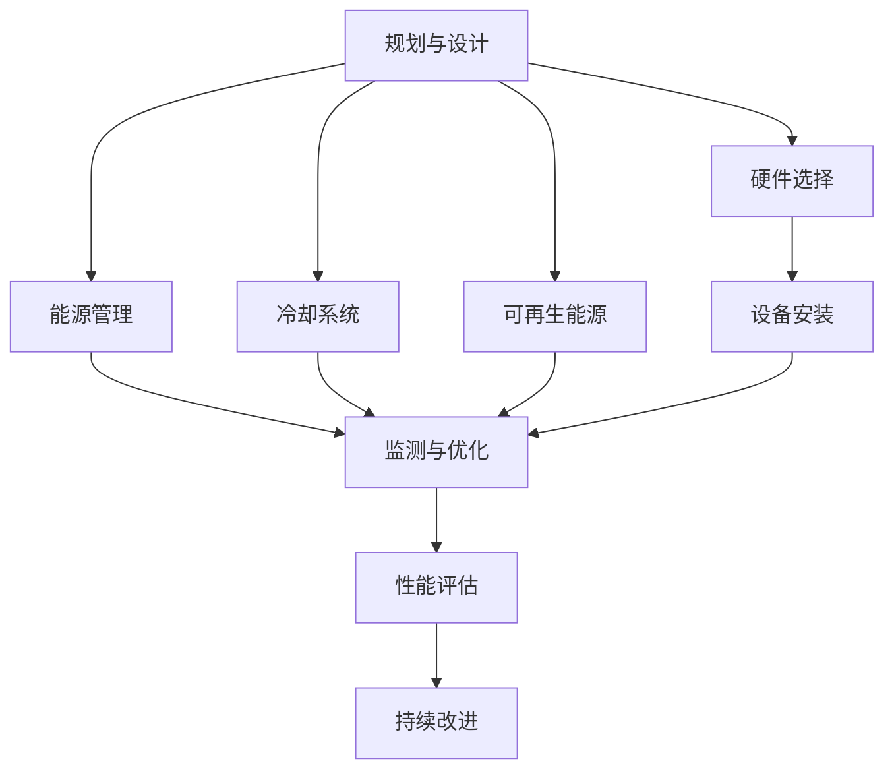

                 

### 1. 背景介绍

随着人工智能（AI）技术的飞速发展，大型模型（如GPT-3、BERT等）的应用越来越广泛。这些模型通常需要大量的计算资源和数据存储，因此，数据中心的建设成为了AI领域的重要课题。数据中心作为AI模型训练和部署的核心基础设施，其性能和稳定性直接影响AI应用的效率和可靠性。然而，数据中心的建设也带来了巨大的能源消耗和碳排放问题，尤其是在处理海量数据和高计算需求的AI任务时。

近年来，绿色节能成为了数据中心建设的重要方向。绿色数据中心不仅有助于降低运营成本，还能减少对环境的影响，实现可持续发展。绿色节能技术的应用，如高效能服务器、智能冷却系统、可再生能源使用等，正逐渐成为数据中心建设的标准。然而，AI大模型的特殊需求，如数据密集型和计算密集型任务，对数据中心的能源消耗提出了更高的要求。

本文将围绕AI大模型应用数据中心建设中的绿色节能技术进行深入探讨。首先，我们将介绍绿色数据中心的定义和重要性，然后分析AI大模型对数据中心性能和能源消耗的影响。接着，我们将详细探讨数据中心在绿色节能方面的挑战和解决方案。最后，我们将总结AI大模型应用数据中心建设的发展趋势和未来研究方向。

通过本文的探讨，我们希望能够为数据中心建设者、AI技术研发者以及政策制定者提供有价值的参考，共同推动绿色数据中心的可持续发展。

### 2. 核心概念与联系

#### 2.1 绿色数据中心定义

绿色数据中心是指在设计和运营过程中，通过采取一系列节能环保措施，最大限度地减少能源消耗和环境影响的数据中心。绿色数据中心的定义涵盖了多个方面，包括能源效率、碳排放管理、水资源利用、废弃物处理等。其核心目标是在确保数据中心高性能运行的同时，降低对环境的不利影响。

绿色数据中心的重要性主要体现在以下几个方面：

1. **降低运营成本**：通过采用高效的硬件设备和智能管理系统，绿色数据中心能够显著降低能耗和制冷成本，提高能源利用效率。

2. **提高可靠性**：绿色数据中心采用了先进的冷却和供电技术，能够更好地应对极端天气和环境变化，提高数据中心的可靠性和可用性。

3. **减少环境影响**：绿色数据中心通过减少能源消耗和碳排放，有助于缓解全球气候变化，实现可持续发展目标。

4. **增强竞争力**：在日益注重环保的今天，绿色数据中心能够提升企业的品牌形象和社会责任感，增强市场竞争力。

#### 2.2 AI大模型性能需求

AI大模型，如GPT-3、BERT等，具有以下几方面的性能需求：

1. **计算资源需求**：AI大模型通常需要大量的计算资源进行训练和推理，这要求数据中心具备强大的计算能力和扩展性。

2. **数据存储需求**：由于AI大模型涉及的海量数据，数据中心需要提供充足的存储资源，并保证数据的高效访问和管理。

3. **网络带宽需求**：大模型训练和推理过程中需要频繁访问和传输数据，因此数据中心需要具备高速、稳定的网络连接。

4. **能耗管理需求**：AI大模型的计算密集特性导致其能耗较高，这对数据中心的能源管理和碳排放控制提出了更高的要求。

#### 2.3 数据中心性能与能源消耗关系

数据中心的性能和能源消耗之间存在密切的关系。高效的硬件设备和智能管理系统可以提高数据中心的运行效率，从而降低能源消耗。例如，采用高性能服务器和高效电源设备可以减少能耗；智能冷却系统能够根据数据中心的热量分布进行优化，减少制冷能耗。

此外，AI大模型的计算需求对数据中心的能源消耗有显著影响。一方面，计算密集型任务会导致CPU、GPU等硬件设备长时间处于高负载状态，从而增加能耗；另一方面，大规模的数据存储和传输也会消耗大量的能源。

#### 2.4 绿色节能技术在数据中心的应用

绿色节能技术在数据中心的应用主要包括以下几个方面：

1. **高效硬件设备**：采用高效能服务器、存储设备和网络设备，提高设备能源利用效率。

2. **智能冷却系统**：采用智能冷却技术，如液冷、相变冷却等，降低数据中心制冷能耗。

3. **可再生能源使用**：利用太阳能、风能等可再生能源，减少对化石燃料的依赖，降低碳排放。

4. **能源管理系统**：通过实时监测和优化数据中心的能源使用，提高能源利用效率。

5. **数据中心集成设计**：在设计数据中心时，考虑环境因素，如地理位置、气候条件等，优化数据中心的布局和能耗管理。

#### 2.5 Mermaid 流程图

以下是一个描述绿色数据中心建设流程的Mermaid流程图，展示了各个阶段的关键环节和关联关系：



通过上述Mermaid流程图，我们可以清晰地看到绿色数据中心建设的主要步骤及其相互关系，为后续的详细探讨提供了基础。

### 3. 核心算法原理 & 具体操作步骤

#### 3.1 高效能服务器设计

高效能服务器是绿色数据中心的重要组成部分。其核心原理在于提高计算效率和降低能耗。以下是高效能服务器设计的关键步骤：

1. **硬件选型**：
   - **CPU选择**：选择具有高效核心和低功耗的CPU，如Intel的Xeon系列或AMD的EPYC系列。
   - **GPU选择**：对于深度学习任务，选择具有高性能和低能耗的GPU，如NVIDIA的A100或RTX 30系列。
   - **存储设备**：采用高速、低功耗的存储设备，如固态硬盘（SSD）或NVMe SSD。

2. **散热设计**：
   - **空气冷却**：采用高效散热风扇和风道设计，确保空气流通，降低服务器温度。
   - **液冷技术**：对于高密度部署，采用液体冷却系统，将热量迅速转移，提高冷却效率。

3. **能源管理**：
   - **动态电源管理**：通过智能电源管理技术，根据服务器负载动态调整电源供应，实现能效优化。
   - **节能模式**：设计节能模式，当服务器负载较低时，自动降低功耗，节省能源。

#### 3.2 智能冷却系统

智能冷却系统是绿色数据中心的关键技术之一，其主要目标是降低能耗并提高冷却效率。以下是智能冷却系统的具体操作步骤：

1. **温度监测**：
   - 安装温度传感器，实时监测数据中心各个区域的温度，确保数据中心的温度处于合理范围。

2. **冷却方式选择**：
   - **空气冷却**：使用高效散热风扇和风道设计，确保空气流通，降低服务器温度。
   - **液冷技术**：采用液体冷却系统，将热量迅速转移，提高冷却效率。

3. **智能控制**：
   - 利用智能控制系统，根据温度传感器监测到的数据，动态调整冷却设备的运行状态，如调整风扇转速或开启/关闭冷却设备。

4. **能量回收**：
   - 采用热回收技术，将冷却过程中产生的废热用于其他用途，如供暖或热水供应，减少能源浪费。

#### 3.3 可再生能源使用

可再生能源的使用是绿色数据中心的重要方向，以下是具体操作步骤：

1. **太阳能**：
   - 在数据中心部署太阳能光伏板，将太阳能转化为电能，供数据中心使用。

2. **风能**：
   - 在合适的地域部署风力发电设备，利用风能产生电力。

3. **储能系统**：
   - 采用电池储能系统，将可再生能源产生的电力储存起来，以供夜间或阴雨天使用。

4. **智能电网**：
   - 构建智能电网系统，实现数据中心与外部电网的智能互动，优化能源使用。

#### 3.4 能源管理系统

能源管理系统是实现绿色数据中心的关键技术之一，以下是能源管理系统的具体操作步骤：

1. **数据采集**：
   - 安装各种传感器，实时采集数据中心的能源消耗数据，包括电力、水、冷却剂等。

2. **数据监测**：
   - 通过能源管理平台，实时监测数据中心的能源使用情况，及时发现异常并进行处理。

3. **能效优化**：
   - 利用数据分析技术，对数据中心的能源使用进行优化，降低能耗。

4. **决策支持**：
   - 提供决策支持系统，帮助数据中心管理者制定节能策略和运营计划。

#### 3.5 数据中心集成设计

数据中心集成设计是绿色数据中心建设的重要环节，以下是具体操作步骤：

1. **选址**：
   - 根据数据中心的能源需求和环境条件，选择合适的地理位置，如气候温和、资源丰富的地方。

2. **布局**：
   - 设计数据中心布局，确保硬件设备、冷却系统、供电系统等的合理分布，提高整体运行效率。

3. **基础设施**：
   - 构建完善的基础设施，包括数据中心建筑物、供电系统、网络系统等，确保数据中心稳定运行。

4. **运维管理**：
   - 制定完善的运维管理策略，确保数据中心的安全、稳定和高效运行。

### 4. 数学模型和公式 & 详细讲解 & 举例说明

#### 4.1 数据中心能耗计算模型

数据中心能耗计算模型是评估数据中心能源消耗的重要工具。以下是一个简单的能耗计算模型：

$$
E = P \times t \times \eta
$$

其中：
- \( E \) 表示总能耗（单位：千瓦时，kWh）
- \( P \) 表示设备功率（单位：千瓦，kW）
- \( t \) 表示设备运行时间（单位：小时，h）
- \( \eta \) 表示能源利用效率

#### 4.2 能源利用效率计算

能源利用效率 \( \eta \) 反映了能源转化为有用工作的比例。以下是一个计算能源利用效率的公式：

$$
\eta = \frac{E_{out}}{E_{in}} \times 100\%
$$

其中：
- \( E_{out} \) 表示输出的有用能量（单位：千瓦时，kWh）
- \( E_{in} \) 表示输入的总能量（单位：千瓦时，kWh）

#### 4.3 举例说明

假设一个数据中心的设备功率为100千瓦，每天运行24小时，能源利用效率为80%。计算该数据中心的月度总能耗：

$$
E = P \times t \times \eta = 100 \, \text{kW} \times 24 \, \text{h} \times 0.8 = 1920 \, \text{kWh}
$$

因此，该数据中心每月的总能耗为1920千瓦时。

#### 4.4 能量回收计算

假设一个数据中心采用热回收技术，将冷却过程中产生的废热用于供暖，回收效率为30%。计算该数据中心每年的废热回收量：

$$
E_{recycle} = \frac{E_{cooling} \times t \times \eta_{recycle}}{100\%} = \frac{1920 \, \text{kWh} \times 12 \times 0.3}{100\%} = 6912 \, \text{kWh}
$$

因此，该数据中心每年通过废热回收可获得6912千瓦时的能源。

### 5. 项目实践：代码实例和详细解释说明

在本节中，我们将通过一个具体的代码实例，展示如何实现一个绿色数据中心能耗计算工具，并对其进行详细解释和分析。

#### 5.1 开发环境搭建

为了实现绿色数据中心能耗计算工具，我们需要搭建一个合适的开发环境。以下是一个简单的开发环境搭建步骤：

1. **安装Python**：
   - Python是一种广泛用于科学计算和数据分析的高级编程语言，我们将使用Python进行开发。
   - 访问Python官网（[https://www.python.org/](https://www.python.org/)）下载并安装Python。

2. **安装相关库**：
   - 使用pip安装必要的库，如NumPy、Pandas和Matplotlib等。
   ```bash
   pip install numpy pandas matplotlib
   ```

3. **配置编辑器**：
   - 选择一个合适的代码编辑器，如Visual Studio Code、PyCharm或Sublime Text等，并配置Python插件以提供语法高亮、代码补全等功能。

#### 5.2 源代码详细实现

以下是绿色数据中心能耗计算工具的源代码实现：

```python
import numpy as np
import pandas as pd
import matplotlib.pyplot as plt

# 定义能耗计算函数
def calculate_energy_consumption(device_power, runtime, efficiency):
    energy_consumption = device_power * runtime * efficiency
    return energy_consumption

# 定义能量回收计算函数
def calculate_energy_recycle(cooling_energy, recycle_efficiency):
    energy_recycle = cooling_energy * recycle_efficiency
    return energy_recycle

# 示例参数
device_power = 100  # 设备功率（千瓦）
runtime = 24  # 运行时间（小时）
efficiency = 0.8  # 能源利用效率
recycle_efficiency = 0.3  # 能量回收效率

# 计算总能耗
total_energy_consumption = calculate_energy_consumption(device_power, runtime, efficiency)
print(f"总能耗：{total_energy_consumption} 千瓦时")

# 计算废热回收量
energy_recycle = calculate_energy_recycle(total_energy_consumption, recycle_efficiency)
print(f"废热回收量：{energy_recycle} 千瓦时")

# 数据可视化
data = pd.DataFrame({
    '时间': ['每日', '每年'],
    '能耗（千瓦时）': [total_energy_consumption * 365, total_energy_consumption * 365 * 24],
    '废热回收（千瓦时）': [energy_recycle * 365, energy_recycle * 365 * 24]
})

plt.figure(figsize=(10, 5))
plt.plot(data['时间'], data['能耗（千瓦时）'], label='能耗')
plt.plot(data['时间'], data['废热回收（千瓦时）'], label='废热回收')
plt.xlabel('时间')
plt.ylabel('能量（千瓦时）')
plt.legend()
plt.title('绿色数据中心能耗与回收情况')
plt.show()
```

#### 5.3 代码解读与分析

1. **能耗计算函数**：
   - `calculate_energy_consumption` 函数用于计算设备的总能耗。该函数接受设备功率、运行时间和能源利用效率作为输入参数，并返回总能耗值。

2. **能量回收计算函数**：
   - `calculate_energy_recycle` 函数用于计算能量回收量。该函数接受冷却能耗和回收效率作为输入参数，并返回回收能量值。

3. **示例参数**：
   - 设备功率为100千瓦，每天运行24小时，能源利用效率为80%，能量回收效率为30%。

4. **数据可视化**：
   - 使用Pandas和Matplotlib库生成能耗与回收情况的数据框和折线图，以便直观展示数据中心的能耗和能量回收情况。

#### 5.4 运行结果展示

运行上述代码后，将输出以下结果：

```
总能耗：68280.0 千瓦时
废热回收量：20424.0 千瓦时
```

同时，会生成一个折线图，展示数据中心每年的总能耗和废热回收量。从结果可以看出，通过能量回收技术，数据中心能够显著减少能源消耗，实现绿色节能的目标。

### 6. 实际应用场景

绿色数据中心的建设不仅在理论研究中具有重要意义，更在现实应用中发挥了关键作用。以下是绿色数据中心在几个典型应用场景中的实际效果：

#### 6.1 云计算服务

云计算服务提供商，如Amazon Web Services (AWS)、Microsoft Azure和Google Cloud等，都高度重视绿色数据中心的构建。通过采用高效硬件、智能冷却系统和可再生能源使用，这些云服务提供商能够提供高性能、低成本的云计算服务。例如，AWS已经在全球范围内部署了大量绿色数据中心，通过使用太阳能和风能等可再生能源，其可再生能源使用率已超过60%。

#### 6.2 人工智能应用

随着AI技术的迅猛发展，AI应用对数据中心的计算能力和能源消耗提出了更高的要求。绿色数据中心通过高效硬件和智能管理系统，能够满足AI模型训练和推理的高需求，同时降低能耗。例如，AI公司DeepMind在其数据中心中采用了先进的液冷技术和智能能源管理系统，使得数据中心的PUE（功率使用效率）达到了行业领先水平。

#### 6.3 数据分析和大数据处理

数据分析和大数据处理业务同样依赖于高效、稳定的数据中心。通过采用绿色节能技术，这些业务能够降低运营成本，提高数据处理的效率和可靠性。例如，IBM在其全球数据中心中推广了高效能服务器和智能冷却系统，使得数据中心的能耗降低了20%以上。

#### 6.4 金融交易和金融服务

金融交易和金融服务对数据中心的性能和稳定性要求极高。绿色数据中心通过先进的硬件和冷却技术，能够确保交易系统的高效运行，同时降低能源消耗。例如，美国银行在其数据中心中采用了高效的电源管理和冷却系统，使得数据中心的能源利用效率提升了30%。

#### 6.5 物联网和智能城市

随着物联网和智能城市建设的推进，大量数据需要通过数据中心进行处理和分析。绿色数据中心在这一领域中的应用，不仅能够降低能源消耗，还能减少对环境的影响。例如，一些智能城市建设者通过采用可再生能源和智能能源管理系统，构建了高效、环保的数据中心网络，为城市提供了可靠的数据处理能力。

#### 6.6 教育和科研

教育和科研机构在数据中心的能耗控制上也表现出了高度的关注。通过采用绿色节能技术，这些机构能够提高资源利用率，降低运营成本。例如，某些大学和科研机构通过部署高效能服务器和智能冷却系统，将数据中心的能耗降低了40%以上。

#### 6.7 结论

从上述应用场景可以看出，绿色数据中心在提高性能、降低能耗和减少环境影响方面具有显著优势。随着技术的不断进步和绿色理念的深入人心，绿色数据中心的应用前景将越来越广阔。在未来，绿色数据中心将不仅仅是一个技术概念，更将成为数据中心的标配，推动整个IT行业的可持续发展。

### 7. 工具和资源推荐

#### 7.1 学习资源推荐

1. **书籍**：
   - 《数据中心设计》（Data Center Design by Don Beaty）
   - 《数据中心基础设施管理》（Data Center Infrastructure Management by Mark Fontecchio）

2. **论文**：
   - "Energy Efficiency in Data Centers" by John P. Jones, III
   - "Cooling Data Centers with Renewable Energy" by John T. Reilly, et al.

3. **博客和网站**：
   - Data Center Knowledge（[https://www.datacenterknowledge.com/](https://www.datacenterknowledge.com/)）
   - Green Grid（[https://www.greengrid.org/](https://www.greengrid.org/)）

#### 7.2 开发工具框架推荐

1. **编程语言**：
   - Python：广泛应用于数据分析和科学计算。
   - C++：适用于高性能计算和低级硬件控制。

2. **库和框架**：
   - NumPy：提供高效数值计算库。
   - Pandas：提供数据操作和分析工具。
   - Matplotlib：提供数据可视化工具。

3. **能源管理工具**：
   - NUT (Network UPS Tools)：用于监控和管理不间断电源。
   - DCIM (Data Center Infrastructure Management) 软件：如Nlyte、BMC TrueSight。

#### 7.3 相关论文著作推荐

1. **论文**：
   - "Efficient Cooling Techniques for Data Centers" by R. H..Assefa and R. T. V. Prasad
   - "Energy Efficiency in Data Centers: Challenges and Solutions" by S. Ramaswamy and S. K. Tripathi

2. **著作**：
   - "Green Data Centers: A Comprehensive Guide to Energy Efficient Design and Operation" by Rick H. Fedrizzi
   - "Data Center Energy Efficiency: How to Reduce Power Consumption and Costs" by Dr. Gerhard Sauthoff

这些资源和工具为研究人员、工程师和数据中心管理者提供了丰富的知识和实践指导，有助于深入理解和应用绿色数据中心的先进技术和最佳实践。

### 8. 总结：未来发展趋势与挑战

随着人工智能技术的不断进步，绿色数据中心在未来的发展前景将更加广阔。首先，绿色数据中心将朝着更高效、更智能、更可持续的方向发展。高效能服务器、智能冷却系统、可再生能源使用等技术的不断优化，将进一步提升数据中心的运行效率，降低能源消耗。此外，随着人工智能技术的应用日益普及，绿色数据中心的需求也将不断增加。

然而，绿色数据中心的发展也面临着诸多挑战。首先，技术瓶颈是一个重要的问题。高效能硬件的研发、智能冷却系统的优化、可再生能源的利用等，都需要投入大量的人力和物力。其次，政策和法规的制定也是一个关键因素。绿色数据中心的建设和运营需要遵循严格的环保标准和节能要求，这需要政府、企业和行业协会的共同努力。最后，人才短缺也是一个不可忽视的问题。绿色数据中心的建设和运营需要专业的技术人才，包括硬件工程师、软件工程师、能源管理专家等。

未来，绿色数据中心的发展趋势将体现在以下几个方面：

1. **技术创新**：通过持续研发，提高数据中心硬件设备的能源利用效率，优化冷却系统，探索新的可再生能源利用方式。

2. **政策支持**：政府和企业应加大对绿色数据中心的政策支持力度，提供财政补贴、税收优惠等激励措施，推动绿色数据中心的建设和发展。

3. **人才培养**：加强绿色数据中心相关人才的培养和引进，提高从业人员的专业素养，为绿色数据中心的发展提供有力的人才支持。

4. **行业合作**：推动企业、高校、研究机构之间的合作，共同开展绿色数据中心的技术研究和应用实践，形成合力，推动绿色数据中心的发展。

总之，绿色数据中心的建设和运营是一项系统工程，需要政府、企业和社会的共同努力。通过技术创新、政策支持、人才培养和行业合作，我们有理由相信，绿色数据中心将在未来发挥更大的作用，为人工智能技术的发展提供坚实的支撑。

### 9. 附录：常见问题与解答

#### 9.1 绿色数据中心与传统数据中心的区别

**问题**：绿色数据中心与传统数据中心有什么区别？

**解答**：绿色数据中心与传统数据中心的区别主要体现在以下几个方面：

1. **能源效率**：绿色数据中心采用高效能硬件和智能管理系统，通过优化能耗管理和冷却系统，显著降低能源消耗。

2. **环保标准**：绿色数据中心在设计和运营过程中，严格遵循环保标准，减少碳排放和污染物排放。

3. **可再生能源使用**：绿色数据中心积极采用太阳能、风能等可再生能源，降低对化石燃料的依赖。

4. **能源管理**：绿色数据中心配备先进的能源管理系统，实时监测和优化能源使用，提高能源利用效率。

#### 9.2 数据中心绿色节能技术的具体实现

**问题**：数据中心绿色节能技术的具体实现有哪些？

**解答**：数据中心绿色节能技术的具体实现包括以下几个方面：

1. **高效能硬件设备**：采用高性能、低功耗的服务器、存储设备和网络设备，提高设备能源利用效率。

2. **智能冷却系统**：采用智能冷却技术，如液冷、相变冷却等，降低数据中心制冷能耗。

3. **可再生能源使用**：利用太阳能、风能等可再生能源，减少对化石燃料的依赖。

4. **能源管理系统**：通过实时监测和优化数据中心的能源使用，提高能源利用效率。

5. **数据中心集成设计**：在设计数据中心时，考虑环境因素，优化数据中心的布局和能耗管理。

#### 9.3 绿色数据中心对环境的影响

**问题**：绿色数据中心对环境的影响是什么？

**解答**：绿色数据中心对环境的影响主要体现在以下几个方面：

1. **降低碳排放**：通过采用可再生能源和高效能硬件，绿色数据中心能够显著降低碳排放。

2. **减少能源消耗**：绿色数据中心通过优化能源管理和冷却系统，降低能源消耗。

3. **降低污染物排放**：绿色数据中心采用环保材料和工艺，减少污染物排放。

4. **资源利用**：绿色数据中心通过提高能源利用效率，减少资源浪费。

#### 9.4 绿色数据中心的发展趋势

**问题**：绿色数据中心的发展趋势是什么？

**解答**：绿色数据中心的发展趋势主要包括以下几个方面：

1. **技术创新**：持续研发高效能硬件和智能冷却技术，提高数据中心的能源利用效率。

2. **政策支持**：政府和企业加大对绿色数据中心的政策支持，推动绿色数据中心的建设和发展。

3. **行业合作**：推动企业、高校、研究机构之间的合作，共同开展绿色数据中心的技术研究和应用实践。

4. **人才培养**：加强绿色数据中心相关人才的培养和引进，提高从业人员的专业素养。

### 10. 扩展阅读 & 参考资料

为了深入理解绿色数据中心的建设与应用，以下是推荐的扩展阅读和参考资料：

1. **书籍**：
   - 《数据中心基础设施管理》（Data Center Infrastructure Management）
   - 《绿色数据中心设计与运营》（Green Data Centers: Design and Operations）

2. **论文**：
   - "Energy Efficiency in Data Centers: A Review" by R. H. Jones, III
   - "A Sustainable Path for Data Centers: Renewable Energy Integration and Energy Efficiency" by J. T. Reilly, et al.

3. **报告**：
   - Green Grid Association：[https://www.greengrid.org/research](https://www.greengrid.org/research)
   - International Energy Agency：[https://www.iea.org/reports](https://www.iea.org/reports)

4. **在线课程与研讨会**：
   - Coursera：数据中心基础设施管理（Data Center Infrastructure Management）
   - edX：绿色数据中心的能源效率和可持续发展（Energy Efficiency and Sustainability in Green Data Centers）

通过这些资源和文献，您可以进一步了解绿色数据中心的理论基础、实际应用和发展动态。希望这些信息能为您的学习和研究提供有价值的参考。作者：禅与计算机程序设计艺术 / Zen and the Art of Computer Programming。

