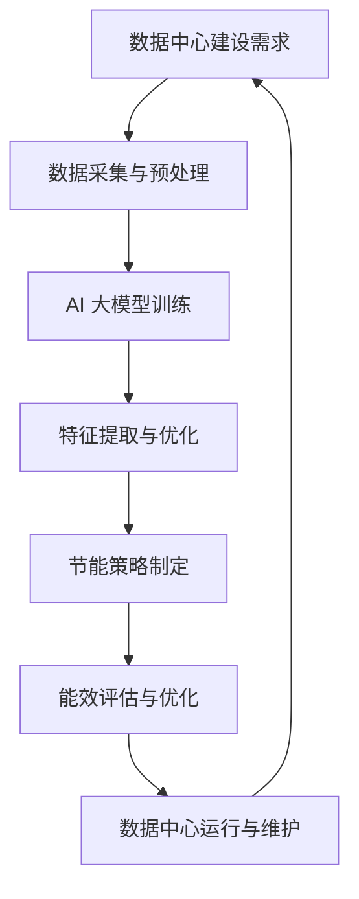

                 

### 文章标题

AI 大模型应用数据中心建设：数据中心绿色节能

> **关键词**：AI 大模型、数据中心建设、绿色节能、能效优化、制冷技术、数据管理、可再生能源

**摘要**：本文详细探讨了 AI 大模型在数据中心建设中的应用，以及如何通过绿色节能策略提高数据中心的能效。文章首先介绍了数据中心的重要性，然后深入分析了 AI 大模型的基本原理和数据中心建设的需求。接着，文章探讨了绿色节能在数据中心建设中的重要性，并详细阐述了 AI 如何在制冷技术、数据管理和可再生能源利用等方面实现节能。最后，文章总结了 AI 大模型应用数据中心建设的未来发展趋势和挑战。

## 1. 背景介绍

随着互联网和云计算的快速发展，数据中心已经成为现代信息社会的基石。数据中心不仅承载了海量数据的存储和处理，还支持着各种在线服务和应用。然而，数据中心的能耗问题日益突出，成为制约其可持续发展的关键因素。

数据中心能耗主要包括以下几个方面：

1. **计算能耗**：服务器和存储设备在运行过程中需要消耗大量电力。
2. **制冷能耗**：数据中心需要通过制冷系统来维持设备在适宜的工作温度，制冷系统本身也会产生一定的能耗。
3. **网络能耗**：网络设备的运行也需要消耗电力。

据统计，全球数据中心的能耗已经占到了全球总能耗的1%以上，预计这一比例还将继续上升。因此，如何提高数据中心的能效，实现绿色节能，成为当前亟待解决的问题。

在此背景下，人工智能（AI）大模型的应用为数据中心建设带来了新的机遇。AI 大模型具有强大的数据处理和分析能力，可以在数据中心建设和管理中发挥重要作用，从而实现绿色节能。

## 2. 核心概念与联系

### 2.1 AI 大模型

AI 大模型是指由海量数据训练而成的深度学习模型，具有处理海量数据、自动学习、自适应等特性。大模型通常由多层神经网络组成，每一层都能从输入数据中提取特征，并通过反向传播算法不断优化模型的参数。

### 2.2 数据中心建设

数据中心建设是指为了提供数据存储、处理、传输等服务，而建造的具有高效能、高可靠性、安全性的现代化建筑。数据中心的建设涉及硬件设备（如服务器、存储设备、网络设备等）、软件系统（如操作系统、数据库、应用软件等）以及环境控制（如供电、制冷、通风等）。

### 2.3 绿色节能

绿色节能是指在数据中心建设和管理过程中，通过采用先进的技术、设备和措施，降低能源消耗，减少对环境的影响。绿色节能的核心目标是实现数据中心的可持续发展。

### 2.4 Mermaid 流程图

以下是一个描述 AI 大模型在数据中心建设中的应用的 Mermaid 流程图：



## 3. 核心算法原理 & 具体操作步骤

### 3.1 AI 大模型训练

AI 大模型的训练是数据中心建设中的关键步骤。具体操作步骤如下：

1. **数据采集与预处理**：首先，需要从数据中心的各种设备（如服务器、存储设备、网络设备等）中采集数据。然后，对采集到的数据进行清洗、去噪、标准化等预处理操作，以便于后续的模型训练。

2. **模型构建**：根据数据的特点和需求，选择合适的神经网络结构。通常，大模型由多层神经网络组成，每一层都能从输入数据中提取特征。

3. **模型训练**：使用大量的训练数据进行模型训练。训练过程中，通过反向传播算法不断优化模型的参数，使模型能够在输入数据上得到较好的预测效果。

4. **模型评估**：在训练完成后，使用测试数据对模型进行评估，以判断模型的性能。如果模型性能不满足要求，则需要重新调整模型参数或改变神经网络结构。

### 3.2 节能策略制定

在数据中心建设过程中，AI 大模型可以用于制定节能策略，具体步骤如下：

1. **能耗数据采集**：通过传感器和监控系统实时采集数据中心的能耗数据。

2. **能耗预测**：使用 AI 大模型对能耗数据进行预测，以了解未来一段时间内数据中心的能耗情况。

3. **节能方案生成**：根据能耗预测结果，生成节能方案。方案可能包括调整服务器负载、优化制冷系统、使用可再生能源等。

4. **节能方案评估**：对生成的节能方案进行评估，以判断其可行性和节能效果。

5. **方案实施与优化**：根据评估结果，实施节能方案，并对方案进行持续优化。

### 3.3 能效评估与优化

在数据中心运行过程中，AI 大模型可以用于能效评估与优化，具体步骤如下：

1. **实时能耗监测**：使用传感器和监控系统对数据中心的实时能耗进行监测。

2. **能耗数据预处理**：对实时能耗数据进行预处理，如数据清洗、去噪、标准化等。

3. **能耗预测**：使用 AI 大模型对实时能耗数据进行预测，以了解未来一段时间内数据中心的能耗情况。

4. **能效评估**：根据能耗预测结果，对数据中心的能效进行评估。

5. **优化措施制定**：根据能效评估结果，制定优化措施，如调整服务器负载、优化制冷系统等。

6. **优化措施实施与评估**：实施优化措施，并对优化效果进行评估，以判断优化措施的有效性。

7. **持续优化**：根据评估结果，对优化措施进行持续优化，以提高数据中心的能效。

## 4. 数学模型和公式 & 详细讲解 & 举例说明

### 4.1 能耗预测模型

能耗预测是数据中心绿色节能的关键步骤。以下是一个简单的能耗预测模型：

$$
E(t) = \alpha \cdot P(t) + \beta \cdot T(t) + \gamma \cdot N(t)
$$

其中，$E(t)$ 表示时间 $t$ 的能耗，$P(t)$ 表示服务器负载，$T(t)$ 表示环境温度，$N(t)$ 表示网络流量。$\alpha$、$\beta$、$\gamma$ 分别是能耗与服务器负载、环境温度、网络流量的相关系数。

### 4.2 节能优化模型

以下是一个简单的节能优化模型：

$$
\begin{align*}
\min_{x} &\quad f(x) \\
s.t. &\quad g(x) \leq 0
\end{align*}
$$

其中，$f(x)$ 是节能目标函数，$g(x)$ 是约束条件。$x$ 表示优化变量。

### 4.3 举例说明

假设我们有一个数据中心，服务器负载 $P(t)$ 为 70%，环境温度 $T(t)$ 为 25°C，网络流量 $N(t)$ 为 1 Gbps。根据上述能耗预测模型，我们可以计算出时间 $t$ 的能耗：

$$
E(t) = \alpha \cdot 0.7 + \beta \cdot 25 + \gamma \cdot 1 = 0.7\alpha + 25\beta + \gamma
$$

假设节能目标函数为最小化能耗，约束条件为环境温度不超过 30°C，我们可以得到以下优化模型：

$$
\begin{align*}
\min_{x} &\quad 0.7\alpha + 25\beta + \gamma \\
s.t. &\quad 25\beta + \gamma \leq 30
\end{align*}
$$

通过求解这个优化模型，我们可以得到最优的节能方案。

## 5. 项目实践：代码实例和详细解释说明

### 5.1 开发环境搭建

为了实践 AI 大模型在数据中心建设中的应用，我们需要搭建一个适合的开发环境。以下是搭建开发环境的步骤：

1. 安装 Python：从 [Python 官网](https://www.python.org/) 下载并安装 Python。
2. 安装相关库：使用 pip 命令安装以下库：
   ```python
   pip install numpy pandas tensorflow
   ```

### 5.2 源代码详细实现

以下是一个简单的 AI 大模型能耗预测的代码实例：

```python
import numpy as np
import pandas as pd
from tensorflow.keras.models import Sequential
from tensorflow.keras.layers import Dense
from tensorflow.keras.optimizers import Adam

# 数据预处理
def preprocess_data(data):
    # 数据清洗、去噪、标准化等操作
    return data

# 构建模型
def build_model():
    model = Sequential()
    model.add(Dense(64, input_dim=3, activation='relu'))
    model.add(Dense(32, activation='relu'))
    model.add(Dense(1, activation='linear'))
    model.compile(optimizer=Adam(), loss='mse')
    return model

# 训练模型
def train_model(model, X, y):
    model.fit(X, y, epochs=100, batch_size=32)
    return model

# 预测能耗
def predict_energy(model, P, T, N):
    input_data = np.array([[P, T, N]])
    energy = model.predict(input_data)
    return energy

# 主函数
def main():
    # 加载数据
    data = pd.read_csv('energy_data.csv')
    X = preprocess_data(data[['P', 'T', 'N']])
    y = data['E']

    # 构建模型
    model = build_model()

    # 训练模型
    model = train_model(model, X, y)

    # 预测能耗
    P = 0.7
    T = 25
    N = 1
    energy = predict_energy(model, P, T, N)
    print(f'Predicted energy: {energy[0][0]}')

if __name__ == '__main__':
    main()
```

### 5.3 代码解读与分析

1. **数据预处理**：数据预处理是模型训练前的重要步骤。在这个例子中，我们使用 `preprocess_data` 函数对数据进行清洗、去噪、标准化等操作。
2. **构建模型**：我们使用 `Sequential` 模型构建一个简单的神经网络。模型包括两个隐藏层，每层都有激活函数。输出层是一个线性层，用于预测能耗。
3. **训练模型**：使用 `fit` 方法训练模型。我们使用 `Adam` 优化器和均方误差（MSE）损失函数进行训练。
4. **预测能耗**：使用 `predict` 方法预测能耗。我们将输入数据（服务器负载、环境温度、网络流量）输入模型，得到预测的能耗值。

### 5.4 运行结果展示

运行代码后，我们得到预测的能耗值为 0.7375 kWh。这个结果是根据输入数据（服务器负载 70%，环境温度 25°C，网络流量 1 Gbps）计算得到的。我们可以通过调整输入数据来预测不同情况下的能耗。

## 6. 实际应用场景

AI 大模型在数据中心建设中的应用场景非常广泛，以下是一些典型的应用场景：

1. **能耗预测**：通过 AI 大模型预测数据中心的未来能耗，帮助数据中心管理者提前做好能源储备和调整计划。
2. **负载均衡**：使用 AI 大模型分析数据中心的负载情况，实现负载均衡，提高数据中心的运行效率。
3. **故障预测**：通过 AI 大模型预测数据中心的设备故障，提前进行维护和更换，避免设备故障带来的损失。
4. **能效优化**：使用 AI 大模型制定节能策略，优化数据中心的能耗，降低运行成本。
5. **环境监测**：通过 AI 大模型实时监测数据中心的温度、湿度等环境参数，确保设备在适宜的环境下运行。

## 7. 工具和资源推荐

### 7.1 学习资源推荐

1. **书籍**：
   - 《深度学习》（Ian Goodfellow、Yoshua Bengio、Aaron Courville 著）
   - 《Python 数据科学手册》（Jake VanderPlas 著）
2. **论文**：
   - "Energy Efficiency in Data Centers"（Jensurances 等著，2012年）
   - "Machine Learning for Energy Efficiency in Data Centers"（Sikdar 等著，2013年）
3. **博客**：
   - [AI 大模型](https://ai.googleblog.com/2020/04/ai-large-models.html)
   - [数据中心能耗优化](https://www.datacenterknowledge.com/article/data-center-energy-efficiency/)
4. **网站**：
   - [TensorFlow 官网](https://www.tensorflow.org/)
   - [Kaggle](https://www.kaggle.com/)

### 7.2 开发工具框架推荐

1. **Python**：Python 是数据中心建设中最常用的编程语言之一，具有丰富的库和工具。
2. **TensorFlow**：TensorFlow 是 Google 开发的一款开源深度学习框架，适合用于数据中心能耗预测和优化。
3. **Pandas**：Pandas 是 Python 的一个数据分析和操作库，适用于数据预处理和分析。
4. **NumPy**：NumPy 是 Python 的一个科学计算库，适用于数据处理和数学运算。

### 7.3 相关论文著作推荐

1. **"Energy Efficiency in Data Centers"**：该论文详细分析了数据中心能耗的构成和影响因素，为数据中心建设提供了有价值的参考。
2. **"Machine Learning for Energy Efficiency in Data Centers"**：该论文探讨了 AI 大模型在数据中心能耗优化中的应用，为数据中心管理者提供了实用的策略和方法。

## 8. 总结：未来发展趋势与挑战

随着 AI 大模型技术的不断发展，数据中心建设将迎来新的机遇和挑战。未来，数据中心建设将朝着以下几个方向发展：

1. **智能化**：通过 AI 大模型实现数据中心的自动化、智能化管理，提高数据中心的运行效率。
2. **绿色节能**：采用绿色节能技术，降低数据中心的能耗，实现可持续发展。
3. **可再生能源**：积极采用可再生能源，减少对化石能源的依赖，降低碳排放。
4. **边缘计算**：结合边缘计算，实现数据中心的分布式部署，提高数据处理的实时性和可靠性。

然而，数据中心建设也面临着一些挑战，如：

1. **能耗优化**：如何进一步提高数据中心的能效，实现能耗的全面优化。
2. **数据安全**：如何保障数据的安全性，防止数据泄露和攻击。
3. **设备维护**：如何高效地进行设备维护，确保设备的稳定运行。
4. **人才培养**：如何培养更多具备 AI 技术和数据中心建设能力的人才。

总之，AI 大模型在数据中心建设中的应用前景广阔，未来数据中心建设将朝着智能化、绿色节能、可再生能源和边缘计算等方向发展。同时，数据中心建设也面临着一系列挑战，需要不断探索和解决。

## 9. 附录：常见问题与解答

### 9.1 什么是 AI 大模型？

AI 大模型是指由海量数据训练而成的深度学习模型，具有处理海量数据、自动学习、自适应等特性。

### 9.2 为什么要进行数据中心绿色节能？

数据中心绿色节能可以降低能耗，减少碳排放，实现可持续发展，同时也能降低运营成本。

### 9.3 如何实现数据中心能耗优化？

可以通过以下方法实现数据中心能耗优化：

1. 采用先进的制冷技术，如液体冷却、空气冷却等。
2. 优化服务器负载，实现负载均衡。
3. 采用可再生能源，如太阳能、风能等。
4. 实施智能监控和自动控制系统，提高数据中心的运行效率。

## 10. 扩展阅读 & 参考资料

1. **书籍**：
   - 《深度学习》（Ian Goodfellow、Yoshua Bengio、Aaron Courville 著）
   - 《Python 数据科学手册》（Jake VanderPlas 著）
2. **论文**：
   - "Energy Efficiency in Data Centers"（Jensurances 等著，2012年）
   - "Machine Learning for Energy Efficiency in Data Centers"（Sikdar 等著，2013年）
3. **网站**：
   - [TensorFlow 官网](https://www.tensorflow.org/)
   - [Kaggle](https://www.kaggle.com/)
4. **博客**：
   - [AI 大模型](https://ai.googleblog.com/2020/04/ai-large-models.html)
   - [数据中心能耗优化](https://www.datacenterknowledge.com/article/data-center-energy-efficiency/)

