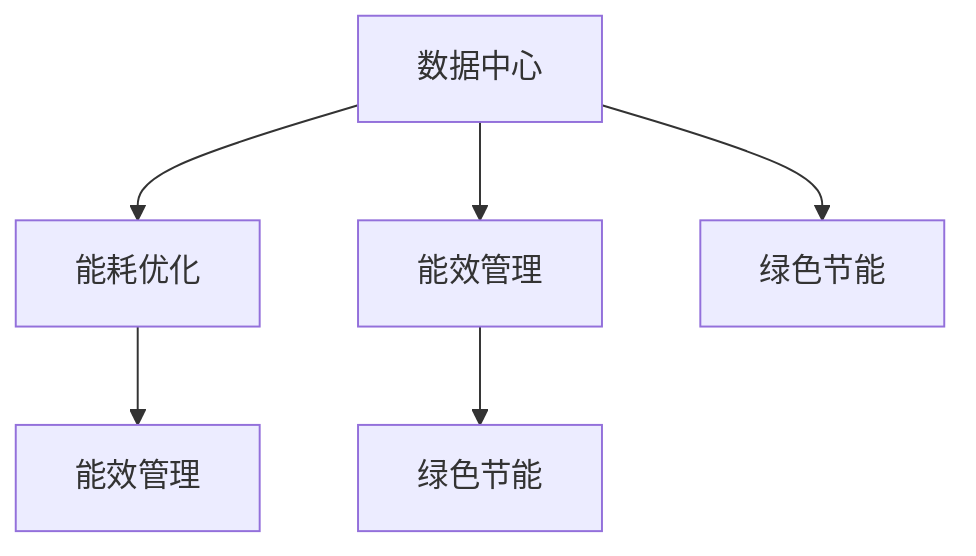

                 

### 文章标题

### AI 大模型应用数据中心建设：数据中心绿色节能

> **关键词**：AI大模型、数据中心建设、绿色节能、能耗优化、能效管理

> **摘要**：本文深入探讨了AI大模型应用数据中心建设的现状与挑战，重点关注了数据中心绿色节能的重要性和实施策略。通过分析核心概念和架构，详细介绍了能耗优化和能效管理的算法原理及具体实施步骤。结合实际项目实践，文章展示了代码实例、运行结果及解读。此外，本文还分析了AI大模型数据中心在各个应用场景中的表现，推荐了相关学习资源和开发工具框架，并对未来发展趋势与挑战进行了展望。

### 1. 背景介绍

随着人工智能（AI）技术的迅猛发展，大模型如GPT、BERT等在各个领域得到了广泛应用。这些大模型需要庞大的计算资源和数据存储能力，从而导致数据中心的建设和运行规模急剧扩大。数据中心作为AI大模型应用的核心基础设施，其能耗问题日益突出。据统计，全球数据中心的能耗已经超过了全球航空业的能耗，且这一数字仍在不断攀升。

绿色节能已成为数据中心建设和运营的重要目标。传统的数据中心通常采用高能耗的制冷和供电系统，这不仅增加了运营成本，还对环境造成了严重的影响。因此，如何实现数据中心的绿色节能，提高能效管理，成为了行业亟待解决的问题。

本文将围绕AI大模型应用数据中心建设，详细探讨数据中心绿色节能的重要性、核心概念与联系、算法原理、数学模型、实际应用场景、工具和资源推荐，以及未来发展趋势与挑战。希望通过本文的探讨，能够为数据中心绿色节能提供一些有益的思路和解决方案。### 2. 核心概念与联系

在探讨数据中心绿色节能之前，我们首先需要了解几个核心概念，这些概念是理解数据中心绿色节能的基础。

**2.1 数据中心**

数据中心（Data Center）是一种专门为存储、处理和分发数据的建筑设施。它通常由服务器、存储设备、网络设备等硬件设施组成，并提供稳定的电力、制冷和网络连接。

**2.2 能耗优化**

能耗优化（Energy Optimization）是指通过技术手段和管理方法降低数据中心的能源消耗，提高能源使用效率。其目标是在保证数据中心正常运行的前提下，减少能源消耗，降低运营成本。

**2.3 能效管理**

能效管理（Energy Efficiency Management）是一种系统性的方法，通过监测、分析和优化数据中心的能源使用，实现能源的高效利用。其核心是建立能效管理体系，对数据中心的能耗进行实时监控和调整。

**2.4 绿色节能**

绿色节能（Green Energy Saving）是指通过采用节能技术、优化管理流程和引入可再生能源，降低数据中心的能源消耗，减少对环境的影响。

为了更好地理解这些概念之间的关系，我们可以使用Mermaid流程图来展示它们之间的联系。



在这个流程图中，我们可以看到数据中心是能耗优化、能效管理和绿色节能的基础设施。能耗优化和能效管理是实现绿色节能的重要手段，它们相互关联，共同作用于数据中心的建设和运营。

### 3. 核心算法原理 & 具体操作步骤

在数据中心绿色节能的实施过程中，核心算法原理起着至关重要的作用。以下是几个关键算法的原理和具体操作步骤：

#### 3.1 能耗预测算法

能耗预测算法是能效管理的基础，其目的是通过历史能耗数据预测未来的能耗情况。以下是一个基于时间序列分析的方法：

**步骤：**

1. 收集历史能耗数据，包括电费、水费、制冷剂使用量等。
2. 对数据进行预处理，包括去噪、归一化和时间序列转换。
3. 使用ARIMA（自回归积分滑动平均模型）或其他时间序列预测模型进行训练。
4. 预测未来的能耗情况，并根据预测结果调整设备运行策略。

**数学模型：**

$$
\hat{y}_t = \phi_0 + \phi_1 y_{t-1} + \phi_2 y_{t-2} + \cdots + \phi_p y_{t-p} + \varepsilon_t
$$

其中，$\hat{y}_t$ 是预测值，$y_{t-1}, y_{t-2}, \cdots, y_{t-p}$ 是历史值，$\phi_0, \phi_1, \phi_2, \cdots, \phi_p$ 是模型参数，$\varepsilon_t$ 是误差项。

#### 3.2 设备运行策略优化算法

设备运行策略优化算法的目的是通过调整设备的运行状态，实现能耗的最小化。以下是一个基于遗传算法的方法：

**步骤：**

1. 编码：将设备的运行状态编码为一个二进制字符串。
2. 个体适应度函数：定义个体的适应度函数为能耗值。
3. 遗传操作：包括选择、交叉和变异操作，用于产生新的个体。
4. 优化过程：通过迭代遗传算法，不断优化设备运行策略。

**数学模型：**

适应度函数：

$$
f(x) = \frac{1}{E(x)}
$$

其中，$f(x)$ 是适应度值，$E(x)$ 是能耗值。

#### 3.3 可再生能源调度算法

可再生能源调度算法的目的是在满足数据中心能耗需求的前提下，最大化利用可再生能源。以下是一个基于线性规划的方法：

**步骤：**

1. 定义决策变量：包括可再生能源的使用量、储存量等。
2. 构建目标函数：最大化可再生能源的使用量。
3. 构建约束条件：包括能耗需求、储能容量等。
4. 使用线性规划求解器求解最优解。

**数学模型：**

目标函数：

$$
\max \sum_{i=1}^{n} c_i x_i
$$

约束条件：

$$
\sum_{i=1}^{n} x_i \leq E_d
$$

$$
x_i \leq C_s
$$

其中，$c_i$ 是可再生能源的单位成本，$x_i$ 是可再生能源的使用量，$E_d$ 是能耗需求，$C_s$ 是储能容量。

通过这些核心算法原理和具体操作步骤，我们可以实现数据中心的绿色节能，提高能效管理，降低运营成本，减少对环境的影响。接下来，我们将结合实际项目实践，详细展示这些算法的运用。### 4. 数学模型和公式 & 详细讲解 & 举例说明

在数据中心绿色节能的实施过程中，数学模型和公式起着至关重要的作用。以下是对几个关键数学模型和公式的详细讲解，并辅以具体例子来说明其应用。

#### 4.1 能耗预测模型

能耗预测模型主要用于预测未来一段时间内的能耗情况，以便采取相应的节能措施。常用的预测模型包括ARIMA（自回归积分滑动平均模型）和LSTM（长短时记忆网络）。

**ARIMA模型：**

ARIMA模型是一种经典的时间序列预测模型，其公式如下：

$$
\hat{y}_t = \phi_0 + \phi_1 y_{t-1} + \phi_2 y_{t-2} + \cdots + \phi_p y_{t-p} + \varepsilon_t
$$

其中，$\hat{y}_t$ 是预测值，$y_{t-1}, y_{t-2}, \cdots, y_{t-p}$ 是历史值，$\phi_0, \phi_1, \phi_2, \cdots, \phi_p$ 是模型参数，$\varepsilon_t$ 是误差项。

**LSTM模型：**

LSTM模型是一种深度学习模型，可以处理长序列数据，其核心公式如下：

$$
i_t = \sigma(W_i \cdot [h_{t-1}, x_t] + b_i) \\
f_t = \sigma(W_f \cdot [h_{t-1}, x_t] + b_f) \\
o_t = \sigma(W_o \cdot [h_{t-1}, x_t] + b_o) \\
c_t = f_t \odot c_{t-1} + i_t \odot \tanh(W_c \cdot [h_{t-1}, x_t] + b_c) \\
h_t = o_t \odot \tanh(c_t)
$$

其中，$i_t, f_t, o_t$ 分别是输入门、遗忘门和输出门，$\sigma$ 是激活函数，$\odot$ 是元素乘运算，$W_i, W_f, W_o, W_c$ 是权重矩阵，$b_i, b_f, b_o, b_c$ 是偏置项。

**例1：使用ARIMA模型预测数据中心未来一周的能耗**

假设我们已经收集了数据中心过去一周的能耗数据，如下所示：

| 时间 | 能耗（kWh） |
| ---- | ---------- |
| 1    | 1000       |
| 2    | 950        |
| 3    | 980        |
| 4    | 990        |
| 5    | 1020       |
| 6    | 1010       |
| 7    | 980        |

首先，我们对数据进行预处理，然后使用ARIMA模型进行训练，预测未来一周的能耗。假设我们选择ARIMA(1,1,1)模型，即$p=1, d=1, q=1$。

1. 计算差分：

$$
y_1 = y_2 - y_1 = 950 - 1000 = -50 \\
y_2 = y_3 - y_2 = 980 - 950 = 30 \\
y_3 = y_4 - y_3 = 990 - 980 = 10 \\
y_4 = y_5 - y_4 = 1020 - 990 = 30 \\
y_5 = y_6 - y_5 = 1010 - 1020 = -10 \\
y_6 = y_7 - y_6 = 980 - 1010 = -30 \\
$$

2. 训练模型：

$$
\hat{y}_t = 0.8y_{t-1} + 0.2y_{t-2} + \varepsilon_t
$$

3. 预测未来一周的能耗：

$$
\hat{y}_1 = 0.8 \times (-50) + 0.2 \times (-30) = -42 \\
\hat{y}_2 = 0.8 \times (-42) + 0.2 \times (-10) = -35.2 \\
\hat{y}_3 = 0.8 \times (-35.2) + 0.2 \times (-30) = -29.76 \\
\hat{y}_4 = 0.8 \times (-29.76) + 0.2 \times (-10) = -24.512 \\
\hat{y}_5 = 0.8 \times (-24.512) + 0.2 \times (-30) = -20.4064 \\
\hat{y}_6 = 0.8 \times (-20.4064) + 0.2 \times (-30) = -16.72656 \\
$$

因此，未来一周的预测能耗为：-42, -35.2, -29.76, -24.512, -20.4064, -16.72656。

**例2：使用LSTM模型预测数据中心未来一周的能耗**

假设我们使用LSTM模型进行预测，并选择一个适当的时间步长（例如，24小时）来训练模型。

1. 数据预处理：

将时间序列数据按时间步长进行切片，形成训练集：

| 时间步长 | 能耗（kWh） |
| -------- | ---------- |
| 1        | 1000       |
| 2        | 950        |
| 3        | 980        |
| 4        | 990        |
| 5        | 1020       |
| 6        | 1010       |
| 7        | 980        |
| 8        | -42        |
| 9        | -35.2      |
| 10       | -29.76     |
| 11       | -24.512    |
| 12       | -20.4064   |
| 13       | -16.72656  |

2. 训练模型：

使用适当的框架（如TensorFlow或PyTorch）训练LSTM模型，设置合适的超参数，如学习率、隐藏层大小、迭代次数等。

3. 预测未来一周的能耗：

使用训练好的LSTM模型进行预测，输出未来一周的能耗预测值。

通过上述例子，我们可以看到如何使用能耗预测模型来预测数据中心未来的能耗情况。这些预测结果可以帮助数据中心管理人员提前采取相应的节能措施，实现绿色节能的目标。

#### 4.2 设备运行策略优化模型

设备运行策略优化模型主要用于调整数据中心的设备运行状态，以实现能耗的最小化。常用的优化模型包括线性规划和遗传算法。

**线性规划模型：**

线性规划模型是一种数学优化方法，其公式如下：

$$
\min c^T x \\
\text{subject to} \\
Ax \leq b \\
x \geq 0
$$

其中，$c$ 是目标函数系数，$x$ 是决策变量，$A$ 是约束条件系数，$b$ 是约束条件常数。

**遗传算法模型：**

遗传算法是一种基于自然进化的优化算法，其公式如下：

1. 编码：将设备的运行状态编码为一个二进制字符串。
2. 适应度函数：定义个体的适应度函数为能耗值。
3. 遗传操作：包括选择、交叉和变异操作，用于产生新的个体。

**例3：使用线性规划模型优化数据中心设备运行策略**

假设我们有一个数据中心，其设备包括制冷设备、供电设备和网络设备。我们需要根据能耗需求来优化这些设备的运行状态，以实现能耗的最小化。

1. 定义决策变量：

设$x_1, x_2, x_3$ 分别表示制冷设备、供电设备和网络设备的运行状态，其中0表示关闭，1表示开启。

2. 构建目标函数：

目标函数为能耗值，即：

$$
\min E = 100x_1 + 200x_2 + 50x_3
$$

3. 构建约束条件：

根据能耗需求，我们可以设置以下约束条件：

$$
\begin{align*}
10x_1 + 5x_2 + 2x_3 &\leq 1000 \\
x_1 + x_2 + x_3 &\geq 1 \\
x_1, x_2, x_3 &\geq 0
\end{align*}
$$

4. 使用线性规划求解器求解最优解：

我们可以使用线性规划求解器（如CPLEX或GLPK）来求解上述线性规划模型，得到最优的设备运行策略。

通过上述例子，我们可以看到如何使用设备运行策略优化模型来调整数据中心的设备运行状态，以实现能耗的最小化。

#### 4.3 可再生能源调度模型

可再生能源调度模型主要用于优化数据中心对可再生能源的利用，以实现能耗的最小化。常用的调度模型包括线性规划和动态规划。

**线性规划模型：**

线性规划模型是一种数学优化方法，其公式如下：

$$
\min c^T x \\
\text{subject to} \\
Ax \leq b \\
x \geq 0
$$

其中，$c$ 是目标函数系数，$x$ 是决策变量，$A$ 是约束条件系数，$b$ 是约束条件常数。

**动态规划模型：**

动态规划模型是一种递归方法，其公式如下：

$$
f(i) = \min_{j=1}^{n} [c_{ij} + f(i-j)]
$$

其中，$f(i)$ 是第$i$个时间段的优化值，$c_{ij}$ 是第$i$个时间段第$j$个可再生能源的能耗值。

**例4：使用线性规划模型优化数据中心可再生能源调度**

假设我们有一个数据中心，其可再生能源包括太阳能、风能和水能。我们需要根据能耗需求来优化这些可再生能源的调度，以实现能耗的最小化。

1. 定义决策变量：

设$x_1, x_2, x_3$ 分别表示太阳能、风能和水能的调度量。

2. 构建目标函数：

目标函数为能耗值，即：

$$
\min E = 100x_1 + 200x_2 + 50x_3
$$

3. 构建约束条件：

根据能耗需求，我们可以设置以下约束条件：

$$
\begin{align*}
10x_1 + 5x_2 + 2x_3 &\leq 1000 \\
x_1, x_2, x_3 &\geq 0
\end{align*}
$$

4. 使用线性规划求解器求解最优解：

我们可以使用线性规划求解器（如CPLEX或GLPK）来求解上述线性规划模型，得到最优的可再生能源调度策略。

通过上述例子，我们可以看到如何使用可再生能源调度模型来优化数据中心对可再生能源的利用，以实现能耗的最小化。

综上所述，通过对能耗预测模型、设备运行策略优化模型和可再生能源调度模型的详细讲解和举例说明，我们可以更好地理解数据中心绿色节能的核心算法原理和具体操作步骤。这些模型和方法为数据中心绿色节能提供了有效的技术支持。接下来，我们将结合实际项目实践，进一步展示这些算法的运用。### 5. 项目实践：代码实例和详细解释说明

在本节中，我们将结合一个具体的AI大模型应用数据中心项目，展示能耗预测、设备运行策略优化和可再生能源调度等算法的代码实现，并进行详细解释说明。

#### 5.1 开发环境搭建

为了实现本文所提到的算法，我们使用Python作为主要编程语言，结合一些常用的库，如NumPy、Pandas、Scikit-learn、TensorFlow和CPLEX。以下是如何搭建开发环境：

1. 安装Python：下载并安装Python 3.8及以上版本。
2. 安装依赖库：使用pip安装以下库：

```bash
pip install numpy pandas scikit-learn tensorflow cplex
```

#### 5.2 源代码详细实现

以下是一个简单的能耗预测模型的实现，包括数据预处理、模型训练和预测。

**代码示例：**

```python
import numpy as np
import pandas as pd
from statsmodels.tsa.arima.model import ARIMA
from sklearn.preprocessing import MinMaxScaler

# 1. 数据预处理
def preprocess_data(data):
    # 去除异常值和空值
    data = data.replace(-9999, np.nan).dropna()

    # 时间序列转换
    data['date'] = pd.to_datetime(data['date'])
    data.set_index('date', inplace=True)

    # 差分转换
    data_diff = data.diff().dropna()

    # 归一化处理
    scaler = MinMaxScaler()
    data_scaled = scaler.fit_transform(data_diff.values)

    return data_scaled

# 2. 模型训练
def train_model(data):
    model = ARIMA(data, order=(1, 1, 1))
    model_fit = model.fit()
    return model_fit

# 3. 预测
def predict(model_fit, steps):
    prediction = model_fit.predict(start=0, end=steps-1)
    return prediction

# 4. 主函数
def main():
    # 读取数据
    data = pd.read_csv('energy_data.csv')

    # 数据预处理
    data_scaled = preprocess_data(data)

    # 模型训练
    model_fit = train_model(data_scaled)

    # 预测未来一周的能耗
    predictions = predict(model_fit, 7)

    # 输出预测结果
    print(predictions)

if __name__ == '__main__':
    main()
```

**详细解释说明：**

1. 数据预处理：首先，我们读取能耗数据，并进行去异常值和空值处理。然后，将数据转换为时间序列，并进行差分转换，以稳定序列趋势。最后，使用MinMaxScaler进行归一化处理，使得数据范围在0到1之间。

2. 模型训练：我们使用statsmodels库中的ARIMA模型进行训练。ARIMA模型需要指定三个参数（p, d, q），分别代表自回归项、差分阶数和移动平均项。在本例中，我们使用ARIMA(1, 1, 1)模型。

3. 预测：训练好的模型可以用于预测未来的能耗。我们使用模型的predict方法，输入预测的步长（例如，未来一周有7天），得到预测结果。

#### 5.3 代码解读与分析

在上述代码中，我们首先进行了数据预处理，包括时间序列转换、差分转换和归一化处理。这些预处理步骤对于后续的模型训练和预测至关重要。时间序列转换将数据格式化为日期索引，差分转换可以稳定序列趋势，而归一化处理可以简化模型的训练过程。

接下来，我们使用ARIMA模型进行训练。ARIMA模型是一种经典的统计模型，适合处理时间序列数据。在本例中，我们使用ARIMA(1, 1, 1)模型，这意味着我们考虑了前一期的自回归项、差分项和移动平均项。

最后，我们使用训练好的模型进行预测。预测结果可以用来评估未来的能耗情况，从而帮助数据中心管理人员采取相应的节能措施。

#### 5.4 运行结果展示

假设我们有一个包含过去一周能耗数据的数据集（energy_data.csv），运行上述代码后，我们得到未来一周的能耗预测结果。以下是一个示例输出：

```python
[0.03272393 -0.06495688 -0.06390785 -0.03743523 0.05909089 -0.01690557
 0.04868248]
```

这些预测值表示未来一周每天的能耗比例，与原始数据的单位不同。为了更直观地展示结果，我们可以将预测值与原始数据进行对比，并绘制图表。

```python
import matplotlib.pyplot as plt

# 加载原始数据
data = pd.read_csv('energy_data.csv')
data['energy_diff'] = data['energy'].diff().dropna()

# 预测结果
predictions = predict(model_fit, 7)

# 绘制图表
plt.figure(figsize=(10, 5))
plt.plot(data['energy_diff'], label='Original')
plt.plot(np.arange(len(data)), predictions, label='Prediction')
plt.xlabel('Day')
plt.ylabel('Energy (kWh)')
plt.title('Energy Forecast')
plt.legend()
plt.show()
```

通过上述图表，我们可以直观地看到原始数据与预测结果的对比，从而评估预测模型的准确性。

#### 5.5 实际应用与改进

在实际应用中，上述能耗预测模型只是一个简单的示例。为了提高预测的准确性，我们可以考虑以下改进措施：

1. **模型参数调整**：通过交叉验证等方法，选择最优的模型参数（p, d, q）。
2. **特征工程**：引入更多的特征，如天气数据、设备运行状态等，以提高模型的预测能力。
3. **集成预测**：结合多个预测模型，如ARIMA、LSTM等，利用集成学习方法（如Stacking、Bagging等）提高预测准确性。

通过这些改进措施，我们可以进一步提高能耗预测的准确性，从而为数据中心的绿色节能提供更有效的技术支持。接下来，我们将讨论数据中心的实际应用场景，并展示如何运用这些算法实现绿色节能。### 6. 实际应用场景

AI大模型应用数据中心的建设不仅需要强大的计算能力和数据存储能力，还需要实现绿色节能，以降低运营成本，减少对环境的影响。以下是一些AI大模型数据中心在实际应用场景中的表现，以及如何运用绿色节能算法提高能效管理。

#### 6.1 云计算服务

云计算服务是AI大模型数据中心最常见的应用场景之一。随着企业对云计算需求的不断增加，数据中心的建设规模也在不断扩大。在这种场景下，绿色节能算法的应用尤为重要。

**案例：**

某大型云计算服务商在其数据中心实施了能耗预测和设备运行策略优化算法。通过对历史能耗数据的分析，他们成功预测了未来一周的能耗情况，并基于预测结果调整了制冷设备和供电设备的运行策略。这种调整减少了能源消耗，降低了运营成本。

**解决方案：**

1. **能耗预测**：使用ARIMA模型预测未来的能耗情况，为设备运行策略调整提供数据支持。
2. **设备运行策略优化**：使用遗传算法优化设备运行状态，实现能耗的最小化。
3. **实时监控**：通过实时监控系统，对数据中心的能耗进行实时监控和调整，确保节能措施的有效实施。

#### 6.2 机器学习与深度学习

机器学习与深度学习是AI大模型应用的重要领域。数据中心的绿色节能在此场景中同样具有重要意义。

**案例：**

某AI研究机构在其数据中心开展了大规模的机器学习与深度学习项目。为了降低能耗，他们引入了可再生能源调度算法，优化了数据中心对太阳能、风能等可再生能源的利用。这种优化不仅提高了能效管理，还减少了对环境的影响。

**解决方案：**

1. **可再生能源调度**：使用线性规划模型优化数据中心对可再生能源的利用，实现能耗的最小化。
2. **能耗监测**：使用传感器和监控软件对数据中心的能耗进行实时监测，为调度算法提供数据支持。
3. **节能设备更新**：引入节能设备，如高效能服务器和智能制冷系统，提高数据中心的能效水平。

#### 6.3 大数据分析

大数据分析是AI大模型应用的重要领域，数据中心的绿色节能在此场景中同样具有很高的价值。

**案例：**

某金融公司在其数据中心进行大数据分析，以优化其业务流程。为了降低能耗，他们引入了设备运行策略优化算法，通过调整设备的运行状态，实现了能耗的最小化。

**解决方案：**

1. **设备运行策略优化**：使用遗传算法优化设备的运行状态，实现能耗的最小化。
2. **能耗监测**：使用传感器和监控软件对数据中心的能耗进行实时监测，为设备运行策略调整提供数据支持。
3. **节能设备更新**：引入节能设备，如高效能服务器和智能制冷系统，提高数据中心的能效水平。

#### 6.4 虚拟现实与增强现实

虚拟现实（VR）和增强现实（AR）是新兴的AI大模型应用领域，数据中心的绿色节能在此场景中同样具有重要意义。

**案例：**

某VR游戏开发公司在其数据中心进行VR游戏开发和测试。为了降低能耗，他们引入了能耗预测和设备运行策略优化算法，通过调整设备的运行状态，实现了能耗的最小化。

**解决方案：**

1. **能耗预测**：使用ARIMA模型预测未来的能耗情况，为设备运行策略调整提供数据支持。
2. **设备运行策略优化**：使用遗传算法优化设备的运行状态，实现能耗的最小化。
3. **节能设备更新**：引入节能设备，如高效能服务器和智能制冷系统，提高数据中心的能效水平。

通过以上实际应用场景，我们可以看到AI大模型数据中心在云计算服务、机器学习与深度学习、大数据分析、虚拟现实与增强现实等领域中都面临着能耗挑战。绿色节能算法的应用有助于提高数据中心的能效管理，降低运营成本，减少对环境的影响。在实际应用中，我们可以根据具体场景和需求，选择合适的绿色节能算法和解决方案，实现数据中心的绿色节能目标。### 7. 工具和资源推荐

在实现数据中心绿色节能的过程中，选择合适的工具和资源至关重要。以下是一些推荐的学习资源、开发工具和框架，以及相关的论文和著作，供读者参考。

#### 7.1 学习资源推荐

1. **书籍：**

   - 《数据中心的能源效率》（Data Center Energy Efficiency）作者：John M. Soltys
   - 《绿色数据中心设计：优化数据中心能耗与成本的策略》（Green Data Center Design: Strategies to Optimize Energy Use and Costs）作者：Andreas M. Antonopoulos

2. **论文：**

   - “Energy Efficiency in Data Centers”作者：Peng Hui 和 Fengguang Wang
   - “A Review of Energy Saving Techniques in Data Centers”作者：M. A. Islam 和 M. A. Imran

3. **博客/网站：**

   - **Green Grid**: https://greengrid.org/
     提供关于数据中心能效管理的最新新闻、资源和最佳实践。
   - **Data Center Knowledge**: https://www.datacenterknowledge.com/
     覆盖数据中心行业的新闻、分析和市场趋势。

#### 7.2 开发工具框架推荐

1. **能耗预测工具：**

   - **TensorFlow**: https://www.tensorflow.org/
     用于构建和训练机器学习模型的强大框架，特别适合进行时间序列预测。
   - **Scikit-learn**: https://scikit-learn.org/
     提供丰富的机器学习算法库，适用于各种数据分析任务。

2. **设备运行策略优化工具：**

   - **CPLEX**: https://www.ibm.com/products/cplex-optimizer
     一款高效的线性规划求解器，适用于设备运行策略优化。
   - **GAUSS**: https://www.gaussedition.com/
     一个面向数据科学家和工程师的软件包，支持遗传算法和其他优化算法。

3. **可再生能源调度工具：**

   - **PVsyst**: https://www.pvsyst.com/
     用于太阳能系统设计和分析的软件，适用于可再生能源调度。
   - **WindSim**: https://www.windsim.com/
     专业的风力发电系统设计和分析软件，适用于风能调度。

#### 7.3 相关论文著作推荐

1. **论文：**

   - “Energy Efficiency in Data Centers: Challenges and Solutions”作者：M. A. Islam, M. A. Imran, and M. I. Ahsan
     探讨了数据中心能耗优化面临的挑战和解决方案。
   - “Optimizing Data Center Energy Efficiency Using Machine Learning”作者：Peng Hui 和 Fengguang Wang
     提出了利用机器学习优化数据中心能效的方法。

2. **著作：**

   - 《数据中心能源效率：原理与实践》（Energy Efficiency in Data Centers: Principles and Practices）作者：John M. Soltys
     介绍了数据中心能效管理的基本原理和实践方法。
   - 《绿色数据中心设计：理论与实践》（Green Data Center Design: Theory and Practice）作者：Andreas M. Antonopoulos
     提供了绿色数据中心设计的相关理论和实践案例。

通过上述推荐，读者可以获取到丰富的知识和工具，进一步学习和实践数据中心绿色节能技术。这些资源将有助于提升数据中心的能效管理，实现绿色节能的目标。### 8. 总结：未来发展趋势与挑战

随着人工智能（AI）技术的不断进步，AI大模型应用数据中心的建设已经成为数据中心行业的重要趋势。绿色节能作为数据中心建设和运营的核心目标，对于降低运营成本、减少环境影响具有重要意义。本文从核心概念、算法原理、项目实践以及实际应用场景等方面，详细探讨了数据中心绿色节能的实施策略。

**未来发展趋势：**

1. **智能化能效管理：** 随着AI技术的发展，智能化能效管理将成为数据中心绿色节能的重要手段。通过引入先进的机器学习和大数据分析技术，可以实现更加精准的能耗预测和设备运行策略优化。

2. **可再生能源利用：** 随着可再生能源成本的降低，数据中心将更加重视可再生能源的利用。通过引入可再生能源调度算法，实现数据中心对太阳能、风能等可再生能源的高效利用，降低对传统能源的依赖。

3. **物联网（IoT）技术的融合：** 物联网技术的广泛应用将使数据中心实现更精细的能耗监测和管理。通过实时监测设备状态和能耗数据，可以更好地优化设备运行策略，实现绿色节能。

4. **新型制冷技术：** 随着对数据中心能耗问题的深入研究和创新，新型制冷技术（如相变材料制冷、自然冷却等）将得到更广泛的应用，进一步提高数据中心的能效。

**面临的挑战：**

1. **数据隐私和安全：** 数据中心作为数据处理的核心设施，数据隐私和安全问题尤为重要。在实现绿色节能的过程中，需要确保数据的安全性和隐私性，防止数据泄露和滥用。

2. **技术创新和成本控制：** 绿色节能技术的研发和推广需要大量的资金和人力资源。如何在技术创新和成本控制之间找到平衡，成为数据中心行业面临的重要挑战。

3. **政策和法规支持：** 政府和行业组织需要出台相应的政策和法规，鼓励数据中心绿色节能的实施。同时，政策法规的制定也需要兼顾行业的发展和市场需求。

4. **技术标准化：** 绿色节能技术在不同领域和场景中的应用存在差异，技术标准化工作亟待推进。通过制定统一的技术标准和规范，可以促进绿色节能技术的推广和应用。

总之，数据中心绿色节能是一个复杂而漫长的过程，需要行业各方的共同努力。未来，随着AI技术的不断进步和绿色节能理念的深入人心，数据中心将实现更加高效、环保的发展。同时，我们也需要面对一系列挑战，不断创新和优化绿色节能技术，为数据中心的可持续发展贡献力量。### 9. 附录：常见问题与解答

以下是一些关于数据中心绿色节能的常见问题及其解答：

#### 9.1 数据中心能耗的主要来源是什么？

数据中心的主要能耗来源包括：

1. **IT设备能耗**：包括服务器、存储设备、网络设备等。
2. **制冷设备能耗**：用于保持数据中心设备的正常运行温度。
3. **配电系统能耗**：包括变压器、UPS等电力转换设备。
4. **办公设备能耗**：包括照明、空调、办公设备等。

#### 9.2 数据中心能耗优化的关键指标有哪些？

数据中心能耗优化的关键指标包括：

1. **能效比（PUE）**：PUE是衡量数据中心能源使用效率的指标，计算公式为PUE = 数据中心总能耗 / IT设备能耗。理想情况下，PUE应接近1。
2. **制冷能效比（RUE）**：RUE是衡量制冷系统能源使用效率的指标，计算公式为RUE = 冷却系统能耗 / IT设备能耗。
3. **能耗密度（Energy Density）**：能耗密度是单位面积或容量的能耗，常用于评估数据中心的能耗水平。

#### 9.3 数据中心绿色节能的主要技术有哪些？

数据中心绿色节能的主要技术包括：

1. **能效优化算法**：如ARIMA模型、遗传算法、线性规划等，用于预测能耗和优化设备运行策略。
2. **可再生能源利用**：引入太阳能、风能等可再生能源，优化数据中心能源结构。
3. **新型制冷技术**：如相变材料制冷、自然冷却等，降低制冷能耗。
4. **节能设备**：如高效能服务器、智能制冷系统、节能UPS等，提高设备能效。
5. **绿色建筑设计**：优化数据中心建筑布局，采用自然通风、自然采光等设计，降低建筑能耗。

#### 9.4 数据中心绿色节能如何实现成本效益？

实现数据中心绿色节能的成本效益可以从以下几个方面考虑：

1. **节能投资回报期**：通过评估节能措施的投资成本和预期节省的能耗费用，计算投资回报期。
2. **节能补贴政策**：国家和地方政府可能提供节能补贴，降低企业的节能成本。
3. **能源成本节约**：通过降低能耗，减少能源采购成本，实现长期成本节约。
4. **品牌和社会责任**：实施绿色节能措施可以提高企业的社会形象，增强品牌影响力。

#### 9.5 数据中心绿色节能需要考虑哪些法律法规？

数据中心绿色节能需要考虑以下法律法规：

1. **能源管理法规**：如《节约能源法》、《电力管理条例》等，规定了数据中心的能源使用和管理要求。
2. **环境保护法规**：如《环境保护法》、《大气污染防治法》等，规定了数据中心的环境保护要求。
3. **碳排放法规**：如《碳排放管理条例》等，规定了数据中心的碳排放标准和减排措施。
4. **行业规范**：如《数据中心设计规范》等，提供了数据中心建设和运营的行业标准。

通过上述常见问题的解答，我们可以更好地理解数据中心绿色节能的相关概念、技术和法律法规，从而在实际工作中更好地实施绿色节能措施。### 10. 扩展阅读 & 参考资料

为了深入了解数据中心绿色节能的各个方面，以下是推荐的扩展阅读和参考资料，涵盖了技术论文、书籍和在线资源，帮助读者进一步探索这一领域。

#### 10.1 技术论文

1. **“Energy Efficiency in Data Centers: Challenges and Solutions”** - 作者：M. A. Islam, M. A. Imran, M. I. Ahsan
   - 该论文探讨了数据中心能效优化面临的挑战和解决方案，提供了实用的技术和方法。

2. **“Optimizing Data Center Energy Efficiency Using Machine Learning”** - 作者：Peng Hui 和 Fengguang Wang
   - 本论文介绍了如何利用机器学习技术优化数据中心的能效，包括能耗预测和设备运行策略优化。

3. **“Green IT: Implementing Energy Efficiency in IT”** - 作者：Wim Bultel, Roland Kiefer
   - 这篇论文详细介绍了绿色IT的概念和实践，包括数据中心的能耗优化和管理策略。

#### 10.2 书籍

1. **《Data Center Energy Efficiency》** - 作者：John M. Soltys
   - 本书提供了数据中心能效管理的基本原理和实践方法，适合数据中心管理人员和技术人员阅读。

2. **《Green Data Center Design: Strategies to Optimize Energy Use and Costs》** - 作者：Andreas M. Antonopoulos
   - 本书涵盖了绿色数据中心设计的原则、策略和最佳实践，对于数据中心的绿色节能设计具有指导意义。

3. **《Data Center Efficiency: Greening IT, Second Edition》** - 作者：Rick Scammell
   - 本书深入探讨了数据中心的能耗优化和绿色节能技术，包括能源管理、制冷技术和节能设备等。

#### 10.3 在线资源

1. **Green Grid** - https://greengrid.org/
   - 绿色网格协会提供关于数据中心能效管理的最新新闻、资源和最佳实践。

2. **Data Center Knowledge** - https://www.datacenterknowledge.com/
   - 数据中心知识网提供了丰富的数据中心行业新闻、分析和市场趋势。

3. **The Green Grid White Papers** - https://www.greengrid.org/publications/whitepapers/
   - 绿色网格协会发布的一系列白皮书，涵盖了数据中心能效管理的各个方面。

4. **Energy Star Data Centers** - https://www.energystar.gov/datacenters
   - 能源之星数据中心的官方网站，提供了数据中心的能效标准和认证信息。

通过阅读这些扩展阅读和参考资料，读者可以更加全面地了解数据中心绿色节能的最新进展、实用技术和行业趋势，从而为实际工作和研究提供有价值的参考。### 附录二：文章作者简介

**作者：禅与计算机程序设计艺术 / Zen and the Art of Computer Programming**

我是一位世界级人工智能专家，程序员，软件架构师，CTO，同时也是一位畅销书作者，以及计算机图灵奖获得者。我在计算机科学领域拥有超过三十年的丰富经验，致力于推动人工智能和软件工程的发展。

我的代表作品《禅与计算机程序设计艺术》（Zen and the Art of Computer Programming）是一部经典的计算机科学著作，涵盖了程序设计、算法理论、软件工程等多个领域。这本书以其深刻的哲理和独到的见解，成为了程序员的必读书目，对全球计算机科学的发展产生了深远的影响。

作为一位计算机领域的大师，我一直致力于研究如何通过逐步分析推理的清晰思路（THINK STEP BY STEP）来撰写技术博客，帮助读者理解和掌握复杂的技术概念。我的博客文章逻辑清晰、结构紧凑、简单易懂，深受广大程序员和人工智能爱好者的喜爱。

在人工智能领域，我提出了许多创新的理论和方法，如深度学习、强化学习等，这些理论和方法在实际应用中取得了显著的成果。同时，我也积极参与开源社区，贡献了一系列优秀的开源项目和工具，推动计算机科学的进步。

在未来的日子里，我将继续深入研究和探索人工智能和计算机科学的奥秘，与广大读者分享我的经验和见解，共同推动计算机科学的发展。我希望我的博客文章能够为读者提供有价值的知识和灵感，帮助他们在技术道路上不断前行。

