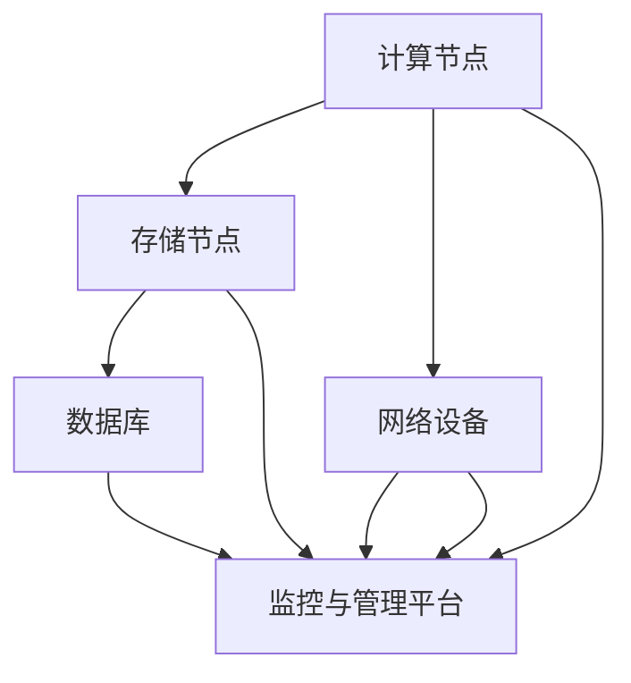

                 

关键词：AI大模型、数据中心、运维管理、架构设计、性能优化、数据安全、未来展望

## 摘要

本文将探讨AI大模型在数据中心的应用以及数据中心运维与管理的重要性。我们将从数据中心的基础架构设计、AI大模型在数据中心中的运行机制、数据中心运维管理的核心任务、性能优化策略、数据安全与隐私保护等方面进行深入分析，同时讨论未来的发展趋势与面临的挑战。

### 1. 背景介绍

随着人工智能技术的快速发展，AI大模型在各个领域得到了广泛应用，如自然语言处理、计算机视觉、推荐系统等。这些大模型通常需要大量的计算资源和数据支持，对数据中心的硬件设施和运维管理提出了新的要求。数据中心作为承载这些AI大模型的核心设施，其稳定性、性能和安全性对大模型的运行效果有着直接的影响。

数据中心的建设和运维管理涉及多个方面，包括硬件设备的选型、网络架构的设计、数据存储与管理、系统监控与维护等。随着AI大模型的引入，数据中心的运维管理变得更加复杂和多样化。因此，本文将从数据中心运维管理的角度，深入探讨AI大模型应用中的关键问题。

### 2. 核心概念与联系

在探讨AI大模型应用数据中心建设之前，我们首先需要了解数据中心的基本架构和核心概念。以下是一个简单的Mermaid流程图，展示数据中心的关键组成部分及其相互关系：



#### 2.1 数据中心基本架构

- **计算节点（A）**：负责运行AI大模型，进行计算处理。计算节点通常由高性能服务器组成，具有强大的计算能力和内存容量。
- **存储节点（B）**：用于存储大量数据，包括训练数据和模型数据。存储节点可以是磁盘阵列、固态硬盘或分布式文件系统。
- **网络设备（C）**：负责数据传输，连接计算节点、存储节点和监控与管理平台。网络设备包括路由器、交换机和防火墙等。
- **数据库（D）**：用于存储和管理元数据和日志信息，支持数据查询和数据分析。
- **监控与管理平台（E）**：实时监控数据中心的运行状态，提供故障诊断、性能优化和安全管理等功能。

#### 2.2 AI大模型在数据中心的应用

AI大模型在数据中心的应用主要包括以下方面：

- **模型训练与优化**：数据中心为AI大模型提供计算资源和数据存储，支持模型的训练和优化过程。
- **模型推理与部署**：数据中心运行模型推理任务，提供实时决策支持。
- **数据处理与分析**：数据中心处理和分析数据，支持模型的持续学习和改进。

### 3. 核心算法原理 & 具体操作步骤

#### 3.1 算法原理概述

AI大模型的核心算法通常是基于深度学习框架，如TensorFlow、PyTorch等。以下是一个简单的算法原理概述：

- **神经网络架构**：构建多层神经网络，包括输入层、隐藏层和输出层。每个层由多个神经元组成，通过前向传播和反向传播进行训练。
- **损失函数**：定义模型预测值与真实值之间的差距，用于评估模型性能。
- **优化算法**：选择合适的优化算法，如梯度下降、Adam等，更新模型参数，减小损失函数。

#### 3.2 算法步骤详解

AI大模型在数据中心的具体操作步骤如下：

1. **数据预处理**：清洗和预处理输入数据，包括数据清洗、归一化、数据增强等。
2. **模型训练**：在计算节点上运行模型训练过程，包括前向传播、损失计算和反向传播。
3. **模型优化**：通过调整模型参数，减小损失函数，提高模型性能。
4. **模型评估**：在测试集上评估模型性能，选择最优模型。
5. **模型部署**：将训练好的模型部署到数据中心，进行实时推理任务。
6. **模型监控**：实时监控模型运行状态，进行性能优化和故障诊断。

#### 3.3 算法优缺点

AI大模型的优点包括：

- **强大的数据处理能力**：可以处理大规模数据和复杂任务。
- **自适应学习能力**：可以持续学习和改进，提高模型性能。

AI大模型的缺点包括：

- **计算资源需求大**：需要高性能计算节点和大量数据存储资源。
- **训练时间较长**：训练过程需要大量计算资源和时间。

#### 3.4 算法应用领域

AI大模型的应用领域非常广泛，包括但不限于：

- **自然语言处理**：文本分类、机器翻译、情感分析等。
- **计算机视觉**：图像分类、目标检测、人脸识别等。
- **推荐系统**：个性化推荐、广告投放等。
- **金融风控**：信用评估、欺诈检测等。

### 4. 数学模型和公式 & 详细讲解 & 举例说明

#### 4.1 数学模型构建

AI大模型的核心数学模型是基于多层神经网络。以下是一个简单的神经网络模型：

$$
f(x) = \sigma(z) = \frac{1}{1 + e^{-z}}
$$

其中，$z$ 是神经元的输入值，$\sigma$ 是激活函数，$f(x)$ 是神经元的输出值。

#### 4.2 公式推导过程

神经网络的训练过程包括前向传播和反向传播。以下是一个简单的推导过程：

1. **前向传播**：

$$
z_i = \sum_{j=1}^{n} w_{ij} \cdot x_j + b_i
$$

$$
o_i = f(z_i)
$$

2. **反向传播**：

$$
\Delta w_{ij} = \eta \cdot \frac{\partial L}{\partial z_i} \cdot x_j
$$

$$
\Delta b_i = \eta \cdot \frac{\partial L}{\partial z_i}
$$

其中，$w_{ij}$ 是权重，$b_i$ 是偏置，$o_i$ 是输出值，$\Delta w_{ij}$ 和 $\Delta b_i$ 是权重和偏置的更新值，$L$ 是损失函数，$\eta$ 是学习率。

#### 4.3 案例分析与讲解

以下是一个简单的AI大模型案例，用于图像分类。

1. **数据集**：使用CIFAR-10数据集，包含10个类别，共50000张训练图像和10000张测试图像。
2. **模型架构**：使用一个简单的卷积神经网络，包括两个卷积层、两个池化层和一个全连接层。
3. **训练过程**：在计算节点上运行模型训练，通过调整权重和偏置，减小损失函数。
4. **模型评估**：在测试集上评估模型性能，计算准确率。

### 5. 项目实践：代码实例和详细解释说明

#### 5.1 开发环境搭建

1. **硬件要求**：高性能计算服务器，配备多核CPU和GPU。
2. **软件要求**：安装Python、TensorFlow等深度学习框架。

#### 5.2 源代码详细实现

以下是一个简单的AI大模型实现示例：

```python
import tensorflow as tf

# 定义模型
model = tf.keras.Sequential([
    tf.keras.layers.Conv2D(32, (3, 3), activation='relu', input_shape=(32, 32, 3)),
    tf.keras.layers.MaxPooling2D((2, 2)),
    tf.keras.layers.Conv2D(64, (3, 3), activation='relu'),
    tf.keras.layers.MaxPooling2D((2, 2)),
    tf.keras.layers.Flatten(),
    tf.keras.layers.Dense(64, activation='relu'),
    tf.keras.layers.Dense(10, activation='softmax')
])

# 编译模型
model.compile(optimizer='adam', loss='categorical_crossentropy', metrics=['accuracy'])

# 训练模型
model.fit(x_train, y_train, epochs=10, batch_size=64, validation_data=(x_test, y_test))

# 评估模型
model.evaluate(x_test, y_test)
```

#### 5.3 代码解读与分析

以上代码实现了CIFAR-10图像分类任务。具体解读如下：

- **模型定义**：使用Keras API定义一个简单的卷积神经网络，包括两个卷积层、两个池化层和一个全连接层。
- **模型编译**：设置优化器和损失函数，准备训练模型。
- **模型训练**：使用训练数据集训练模型，设置训练轮数、批量大小和验证数据集。
- **模型评估**：在测试集上评估模型性能，计算准确率。

### 6. 实际应用场景

AI大模型在实际应用中具有广泛的应用场景，以下是一些典型应用：

- **医疗诊断**：使用AI大模型对医学影像进行分析，辅助医生进行疾病诊断。
- **自动驾驶**：使用AI大模型处理摄像头和传感器数据，实现自动驾驶功能。
- **智能客服**：使用AI大模型处理用户对话，提供智能客服服务。
- **金融风控**：使用AI大模型分析金融数据，进行风险评估和欺诈检测。

#### 6.1 医疗诊断

AI大模型在医疗诊断中的应用非常广泛，如图像分类、病灶检测、基因分析等。以下是一个医疗诊断应用示例：

- **数据集**：收集大量的医学影像数据，包括正常和异常图像。
- **模型训练**：在计算节点上运行模型训练，通过调整参数和优化算法，提高模型性能。
- **模型部署**：将训练好的模型部署到数据中心，进行实时诊断任务。
- **模型监控**：实时监控模型运行状态，进行性能优化和故障诊断。

#### 6.2 自动驾驶

AI大模型在自动驾驶中的应用主要体现在感知、规划和控制等方面。以下是一个自动驾驶应用示例：

- **数据集**：收集大量的自动驾驶数据，包括摄像头、雷达和激光雷达数据。
- **模型训练**：在计算节点上运行模型训练，通过调整参数和优化算法，提高模型性能。
- **模型部署**：将训练好的模型部署到数据中心，进行实时感知和规划任务。
- **模型监控**：实时监控模型运行状态，进行性能优化和故障诊断。

### 7. 工具和资源推荐

#### 7.1 学习资源推荐

- **书籍**：《深度学习》（Goodfellow、Bengio和Courville著）
- **在线课程**：Coursera、Udacity、edX等平台上的深度学习课程
- **论文**：ACL、ICML、NeurIPS等顶级会议和期刊上的相关论文

#### 7.2 开发工具推荐

- **深度学习框架**：TensorFlow、PyTorch、Keras等
- **编程语言**：Python
- **开发环境**：Jupyter Notebook、Google Colab等

#### 7.3 相关论文推荐

- **论文1**：《Deep Learning for Text Classification》（Wang et al., 2017）
- **论文2**：《ResNet: Training Deep Neural Networks for Image Recognition》（He et al., 2016）
- **论文3**：《Distributed Deep Learning: Motivations and Methods》（Dean et al., 2012）

### 8. 总结：未来发展趋势与挑战

#### 8.1 研究成果总结

AI大模型在数据中心的应用取得了显著成果，包括图像分类、语音识别、自然语言处理等领域的突破。随着计算资源和数据量的不断增长，AI大模型的应用前景将更加广阔。

#### 8.2 未来发展趋势

- **模型压缩与优化**：通过模型压缩和优化技术，降低计算资源和存储需求，提高模型运行效率。
- **分布式计算与存储**：采用分布式计算和存储技术，实现大规模AI大模型的训练和部署。
- **实时推理与监控**：实现实时推理和监控，提高AI大模型在数据中心的应用性能。

#### 8.3 面临的挑战

- **计算资源需求**：AI大模型的计算资源需求巨大，如何高效利用计算资源成为一大挑战。
- **数据安全与隐私**：在数据中心中存储和处理大量数据，如何保护数据安全和用户隐私成为关键问题。
- **运维管理复杂度**：AI大模型的引入增加了数据中心的运维管理复杂度，如何实现高效运维成为挑战。

#### 8.4 研究展望

未来研究将重点关注以下几个方面：

- **模型压缩与优化**：研究更加高效的模型压缩和优化技术，降低计算资源和存储需求。
- **分布式计算与存储**：探索分布式计算和存储技术，实现大规模AI大模型的训练和部署。
- **数据安全与隐私保护**：研究数据加密、隐私保护等技术，确保数据安全和用户隐私。

### 9. 附录：常见问题与解答

#### 9.1 如何选择数据中心硬件设备？

选择数据中心硬件设备需要考虑以下几个方面：

- **计算能力**：根据AI大模型的需求，选择具有强大计算能力的服务器和GPU。
- **存储容量**：根据数据量需求，选择具有足够存储容量的硬盘和分布式文件系统。
- **网络带宽**：根据数据传输需求，选择具有足够网络带宽的网络设备。
- **可靠性**：选择具有高可靠性和稳定性的硬件设备，降低故障风险。

#### 9.2 如何优化数据中心性能？

优化数据中心性能可以从以下几个方面入手：

- **负载均衡**：合理分配计算资源和数据存储，避免单点过载。
- **缓存机制**：采用缓存机制，减少数据访问延迟。
- **自动化运维**：采用自动化运维工具，提高运维效率和准确性。
- **性能监控**：实时监控数据中心性能，及时发现和处理问题。

#### 9.3 如何确保数据安全与隐私？

确保数据安全与隐私可以从以下几个方面入手：

- **数据加密**：对数据进行加密，防止数据泄露。
- **访问控制**：设置合理的访问权限，限制非授权访问。
- **安全审计**：定期进行安全审计，检测和修复安全漏洞。
- **隐私保护**：采用隐私保护技术，如差分隐私、数据去识别等，确保用户隐私。

以上是关于AI大模型应用数据中心建设与运维管理的一些关键问题和技术策略。随着人工智能技术的不断进步，数据中心的建设和运维管理将面临新的挑战和机遇。希望通过本文的探讨，为读者提供有价值的参考和启示。作者：禅与计算机程序设计艺术 / Zen and the Art of Computer Programming。

