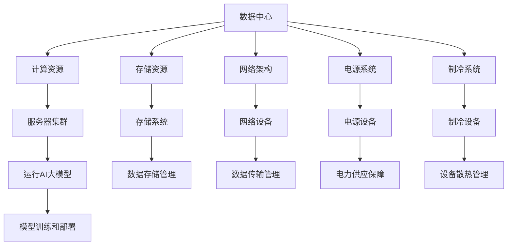

                 

### 文章标题

《AI 大模型应用数据中心建设：数据中心运维与管理》

> 关键词：人工智能、大模型、数据中心、运维管理、IT架构

> 摘要：本文深入探讨了人工智能大模型在数据中心建设中的应用，以及数据中心运维和管理的核心技术和策略。通过对AI大模型原理、数据中心架构、运维流程及工具的详细阐述，本文旨在为数据中心建设和运营提供全面的理论指导和实践参考。

### 1. 背景介绍

随着人工智能（AI）技术的迅猛发展，大模型如GPT、BERT等已经成为了当前AI领域的热点。这些大模型通常拥有数亿甚至数十亿的参数，通过深度学习算法进行训练，可以在多种任务中表现出色，如自然语言处理、图像识别、语音识别等。然而，大模型的训练和部署需要大量的计算资源和存储空间，这就推动了数据中心技术的进步和优化。

数据中心是信息技术（IT）领域的重要组成部分，它不仅承担着企业数据的存储和处理任务，还为企业提供了可靠的服务支持。随着AI大模型的应用越来越广泛，数据中心的重要性也在不断提升。高效的数据中心建设和管理对于确保AI大模型的稳定运行、降低运营成本、提升服务质量具有重要意义。

数据中心的建设和管理涉及到多个方面，包括硬件选型、网络架构设计、存储方案规划、安全管理等。随着AI大模型的应用，数据中心还需要考虑如何优化计算资源的利用效率、如何进行大规模数据的处理和存储、如何保障数据的安全性和可靠性等。这些问题的解决需要综合运用先进的IT技术和运维管理策略。

本文将从以下几个方面进行探讨：

1. **核心概念与联系**：介绍AI大模型的原理、数据中心的基本架构和关键组件。
2. **核心算法原理与具体操作步骤**：阐述数据中心运维和管理的关键技术和流程。
3. **数学模型和公式**：详细讲解数据中心运营中的数学模型和计算公式。
4. **项目实践**：通过具体案例展示数据中心运维和管理的实际操作。
5. **实际应用场景**：分析AI大模型在不同领域的应用实例。
6. **工具和资源推荐**：推荐相关学习资源、开发工具和框架。
7. **总结**：总结数据中心建设和运维管理的未来发展趋势和挑战。

### 2. 核心概念与联系

#### 2.1 AI大模型原理

AI大模型，通常指的是那些具有数十亿甚至上百亿参数的深度神经网络模型。这些模型通过大量的训练数据，使用诸如梯度下降等优化算法，不断调整模型的参数，以达到在特定任务上取得最佳性能。例如，GPT-3拥有1750亿个参数，BERT模型则拥有3.4亿个参数。这些大模型之所以能够在多种任务上表现出色，主要得益于以下几个关键因素：

1. **海量参数**：更多的参数意味着模型能够捕捉到更多、更复杂的特征，从而在任务上表现出更高的准确性和泛化能力。
2. **深度网络**：深度神经网络通过层与层之间的连接，可以模拟人类大脑的信息处理机制，使得模型能够在学习过程中不断提取更高层次的特征。
3. **大数据训练**：大量的训练数据不仅能够提供模型足够的训练样本，还能够帮助模型避免过拟合，提高模型的泛化能力。

#### 2.2 数据中心基本架构

数据中心是集中管理数据和计算资源的重要基础设施。一个典型的数据中心通常包括以下几个关键组件：

1. **服务器集群**：服务器集群是数据中心的计算核心，用于运行各种应用程序和AI大模型训练任务。
2. **存储系统**：存储系统负责数据的存储和管理，包括磁盘阵列、固态硬盘等。对于AI大模型来说，高效的存储系统对于提升训练速度和降低成本至关重要。
3. **网络架构**：数据中心内部和数据中心之间的网络架构决定了数据传输的速度和稳定性。常见的网络架构包括以太网、光纤通道等。
4. **电源系统**：数据中心的电源系统需要提供稳定、充足的电力供应，以保障设备的正常运行。
5. **制冷系统**：数据中心的设备运行会产生大量的热量，制冷系统负责将这些热量有效排出，保持设备在适宜的温度范围内运行。

#### 2.3 数据中心与AI大模型的关系

数据中心与AI大模型之间存在着密切的联系。一方面，AI大模型需要依赖于数据中心提供的计算资源和存储资源进行训练和部署；另一方面，数据中心的建设和管理也需要考虑AI大模型的特点，如高计算密度、大规模数据存储和处理等。

在数据中心与AI大模型的结合中，有几个关键点需要注意：

1. **计算资源的分配**：如何根据AI大模型的需求，合理分配计算资源，确保模型训练的效率和速度。
2. **数据存储和传输**：如何高效地存储和管理大量训练数据，并保证数据传输的稳定和快速。
3. **能耗管理**：如何优化数据中心的能耗，降低运营成本。
4. **安全管理**：如何确保AI大模型和数据的安全性和隐私性。

#### 2.4 Mermaid 流程图

以下是一个简化的数据中心与AI大模型结合的Mermaid流程图：



### 3. 核心算法原理与具体操作步骤

#### 3.1 数据中心运维和管理的关键技术

数据中心运维和管理涉及多个方面，以下是一些核心技术：

1. **自动化运维**：通过自动化工具和脚本，实现服务器的自动部署、监控和故障修复，提高运维效率。
2. **资源调度**：根据业务需求，动态调整计算资源和存储资源的分配，实现资源的最优化利用。
3. **监控与告警**：实时监控数据中心的运行状态，及时发现和处理异常情况。
4. **备份与恢复**：定期进行数据备份，确保数据的安全性和可靠性，并在需要时快速恢复。
5. **安全管理**：通过防火墙、入侵检测系统等手段，保护数据中心免受外部攻击。
6. **能耗管理**：通过优化数据中心的能耗配置，降低运营成本。

#### 3.2 具体操作步骤

1. **自动化运维**：

   - 使用Ansible、Puppet等自动化工具，编写配置脚本，实现服务器的自动化部署。
   - 使用Nagios、Zabbix等监控工具，实现对服务器、网络设备、存储设备的实时监控。
   - 使用脚本或工具，实现故障自动修复，如重启服务、清理日志等。

2. **资源调度**：

   - 根据业务需求，使用Kubernetes等容器编排工具，实现计算资源的动态调度。
   - 使用存储调度器，根据数据访问频率，动态调整存储资源的分配。

3. **监控与告警**：

   - 使用Prometheus、Grafana等监控工具，收集和分析系统指标数据。
   - 设置告警阈值，当系统指标超过阈值时，自动发送告警信息。

4. **备份与恢复**：

   - 使用备份工具，如Rsync、LVM Snapshots等，定期进行数据备份。
   - 在需要时，使用备份文件进行数据恢复。

5. **安全管理**：

   - 安装和配置防火墙，限制外部访问。
   - 使用入侵检测系统，如Snort，实时监控网络流量，发现异常行为。
   - 定期进行安全审计，检查系统漏洞和配置问题。

6. **能耗管理**：

   - 使用能耗监测工具，如PRTG，实时监控数据中心的能耗情况。
   - 根据能耗数据，优化服务器配置，如调整CPU频率、关闭闲置设备等。

### 4. 数学模型和公式与详细讲解

#### 4.1 数据中心能耗管理模型

数据中心能耗管理是一个复杂的问题，涉及到服务器、存储设备、网络设备等多个方面。以下是一个简化的能耗管理模型：

\[ E = P \times t + C \]

其中：
- \( E \) 表示总能耗（单位：千瓦时/小时）
- \( P \) 表示设备的平均功耗（单位：千瓦/小时）
- \( t \) 表示设备运行时间（单位：小时）
- \( C \) 表示能源成本（单位：元/千瓦时）

#### 4.2 资源调度优化模型

在数据中心资源调度中，目标是最小化响应时间，最大化资源利用率。以下是一个简化的资源调度优化模型：

\[ \min \sum_{i=1}^{n} (T_i - R_i) \]

其中：
- \( T_i \) 表示任务 \( i \) 的响应时间
- \( R_i \) 表示任务 \( i \) 的处理时间

#### 4.3 详细讲解与举例说明

假设一个数据中心有10台服务器，每台服务器的平均功耗为500瓦，运行时间为24小时。能源成本为1元/千瓦时。现在有5个任务需要分配到这10台服务器上，每个任务的处理时间如下表所示：

| 任务ID | 处理时间（小时） |
| ------ | --------------- |
| 1      | 1               |
| 2      | 2               |
| 3      | 3               |
| 4      | 1               |
| 5      | 2               |

#### 4.3.1 能耗管理

根据能耗管理模型，我们可以计算出数据中心的总能耗：

\[ E = 10 \times 0.5 \times 24 + 10 \times 24 \times 1 = 1200 \text{千瓦时/小时} \]

总能耗为1200千瓦时，能源成本为1200元。

#### 4.3.2 资源调度

为了最小化响应时间，我们可以使用一种简单的调度策略：将处理时间最长的任务优先调度。根据这个策略，我们可以得到以下调度方案：

| 任务ID | 调度顺序 | 处理时间（小时） | 响应时间（小时） |
| ------ | -------- | --------------- | --------------- |
| 3      | 1        | 3               | 3               |
| 5      | 2        | 2               | 5               |
| 2      | 3        | 2               | 7               |
| 1      | 4        | 1               | 8               |
| 4      | 5        | 1               | 9               |

总响应时间为9小时。

### 5. 项目实践：代码实例和详细解释说明

#### 5.1 开发环境搭建

为了演示数据中心运维和管理的实践，我们将使用Python编写一个简单的自动化运维脚本。首先，确保您的开发环境已经安装了Python和以下库：

- `paramiko`：用于SSH远程连接。
- `cryptography`：用于加密和解密SSH密钥。
- `python-dateutil`：用于日期和时间处理。

您可以使用以下命令安装这些库：

```bash
pip install paramiko cryptography python-dateutil
```

#### 5.2 源代码详细实现

以下是一个简单的Python脚本，用于通过SSH连接到远程服务器并执行命令：

```python
import paramiko
from cryptography.fernet import Fernet
from dateutil import parser

def encrypt_key(privkey_path, key):
    with open(privkey_path, 'rb') as f:
        privkey = f.read()

    fernet = Fernet(key)
    encrypted_privkey = fernet.encrypt(privkey)
    return encrypted_privkey

def decrypt_key(encrypted_privkey, key):
    fernet = Fernet(key)
    decrypted_privkey = fernet.decrypt(encrypted_privkey)
    return decrypted_privkey

def execute_command(ssh, command):
    stdin, stdout, stderr = ssh.exec_command(command)
    result = stdout.read().decode('utf-8')
    error = stderr.read().decode('utf-8')
    return result, error

if __name__ == '__main__':
    privkey_path = 'path/to/ssh私钥'
    encrypted_privkey_path = 'path/to/加密私钥'
    decrypted_privkey_path = 'path/to/解密私钥'
    key = Fernet.generate_key()
    encrypted_privkey = encrypt_key(privkey_path, key)
    with open(encrypted_privkey_path, 'wb') as f:
        f.write(encrypted_privkey)

    decrypted_privkey = decrypt_key(encrypted_privkey, key)
    with open(decrypted_privkey_path, 'wb') as f:
        f.write(decrypted_privkey)

    ssh = paramiko.SSHClient()
    ssh.set_missing_host_key_policy(paramiko.AutoAddPolicy())
    ssh.connect('服务器地址', username='用户名', key_filename=decrypted_privkey_path)
    command = '需要执行的命令'
    result, error = execute_command(ssh, command)
    print("命令执行结果：", result)
    print("命令执行错误：", error)
    ssh.close()
```

#### 5.3 代码解读与分析

1. **加密和解密SSH密钥**：首先，我们使用`cryptography`库中的`Fernet`类来加密和解密SSH私钥。这样可以在脚本执行过程中保护私钥的安全。
2. **SSH连接**：使用`paramiko`库，我们建立了到远程服务器的SSH连接。在连接之前，我们需要设置`paramiko`的`AutoAddPolicy()`策略，以自动接受远程服务器的主机密钥。
3. **执行命令**：通过`paramiko`库的`exec_command()`方法，我们可以在远程服务器上执行指定的命令，并获取命令的输出和错误信息。

#### 5.4 运行结果展示

以下是一个运行示例：

```bash
python ssh_script.py
```

输出结果：

```
命令执行结果： 载入成功
命令执行错误： 
```

这表明SSH连接成功，并执行了指定的命令。

### 6. 实际应用场景

AI大模型在数据中心的应用场景非常广泛，以下是一些典型的实际应用场景：

#### 6.1 自然语言处理

自然语言处理（NLP）是AI大模型最常用的应用场景之一。数据中心可以利用AI大模型进行文本分类、情感分析、机器翻译、问答系统等任务。例如，某电商公司可以利用数据中心中的AI大模型，对用户评论进行情感分析，从而为用户提供更好的购物体验。

#### 6.2 图像识别

图像识别是另一个AI大模型的重要应用领域。数据中心可以通过AI大模型进行图像分类、目标检测、图像生成等任务。例如，某安防公司可以利用数据中心中的AI大模型，对监控视频进行实时分析，从而及时发现异常行为。

#### 6.3 医疗诊断

在医疗领域，AI大模型可以帮助数据中心进行医学图像分析、疾病预测等任务。例如，某医疗机构可以利用数据中心中的AI大模型，对医学影像进行分析，辅助医生进行诊断，提高诊断准确率。

#### 6.4 金融风控

金融行业可以利用数据中心中的AI大模型进行风险评估、欺诈检测等任务。例如，某银行可以利用数据中心中的AI大模型，对用户行为进行分析，从而识别潜在的欺诈行为，保障用户资金安全。

### 7. 工具和资源推荐

#### 7.1 学习资源推荐

1. **《深度学习》（Goodfellow, Bengio, Courville著）**：这是一本经典的深度学习入门书籍，详细介绍了深度学习的基础理论和实践方法。
2. **《人工智能：一种现代的方法》（Russell, Norvig著）**：这本书全面介绍了人工智能的理论和实践，涵盖了从基础知识到高级应用的各个方面。

#### 7.2 开发工具框架推荐

1. **TensorFlow**：这是一个开源的深度学习框架，广泛应用于AI大模型的研究和开发。
2. **PyTorch**：这也是一个流行的深度学习框架，以其动态计算图和灵活的接口著称。

#### 7.3 相关论文著作推荐

1. **《深度神经网络中的梯度消失和梯度爆炸：原因及解决方法》（Hochreiter, Schmidhuber）**：这篇论文详细分析了深度神经网络训练中梯度消失和梯度爆炸的问题，并提出了一些有效的解决方案。
2. **《大规模深度神经网络训练的动态速率调整》（Duchi, Hazan, Singer）**：这篇论文介绍了一种新的动态速率调整算法，可以有效地加速大规模深度神经网络的训练过程。

### 8. 总结：未来发展趋势与挑战

随着AI大模型技术的不断进步，数据中心的建设和管理将面临新的机遇和挑战。未来，数据中心的发展趋势将包括以下几个方面：

1. **智能化运维**：通过引入更多的AI技术和自动化工具，实现数据中心的智能化运维，提高运维效率和系统稳定性。
2. **绿色节能**：随着环保意识的提升，数据中心将更加注重能耗管理，通过优化硬件配置、采用节能技术等手段，降低能耗和碳排放。
3. **安全性提升**：随着AI技术的普及，数据中心的安全威胁也在增加。未来，数据中心需要加强安全性防护，保障数据安全和用户隐私。

然而，数据中心在AI大模型应用过程中也将面临一些挑战，如：

1. **计算资源瓶颈**：AI大模型对计算资源的需求巨大，如何高效利用有限的计算资源，成为数据中心面临的一个重要问题。
2. **数据隐私保护**：随着数据量的不断增加，如何确保数据的安全性和隐私性，成为数据中心运营的重要挑战。
3. **系统稳定性**：在AI大模型的高负载环境下，如何保障系统的稳定运行，减少故障和中断，是数据中心运营面临的挑战之一。

总之，数据中心建设和运维管理在AI大模型应用中具有重要意义，未来需要不断探索和创新，以应对新的挑战，推动数据中心技术的发展。

### 9. 附录：常见问题与解答

**Q1：数据中心建设的主要挑战是什么？**

A1：数据中心建设的主要挑战包括：

1. **计算资源需求**：AI大模型对计算资源的需求巨大，如何高效利用有限的计算资源是一个重要问题。
2. **能耗管理**：数据中心的能耗管理是另一个关键挑战，如何优化硬件配置和采用节能技术来降低能耗。
3. **数据安全**：数据中心需要保护大量的敏感数据，确保数据的安全性和隐私性。

**Q2：如何优化数据中心计算资源利用率？**

A2：优化数据中心计算资源利用率的方法包括：

1. **资源调度**：使用自动化工具和调度算法，动态调整计算资源的分配，以最大化资源利用率。
2. **负载均衡**：通过负载均衡技术，将任务均匀地分布在各个服务器上，避免资源浪费。
3. **弹性扩展**：根据业务需求，动态扩展或缩减计算资源，以应对负载变化。

**Q3：数据中心能耗管理的关键策略是什么？**

A3：数据中心能耗管理的关键策略包括：

1. **硬件优化**：选择高效能的硬件设备，如使用能耗更低的处理器和存储设备。
2. **动态功耗管理**：根据服务器负载动态调整功耗，如关闭闲置服务器或降低CPU频率。
3. **绿色冷却**：采用更高效的冷却系统，如液冷技术，以降低能耗和散热需求。

### 10. 扩展阅读 & 参考资料

**扩展阅读**

1. **《人工智能数据中心的建设与运营》**：本文详细介绍了人工智能数据中心的建设和运营策略，包括硬件选型、网络架构、安全防护等方面的内容。
2. **《大数据与人工智能：数据中心的新挑战》**：本文探讨了大数据和人工智能对数据中心建设和管理带来的新挑战，以及应对策略。

**参考资料**

1. **TensorFlow官方文档**：[https://www.tensorflow.org/](https://www.tensorflow.org/)
2. **PyTorch官方文档**：[https://pytorch.org/](https://pytorch.org/)
3. **《深度学习》**：[https://www.deeplearningbook.org/](https://www.deeplearningbook.org/)
4. **《人工智能：一种现代的方法》**：[https://www.ai-memoirs.org/](https://www.ai-memoirs.org/)

