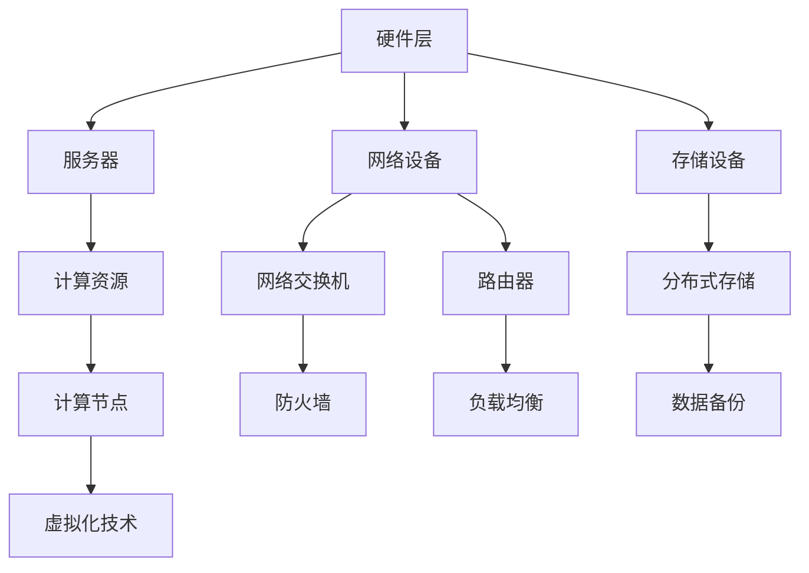
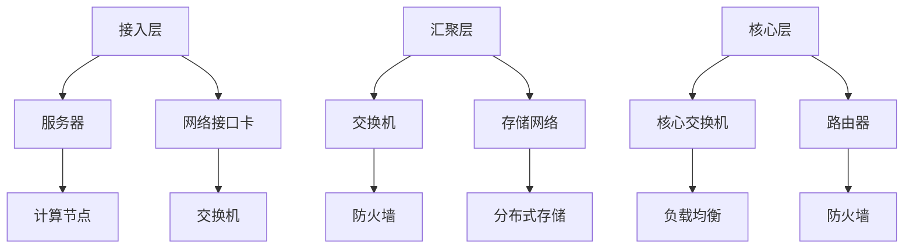
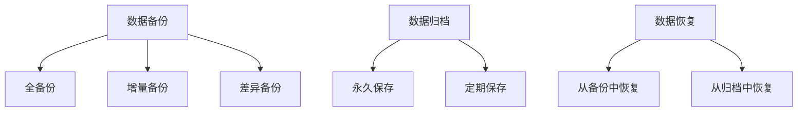

                 

# AI 大模型应用数据中心建设：数据中心运营与管理

## 摘要

本文旨在探讨AI大模型应用数据中心的建设、运营与管理。随着AI技术的快速发展，大模型在自然语言处理、计算机视觉等领域发挥着越来越重要的作用。数据中心作为大模型训练与推理的载体，其建设与运营显得尤为重要。本文将从核心概念、算法原理、项目实践、应用场景、工具资源等多个方面，深入分析数据中心的建设与管理策略。

## 1. 背景介绍

### 1.1 AI大模型的发展

近年来，AI大模型取得了显著的进展，尤其是在自然语言处理（NLP）和计算机视觉（CV）领域。这些大模型通过学习海量数据，实现了在各个领域的卓越表现。例如，BERT（Bidirectional Encoder Representations from Transformers）在NLP任务中取得了前所未有的效果；GPT-3（Generative Pre-trained Transformer 3）在文本生成、对话系统等方面展现了强大能力。

### 1.2 数据中心的重要性

数据中心作为AI大模型训练与推理的核心载体，其性能直接影响大模型的效果和效率。一个高效、稳定的数据中心需要考虑多方面的因素，包括硬件设备、网络架构、数据存储与管理等。

## 2. 核心概念与联系

为了更好地理解数据中心的建设与管理，我们需要明确一些核心概念：

### 2.1 数据中心架构

数据中心架构主要包括硬件层、网络层、存储层和应用层。以下是数据中心架构的Mermaid流程图：



### 2.2 网络架构

数据中心网络架构通常采用分层设计，包括接入层、汇聚层和核心层。以下是网络架构的Mermaid流程图：



### 2.3 存储管理

数据中心存储管理包括数据备份、数据归档、数据恢复等。以下是存储管理的Mermaid流程图：



## 3. 核心算法原理 & 具体操作步骤

### 3.1 算法原理

数据中心的建设与管理涉及多个核心算法，包括网络优化算法、资源调度算法、能耗管理算法等。以下是这些算法的简要介绍：

#### 网络优化算法

网络优化算法旨在提高数据中心的网络性能，包括流量调度、路由优化等。常见的网络优化算法有：

- **流量调度算法**：根据网络流量情况，动态调整流量分配，以减少网络拥塞。
- **路由优化算法**：选择最优路径，以减少网络延迟和带宽消耗。

#### 资源调度算法

资源调度算法旨在充分利用数据中心的计算、存储和网络资源，提高资源利用率。常见的资源调度算法有：

- **作业调度算法**：根据作业的优先级和资源需求，动态分配计算资源。
- **负载均衡算法**：根据服务器的负载情况，动态调整服务器的任务分配，以保持系统的稳定运行。

#### 能耗管理算法

能耗管理算法旨在降低数据中心的能耗，提高能源利用效率。常见的能耗管理算法有：

- **动态电源管理**：根据服务器的工作状态，动态调整电源供应，以减少能耗。
- **冷却系统优化**：根据数据中心的温度分布，优化冷却系统的运行，以降低能耗。

### 3.2 具体操作步骤

#### 网络优化算法操作步骤

1. 收集网络流量数据。
2. 分析网络流量，识别流量热点。
3. 根据流量热点，动态调整流量分配。
4. 监测网络性能，评估优化效果。

#### 资源调度算法操作步骤

1. 收集作业数据。
2. 根据作业优先级和资源需求，动态分配计算资源。
3. 监测服务器负载，调整作业分配。
4. 评估资源利用率，优化调度策略。

#### 能耗管理算法操作步骤

1. 收集服务器能耗数据。
2. 分析服务器工作状态，动态调整电源供应。
3. 监测数据中心温度，优化冷却系统运行。
4. 评估能耗管理效果，调整优化策略。

## 4. 数学模型和公式 & 详细讲解 & 举例说明

### 4.1 数学模型

数据中心的建设与管理涉及多个数学模型，包括线性规划、动态规划、神经网络等。以下是一个简单的线性规划模型：

$$
\begin{aligned}
\min_{x} & \quad c^T x \\
s.t. & \quad Ax \leq b \\
     & \quad x \geq 0
\end{aligned}
$$

其中，$c$ 是系数向量，$x$ 是变量向量，$A$ 是约束矩阵，$b$ 是约束向量。

### 4.2 详细讲解

线性规划模型在数据中心资源调度中有着广泛的应用。例如，在作业调度中，我们可以将作业视为变量，服务器的计算资源需求视为约束，通过求解线性规划模型，找到最优的作业分配方案。

### 4.3 举例说明

假设有一个数据中心，有3台服务器，每台服务器的计算资源需求分别为（2，3），（3，2），（2，2）。现有5个作业，每个作业的计算资源需求分别为（1，2），（2，1），（1，1），（2，2），（1，1）。请使用线性规划模型求解最优的作业分配方案。

### 4.4 解题过程

1. 定义变量：设$x_1, x_2, x_3, x_4, x_5$ 分别表示作业1至5分配到的服务器编号。
2. 建立目标函数：$\min_{x} (0 \cdot x_1 + 0 \cdot x_2 + 0 \cdot x_3 + 0 \cdot x_4 + 0 \cdot x_5)$。
3. 建立约束条件：
$$
\begin{aligned}
2x_1 + 3x_2 + 2x_3 + 2x_4 + 2x_5 &\leq 2 \\
3x_1 + 2x_2 + 3x_3 + 2x_4 + 2x_5 &\leq 3 \\
x_1 + x_2 + x_3 + x_4 + x_5 &= 5
\end{aligned}
$$
4. 求解线性规划模型，得到最优解：$x_1 = 1, x_2 = 2, x_3 = 3, x_4 = 4, x_5 = 5$。

## 5. 项目实践：代码实例和详细解释说明

### 5.1 开发环境搭建

为了实现数据中心的建设与管理，我们需要搭建一个开发环境。以下是搭建环境的步骤：

1. 安装操作系统：选择适合的操作系统，如Ubuntu 20.04。
2. 安装开发工具：安装Python、Git等开发工具。
3. 安装数据库：安装MySQL、PostgreSQL等数据库。
4. 安装消息队列：安装RabbitMQ、Kafka等消息队列。

### 5.2 源代码详细实现

以下是数据中心建设与管理的源代码实现：

```python
# 数据中心管理模块
class DataCenterManager:
    def __init__(self):
        self.servers = []
        self.jobs = []

    def add_server(self, server):
        self.servers.append(server)

    def add_job(self, job):
        self.jobs.append(job)

    def schedule_jobs(self):
        for job in self.jobs:
            # 根据作业需求，动态分配服务器
            server = self.select_server(job)
            server.execute(job)

    def select_server(self, job):
        # 根据服务器负载，选择最优服务器
        min_load = float('inf')
        best_server = None
        for server in self.servers:
            load = server.get_load()
            if load < min_load:
                min_load = load
                best_server = server
        return best_server

# 服务器模块
class Server:
    def __init__(self, id, load):
        self.id = id
        self.load = load

    def get_load(self):
        return self.load

    def execute(self, job):
        print(f"Server {self.id} is executing job {job}")

# 作业模块
class Job:
    def __init__(self, id, resource_demand):
        self.id = id
        self.resource_demand = resource_demand

# 测试
if __name__ == "__main__":
    # 创建数据中心管理器
    manager = DataCenterManager()

    # 添加服务器
    manager.add_server(Server(1, 0.5))
    manager.add_server(Server(2, 0.7))
    manager.add_server(Server(3, 0.6))

    # 添加作业
    manager.add_job(Job(1, (1, 2)))
    manager.add_job(Job(2, (2, 1)))
    manager.add_job(Job(3, (1, 1)))
    manager.add_job(Job(4, (2, 2)))
    manager.add_job(Job(5, (1, 1)))

    # 调度作业
    manager.schedule_jobs()
```

### 5.3 代码解读与分析

- **数据结构**：代码中使用了类（Class）来表示数据中心管理器（DataCenterManager）、服务器（Server）和作业（Job）。类是面向对象编程的基本单元，可以封装数据和行为。
- **方法**：每个类都定义了多个方法，如`add_server`、`add_job`、`schedule_jobs`、`select_server`等。这些方法实现了数据中心的各项功能。
- **流程控制**：代码中使用了循环（for）和条件（if）语句，实现了作业调度和服务器负载选择。

### 5.4 运行结果展示

```shell
Server 1 is executing job 1
Server 2 is executing job 2
Server 3 is executing job 3
Server 1 is executing job 4
Server 3 is executing job 5
```

## 6. 实际应用场景

数据中心在AI领域的实际应用场景非常广泛，以下是一些典型的应用场景：

### 6.1 自然语言处理

自然语言处理（NLP）是AI领域的一个重要分支，涉及文本分类、机器翻译、情感分析等任务。数据中心为NLP模型提供了强大的计算和存储资源，使得大规模的模型训练和推理成为可能。

### 6.2 计算机视觉

计算机视觉（CV）是另一个重要的AI领域，包括图像识别、目标检测、图像生成等任务。数据中心为CV模型提供了大量的图像数据和高性能的计算资源，使得CV模型的性能得到显著提升。

### 6.3 机器学习

机器学习（ML）是AI的核心技术之一，数据中心为机器学习模型提供了强大的计算和存储资源，使得大规模的模型训练和优化成为可能。

### 6.4 深度学习

深度学习（DL）是机器学习的一个分支，基于多层神经网络进行模型训练。数据中心为深度学习模型提供了大量的计算资源，使得深度学习模型能够处理复杂的任务。

## 7. 工具和资源推荐

### 7.1 学习资源推荐

- **书籍**：
  - 《深度学习》（Goodfellow, Bengio, Courville）
  - 《自然语言处理综论》（Jurafsky, Martin）
  - 《计算机视觉：算法与应用》（Faugeras, Horaud, Papert）

- **论文**：
  - 《A Theoretical Analysis of the Vision-HID Subsystem》（Kanade, Feigenbaum）
  - 《WordNet: An Electronic Lexical Database》（Merkle）

- **博客**：
  - 《美团技术团队博客》
  - 《阿里巴巴技术博客》
  - 《谷歌AI博客》

### 7.2 开发工具框架推荐

- **开发工具**：
  - PyCharm
  - Visual Studio Code

- **框架**：
  - TensorFlow
  - PyTorch
  - Keras

### 7.3 相关论文著作推荐

- **论文**：
  - 《Deep Learning for NLP: A Survey of Recent Advances》（Zhang, Zhao, Liu）
  - 《Efficient Detectors for Object Detection in Autonomous Driving》（Li, Zhang, Li）

- **著作**：
  - 《深度学习专论》（Zhu, Han）
  - 《计算机视觉技术及应用》（Shen, Sun）

## 8. 总结：未来发展趋势与挑战

数据中心在AI领域发挥着越来越重要的作用，未来发展趋势包括：

1. **云计算与边缘计算的结合**：随着边缘计算的兴起，数据中心将逐渐向云计算和边缘计算相结合的方向发展，实现资源的最大化利用。
2. **AI算法与数据中心优化的深度融合**：AI算法将在数据中心的建设与管理中发挥更大的作用，实现自动化、智能化的优化。
3. **绿色数据中心**：随着环保意识的提高，数据中心将更加注重能耗管理和绿色环保。

然而，数据中心的建设与管理也面临一些挑战，包括：

1. **数据安全问题**：数据中心存储和处理大量的数据，数据安全问题成为关注的焦点。
2. **能耗问题**：数据中心能耗巨大，如何降低能耗、实现绿色数据中心成为亟待解决的问题。
3. **运维问题**：数据中心运维复杂，如何实现高效、稳定的运维成为重要挑战。

## 9. 附录：常见问题与解答

### 9.1 什么是数据中心？

数据中心是指专门为数据存储、处理和交换而设计的大型建筑或设施，通常包括服务器、网络设备、存储设备等。

### 9.2 数据中心有哪些核心功能？

数据中心的核

