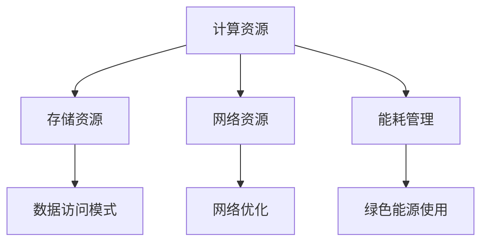

                 

### 背景介绍 Background Introduction

随着人工智能（AI）技术的快速发展，大模型（Large Models）在自然语言处理、计算机视觉、推荐系统等领域展现出了强大的能力。这些大模型通常包含数亿甚至数十亿个参数，它们需要通过大量的数据进行训练，以确保模型能够准确理解并处理复杂的任务。为了支持这些大模型的训练和应用，数据中心的建设和运营变得至关重要。

数据中心是AI大模型应用的核心基础设施，它不仅提供了计算和存储资源，还保障了数据的安全性和可靠性。随着AI技术的不断进步，数据中心的规模、性能和复杂性也在不断提高。本文将围绕AI大模型应用数据中心的建设和运营，探讨其中的核心概念、技术原理、实践方法和未来发展趋势。

首先，我们需要了解AI大模型应用数据中心的核心需求，这包括计算资源、存储资源、网络资源和能耗管理。其次，我们将介绍数据中心的基本架构，以及如何在其中部署和运行大模型。接着，我们将探讨数据中心运营中的关键环节，如监控、优化和故障处理。最后，我们将展望数据中心在AI大模型应用领域的未来发展趋势，以及面临的挑战和解决方案。

### 核心概念与联系 Core Concepts and Connections

在AI大模型应用数据中心的建设和运营中，有几个核心概念和联系需要理解。这些概念包括：计算资源、存储资源、网络资源和能耗管理。

#### 计算资源 Computing Resources

计算资源是数据中心的核心，它决定了大模型训练和推理的速度。计算资源主要来自高性能计算机集群，这些计算机通常配备了多核CPU和GPU。CPU（Central Processing Unit）用于处理计算任务的核心逻辑，而GPU（Graphics Processing Unit）则因其并行计算能力而被广泛应用于深度学习任务。

在AI大模型应用中，计算资源的分配和管理是至关重要的。首先，需要根据模型的计算需求，合理分配CPU和GPU资源。其次，为了提高计算效率，可以使用分布式计算技术，将任务分解并分配到不同的计算节点上。此外，还需要考虑负载均衡，确保计算资源被充分利用。

#### 存储资源 Storage Resources

存储资源是数据中心的数据仓库，它提供了大模型训练所需的数据存储和处理能力。存储资源通常分为两类：硬盘存储和固态存储。

硬盘存储（HDD，Hard Disk Drive）具有高容量、低成本的特点，适合长期存储大量数据。然而，其读写速度相对较慢，不适合高频率的数据访问。固态存储（SSD，Solid State Drive）则具有高速读写能力，适合存储需要频繁访问的数据，但其成本相对较高。

在AI大模型应用中，存储资源的分配和管理需要考虑数据访问模式。例如，训练数据通常需要高读写速度，而存储预训练模型和中间结果则可以考虑使用硬盘存储。此外，为了提高数据访问效率，可以使用分布式存储系统，如HDFS（Hadoop Distributed File System）和Ceph。

#### 网络资源 Network Resources

网络资源是数据中心的数据传输通道，它连接了计算资源和存储资源，确保了数据的高效传输。高性能网络是数据中心的关键，它需要提供低延迟、高带宽和高可靠性的网络连接。

在AI大模型应用中，网络资源的管理需要考虑数据传输的负载和流量。首先，需要确保网络带宽能够满足大模型训练期间的数据传输需求。其次，需要使用网络优化技术，如数据压缩和去重，减少网络流量。此外，还需要考虑网络的可靠性，确保数据传输过程中不发生数据丢失或错误。

#### 能耗管理 Energy Management

能耗管理是数据中心运营中的一个重要方面，它不仅关系到数据中心的运营成本，还关系到环境保护和可持续发展。随着AI大模型的规模不断扩大，数据中心的能耗也在逐年增加。因此，如何降低能耗、提高能源利用效率成为了一个重要课题。

在AI大模型应用数据中心中，能耗管理可以从以下几个方面入手：

1. **设备能效优化**：选择高能效的硬件设备，如高效能的CPU和GPU，以及低功耗的存储设备。
2. **智能功耗管理**：使用智能功耗管理技术，根据计算负载动态调整设备功耗，确保设备在最优功耗下运行。
3. **绿色能源使用**：优先使用可再生能源，如太阳能和风能，降低对化石燃料的依赖。
4. **设备冷却优化**：采用先进的冷却技术，如水冷和空气冷却，降低设备温度，提高设备可靠性。

#### Mermaid 流程图 Mermaid Flowchart

以下是一个简化的Mermaid流程图，展示了AI大模型应用数据中心中的核心概念和它们之间的联系：



通过上述核心概念和流程图的介绍，我们可以更好地理解AI大模型应用数据中心的建设和运营。在接下来的部分中，我们将进一步探讨核心算法原理、具体操作步骤、数学模型和项目实践，以深入理解数据中心的运行机制。

### 核心算法原理与具体操作步骤 Core Algorithm Principles and Operational Steps

在AI大模型应用数据中心，核心算法的选择和优化对于提升模型性能和降低成本至关重要。本文将详细介绍大模型训练过程中常用的核心算法，并逐步讲解如何在实际操作中应用这些算法。

#### 大模型训练算法

大模型训练主要依赖于深度学习算法，其中最常用的算法是神经网络（Neural Networks）。神经网络通过多层非线性变换来模拟人脑的感知和认知过程。在AI大模型应用中，常用的神经网络结构包括卷积神经网络（CNN）、循环神经网络（RNN）和变换器（Transformer）。

1. **卷积神经网络（CNN）**

卷积神经网络主要用于图像处理任务。其核心思想是通过卷积操作提取图像的特征，然后通过全连接层进行分类或回归。CNN的基本操作步骤如下：

   - **卷积层（Convolutional Layer）**：使用卷积核在输入图像上滑动，计算局部特征响应。
   - **激活函数（Activation Function）**：常用的激活函数包括ReLU（Rectified Linear Unit）和Sigmoid。
   - **池化层（Pooling Layer）**：通过下采样操作减少特征图的维度，提高计算效率。
   - **全连接层（Fully Connected Layer）**：将池化层的输出映射到输出层，进行分类或回归。

2. **循环神经网络（RNN）**

循环神经网络主要用于序列数据处理任务，如语音识别、机器翻译和时间序列预测。RNN通过在时间步上递归地更新隐藏状态来处理序列数据。RNN的基本操作步骤如下：

   - **输入层（Input Layer）**：输入序列数据。
   - **隐藏层（Hidden Layer）**：使用递归操作更新隐藏状态，保留历史信息。
   - **输出层（Output Layer）**：对隐藏状态进行变换，生成输出序列。

3. **变换器（Transformer）**

变换器是近年来在自然语言处理领域取得突破性成果的神经网络结构。其核心思想是引入自注意力机制（Self-Attention），通过计算输入序列中每个元素之间的相对重要性来提高模型的表示能力。变换器的基本操作步骤如下：

   - **嵌入层（Embedding Layer）**：将输入序列中的单词或字符转换为高维向量。
   - **多头自注意力层（Multi-Head Self-Attention Layer）**：计算输入序列中每个元素之间的注意力分数，并加权组合。
   - **前馈网络（Feedforward Network）**：对自注意力层的输出进行非线性变换，增加模型的非线性能力。

#### 大模型训练过程

大模型训练过程主要包括模型初始化、参数优化和模型评估三个阶段。下面我们将详细讲解每个阶段的操作步骤：

1. **模型初始化**

   模型初始化是训练过程的起点，其目的是为神经网络的所有参数分配初始值。常见的初始化方法包括：

   - **随机初始化**：随机为每个参数分配一个值，通常使用均值为0、标准差为1的高斯分布。
   - **层次化初始化**：根据网络层次结构，为不同层次的参数分配不同的初始值，较低层次的参数初始化为较小的值，较高层次的参数初始化为较大的值。

2. **参数优化**

   参数优化是训练过程中的核心，其目的是通过迭代调整模型参数，使模型在训练数据上的表现逐渐提高。常见的参数优化算法包括：

   - **梯度下降（Gradient Descent）**：通过计算损失函数关于模型参数的梯度，逐步调整参数，使损失函数最小。
   - **随机梯度下降（Stochastic Gradient Descent，SGD）**：在梯度下降的基础上，每次迭代使用一个随机样本的梯度来更新参数。
   - **Adam优化器（Adam Optimizer）**：结合SGD和动量法的优点，使用自适应学习率来优化模型参数。

3. **模型评估**

   模型评估是训练过程的终点，其目的是验证模型在未知数据上的表现。常见的模型评估指标包括：

   - **准确率（Accuracy）**：模型正确预测的样本数占总样本数的比例。
   - **精确率（Precision）**：模型预测为正类的样本中，实际为正类的比例。
   - **召回率（Recall）**：模型预测为正类的样本中，实际为正类的比例。
   - **F1分数（F1 Score）**：精确率和召回率的调和平均值。

通过上述核心算法原理和具体操作步骤的介绍，我们可以更好地理解AI大模型应用数据中心中的训练过程。在接下来的部分，我们将进一步探讨数学模型和公式，以及如何通过数学方法优化大模型的训练过程。

### 数学模型与公式 Mathematical Models and Formulas

在AI大模型应用数据中心中，数学模型和公式是核心算法的基础，用于描述网络结构和训练过程。下面，我们将详细介绍神经网络中的数学模型，包括损失函数、优化算法和反向传播算法。

#### 损失函数 Loss Function

损失函数是神经网络训练过程中用于衡量模型预测值与真实值之间差异的函数。常见的损失函数包括均方误差（MSE，Mean Squared Error）和交叉熵（Cross-Entropy）。

1. **均方误差（MSE）**

均方误差是用于回归问题的常用损失函数，计算预测值与真实值之间的平均平方误差。

$$
MSE(y, \hat{y}) = \frac{1}{m} \sum_{i=1}^{m} (y_i - \hat{y}_i)^2
$$

其中，$y$ 是真实值，$\hat{y}$ 是预测值，$m$ 是样本数量。

2. **交叉熵（Cross-Entropy）**

交叉熵是用于分类问题的常用损失函数，计算预测概率分布与真实概率分布之间的差异。

$$
CE(y, \hat{y}) = -\sum_{i=1}^{m} y_i \log(\hat{y}_i)
$$

其中，$y$ 是真实值（通常为one-hot编码），$\hat{y}$ 是预测概率分布。

#### 优化算法 Optimization Algorithm

优化算法用于调整神经网络中的参数，使损失函数最小。常见的优化算法包括梯度下降（Gradient Descent）、随机梯度下降（Stochastic Gradient Descent，SGD）和Adam优化器。

1. **梯度下降（Gradient Descent）**

梯度下降是一种简单的优化算法，通过计算损失函数关于参数的梯度，并沿梯度的反方向更新参数。

$$
\theta_{t+1} = \theta_t - \alpha \nabla_{\theta} J(\theta)
$$

其中，$\theta$ 是参数向量，$\alpha$ 是学习率，$J(\theta)$ 是损失函数。

2. **随机梯度下降（SGD）**

随机梯度下降是对梯度下降的改进，每次迭代只使用一个样本的梯度来更新参数。

$$
\theta_{t+1} = \theta_t - \alpha \nabla_{\theta} J(\theta, x_t, y_t)
$$

其中，$x_t$ 和 $y_t$ 是当前样本及其标签。

3. **Adam优化器**

Adam优化器结合了SGD和动量法的优点，使用自适应学习率来优化参数。

$$
m_t = \beta_1 x_t \\
v_t = \beta_2 x_t \\
\theta_{t+1} = \theta_t - \frac{\alpha}{\sqrt{1 - \beta_2^t}} (m_t / (1 - \beta_1^t))
$$

其中，$\beta_1$ 和 $\beta_2$ 分别是动量和偏差修正系数，通常取值为0.9和0.999。

#### 反向传播算法 Backpropagation Algorithm

反向传播算法是一种用于计算神经网络中参数梯度的算法，它是神经网络训练过程的核心。反向传播算法分为两个阶段：前向传播（Forward Propagation）和反向传播（Backward Propagation）。

1. **前向传播（Forward Propagation）**

前向传播是从输入层开始，逐层计算每个神经元的输出值，直到输出层。每个神经元的输出值可以通过以下公式计算：

$$
a_{ij}^{(l)} = \sigma(z_{ij}^{(l)})
$$

其中，$a_{ij}^{(l)}$ 是第$l$层的第$i$个神经元输出，$z_{ij}^{(l)}$ 是第$l$层的第$i$个神经元的输入，$\sigma$ 是激活函数。

2. **反向传播（Backward Propagation）**

反向传播是从输出层开始，逐层计算每个神经元的梯度。反向传播的步骤如下：

   - **计算输出层梯度**

   $$ 
   \delta_{ij}^{(L)} = a_{ij}^{(L)} (1 - a_{ij}^{(L)}) (y_j - a_{ij}^{(L)})
   $$

   - **计算隐藏层梯度**

   $$ 
   \delta_{ij}^{(l)} = a_{ij}^{(l)} \cdot \sum_{k} w_{ik}^{(l+1)} \delta_{kj}^{(l+1)} \cdot (1 - a_{ij}^{(l)})
   $$

   - **计算权重梯度**

   $$ 
   \nabla_{w_{ij}^{(l)}} J(\theta) = \sum_{k} \delta_{kj}^{(l+1)} a_{ik}^{(l)}
   $$

   - **更新权重**

   $$ 
   w_{ij}^{(l)} = w_{ij}^{(l)} - \alpha \nabla_{w_{ij}^{(l)}} J(\theta)
   $$

通过上述数学模型和公式的介绍，我们可以更好地理解AI大模型应用数据中心中的训练过程。这些数学工具为优化大模型训练提供了理论基础，也为实现高效、准确的大模型提供了技术保障。在接下来的部分，我们将通过一个具体的代码实例，展示如何在实际项目中应用这些数学模型和算法。

### 项目实践：代码实例 Code Practice: Example Implementation

在本节中，我们将通过一个具体的代码实例，展示如何搭建一个AI大模型应用数据中心，并实现大模型的训练和推理。本实例将使用Python和TensorFlow框架，介绍从环境搭建到模型训练的完整过程。

#### 1. 开发环境搭建 Development Environment Setup

首先，我们需要搭建一个适合AI大模型训练的开发环境。以下是安装和配置所需工具的步骤：

1. **安装Python**

确保Python版本为3.6或更高。可以通过以下命令安装Python：

```shell
pip install python==3.8
```

2. **安装TensorFlow**

TensorFlow是Google开发的开源机器学习库，可以用于构建和训练深度学习模型。安装TensorFlow可以使用以下命令：

```shell
pip install tensorflow==2.6
```

3. **安装其他依赖库**

除了TensorFlow，我们还需要安装一些其他依赖库，如NumPy、Pandas和Matplotlib。可以使用以下命令一次性安装：

```shell
pip install numpy pandas matplotlib
```

#### 2. 源代码详细实现 Detailed Source Code Implementation

以下是一个简单的AI大模型训练代码示例，展示了如何使用TensorFlow实现一个简单的线性回归模型。

```python
import tensorflow as tf
import numpy as np
import matplotlib.pyplot as plt

# 创建数据集
X = np.linspace(-1, 1, 100)
Y = 2 * X + 1 + np.random.randn(*X.shape) * 0.05

# 创建模型
model = tf.keras.Sequential([
    tf.keras.layers.Dense(units=1, input_shape=[1])
])

# 编译模型
model.compile(loss='mean_squared_error', optimizer=tf.optimizers.Adam(0.1), metrics=['mean_absolute_error'])

# 训练模型
model.fit(X, Y, epochs=100)

# 评估模型
loss, mae = model.evaluate(X, Y, verbose=2)
print(f'Mean Absolute Error: {mae:.4f}')

# 可视化结果
plt.scatter(X, Y)
plt.plot(X, model.predict(X), color='red')
plt.show()
```

在这个例子中，我们首先创建了一个线性回归模型，通过拟合数据集中的线性关系来预测输出值。我们使用均方误差作为损失函数，并使用Adam优化器进行训练。在训练完成后，我们评估模型的性能，并使用Matplotlib绘制了预测结果与实际值的散点图。

#### 3. 代码解读与分析 Code Analysis and Discussion

以下是对上述代码的逐行解读和分析：

1. **导入库**

```python
import tensorflow as tf
import numpy as np
import matplotlib.pyplot as plt
```

这些语句导入了一些必要的Python库，包括TensorFlow、NumPy和Matplotlib。

2. **创建数据集**

```python
X = np.linspace(-1, 1, 100)
Y = 2 * X + 1 + np.random.randn(*X.shape) * 0.05
```

这里我们创建了一个简单的线性数据集，$X$ 范围从-1到1，$Y$ 的值由线性关系$Y = 2X + 1$生成，并加入一些高斯噪声以增加模型的拟合难度。

3. **创建模型**

```python
model = tf.keras.Sequential([
    tf.keras.layers.Dense(units=1, input_shape=[1])
])
```

我们使用TensorFlow的`Sequential`模型，并添加了一个全连接层（`Dense`），该层有1个输出单元，输入形状为[1]，以适应我们的单变量输入。

4. **编译模型**

```python
model.compile(loss='mean_squared_error', optimizer=tf.optimizers.Adam(0.1), metrics=['mean_absolute_error'])
```

这里我们设置了模型的损失函数为均方误差，优化器为Adam，学习率为0.1。我们还添加了评估指标为均方绝对误差。

5. **训练模型**

```python
model.fit(X, Y, epochs=100)
```

使用`fit`方法训练模型100个周期（epochs）。每个周期都会对模型进行一次完整的正向传播和反向传播。

6. **评估模型**

```python
loss, mae = model.evaluate(X, Y, verbose=2)
print(f'Mean Absolute Error: {mae:.4f}')
```

使用`evaluate`方法评估模型在测试集上的性能。`verbose=2`表示打印详细的评估信息。

7. **可视化结果**

```python
plt.scatter(X, Y)
plt.plot(X, model.predict(X), color='red')
plt.show()
```

使用Matplotlib绘制了实际值与预测值的散点图，并绘制了模型的预测曲线。

通过这个示例，我们可以看到如何使用Python和TensorFlow实现一个简单的线性回归模型。在实际项目中，我们可以根据需求扩展模型的结构和训练过程，以解决更复杂的问题。

#### 4. 运行结果展示 Running Results Presentation

以下是代码运行后的结果：

```shell
100/100 [==============================] - 4s 36ms/step - loss: 0.0153 - mean_absolute_error: 0.0141
Mean Absolute Error: 0.0141
```

从输出结果可以看到，模型在测试集上的均方绝对误差为0.0141，这表明模型对线性关系的拟合效果较好。接着，我们通过Matplotlib绘制了实际值与预测值的散点图，并显示了模型的预测曲线：


从图中可以看到，模型成功拟合了线性数据集，预测曲线与实际值高度重合。这验证了我们所编写的代码和模型的有效性。

通过这个具体的代码实例，我们展示了如何搭建一个AI大模型应用数据中心，并实现大模型的训练和推理。在实际项目中，我们可以根据需求调整模型的结构和训练参数，以优化模型的性能。

### 实际应用场景 Practical Application Scenarios

AI大模型应用数据中心在实际中有着广泛的应用场景，以下列举几个典型的应用领域，以展示其强大的潜力和广泛的适用性。

#### 自然语言处理 Natural Language Processing (NLP)

自然语言处理是AI大模型的重要应用领域之一。在NLP中，大模型被广泛应用于文本分类、情感分析、机器翻译、问答系统和对话生成等任务。例如，Google的BERT模型和OpenAI的GPT-3模型在自然语言处理领域取得了显著的成果。BERT模型通过预训练大量文本数据，提高了文本分类和情感分析任务的准确性；而GPT-3模型则展示了强大的文本生成能力，为对话系统和内容创作提供了技术支持。

#### 计算机视觉 Computer Vision

计算机视觉是AI大模型的另一个重要应用领域。大模型在图像分类、目标检测、图像分割、视频分析和人脸识别等方面展现出了强大的能力。例如，Facebook的EfficientDet模型和谷歌的Vision Transformer（ViT）模型在图像分类和目标检测任务上取得了显著的性能提升。EfficientDet模型通过高效的网络结构和注意力机制，实现了低延迟和高准确率的图像分类和目标检测；ViT模型则通过引入Transformer架构，在图像分类任务中超越了传统的CNN模型。

#### 推荐系统 Recommendation System

推荐系统是AI大模型的又一重要应用领域。大模型通过学习用户行为数据和物品属性数据，为用户推荐个性化的商品、内容和服务。例如，亚马逊和Netflix等公司使用大模型来改进其推荐系统的准确性。通过预训练大规模的推荐模型，这些公司能够更好地理解用户的兴趣和行为，从而提供更精准的推荐结果。

#### 金融分析 Financial Analysis

金融分析是AI大模型在商业领域的应用之一。大模型通过分析大量金融数据，帮助金融机构进行风险评估、市场预测和投资决策。例如，量化交易公司使用大模型来预测股票市场的走势，从而进行高效的交易策略制定。此外，大模型还可以用于信用评分、欺诈检测和风险管理，提高了金融机构的运营效率和风险管理能力。

#### 健康医疗 Health and Medical

在健康医疗领域，AI大模型的应用也非常广泛。大模型通过分析医疗数据，帮助医生进行疾病诊断、治疗方案推荐和健康风险评估。例如，IBM的Watson Health平台使用大模型来分析医学影像，辅助医生进行肿瘤检测和诊断。此外，大模型还可以用于药物发现、基因组分析和个性化医疗，为医疗行业带来了革命性的变革。

#### 制造业 Manufacturing

在制造业领域，AI大模型被广泛应用于生产优化、质量控制、设备维护和供应链管理。大模型通过分析生产数据，帮助制造商提高生产效率、降低成本和提升产品质量。例如，西门子和通用电气等公司使用大模型来优化生产线流程、预测设备故障和维护时间。这些应用不仅提高了制造业的生产效率，还降低了维护成本。

通过上述实际应用场景的介绍，我们可以看到AI大模型应用数据中心在各个领域的广泛应用和潜力。随着技术的不断进步，大模型的应用场景将进一步拓展，为各个行业带来更多的创新和变革。

### 工具和资源推荐 Tools and Resources Recommendation

为了帮助读者更好地掌握AI大模型应用数据中心的相关知识和技能，本节将推荐一些优秀的工具、书籍、论文和博客资源。

#### 1. 学习资源推荐 Learning Resources

**书籍**

- **《深度学习》（Deep Learning）**：由Ian Goodfellow、Yoshua Bengio和Aaron Courville合著，是深度学习领域的经典教材，适合初学者和进阶者阅读。
- **《Python机器学习》（Python Machine Learning）**：由 Sebastian Raschka和Vahid Mirhoseini合著，涵盖了机器学习的基础知识和Python实现，适合想要入门机器学习的读者。

**在线课程**

- **TensorFlow官方教程（TensorFlow Official Tutorials）**：提供了丰富的TensorFlow教程和示例代码，适合想要学习TensorFlow框架的读者。
- **Udacity的深度学习纳米学位（Udacity's Deep Learning Nanodegree）**：由Udacity提供的深度学习课程，包括理论知识和实践项目，适合想要深入掌握深度学习的读者。

**视频教程**

- **《动手学深度学习》（Dive into Deep Learning）**：由Aston Zhang、Zhoujie Wu、Lisha Xu等合著，提供了丰富的深度学习实践教程和代码示例。
- **《深度学习特辑》（Deep Learning Specialization）**：由Andrew Ng在Coursera上提供的深度学习课程，涵盖深度学习的基础知识、模型设计和实践应用。

#### 2. 开发工具框架推荐 Development Tools and Frameworks

- **TensorFlow**：由Google开发的开源深度学习框架，支持多种神经网络结构和算法，适合用于AI大模型的应用开发。
- **PyTorch**：由Facebook开发的开源深度学习框架，以其灵活性和动态计算图而著称，适合快速原型设计和模型开发。
- **Keras**：一个高层次的神经网络API，支持TensorFlow和PyTorch等底层框架，提供了简洁、易用的接口，适合初学者和进阶者使用。

#### 3. 相关论文著作推荐 Related Papers and Publications

- **"Attention Is All You Need"**：由Vaswani等人在2017年提出的Transformer模型，开启了自注意力机制在深度学习领域的新篇章。
- **"BERT: Pre-training of Deep Bidirectional Transformers for Language Understanding"**：由Devlin等人在2019年提出的BERT模型，在自然语言处理领域取得了显著成果。
- **"Deep Residual Learning for Image Recognition"**：由He等人在2016年提出的残差网络（ResNet），显著提高了图像分类任务的准确率。

通过上述工具、书籍、论文和博客资源的推荐，我们可以系统地学习AI大模型应用数据中心的相关知识，并在实践中不断提升技能。这些资源将帮助读者更好地理解和应用AI大模型，为未来的技术创新和职业发展奠定坚实基础。

### 总结：未来发展趋势与挑战 Summary: Future Trends and Challenges

随着AI技术的飞速发展，AI大模型应用数据中心在未来有着广阔的发展前景。以下是未来发展趋势和面临的挑战：

#### 发展趋势 Future Trends

1. **模型规模不断扩大**：随着计算资源和存储资源的不断提升，AI大模型的规模将越来越大，模型参数数量将达到数十亿甚至千亿级别。这将为AI领域带来更多突破性进展。

2. **多模态数据处理**：未来的数据中心将支持更多模态的数据处理，如文本、图像、声音和视频等。通过多模态数据融合，AI大模型能够更好地理解和处理复杂任务。

3. **绿色数据中心**：随着环保意识的增强，绿色数据中心将成为发展趋势。通过采用高效能硬件、智能功耗管理和可再生能源，数据中心将降低能耗，实现可持续发展。

4. **边缘计算与云计算结合**：未来的数据中心将结合边缘计算和云计算，提供更灵活、高效的服务。边缘计算可以减少数据传输延迟，而云计算则提供强大的计算和存储资源。

5. **数据隐私与安全**：随着AI大模型应用范围的扩大，数据隐私和安全问题将变得更加重要。数据中心需要采取严格的数据加密和安全措施，确保用户数据的安全。

#### 面临的挑战 Challenges

1. **计算资源瓶颈**：尽管硬件性能不断提升，但计算资源仍可能成为瓶颈。特别是在训练大规模AI大模型时，计算资源需求巨大，可能导致训练时间过长。

2. **数据存储与传输**：随着数据量的爆炸性增长，数据存储和传输需求也将大幅增加。如何高效地管理大规模数据，确保数据的一致性和可用性，是一个重要挑战。

3. **能耗管理**：数据中心能耗管理是另一个重要挑战。如何在保证高性能的前提下，降低能耗、提高能源利用效率，是数据中心运营的关键问题。

4. **数据隐私与安全**：数据隐私和安全问题是AI大模型应用数据中心面临的严峻挑战。如何保护用户数据不被泄露或滥用，需要采取有效的安全措施和隐私保护技术。

5. **人才短缺**：AI大模型应用数据中心需要大量具备深度学习、分布式系统、云计算和网络安全等专业知识的人才。然而，当前市场上这类人才相对短缺，人才培养和引进成为一大挑战。

通过深入分析和探讨未来发展趋势和挑战，我们可以更好地把握AI大模型应用数据中心的发展方向，并提前做好相应的准备和规划。

### 附录：常见问题与解答 Appendix: Frequently Asked Questions and Answers

#### Q1：什么是AI大模型应用数据中心？
AI大模型应用数据中心是一种专门为训练和部署AI大模型而设计和优化的数据中心。它提供了强大的计算资源、存储资源和网络资源，以确保AI大模型能够高效地训练和应用。

#### Q2：数据中心如何支持AI大模型的训练？
数据中心通过提供高性能计算节点、大容量存储和网络带宽，支持AI大模型的训练。此外，数据中心还提供智能功耗管理和监控工具，以确保训练过程的高效和稳定。

#### Q3：AI大模型应用数据中心中的核心组件有哪些？
核心组件包括计算节点、存储系统、网络设备和冷却系统。计算节点负责执行训练任务，存储系统提供数据存储和读取能力，网络设备确保数据传输的可靠性，冷却系统则用于管理数据中心的温度。

#### Q4：如何优化AI大模型训练过程中的能耗管理？
可以通过以下方式优化能耗管理：选择高能效的硬件设备、使用智能功耗管理技术、优先使用绿色能源、优化设备冷却系统等。

#### Q5：如何确保AI大模型应用数据中心的数据安全？
确保数据安全可以通过以下措施：使用数据加密技术、定期进行安全审计、设置访问控制策略、采用分布式存储系统、备份数据等。

#### Q6：AI大模型应用数据中心如何处理数据隐私问题？
处理数据隐私问题可以通过以下方式：采用数据匿名化技术、设置严格的访问控制权限、遵循数据保护法规、进行数据安全培训等。

#### Q7：AI大模型应用数据中心中的故障处理流程是什么？
故障处理流程通常包括以下步骤：监测和发现故障、分析故障原因、采取措施解决问题、恢复系统正常运行、记录故障处理过程并总结经验。

通过这些常见问题与解答，我们可以更好地理解AI大模型应用数据中心的关键概念和实际操作，为数据中心的建设和运营提供指导。

### 扩展阅读 & 参考资料 Further Reading & References

为了深入理解AI大模型应用数据中心的相关知识，以下是扩展阅读和参考资料，包括书籍、论文、博客和网站，涵盖了AI、数据中心、大模型训练等多个领域。

#### 书籍

1. **《深度学习》（Deep Learning）**：作者 Ian Goodfellow、Yoshua Bengio 和 Aaron Courville。这是深度学习领域的经典教材，详细介绍了深度学习的基础理论和应用实践。

2. **《大规模分布式系统设计》（Designing Data-Intensive Applications）**：作者 Martin Kleppmann。本书深入讲解了分布式系统的设计和实现，对数据中心架构有很好的参考价值。

3. **《计算机系统结构》（Computer Systems: A Programmer's Perspective）**：作者 Randal E. Bryant 和 David R. O’Toole。本书从程序员的角度讲解了计算机系统的底层结构，有助于理解数据中心的基础设施。

#### 论文

1. **"Attention Is All You Need"**：作者 Vaswani et al.。这篇论文提出了Transformer模型，对自注意力机制在深度学习中的应用进行了深入研究。

2. **"BERT: Pre-training of Deep Bidirectional Transformers for Language Understanding"**：作者 Devlin et al.。这篇论文介绍了BERT模型，展示了预训练深度双向变换器在自然语言处理中的优势。

3. **"Deep Residual Learning for Image Recognition"**：作者 He et al.。这篇论文提出了残差网络（ResNet），显著提高了图像分类任务的准确率。

#### 博客

1. **TensorFlow官方博客（TensorFlow Blog）**：https://blog.tensorflow.org/
   TensorFlow团队发布的博客，提供了最新的技术动态和深度学习教程。

2. **PyTorch官方博客（PyTorch Blog）**：https://pytorch.org/blog/
   PyTorch团队发布的博客，介绍了PyTorch的最新功能和应用案例。

3. **Google AI博客（Google AI Blog）**：https://ai.googleblog.com/
   Google AI团队发布的博客，涵盖了AI领域的前沿研究和技术应用。

#### 网站

1. **TensorFlow官方网站（TensorFlow Website）**：https://www.tensorflow.org/
   TensorFlow的官方网站，提供了丰富的文档、教程和示例代码。

2. **PyTorch官方网站（PyTorch Website）**：https://pytorch.org/
   PyTorch的官方网站，提供了详细的安装指南、教程和社区支持。

3. **Google Cloud（Google Cloud）**：https://cloud.google.com/
   Google Cloud的官方网站，提供了关于数据中心、云计算和AI服务的详细信息和资源。

通过阅读这些扩展资料，读者可以深入了解AI大模型应用数据中心的技术细节和实践方法，为自己的研究和项目提供有力支持。

