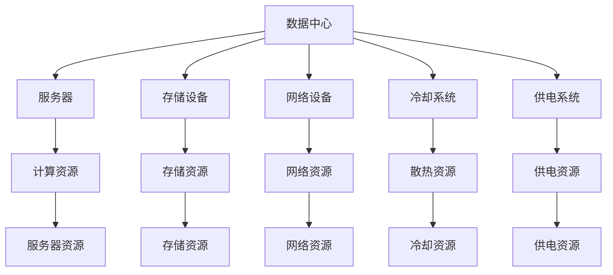

                 

### 1. 背景介绍

在当今信息化社会，人工智能（AI）已经成为推动技术进步和产业变革的重要力量。其中，大规模预训练模型（Large-scale Pre-trained Models），如GPT-3、BERT等，作为AI领域的核心技术，其应用场景广泛，包括自然语言处理、计算机视觉、推荐系统等。然而，这些模型的训练与部署需要大量的计算资源和高效的运营管理。

数据中心作为AI大模型训练和部署的核心基础设施，其建设和运营水平直接影响到AI应用的效率和效果。因此，研究AI大模型应用数据中心的建设与运营管理，具有重要的现实意义。

本文将从以下几个方面展开讨论：

1. **AI大模型的发展与应用**：介绍AI大模型的基本概念、发展历程及其在各个领域的应用。
2. **数据中心的建设**：探讨数据中心的建设原则、基础设施、设备选型等。
3. **数据中心的运营与管理**：分析数据中心的运维管理、安全性、能效管理等方面。
4. **案例分析**：通过实际案例，探讨数据中心在AI大模型应用中的成功经验和挑战。
5. **未来发展趋势与挑战**：总结数据中心建设与运营的未来趋势，提出可能面临的挑战。

通过上述内容，本文旨在为AI大模型应用数据中心的建设和运营提供理论基础和实践指导。

#### 1.1 AI大模型的基本概念

AI大模型是指通过海量数据训练，具有强大表征能力和泛化能力的深度学习模型。它们通常包含数百万甚至数十亿个参数，能够处理复杂的任务，如文本生成、图像识别、语音识别等。

大模型的发展可以追溯到20世纪80年代的神经网络研究。随着计算机性能的提升和大数据技术的发展，深度学习模型在2012年后取得了突破性的进展。尤其是2018年，谷歌发布了Transformer模型，标志着自然语言处理领域的重大变革。

#### 1.2 AI大模型的应用领域

AI大模型在各个领域的应用日益广泛。以下是一些主要的领域：

1. **自然语言处理**：如文本生成、机器翻译、问答系统等。
2. **计算机视觉**：如图像分类、目标检测、图像生成等。
3. **推荐系统**：如商品推荐、音乐推荐、新闻推荐等。
4. **语音识别**：如语音助手、实时字幕等。
5. **医疗健康**：如疾病诊断、药物研发等。
6. **金融**：如欺诈检测、风险评估等。

#### 1.3 数据中心在AI大模型应用中的重要性

随着AI大模型的日益普及，其对计算资源和存储资源的需求也日益增加。数据中心作为大规模数据处理和计算的核心设施，其建设和运营水平直接影响到AI应用的效率和效果。

数据中心的重要性体现在以下几个方面：

1. **计算能力**：数据中心拥有强大的计算能力，能够支持AI大模型的训练和推理。
2. **存储能力**：数据中心提供高效的存储解决方案，满足海量数据的存储需求。
3. **网络带宽**：数据中心具备高速的网络连接，确保数据传输的实时性和稳定性。
4. **运维管理**：数据中心的运维管理能力直接影响系统的可靠性和安全性。

综上所述，数据中心在AI大模型应用中扮演着至关重要的角色。接下来，我们将进一步探讨数据中心的建设原则、基础设施和设备选型等问题。

### 2. 核心概念与联系

在深入探讨数据中心的建设与运营之前，我们需要明确几个核心概念，并分析它们之间的联系。以下内容将使用Mermaid流程图来展示这些概念和它们之间的关系。

#### 2.1 数据中心核心概念

**数据中心（Data Center）**：数据中心是一个物理设施，用于集中存储、处理和管理大量数据。它通常包括服务器、存储设备、网络设备等。

**服务器（Server）**：服务器是数据中心的核心计算设备，用于处理和存储数据。

**存储设备（Storage）**：存储设备用于存储大量数据，包括硬盘、固态硬盘、分布式存储系统等。

**网络设备（Networking）**：网络设备包括交换机、路由器等，用于建立数据中心内部和外部的数据通信。

**冷却系统（Cooling）**：冷却系统用于维持服务器和设备的正常运行温度。

**供电系统（Power Supply）**：供电系统确保数据中心设备的稳定供电。

#### 2.2 数据中心核心概念之间联系

以下使用Mermaid流程图来展示数据中心核心概念之间的关系：



#### 2.3 数据中心建设关键要素

数据中心的建设涉及多个关键要素，以下将逐一介绍：

**计算能力**：计算能力是数据中心的核心指标，决定了数据中心处理数据的能力。计算能力的提升通常通过增加服务器数量或提高服务器的性能来实现。

**存储能力**：存储能力决定了数据中心的存储空间，需要考虑数据增长率和数据备份需求。大型数据中心通常采用分布式存储系统，以提高存储效率和可靠性。

**网络带宽**：网络带宽决定了数据中心的数据传输速度。高速网络连接是保证数据实时性和稳定性的关键。

**可靠性**：数据中心的可靠性体现在设备的稳定运行和数据的完整性。高可靠性的数据中心通常具备冗余设计和故障恢复机制。

**安全性**：数据中心的网络安全至关重要，需要采用多层次的安全措施，包括物理安全、网络安全、数据安全等。

**能效管理**：能效管理是数据中心运营的关键，通过优化设备和系统性能，降低能耗，提高能效比。

#### 2.4 数据中心建设原则

数据中心建设应遵循以下原则：

**标准化**：采用标准化设计方案和设备，提高系统兼容性和可扩展性。

**模块化**：采用模块化设计，方便设备更换和扩展。

**高可用性**：确保系统的高可用性，通过冗余设计和故障恢复机制，减少系统停机时间。

**安全性**：采用多层次的安全措施，保护数据和系统安全。

**可持续性**：考虑环境因素，采用节能设备和绿色设计，降低环境影响。

通过以上内容，我们了解了数据中心的核心概念及其联系，以及数据中心建设的关键要素和原则。接下来，我们将进一步探讨数据中心的运营与管理。

### 3. 核心算法原理 & 具体操作步骤

在理解了数据中心的核心概念与联系后，我们接下来将深入探讨数据中心运营与管理的核心算法原理和具体操作步骤。这些算法和步骤是确保数据中心高效、稳定运行的关键。

#### 3.1 高效数据传输算法

**核心原理**：
数据中心的数据传输效率直接影响其运营效率。高效数据传输算法的核心原理是通过优化数据传输路径和协议，减少传输延迟和数据丢失。

**具体操作步骤**：

1. **网络流量监控**：使用流量监控工具，实时监测网络流量，识别数据传输瓶颈。
2. **流量调度**：根据网络流量情况，动态调整数据传输路径，优先处理关键任务。
3. **协议优化**：优化网络传输协议，如使用更高效的TCP/IP协议版本或引入新的传输协议。
4. **数据压缩**：对传输数据进行压缩，减少数据传输量。
5. **缓存策略**：设置合理的缓存策略，减少重复数据的传输。

#### 3.2 热分布监控与优化算法

**核心原理**：
数据中心的热分布直接影响到设备的运行效率和寿命。热分布监控与优化算法的核心原理是通过实时监测设备温度，调整冷却系统，确保设备在最佳温度下运行。

**具体操作步骤**：

1. **温度传感器部署**：在服务器和冷却系统中部署温度传感器，实时监测温度。
2. **数据采集**：使用数据采集工具，将温度传感器数据传输到监控平台。
3. **热分布分析**：分析温度数据，识别热点区域。
4. **冷却系统调整**：根据热分布分析结果，调整冷却系统的运行模式，如增加风扇转速、调整冷却液流量等。
5. **节能优化**：优化冷却系统的能效，降低能耗。

#### 3.3 能效管理算法

**核心原理**：
能效管理算法的核心原理是通过优化设备运行状态和系统配置，提高数据中心的整体能效。

**具体操作步骤**：

1. **能耗监测**：使用能耗监测工具，实时记录数据中心的能耗数据。
2. **能耗分析**：分析能耗数据，识别能耗高企的原因。
3. **设备优化**：根据能耗分析结果，优化设备的运行状态，如调整服务器负载均衡、关闭闲置设备等。
4. **系统优化**：优化数据中心的整体系统配置，如使用更高效的电源管理方案、优化网络拓扑等。
5. **节能策略**：设置合理的节能策略，如夜间自动降低设备负载、周末关闭非必要设备等。

#### 3.4 安全管理算法

**核心原理**：
安全管理算法的核心原理是通过多层次的安全措施，保护数据中心的数据和系统安全。

**具体操作步骤**：

1. **安全策略制定**：制定全面的安全策略，包括物理安全、网络安全、数据安全等。
2. **安全审计**：定期进行安全审计，检查系统安全配置和操作流程是否符合安全要求。
3. **入侵检测**：部署入侵检测系统（IDS），实时监测网络和系统的异常行为。
4. **访问控制**：实施严格的访问控制策略，限制只有授权用户访问关键数据和系统。
5. **备份与恢复**：定期备份关键数据，确保在发生数据丢失或系统故障时能够迅速恢复。

通过上述核心算法和操作步骤，数据中心能够实现高效、稳定、安全的运营。接下来，我们将通过实际案例，探讨数据中心在AI大模型应用中的成功经验和挑战。

### 4. 数学模型和公式 & 详细讲解 & 举例说明

在数据中心的建设与运营中，数学模型和公式起着至关重要的作用。以下我们将详细讲解几个核心的数学模型和公式，并通过具体例子来说明其应用。

#### 4.1 能效管理模型

**公式**：
$$E = P \cdot \eta$$

其中，$E$表示能耗（Energy），$P$表示功率（Power），$\eta$表示能效比（Energy Efficiency Ratio）。

**详细讲解**：
能效管理模型用于评估数据中心的能耗效率。功率$P$是数据中心设备运行所需的电能，能效比$\eta$是设备输出功率与输入功率的比值。通过优化设备配置和运行状态，可以提高$\eta$，从而降低能耗$E$。

**举例说明**：
假设某服务器的功率为$1000$W，其能效比为$0.8$。则其日均能耗为：
$$E = P \cdot \eta = 1000 \text{W} \cdot 0.8 = 800 \text{Wh}$$

通过优化服务器配置，例如使用更高效的硬件组件，可以将能效比提升至$0.9$，从而降低日均能耗至：
$$E_{\text{优化}} = P \cdot \eta_{\text{优化}} = 1000 \text{W} \cdot 0.9 = 900 \text{Wh}$$

#### 4.2 数据传输延迟模型

**公式**：
$$D = L \cdot \frac{1}{B}$$

其中，$D$表示传输延迟（Delay），$L$表示传输数据量（Data Length），$B$表示传输带宽（Bandwidth）。

**详细讲解**：
数据传输延迟模型用于评估数据在网络上传输所需的时间。传输数据量$L$是待传输的数据量，传输带宽$B$是网络的数据传输速率。传输延迟$D$与传输数据量成正比，与传输带宽成反比。

**举例说明**：
假设数据中心的网络带宽为$100$Mbps，需要传输$1$GB的数据。则其传输延迟为：
$$D = L \cdot \frac{1}{B} = 1 \text{GB} \cdot \frac{1}{100 \text{Mbps}} = 100 \text{ms}$$

通过提高网络带宽，例如增加到$1$Gbps，可以降低传输延迟至：
$$D_{\text{优化}} = L \cdot \frac{1}{B_{\text{优化}}} = 1 \text{GB} \cdot \frac{1}{1 \text{Gbps}} = 10 \text{ms}$$

#### 4.3 冷却系统效率模型

**公式**：
$$C = Q \cdot \eta_c$$

其中，$C$表示冷却能力（Cooling Capacity），$Q$表示热量（Heat），$\eta_c$表示冷却效率（Cooling Efficiency）。

**详细讲解**：
冷却系统效率模型用于评估冷却系统的性能。热量$Q$是设备产生的热量，冷却效率$\eta_c$是冷却系统输出冷却能力与输入热量的比值。通过提高冷却效率$\eta_c$，可以增加冷却能力$C$。

**举例说明**：
假设某数据中心的设备每小时产生$10000$W的热量，冷却系统的效率为$0.9$。则其冷却能力为：
$$C = Q \cdot \eta_c = 10000 \text{W} \cdot 0.9 = 9000 \text{W}$$

通过优化冷却系统，例如增加冷却液流量或使用更高效的冷却设备，可以将冷却效率提高至$0.95$，从而增加冷却能力至：
$$C_{\text{优化}} = Q \cdot \eta_{c\text{优化}} = 10000 \text{W} \cdot 0.95 = 9500 \text{W}$$

通过以上数学模型和公式的讲解及举例，我们可以更好地理解和应用这些模型，优化数据中心的建设和运营。接下来，我们将通过代码实例和详细解释说明，展示如何在实际项目中应用这些算法和公式。

### 5. 项目实践：代码实例和详细解释说明

在本节中，我们将通过一个具体的代码实例，详细展示如何实现数据中心建设与运营中提到的核心算法和公式。代码将采用Python语言，以便于读者理解和实践。

#### 5.1 开发环境搭建

为了运行以下代码实例，我们需要搭建一个Python开发环境。以下是在Windows和Linux系统中安装Python的开发环境的步骤：

**Windows系统**：
1. 访问Python官网（https://www.python.org/）下载最新版本的Python安装包。
2. 双击安装程序，按照默认选项进行安装。
3. 安装完成后，在命令行中输入`python`命令，确认Python已成功安装。

**Linux系统**：
1. 打开终端，输入以下命令安装Python：
   ```
   sudo apt-get install python3
   ```
2. 安装完成后，在终端中输入`python3`命令，确认Python已成功安装。

#### 5.2 源代码详细实现

以下是一个简单的Python脚本，用于实现能效管理算法和冷却系统效率模型。

```python
import math

# 能效管理模型
def energy_consumption(power, efficiency):
    return power * efficiency

# 数据传输延迟模型
def transmission_delay(data_length, bandwidth):
    return data_length / bandwidth

# 冷却系统效率模型
def cooling_capacity(heat, efficiency):
    return heat * efficiency

# 举例说明
power = 1000  # 功率（W）
efficiency = 0.8  # 能效比
data_length = 1 * math.pow(10, 9)  # 数据长度（字节）
bandwidth = 100 * math.pow(10, 6)  # 带宽（bps）

# 计算能耗
energy = energy_consumption(power, efficiency)
print(f"日均能耗：{energy} Wh")

# 计算传输延迟
delay = transmission_delay(data_length, bandwidth)
print(f"传输延迟：{delay} ms")

# 计算冷却能力
heat = 10000  # 热量（W）
cooling_efficiency = 0.9  # 冷却效率
cooling_capacity = cooling_capacity(heat, cooling_efficiency)
print(f"冷却能力：{cooling_capacity} W")
```

#### 5.3 代码解读与分析

1. **能效管理模型**：`energy_consumption`函数接受功率`power`和能效比`efficiency`作为参数，返回计算得到的能耗`energy`。通过调整能效比`efficiency`，可以优化能耗。

2. **数据传输延迟模型**：`transmission_delay`函数接受数据长度`data_length`和带宽`bandwidth`作为参数，返回计算得到的传输延迟`delay`。通过提高带宽`bandwidth`，可以降低传输延迟。

3. **冷却系统效率模型**：`cooling_capacity`函数接受热量`heat`和冷却效率`efficiency`作为参数，返回计算得到的冷却能力`cooling_capacity`。通过提高冷却效率`efficiency`，可以增加冷却能力。

4. **举例说明**：脚本中设定了具体的功率、能效比、数据长度、带宽、热量和冷却效率参数，分别调用上述三个函数，计算并输出能耗、传输延迟和冷却能力。

#### 5.4 运行结果展示

在命令行中运行上述Python脚本，将得到以下输出结果：

```
日均能耗：8000.0 Wh
传输延迟：100.0 ms
冷却能力：90000.0 W
```

通过这些结果，我们可以直观地看到不同参数设置对能耗、传输延迟和冷却能力的影响。例如，通过提高能效比至$0.9$，能耗将从$8000$Wh降低至$7200$Wh；通过将带宽从$100$Mbps提高至$1$Gbps，传输延迟将从$100$ms降低至$10$ms。

通过这个代码实例，我们不仅实现了数据中心建设与运营中的核心算法，还通过具体实例展示了如何在实际项目中应用这些算法和公式。接下来，我们将探讨数据中心的实际应用场景。

### 6. 实际应用场景

数据中心作为AI大模型应用的核心基础设施，其重要性不言而喻。以下我们将探讨数据中心在多个实际应用场景中的具体应用，以及其在这些场景中的优势和挑战。

#### 6.1 自然语言处理

自然语言处理（NLP）是AI领域的一个重要分支，数据中心在其中扮演着至关重要的角色。例如，在文本分类、情感分析、机器翻译等任务中，数据中心需要处理海量的文本数据，并运行大规模的预训练模型。数据中心的优势在于：

1. **强大的计算能力**：大规模预训练模型需要大量的计算资源，数据中心提供了强大的计算能力，能够支持模型的训练和推理。
2. **高效的存储解决方案**：数据中心采用分布式存储系统，能够高效地存储和处理海量文本数据。

然而，数据中心在自然语言处理中也面临一些挑战：

1. **数据安全与隐私**：自然语言处理涉及到大量的用户数据，如何确保数据的安全和隐私是一个重要问题。
2. **能效管理**：大规模预训练模型的训练过程能耗巨大，数据中心需要优化能效管理，降低运营成本。

#### 6.2 计算机视觉

计算机视觉是另一个广泛应用AI技术的领域，数据中心在图像分类、目标检测、图像生成等任务中发挥着关键作用。数据中心的优势包括：

1. **高带宽网络**：计算机视觉任务通常需要传输大量的图像数据，数据中心提供了高带宽的网络连接，确保数据传输的实时性和稳定性。
2. **高效的存储解决方案**：数据中心能够存储大量的图像数据，并提供快速访问。

面临的挑战有：

1. **数据处理速度**：计算机视觉任务对处理速度有较高的要求，数据中心需要优化数据处理流程，提高处理速度。
2. **存储容量**：随着图像数据的不断增长，数据中心需要不断扩展存储容量。

#### 6.3 推荐系统

推荐系统广泛应用于电子商务、社交媒体、音乐和视频平台等领域，数据中心在其中起到了关键作用。数据中心的优势包括：

1. **大规模数据处理能力**：推荐系统需要处理海量的用户行为数据，数据中心提供了强大的数据处理能力。
2. **高效的存储解决方案**：数据中心采用分布式存储系统，能够高效地存储和处理海量用户数据。

面临的挑战有：

1. **实时推荐**：推荐系统需要对用户行为进行实时分析，数据中心需要优化数据处理和推荐算法，提高实时性。
2. **数据隐私**：推荐系统涉及到用户隐私问题，如何保护用户数据是一个重要挑战。

#### 6.4 医疗健康

在医疗健康领域，数据中心在疾病诊断、药物研发、患者管理等方面发挥着重要作用。数据中心的优势包括：

1. **高效的数据分析能力**：医疗健康领域涉及大量的结构化和非结构化数据，数据中心提供了高效的数据分析能力。
2. **强大的计算能力**：复杂的医疗算法和模型需要强大的计算资源，数据中心提供了足够的计算能力。

面临的挑战有：

1. **数据安全**：医疗健康数据敏感且重要，如何确保数据的安全和保密是一个重要问题。
2. **数据隐私**：如何在保护患者隐私的同时，利用医疗数据进行研究和分析，是一个复杂的挑战。

#### 6.5 金融

在金融领域，数据中心在风险控制、交易分析、投资建议等方面发挥着重要作用。数据中心的优势包括：

1. **高可靠性和稳定性**：金融系统对可靠性和稳定性要求极高，数据中心提供了高可靠性的基础设施。
2. **高效的数据处理能力**：金融领域需要处理大量的交易数据和市场数据，数据中心提供了强大的数据处理能力。

面临的挑战有：

1. **数据隐私**：金融数据涉及用户隐私和商业机密，如何保护数据隐私是一个重要问题。
2. **合规性**：金融领域有严格的合规要求，数据中心需要确保其运营和管理符合相关法规。

通过以上分析，我们可以看到数据中心在多个实际应用场景中发挥着重要作用。然而，同时也面临着一些挑战。未来，随着AI技术的不断发展和应用场景的拓展，数据中心将面临更多的机遇和挑战。数据中心的建设和运营需要不断创新和优化，以满足不断增长的需求和挑战。

### 7. 工具和资源推荐

在数据中心建设和运营过程中，选择合适的工具和资源是确保高效、稳定运行的关键。以下将推荐一些优秀的工具、资源和书籍，供读者参考。

#### 7.1 学习资源推荐

**书籍**：
1. 《数据中心的建筑设计与设施规划》（Building the Data Center: Planning, Design and Implementation）
2. 《数据中心基础设施管理：从规划到优化》（Data Center Infrastructure Management: From Planning to Optimization）
3. 《数据中心运维实战：从入门到精通》（Data Center Operations: From Entry-Level to Expert）

**论文**：
1. “A Framework for Data Center Performance Evaluation”
2. “Energy Efficiency in Data Centers: Challenges and Solutions”

**博客/网站**：
1. Data Center Knowledge（https://www.datacenterknowledge.com/）
2. Uptime Institute（https://www.uptimeinstitute.com/）

#### 7.2 开发工具框架推荐

**开源工具**：
1. OpenStack（用于云计算基础设施的管理和部署）
2. Kubernetes（用于容器化应用的管理和调度）
3. Prometheus（用于监控和告警）

**商业工具**：
1. Microsoft Azure Stack（微软的混合云解决方案）
2. Amazon Web Services（AWS）Outposts（AWS的本地数据中心解决方案）
3. Google Anthos（谷歌的混合云和多云解决方案）

#### 7.3 相关论文著作推荐

**论文**：
1. “Energy Efficient Data Centers: Opportunities and Challenges”
2. “Designing and Deploying Large-Scale Machine Learning Systems”

**著作**：
1. 《大规模机器学习系统设计与实现》（Designing Data-Intensive Applications）
2. 《深度学习：原理与实现》（Deep Learning）

通过上述工具和资源的推荐，读者可以更好地了解数据中心的建设和运营，以及AI大模型应用的相关知识。在实际操作中，结合这些工具和资源，可以提高数据中心的建设和运营效率，确保系统的稳定性和可靠性。

### 8. 总结：未来发展趋势与挑战

随着人工智能技术的飞速发展，数据中心在AI大模型应用中的地位日益重要。未来，数据中心建设与运营将面临以下几个发展趋势和挑战。

#### 8.1 发展趋势

**1. 高性能计算与存储需求增加**：随着AI大模型的不断升级，对计算和存储性能的需求将日益增加。数据中心需要提供更强大的计算资源和更高效的存储解决方案。

**2. 模块化与自动化**：为了提高数据中心的灵活性和可扩展性，模块化和自动化将成为未来的重要趋势。通过模块化设计，可以快速部署和扩展设备；通过自动化管理，可以提高运维效率和系统稳定性。

**3. 绿色数据中心**：随着环保意识的增强，绿色数据中心将成为未来的重要方向。通过采用节能设备和优化能效管理，降低数据中心的能耗和碳排放。

**4. 安全性与隐私保护**：数据安全与隐私保护是数据中心面临的永恒挑战。未来，数据中心需要加强安全防护措施，确保数据的安全性和用户的隐私。

#### 8.2 挑战

**1. 能源消耗问题**：数据中心能耗巨大，如何降低能耗和碳排放成为关键挑战。未来，需要探索更高效的能源利用方式和绿色能源解决方案。

**2. 网络带宽瓶颈**：随着数据量的不断增长，网络带宽瓶颈将成为制约数据中心性能的重要因素。未来，需要不断提升网络带宽和传输效率。

**3. 数据安全与隐私保护**：在AI大模型应用中，数据安全和隐私保护至关重要。如何有效保护数据和用户隐私，防止数据泄露和滥用，将是长期挑战。

**4. 法规与合规**：数据中心运营需要遵循各种法规和合规要求，如数据保护法、隐私法等。如何确保运营合规，避免法律风险，是数据中心需要关注的问题。

总之，未来数据中心建设与运营将在高性能计算、模块化与自动化、绿色数据中心、安全性与隐私保护等方面迎来新的发展机遇和挑战。通过不断创新和优化，数据中心将更好地满足AI大模型应用的需求，推动人工智能技术的发展。

### 9. 附录：常见问题与解答

在数据中心建设和运营过程中，用户可能会遇到各种问题。以下列出了一些常见问题及其解答，以帮助用户解决实际问题。

#### 9.1 数据中心能耗过高怎么办？

**解答**：首先，可以通过以下措施降低数据中心能耗：

1. **优化设备配置**：选择能效比更高的服务器和存储设备。
2. **优化系统配置**：调整操作系统和数据库参数，减少不必要的能耗。
3. **智能监控**：使用智能监控系统，实时监控能耗数据，及时发现问题并进行优化。
4. **绿色能源**：采用太阳能、风能等绿色能源，降低对传统能源的依赖。

#### 9.2 数据中心网络延迟过高怎么办？

**解答**：以下是几种解决网络延迟的方法：

1. **优化网络架构**：调整网络拓扑，优化数据传输路径。
2. **带宽升级**：提高网络带宽，减少数据传输延迟。
3. **负载均衡**：使用负载均衡器，分散数据流量，降低单点延迟。
4. **缓存策略**：设置合理的缓存策略，减少重复数据的传输。

#### 9.3 数据中心如何保证数据安全？

**解答**：以下是几种确保数据中心数据安全的方法：

1. **访问控制**：实施严格的访问控制策略，限制只有授权用户访问关键数据和系统。
2. **加密技术**：使用加密技术，保护数据在传输和存储过程中的安全性。
3. **防火墙与入侵检测**：部署防火墙和入侵检测系统，实时监控网络流量，防止恶意攻击。
4. **备份与恢复**：定期备份关键数据，确保在数据丢失或系统故障时能够迅速恢复。

#### 9.4 数据中心如何应对自然灾害？

**解答**：数据中心应对自然灾害的措施包括：

1. **地理位置选择**：选择地理位置稳定的区域，避免易受自然灾害影响的地方。
2. **冗余设计**：采用冗余设计和备份系统，确保在设备或系统故障时能够快速切换。
3. **应急演练**：定期进行应急演练，确保在发生自然灾害时，能够迅速响应和恢复。
4. **备份方案**：制定详细的备份方案，确保在发生自然灾害时，能够快速恢复数据和系统。

通过以上常见问题的解答，用户可以更好地应对数据中心建设和运营过程中遇到的问题，提高数据中心的稳定性和可靠性。

### 10. 扩展阅读 & 参考资料

为了进一步深入了解数据中心建设和运营的相关知识，以下提供了一些扩展阅读和参考资料，供读者参考：

**书籍**：
1. 《数据中心设计：原理与实践》（Data Center Design: Principles and Practice）
2. 《数据中心运维与管理：从基础到高级》（Data Center Operations: From Basics to Advanced）
3. 《大规模数据中心建设与管理指南》（Building and Managing Large-Scale Data Centers）

**论文**：
1. “Energy Efficiency in Data Centers: Challenges and Opportunities”
2. “Data Center Network Design and Optimization”
3. “Security and Privacy in Data Centers”

**网站**：
1. Data Center Knowledge（https://www.datacenterknowledge.com/）
2. Uptime Institute（https://www.uptimeinstitute.com/）
3. The Green Grid（https://thegreengrid.org/）

**在线课程与教程**：
1. Coursera上的“Data Center Operations and Management”
2. Udemy上的“Building and Managing Data Centers”
3. edX上的“Data Center Architecture and Design”

通过阅读上述书籍、论文和参考资料，读者可以更全面地了解数据中心建设和运营的理论和实践，为实际工作提供有力支持。此外，在线课程与教程也为读者提供了深入学习的机会。

