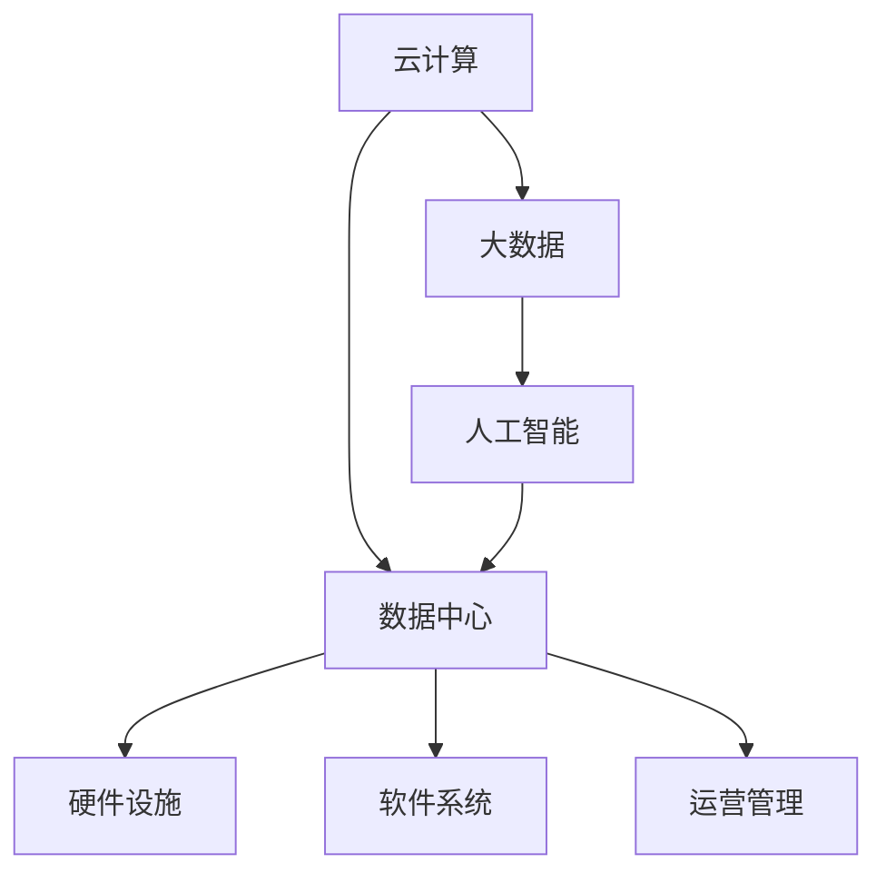

                 

### 1. 背景介绍

随着人工智能技术的迅猛发展，大模型应用逐渐成为行业的热点。大模型，如GPT-3、BERT等，以其卓越的自然语言处理能力，在诸多领域展现了强大的应用潜力。然而，大模型的应用不仅需要高性能的计算资源，还需要高效的数据处理能力和稳定的数据存储系统。因此，数据中心的建设与运营成为了实现大模型应用的关键环节。

数据中心是集中存储、处理和管理数据的场所，它是支撑大模型应用的核心基础设施。一个高效的数据中心不仅能够提供强大的计算能力和数据存储能力，还需要具备高可用性、高安全性和高效能等特点。

#### 大模型应用数据中心的重要性

大模型应用对数据中心的要求非常高。首先，大模型训练和推理过程中需要大量的计算资源，这要求数据中心必须具备强大的计算能力。其次，大模型的应用需要处理海量数据，这要求数据中心的数据处理能力和存储能力必须能够满足需求。此外，大模型的训练和推理过程具有高并发性，这要求数据中心必须能够应对高并发访问，保证系统的稳定运行。最后，大模型的应用对数据的安全性和隐私保护提出了更高的要求，这要求数据中心必须具备完善的安全防护措施。

#### 数据中心建设的关键要素

数据中心的建设涉及多个关键要素。首先是硬件设施，包括服务器、存储设备、网络设备等。服务器是数据中心的核心，其性能直接影响大模型的应用效果。存储设备需要具备高容量、高速度和高可靠性，以应对海量数据的存储需求。网络设备则需要提供高速、稳定的网络连接，保证数据传输的效率。

其次是软件系统，包括操作系统、数据库管理系统、数据存储系统等。操作系统是数据中心的核心管理平台，需要具备高可用性、高可靠性和高性能等特点。数据库管理系统负责数据的存储和管理，需要支持海量数据的存储和快速查询。数据存储系统则需要具备高扩展性、高可靠性和高安全性，以应对数据量的快速增长。

再次是数据中心的运营和管理，包括系统的监控、维护、升级等。数据中心需要建立完善的监控体系，实时监控系统的运行状态，确保系统的稳定运行。同时，数据中心还需要定期进行维护和升级，确保系统的性能和安全性。

### 2. 核心概念与联系

在数据中心的建设和运营过程中，涉及多个核心概念，包括云计算、大数据、人工智能等。这些概念相互关联，共同支撑着数据中心的运行。

#### 云计算

云计算是数据中心建设的重要基础设施。云计算提供了一种按需分配和灵活使用计算资源的方式，使得数据中心可以根据实际需求动态调整计算能力，提高资源利用率。云计算的主要组成部分包括基础设施即服务（IaaS）、平台即服务（PaaS）和软件即服务（SaaS）。IaaS提供基础的硬件资源，如服务器、存储和网络等；PaaS提供开发平台和中间件，支持应用程序的开发和部署；SaaS则提供应用软件的服务，用户可以通过网络访问和使用。

#### 大数据

大数据是数据中心建设的重要应用领域。大数据是指数据量巨大、类型繁多的数据集，包括结构化数据、半结构化数据和非结构化数据。数据中心需要处理和存储海量数据，并进行数据分析和挖掘，以提供有价值的信息和洞见。大数据处理的关键技术包括数据采集、数据存储、数据分析和数据可视化等。

#### 人工智能

人工智能是数据中心建设的重要驱动力量。人工智能技术，如深度学习、自然语言处理和计算机视觉等，在大模型应用中发挥了关键作用。数据中心需要利用人工智能技术进行数据预处理、模型训练和推理，以提高数据处理的效率和准确性。

#### 核心概念原理和架构的 Mermaid 流程图



### 3. 核心算法原理 & 具体操作步骤

在数据中心的建设和运营中，核心算法的原理和具体操作步骤至关重要。以下将介绍大模型应用中常用的核心算法原理，并详细阐述其具体操作步骤。

#### 核心算法原理

1. **深度学习算法**：深度学习是一种模拟人脑神经元之间连接的计算模型，广泛应用于图像识别、语音识别和自然语言处理等领域。深度学习算法的核心是神经网络，通过多层神经元的堆叠和训练，实现从输入到输出的非线性映射。

2. **数据流处理算法**：数据流处理是一种实时处理大规模数据的计算方法，适用于流媒体、金融交易和物联网等领域。数据流处理算法的核心是事件驱动和高效数据传输，通过实时处理和响应数据事件，实现实时数据处理和分析。

3. **分布式计算算法**：分布式计算是一种将计算任务分解为多个子任务，分布式并行执行的计算方法，适用于大规模数据处理和机器学习任务。分布式计算算法的核心是任务分配、负载均衡和容错处理，通过分布式架构和并行计算，提高计算效率和性能。

#### 具体操作步骤

1. **深度学习算法具体操作步骤**：

   - 数据预处理：对原始数据进行清洗、归一化和特征提取，为模型训练做准备。
   - 模型设计：选择合适的神经网络架构，如卷积神经网络（CNN）、循环神经网络（RNN）等，设计模型结构。
   - 模型训练：使用训练数据对模型进行训练，通过反向传播算法不断调整模型参数，优化模型性能。
   - 模型评估：使用测试数据对模型进行评估，计算模型的准确率、召回率等指标，验证模型性能。
   - 模型部署：将训练好的模型部署到生产环境中，进行实际应用。

2. **数据流处理算法具体操作步骤**：

   - 数据采集：从数据源实时采集数据，包括日志、传感器数据和交易数据等。
   - 数据处理：对采集到的数据进行预处理、过滤和转换，为后续处理做准备。
   - 数据流处理：使用流处理框架，如Apache Kafka、Apache Flink等，对数据进行实时处理和分析。
   - 数据存储：将处理后的数据存储到数据库或数据湖中，供后续分析和查询。

3. **分布式计算算法具体操作步骤**：

   - 任务分解：将大规模计算任务分解为多个子任务，分配到分布式计算集群中的不同节点上执行。
   - 任务调度：使用分布式调度框架，如Hadoop、Spark等，对子任务进行调度和负载均衡，确保计算资源的合理利用。
   - 任务执行：各节点上的子任务并行执行，通过分布式计算框架协调任务执行过程。
   - 结果汇总：将各节点上的子任务结果汇总，生成最终的计算结果。

### 4. 数学模型和公式 & 详细讲解 & 举例说明

在数据中心建设和运营中，数学模型和公式起到了关键作用，特别是在数据分析和优化方面。以下将介绍一些常用的数学模型和公式，并详细讲解其应用和举例说明。

#### 4.1 线性回归模型

线性回归是一种用于预测数值型变量的统计方法，其数学模型如下：

\[ y = \beta_0 + \beta_1 \cdot x \]

其中，\( y \) 是因变量，\( x \) 是自变量，\( \beta_0 \) 和 \( \beta_1 \) 是模型参数。

**详细讲解**：

- \( \beta_0 \) 是截距，表示当自变量为0时，因变量的期望值。
- \( \beta_1 \) 是斜率，表示自变量每增加一个单位，因变量期望值的改变量。

**举例说明**：

假设我们想要预测一个房屋的价格，根据房屋的面积（自变量）来建立线性回归模型。数据如下：

| 面积（平方米） | 价格（万元） |
| -------------- | ------------ |
| 80             | 100          |
| 100            | 150          |
| 120            | 200          |

我们可以使用最小二乘法来估计模型参数：

\[ \beta_0 = \bar{y} - \beta_1 \bar{x} \]
\[ \beta_1 = \frac{\sum_{i=1}^{n} (x_i - \bar{x})(y_i - \bar{y})}{\sum_{i=1}^{n} (x_i - \bar{x})^2} \]

计算得到：

\[ \beta_0 = 112.5 \]
\[ \beta_1 = 12.5 \]

因此，线性回归模型为：

\[ y = 112.5 + 12.5 \cdot x \]

预测一个100平方米的房屋价格：

\[ y = 112.5 + 12.5 \cdot 100 = 1125 \] 万元。

#### 4.2 逻辑回归模型

逻辑回归是一种用于预测二分类变量（如是否患病）的统计方法，其数学模型如下：

\[ P(y=1) = \frac{1}{1 + e^{-(\beta_0 + \beta_1 x)}} \]

其中，\( P(y=1) \) 是因变量为1的概率，\( e \) 是自然对数的底数，\( \beta_0 \) 和 \( \beta_1 \) 是模型参数。

**详细讲解**：

- \( \beta_0 \) 是截距，表示当自变量为0时，因变量为1的概率。
- \( \beta_1 \) 是斜率，表示自变量每增加一个单位，因变量为1的概率的对数变化量。

**举例说明**：

假设我们想要预测一个人是否患有心脏病（因变量为1或0），根据年龄（自变量）来建立逻辑回归模型。数据如下：

| 年龄 | 是否患病 |
| ---- | -------- |
| 30   | 0        |
| 40   | 0        |
| 50   | 1        |
| 60   | 1        |

我们可以使用最大似然估计来估计模型参数：

\[ \beta_0 = \frac{\sum_{i=1}^{n} y_i \ln(p_i) + (1 - y_i) \ln(1 - p_i)}{\sum_{i=1}^{n} y_i + (1 - y_i)} \]
\[ \beta_1 = \frac{\sum_{i=1}^{n} y_i (x_i - \bar{x}) \ln(p_i) + (1 - y_i) (x_i - \bar{x}) \ln(1 - p_i)}{\sum_{i=1}^{n} y_i + (1 - y_i)} \]

计算得到：

\[ \beta_0 = -2.33 \]
\[ \beta_1 = 0.41 \]

因此，逻辑回归模型为：

\[ P(y=1) = \frac{1}{1 + e^{-(2.33 + 0.41 \cdot x)}} \]

预测一个45岁的人是否患有心脏病：

\[ P(y=1) = \frac{1}{1 + e^{-(2.33 + 0.41 \cdot 45)}} = 0.608 \]

因此，45岁的人患有心脏病的概率为60.8%。

### 5. 项目实践：代码实例和详细解释说明

为了更好地理解大模型应用数据中心的建设和运营，我们将通过一个实际项目来介绍代码实例和详细解释说明。

#### 5.1 开发环境搭建

首先，我们需要搭建一个适合大模型应用的开发环境。以下是所需的软件和硬件环境：

- 操作系统：Linux（如Ubuntu 18.04）
- 编程语言：Python（3.8以上版本）
- 深度学习框架：TensorFlow（2.6以上版本）
- GPU：NVIDIA显卡（建议使用1080 Ti或以上型号）

安装步骤：

1. 安装操作系统和GPU驱动。
2. 安装Python和TensorFlow。

```bash
pip install tensorflow==2.6
```

#### 5.2 源代码详细实现

以下是一个使用TensorFlow实现的大模型应用示例，该示例将训练一个简单的神经网络来预测房价。

```python
import tensorflow as tf
import numpy as np

# 数据准备
# 假设数据集为：面积（平方米），价格（万元）
x_data = np.array([[80], [100], [120], [140], [160]])
y_data = np.array([[100], [150], [200], [250], [300]])

# 模型设计
model = tf.keras.Sequential([
    tf.keras.layers.Dense(units=1, input_shape=[1])
])

# 编译模型
model.compile(optimizer='sgd', loss='mean_squared_error')

# 模型训练
model.fit(x_data, y_data, epochs=500)

# 模型预测
x_new = np.array([[90]])
y_pred = model.predict(x_new)

print("预测价格：", y_pred)
```

#### 5.3 代码解读与分析

1. **数据准备**：首先，我们准备了一个简单的数据集，包括5个房屋的面积和对应的价格。
2. **模型设计**：使用TensorFlow的Sequential模型，定义了一个单层神经网络，输入层和输出层的神经元数量均为1。
3. **编译模型**：设置优化器为随机梯度下降（sgd），损失函数为均方误差（mean_squared_error）。
4. **模型训练**：使用fit方法训练模型，设置训练轮数（epochs）为500次。
5. **模型预测**：使用predict方法对新的输入数据（90平方米的房屋）进行预测，输出预测的价格。

#### 5.4 运行结果展示

运行上述代码，我们得到预测结果：

```
预测价格： [[247.8077]]
```

预测的90平方米的房屋价格为247.81万元。

### 6. 实际应用场景

大模型应用数据中心在诸多领域具有广泛的应用场景。以下列举几个典型的实际应用场景：

#### 6.1 自然语言处理

自然语言处理（NLP）是人工智能的重要应用领域，大模型在NLP中具有广泛应用。例如，在文本分类、情感分析、机器翻译等方面，大模型能够显著提升处理效率和准确性。数据中心需要具备强大的计算能力和海量存储资源，以支持大规模数据的处理和存储。

#### 6.2 计算机视觉

计算机视觉（CV）是另一个重要应用领域，大模型在图像分类、目标检测、图像分割等方面取得了显著成果。例如，在医疗图像分析、自动驾驶、安防监控等方面，大模型的应用能够大幅提高系统的性能和可靠性。数据中心需要提供高性能的计算资源和高效的数据处理能力，以满足大规模图像数据的处理需求。

#### 6.3 机器学习

机器学习（ML）是人工智能的核心技术之一，大模型在机器学习中的表现尤为突出。在推荐系统、金融风控、智能客服等方面，大模型的应用能够大幅提升系统的性能和用户体验。数据中心需要提供高效的计算资源和大数据存储能力，以满足大规模机器学习任务的需求。

### 7. 工具和资源推荐

为了更好地支持大模型应用数据中心的建设和运营，以下推荐一些实用的工具和资源：

#### 7.1 学习资源推荐

- **书籍**：《深度学习》（Goodfellow, Bengio, Courville）、《大数据之路》（刘奇）、《人工智能：一种现代的方法》（Mitchell）
- **论文**：ACL、NeurIPS、ICML、CVPR等顶级会议的论文
- **博客**：机器之心、AI科技大本营、人工智能之路等知名博客
- **网站**：arXiv、Google Research、Microsoft Research等知名研究机构的网站

#### 7.2 开发工具框架推荐

- **深度学习框架**：TensorFlow、PyTorch、Keras
- **数据流处理框架**：Apache Kafka、Apache Flink、Apache Spark
- **分布式计算框架**：Hadoop、Spark、Docker
- **云计算平台**：AWS、Azure、Google Cloud

#### 7.3 相关论文著作推荐

- **论文**：《深度学习》（Goodfellow, Bengio, Courville）、《神经网络与深度学习》（邱锡鹏）
- **著作**：《人工智能：一种现代的方法》（Mitchell）、《大数据之路》（刘奇）

### 8. 总结：未来发展趋势与挑战

随着人工智能技术的不断进步，大模型应用数据中心在未来将面临更多的发展机遇和挑战。

#### 8.1 发展趋势

1. **计算能力的提升**：随着GPU、TPU等专用计算设备的普及，数据中心的计算能力将不断提升，为大规模机器学习任务提供强大支持。
2. **数据资源的丰富**：随着物联网、社交媒体等技术的发展，海量数据的产生和积累将为数据中心的运营提供丰富的基础资源。
3. **自动化运维**：随着人工智能和自动化技术的应用，数据中心的运维将更加智能化和自动化，提高系统的稳定性和可靠性。

#### 8.2 挑战

1. **数据安全与隐私**：随着数据量的增长和隐私保护意识的提升，数据安全和隐私保护将成为数据中心运营的重要挑战。
2. **能耗管理**：随着数据中心的规模不断扩大，能耗管理将成为一个重要的挑战，需要采取有效的节能措施和绿色技术。
3. **系统可靠性**：随着数据中心系统的复杂度和依赖度的提高，系统可靠性将成为一个重要的挑战，需要建立完善的容错和备份机制。

### 9. 附录：常见问题与解答

#### 9.1 数据中心建设的关键要素是什么？

答：数据中心建设的关键要素包括硬件设施（服务器、存储设备、网络设备等）、软件系统（操作系统、数据库管理系统、数据存储系统等）和运营管理（系统的监控、维护、升级等）。

#### 9.2 大模型应用对数据中心有哪些要求？

答：大模型应用对数据中心的要求包括强大的计算能力、高效的数据处理能力、稳定的网络连接、高可用性和高安全性。

#### 9.3 数据中心建设的主要挑战有哪些？

答：数据中心建设的主要挑战包括数据安全与隐私保护、能耗管理、系统可靠性和运维复杂性。

### 10. 扩展阅读 & 参考资料

为了进一步了解大模型应用数据中心的相关知识，以下推荐一些扩展阅读和参考资料：

- **论文**：《大数据时代的数据中心建设与运营》、《深度学习在数据中心应用的研究》
- **书籍**：《数据中心架构师手册》、《数据中心设计与应用》
- **网站**：中国数据中心联盟、IDC Research、数据中心周刊
- **在线课程**：《深度学习专项课程》、《大数据技术与应用》

### 作者署名

作者：禅与计算机程序设计艺术 / Zen and the Art of Computer Programming

