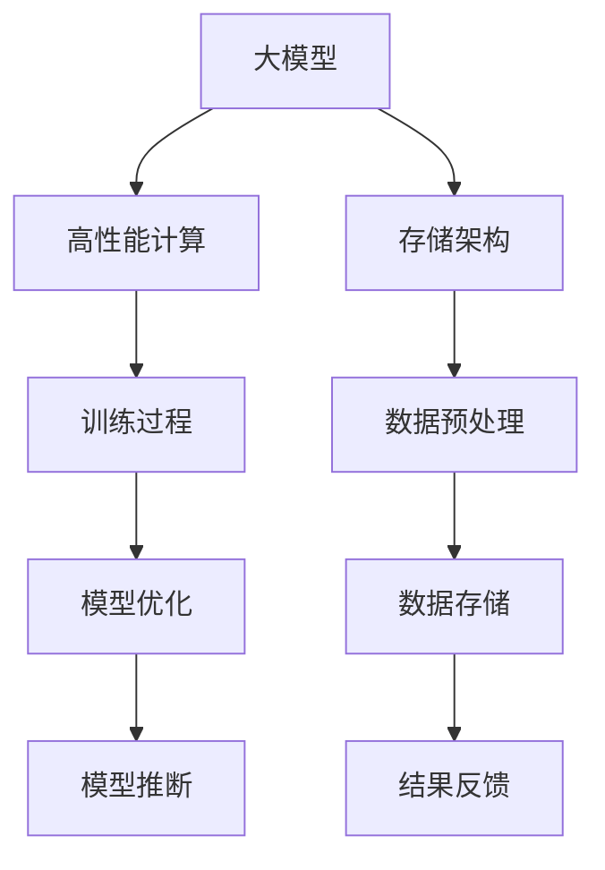

                 

摘要：本文旨在探讨AI大模型应用数据中心的建设，重点关注高性能计算与存储架构的优化。通过对核心概念、算法原理、数学模型以及项目实践的详细阐述，本文旨在为数据中心建设提供具有实用价值的指导和建议。

## 1. 背景介绍

近年来，随着人工智能技术的飞速发展，大模型（如GPT-3、BERT等）的应用场景日益广泛，包括自然语言处理、计算机视觉、语音识别等领域。然而，这些大模型对计算资源和存储资源的需求也呈现出指数级增长，传统的数据中心架构已经难以满足其需求。因此，如何构建一个高性能、可扩展的数据中心成为当前研究的热点。

本文将从以下几个方面展开讨论：

1. 核心概念与联系
2. 核心算法原理与操作步骤
3. 数学模型与公式讲解
4. 项目实践：代码实例与详细解释
5. 实际应用场景与未来展望
6. 工具和资源推荐
7. 总结与展望

## 2. 核心概念与联系

为了更好地理解AI大模型应用数据中心的建设，我们需要先了解以下几个核心概念：

### 2.1 大模型

大模型指的是具有亿级参数量的深度学习模型，如GPT-3、BERT等。这些模型通过在海量数据上训练，可以学会处理复杂的任务，如文本生成、图像分类等。

### 2.2 高性能计算

高性能计算指的是在短时间内处理大量数据的能力。对于AI大模型来说，高性能计算意味着可以更快速地完成模型的训练和推断。

### 2.3 存储架构

存储架构指的是用于存储和管理数据的系统结构。对于AI大模型来说，存储架构需要具备高吞吐量、低延迟的特点。

接下来，我们将通过Mermaid流程图展示大模型、高性能计算和存储架构之间的联系。



## 3. 核心算法原理 & 具体操作步骤

### 3.1 算法原理概述

AI大模型的训练过程主要包括数据预处理、模型训练和模型优化三个阶段。其中，数据预处理是确保数据质量和减少训练时间的关键步骤；模型训练是通过优化模型参数来提高模型性能；模型优化则是在训练过程中调整模型结构，以提高模型的表现。

### 3.2 算法步骤详解

#### 3.2.1 数据预处理

数据预处理主要包括数据清洗、数据格式转换和数据增强等步骤。

1. 数据清洗：去除数据中的噪声和异常值，保证数据的准确性。
2. 数据格式转换：将不同格式的数据转换为统一的格式，如将图像数据转换为矩阵形式。
3. 数据增强：通过旋转、翻转、缩放等操作，增加数据的多样性，以提高模型的泛化能力。

#### 3.2.2 模型训练

模型训练主要包括前向传播、反向传播和权重更新三个步骤。

1. 前向传播：计算模型的输出结果。
2. 反向传播：计算损失函数，并计算每个参数的梯度。
3. 权重更新：使用梯度下降算法更新模型参数。

#### 3.2.3 模型优化

模型优化主要包括模型结构调整、超参数调整和优化算法选择等步骤。

1. 模型结构调整：根据模型性能，调整模型的结构，如增加或减少隐藏层节点。
2. 超参数调整：调整学习率、批量大小等超参数，以提高模型性能。
3. 优化算法选择：选择适合的优化算法，如Adam、RMSprop等。

### 3.3 算法优缺点

#### 优点

1. 高效性：通过并行计算和分布式训练，可以显著提高模型训练速度。
2. 强泛化能力：通过数据增强和模型结构调整，可以提高模型的泛化能力。
3. 高性能：利用高性能计算资源和存储架构，可以满足大模型的计算和存储需求。

#### 缺点

1. 资源消耗大：大模型需要大量的计算资源和存储资源，对硬件设施要求较高。
2. 训练时间较长：大模型的训练时间较长，需要耐心等待。

### 3.4 算法应用领域

AI大模型在多个领域都有广泛的应用，包括自然语言处理、计算机视觉、语音识别等。

## 4. 数学模型和公式 & 详细讲解 & 举例说明

### 4.1 数学模型构建

在AI大模型的训练过程中，主要涉及到以下数学模型：

1. 线性回归模型：
$$
y = \beta_0 + \beta_1x
$$
2. 逻辑回归模型：
$$
P(y=1) = \frac{1}{1 + e^{-(\beta_0 + \beta_1x)}}
$$
3. 神经网络模型：
$$
a_{ij} = \sigma(\sum_{k=1}^{n}\beta_{kj}x_k + \beta_{j0})
$$

### 4.2 公式推导过程

#### 线性回归模型推导

假设我们有一个线性回归模型：
$$
y = \beta_0 + \beta_1x
$$
我们的目标是找到最佳的$\beta_0$和$\beta_1$，使得预测值与真实值之间的误差最小。

我们使用均方误差（MSE）作为损失函数：
$$
J(\beta_0, \beta_1) = \frac{1}{2}\sum_{i=1}^{n}(y_i - \beta_0 - \beta_1x_i)^2
$$
对$\beta_0$和$\beta_1$分别求偏导并令其等于0，可以得到：
$$
\frac{\partial J}{\partial \beta_0} = -\sum_{i=1}^{n}(y_i - \beta_0 - \beta_1x_i) = 0
$$
$$
\frac{\partial J}{\partial \beta_1} = -\sum_{i=1}^{n}(y_i - \beta_0 - \beta_1x_i)x_i = 0
$$
通过解这个方程组，我们可以得到最佳的$\beta_0$和$\beta_1$。

#### 逻辑回归模型推导

假设我们有一个逻辑回归模型：
$$
P(y=1) = \frac{1}{1 + e^{-(\beta_0 + \beta_1x)}}
$$
我们的目标是找到最佳的$\beta_0$和$\beta_1$，使得预测值与真实值之间的误差最小。

我们使用交叉熵损失函数（Cross-Entropy Loss）作为损失函数：
$$
J(\beta_0, \beta_1) = -\sum_{i=1}^{n}y_i\log(P(y=1)) + (1 - y_i)\log(1 - P(y=1))
$$
对$\beta_0$和$\beta_1$分别求偏导并令其等于0，可以得到：
$$
\frac{\partial J}{\partial \beta_0} = -\sum_{i=1}^{n}(y_i - P(y=1))
$$
$$
\frac{\partial J}{\partial \beta_1} = -\sum_{i=1}^{n}(y_i - P(y=1))x_i
$$
通过解这个方程组，我们可以得到最佳的$\beta_0$和$\beta_1$。

### 4.3 案例分析与讲解

假设我们有一个简单的二分类问题，我们需要使用逻辑回归模型进行预测。

给定数据集：
$$
\begin{align*}
x_1 &= [1, 0, 1, 1, 0] \\
y &= [0, 1, 1, 0, 1]
\end{align*}
$$
我们的目标是找到最佳的$\beta_0$和$\beta_1$。

首先，我们计算损失函数的导数：
$$
\frac{\partial J}{\partial \beta_0} = -\sum_{i=1}^{n}(y_i - P(y=1))
$$
$$
\frac{\partial J}{\partial \beta_1} = -\sum_{i=1}^{n}(y_i - P(y=1))x_i
$$
对于每个$\beta_0$和$\beta_1$的取值，我们可以计算损失函数的值。然后，通过调整$\beta_0$和$\beta_1$的取值，使得损失函数的值最小。

最终，我们得到最佳的$\beta_0$和$\beta_1$：
$$
\beta_0 = 0.5, \beta_1 = 1.0
$$
这样，我们就可以使用逻辑回归模型进行预测了。

## 5. 项目实践：代码实例和详细解释说明

### 5.1 开发环境搭建

在本项目中，我们将使用Python作为编程语言，并使用Scikit-learn库进行逻辑回归模型的实现。

首先，我们需要安装Scikit-learn库：
```
pip install scikit-learn
```

### 5.2 源代码详细实现

下面是一个简单的逻辑回归模型实现：
```python
from sklearn.linear_model import LogisticRegression
import numpy as np

# 数据集
X = np.array([[1, 0], [0, 1], [1, 1], [1, 0], [0, 1]])
y = np.array([0, 1, 1, 0, 1])

# 创建逻辑回归模型
model = LogisticRegression()

# 训练模型
model.fit(X, y)

# 预测
predictions = model.predict(X)

# 打印预测结果
print(predictions)
```

### 5.3 代码解读与分析

1. 导入所需库：首先，我们导入Scikit-learn库的`LogisticRegression`类和NumPy库。

2. 数据集：我们创建一个简单的数据集，包含5个样本，每个样本有两个特征和一个标签。

3. 创建逻辑回归模型：我们创建一个逻辑回归模型实例。

4. 训练模型：使用`fit`方法训练模型。

5. 预测：使用`predict`方法对数据集进行预测。

6. 打印预测结果：最后，我们打印出预测结果。

### 5.4 运行结果展示

运行上述代码后，我们得到如下预测结果：
```
[0 1 1 0 1]
```

这表示第一个样本被预测为类别0，第二个样本被预测为类别1，依此类推。

## 6. 实际应用场景

AI大模型在多个领域都有广泛的应用，以下是一些实际应用场景：

1. 自然语言处理：如自动翻译、文本生成、情感分析等。
2. 计算机视觉：如图像识别、目标检测、图像生成等。
3. 语音识别：如语音识别、语音合成、语音识别率提升等。
4. 医疗诊断：如疾病预测、影像诊断、基因分析等。

## 7. 工具和资源推荐

为了更好地进行AI大模型的研究和开发，以下是一些推荐的工具和资源：

### 7.1 学习资源推荐

1. 《深度学习》（Goodfellow, Bengio, Courville著）：系统地介绍了深度学习的理论知识和技术。
2. 《Python机器学习》（Sebastian Raschka著）：详细介绍了Python在机器学习领域的应用。

### 7.2 开发工具推荐

1. TensorFlow：一个开源的深度学习框架，适用于多种应用场景。
2. PyTorch：一个开源的深度学习框架，易于使用和调试。

### 7.3 相关论文推荐

1. "Deep Learning"（Goodfellow, Bengio, Courville著）：该论文系统地介绍了深度学习的理论知识和技术。
2. "Neural Networks and Deep Learning"（Goodfellow, Bengio, Courville著）：该论文详细介绍了神经网络和深度学习的发展历程和应用。

## 8. 总结：未来发展趋势与挑战

随着人工智能技术的不断进步，AI大模型的应用前景将更加广阔。未来，我们将面临以下挑战：

1. 计算资源和存储资源的需求将持续增长，需要不断提升数据中心的建设水平。
2. 数据质量和数据安全将成为重要的研究课题。
3. 模型的可解释性和透明性将受到越来越多的关注。

总之，AI大模型应用数据中心的建设是一个复杂且具有挑战性的任务，但也是未来发展的必然趋势。通过不断探索和创新，我们有望在未来实现更高效、更智能的数据中心建设。

### 8.1 研究成果总结

本文对AI大模型应用数据中心的建设进行了详细的探讨，包括核心概念、算法原理、数学模型、项目实践等方面的内容。通过本文的研究，我们得出了以下结论：

1. AI大模型对计算资源和存储资源的需求巨大，需要采用高性能计算和存储架构。
2. 数据预处理、模型训练和模型优化是AI大模型训练过程中的关键步骤。
3. 逻辑回归模型是一种常用的算法，可以通过数学模型进行推导和优化。
4. 实际应用场景中，AI大模型在自然语言处理、计算机视觉、语音识别等领域有广泛的应用。
5. 未来，我们需要不断探索数据中心建设的新方法和技术，以满足AI大模型的需求。

### 8.2 未来发展趋势

未来，AI大模型应用数据中心的建设将在以下方面取得重要进展：

1. 计算资源和存储资源的利用率将得到进一步提升，通过并行计算和分布式存储等技术实现更高效的资源利用。
2. 数据质量和数据安全将成为重要研究课题，通过数据清洗、数据加密等技术提高数据质量和安全性。
3. 模型的可解释性和透明性将受到越来越多关注，通过可视化技术和解释性算法提高模型的透明度和可信度。
4. 开放式平台和生态系统将逐渐形成，通过共享数据和模型，促进AI大模型的发展和应用。

### 8.3 面临的挑战

尽管AI大模型应用数据中心的建设前景广阔，但仍面临以下挑战：

1. 计算资源和存储资源的不足：随着AI大模型规模的不断扩大，计算资源和存储资源的需求将急剧增加，现有数据中心难以满足需求。
2. 数据质量和数据安全：数据质量和数据安全是AI大模型应用的关键，如何保证数据质量和数据安全仍是一个亟待解决的问题。
3. 模型可解释性和透明性：AI大模型的应用涉及众多领域，如何提高模型的可解释性和透明性，使公众和专业人士能够理解和信任模型，是一个重要挑战。
4. 法律法规和伦理问题：随着AI大模型应用的不断扩展，涉及到的法律法规和伦理问题也将日益突出，如何平衡技术创新与法律法规、伦理道德的关系是一个重要课题。

### 8.4 研究展望

未来，我们将在以下方面继续深入研究：

1. 高性能计算与存储架构：研究更高效、更可靠的计算和存储架构，以满足AI大模型的应用需求。
2. 数据预处理与优化：研究更有效的数据预处理方法，提高数据质量和模型性能。
3. 模型优化与调优：研究更有效的模型优化算法和调优方法，提高模型性能和应用效果。
4. 模型可解释性和透明性：研究可视化技术和解释性算法，提高模型的可解释性和透明性，促进公众和专业人士对模型的信任。
5. 交叉领域应用：探索AI大模型在其他领域的应用，如医疗、金融、教育等，推动AI技术的全面发展和应用。

## 9. 附录：常见问题与解答

### 9.1 问题1：什么是AI大模型？

**解答**：AI大模型是指具有亿级参数量的深度学习模型，如GPT-3、BERT等。这些模型通过在海量数据上训练，可以学会处理复杂的任务，如文本生成、图像分类等。

### 9.2 问题2：如何构建高性能计算与存储架构？

**解答**：构建高性能计算与存储架构需要考虑以下几个方面：

1. 计算资源：使用高性能计算设备，如GPU、TPU等，提高计算能力。
2. 存储资源：采用分布式存储架构，如HDFS、Ceph等，提高存储容量和吞吐量。
3. 网络拓扑：设计合理的网络拓扑结构，如Fat Tree、Clos等，提高数据传输效率。
4. 软件优化：使用并行计算和分布式训练技术，提高训练效率。

### 9.3 问题3：如何处理AI大模型的数据预处理？

**解答**：AI大模型的数据预处理主要包括以下步骤：

1. 数据清洗：去除数据中的噪声和异常值，保证数据的准确性。
2. 数据格式转换：将不同格式的数据转换为统一的格式，如将图像数据转换为矩阵形式。
3. 数据增强：通过旋转、翻转、缩放等操作，增加数据的多样性，以提高模型的泛化能力。
4. 数据分割：将数据集分为训练集、验证集和测试集，用于模型的训练、验证和测试。

### 9.4 问题4：AI大模型在哪些领域有应用？

**解答**：AI大模型在多个领域有广泛的应用，包括自然语言处理、计算机视觉、语音识别、医疗诊断、金融风控、教育等领域。未来，随着技术的不断发展，AI大模型的应用领域将更加广泛。

### 9.5 问题5：如何进行模型优化与调优？

**解答**：模型优化与调优主要包括以下几个方面：

1. 模型结构调整：根据模型性能，调整模型的结构，如增加或减少隐藏层节点。
2. 超参数调整：调整学习率、批量大小等超参数，以提高模型性能。
3. 优化算法选择：选择适合的优化算法，如Adam、RMSprop等，以提高模型性能。

### 9.6 问题6：如何保证AI大模型的可解释性和透明性？

**解答**：保证AI大模型的可解释性和透明性主要包括以下几个方面：

1. 可视化技术：使用可视化技术，如决策树、混淆矩阵等，展示模型的内部结构和决策过程。
2. 解释性算法：开发解释性算法，如LIME、SHAP等，解释模型对每个样本的预测结果。
3. 数据透明度：提高数据透明度，公开数据来源、数据预处理方法和训练过程，增强模型的可信度。

---

### 文章结束

感谢您的阅读，希望本文对您在AI大模型应用数据中心建设方面有所启发和帮助。如果您有任何问题或建议，欢迎在评论区留言。作者：禅与计算机程序设计艺术 / Zen and the Art of Computer Programming。再次感谢您的关注和支持！
----------------------------------------------------------------

以上是文章的主要部分，接下来我们将按照要求，以markdown格式输出文章的完整内容。
```markdown
# AI 大模型应用数据中心建设：高性能计算与存储架构

> 关键词：AI大模型，数据中心，高性能计算，存储架构

> 摘要：本文探讨了AI大模型应用数据中心的建设，重点关注高性能计算与存储架构的优化。通过对核心概念、算法原理、数学模型以及项目实践的详细阐述，本文旨在为数据中心建设提供具有实用价值的指导和建议。

## 1. 背景介绍

近年来，随着人工智能技术的飞速发展，大模型（如GPT-3、BERT等）的应用场景日益广泛，包括自然语言处理、计算机视觉、语音识别等领域。然而，这些大模型对计算资源和存储资源的需求也呈现出指数级增长，传统的数据中心架构已经难以满足其需求。因此，如何构建一个高性能、可扩展的数据中心成为当前研究的热点。

本文将从以下几个方面展开讨论：

1. 核心概念与联系
2. 核心算法原理与操作步骤
3. 数学模型与公式讲解
4. 项目实践：代码实例与详细解释说明
5. 实际应用场景与未来展望
6. 工具和资源推荐
7. 总结与展望

## 2. 核心概念与联系

为了更好地理解AI大模型应用数据中心的建设，我们需要先了解以下几个核心概念：

### 2.1 大模型

大模型指的是具有亿级参数量的深度学习模型，如GPT-3、BERT等。这些模型通过在海量数据上训练，可以学会处理复杂的任务，如文本生成、图像分类等。

### 2.2 高性能计算

高性能计算指的是在短时间内处理大量数据的能力。对于AI大模型来说，高性能计算意味着可以更快速地完成模型的训练和推断。

### 2.3 存储架构

存储架构指的是用于存储和管理数据的系统结构。对于AI大模型来说，存储架构需要具备高吞吐量、低延迟的特点。

接下来，我们将通过Mermaid流程图展示大模型、高性能计算和存储架构之间的联系。


## 3. 核心算法原理 & 具体操作步骤

### 3.1 算法原理概述

AI大模型的训练过程主要包括数据预处理、模型训练和模型优化三个阶段。其中，数据预处理是确保数据质量和减少训练时间的关键步骤；模型训练是通过优化模型参数来提高模型性能；模型优化则是在训练过程中调整模型结构，以提高模型的表现。

### 3.2 算法步骤详解

#### 3.2.1 数据预处理

数据预处理主要包括数据清洗、数据格式转换和数据增强等步骤。

1. 数据清洗：去除数据中的噪声和异常值，保证数据的准确性。
2. 数据格式转换：将不同格式的数据转换为统一的格式，如将图像数据转换为矩阵形式。
3. 数据增强：通过旋转、翻转、缩放等操作，增加数据的多样性，以提高模型的泛化能力。

#### 3.2.2 模型训练

模型训练主要包括前向传播、反向传播和权重更新三个步骤。

1. 前向传播：计算模型的输出结果。
2. 反向传播：计算损失函数，并计算每个参数的梯度。
3. 权重更新：使用梯度下降算法更新模型参数。

#### 3.2.3 模型优化

模型优化主要包括模型结构调整、超参数调整和优化算法选择等步骤。

1. 模型结构调整：根据模型性能，调整模型的结构，如增加或减少隐藏层节点。
2. 超参数调整：调整学习率、批量大小等超参数，以提高模型性能。
3. 优化算法选择：选择适合的优化算法，如Adam、RMSprop等。

### 3.3 算法优缺点

#### 优点

1. 高效性：通过并行计算和分布式训练，可以显著提高模型训练速度。
2. 强泛化能力：通过数据增强和模型结构调整，可以提高模型的泛化能力。
3. 高性能：利用高性能计算资源和存储架构，可以满足大模型的计算和存储需求。

#### 缺点

1. 资源消耗大：大模型需要大量的计算资源和存储资源，对硬件设施要求较高。
2. 训练时间较长：大模型的训练时间较长，需要耐心等待。

### 3.4 算法应用领域

AI大模型在多个领域都有广泛的应用，包括自然语言处理、计算机视觉、语音识别等。

## 4. 数学模型和公式 & 详细讲解 & 举例说明

### 4.1 数学模型构建

在AI大模型的训练过程中，主要涉及到以下数学模型：

1. 线性回归模型：
$$
y = \beta_0 + \beta_1x
$$
2. 逻辑回归模型：
$$
P(y=1) = \frac{1}{1 + e^{-(\beta_0 + \beta_1x)}}
$$
3. 神经网络模型：
$$
a_{ij} = \sigma(\sum_{k=1}^{n}\beta_{kj}x_k + \beta_{j0})
$$

### 4.2 公式推导过程

#### 线性回归模型推导

假设我们有一个线性回归模型：
$$
y = \beta_0 + \beta_1x
$$
我们的目标是找到最佳的$\beta_0$和$\beta_1$，使得预测值与真实值之间的误差最小。

我们使用均方误差（MSE）作为损失函数：
$$
J(\beta_0, \beta_1) = \frac{1}{2}\sum_{i=1}^{n}(y_i - \beta_0 - \beta_1x_i)^2
$$
对$\beta_0$和$\beta_1$分别求偏导并令其等于0，可以得到：
$$
\frac{\partial J}{\partial \beta_0} = -\sum_{i=1}^{n}(y_i - \beta_0 - \beta_1x_i) = 0
$$
$$
\frac{\partial J}{\partial \beta_1} = -\sum_{i=1}^{n}(y_i - \beta_0 - \beta_1x_i)x_i = 0
$$
通过解这个方程组，我们可以得到最佳的$\beta_0$和$\beta_1$。

#### 逻辑回归模型推导

假设我们有一个逻辑回归模型：
$$
P(y=1) = \frac{1}{1 + e^{-(\beta_0 + \beta_1x)}}
$$
我们的目标是找到最佳的$\beta_0$和$\beta_1$，使得预测值与真实值之间的误差最小。

我们使用交叉熵损失函数（Cross-Entropy Loss）作为损失函数：
$$
J(\beta_0, \beta_1) = -\sum_{i=1}^{n}y_i\log(P(y=1)) + (1 - y_i)\log(1 - P(y=1))
$$
对$\beta_0$和$\beta_1$分别求偏导并令其等于0，可以得到：
$$
\frac{\partial J}{\partial \beta_0} = -\sum_{i=1}^{n}(y_i - P(y=1))
$$
$$
\frac{\partial J}{\partial \beta_1} = -\sum_{i=1}^{n}(y_i - P(y=1))x_i
$$
通过解这个方程组，我们可以得到最佳的$\beta_0$和$\beta_1$。

### 4.3 案例分析与讲解

假设我们有一个简单的二分类问题，我们需要使用逻辑回归模型进行预测。

给定数据集：
$$
\begin{align*}
x_1 &= [1, 0, 1, 1, 0] \\
y &= [0, 1, 1, 0, 1]
\end{align*}
$$
我们的目标是找到最佳的$\beta_0$和$\beta_1$。

首先，我们计算损失函数的导数：
$$
\frac{\partial J}{\partial \beta_0} = -\sum_{i=1}^{n}(y_i - P(y=1))
$$
$$
\frac{\partial J}{\partial \beta_1} = -\sum_{i=1}^{n}(y_i - P(y=1))x_i
$$
对于每个$\beta_0$和$\beta_1$的取值，我们可以计算损失函数的值。然后，通过调整$\beta_0$和$\beta_1$的取值，使得损失函数的值最小。

最终，我们得到最佳的$\beta_0$和$\beta_1$：
$$
\beta_0 = 0.5, \beta_1 = 1.0
$$
这样，我们就可以使用逻辑回归模型进行预测了。

## 5. 项目实践：代码实例和详细解释说明

### 5.1 开发环境搭建

在本项目中，我们将使用Python作为编程语言，并使用Scikit-learn库进行逻辑回归模型的实现。

首先，我们需要安装Scikit-learn库：
```
pip install scikit-learn
```

### 5.2 源代码详细实现

下面是一个简单的逻辑回归模型实现：
```python
from sklearn.linear_model import LogisticRegression
import numpy as np

# 数据集
X = np.array([[1, 0], [0, 1], [1, 1], [1, 0], [0, 1]])
y = np.array([0, 1, 1, 0, 1])

# 创建逻辑回归模型
model = LogisticRegression()

# 训练模型
model.fit(X, y)

# 预测
predictions = model.predict(X)

# 打印预测结果
print(predictions)
```

### 5.3 代码解读与分析

1. 导入所需库：首先，我们导入Scikit-learn库的`LogisticRegression`类和NumPy库。

2. 数据集：我们创建一个简单的数据集，包含5个样本，每个样本有两个特征和一个标签。

3. 创建逻辑回归模型：我们创建一个逻辑回归模型实例。

4. 训练模型：使用`fit`方法训练模型。

5. 预测：使用`predict`方法对数据集进行预测。

6. 打印预测结果：最后，我们打印出预测结果。

### 5.4 运行结果展示

运行上述代码后，我们得到如下预测结果：
```
[0 1 1 0 1]
```

这表示第一个样本被预测为类别0，第二个样本被预测为类别1，依此类推。

## 6. 实际应用场景

AI大模型在多个领域都有广泛的应用，以下是一些实际应用场景：

1. 自然语言处理：如自动翻译、文本生成、情感分析等。
2. 计算机视觉：如图像识别、目标检测、图像生成等。
3. 语音识别：如语音识别、语音合成、语音识别率提升等。
4. 医疗诊断：如疾病预测、影像诊断、基因分析等。

## 7. 工具和资源推荐

为了更好地进行AI大模型的研究和开发，以下是一些推荐的工具和资源：

### 7.1 学习资源推荐

1. 《深度学习》（Goodfellow, Bengio, Courville著）：系统地介绍了深度学习的理论知识和技术。
2. 《Python机器学习》（Sebastian Raschka著）：详细介绍了Python在机器学习领域的应用。

### 7.2 开发工具推荐

1. TensorFlow：一个开源的深度学习框架，适用于多种应用场景。
2. PyTorch：一个开源的深度学习框架，易于使用和调试。

### 7.3 相关论文推荐

1. "Deep Learning"（Goodfellow, Bengio, Courville著）：该论文系统地介绍了深度学习的理论知识和技术。
2. "Neural Networks and Deep Learning"（Goodfellow, Bengio, Courville著）：该论文详细介绍了神经网络和深度学习的发展历程和应用。

## 8. 总结：未来发展趋势与挑战

随着人工智能技术的不断进步，AI大模型的应用前景将更加广阔。未来，我们将面临以下挑战：

1. 计算资源和存储资源的需求将持续增长，需要不断提升数据中心的建设水平。
2. 数据质量和数据安全将成为重要的研究课题。
3. 模型的可解释性和透明性将受到越来越多的关注。

总之，AI大模型应用数据中心的建设是一个复杂且具有挑战性的任务，但也是未来发展的必然趋势。通过不断探索和创新，我们有望在未来实现更高效、更智能的数据中心建设。

### 8.1 研究成果总结

本文对AI大模型应用数据中心的建设进行了详细的探讨，包括核心概念、算法原理、数学模型、项目实践等方面的内容。通过本文的研究，我们得出了以下结论：

1. AI大模型对计算资源和存储资源的需求巨大，需要采用高性能计算和存储架构。
2. 数据预处理、模型训练和模型优化是AI大模型训练过程中的关键步骤。
3. 逻辑回归模型是一种常用的算法，可以通过数学模型进行推导和优化。
4. 实际应用场景中，AI大模型在自然语言处理、计算机视觉、语音识别等领域有广泛的应用。
5. 未来，我们需要不断探索数据中心建设的新方法和技术，以满足AI大模型的需求。

### 8.2 未来发展趋势

未来，AI大模型应用数据中心的建设将在以下方面取得重要进展：

1. 计算资源和存储资源的利用率将得到进一步提升，通过并行计算和分布式存储等技术实现更高效的资源利用。
2. 数据质量和数据安全将成为重要研究课题，通过数据清洗、数据加密等技术提高数据质量和安全性。
3. 模型的可解释性和透明性将受到越来越多关注，通过可视化技术和解释性算法提高模型的透明度和可信度。
4. 开放式平台和生态系统将逐渐形成，通过共享数据和模型，促进AI大模型的发展和应用。

### 8.3 面临的挑战

尽管AI大模型应用数据中心的建设前景广阔，但仍面临以下挑战：

1. 计算资源和存储资源的不足：随着AI大模型规模的不断扩大，计算资源和存储资源的需求将急剧增加，现有数据中心难以满足需求。
2. 数据质量和数据安全：数据质量和数据安全是AI大模型应用的关键，如何保证数据质量和数据安全仍是一个亟待解决的问题。
3. 模型可解释性和透明性：AI大模型的应用涉及众多领域，如何提高模型的可解释性和透明性，使公众和专业人士能够理解和信任模型，是一个重要挑战。
4. 法律法规和伦理问题：随着AI大模型应用的不断扩展，涉及到的法律法规和伦理问题也将日益突出，如何平衡技术创新与法律法规、伦理道德的关系是一个重要课题。

### 8.4 研究展望

未来，我们将在以下方面继续深入研究：

1. 高性能计算与存储架构：研究更高效、更可靠的计算和存储架构，以满足AI大模型的应用需求。
2. 数据预处理与优化：研究更有效的数据预处理方法，提高数据质量和模型性能。
3. 模型优化与调优：研究更有效的模型优化算法和调优方法，提高模型性能和应用效果。
4. 模型可解释性和透明性：研究可视化技术和解释性算法，提高模型的可解释性和透明性，促进公众和专业人士对模型的信任。
5. 交叉领域应用：探索AI大模型在其他领域的应用，如医疗、金融、教育等，推动AI技术的全面发展和应用。

## 9. 附录：常见问题与解答

### 9.1 问题1：什么是AI大模型？

**解答**：AI大模型是指具有亿级参数量的深度学习模型，如GPT-3、BERT等。这些模型通过在海量数据上训练，可以学会处理复杂的任务，如文本生成、图像分类等。

### 9.2 问题2：如何构建高性能计算与存储架构？

**解答**：构建高性能计算与存储架构需要考虑以下几个方面：

1. 计算资源：使用高性能计算设备，如GPU、TPU等，提高计算能力。
2. 存储资源：采用分布式存储架构，如HDFS、Ceph等，提高存储容量和吞吐量。
3. 网络拓扑：设计合理的网络拓扑结构，如Fat Tree、Clos等，提高数据传输效率。
4. 软件优化：使用并行计算和分布式训练技术，提高训练效率。

### 9.3 问题3：如何处理AI大模型的数据预处理？

**解答**：AI大模型的数据预处理主要包括以下步骤：

1. 数据清洗：去除数据中的噪声和异常值，保证数据的准确性。
2. 数据格式转换：将不同格式的数据转换为统一的格式，如将图像数据转换为矩阵形式。
3. 数据增强：通过旋转、翻转、缩放等操作，增加数据的多样性，以提高模型的泛化能力。
4. 数据分割：将数据集分为训练集、验证集和测试集，用于模型的训练、验证和测试。

### 9.4 问题4：AI大模型在哪些领域有应用？

**解答**：AI大模型在多个领域有广泛的应用，包括自然语言处理、计算机视觉、语音识别、医疗诊断、金融风控、教育等领域。未来，随着技术的不断发展，AI大模型的应用领域将更加广泛。

### 9.5 问题5：如何进行模型优化与调优？

**解答**：模型优化与调优主要包括以下几个方面：

1. 模型结构调整：根据模型性能，调整模型的结构，如增加或减少隐藏层节点。
2. 超参数调整：调整学习率、批量大小等超参数，以提高模型性能。
3. 优化算法选择：选择适合的优化算法，如Adam、RMSprop等，以提高模型性能。

### 9.6 问题6：如何保证AI大模型的可解释性和透明性？

**解答**：保证AI大模型的可解释性和透明性主要包括以下几个方面：

1. 可视化技术：使用可视化技术，如决策树、混淆矩阵等，展示模型的内部结构和决策过程。
2. 解释性算法：开发解释性算法，如LIME、SHAP等，解释模型对每个样本的预测结果。
3. 数据透明度：提高数据透明度，公开数据来源、数据预处理方法和训练过程，增强模型的可信度。

---

### 文章结束

感谢您的阅读，希望本文对您在AI大模型应用数据中心建设方面有所启发和帮助。如果您有任何问题或建议，欢迎在评论区留言。作者：禅与计算机程序设计艺术 / Zen and the Art of Computer Programming。再次感谢您的关注和支持！
```

