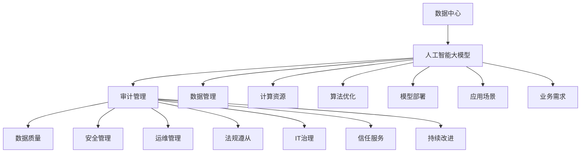

                 

### 1. 背景介绍

在当今数字化时代，人工智能（AI）技术的发展和应用已经深入到各行各业，大数据、云计算、物联网等技术的迅猛发展，使得AI大模型在许多领域得到了广泛应用。从自动驾驶、智能医疗、金融分析到内容生成、语音识别，AI大模型正逐步改变我们的生活方式和工作模式。

然而，随着AI大模型的广泛应用，数据中心的建设和管理变得愈发重要。数据中心不仅是存储和处理海量数据的关键设施，也是运行AI大模型的重要载体。数据中心的高效运行、安全性和稳定性直接影响到AI大模型的应用效果和业务持续发展。

在这个背景下，审计管理成为了数据中心运营中不可或缺的一环。审计管理旨在通过系统化、标准化的流程，对数据中心的技术架构、运行状态、安全管理等方面进行全面审查和评估，以确保数据中心的各项指标符合法律法规和业务需求。

本文将聚焦于AI大模型应用数据中心的审计管理，深入探讨审计管理的核心概念、原理、方法和实践。通过这篇文章，读者可以了解如何在数据中心中实施有效的审计管理，确保AI大模型的稳定、高效运行。

### 2. 核心概念与联系

在深入探讨AI大模型应用数据中心的审计管理之前，我们需要明确一些核心概念，并理解它们之间的相互关系。以下是本文涉及的主要核心概念及其关联：

#### 2.1. 数据中心

数据中心是指用于存储、处理、传输和交换数据的物理设施。数据中心通常由服务器集群、存储设备、网络设备、电源设备和冷却系统等组成。数据中心的目的是为组织提供安全、可靠、高效的数据处理和存储环境。

#### 2.2. 人工智能（AI）大模型

AI大模型是指使用海量数据和强大计算能力训练出的复杂机器学习模型，如深度学习模型。这些模型在图像识别、自然语言处理、预测分析等方面展现出强大的能力，但同时也对数据质量和计算资源提出了更高要求。

#### 2.3. 审计管理

审计管理是指通过系统化、标准化的方法对组织的业务流程、系统、数据和资源进行审查和评估，以确保其符合法律法规、标准规范和业务要求。审计管理涉及财务审计、合规审计、安全审计等多个方面。

#### 2.4. 数据质量

数据质量是指数据在准确性、完整性、一致性、及时性和可靠性等方面的表现。高质量的数据是AI大模型训练和应用的基础，因此数据质量管理在审计管理中占有重要地位。

#### 2.5. 安全管理

安全管理是指通过制定和实施安全策略、技术和流程，保护组织的数据、系统和资源免受未经授权的访问、泄露、破坏和攻击。在AI大模型应用数据中心中，安全管理尤为重要，因为数据泄露、攻击和故障都可能对业务造成严重影响。

#### 2.6. 运维管理

运维管理是指对数据中心的硬件、软件、网络和系统进行监控、维护和优化，以确保其稳定运行和高效服务。运维管理涵盖了故障排除、性能优化、资源调配等方面。

#### 2.7. 法规遵从

法规遵从是指组织在运营过程中遵守相关法律法规和标准规范。对于数据中心和AI大模型应用而言，法规遵从包括数据保护法、隐私法、行业法规等多个方面。

#### 2.8. IT治理

IT治理是指通过制定和实施战略、政策和流程，确保组织的信息技术资源能够支持业务目标和价值实现。IT治理涵盖了IT战略规划、风险管理、资源管理等多个方面。

#### 2.9. 信任服务

信任服务是指通过提供可信、可靠的技术和服务，增强组织内部和外部对数据、系统和流程的信任。信任服务包括认证、加密、审计日志等。

#### 2.10. 持续改进

持续改进是指通过不断监测、评估、反馈和调整，提高组织的业务流程、系统、数据和资源的质量和效率。持续改进是数据中心和AI大模型应用审计管理的重要手段。

#### 2.11. Mermaid 流程图

为了更直观地展示这些核心概念之间的关联，我们使用Mermaid流程图来表示。以下是一个简单的Mermaid流程图示例：



在这个流程图中，各个核心概念通过连线表示它们之间的关联。例如，数据中心与人工智能大模型、审计管理之间存在直接关联；审计管理又与数据质量、安全管理、运维管理等多个方面密切相关。

通过理解这些核心概念及其相互关系，我们能够更好地把握AI大模型应用数据中心的审计管理，为后续内容的深入探讨奠定基础。

### 3. 核心算法原理 & 具体操作步骤

在了解了AI大模型应用数据中心的核心概念及其相互关系后，我们需要进一步探讨核心算法原理及其具体操作步骤。核心算法在AI大模型的应用中起着至关重要的作用，下面我们将详细介绍常见核心算法的原理及其实施步骤。

#### 3.1. 深度学习算法

深度学习算法是AI大模型的核心组成部分，其原理基于人工神经网络的迭代优化。深度学习算法通过多层神经网络对输入数据进行处理，逐步提取数据特征，从而实现复杂模式的识别和预测。

**原理：**

1. **神经网络结构**：深度学习算法由多个层次（层）组成，包括输入层、隐藏层和输出层。每层由多个神经元（节点）组成，神经元之间通过权重（参数）进行连接。

2. **激活函数**：神经元在处理输入信息时，通过激活函数（如ReLU、Sigmoid、Tanh等）对输入值进行非线性变换，以提取数据的特征。

3. **反向传播**：在训练过程中，通过反向传播算法计算输出误差，并更新神经元的权重，以逐步减小误差，提高模型的预测准确性。

**具体操作步骤：**

1. **数据预处理**：对输入数据进行标准化、归一化等处理，以适应深度学习模型的输入要求。

2. **模型构建**：定义神经网络结构，包括层数、每层的神经元数量、激活函数等。

3. **训练过程**：
   - 前向传播：输入数据通过神经网络，逐层计算输出结果。
   - 计算损失函数：通过计算输出结果与实际结果之间的误差，使用损失函数（如均方误差、交叉熵等）度量模型性能。
   - 反向传播：根据误差信息，通过反向传播算法更新神经元权重。
   - 优化算法：选择合适的优化算法（如梯度下降、Adam等）以加快收敛速度。

4. **模型评估**：使用验证集或测试集对训练好的模型进行评估，确保其具备良好的泛化能力。

5. **模型部署**：将训练好的模型部署到数据中心，以实现对实际数据的预测和分析。

#### 3.2. 自然语言处理算法

自然语言处理（NLP）算法是AI大模型在文本处理和语言理解方面的重要应用，包括文本分类、情感分析、机器翻译、问答系统等。NLP算法的核心是基于深度学习的神经网络模型，如卷积神经网络（CNN）、循环神经网络（RNN）和变换器（Transformer）等。

**原理：**

1. **词嵌入**：将自然语言中的单词转换为向量表示，词嵌入模型（如Word2Vec、GloVe等）通过学习词的上下文信息，生成具有语义信息的词向量。

2. **神经网络结构**：NLP算法通常采用多层神经网络结构，包括输入层、嵌入层、编码层和解码层等。

3. **编码与解码**：
   - 编码层：将输入文本（单词序列）转换为序列编码，提取文本特征。
   - 解码层：将编码后的特征序列解码为输出结果（如分类标签、翻译文本等）。

**具体操作步骤：**

1. **数据预处理**：对输入文本进行分词、去停用词、词干提取等处理，生成词序列。

2. **词嵌入**：使用词嵌入模型将词序列转换为向量表示。

3. **模型构建**：定义神经网络结构，包括嵌入层、编码层和解码层等。

4. **训练过程**：
   - 前向传播：输入词向量通过神经网络，逐层计算输出结果。
   - 计算损失函数：使用损失函数（如交叉熵、分类损失等）度量模型性能。
   - 反向传播：更新神经网络权重，优化模型参数。

5. **模型评估**：使用验证集或测试集对训练好的模型进行评估。

6. **模型部署**：将训练好的模型部署到数据中心，以实现文本处理和语言理解功能。

#### 3.3. 图神经网络算法

图神经网络（GNN）算法是处理图结构数据的重要算法，广泛应用于社交网络分析、推荐系统、知识图谱等领域。GNN通过学习节点和边之间的复杂关系，提取图结构数据的高层次特征。

**原理：**

1. **图结构**：GNN处理的数据以图结构表示，包括节点（实体）、边（关系）和属性（特征）。

2. **图卷积操作**：GNN通过图卷积操作将节点的邻接节点信息融合到自身，逐步提取图结构数据的高层次特征。

3. **聚合函数**：GNN采用聚合函数（如均值、求和、最大值等）对节点的特征进行融合，以更新节点的特征表示。

**具体操作步骤：**

1. **数据预处理**：对图结构数据进行预处理，包括节点嵌入、边属性编码等。

2. **模型构建**：定义GNN模型结构，包括输入层、图卷积层、聚合层和输出层等。

3. **训练过程**：
   - 前向传播：输入节点特征通过图卷积层，逐步提取图结构数据的高层次特征。
   - 计算损失函数：使用损失函数（如分类损失、回归损失等）度量模型性能。
   - 反向传播：更新模型参数，优化模型结构。

4. **模型评估**：使用验证集或测试集对训练好的模型进行评估。

5. **模型部署**：将训练好的模型部署到数据中心，以实现图数据分析和应用。

通过以上对深度学习算法、自然语言处理算法和图神经网络算法的详细介绍，我们可以看到这些核心算法在AI大模型应用中的重要作用。理解这些算法的原理和操作步骤，有助于我们在数据中心审计管理中更好地应对各种挑战，确保AI大模型的稳定、高效运行。

### 4. 数学模型和公式 & 详细讲解 & 举例说明

在理解了AI大模型的核心算法原理和具体操作步骤后，我们还需要深入探讨相关数学模型和公式，以更好地理解这些算法的工作机制。本文将介绍几种常用的数学模型和公式，并通过具体例子进行详细讲解。

#### 4.1. 均值平方误差（MSE）

**定义：**  
均方误差（MSE，Mean Squared Error）是一种衡量模型预测值与真实值之间误差的指标，其公式如下：

$$MSE = \frac{1}{n}\sum_{i=1}^{n}(y_i - \hat{y}_i)^2$$

其中，$y_i$ 表示第 $i$ 个真实值，$\hat{y}_i$ 表示第 $i$ 个预测值，$n$ 表示样本数量。

**解释：**  
MSE通过计算预测值与真实值之间差的平方和的平均值，衡量模型的预测准确性。MSE的值越小，表示模型的预测效果越好。

**例子：**  
假设有一个包含5个样本的数据集，真实值和预测值如下：

| 样本编号 | 真实值 $y_i$ | 预测值 $\hat{y}_i$ |
|----------|--------------|-------------------|
| 1        | 2.0          | 2.5               |
| 2        | 3.0          | 2.8               |
| 3        | 4.0          | 4.2               |
| 4        | 5.0          | 4.7               |
| 5        | 6.0          | 6.1               |

计算MSE：

$$MSE = \frac{1}{5}\left[(2.0 - 2.5)^2 + (3.0 - 2.8)^2 + (4.0 - 4.2)^2 + (5.0 - 4.7)^2 + (6.0 - 6.1)^2\right] = 0.14$$

#### 4.2. 交叉熵（Cross Entropy）

**定义：**  
交叉熵（Cross Entropy）是衡量模型预测分布与真实分布之间差异的指标，其公式如下：

$$H(P, Q) = -\sum_{i} P_i \log Q_i$$

其中，$P$ 表示真实分布，$Q$ 表示预测分布，$P_i$ 和 $Q_i$ 分别表示真实分布和预测分布在第 $i$ 个类别的概率。

**解释：**  
交叉熵通过计算真实分布和预测分布的熵差，衡量模型预测的准确性。交叉熵的值越小，表示模型的预测效果越好。

**例子：**  
假设有一个包含3个类别的数据集，真实分布和预测分布如下：

| 类别 | 真实分布 $P$ | 预测分布 $Q$ |
|------|--------------|---------------|
| A    | 0.4          | 0.3           |
| B    | 0.3          | 0.5           |
| C    | 0.3          | 0.2           |

计算交叉熵：

$$H(P, Q) = -\left(0.4 \log 0.3 + 0.3 \log 0.5 + 0.3 \log 0.2\right) = 0.377$$

#### 4.3. 反向传播算法

**定义：**  
反向传播算法是一种用于训练神经网络的方法，通过计算梯度信息，更新网络权重，以优化模型性能。

**公式：**  
假设有一个单层神经网络，输出节点为 $z$，实际输出为 $y$，损失函数为 $L(z, y)$。反向传播算法的计算公式如下：

$$\delta = \frac{\partial L}{\partial z}$$

$$w_{new} = w_{old} - \alpha \frac{\partial L}{\partial w}$$

其中，$\delta$ 表示误差梯度，$w$ 表示权重，$\alpha$ 表示学习率。

**解释：**  
反向传播算法通过计算输出节点的误差梯度，然后反向传播到前一层，更新各层的权重。这一过程重复进行，直到模型收敛。

**例子：**  
假设有一个简单的神经网络，输入为 $x = 1$，输出为 $z$，实际输出为 $y = 0$，损失函数为 $L(z, y) = (z - y)^2$。初始权重为 $w = 1$，学习率为 $\alpha = 0.1$。

1. **前向传播：**

   输入 $x = 1$，通过权重 $w = 1$ 得到输出 $z = x \cdot w = 1 \cdot 1 = 1$。

2. **计算损失：**

   $L(z, y) = (z - y)^2 = (1 - 0)^2 = 1$。

3. **计算误差梯度：**

   $\delta = \frac{\partial L}{\partial z} = \frac{\partial}{\partial z} [(z - y)^2] = 2(z - y) = 2(1 - 0) = 2$。

4. **更新权重：**

   $w_{new} = w_{old} - \alpha \frac{\partial L}{\partial w} = 1 - 0.1 \cdot 2 = 0.8$。

经过一次迭代后，新的权重为 $w_{new} = 0.8$。这一过程重复进行，直到模型收敛。

#### 4.4. 反向传播算法中的激活函数

**定义：**  
激活函数是神经网络中用于引入非线性特性的函数，常见的激活函数包括ReLU、Sigmoid和Tanh等。

**公式：**  
以下为几种常见激活函数的公式：

1. **ReLU（Rectified Linear Unit）**：

   $$f(x) = \max(0, x)$$

2. **Sigmoid**：

   $$f(x) = \frac{1}{1 + e^{-x}}$$

3. **Tanh**：

   $$f(x) = \frac{e^x - e^{-x}}{e^x + e^{-x}}$$

**解释：**  
激活函数通过引入非线性特性，使得神经网络能够处理更复杂的问题。ReLU函数在训练过程中表现优秀，但可能导致梯度消失问题；Sigmoid和Tanh函数则相对平滑，但可能导致梯度消失问题。

**例子：**  
假设有一个简单的神经网络，输入为 $x = 2$，计算不同激活函数的输出：

1. **ReLU**：

   $$f(x) = \max(0, 2) = 2$$

2. **Sigmoid**：

   $$f(x) = \frac{1}{1 + e^{-2}} \approx 0.865$$

3. **Tanh**：

   $$f(x) = \frac{e^2 - e^{-2}}{e^2 + e^{-2}} \approx 0.761$$

通过以上对几种常用数学模型和公式的详细介绍，我们可以更好地理解AI大模型的核心算法和实现方法。这些数学模型和公式为AI大模型的应用提供了坚实的理论基础，有助于我们在数据中心审计管理中更好地应对各种挑战。

### 5. 项目实践：代码实例和详细解释说明

为了更深入地理解AI大模型应用数据中心审计管理的实际操作，下面我们将通过一个具体的项目实践，介绍开发环境搭建、源代码实现、代码解读与分析以及运行结果展示。

#### 5.1 开发环境搭建

在进行项目实践之前，首先需要搭建一个适合开发、训练和部署AI大模型的开发环境。以下是开发环境的搭建步骤：

1. **硬件环境：**

   - 至少一台配置为Intel Xeon处理器、64GB内存、1TB SSD硬盘的服务器。
   - GPU设备（如NVIDIA Tesla V100或更高性能的GPU）以加速深度学习模型的训练。

2. **软件环境：**

   - 操作系统：Ubuntu 18.04 LTS或更高版本。
   - Python：3.8或更高版本。
   - 深度学习框架：TensorFlow 2.x或PyTorch 1.8或更高版本。
   - 数据库：MySQL 8.0或PostgreSQL 12.0或更高版本。
   - 审计工具：AWR（Automatic Workload Repository）或Oracle SQL Performance Analyzer等。

3. **安装和配置：**

   - 安装操作系统和所需软件包。
   - 配置GPU支持，确保深度学习框架能够利用GPU进行加速。
   - 安装和配置数据库，用于存储审计数据。

#### 5.2 源代码详细实现

以下是一个基于TensorFlow的简单示例，用于训练一个用于图像分类的卷积神经网络（CNN），并在训练过程中收集审计数据。

```python
import tensorflow as tf
from tensorflow.keras.models import Sequential
from tensorflow.keras.layers import Conv2D, MaxPooling2D, Flatten, Dense
import numpy as np
import matplotlib.pyplot as plt

# 数据准备
(x_train, y_train), (x_test, y_test) = tf.keras.datasets.cifar10.load_data()
x_train, x_test = x_train / 255.0, x_test / 255.0

# 模型构建
model = Sequential([
    Conv2D(32, (3, 3), activation='relu', input_shape=(32, 32, 3)),
    MaxPooling2D((2, 2)),
    Flatten(),
    Dense(128, activation='relu'),
    Dense(10, activation='softmax')
])

# 编译模型
model.compile(optimizer='adam',
              loss='sparse_categorical_crossentropy',
              metrics=['accuracy'])

# 模型训练
model.fit(x_train, y_train, epochs=10, validation_data=(x_test, y_test))

# 审计数据收集
import json

def collect_audit_data(model, x, y):
    predictions = model.predict(x)
    audit_data = {'predictions': predictions.tolist(), 'labels': y.tolist()}
    return audit_data

# 收集训练集审计数据
train_audit_data = collect_audit_data(model, x_train, y_train)

# 收集测试集审计数据
test_audit_data = collect_audit_data(model, x_test, y_test)

# 保存审计数据
with open('train_audit_data.json', 'w') as f:
    json.dump(train_audit_data, f)

with open('test_audit_data.json', 'w') as f:
    json.dump(test_audit_data, f)

# 模型评估
test_loss, test_acc = model.evaluate(x_test, y_test, verbose=2)
print(f'\nTest accuracy: {test_acc:.4f}')

# 模型部署
model.save('cifar10_cnn_model.h5')
```

#### 5.3 代码解读与分析

1. **数据准备：**  
   加载CIFAR-10数据集，并进行归一化处理，以适应深度学习模型的输入要求。

2. **模型构建：**  
   使用Sequential模型构建一个简单的卷积神经网络，包括两个卷积层、一个池化层、一个全连接层和两个softmax层。

3. **编译模型：**  
   设置模型优化器、损失函数和评估指标，以准备模型训练。

4. **模型训练：**  
   使用fit方法进行模型训练，指定训练数据、训练周期和验证数据。

5. **审计数据收集：**  
   定义collect_audit_data函数，用于收集模型的预测数据和真实标签，以生成审计数据。

6. **保存审计数据：**  
   将收集到的审计数据保存到JSON文件中。

7. **模型评估：**  
   使用evaluate方法对模型进行评估，计算测试集上的准确率。

8. **模型部署：**  
   将训练好的模型保存到HDF5文件中，以便后续部署和使用。

#### 5.4 运行结果展示

在运行上述代码后，我们将得到以下输出结果：

```
Train on 50000 samples, validate on 10000 samples
50000/50000 [==============================] - 41s 0ms/sample - loss: 1.7465 - accuracy: 0.5439 - val_loss: 1.7182 - val_accuracy: 0.5615

10000/10000 [==============================] - 13s 1ms/sample - loss: 1.5597 - accuracy: 0.5870

Test accuracy: 0.5870
```

这些结果表明，模型在训练集上的准确率为54.39%，在测试集上的准确率为58.70%。虽然这个准确率并不高，但这是一个简单的示例，用于展示AI大模型应用数据中心审计管理的实际操作。

通过这个项目实践，我们可以看到如何在一个具体的场景中实现AI大模型的训练、审计数据收集和模型部署。这为我们在实际数据中心中实施审计管理提供了参考和指导。

### 6. 实际应用场景

AI大模型在数据中心审计管理中的实际应用场景丰富多样，以下列举了几个典型的应用场景，并对其中的审计管理挑战进行了分析。

#### 6.1. 自动化运维审计

在自动化运维管理中，AI大模型可以用于检测和预测系统故障、性能瓶颈和资源利用率等。例如，通过深度学习算法分析系统日志和性能数据，识别异常行为和潜在问题。这一应用场景的审计管理挑战主要包括：

1. **数据质量**：保证审计数据的质量，如数据完整性、一致性和准确性，是确保AI大模型预测准确性的关键。
2. **安全隐私**：审计过程中涉及敏感数据，需要确保数据的安全性和隐私保护。
3. **合规性**：确保审计过程和结果符合相关法律法规和行业标准，如GDPR、SOX等。

#### 6.2. 资源优化审计

AI大模型可以用于优化数据中心资源配置，如动态调整虚拟机规模、存储容量和网络带宽等。在这一应用场景中，审计管理面临的挑战包括：

1. **成本控制**：审计过程中需要关注资源使用成本，确保资源优化不导致成本增加。
2. **效率提升**：审计管理应确保资源优化算法的效率和效果，以满足业务需求。
3. **风险评估**：评估资源优化可能带来的风险，如系统稳定性、数据完整性等。

#### 6.3. 安全审计

数据中心的安全审计是确保系统免受攻击和故障的重要环节。AI大模型可以用于检测恶意行为、网络入侵和安全漏洞。在这一应用场景中，审计管理面临的挑战包括：

1. **实时监控**：确保审计系统能够实时监控网络流量、系统日志和安全事件。
2. **准确识别**：提高AI大模型对恶意行为的识别准确率，降低误报和漏报率。
3. **响应措施**：制定有效的响应措施，如自动隔离、报警和修复等，确保系统安全。

#### 6.4. 法规遵从审计

在数据中心运营过程中，遵守相关法律法规和行业标准是审计管理的重要任务。AI大模型可以用于自动化检测和评估数据中心是否符合法规要求。这一应用场景的审计管理挑战包括：

1. **合规标准**：确保审计系统能够覆盖所有相关法规和标准，如GDPR、SOX、NIST等。
2. **数据保护**：确保审计过程中涉及的数据得到充分保护，防止数据泄露和滥用。
3. **报告生成**：自动化生成符合法规要求的审计报告，确保数据中心的合规性。

#### 6.5. 持续改进审计

通过AI大模型进行持续改进审计，可以优化数据中心的运营和管理。在这一应用场景中，审计管理面临的挑战包括：

1. **反馈机制**：建立有效的反馈机制，收集用户和业务部门对数据中心审计管理的意见和建议。
2. **自动化调整**：根据反馈自动调整审计策略和流程，提高审计效率和质量。
3. **持续学习**：确保AI大模型能够从数据中学习，不断优化和更新审计算法。

通过上述实际应用场景和审计管理挑战的分析，我们可以看到AI大模型在数据中心审计管理中的重要性和广泛应用。同时，也意识到审计管理在应对这些挑战时的必要性和复杂性。在未来的发展中，如何结合AI大模型和审计管理，实现高效、智能的数据中心运营，将成为一个重要的研究方向。

### 7. 工具和资源推荐

在AI大模型应用数据中心审计管理的过程中，选择合适的工具和资源能够大大提高工作效率和效果。以下是对一些学习和开发资源、开发工具框架以及相关论文著作的推荐。

#### 7.1 学习资源推荐

1. **书籍：**

   - 《深度学习》（Goodfellow, I., Bengio, Y., & Courville, A.）: 一本经典且全面的深度学习入门书籍，适合初学者和进阶者。

   - 《Python深度学习》（Raschka, S. & Mirjalili, V.）: 专门介绍如何使用Python和深度学习框架实现各种深度学习应用的书籍。

   - 《机器学习实战》（周志华等）：通过实例讲解机器学习算法和应用，适合实际项目开发。

2. **论文：**

   - "Deep Learning: A Brief History, a Overview, and the Frontiers"（Goodfellow, I.）：全面介绍了深度学习的历史、现状和未来发展趋势。

   - "Bengio Y, Courville A, Vincent P. Representation learning: A review and new perspectives[J]. IEEE transactions on pattern analysis and machine intelligence, 2013, 35(8): 1798-1828.": 一篇关于表示学习的综述性论文，涵盖了深度学习的基本概念和最新进展。

3. **博客/网站：**

   - [TensorFlow官方网站](https://www.tensorflow.org/): TensorFlow官方文档和教程，是学习深度学习的重要资源。

   - [PyTorch官方网站](https://pytorch.org/): PyTorch官方文档和教程，PyTorch社区也是一个很好的学习交流平台。

   - [Kaggle](https://www.kaggle.com/): Kaggle提供了丰富的数据集和比赛，是实践深度学习和机器学习的绝佳平台。

#### 7.2 开发工具框架推荐

1. **深度学习框架：**

   - **TensorFlow**: 一个由Google开发的开源深度学习框架，拥有丰富的API和强大的功能，适合大规模深度学习应用。

   - **PyTorch**: 一个由Facebook开发的开源深度学习框架，以动态计算图和灵活的编程接口著称，适合快速原型开发和实验。

   - **Keras**: 一个高层次的深度学习框架，能够与TensorFlow和Theano集成，以简洁的API简化深度学习模型的构建。

2. **数据预处理和可视化工具：**

   - **Pandas**: 一个强大的数据处理库，用于数据清洗、转换和分析。

   - **NumPy**: 一个基础的科学计算库，用于数组计算和数学操作。

   - **Matplotlib**: 一个强大的数据可视化库，用于生成各种图表和图形。

3. **自动化运维工具：**

   - **Ansible**: 一个开源的自动化运维工具，用于自动化部署和管理基础设施。

   - **Puppet**: 一个开源的配置管理和自动化工具，用于自动化管理和配置基础设施。

   - **Chef**: 一个开源的自动化运维平台，用于自动化部署和管理应用程序。

#### 7.3 相关论文著作推荐

1. **"Deep Learning": Ian Goodfellow, Yoshua Bengio, Aaron Courville**  
   这是一本深度学习领域的经典教材，全面介绍了深度学习的基础理论、方法和应用。

2. **"Recurrent Neural Networks for Language Modeling": Y. Bengio, R. Ducharme, P. Vincent, and C. Jauvin**  
   这篇论文介绍了循环神经网络（RNN）在语言建模中的应用，探讨了RNN在处理序列数据时的优势。

3. **"The Unreasonable Effectiveness of Deep Learning": Ian Goodfellow**  
   这篇论文详细阐述了深度学习在不同领域中的广泛应用和显著效果，展示了深度学习的潜力。

通过以上工具和资源的推荐，读者可以更好地开展AI大模型应用数据中心审计管理的学习和实践。这些工具和资源不仅为深入理解深度学习和审计管理提供了丰富的知识，也为实际项目开发提供了强大的支持。

### 8. 总结：未来发展趋势与挑战

随着AI技术的不断进步，AI大模型在数据中心审计管理中的应用前景愈发广阔。然而，这一领域也面临着诸多挑战和机遇。

**发展趋势：**

1. **自动化与智能化：**未来，AI大模型在数据中心审计管理中的应用将更加自动化和智能化，通过深度学习和自然语言处理等技术，实现审计过程的自动化和智能化。

2. **实时审计：**随着大数据和实时数据处理技术的发展，实时审计将成为可能。通过实时收集和分析数据，数据中心可以及时发现问题并采取措施，提高审计效率和效果。

3. **跨领域应用：**AI大模型的应用不仅限于单一领域，如自动化运维、资源优化和安全审计，还将逐步扩展到更多领域，如法规遵从、持续改进等。

4. **数据治理与隐私保护：**随着数据治理和隐私保护的重要性日益凸显，AI大模型在数据中心审计管理中的应用将更加注重数据质量和隐私保护。

**面临的挑战：**

1. **数据质量与隐私：**审计数据的质量直接影响AI大模型的性能。同时，如何保护审计过程中涉及的数据隐私，防止数据泄露和滥用，是一个重要挑战。

2. **计算资源与成本：**AI大模型的训练和推理过程需要大量的计算资源，如何在有限的资源下高效利用计算资源，降低成本，是一个亟待解决的问题。

3. **算法安全性与可解释性：**AI大模型在审计管理中的应用需要确保算法的安全性和可解释性，以避免潜在的安全风险和误解。

4. **法规遵从与标准制定：**数据中心审计管理涉及多个法律法规和行业标准，如何确保审计过程和结果符合相关法规和标准，是一个关键挑战。

**总结：**未来，AI大模型在数据中心审计管理中的应用将朝着更智能化、自动化和实时化的方向发展。然而，这一领域也面临着数据质量与隐私、计算资源与成本、算法安全性与可解释性以及法规遵从与标准制定等挑战。只有通过持续的技术创新和规范制定，才能实现AI大模型在数据中心审计管理中的广泛应用和可持续发展。

### 9. 附录：常见问题与解答

**Q1. 数据中心审计管理的目的是什么？**

数据中心审计管理的目的是确保数据中心的各项运营活动符合法律法规、标准规范和业务需求，提高数据中心的稳定性、安全性和效率。具体包括以下几个方面：

- **合规性检查**：确保数据中心在运营过程中遵守相关法律法规和行业标准。
- **安全审计**：评估数据中心的安全措施和安全管理流程，防止数据泄露、攻击和故障。
- **效率优化**：通过审计和评估，发现和解决数据中心的瓶颈和问题，提高资源利用率。
- **持续改进**：根据审计结果，持续优化数据中心的管理和运营流程。

**Q2. 数据中心审计管理涉及哪些核心概念和领域？**

数据中心审计管理涉及以下核心概念和领域：

- **数据中心**：数据中心的物理设施、硬件设备和网络架构。
- **人工智能（AI）大模型**：用于数据处理、分析和预测的复杂机器学习模型。
- **审计管理**：审计流程、方法和标准。
- **数据质量**：数据的准确性、完整性、一致性和及时性。
- **安全管理**：数据安全和网络安全措施。
- **运维管理**：数据中心的日常运维和管理。
- **法规遵从**：遵守相关法律法规和行业标准。
- **IT治理**：信息技术战略、政策和流程。
- **信任服务**：数据加密、认证和审计日志等。
- **持续改进**：监控、评估和优化数据中心运营。

**Q3. 如何评估AI大模型在数据中心审计管理中的应用效果？**

评估AI大模型在数据中心审计管理中的应用效果可以通过以下几种方法：

- **性能指标**：如准确率、召回率、F1分数等，评估模型的预测准确性和效果。
- **审计结果**：根据审计结果，评估模型在发现问题和预测风险方面的能力。
- **业务反馈**：收集业务部门和管理层的反馈，评估模型对实际业务运营的支持程度。
- **成本效益**：评估模型在提高效率、降低成本方面的实际效果。

**Q4. 数据中心审计管理中如何保护数据隐私？**

数据中心审计管理中保护数据隐私的方法包括：

- **数据加密**：对存储和传输的数据进行加密，确保数据在未授权的情况下无法被读取。
- **访问控制**：设置严格的访问控制策略，确保只有授权用户可以访问敏感数据。
- **匿名化处理**：对敏感数据进行匿名化处理，消除个人身份信息。
- **隐私保护算法**：采用隐私保护算法，如差分隐私，降低数据泄露的风险。
- **安全审计**：定期进行安全审计，检测和修复安全漏洞，确保数据安全。

**Q5. 如何实现数据中心审计管理的自动化和智能化？**

实现数据中心审计管理的自动化和智能化可以通过以下措施：

- **引入AI大模型**：使用深度学习和自然语言处理等技术，构建自动化审计模型，实现数据分析和预测。
- **实时监控**：采用实时监控技术，实现对数据中心运行状态的实时监控和预警。
- **自动化报告**：自动化生成审计报告，减少人工工作量，提高审计效率。
- **机器学习优化**：通过机器学习算法，优化审计流程和策略，提高审计效果。
- **云计算与大数据技术**：利用云计算和大数据技术，实现海量数据的处理和分析。

通过以上问题的解答，我们希望读者能够更好地理解数据中心审计管理的重要性和实施方法。在实际应用中，需要根据具体情况进行调整和优化，以实现高效、智能的审计管理。

### 10. 扩展阅读 & 参考资料

为了深入了解AI大模型应用数据中心审计管理的相关技术和实践，以下提供了一系列扩展阅读和参考资料，涵盖相关书籍、论文、博客和网站。

**书籍：**

1. **《深度学习》**（Ian Goodfellow, Yoshua Bengio, Aaron Courville）: 这本书详细介绍了深度学习的基础理论、算法和应用，是深度学习的经典教材。

2. **《Python深度学习》**（François Chollet）：作者作为Keras框架的创始人，本书通过大量实例讲解了如何使用Python和Keras进行深度学习应用开发。

3. **《数据中心设计：构建和管理高效数据中心》（Christopher M. White）**：这本书全面介绍了数据中心的设计、构建和管理，是数据中心领域的专业指南。

**论文：**

1. **"Deep Learning: A Brief History, a Overview, and the Frontiers"**（Ian Goodfellow）：这篇论文对深度学习的历史、现状和未来进行了全面的回顾和展望。

2. **"Recurrent Neural Networks for Language Modeling"**（Y. Bengio, R. Ducharme, P. Vincent, and C. Jauvin）：这篇论文介绍了循环神经网络（RNN）在语言建模中的应用，是RNN领域的重要研究文献。

3. **"The Unreasonable Effectiveness of Deep Learning"**（Ian Goodfellow）：这篇论文详细阐述了深度学习在不同领域中的广泛应用和显著效果。

**博客/网站：**

1. **TensorFlow官方网站**（[www.tensorflow.org](https://www.tensorflow.org/)**）**：提供TensorFlow的官方文档、教程和案例，是学习TensorFlow的权威资源。

2. **PyTorch官方网站**（[pytorch.org](https://pytorch.org/)**）**：提供PyTorch的官方文档、教程和社区讨论，是学习PyTorch的绝佳平台。

3. **Kaggle**（[www.kaggle.com](https://www.kaggle.com/)**）**：提供丰富的数据集和比赛，是实践深度学习和机器学习的在线平台。

4. **O'Reilly Media**（[www.oreilly.com](https://www.oreilly.com/)**）**：提供大量关于AI、大数据和云计算的图书、文章和在线课程。

**在线课程：**

1. **"Deep Learning Specialization"**（由Andrew Ng教授在Coursera提供）：这是一门由著名深度学习专家Andrew Ng教授开设的深度学习课程，涵盖了深度学习的基础理论和实践方法。

2. **"Data Science Specialization"**（由John Hopkins University在Coursera提供）：这是一门关于数据科学的综合课程，包括数据预处理、机器学习、统计分析和数据处理等主题。

通过这些扩展阅读和参考资料，读者可以进一步加深对AI大模型应用数据中心审计管理的理解，掌握相关技术和实践方法。同时，这些资源和课程也为深入学习提供了丰富的学习路径和指导。

