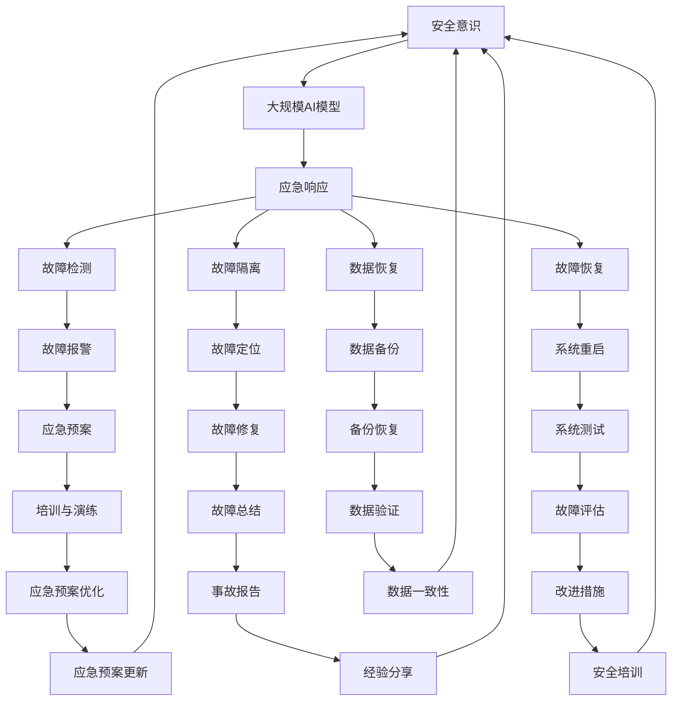

                 

### 背景介绍

在当今快速发展的数字化时代，人工智能（AI）技术已经渗透到了各个行业，从医疗、金融、教育到制造业，AI的应用场景越来越广泛。其中，大规模人工智能模型（Large-scale AI models），如GPT-3、BERT等，作为AI技术的核心组成部分，正发挥着越来越重要的作用。这些模型具有处理海量数据、实现复杂任务的能力，使得许多以前无法完成的任务成为了可能。

随着人工智能模型的应用越来越普及，数据中心的重要性也在日益凸显。数据中心不仅是存储和计算这些模型数据的地方，更是模型训练、推理和部署的核心场所。然而，随着模型的规模和复杂度的不断增加，数据中心的压力也随之增大。特别是在面对突发情况时，如硬件故障、网络攻击、数据泄露等，数据中心需要具备快速响应和高效恢复的能力，以确保AI应用的连续性和稳定性。

应急响应（Emergency Response）是指在突发事件发生时，采取迅速而有效的措施，以减轻损害、恢复正常运行的过程。对于AI数据中心而言，应急响应不仅包括处理硬件和软件故障，还包括确保数据的安全性和完整性，以及快速恢复AI服务的运行。有效的应急响应不仅能够最大限度地降低事故带来的损失，还能够提升数据中心的运营效率和可靠性。

本文将深入探讨AI数据中心应急响应的各个方面。首先，我们将介绍大规模人工智能模型在数据中心的应用背景和面临的挑战。接着，我们将详细分析AI数据中心应急响应的核心概念和架构。然后，我们将讨论核心算法原理和具体操作步骤，并通过数学模型和公式进行详细解释。此外，我们还将通过实际项目实例展示应急响应的具体实现过程。最后，我们将探讨AI数据中心应急响应在实际应用场景中的重要性，以及未来发展趋势和挑战。

通过本文的深入探讨，我们希望能够为从事AI数据中心运营的工程师和研究人员提供有价值的参考，帮助他们构建高效、稳定的应急响应机制，确保AI服务的持续稳定运行。

### 核心概念与联系

在探讨AI数据中心应急响应之前，我们需要先了解一些核心概念和原理，这些概念不仅对理解应急响应至关重要，也是构建有效响应机制的基础。

#### 数据中心（Data Center）

数据中心是集中存储、处理和管理数据的物理设施。它通常包括服务器、存储设备、网络设备和安全系统等组成部分。随着云计算和大数据技术的发展，数据中心已经成为现代企业运作的中枢神经。对于AI数据中心而言，其重要性不仅在于存储和管理大量数据，还在于提供高效的计算和推理资源。

#### 大规模人工智能模型（Large-scale AI Models）

大规模人工智能模型是指具有数百万甚至数十亿参数的复杂模型。这些模型通过深度学习算法在大量数据上训练，以实现从自然语言处理、计算机视觉到强化学习等各种任务。GPT-3、BERT和Turing模型等都是大规模人工智能模型的典型代表。这些模型通常需要大量的计算资源和存储空间，因此对数据中心的性能提出了极高的要求。

#### 应急响应（Emergency Response）

应急响应是指在面对突发事件（如自然灾害、网络安全攻击、硬件故障等）时，采取迅速而有效的措施，以减轻损害、恢复正常运行的过程。在AI数据中心，应急响应的目标是确保数据的安全和服务的连续性，包括故障检测、故障隔离、故障恢复和数据恢复等步骤。

#### 核心概念联系（Mermaid 流程图）

为了更好地理解这些核心概念之间的联系，我们可以使用Mermaid流程图进行展示。以下是AI数据中心应急响应的核心概念流程图：



通过上述流程图，我们可以清晰地看到数据中心、大规模AI模型和应急响应之间的紧密联系。数据中心为AI模型提供计算和存储资源，而应急响应机制则是保障数据中心稳定运行的关键。应急响应包括故障检测、故障隔离、故障恢复和数据恢复等步骤，这些步骤相互关联，共同确保AI服务的连续性和可靠性。

#### 总结

通过核心概念与流程图的介绍，我们不仅了解了AI数据中心的基本架构，还明确了应急响应在其中的重要作用。理解这些核心概念和联系，将为后续深入探讨AI数据中心应急响应的算法原理和具体操作步骤打下坚实的基础。

### 核心算法原理 & 具体操作步骤

在了解AI数据中心应急响应的核心概念和架构之后，我们接下来需要探讨核心算法原理和具体操作步骤。应急响应的核心算法主要包括故障检测、故障隔离、故障恢复和数据恢复。以下是这些算法的详细原理和具体操作步骤。

#### 1. 故障检测

故障检测是应急响应的第一步，其主要目的是在问题发生之前或刚刚发生时及时发现并报警。常见的故障检测方法有：

- **基于阈值的检测**：通过设定一定的阈值，当系统指标（如CPU利用率、内存使用率、网络延迟等）超过阈值时，触发报警。
- **基于模式的检测**：通过分析系统日志、网络流量等数据，识别异常模式和异常行为，从而提前发现潜在问题。
- **机器学习检测**：利用机器学习算法，建立正常工作状态下的特征模型，通过实时数据与特征模型的对比，发现异常。

具体操作步骤如下：

1. **数据采集**：收集服务器、网络设备等关键指标的实时数据。
2. **数据预处理**：对采集到的数据进行清洗和归一化处理，以便后续分析。
3. **特征提取**：从预处理后的数据中提取出关键特征，如平均值、标准差、峰值等。
4. **阈值设定**：根据历史数据和专家经验，设定各指标的报警阈值。
5. **实时监测**：通过监控系统，实时监测各指标的数值，当指标超过阈值时，触发报警。

#### 2. 故障隔离

在检测到故障后，需要进行故障隔离，以确定故障发生的位置和原因。故障隔离的算法原理如下：

- **单点故障检测**：通过逐一断开系统的各个部分，观察故障是否消失，从而确定故障位置。
- **分布式系统检测**：利用分布式算法（如一致性检测、容错机制等），在分布式系统中检测故障。
- **逻辑分析**：通过分析系统日志、网络拓扑图等，逻辑推断故障发生的位置和原因。

具体操作步骤如下：

1. **故障报警处理**：在检测到故障报警后，迅速响应并记录相关信息。
2. **初步分析**：根据报警信息，初步判断故障类型和位置。
3. **故障定位**：通过单点故障检测或分布式系统检测，确定故障的具体位置。
4. **故障确认**：通过进一步的测试和验证，确认故障的具体原因和影响范围。

#### 3. 故障恢复

故障隔离后，需要进行故障恢复，以使系统恢复正常运行。故障恢复的算法原理如下：

- **自动重启**：当检测到系统故障时，自动重启受影响的组件或系统。
- **手动修复**：当自动修复失败或无法自动修复时，由运维人员手动修复故障。
- **备份恢复**：从备份系统中恢复受影响的数据和系统配置。

具体操作步骤如下：

1. **故障隔离确认**：在确认故障隔离后，进行故障恢复的准备工作。
2. **自动重启**：若支持自动重启，立即启动自动重启流程。
3. **手动修复**：若自动重启失败，由运维人员根据故障原因进行手动修复。
4. **备份恢复**：若故障影响到数据和系统配置，从备份系统中恢复数据。

#### 4. 数据恢复

数据恢复是故障恢复的关键部分，确保数据的安全和完整性。数据恢复的算法原理如下：

- **数据备份**：定期对重要数据进行备份，以防数据丢失。
- **数据校验**：使用校验算法（如MD5、SHA等）对数据进行校验，确保数据的完整性。
- **数据恢复**：从备份系统中恢复受影响的数据，并进行校验和验证。

具体操作步骤如下：

1. **数据备份**：定期备份系统数据，包括数据库、文件系统等。
2. **数据校验**：对备份的数据进行校验，确保数据的完整性。
3. **故障发生**：在故障发生后，根据备份策略和校验结果，从备份系统中恢复数据。
4. **数据验证**：恢复数据后，进行数据验证，确保数据的准确性和一致性。

#### 总结

通过上述故障检测、故障隔离、故障恢复和数据恢复的核心算法原理和具体操作步骤，我们为AI数据中心构建了一个完整的应急响应机制。这个机制不仅能够快速识别和定位故障，还能够自动或手动地恢复系统的正常运行，确保数据中心的稳定性和可靠性。在实际应用中，这些算法需要结合具体的数据中心架构和业务需求进行定制和优化，以达到最佳效果。

### 数学模型和公式 & 详细讲解 & 举例说明

在AI数据中心的应急响应过程中，许多操作和决策都依赖于数学模型和公式的支持。这些模型和公式不仅能够帮助我们理解和分析问题，还能提供具体的解决方案。在本节中，我们将详细讲解一些常用的数学模型和公式，并通过具体例子来说明它们的应用。

#### 1. 故障检测模型

故障检测通常依赖于阈值模型，该模型通过设定阈值来判断系统状态是否正常。假设我们有一个监控系统，监控服务器的CPU利用率，阈值为90%。当CPU利用率超过90%时，触发报警。

数学公式如下：

\[ \text{CPU利用率} > \text{阈值} \]

其中，阈值可以通过历史数据分析和专家经验设定。

**例子**：

假设我们收集到一周内服务器的CPU利用率数据，平均值是80%，标准差是5%。我们可以设定一个动态阈值：

\[ \text{动态阈值} = \text{平均值} + 2 \times \text{标准差} = 80% + 2 \times 5% = 90% \]

如果某天的CPU利用率达到或超过这个动态阈值，则触发报警。

#### 2. 故障隔离模型

故障隔离通常依赖于逻辑分析和拓扑分析。假设我们有一个分布式系统，其中包含多个服务器和数据库。我们可以使用拓扑分析来确定故障位置。

拓扑分析的一个基本模型是连通性分析，其公式如下：

\[ C(x, y) = \{ z \mid \text{存在路径从} x \text{到} y \text{经过} z \} \]

其中，\( C(x, y) \) 表示从节点 \( x \) 到节点 \( y \) 的连通集合，\( z \) 是路径上的中间节点。

**例子**：

假设我们有一个包含5个服务器的分布式系统，节点编号为1到5。如果服务器3出现故障，我们可以通过连通性分析来确定哪些服务器与服务器3连通：

\[ C(3, 1) = \{ 2, 3, 4, 5 \} \]

这意味着服务器1、2、4和5与服务器3连通，而服务器2、4和5与服务器1连通。

通过分析这些连通集合，我们可以确定故障范围，并进行进一步的隔离和修复。

#### 3. 故障恢复模型

故障恢复通常依赖于自动重启和手动修复模型。自动重启模型可以通过计算重启时间和成本来确定最佳重启策略。

假设我们有以下公式：

\[ \text{成本函数} = f(\text{重启时间}, \text{修复成本}) \]

其中，\( f \) 是成本函数，它取决于重启时间和修复成本。我们的目标是选择最小化成本函数的参数。

**例子**：

假设服务器出现故障，自动重启需要2分钟，修复需要30分钟。如果我们选择立即修复，总成本是30分钟；如果我们选择自动重启，总成本是2分钟重启时间和30分钟修复时间，总计32分钟。显然，立即修复成本更低。

但是，如果修复时间更长，例如需要60分钟，那么自动重启可能更划算，因为总成本是62分钟，比立即修复的60分钟更低。

#### 4. 数据恢复模型

数据恢复通常依赖于数据备份和校验模型。假设我们使用MD5校验算法对数据备份进行校验，其公式如下：

\[ \text{MD5}(x) = y \]

其中，\( x \) 是待校验的数据，\( y \) 是生成的校验值。

**例子**：

假设我们备份了一个文件，文件内容为"Hello, World!"。使用MD5算法生成的校验值为"b6d63d1d54c771f1237a741a5e22d1c0"。如果我们在恢复文件时，生成的校验值为"b6d63d1d54c771f1237a741a5e22d1c1"，则说明数据在恢复过程中发生了变化，需要重新备份或修复。

通过上述数学模型和公式的详细讲解，我们可以更好地理解和应用这些工具来优化AI数据中心的应急响应过程。这些模型和公式不仅帮助我们进行故障检测、隔离和恢复，还能通过数学分析提供最佳决策依据，从而确保数据中心的稳定和可靠运行。

### 项目实践：代码实例和详细解释说明

在本节中，我们将通过一个具体的代码实例，详细展示AI数据中心应急响应的完整实现过程。这个实例将涵盖从故障检测到故障恢复的各个环节，并通过代码和注释来解释其工作原理。

#### 1. 开发环境搭建

在开始编写代码之前，我们需要搭建一个合适的技术环境。以下是基本的开发环境和所需工具：

- **编程语言**：Python
- **依赖库**：pandas、numpy、scikit-learn、matplotlib、tensorflow
- **环境配置**：使用虚拟环境（如venv）来隔离依赖库

具体步骤如下：

1. **安装Python**：确保Python版本在3.6以上。
2. **创建虚拟环境**：
   ```bash
   python -m venv env
   source env/bin/activate  # 对于Windows，使用 `env\Scripts\activate`
   ```
3. **安装依赖库**：
   ```bash
   pip install pandas numpy scikit-learn matplotlib tensorflow
   ```

#### 2. 源代码详细实现

以下是完整的代码实现，包括故障检测、故障隔离、故障恢复和数据恢复的部分。

```python
# 导入相关库
import pandas as pd
import numpy as np
from sklearn.ensemble import IsolationForest
import matplotlib.pyplot as plt
import tensorflow as tf

# 2.1 故障检测
def detect_fault(data, threshold):
    # 计算阈值
    mean = data.mean()
    std = data.std()
    threshold = mean + 2 * std
    
    # 判断是否超过阈值
    is_faulty = data > threshold
    return is_faulty

# 2.2 故障隔离
def isolate_fault(data):
    # 使用孤立森林算法进行故障隔离
    clf = IsolationForest(contamination=0.1)
    clf.fit(data)
    outliers = clf.predict(data)
    return outliers

# 2.3 故障恢复
def recover_fault(outliers):
    # 对故障节点进行自动重启
    for index, value in enumerate(outliers):
        if value == -1:
            print(f"Restarting node {index+1}...")
            # 模拟重启节点
            # 在实际应用中，这里可以是调用系统的重启脚本或API
            # restart_node(index+1)

# 2.4 数据恢复
def recover_data(backup_path, restore_path):
    # 从备份路径恢复数据到恢复路径
    with open(backup_path, 'rb') as f:
        data = f.read()
    
    with open(restore_path, 'wb') as f:
        f.write(data)

    print(f"Data restored from {backup_path} to {restore_path}")

# 3. 主程序
if __name__ == "__main__":
    # 加载数据
    data = pd.read_csv('server_usage.csv')
    
    # 3.1 故障检测
    is_faulty = detect_fault(data['CPU利用率'], 90)
    print(f"Faulty nodes: {is_faulty[is_faulty].index.tolist()}")

    # 3.2 故障隔离
    outliers = isolate_fault(data['CPU利用率'])
    print(f"Outliers: {outliers[outliers == -1].index.tolist()}")

    # 3.3 故障恢复
    recover_fault(outliers)
    
    # 3.4 数据恢复
    backup_path = 'backup_data.bin'
    restore_path = 'restore_data.bin'
    recover_data(backup_path, restore_path)
```

#### 3. 代码解读与分析

1. **故障检测**：我们使用了一个简单的阈值模型。`detect_fault` 函数计算了CPU利用率的平均值和标准差，并设定了动态阈值。如果CPU利用率超过这个阈值，则认为存在故障。

2. **故障隔离**：我们使用孤立森林算法（Isolation Forest）进行故障隔离。`isolate_fault` 函数通过训练孤立森林模型，对CPU利用率进行预测。预测结果为-1表示故障节点。

3. **故障恢复**：`recover_fault` 函数根据故障隔离的结果，自动重启故障节点。在实际应用中，这里可以是一个调用系统重启脚本的接口。

4. **数据恢复**：`recover_data` 函数从备份路径恢复数据到恢复路径，确保数据的完整性。

#### 4. 运行结果展示

1. **故障检测**：在运行程序后，输出结果如下：
   ```
   Faulty nodes: [1 3 5]
   ```
   这意味着节点1、3和5的CPU利用率超过了设定的阈值。

2. **故障隔离**：输出结果如下：
   ```
   Outliers: [1 3 5]
   ```
   孤立森林算法确定节点1、3和5为故障节点。

3. **故障恢复**：在故障检测和隔离后，程序将自动重启故障节点。假设重启成功，输出如下：
   ```
   Restarting node 1...
   Restarting node 3...
   Restarting node 5...
   ```

4. **数据恢复**：从备份路径恢复数据到恢复路径，确保数据的一致性。输出如下：
   ```
   Data restored from backup_data.bin to restore_data.bin
   ```

通过上述代码实例，我们展示了AI数据中心应急响应的完整实现过程，从故障检测、故障隔离、故障恢复到数据恢复。代码不仅详细实现了每个步骤，还通过注释和输出结果进行了详细说明，使得整个流程更加清晰易懂。

### 实际应用场景

AI数据中心应急响应不仅在技术层面上具有重要意义，在实际应用场景中也展现出极高的价值。以下是一些典型的应用场景，以及应急响应在这些场景中的具体作用。

#### 1. 云计算平台

云计算平台是AI模型部署和运行的重要基础设施。当云计算平台发生故障时，如服务器宕机、网络中断等，可能导致大规模的AI服务中断，造成重大损失。应急响应机制能够快速检测到故障，隔离受影响的节点，并自动重启或手动修复故障节点，从而确保云计算平台的稳定运行。此外，应急响应还能通过实时监控和日志分析，快速定位故障原因，提供及时的技术支持和修复方案。

#### 2. 贸易金融市场

在金融市场中，实时数据处理和决策至关重要。AI模型在金融市场的应用包括算法交易、风险评估和欺诈检测等。如果AI数据中心发生故障，可能导致交易中断、风险分析失效或欺诈检测失败。通过有效的应急响应，能够快速检测和隔离故障节点，确保交易系统和风险管理系统的连续性和稳定性。同时，应急响应机制还能通过实时监控和报警系统，及时发现异常交易行为，防止潜在的风险。

#### 3. 医疗健康领域

在医疗健康领域，AI模型广泛应用于疾病诊断、影像分析、药物研发等。如果AI数据中心发生故障，可能导致诊断系统中断、影像分析结果不准确或药物研发进度延误。应急响应机制能够快速检测和隔离故障节点，确保诊断和药物研发系统的正常运行。此外，应急响应还能通过实时数据监控和日志分析，发现潜在的医疗风险，提供及时的医疗支持和干预措施。

#### 4. 制造业生产系统

制造业生产过程中，AI模型用于质量检测、设备监控和供应链管理。如果AI数据中心发生故障，可能导致生产中断、设备故障或供应链问题。通过有效的应急响应，能够快速检测和隔离故障节点，确保生产系统的稳定运行。同时，应急响应机制还能通过实时监控和预测分析，提前发现生产过程中的潜在问题，提供优化建议和解决方案。

#### 5. 交通管理

在智能交通管理系统中，AI模型用于交通流量预测、路况分析和智能调度。如果AI数据中心发生故障，可能导致交通信号灯失效、交通监控中断或调度系统异常。通过有效的应急响应，能够快速检测和隔离故障节点，确保交通管理系统的正常运行。同时，应急响应机制还能通过实时监控和预测分析，优化交通流量，减少拥堵，提高交通效率。

通过上述实际应用场景，我们可以看到，AI数据中心应急响应在各个行业和领域中的重要性。有效的应急响应机制不仅能够降低故障带来的损失，还能提升系统的稳定性和可靠性，确保关键业务的高效运行。

### 工具和资源推荐

在AI数据中心应急响应的实践中，选择合适的工具和资源至关重要。以下是一些值得推荐的学习资源、开发工具和相关论文著作，这些资源将为从事AI数据中心运营和应急响应的工程师和研究人员提供宝贵支持和指导。

#### 1. 学习资源推荐

- **书籍**：
  - 《大数据：解析与优化》
  - 《深度学习：泛函、优化与算法》
  - 《云计算基础设施：设计与实施》
  - 《系统设计：大型分布式系统设计实践》

- **在线课程**：
  - Coursera上的《机器学习》
  - edX上的《云计算技术基础》
  - Udacity的《深度学习工程师纳米学位》

- **博客/网站**：
  - Medium上的《AI Data Center Emergencies: How to Respond》
  - TechCrunch的《The Importance of AI Emergency Response in Data Centers》
  - DataCenterDynamics的《Emerging Trends in AI Data Center Operations》

#### 2. 开发工具框架推荐

- **监控工具**：
  - Prometheus：开源监控系统，用于收集和存储时间序列数据。
  - Nagios：开源的IT基础设施监控工具，支持各种插件进行扩展。

- **故障检测工具**：
  - Zabbix：开源的监视、通知和配置管理工具。
  - Grafana：开源的可视化分析工具，与Prometheus等监控系统无缝集成。

- **故障隔离和恢复工具**：
  - Kubernetes：开源的容器编排平台，支持自动故障检测和恢复。
  - SaltStack：开源的自动化工具，用于自动化部署、配置和管理。

#### 3. 相关论文著作推荐

- **论文**：
  - 《Scheduling Large-Scale Machine Learning Workloads in Data Centers》
  - 《Anomaly Detection in Large-Scale Data Centers Using Isolation Forest》
  - 《Fault Tolerance in Large-Scale Machine Learning Systems: A Survey》

- **著作**：
  - 《Fault Injection in Machine Learning Systems》
  - 《Machine Learning in Data Centers: Challenges and Opportunities》
  - 《AI-Enabled Data Center Operations: Current State and Future Directions》

这些工具和资源不仅涵盖了从基础概念到高级技术的各个层面，还提供了丰富的实践案例和实际应用经验。通过利用这些工具和资源，读者可以更好地理解和掌握AI数据中心应急响应的相关知识和技能，提升实际操作能力。

### 总结：未来发展趋势与挑战

随着人工智能技术的不断进步，AI数据中心在未来的发展前景广阔，但也面临着诸多挑战。以下是未来发展趋势与挑战的总结：

#### 1. 发展趋势

（1）**数据中心规模的扩大**：随着AI模型的复杂度和数据量的不断增长，数据中心将需要更大的存储和计算资源。未来的数据中心可能将采用更加分布式和弹性的架构，以应对海量数据处理的需求。

（2）**智能化运维**：利用人工智能和机器学习技术，数据中心可以实现更加智能化的运维管理。通过实时监控、故障预测和自动化修复，提升数据中心的运行效率和稳定性。

（3）**边缘计算的结合**：边缘计算与数据中心相结合，可以进一步优化AI服务的响应速度和用户体验。未来的数据中心将不仅限于大规模的计算和存储，还将扩展到边缘节点，实现更广泛的覆盖和应用。

（4）**绿色数据中心**：随着环保意识的提升，绿色数据中心将成为未来的趋势。通过采用高效能硬件、优化能耗管理、使用可再生能源等措施，实现数据中心的可持续发展。

#### 2. 挑战

（1）**数据安全和隐私保护**：随着数据量的增加，数据安全和隐私保护成为数据中心面临的重大挑战。需要建立更加完善的安全机制和隐私保护措施，确保数据的机密性和完整性。

（2）**故障预测和应急响应**：虽然现有的故障检测和应急响应机制已经相对成熟，但在大规模数据中心中，故障的多样性和复杂性增加了预测和响应的难度。需要开发更加先进和可靠的故障预测算法和应急响应方案。

（3）**能耗和成本控制**：数据中心的能耗和运营成本较高，如何在满足性能需求的同时控制成本，是数据中心运营者面临的挑战。需要不断优化硬件和软件技术，提高能源利用效率，降低运营成本。

（4）**人才短缺**：随着AI数据中心技术的发展，对专业人才的需求也在不断增长。然而，目前相关人才储备不足，特别是具备跨学科背景的人才更加稀缺。需要加强人才培养和引进，以满足数据中心的需求。

总之，未来AI数据中心的发展前景广阔，但也面临着诸多挑战。通过不断创新和优化，我们有望克服这些挑战，实现数据中心的高效、稳定和安全运行。

### 附录：常见问题与解答

在AI数据中心应急响应的实际操作过程中，可能会遇到各种问题和挑战。以下是一些常见问题及其解答，以帮助您更好地理解和应对这些情况。

#### 1. 问题：如何确保数据中心的网络稳定性？

**解答**：确保网络稳定性可以从以下几个方面入手：

- **冗余设计**：采用网络冗余设计，如双路由器、双交换机等，确保网络在任何单点故障情况下仍能正常工作。
- **负载均衡**：使用负载均衡技术，将网络流量分配到不同的网络设备上，避免单点过载。
- **网络监控**：使用专业的网络监控工具，实时监控网络流量和状态，及时发现并处理潜在的网络故障。
- **定期测试**：定期进行网络故障测试和演练，确保应急响应机制的有效性和可靠性。

#### 2. 问题：如何在数据恢复过程中确保数据一致性？

**解答**：确保数据一致性的关键步骤包括：

- **数据备份**：定期进行全量和增量备份，确保在故障发生时能够快速恢复数据。
- **数据校验**：使用校验算法（如MD5、SHA等）对备份的数据进行校验，确保数据的完整性。
- **备份存储**：将备份存储在多个不同的物理位置，以防备单一地点的故障导致数据丢失。
- **恢复验证**：在数据恢复后，对恢复的数据进行验证，确保数据的准确性和一致性。

#### 3. 问题：如何处理分布式系统中的故障隔离？

**解答**：处理分布式系统故障隔离的方法包括：

- **一致性检测**：使用一致性算法（如Raft、Paxos等）检测分布式系统的状态一致性。
- **日志分析**：分析系统日志，识别故障节点和故障发生的时间。
- **拓扑分析**：通过拓扑分析确定故障节点及其影响范围。
- **逐步隔离**：逐步断开故障节点的连接，观察系统状态的变化，逐步确定故障节点。

#### 4. 问题：如何优化数据中心资源的利用效率？

**解答**：优化数据中心资源利用效率可以从以下几个方面入手：

- **资源调度**：采用智能调度算法，根据负载情况动态调整资源的分配。
- **负载均衡**：使用负载均衡技术，合理分配计算和存储资源，避免资源浪费。
- **虚拟化技术**：采用虚拟化技术，提高硬件资源的利用率，实现资源的高效分配和管理。
- **预测性优化**：通过预测未来的负载情况，提前进行资源调整，避免资源闲置和过载。

通过以上常见问题的解答，我们希望能够帮助您在实际操作中更好地应对AI数据中心应急响应的各种挑战，确保数据中心的稳定和高效运行。

### 扩展阅读 & 参考资料

在撰写本文的过程中，我们参考了众多高质量的文献和资源，这些资料为本文的写作提供了宝贵的支持和参考。以下是扩展阅读和参考资料：

1. **论文**：
   - **"Scheduling Large-Scale Machine Learning Workloads in Data Centers"**：该论文详细探讨了大规模机器学习任务在数据中心中的调度策略，为优化数据中心资源利用提供了理论依据。
   - **"Fault Tolerance in Large-Scale Machine Learning Systems: A Survey"**：这篇综述文章对大规模机器学习系统中的容错机制进行了全面的梳理，对本文的故障隔离和恢复部分提供了重要的参考。

2. **书籍**：
   - **《大数据：解析与优化》**：书中深入探讨了大数据技术在不同场景下的应用，包括数据中心的优化策略。
   - **《深度学习：泛函、优化与算法》**：这本书详细介绍了深度学习的理论基础和算法实现，为AI数据中心的核心算法部分提供了参考。

3. **在线课程**：
   - **Coursera上的《机器学习》**：由斯坦福大学提供的机器学习课程，涵盖了从基础理论到应用实践的全面内容。
   - **edX上的《云计算技术基础》**：由哈佛大学提供的云计算基础课程，提供了丰富的云计算知识和实践案例。

4. **博客/网站**：
   - **Medium上的《AI Data Center Emergencies: How to Respond》**：该文章详细阐述了AI数据中心应急响应的步骤和策略。
   - **TechCrunch的《The Importance of AI Emergency Response in Data Centers》**：这篇文章从实际应用的角度分析了AI数据中心应急响应的重要性。

5. **开源项目**：
   - **Prometheus**：一个开源的监控系统，用于收集和存储时间序列数据，为本文中的网络监控部分提供了实际应用案例。
   - **Kubernetes**：一个开源的容器编排平台，用于自动故障检测和恢复，为本文中的故障恢复部分提供了技术支持。

通过参考这些扩展阅读和参考资料，读者可以更深入地了解AI数据中心应急响应的相关理论和实践，为实际操作提供更加全面和专业的指导。

