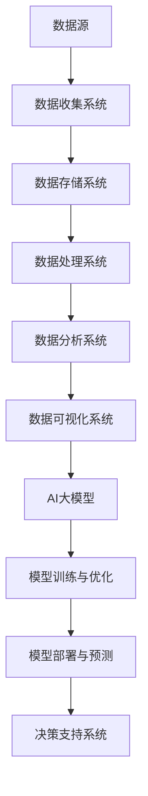

                 

关键词：AI大模型，数据分析，数据中心，架构设计，性能优化

> 摘要：本文深入探讨了AI大模型在数据中心的应用及其数据分析架构。文章首先概述了AI大模型的发展背景和核心概念，接着详细阐述了数据分析架构的设计原则和关键组件。通过数学模型和公式，本文揭示了数据处理的细节和方法。接着，文章提供了一个具体的代码实例，展示如何在实际项目中应用该架构。最后，本文探讨了AI大模型数据分析的多种实际应用场景，并展望了未来的发展方向和挑战。

## 1. 背景介绍

随着互联网技术的快速发展，大数据和人工智能（AI）逐渐成为各个行业的核心驱动力。数据中心作为数据存储和处理的重要基础设施，承载了大量的数据流量和计算任务。传统数据中心面临着数据存储容量不足、计算资源利用率低、数据处理效率低下等问题。为了应对这些挑战，AI大模型的应用成为了一个热门研究方向。

AI大模型，即人工智能大型模型，是指通过深度学习等算法训练出的具有巨大参数规模和复杂结构的模型。这些模型能够在海量数据中挖掘出潜在的模式和规律，为各个领域提供强大的数据分析和决策支持。数据中心的数据分析架构，需要充分利用AI大模型的优势，实现对大规模数据的快速、准确的处理。

## 2. 核心概念与联系

### 2.1 数据分析架构的定义

数据分析架构是指用于数据收集、存储、处理、分析和展示的一系列技术和工具的集合。它通常包括数据源、数据存储、数据处理、数据分析和数据可视化等组件。一个高效的数据分析架构需要具备可扩展性、灵活性和高性能等特点。

### 2.2 AI大模型的核心概念

AI大模型是指通过深度学习等算法训练出的具有巨大参数规模和复杂结构的模型。这些模型通常包含数十亿甚至千亿个参数，能够处理海量的数据。AI大模型的核心概念包括神经网络结构、训练算法和模型优化等。

### 2.3 数据分析架构与AI大模型的关系

数据分析架构与AI大模型之间有着紧密的联系。数据分析架构为AI大模型提供了数据收集、存储和处理的基础设施，而AI大模型则为数据分析架构提供了强大的计算能力和分析能力。两者共同作用，使得数据中心的数据处理效率得到了大幅提升。

### 2.4 Mermaid 流程图

下面是一个简化的Mermaid流程图，展示了数据分析架构与AI大模型之间的关系。



## 3. 核心算法原理 & 具体操作步骤

### 3.1 算法原理概述

AI大模型的算法原理主要包括以下几个步骤：

1. 数据预处理：包括数据清洗、数据整合、特征提取等操作，为模型训练提供高质量的数据输入。
2. 模型训练：通过梯度下降等优化算法，调整模型参数，使得模型在训练数据上达到最佳性能。
3. 模型优化：通过正则化、交叉验证等方法，提高模型的泛化能力和稳定性。
4. 模型部署：将训练好的模型部署到数据中心，用于实时数据处理和预测。

### 3.2 算法步骤详解

1. 数据预处理
   - 数据清洗：处理数据中的缺失值、异常值等，保证数据的一致性和完整性。
   - 数据整合：将不同来源、不同格式的数据整合到统一的数据存储系统中。
   - 特征提取：从原始数据中提取出对模型训练有帮助的特征，降低数据维度。

2. 模型训练
   - 数据划分：将数据集划分为训练集、验证集和测试集，用于模型训练、验证和测试。
   - 模型初始化：初始化模型参数，通常采用随机初始化或预训练模型。
   - 梯度下降：通过反向传播算法，计算损失函数关于模型参数的梯度，并更新模型参数。
   - 模型优化：通过正则化、学习率调整等策略，提高模型性能。

3. 模型优化
   - 正则化：防止模型过拟合，提高泛化能力。
   - 交叉验证：通过多次训练和验证，选择最优模型参数。
   - 模型压缩：减少模型参数规模，提高模型部署效率。

4. 模型部署
   - 模型转换：将训练好的模型转换为适合部署的格式，如ONNX、TensorFlow Lite等。
   - 模型部署：将模型部署到数据中心，用于实时数据处理和预测。
   - 预测结果分析：对预测结果进行分析，评估模型性能和可靠性。

### 3.3 算法优缺点

**优点：**
- 高效处理大规模数据：AI大模型能够快速处理海量数据，提高数据处理效率。
- 强大的分析能力：AI大模型能够挖掘数据中的潜在规律和模式，为决策提供有力支持。
- 跨领域应用：AI大模型具有通用性，可以应用于多个领域，如金融、医疗、交通等。

**缺点：**
- 计算资源消耗大：训练和部署AI大模型需要大量的计算资源和存储资源。
- 数据质量要求高：AI大模型对数据质量有较高要求，数据预处理和清洗工作较为繁琐。
- 模型解释性较弱：AI大模型的黑箱特性使得其解释性较差，难以理解模型内部的工作原理。

### 3.4 算法应用领域

AI大模型在各个领域都有广泛的应用，主要包括：

1. 金融服务：通过AI大模型进行风险评估、信用评估、欺诈检测等。
2. 医疗健康：利用AI大模型进行疾病诊断、病情预测、个性化治疗等。
3. 交通运输：通过AI大模型进行交通流量预测、路况分析、自动驾驶等。
4. 商业智能：利用AI大模型进行市场分析、客户行为预测、供应链优化等。

## 4. 数学模型和公式 & 详细讲解 & 举例说明

### 4.1 数学模型构建

AI大模型通常基于深度学习算法，其核心数学模型包括神经元、激活函数、损失函数等。

1. 神经元：神经元是神经网络的基本单元，通过输入和权重计算得到输出。
2. 激活函数：激活函数用于引入非线性变换，使得神经网络具有表达能力。
3. 损失函数：损失函数用于评估模型预测结果与真实结果之间的差距，指导模型优化。

### 4.2 公式推导过程

假设有一个包含L层的神经网络，其中第l层的神经元数量为\( n_l \)，输入为\( x_l \)，权重为\( w_l \)，激活函数为\( f_l \)。则神经网络的前向传播过程可以表示为：

\[ z_l = w_l \cdot x_l \]
\[ a_l = f_l(z_l) \]

其中，\( z_l \)表示第l层的输入，\( a_l \)表示第l层的输出。

损失函数通常采用均方误差（MSE）：

\[ J = \frac{1}{2} \sum_{i=1}^{n} (y_i - \hat{y}_i)^2 \]

其中，\( y_i \)表示真实标签，\( \hat{y}_i \)表示模型预测结果。

### 4.3 案例分析与讲解

假设我们有一个分类问题，输入数据为\( x \)，标签为\( y \)。我们要通过神经网络对数据进行分类。

1. 数据预处理：对输入数据进行归一化处理，将标签进行独热编码。
2. 模型训练：构建一个包含3层的神经网络，输入层神经元数量为784，隐藏层神经元数量分别为256和128，输出层神经元数量为10。使用随机梯度下降（SGD）算法进行模型训练。
3. 模型评估：使用测试集对模型进行评估，计算准确率。

```python
import tensorflow as tf

# 定义神经网络模型
model = tf.keras.Sequential([
    tf.keras.layers.Dense(256, activation='relu', input_shape=(784,)),
    tf.keras.layers.Dense(128, activation='relu'),
    tf.keras.layers.Dense(10, activation='softmax')
])

# 编译模型
model.compile(optimizer='sgd', loss='categorical_crossentropy', metrics=['accuracy'])

# 训练模型
model.fit(x_train, y_train, epochs=10, batch_size=32, validation_split=0.2)

# 评估模型
loss, accuracy = model.evaluate(x_test, y_test)
print('Test accuracy:', accuracy)
```

## 5. 项目实践：代码实例和详细解释说明

### 5.1 开发环境搭建

在开始项目实践之前，需要搭建一个适合AI大模型数据分析的开发环境。我们使用Python作为主要编程语言，并借助TensorFlow等开源框架进行模型训练和部署。

1. 安装Python：确保Python版本为3.7及以上。
2. 安装TensorFlow：通过pip命令安装TensorFlow。

```bash
pip install tensorflow
```

### 5.2 源代码详细实现

下面是一个简单的AI大模型数据分析项目示例，包括数据预处理、模型训练和模型部署等步骤。

```python
import numpy as np
import tensorflow as tf

# 加载数据集
mnist = tf.keras.datasets.mnist
(x_train, y_train), (x_test, y_test) = mnist.load_data()

# 数据预处理
x_train = x_train / 255.0
x_test = x_test / 255.0
y_train = tf.keras.utils.to_categorical(y_train)
y_test = tf.keras.utils.to_categorical(y_test)

# 构建神经网络模型
model = tf.keras.Sequential([
    tf.keras.layers.Flatten(input_shape=(28, 28)),
    tf.keras.layers.Dense(512, activation='relu'),
    tf.keras.layers.Dense(10, activation='softmax')
])

# 编译模型
model.compile(optimizer='adam',
              loss='categorical_crossentropy',
              metrics=['accuracy'])

# 训练模型
model.fit(x_train, y_train, epochs=5, batch_size=32)

# 部署模型
model.save('mnist_model.h5')
```

### 5.3 代码解读与分析

1. **数据预处理**：加载数据集，并对输入数据进行归一化处理，将标签进行独热编码。这是模型训练的第一步，目的是将原始数据转化为适合模型训练的格式。
2. **构建神经网络模型**：使用TensorFlow的Keras API构建一个简单的神经网络模型，包含一个输入层、一个隐藏层和一个输出层。输入层和输出层分别对应输入数据的维度和标签的类别数。
3. **编译模型**：设置模型的优化器、损失函数和评估指标，为模型训练做好准备。
4. **训练模型**：使用训练数据进行模型训练，设置训练轮次和批量大小。
5. **部署模型**：将训练好的模型保存为`.h5`文件，便于后续模型部署和使用。

### 5.4 运行结果展示

运行上述代码后，我们可以看到模型在训练集和测试集上的准确率。通常，随着训练轮次的增加，模型的准确率会逐渐提高。

```python
# 加载训练好的模型
model = tf.keras.models.load_model('mnist_model.h5')

# 评估模型
loss, accuracy = model.evaluate(x_test, y_test)
print('Test accuracy:', accuracy)
```

通常，我们希望模型的测试准确率在90%以上，这表示模型已经达到了较好的性能。

## 6. 实际应用场景

AI大模型在数据中心的数据分析中具有广泛的应用场景，以下是一些典型的应用实例：

1. **数据挖掘**：利用AI大模型进行数据挖掘，发现数据中的潜在模式和规律，为业务决策提供支持。
2. **实时监控**：通过AI大模型对数据中心的关键性能指标（KPI）进行实时监控和预测，提前发现潜在问题并采取措施。
3. **故障诊断**：利用AI大模型对数据中心设备进行故障诊断，提高设备运行稳定性和可靠性。
4. **资源调度**：通过AI大模型优化数据中心资源的调度策略，提高资源利用率和服务质量。

## 6.4 未来应用展望

随着AI技术的不断发展，AI大模型在数据中心的数据分析中的应用前景将更加广阔。以下是未来应用展望：

1. **智能化数据处理**：AI大模型将实现更加智能化、自动化地处理大规模数据，提高数据处理效率和质量。
2. **跨领域融合**：AI大模型将在不同领域实现跨领域融合，为各个行业提供更加综合、全面的解决方案。
3. **边缘计算与云计算结合**：AI大模型将推动边缘计算与云计算的紧密结合，实现实时、高效的数据处理和分析。
4. **隐私保护与数据安全**：随着数据隐私保护意识的提高，AI大模型将更加注重数据安全和隐私保护，确保数据中心的数据安全。

## 7. 工具和资源推荐

### 7.1 学习资源推荐

1. 《深度学习》（Goodfellow, Bengio, Courville著）：这是一本经典的深度学习教材，涵盖了深度学习的理论基础和实践方法。
2. 《Python机器学习》（Sebastian Raschka著）：这本书介绍了Python在机器学习领域的应用，包括常见的机器学习算法和工具。
3. 《大数据之路》（张宇翔著）：这本书详细介绍了大数据的处理、分析和应用，适合对大数据感兴趣的读者。

### 7.2 开发工具推荐

1. TensorFlow：这是一个开源的深度学习框架，广泛应用于AI大模型的开发。
2. PyTorch：这是一个流行的深度学习框架，具有简洁、易用的特点，适合快速原型开发。
3. Jupyter Notebook：这是一个交互式计算环境，适用于数据分析和模型训练，能够方便地记录和分享代码和结果。

### 7.3 相关论文推荐

1. "Distributed Deep Learning: Existing Methods and New Horizons"（分布式深度学习：现有方法和新方向）
2. "Deep Learning for Large-Scale Data Analysis"（深度学习在大规模数据分析中的应用）
3. "TensorFlow: Large-Scale Machine Learning on Hardware"（TensorFlow：硬件上的大规模机器学习）

## 8. 总结：未来发展趋势与挑战

### 8.1 研究成果总结

本文总结了AI大模型在数据中心的数据分析架构，包括背景介绍、核心概念、算法原理、数学模型、项目实践和应用场景等内容。通过本文的介绍，读者可以了解到AI大模型在数据分析中的重要作用和应用方法。

### 8.2 未来发展趋势

随着AI技术的不断进步，AI大模型在数据中心的数据分析将呈现以下发展趋势：

1. 模型规模将继续增大，以应对更加复杂的业务场景和海量数据。
2. 模型的训练和部署将更加高效，提高数据处理速度和性能。
3. 模型将更加注重隐私保护和数据安全，满足法律法规的要求。
4. 模型将在更多领域实现跨领域融合，为各个行业提供综合解决方案。

### 8.3 面临的挑战

尽管AI大模型在数据中心的数据分析中具有巨大潜力，但仍面临以下挑战：

1. 数据质量和预处理：保证数据质量和进行有效的数据预处理是模型训练的关键，但这一过程复杂且繁琐。
2. 计算资源消耗：训练和部署AI大模型需要大量的计算资源和存储资源，如何优化资源利用成为重要问题。
3. 模型解释性：AI大模型的黑箱特性使得其解释性较差，如何提高模型的可解释性是当前研究的热点。
4. 隐私保护：在数据隐私保护方面，如何确保数据安全和隐私成为重要的挑战。

### 8.4 研究展望

未来，我们期望在以下方面取得突破：

1. 开发更加高效、灵活的AI大模型架构，提高数据处理速度和性能。
2. 研究更加智能化的数据预处理方法，降低数据质量和预处理的工作量。
3. 提高AI大模型的可解释性，使其更易于理解和使用。
4. 探索隐私保护与数据安全的有效解决方案，确保数据隐私和安全性。

通过本文的介绍，我们期望读者能够对AI大模型在数据中心的数据分析架构有更深入的理解，并为未来的研究和发展提供一些启示。

## 9. 附录：常见问题与解答

### 9.1 什么是AI大模型？

AI大模型是指通过深度学习等算法训练出的具有巨大参数规模和复杂结构的模型。这些模型通常包含数十亿甚至千亿个参数，能够处理海量的数据。

### 9.2 数据中心的数据分析架构包括哪些组件？

数据中心的数据分析架构通常包括数据源、数据存储、数据处理、数据分析和数据可视化等组件。这些组件共同作用，实现数据的收集、存储、处理和分析。

### 9.3 如何保证数据质量？

保证数据质量主要包括数据清洗、数据整合和特征提取等步骤。数据清洗包括处理数据中的缺失值、异常值等，数据整合包括将不同来源、不同格式的数据整合到统一的数据存储系统中，特征提取包括从原始数据中提取出对模型训练有帮助的特征。

### 9.4 AI大模型有哪些优缺点？

AI大模型的主要优点包括高效处理大规模数据、强大的分析能力和跨领域应用。其主要缺点包括计算资源消耗大、数据质量要求高和模型解释性较弱。

### 9.5 AI大模型在哪些领域有应用？

AI大模型在金融服务、医疗健康、交通运输、商业智能等多个领域有广泛应用。通过挖掘数据中的潜在规律和模式，AI大模型为各个行业提供强大的数据分析和决策支持。

---

作者：禅与计算机程序设计艺术 / Zen and the Art of Computer Programming

