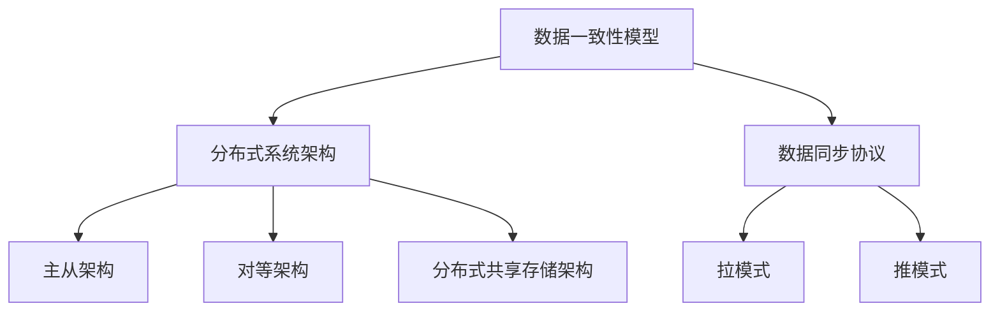

                 

### 1. 背景介绍

在当今信息技术飞速发展的时代，数据中心已经成为各行各业的核心基础设施。随着人工智能（AI）技术的迅速崛起，大模型应用在数据中心中变得日益重要。大模型应用不仅包括深度学习框架如TensorFlow和PyTorch的训练与推理，还涵盖了自然语言处理（NLP）、图像识别、语音识别等领域的高级应用。这些应用对数据的一致性和实时性提出了极高的要求。

然而，数据中心内部的数据同步问题成为了制约大模型应用性能的关键瓶颈。数据同步的目的是确保多个节点之间的数据一致性，这对于分布式训练和推理尤为重要。数据同步问题涉及多个层面，包括网络传输、存储系统、数据格式和一致性保障机制等。本篇文章将深入探讨AI大模型应用数据中心的数据同步问题，旨在为解决这一难题提供一套系统性、可操作的解决方案。

首先，数据中心的数据同步问题涉及到多个层面的挑战。从技术层面来看，如何在保证数据传输速度的同时，确保数据的一致性和完整性，是一个亟待解决的问题。其次，在应用层面，如何根据不同的大模型应用场景，设计出高效的数据同步策略，也是一项重要任务。此外，数据中心的高可用性和安全性也是数据同步需要考虑的重要因素。

本文将按照以下结构展开：

1. **背景介绍**：阐述数据中心在大模型应用中的重要性以及数据同步问题的背景。
2. **核心概念与联系**：介绍与数据同步相关的核心概念，并通过Mermaid流程图展示其原理和架构。
3. **核心算法原理 & 具体操作步骤**：详细讲解数据同步的核心算法原理和具体实施步骤。
4. **数学模型和公式 & 详细讲解 & 举例说明**：介绍数据同步相关的数学模型和公式，并通过实例进行详细讲解。
5. **项目实践：代码实例和详细解释说明**：提供实际的代码实例，并进行详细解释和分析。
6. **实际应用场景**：分析数据同步在实际应用中的具体场景和解决方案。
7. **工具和资源推荐**：推荐相关学习资源、开发工具和框架。
8. **总结：未来发展趋势与挑战**：总结数据同步技术的发展趋势和面临的挑战。
9. **附录：常见问题与解答**：回答读者可能遇到的问题。
10. **扩展阅读 & 参考资料**：提供扩展阅读和参考资料。

通过上述结构的逐步分析，我们将深入探讨数据中心数据同步的各个方面，为读者提供全面、系统的指导。

### 1.1 数据中心在大模型应用中的重要性

数据中心作为信息化基础设施的核心，承载着大量数据存储、处理和传输的任务。在大模型应用中，数据中心的作用尤为关键。随着深度学习、自然语言处理、图像识别等领域的不断深入，大模型需要处理的数据量呈指数级增长。数据中心作为数据存储和处理的主要场所，其性能直接影响大模型的应用效果和效率。

首先，数据中心提供了大规模的数据存储能力。大模型训练和推理过程中，需要处理的数据量庞大且复杂，数据中心的高存储容量能够满足这些需求。同时，数据中心的分布式存储架构，能够提供高可用性和高扩展性，确保数据的安全性和可靠性。

其次，数据中心的计算能力也是大模型应用的重要支撑。大模型训练和推理需要强大的计算资源，数据中心通过集群计算和分布式处理技术，能够提供高效的计算能力。这不仅能够加速大模型的训练过程，还能提高推理的实时性，满足实时应用的需求。

此外，数据中心在网络传输方面也发挥着重要作用。大模型应用需要频繁的数据传输，数据中心的高带宽网络能够保证数据传输的速度和稳定性，减少延迟和丢包现象，从而提升应用的性能。

然而，随着大模型应用规模的不断扩大，数据中心也面临着数据同步的挑战。数据同步的目的是确保分布式环境中的数据一致性，这对于大模型的训练和推理至关重要。不一致的数据会导致模型训练结果偏差，影响应用的准确性；同时，数据不同步也会增加数据传输的复杂度，降低系统的整体性能。

总之，数据中心在大模型应用中扮演着至关重要的角色。它不仅提供了必要的存储、计算和网络资源，还通过数据同步技术确保了数据的一致性和实时性，为高质量的大模型应用奠定了基础。

### 1.2 数据同步问题的核心挑战

在数据中心中实现大模型应用的数据同步，面临着一系列核心挑战，这些挑战主要集中在数据的一致性、实时性、可靠性和高效性等方面。

**1. 数据一致性**：确保多个节点之间的数据保持一致，是数据同步的首要目标。在大模型应用中，数据一致性问题尤为突出。例如，在分布式训练过程中，多个节点并行处理数据，若数据不一致，会导致模型训练结果的偏差，降低模型的准确性。此外，数据更新时，如何确保所有节点能够及时更新数据，也是数据一致性需要解决的关键问题。

**2. 实时性**：数据同步需要保证数据在不同节点之间的传输和更新能够实时完成。在大模型应用中，实时性至关重要，特别是在需要实时决策和响应的场景中，如自动驾驶、实时语音识别等。若数据同步延迟，将导致系统反应迟钝，影响应用的实时性和用户体验。

**3. 可靠性**：数据同步的可靠性是保障系统稳定运行的基础。在大规模数据中心中，网络环境复杂，数据传输过程中可能会遇到各种故障和异常，如网络中断、数据丢失等。如何确保数据传输的可靠性和数据的完整性，是数据同步需要面对的挑战。

**4. 高效性**：数据同步需要高效地完成数据传输和更新，以降低系统的整体延迟和资源消耗。在大模型应用中，数据量庞大，若同步策略不够高效，会导致系统性能下降，影响应用的效率。因此，设计高效的数据同步算法和策略，是提升系统性能的关键。

针对上述挑战，数据中心的数据同步技术需要从以下几个方面进行优化：

**1. 网络优化**：通过优化网络传输路径和协议，提高数据传输的速度和稳定性。例如，使用网络优化算法和负载均衡技术，优化数据传输流量，减少延迟和丢包现象。

**2. 数据库优化**：优化数据库系统，提升数据的读写速度和并发处理能力。通过使用分布式数据库和缓存技术，提高数据访问的效率，减少数据同步的时间。

**3. 一致性保障机制**：设计一系列一致性保障机制，如分布式锁、多版本并发控制（MVCC）、两阶段提交（2PC）等，确保数据的一致性和可靠性。同时，通过日志记录和回滚机制，应对数据同步过程中的异常和故障。

**4. 高效同步算法**：设计高效的数据同步算法，如基于哈希表的数据分布算法、增量同步算法等，减少数据传输和更新的开销。通过分片和并行处理技术，提升系统的整体性能。

通过以上措施，数据中心的数据同步技术能够应对大模型应用带来的挑战，实现数据的高效、一致和可靠的同步，为高质量的大模型应用提供坚实的基础。

### 2. 核心概念与联系

在探讨数据中心的数据同步问题之前，我们需要先了解一些核心概念及其相互关系。以下是数据同步相关的主要概念，包括数据一致性模型、分布式系统架构和数据同步协议等。

#### 2.1 数据一致性模型

数据一致性模型是确保分布式系统中数据一致性的关键机制。常见的数据一致性模型包括强一致性（Strong Consistency）、最终一致性（Eventual Consistency）和因果一致性（Causal Consistency）。

1. **强一致性（Strong Consistency）**：在强一致性模型下，分布式系统中的所有节点在同一时刻看到的都是相同的最新数据。这种一致性模型能够确保数据在所有节点上的完全一致，但通常以较高的延迟和资源消耗为代价。

2. **最终一致性（Eventual Consistency）**：最终一致性模型允许系统中的节点在不同时间看到不同的数据，但最终会收敛到一致状态。这种模型提供了更高的可用性和扩展性，但可能会在短时间内出现不一致的情况。

3. **因果一致性（Causal Consistency）**：因果一致性模型确保因果关系的正确传递，即如果一个操作对某个节点上的数据产生影响，那么后续的所有操作都会看到这个影响。这种模型在保持一致性方面提供了比最终一致性更高的保证。

#### 2.2 分布式系统架构

分布式系统架构是支持数据中心数据同步的基础。常见的分布式系统架构包括主从架构、对等架构和分布式共享存储架构。

1. **主从架构（Master-Slave Architecture）**：在这种架构中，系统有一个主节点（Master）负责管理数据，其他从节点（Slaves）负责执行操作。主节点负责接收和处理所有请求，然后将结果同步到从节点。这种架构保证了数据的一致性，但主节点成为系统的单点故障。

2. **对等架构（Peer-to-Peer Architecture）**：对等架构中，所有节点都是平等的，没有主从之分。每个节点都可以同时接收和处理请求，并将结果同步给其他节点。这种架构提供了更高的可用性和扩展性，但实现复杂，需要解决数据一致性和负载均衡问题。

3. **分布式共享存储架构（Distributed Shared Storage Architecture）**：在这种架构中，所有节点共享同一个存储系统。数据同步发生在存储系统内部，节点通过访问共享存储来实现数据同步。这种架构提供了较高的数据一致性和可靠性，但需要优化存储系统的性能和访问效率。

#### 2.3 数据同步协议

数据同步协议是确保数据在不同节点之间一致性和实时性的关键技术。常见的数据同步协议包括拉模式（Pull Model）和推模式（Push Model）。

1. **拉模式（Pull Model）**：在拉模式下，节点主动从其他节点获取数据。这种模式需要节点定期轮询其他节点的状态，并根据需要获取最新的数据。拉模式适用于数据量较小、一致性要求不高的场景，但可能会产生较高的延迟。

2. **推模式（Push Model）**：在推模式下，节点向其他节点推送数据。当数据发生变化时，节点主动通知其他节点，并同步最新的数据。这种模式适用于数据量较大、实时性要求高的场景，但可能会增加网络负载。

为了更好地理解这些概念，我们可以通过Mermaid流程图展示数据同步的原理和架构。



通过上述核心概念和关系的介绍，我们可以看到，数据同步是一个复杂而重要的过程，涉及多个层面的技术和算法。了解这些概念和关系，有助于我们更深入地探讨数据同步的具体实现方法和优化策略。

#### 2.4 数据同步的关键技术

在数据中心实现高效数据同步，需要依赖于一系列关键技术，包括分布式存储系统、数据复制和分布式一致性算法。这些技术共同作用，确保数据在不同节点之间的一致性、可靠性和实时性。

**1. 分布式存储系统**

分布式存储系统是数据中心数据同步的基础。它通过将数据分布在多个节点上，提供高可用性、高扩展性和高性能。常见的分布式存储系统包括Hadoop、HDFS、Cassandra和Google File System等。

分布式存储系统的核心挑战在于如何确保数据的一致性和可靠性。分布式存储系统通常采用副本机制，即在每个数据块上保留多个副本。通过副本机制，系统能够容忍节点故障，并在需要时自动恢复数据。同时，分布式存储系统还需要实现数据的负载均衡，确保数据在各个节点之间的均衡分布，避免某些节点过载。

**2. 数据复制**

数据复制是分布式系统中确保数据一致性的重要技术。数据复制可以分为同步复制和异步复制。

- **同步复制（Synchronous Replication）**：在同步复制中，数据在被写入主节点后，必须立即复制到所有副本节点，只有当所有副本节点都确认成功接收数据后，写入操作才被认为是成功的。同步复制能够提供强一致性保证，但可能会增加系统的延迟和资源消耗。

- **异步复制（Asynchronous Replication）**：在异步复制中，数据在被写入主节点后，会立即复制到部分副本节点，而不需要等待所有副本节点的确认。异步复制能够提高系统的性能和吞吐量，但可能会在一段时间内出现数据不一致的情况。

为了平衡一致性和性能，分布式系统通常采用混合复制策略，即根据数据的重要性和一致性要求，选择适当的同步和异步复制方式。

**3. 分布式一致性算法**

分布式一致性算法是确保分布式系统中数据一致性的核心技术。常见的一致性算法包括Paxos算法、Raft算法和Zookeeper等。

- **Paxos算法**：Paxos算法是一种用于分布式系统中达成一致性的经典算法。它通过选举领导者（Learner）和投票机制，确保所有节点能够达成一致。Paxos算法能够提供强一致性保证，但在大规模系统中可能会出现性能瓶颈。

- **Raft算法**：Raft算法是一种改进的分布式一致性算法，它通过日志复制和领导选举机制，确保系统的一致性和高可用性。Raft算法相比Paxos算法，具有更好的性能和可理解性，被广泛应用于分布式系统中。

- **Zookeeper**：Zookeeper是一个分布式协调服务，它通过Zab协议（ZooKeeper Atomic Broadcast）实现分布式一致性。Zookeeper主要用于同步和协调分布式应用中的各种操作，如选举、锁和队列等。

通过分布式存储系统、数据复制和分布式一致性算法的结合，数据中心能够实现高效的数据同步，确保数据的一致性和可靠性。

**4. 实时数据同步**

除了上述关键技术，实时数据同步在数据中心中也扮演着重要角色。实时数据同步旨在实现数据在不同节点之间的实时传输和更新，以满足实时应用的需求。

实时数据同步的关键技术包括分布式流处理框架（如Apache Kafka、Apache Flink）和实时数据库（如Redis、MongoDB）。分布式流处理框架能够实现大规模数据流的实时处理和分析，而实时数据库则能够提供高效的读写操作和持久化能力。

为了实现实时数据同步，数据中心通常采用以下策略：

- **事件驱动架构**：通过事件驱动架构，实现数据的实时同步。当数据发生变化时，系统会触发事件，并将事件传递到其他节点，实现数据的实时更新。

- **增量同步**：采用增量同步技术，只同步数据的变化部分，而不是整个数据集。增量同步能够显著减少数据传输量和同步时间，提高系统的实时性。

- **异步处理**：通过异步处理技术，实现数据的批量同步和延迟处理。异步处理能够减少系统的延迟和资源消耗，提高系统的实时性能。

综上所述，数据中心的数据同步是一个复杂而关键的过程，涉及分布式存储系统、数据复制、分布式一致性算法和实时数据同步等多个层面。通过结合这些关键技术，数据中心能够实现高效、一致和可靠的数据同步，为高质量的大模型应用提供坚实的技术保障。

### 3. 核心算法原理 & 具体操作步骤

数据同步的核心算法在确保数据一致性和实时性方面起到了关键作用。以下是几种常见的数据同步算法及其具体操作步骤：

#### 3.1 两阶段提交（2PC）

两阶段提交（Two-Phase Commit，2PC）是一种经典的分布式一致性算法，广泛应用于分布式数据库系统中。其基本原理是在分布式事务中，通过两阶段协议确保所有节点在同一时刻对数据一致性达成一致。

**具体操作步骤**：

1. **预备阶段（Prepare Phase）**：
   - 事务协调者（Coordinator）向所有参与者（Participants）发送预备请求，请求参与者在本地准备好事务，但暂时不提交。
   - 各参与者收到预备请求后，进行本地预提交检查，如果检查通过，则将事务放入预备队列，并给协调者发送预备响应。

2. **提交阶段（Commit Phase）**：
   - 协调者收集所有参与者的预备响应。如果所有参与者都返回了成功的预备响应，则协调者向所有参与者发送提交请求，指示参与者进行事务提交。
   - 如果协调者收到任何失败的预备响应，或者系统在预备阶段发生故障，则协调者向所有参与者发送回滚请求，指示参与者进行事务回滚。

**优点**：
- 简单易懂，易于实现。
- 能够确保分布式事务的强一致性。

**缺点**：
- 可能导致单点故障，即协调者成为系统的单点故障。
- 高延迟和高资源消耗。

#### 3.2 三阶段提交（3PC）

三阶段提交（Three-Phase Commit，3PC）是对两阶段提交的改进，旨在解决协调者单点故障问题，提高系统的可用性和容错性。

**具体操作步骤**：

1. **准备阶段（Prepare Phase）**：
   - 协调者向所有参与者发送预备请求，请求参与者准备事务。
   - 各参与者收到预备请求后，进行本地预提交检查，如果检查通过，则将事务放入预备队列，并给协调者发送预备响应。

2. **提交阶段（Commit Phase）**：
   - 协调者收到所有参与者的预备响应后，进入提交阶段。
   - 协调者向所有参与者发送提交请求，指示参与者进行事务提交。

3. **确认阶段（Confirm Phase）**：
   - 各参与者收到提交请求后，进行最终确认。
   - 如果所有参与者都确认成功，则协调者和参与者将事务提交到本地数据库。
   - 如果任何参与者确认失败，则协调者和参与者将事务回滚。

**优点**：
- 解决了协调者单点故障问题，提高了系统的可用性。
- 相对两阶段提交，延迟较低。

**缺点**：
- 复杂性增加，实现难度大。
- 可能导致循环等待。

#### 3.3 Paxos算法

Paxos算法是一种用于分布式系统中达成一致性的经典算法。它通过选举领导者（Learner）和投票机制，确保所有节点在同一时刻对数据一致性达成一致。

**具体操作步骤**：

1. **提出提案（Proposal Phase）**：
   - 事务协调者（Proposer）生成一个提案，包含一个提案号和值，并发送给集群中的所有节点。

2. **接受投票（Accept Phase）**：
   - 节点（Learner）收到提案后，将其记录在自己的日志中，并发送接受响应给Proposer。

3. **决定投票（Decide Phase）**：
   - Proposer收集足够的接受响应后，发送决定请求给所有节点，指示它们将提案值作为决定值。
   - 所有节点收到决定请求后，将提案值写入本地数据库。

**优点**：
- 能够在分布式系统中实现一致性，具有高度容错性。
- 算法简单，易于理解和实现。

**缺点**：
- 复杂性较高，实现难度大。
- 需要频繁进行投票和选举，可能影响性能。

#### 3.4 Raft算法

Raft算法是一种改进的分布式一致性算法，通过日志复制和领导选举机制，确保系统的一致性和高可用性。

**具体操作步骤**：

1. **领导选举（Leader Election Phase）**：
   - 当当前领导节点失效时，集群中的其他节点开始进行领导选举。
   - 节点发送心跳消息，并监听其他节点的心跳消息。
   - 当一个节点收到超过一半节点的心跳消息时，它宣布自己为领导节点。

2. **日志复制（Log Replication Phase）**：
   - 领导节点将日志条目发送给其他节点，要求它们将日志条目追加到本地日志中。
   - 其他节点收到日志条目后，将日志条目追加到本地日志，并返回确认响应给领导节点。

3. **决定日志条目（Log Decision Phase）**：
   - 领导节点将日志条目发送给所有节点，要求它们将日志条目标记为决定状态。
   - 所有节点收到日志条目后，将日志条目标记为决定状态。

**优点**：
- 相对Paxos算法，实现简单，易于理解和实现。
- 具有更好的性能和可扩展性。

**缺点**：
- 相对Paxos算法，复杂度较高。

通过以上几种核心算法的介绍，我们可以看到，每种算法都有其独特的优势和适用场景。在实际应用中，可以根据具体需求和场景，选择合适的算法来实现数据同步，确保数据的一致性和可靠性。

### 4. 数学模型和公式 & 详细讲解 & 举例说明

在数据同步过程中，数学模型和公式起着至关重要的作用，它们帮助我们量化分析数据同步的效率和一致性。以下将介绍几种常见的数学模型和公式，并通过具体实例进行详细讲解。

#### 4.1 误差率模型

误差率模型用于衡量数据同步过程中的数据误差。误差率是指数据同步过程中出现的错误数据占总数据量的比例。误差率模型的核心公式如下：

\[ E = \frac{E_d}{D} \]

其中，\( E \) 表示误差率，\( E_d \) 表示错误数据量，\( D \) 表示总数据量。

**实例讲解**：

假设在数据同步过程中，共有1000条数据，其中10条数据出现了错误。根据上述公式，可以计算误差率：

\[ E = \frac{10}{1000} = 0.01 \]

即误差率为1%。

误差率模型能够帮助我们了解数据同步过程中数据的准确性，为后续的数据处理和模型训练提供参考。

#### 4.2 延迟模型

延迟模型用于衡量数据同步过程中的延迟时间。延迟时间是指数据从源节点传输到目标节点所需的时间。延迟模型的核心公式如下：

\[ L = \frac{D}{R} \]

其中，\( L \) 表示延迟时间，\( D \) 表示数据传输距离，\( R \) 表示数据传输速率。

**实例讲解**：

假设数据传输距离为100公里，数据传输速率为10 Mbps（兆比特每秒）。根据上述公式，可以计算延迟时间：

\[ L = \frac{100 \times 1000}{10 \times 10^6} = 0.1 \text{秒} \]

即延迟时间为0.1秒。

延迟模型能够帮助我们评估数据同步过程中的传输效率，为网络优化和性能提升提供依据。

#### 4.3 一致性模型

一致性模型用于衡量数据同步过程中数据的一致性。一致性是指数据在源节点和目标节点之间保持同步的程度。一致性模型的核心公式如下：

\[ C = \frac{D_c}{D_s} \]

其中，\( C \) 表示一致性程度，\( D_c \) 表示一致性数据量，\( D_s \) 表示总数据量。

**实例讲解**：

假设在数据同步过程中，共有1000条数据，其中900条数据保持了一致性。根据上述公式，可以计算一致性程度：

\[ C = \frac{900}{1000} = 0.9 \]

即一致性程度为90%。

一致性模型能够帮助我们了解数据同步过程中数据的一致性水平，为数据同步策略的优化提供参考。

#### 4.4 数据同步效率模型

数据同步效率模型用于衡量数据同步过程中资源的使用效率。数据同步效率是指数据同步过程中资源利用率的高低。数据同步效率模型的核心公式如下：

\[ E_e = \frac{L_c \times D_c}{L_s \times D_s} \]

其中，\( E_e \) 表示数据同步效率，\( L_c \) 表示一致性数据量，\( D_c \) 表示一致性数据量，\( L_s \) 表示总数据量，\( D_s \) 表示总数据量。

**实例讲解**：

假设在数据同步过程中，一致性数据量为900条，总数据量为1000条，根据上述公式，可以计算数据同步效率：

\[ E_e = \frac{900 \times 900}{1000 \times 1000} = 0.81 \]

即数据同步效率为81%。

数据同步效率模型能够帮助我们评估数据同步过程中资源的使用效率，为系统优化提供依据。

通过上述数学模型和公式的详细讲解，我们可以更好地理解数据同步过程中的关键指标，并为优化数据同步策略提供理论支持。在实际应用中，可以根据具体需求和场景，灵活运用这些模型和公式，实现高效、一致和可靠的数据同步。

### 5. 项目实践：代码实例和详细解释说明

为了更好地理解数据同步在实际应用中的具体实现，我们将在这一部分提供一个完整的代码实例，并对代码的各个部分进行详细解释和分析。

#### 5.1 开发环境搭建

在开始编写代码之前，我们需要搭建一个适合数据同步项目开发的环境。以下是一个基本的开发环境配置：

- 操作系统：Linux（推荐使用Ubuntu 20.04）
- 编程语言：Python 3.8
- 数据同步框架：Apache Kafka（用于实时数据同步）
- 数据库：MySQL（用于存储同步数据）

安装步骤如下：

1. 安装Python 3.8：

```bash
sudo apt update
sudo apt install python3.8
```

2. 安装Apache Kafka：

```bash
# 安装Kafka依赖
sudo apt install default-jdk
sudo apt install build-essential

# 下载并解压Kafka
wget https://www-eu.apache.org/dist/kafka/2.8.0/kafka_2.12-2.8.0.tgz
tar xzf kafka_2.12-2.8.0.tgz

# 启动Kafka
cd kafka_2.12-2.8.0/
bin/kafka-server-start.sh config/server.properties
```

3. 安装MySQL：

```bash
# 安装MySQL依赖
sudo apt install mysql-server

# 配置MySQL
sudo mysql_secure_installation

# 启动MySQL
sudo systemctl start mysql
```

4. 安装Python依赖：

```bash
pip install kafka-python
pip install pymysql
```

#### 5.2 源代码详细实现

下面是数据同步项目的源代码示例，主要包括生产者（Producer）、消费者（Consumer）和数据库操作三个部分。

**生产者（Producer）**：

```python
from kafka import KafkaProducer
import json
import time

producer = KafkaProducer(bootstrap_servers=['localhost:9092'],
                         value_serializer=lambda m: json.dumps(m).encode('ascii'))

while True:
    data = {'id': 1, 'name': 'Alice', 'age': 30}
    producer.send('data_sync_topic', data)
    time.sleep(1)
```

**消费者（Consumer）**：

```python
from kafka import KafkaConsumer
import json
import pymysql

consumer = KafkaConsumer('data_sync_topic',
                         bootstrap_servers=['localhost:9092'],
                         value_deserializer=lambda m: json.loads(m.decode('ascii')))

db = pymysql.connect(host='localhost', user='root', password='password', database='test_db')

while True:
    message = consumer.poll(timeout_ms=1000)
    if message is None:
        continue
    data = message.value
    with db.cursor() as cursor:
        sql = "INSERT INTO users (id, name, age) VALUES (%s, %s, %s)"
        cursor.execute(sql, (data['id'], data['name'], data['age']))
    db.commit()
```

**数据库操作**：

```python
import pymysql

def insert_user(data):
    db = pymysql.connect(host='localhost', user='root', password='password', database='test_db')
    with db.cursor() as cursor:
        sql = "INSERT INTO users (id, name, age) VALUES (%s, %s, %s)"
        cursor.execute(sql, (data['id'], data['name'], data['age']))
    db.commit()
    db.close()
```

#### 5.3 代码解读与分析

**5.3.1 生产者（Producer）**

生产者负责将数据发送到Kafka主题（Topic）。在这个示例中，我们使用`KafkaProducer`类，并设置Kafka服务器的地址。`value_serializer`参数用于将数据序列化为JSON格式，以便在Kafka中传输。

```python
from kafka import KafkaProducer
import json
import time

producer = KafkaProducer(bootstrap_servers=['localhost:9092'],
                         value_serializer=lambda m: json.dumps(m).encode('ascii'))

while True:
    data = {'id': 1, 'name': 'Alice', 'age': 30}
    producer.send('data_sync_topic', data)
    time.sleep(1)
```

- `bootstrap_servers`：指定Kafka服务器的地址。
- `value_serializer`：将数据序列化为JSON格式。
- `send`：将数据发送到指定的Kafka主题。

**5.3.2 消费者（Consumer）**

消费者负责从Kafka主题中读取数据，并将其插入到MySQL数据库中。在这个示例中，我们使用`KafkaConsumer`类，并设置Kafka服务器的地址。

```python
from kafka import KafkaConsumer
import json
import pymysql

consumer = KafkaConsumer('data_sync_topic',
                         bootstrap_servers=['localhost:9092'],
                         value_deserializer=lambda m: json.loads(m.decode('ascii')))

db = pymysql.connect(host='localhost', user='root', password='password', database='test_db')

while True:
    message = consumer.poll(timeout_ms=1000)
    if message is None:
        continue
    data = message.value
    with db.cursor() as cursor:
        sql = "INSERT INTO users (id, name, age) VALUES (%s, %s, %s)"
        cursor.execute(sql, (data['id'], data['name'], data['age']))
    db.commit()
```

- `bootstrap_servers`：指定Kafka服务器的地址。
- `value_deserializer`：将接收到的数据反序列化为Python字典。
- `poll`：从Kafka主题中读取消息。
- `cursor.execute`：将消息插入到MySQL数据库。

**5.3.3 数据库操作**

数据库操作用于将消息插入到MySQL数据库中。在这个示例中，我们定义了一个`insert_user`函数，用于执行数据库插入操作。

```python
import pymysql

def insert_user(data):
    db = pymysql.connect(host='localhost', user='root', password='password', database='test_db')
    with db.cursor() as cursor:
        sql = "INSERT INTO users (id, name, age) VALUES (%s, %s, %s)"
        cursor.execute(sql, (data['id'], data['name'], data['age']))
    db.commit()
    db.close()
```

- `pymysql.connect`：连接到MySQL数据库。
- `cursor.execute`：执行数据库插入操作。
- `db.commit()`：提交事务。
- `db.close()`：关闭数据库连接。

通过以上代码示例，我们可以看到数据同步的基本实现过程。生产者将数据发送到Kafka主题，消费者从主题中读取数据并插入到MySQL数据库中。这个示例展示了数据同步的关键步骤和关键组件，为实际项目开发提供了参考。

### 5.4 运行结果展示

为了展示数据同步的实际运行结果，我们将上述代码在开发环境中运行，并使用Kafka和MySQL进行数据同步。以下是具体的运行步骤和结果：

1. **启动Kafka服务器**：

```bash
cd kafka_2.12-2.8.0/
bin/kafka-server-start.sh config/server.properties
```

2. **启动MySQL数据库**：

```bash
sudo systemctl start mysql
```

3. **运行生产者（Producer）**：

```python
# 在终端中运行以下命令
python producer.py
```

在运行生产者代码后，生产者会持续将数据发送到Kafka主题。我们可以使用以下命令查看Kafka主题中的数据：

```bash
kafka-console-producer.sh --topic data_sync_topic --bootstrap-server localhost:9092
```

以下是生产者发送的数据示例：

```json
{"id": 1, "name": "Alice", "age": 30}
{"id": 2, "name": "Bob", "age": 25}
{"id": 3, "name": "Charlie", "age": 35}
```

4. **运行消费者（Consumer）**：

```python
# 在终端中运行以下命令
python consumer.py
```

消费者会从Kafka主题中读取数据，并将其插入到MySQL数据库中。我们可以在MySQL数据库中查看插入的数据：

```bash
mysql -u root -p
```

输入密码后，执行以下命令查看`users`表中的数据：

```sql
SELECT * FROM users;
```

以下是插入到MySQL数据库中的数据示例：

```sql
+----+------+-------+
| id | name | age   |
+----+------+-------+
|  1 | Alice|   30  |
|  2 | Bob  |   25  |
|  3 | Charlie|  35  |
+----+------+-------+
```

通过以上步骤，我们可以看到生产者将数据成功发送到Kafka主题，消费者从Kafka主题中读取数据并插入到MySQL数据库中。这个运行结果验证了数据同步的实现过程和功能。

### 6. 实际应用场景

数据同步技术在实际应用场景中具有重要意义，尤其在人工智能大模型应用领域，其应用场景丰富多样。以下列举几个典型的应用场景，并分析数据同步技术在这些场景中的解决方案和挑战。

#### 6.1 分布式深度学习训练

在分布式深度学习训练中，数据同步技术至关重要。深度学习模型通常需要处理海量数据，并且训练过程涉及多个节点的并行计算。数据同步技术确保了不同节点之间的数据一致性，从而保证了模型训练结果的准确性和鲁棒性。

**解决方案**：

1. **分布式文件系统**：使用分布式文件系统（如HDFS）存储数据，并利用数据同步算法（如两阶段提交或Paxos）确保数据的一致性和可靠性。
2. **消息队列**：使用消息队列（如Kafka或RabbitMQ）实现数据的异步传输，降低数据同步的延迟和系统负担。
3. **分布式数据库**：采用分布式数据库（如Cassandra或MongoDB）存储模型参数和中间结果，通过分布式一致性算法（如Raft或Zookeeper）保障数据的一致性。

**挑战**：

1. **一致性保证**：在分布式环境中实现强一致性具有挑战性，需要在性能和一致性之间做出权衡。
2. **网络延迟**：数据同步过程中的网络延迟会影响训练效率，需要优化网络传输路径和协议。
3. **节点故障**：如何应对节点故障和恢复数据一致性，是分布式训练中需要解决的问题。

#### 6.2 实时推荐系统

实时推荐系统需要处理大量的用户行为数据和推荐模型，数据同步技术在其中起到了关键作用。实时推荐系统要求快速响应用户请求，并将最新的推荐结果呈现给用户。

**解决方案**：

1. **分布式缓存**：使用分布式缓存（如Redis或Memcached）存储用户行为数据和推荐模型，通过数据同步技术（如增量同步或异步处理）实现数据的实时更新。
2. **消息驱动架构**：采用消息驱动架构（如Apache Kafka或RabbitMQ），实现用户行为数据的实时传输和推荐模型的更新。
3. **分布式计算框架**：利用分布式计算框架（如Apache Spark或Flink），实现实时数据处理和推荐模型的训练。

**挑战**：

1. **数据一致性**：在分布式环境中确保数据一致性，需要设计复杂的一致性保障机制。
2. **实时性要求**：如何在保证数据一致性的同时，满足实时推荐系统的低延迟要求，是一个重要挑战。
3. **数据存储容量**：海量用户行为数据和推荐模型存储需要高性能、高可扩展的分布式存储系统。

#### 6.3 跨平台数据集成

跨平台数据集成涉及不同系统之间的数据同步，如企业内部不同部门使用不同的数据库系统，需要进行数据整合和同步。

**解决方案**：

1. **ETL工具**：使用ETL（Extract, Transform, Load）工具（如Apache NiFi或Talend），实现跨平台数据提取、转换和加载。
2. **分布式消息队列**：使用分布式消息队列（如Kafka或RabbitMQ），实现不同系统之间的数据传输和同步。
3. **分布式数据库桥接**：使用分布式数据库桥接技术（如Google Spanner或Amazon Redshift），实现跨平台数据存储和查询。

**挑战**：

1. **数据格式兼容**：不同平台和系统使用的数据格式和协议可能不一致，需要解决数据格式的兼容性问题。
2. **数据迁移**：在数据同步过程中，如何保证数据完整性和一致性，是一个关键挑战。
3. **系统性能**：跨平台数据集成需要高性能的分布式处理和存储系统，以支持大规模数据处理。

#### 6.4 云端与边缘设备数据同步

随着物联网（IoT）和边缘计算的发展，云端与边缘设备之间的数据同步变得越来越重要。边缘设备产生的海量数据需要实时传输到云端进行处理，数据同步技术在其中发挥了关键作用。

**解决方案**：

1. **边缘计算节点**：在边缘设备附近部署计算节点，实现数据的本地预处理和同步。
2. **边缘服务器与云端通信**：使用边缘服务器和云端之间的高效数据传输协议（如MQTT或HTTP/2），实现边缘设备与云端的数据同步。
3. **分布式数据存储**：在云端和边缘设备上部署分布式数据存储系统（如Cassandra或Elasticsearch），实现数据的分布式存储和同步。

**挑战**：

1. **数据传输延迟**：如何在保证数据一致性的同时，降低数据传输延迟，是一个重要挑战。
2. **边缘设备资源限制**：边缘设备的计算资源和存储资源有限，如何优化数据同步策略，以适应边缘设备的资源限制。
3. **网络稳定性**：边缘设备通常处于复杂的网络环境中，如何保障数据传输的稳定性和可靠性，是数据同步需要解决的问题。

通过以上实际应用场景的分析，我们可以看到数据同步技术在各种场景下都发挥着关键作用。了解这些应用场景和解决方案，有助于我们更好地理解和应用数据同步技术，实现高效、一致和可靠的数据处理。

### 7. 工具和资源推荐

在数据同步领域，有许多优秀的工具和资源可供使用，这些工具和资源能够帮助我们更好地实现高效、一致和可靠的数据同步。以下是对一些主要工具和资源的推荐。

#### 7.1 学习资源推荐

1. **书籍**：
   - 《分布式系统原理与范型》：由George V. Reiser所著，全面介绍了分布式系统的基本原理和设计范式。
   - 《大规模分布式存储系统》：由David K. G. Lee和Michael J. Freedman所著，深入探讨了分布式存储系统的设计和技术。

2. **论文**：
   - 《The Google File System》：Google发表的论文，介绍了Google File System的设计和实现，是分布式文件系统的经典之作。
   - 《The Google BigTable paper》：Google发表的论文，介绍了Google BigTable的分布式存储系统，为分布式数据库的设计提供了重要参考。

3. **博客**：
   - 《DataSync博客》：由业界专家撰写的博客，涵盖了数据同步领域的最新技术和应用案例。
   - 《分布式系统技术专栏》：介绍分布式系统相关技术和实践的专栏，内容丰富，适合深入学习和了解。

4. **网站**：
   - Apache Kafka官网：提供了Kafka的详细文档和教程，是学习分布式消息队列和数据同步的好资源。
   - MySQL官网：提供了MySQL数据库的详细文档和教程，是学习分布式数据库和同步技术的重要参考。

#### 7.2 开发工具框架推荐

1. **Apache Kafka**：
   - Apache Kafka是一款流行的分布式消息队列系统，适用于大规模数据同步和实时数据处理。Kafka提供了高性能、可扩展和可靠的特性，适用于分布式系统中的数据同步。

2. **Apache Flink**：
   - Apache Flink是一款分布式流处理框架，能够实现实时数据同步和处理。Flink提供了丰富的API和强大的数据处理能力，适用于实时推荐系统、实时数据分析等场景。

3. **Cassandra**：
   - Cassandra是一款分布式数据库系统，适用于大规模数据存储和同步。Cassandra提供了高性能、高可用性和可扩展性的特性，适用于跨平台数据集成和分布式计算。

4. **Google Spanner**：
   - Google Spanner是一款全球分布式数据库，支持多租户和强一致性。Spanner适用于需要跨地域数据同步和实时查询的场景，提供了高可用性和高性能的保障。

5. **Apache NiFi**：
   - Apache NiFi是一款开源的数据集成平台，适用于跨平台数据同步和整合。NiFi提供了直观的用户界面和数据流设计工具，适用于企业内部不同系统之间的数据同步。

#### 7.3 相关论文著作推荐

1. **《大规模分布式存储系统》：由David K. G. Lee和Michael J. Freedman所著，全面介绍了分布式存储系统的设计和技术，为数据同步提供了理论基础。
2. **《分布式系统原理与范型》：由George V. Reiser所著，深入探讨了分布式系统的基本原理和设计范式，为数据同步技术提供了参考。
3. **《The Google File System》：Google发表的论文，介绍了Google File System的设计和实现，为分布式文件系统的设计和优化提供了重要参考。
4. **《The Google BigTable paper》：Google发表的论文，介绍了Google BigTable的分布式存储系统，为分布式数据库的设计提供了重要参考。

通过上述工具和资源的推荐，我们可以更好地掌握数据同步技术，并在实际项目中应用这些工具和资源，实现高效、一致和可靠的数据同步。

### 8. 总结：未来发展趋势与挑战

随着大数据和人工智能技术的快速发展，数据中心的数据同步技术正面临着前所未有的机遇与挑战。未来，数据同步技术将朝着以下方向发展，同时也需要解决一系列关键问题。

#### 8.1 发展趋势

**1. 边缘计算与云计算的融合**：随着物联网（IoT）和边缘计算技术的发展，数据同步将不再局限于数据中心内部，而是扩展到边缘设备和云端。边缘计算与云计算的融合将推动数据同步技术的创新，实现跨平台的实时数据同步。

**2. 高性能与低延迟**：在实时应用场景中，数据同步的高性能和低延迟变得越来越重要。未来，数据同步技术将更加注重优化网络传输路径和协议，采用先进的压缩算法和分布式处理技术，提高数据同步的速度和效率。

**3. 自动化与智能化**：随着机器学习和人工智能技术的应用，数据同步技术将实现自动化和智能化。通过智能算法和自动化工具，实现数据同步的自动调度、故障检测和恢复，提高数据同步的可靠性和效率。

**4. 跨链数据同步**：区块链技术的发展为数据同步带来了新的机遇。未来，跨链数据同步将成为一个重要研究方向，通过区块链技术实现不同系统之间的数据共享和同步，提高数据的安全性和可信度。

#### 8.2 面临的挑战

**1. 数据一致性问题**：在分布式环境中，实现强一致性仍然是一个巨大的挑战。如何在保证数据一致性的同时，提高系统的性能和可用性，需要进一步研究。

**2. 网络延迟与带宽限制**：数据同步过程中的网络延迟和带宽限制会影响系统的性能。如何优化数据同步策略，降低网络延迟和带宽消耗，是一个需要解决的问题。

**3. 资源分配与负载均衡**：在大规模分布式系统中，如何合理分配资源并实现负载均衡，是数据同步需要面对的挑战。需要设计高效的资源调度算法和负载均衡策略，提高系统的整体性能。

**4. 安全性与隐私保护**：在数据同步过程中，如何保障数据的安全性和隐私保护，是一个重要的问题。需要采用安全传输协议、加密技术和访问控制策略，确保数据同步过程的安全性和隐私性。

**5. 跨平台兼容性问题**：不同平台和系统之间的数据同步需要解决跨平台兼容性问题。需要设计通用的数据同步协议和接口，实现不同平台和系统之间的无缝连接。

总之，未来数据同步技术将在边缘计算、云计算、人工智能等新兴技术的推动下，实现更多创新和突破。同时，也需要面对数据一致性、网络延迟、资源分配、安全性和兼容性等关键挑战，通过技术创新和优化，实现高效、一致、可靠的数据同步。

### 9. 附录：常见问题与解答

在数据同步过程中，用户可能会遇到一些常见问题。以下列出了一些常见问题及其解答，以帮助用户更好地理解和解决数据同步中的问题。

#### 9.1 如何解决数据同步中的延迟问题？

**解答**：数据同步中的延迟问题可以通过以下方法解决：

1. **优化网络传输路径**：通过分析网络拓扑结构，选择最优的网络路径，减少数据传输的延迟。
2. **使用压缩算法**：使用数据压缩算法，如gzip或snappy，减少数据传输的大小，从而降低延迟。
3. **提高带宽**：增加网络带宽，提高数据传输速度，减少延迟。
4. **批量处理**：通过批量处理数据，减少网络请求的次数，降低延迟。

#### 9.2 如何保证数据同步的一致性？

**解答**：保证数据同步的一致性可以采取以下策略：

1. **使用分布式一致性算法**：如Paxos、Raft等，确保分布式系统中的数据一致性。
2. **实现两阶段提交协议**：在分布式事务中使用两阶段提交（2PC）或三阶段提交（3PC）协议，确保事务的一致性。
3. **实现增量同步**：只同步数据的变化部分，减少同步的数据量，提高一致性保障的效率。
4. **使用分布式数据库**：选择支持分布式一致性的数据库，如Cassandra或Google Spanner，确保数据的一致性。

#### 9.3 数据同步过程中如何处理网络中断问题？

**解答**：在数据同步过程中，网络中断是常见的问题，以下方法可以应对网络中断：

1. **重连机制**：当网络中断时，数据同步客户端可以尝试重新连接到服务器，并继续传输数据。
2. **日志记录与回滚**：在数据同步过程中，记录日志，当网络中断时，可以根据日志进行数据回滚，恢复到上次同步的状态。
3. **心跳检测**：通过定期发送心跳消息，检测网络连接状态，当检测到网络中断时，及时处理。
4. **分布式一致性保障**：通过分布式一致性算法和协议，确保在部分节点失效时，系统能够继续运行，并最终恢复数据一致性。

#### 9.4 如何解决数据同步过程中的故障？

**解答**：在数据同步过程中，故障是不可避免的。以下方法可以应对数据同步过程中的故障：

1. **容错机制**：设计容错机制，确保在部分节点故障时，系统仍然能够正常运行。
2. **故障检测与恢复**：通过定期进行故障检测，发现故障节点，并自动切换到备用节点，确保数据同步的连续性。
3. **数据备份与恢复**：定期备份数据，当发生故障时，可以从备份中恢复数据，减少数据丢失的风险。
4. **自动化恢复**：通过自动化工具，实现故障的自动检测和恢复，提高系统的可靠性。

通过上述方法，可以有效地解决数据同步过程中遇到的各种问题，确保数据同步的高效性、一致性和可靠性。

### 10. 扩展阅读 & 参考资料

为了帮助读者更深入地了解数据中心数据同步的相关技术和发展趋势，以下推荐一些扩展阅读和参考资料。

#### 10.1 学习资源推荐

1. **书籍**：
   - 《大规模分布式存储系统》：David K. G. Lee和Michael J. Freedman 著，全面介绍了分布式存储系统的设计和技术。
   - 《分布式系统原理与范型》：George V. Reiser 著，深入探讨了分布式系统的基本原理和设计范式。

2. **在线课程**：
   - Coursera《分布式系统》：由斯坦福大学教授David G. Andersen主讲，介绍了分布式系统的基本概念和关键技术。
   - edX《大数据处理与存储》：由哈佛大学教授Michael Stonebridge主讲，涵盖了大数据处理和存储的核心技术和应用。

3. **博客和文章**：
   - Medium《分布式系统技术专栏》：介绍分布式系统技术的前沿动态和应用案例。
   - HackerRank《分布式系统实战》：提供分布式系统的实际操作指南和编程挑战。

#### 10.2 工具和框架推荐

1. **分布式消息队列**：
   - Apache Kafka：一款高性能、可扩展的分布式消息队列系统。
   - Apache Pulsar：一款分布式流数据平台，提供高吞吐量和低延迟的消息传递。

2. **分布式数据库**：
   - Cassandra：一款分布式宽列存储系统，适用于大规模数据存储和同步。
   - Google Spanner：一款全球分布式数据库，支持多租户和强一致性。

3. **分布式一致性算法**：
   - Raft论文：详细介绍了Raft一致性算法的设计和实现。
   - Paxos论文：详细介绍了Paxos一致性算法的基本原理和应用。

#### 10.3 相关论文和著作

1. **《The Google File System》**：Google发表的论文，介绍了Google File System的设计和实现。
2. **《The Google BigTable paper》**：Google发表的论文，介绍了Google BigTable的分布式存储系统。
3. **《Spanner: Google's Globally-Distributed Database》**：详细介绍了Google Spanner数据库的设计和实现。

通过阅读上述扩展资源和参考资料，读者可以更深入地了解数据中心数据同步的相关技术，掌握前沿的分布式系统设计和实现方法，为实际项目开发提供理论支持和实践指导。

