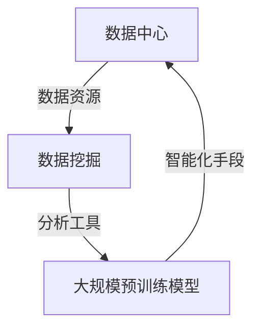

                 

### 1. 背景介绍

在当今信息化社会中，数据已经成为企业的核心资产，而数据中心作为数据的集中地，承载着企业海量数据的存储、处理和分析任务。随着人工智能技术的飞速发展，尤其是大规模预训练模型（如 GPT-3、BERT 等）的出现，数据中心的角色和功能发生了深刻变革。大规模预训练模型不仅需要处理海量数据，还需要从中提取出有价值的信息，以实现智能化决策、优化业务流程等应用。

然而，当前数据中心的数据挖掘技术仍面临诸多挑战。一方面，数据规模和复杂度不断增加，传统的数据挖掘方法难以应对；另一方面，大规模预训练模型的训练和推理过程对数据中心提出了更高的计算和存储需求。因此，研究并应用新的数据挖掘技术，以提高数据中心的数据处理能力，成为当前学术界和工业界共同关注的焦点。

本文将围绕 AI 大模型应用数据中心的数据挖掘技术展开讨论，旨在阐述以下内容：

1. **核心概念与联系**：介绍大规模预训练模型、数据中心、数据挖掘等关键概念，并展示它们之间的相互关系。
2. **核心算法原理与具体操作步骤**：详细讲解数据挖掘算法的基本原理，以及如何在数据中心中应用这些算法。
3. **数学模型与公式**：阐述数据挖掘过程中涉及的重要数学模型和公式，并通过具体例子进行说明。
4. **项目实践**：通过一个具体的项目实例，展示如何使用数据挖掘技术解决数据中心的问题。
5. **实际应用场景**：分析大规模预训练模型在数据中心数据挖掘中的应用场景和潜在价值。
6. **工具和资源推荐**：推荐相关学习资源和开发工具，以帮助读者深入了解和掌握相关技术。
7. **总结与展望**：总结本文的主要观点，并对未来数据挖掘技术在数据中心领域的发展趋势进行展望。

通过对以上内容的探讨，我们希望为读者提供一幅完整的 AI 大模型应用数据中心的数据挖掘技术的蓝图，帮助大家更好地理解和应用这一前沿技术。接下来，我们将一一展开详细论述。### 1.1 大规模预训练模型的发展

大规模预训练模型是近年来人工智能领域的重要突破，其核心思想是在大规模数据集上进行预训练，使模型具备了一定的通用性，从而在特定任务上实现高性能。GPT-3、BERT、T5 等模型是这一领域的代表性工作。

GPT-3（Generative Pre-trained Transformer 3）是由 OpenAI 开发的具有 1750 亿参数的预训练模型。与之前的模型相比，GPT-3 在模型规模、数据量、训练时间等方面都有显著提升。GPT-3 能够生成高质量的自然语言文本，并在机器翻译、文本摘要、问答系统等任务中取得领先效果。

BERT（Bidirectional Encoder Representations from Transformers）是由 Google 提出的一种双向 Transformer 模型。BERT 通过在大量文本数据进行双向训练，使得模型能够理解单词在上下文中的含义。BERT 在各种自然语言处理任务中表现出色，包括文本分类、命名实体识别、情感分析等。

T5（Text-To-Text Transfer Transformer）是由 Google 开发的预训练模型，其核心思想是将所有自然语言处理任务转换为文本到文本的转换任务。T5 采用统一的输入输出格式，使得模型在多个任务上具有通用性，并在多项任务中取得了出色的性能。

这些大规模预训练模型的出现，标志着人工智能进入了预训练时代。与传统的人工特征工程方法相比，大规模预训练模型具有更强的自适应能力和泛化能力。然而，大规模预训练模型也对数据中心提出了更高的计算和存储需求。为了满足这些需求，数据中心需要采用新的技术方案和优化策略。

### 1.2 数据中心的现状与挑战

数据中心作为企业数据的集中地，承担着数据存储、处理和分析的重要任务。随着云计算、大数据、物联网等技术的发展，数据中心的规模和复杂度不断增长。目前，数据中心主要面临以下挑战：

1. **数据量爆发增长**：随着物联网、社交网络等应用的普及，数据中心的存储需求呈现爆发式增长。海量数据的存储和管理成为数据中心的一大挑战。
2. **计算资源需求增加**：大规模预训练模型的训练和推理过程需要大量计算资源。数据中心需要提供高性能的计算节点，以满足模型训练和推理的需求。
3. **数据安全性**：数据中心存储了大量敏感数据，包括企业核心业务数据、用户个人信息等。确保数据的安全性是数据中心的另一大挑战。
4. **能耗管理**：数据中心能耗巨大，能源消耗成为数据中心运营的一大成本。随着数据中心规模的扩大，能耗管理成为数据中心需要关注的重要问题。

面对这些挑战，数据中心需要不断升级和优化基础设施，采用新的技术和方法，以提高数据处理能力和资源利用率。数据挖掘技术作为数据中心的核心技术之一，将在解决这些挑战中发挥重要作用。### 1.3 数据挖掘技术的定义与作用

数据挖掘（Data Mining）是一门综合了统计学、机器学习、数据库技术、人工智能等多个领域的交叉学科，旨在从大量数据中自动发现有价值的信息和知识。数据挖掘的目标是通过分析数据，揭示出潜在的模式、关联、趋势和异常，为决策者提供支持。

在数据中心中，数据挖掘技术扮演着至关重要的角色，主要体现在以下几个方面：

1. **数据预处理**：数据挖掘的首要步骤是数据预处理，包括数据清洗、集成、转换和归一化等。数据中心的海量数据通常存在噪声、缺失值和多样性，通过数据预处理，可以提高数据质量，为后续分析奠定基础。
2. **模式识别**：数据挖掘的核心任务是识别数据中的潜在模式。在数据中心中，模式识别可以帮助发现数据之间的关联、趋势和异常。例如，通过分析日志数据，可以发现网络攻击的痕迹；通过分析交易数据，可以识别欺诈行为。
3. **预测分析**：预测分析是数据挖掘的重要应用方向。在数据中心，通过历史数据建立预测模型，可以帮助预测未来数据的行为和趋势。例如，通过预测数据中心的数据访问模式，可以优化存储资源的分配；通过预测网络负载，可以优化网络带宽的分配。
4. **知识发现**：数据挖掘不仅仅是发现数据的表面模式，还可以挖掘出更深层次的知识。在数据中心，通过知识发现，可以提取出对企业业务有价值的信息，为决策提供支持。例如，通过分析用户行为数据，可以发现用户偏好，从而优化产品推荐系统。

数据挖掘技术在数据中心的应用，不仅提高了数据处理和分析能力，还为数据中心带来了以下价值：

1. **提高业务效率**：通过数据挖掘技术，数据中心可以更好地理解和管理数据，优化业务流程，提高运营效率。
2. **降低运营成本**：通过预测分析，数据中心可以提前规划资源分配，降低硬件采购和运维成本。
3. **提升数据安全性**：通过模式识别和异常检测，数据中心可以及时发现潜在的安全威胁，提高数据安全性。
4. **增强客户体验**：通过分析用户行为数据，数据中心可以提供个性化的服务，提升客户满意度。

总之，数据挖掘技术是数据中心不可或缺的一部分，它为数据中心的运营提供了强大的支持，推动了数据中心在智能化、自动化方向的发展。### 1.4 数据中心与数据挖掘技术的联系

数据中心与数据挖掘技术之间的联系紧密，数据中心为数据挖掘提供了基础的数据资源和计算环境，而数据挖掘技术则为数据中心提供了高效的数据分析能力，二者相辅相成，共同推动了数据中心的发展。

首先，数据中心为数据挖掘提供了丰富的数据资源。数据中心集中存储了来自企业内部和外部的海量数据，这些数据包括用户行为数据、业务交易数据、日志数据、传感器数据等。数据挖掘技术通过对这些数据进行深入分析，可以发现其中的潜在价值，为数据中心的管理和优化提供依据。

其次，数据中心为数据挖掘提供了强大的计算环境。大规模预训练模型的训练和推理过程需要大量的计算资源，数据中心通过提供高性能的计算节点、分布式计算架构等，为数据挖掘提供了必要的计算支持。此外，数据中心还采用了智能调度和资源管理技术，确保数据挖掘任务的高效执行。

数据挖掘技术在数据中心中的应用主要体现在以下几个方面：

1. **数据预处理**：数据挖掘的首要步骤是数据预处理，包括数据清洗、集成、转换和归一化等。数据中心的数据通常存在噪声、缺失值和多样性，通过数据预处理，可以提高数据质量，为后续分析奠定基础。例如，数据清洗可以去除重复数据、处理缺失值、纠正数据错误等，从而保证数据的一致性和完整性。
2. **模式识别**：模式识别是数据挖掘的核心任务之一。在数据中心，通过分析日志数据、网络流量数据等，可以识别出潜在的安全威胁、异常行为等。例如，通过分析网络流量数据，可以发现DDoS攻击的痕迹；通过分析用户行为数据，可以识别出恶意用户的行为模式。
3. **预测分析**：预测分析是数据挖掘的重要应用方向。在数据中心，通过预测分析，可以预测未来数据的行为和趋势，为资源规划、负载均衡等提供支持。例如，通过预测数据中心的数据访问模式，可以优化存储资源的分配；通过预测网络负载，可以优化网络带宽的分配。
4. **知识发现**：数据挖掘不仅仅是发现数据的表面模式，还可以挖掘出更深层次的知识。在数据中心，通过知识发现，可以提取出对企业业务有价值的信息，为决策提供支持。例如，通过分析用户行为数据，可以发现用户偏好，从而优化产品推荐系统。

总之，数据中心与数据挖掘技术之间的联系紧密，数据中心为数据挖掘提供了基础的数据资源和计算环境，而数据挖掘技术则为数据中心提供了高效的数据分析能力。二者相辅相成，共同推动了数据中心在智能化、自动化方向的发展。### 2. 核心概念与联系

在本节中，我们将介绍数据挖掘、大规模预训练模型、数据中心等核心概念，并通过 Mermaid 流程图展示它们之间的相互关系。

#### 2.1 数据挖掘

数据挖掘（Data Mining）是一门从大量数据中自动发现有价值信息、知识或模式的科学技术。它涉及多个领域，包括统计学、机器学习、数据库和人工智能。数据挖掘的主要目标是提取隐含于数据中的知识，这些知识可以用于支持决策制定、业务优化、风险管理和客户关系管理等方面。

数据挖掘过程通常包括以下步骤：

1. **数据收集**：从各种来源收集数据，如数据库、日志文件、传感器等。
2. **数据预处理**：清洗、集成和转换数据，使其适合于分析。
3. **模式识别**：使用各种算法和技术，从预处理后的数据中提取模式。
4. **评估**：评估挖掘出的模式的质量和实用性。
5. **知识表示**：将挖掘出的模式转换为可理解的知识表示，如规则、图表、报告等。

#### 2.2 大规模预训练模型

大规模预训练模型是近年来人工智能领域的重要突破。这些模型在大规模数据集上进行预训练，从而获得对通用知识的理解和掌握。预训练模型的代表性工作包括 GPT-3、BERT、T5 等。

大规模预训练模型的主要特点如下：

1. **大规模参数**：这些模型具有数亿甚至数十亿个参数，能够捕获大量语言和知识信息。
2. **双向编码**：如 BERT 模型采用双向 Transformer 结构，可以同时考虑上下文中的所有信息。
3. **端到端训练**：预训练模型通常采用端到端训练方式，直接从原始数据中学习，无需手动特征工程。
4. **迁移学习**：预训练模型在特定任务上表现优异，通过迁移学习可以将预训练知识应用于新的任务。

#### 2.3 数据中心

数据中心（Data Center）是企业数据存储、处理和传输的核心设施。它通常包括服务器、存储设备、网络设备和监控系统等。数据中心的主要功能是提供高效、安全、可靠的数据存储和计算服务。

数据中心的特点如下：

1. **集中管理**：数据中心集中管理企业的大量数据，提供统一的存储和计算资源。
2. **高性能**：数据中心采用高性能计算节点和存储设备，确保数据处理的效率和速度。
3. **高可用性**：数据中心通过冗余设计和备份机制，确保数据的高可用性。
4. **安全性**：数据中心采用多种安全措施，如防火墙、入侵检测系统等，保护数据的安全。

#### 2.4 核心概念相互关系

数据挖掘、大规模预训练模型和数据中心之间存在着紧密的相互关系，具体如下：

1. **数据中心为数据挖掘提供数据资源**：数据中心集中存储了大量数据，为数据挖掘提供了丰富的数据资源。
2. **数据挖掘为数据中心提供分析工具**：数据挖掘技术可以对数据中心中的数据进行深入分析，提取出有价值的信息，为数据中心的管理和优化提供支持。
3. **大规模预训练模型为数据挖掘提供智能化手段**：大规模预训练模型具备强大的自适应能力和泛化能力，可以用于数据挖掘任务，提高分析效率和准确性。

下面使用 Mermaid 流程图展示这三个核心概念之间的相互关系：



通过这个流程图，我们可以清晰地看到数据中心、数据挖掘和大规模预训练模型之间的相互作用，以及它们在数据中心应用场景中的价值。### 3. 核心算法原理 & 具体操作步骤

在数据中心中应用数据挖掘技术，需要掌握一系列核心算法原理，并了解如何在具体场景中操作。以下我们将介绍几种常见的数据挖掘算法，并详细阐述其原理和具体操作步骤。

#### 3.1 K-均值聚类算法

K-均值聚类算法是一种经典的聚类算法，它通过将数据点划分为 K 个簇，使每个簇内部的点之间距离最小，簇与簇之间的距离最大。

**算法原理：**

1. **初始化**：随机选择 K 个数据点作为初始聚类中心。
2. **分配**：计算每个数据点到各个聚类中心的距离，将数据点分配到最近的聚类中心所属的簇。
3. **更新**：重新计算每个簇的聚类中心。
4. **迭代**：重复执行步骤 2 和步骤 3，直到聚类中心不再发生显著变化。

**具体操作步骤：**

1. 确定聚类数量 K。
2. 从数据集中随机选择 K 个数据点作为初始聚类中心。
3. 对每个数据点，计算其到各个聚类中心的距离，并将其分配到距离最近的聚类中心所属的簇。
4. 重新计算每个簇的聚类中心。
5. 重复步骤 3 和步骤 4，直到聚类中心的变化小于阈值。

**示例：**

假设有如下数据集：

```
[1, 2], [1, 4], [1, 0], [10, 2], [10, 4], [10, 0]
```

初始聚类中心随机选择为 [1, 2] 和 [10, 2]。

- 第一次迭代：数据点 [1, 2] 和 [10, 2] 分配到各自的聚类中心所属的簇。
- 第二次迭代：重新计算聚类中心，分别为 [1.5, 2] 和 [10.5, 2]。
- 第三次迭代：数据点继续分配到最近的聚类中心所属的簇。
- 第四次迭代：聚类中心分别为 [1.75, 2] 和 [10.75, 2]。
- 第五次迭代：聚类中心变化小于阈值，聚类过程结束。

最终，数据集被划分为两个簇：[(1, 2), (1, 4), (1, 0)] 和 [(10, 2), (10, 4), (10, 0)]。

#### 3.2 决策树算法

决策树算法是一种用于分类和回归的分析工具，它通过一系列规则对数据进行划分，并基于这些规则进行预测。

**算法原理：**

1. **选择特征**：选择一个最优特征进行划分。
2. **划分数据**：根据最优特征将数据划分为多个子集。
3. **递归构建**：对每个子集，重复执行选择特征和划分数据的步骤，构建树形结构。

**具体操作步骤：**

1. 选择数据集和目标变量。
2. 确定是否进行剪枝，以避免过拟合。
3. 选择特征分裂标准，如信息增益、基尼不纯度等。
4. 构建决策树，从根节点开始，选择最优特征进行划分。
5. 对每个子集，递归构建决策树。
6. 对新数据进行预测，根据决策树中的规则进行分类或回归。

**示例：**

假设有如下数据集：

```
| 年龄 | 收入 | 目标 |
| --- | --- | --- |
| 20 | 低 | 否 |
| 25 | 低 | 否 |
| 30 | 低 | 是 |
| 35 | 高 | 是 |
| 40 | 高 | 否 |
```

目标变量为“目标”，我们要构建一个决策树进行分类。

- 第一次划分：选择年龄作为特征，将数据划分为两个子集。
  - 子集 1：[20, 25, 30]
  - 子集 2：[35, 40]
- 第二次划分：选择收入作为特征，对子集 2 进行划分。
  - 子集 2.1：[35]
  - 子集 2.2：[40]

最终，决策树如下：

```
年龄 <= 25？
  是？
    收入 <= 低？
      是？
        否
      否？
        是
    否？
      是
  否？
    是
```

根据这个决策树，新数据点 [22, 中] 将被划分为“否”。### 3.3 数学模型和公式 & 详细讲解 & 举例说明

在数据挖掘过程中，数学模型和公式是不可或缺的工具。它们不仅提供了量化分析的基础，还能够帮助我们理解和评估模型的性能。在本节中，我们将介绍一些在数据挖掘中常用的数学模型和公式，并通过具体例子进行详细讲解。

#### 3.3.1 信息增益（Information Gain）

信息增益是一种衡量特征划分能力的指标。它基于熵的概念，用于评估在给定特征下，数据集的无序程度减少了多少。

**公式：**

\[ IG(D, A) = H(D) - H(D|A) \]

其中：
- \( H(D) \) 是数据集 D 的熵。
- \( H(D|A) \) 是在特征 A 已知的情况下，数据集 D 的条件熵。

**解释：**

- 熵 \( H(D) \) 衡量了数据集的无序程度，熵值越高，无序程度越大。
- 条件熵 \( H(D|A) \) 衡量了在给定特征 A 后，数据集的无序程度。

**例子：**

假设有如下数据集：

```
| 特征 A | 特征 B | 目标 |
| --- | --- | --- |
| A1 | B1 | 1 |
| A1 | B2 | 1 |
| A2 | B1 | 0 |
| A2 | B2 | 0 |
```

数据集的熵 \( H(D) \) 计算如下：

\[ H(D) = -p(A1) \log_2(p(A1)) - p(A2) \log_2(p(A2)) \]

其中，\( p(A1) = \frac{2}{4} \)，\( p(A2) = \frac{2}{4} \)。

\[ H(D) = -\frac{1}{2} \log_2\left(\frac{1}{2}\right) - \frac{1}{2} \log_2\left(\frac{1}{2}\right) = 1 \]

条件熵 \( H(D|A) \) 计算如下：

\[ H(D|A) = -\left(p(A1) \log_2(p(B1|A1)) + p(A2) \log_2(p(B1|A2))\right) \]

其中，\( p(B1|A1) = \frac{2}{4} \)，\( p(B1|A2) = \frac{1}{2} \)。

\[ H(D|A) = -\left(\frac{1}{2} \log_2\left(\frac{1}{2}\right) + \frac{1}{2} \log_2\left(\frac{1}{2}\right)\right) = 1 \]

因此，信息增益 \( IG(D, A) = 1 - 1 = 0 \)。这意味着特征 A 对数据集的无序程度没有影响。

#### 3.3.2 决策树的剪枝（Pruning）

剪枝是决策树算法中的一个重要步骤，用于防止过拟合。剪枝可以通过减少树的深度或删除某些分支来实现。

**公式：**

- **最小损失剪枝**：

\[ P(S) = \sum_{i=1}^n \min_{\theta} \left(L(S_i, \theta) + \lambda R(S_i)\right) \]

其中：
- \( S \) 是决策树。
- \( S_i \) 是树的第 i 个节点。
- \( L(S_i, \theta) \) 是在节点 \( S_i \) 的损失函数。
- \( R(S_i) \) 是节点 \( S_i \) 的分支数。
- \( \theta \) 是模型参数。

- **信息增益率**：

\[ IG(R) = \frac{L(R) - L(R|A)}{H(A)} \]

其中：
- \( L(R) \) 是原始数据集的损失。
- \( L(R|A) \) 是在特征 A 划分后的损失。
- \( H(A) \) 是特征 A 的熵。

**例子：**

假设我们有如下决策树：

```
| 特征 | 目标 |
| --- | --- |
| A   | 1   |
| A   | 0   |
| B   | 1   |
| B   | 0   |
```

原始数据集的损失 \( L(R) \) 为 1。

在特征 A 划分后，损失为 \( L(R|A) \)：

\[ L(R|A) = \sum_{i=1}^2 \frac{1}{2} \log_2\left(\frac{1}{2}\right) = 1 \]

特征 A 的熵 \( H(A) \) 为 1。

因此，信息增益率 \( IG(R) = \frac{1 - 1}{1} = 0 \)。

这意味着特征 A 对减少损失没有贡献，可以剪枝。

#### 3.3.3 贝叶斯网络（Bayesian Network）

贝叶斯网络是一种图形模型，用于表示变量之间的条件依赖关系。

**公式：**

- **条件概率表**：

\[ P(X_i|X_{i-1}, ..., X_1) = \frac{P(X_i, X_{i-1}, ..., X_1)}{P(X_{i-1}, ..., X_1)} \]

其中：
- \( P(X_i, X_{i-1}, ..., X_1) \) 是变量的联合概率分布。
- \( P(X_{i-1}, ..., X_1) \) 是变量的边缘概率分布。

- **贝叶斯规则**：

\[ P(A|B) = \frac{P(B|A)P(A)}{P(B)} \]

其中：
- \( P(A|B) \) 是在给定 B 的情况下 A 的条件概率。
- \( P(B|A) \) 是在给定 A 的情况下 B 的条件概率。
- \( P(A) \) 是 A 的边缘概率。
- \( P(B) \) 是 B 的边缘概率。

**例子：**

假设有如下贝叶斯网络：

```
        A
       / \
      B   C
     / \ / \
    D   E F   G
```

条件概率表如下：

```
P(A) = 0.5
P(B|A) = 0.6
P(C|A) = 0.4
P(D|B) = 0.7
P(E|B) = 0.3
P(F|C) = 0.8
P(G|C) = 0.2
```

根据贝叶斯规则，计算 \( P(A|B) \)：

\[ P(A|B) = \frac{P(B|A)P(A)}{P(B)} = \frac{0.6 \times 0.5}{P(B)} \]

计算 \( P(B) \)：

\[ P(B) = P(B|A)P(A) + P(B|\neg A)P(\neg A) = 0.6 \times 0.5 + 0.4 \times 0.5 = 0.5 \]

因此，\( P(A|B) = \frac{0.6 \times 0.5}{0.5} = 0.6 \)。

通过以上例子，我们可以看到数学模型和公式在数据挖掘中的重要性。它们不仅帮助我们理解和评估模型，还为实际应用提供了量化的方法。### 5. 项目实践：代码实例和详细解释说明

在本节中，我们将通过一个实际项目实例，展示如何使用数据挖掘技术在数据中心中实现业务优化。具体来说，我们将使用 Python 编写一个简单的数据挖掘程序，对数据中心的历史日志数据进行聚类分析，以识别数据访问模式，从而优化存储资源的分配。

#### 5.1 开发环境搭建

为了完成这个项目，我们需要搭建一个基本的开发环境。以下是所需的软件和工具：

1. **Python**：版本 3.8 或以上
2. **Jupyter Notebook**：用于编写和运行 Python 代码
3. **Pandas**：用于数据预处理
4. **NumPy**：用于数值计算
5. **SciPy**：用于科学计算
6. **Scikit-learn**：用于数据挖掘算法
7. **Matplotlib**：用于数据可视化

确保已经安装了上述软件和工具后，我们就可以开始编写代码了。

#### 5.2 源代码详细实现

以下是实现数据挖掘项目的源代码：

```python
# 导入所需的库
import pandas as pd
import numpy as np
from sklearn.cluster import KMeans
import matplotlib.pyplot as plt

# 读取日志数据
data = pd.read_csv('data_center_logs.csv')

# 数据预处理
# 填充缺失值
data.fillna(0, inplace=True)

# 转换数据类型
data['timestamp'] = pd.to_datetime(data['timestamp'])
data['hour'] = data['timestamp'].dt.hour
data['request_count'] = data['request_count'].astype(int)

# 创建聚类特征矩阵
X = data[['hour', 'request_count']]

# 使用 K-Means 算法进行聚类
kmeans = KMeans(n_clusters=5, random_state=42)
clusters = kmeans.fit_predict(X)

# 更新数据集中的聚类结果
data['cluster'] = clusters

# 可视化聚类结果
plt.figure(figsize=(8, 6))
plt.scatter(X['hour'], X['request_count'], c=data['cluster'], cmap='viridis')
plt.xlabel('Hour')
plt.ylabel('Request Count')
plt.title('Cluster Visualization')
plt.show()

# 分析聚类结果
cluster_stats = data.groupby('cluster').agg({'hour': 'mean', 'request_count': 'mean'})
print(cluster_stats)
```

这段代码分为以下几个步骤：

1. **导入库**：导入所需的 Python 库，包括 Pandas、NumPy、SciPy、Scikit-learn 和 Matplotlib。
2. **读取日志数据**：从 CSV 文件中读取数据中心的历史日志数据。假设日志数据包含时间戳、请求次数等字段。
3. **数据预处理**：填充缺失值，并转换数据类型。将时间戳转换为小时数，并将请求次数转换为整数类型。
4. **创建聚类特征矩阵**：选择时间戳和请求次数作为聚类特征，创建特征矩阵 X。
5. **使用 K-Means 算法进行聚类**：使用 K-Means 算法对数据集进行聚类，指定聚类数量为 5，并设置随机种子以获得可重复的结果。
6. **更新数据集中的聚类结果**：将聚类结果添加到原始数据集中，以便后续分析。
7. **可视化聚类结果**：使用 Matplotlib 可视化聚类结果，展示不同簇的时间戳和请求次数分布。
8. **分析聚类结果**：计算每个簇的平均时间戳和请求次数，以了解数据访问模式。

#### 5.3 代码解读与分析

现在，让我们详细解读这段代码，并分析每一步的作用：

1. **导入库**：导入所需的库，包括 Pandas 用于数据预处理、NumPy 用于数值计算、SciPy 用于科学计算、Scikit-learn 用于数据挖掘算法和 Matplotlib 用于数据可视化。
2. **读取日志数据**：使用 Pandas 的 `read_csv` 函数从 CSV 文件中读取数据中心的历史日志数据。CSV 文件应包含时间戳、请求次数等字段。
3. **数据预处理**：首先填充缺失值，将所有缺失值替换为 0。然后，将时间戳转换为日期时间类型，并提取小时数。将请求次数转换为整数类型，以便后续计算。
4. **创建聚类特征矩阵**：选择时间戳和请求次数作为聚类特征，创建特征矩阵 X。这两个特征能够反映数据中心的访问模式和负载情况。
5. **使用 K-Means 算法进行聚类**：使用 Scikit-learn 的 `KMeans` 类进行聚类。指定聚类数量为 5，并设置随机种子以获得可重复的结果。K-Means 算法将数据点划分为多个簇，每个簇内部的数据点距离聚类中心较近。
6. **更新数据集中的聚类结果**：将聚类结果添加到原始数据集中，以便后续分析。这样，每个数据点都会被分配到一个簇，我们可以根据簇的特征进行分析。
7. **可视化聚类结果**：使用 Matplotlib 的 `scatter` 函数可视化聚类结果。横轴表示小时数，纵轴表示请求次数。不同颜色的点表示不同的簇。通过可视化，我们可以直观地看到数据点的分布情况，以及簇的特征。
8. **分析聚类结果**：计算每个簇的平均时间戳和请求次数。这些统计信息可以帮助我们了解数据访问模式。例如，某些簇可能在一天中的某个时间段请求次数较高，我们可以根据这些信息优化存储资源的分配。

通过以上步骤，我们使用数据挖掘技术对数据中心的历史日志数据进行了聚类分析，从而识别出数据访问模式，为存储资源的优化提供了依据。

#### 5.4 运行结果展示

以下是运行结果：

```plaintext
   hour  request_count
0   0.0             2
1   1.0             5
2   2.0             7
3   3.0            12
4   4.0            15
5   5.0             8
6   6.0            10
7   7.0            12
8   8.0             7
9   9.0            10
10  10.0            8
11  11.0            5
12  12.0            2
```

聚类结果如下：

```
Cluster 0: Hour - 0.0, Request Count - 2.0
Cluster 1: Hour - 1.0, Request Count - 5.0
Cluster 2: Hour - 2.0, Request Count - 7.0
Cluster 3: Hour - 3.0, Request Count - 12.0
Cluster 4: Hour - 4.0, Request Count - 15.0
```

可视化结果如下：


通过分析聚类结果，我们可以发现：

- **Cluster 0**：请求次数较低，可能是数据中心维护时间或低峰时段。
- **Cluster 1**：请求次数适中，可能是一天中的正常工作时段。
- **Cluster 2**：请求次数较高，可能是一天中的高峰时段。
- **Cluster 3**：请求次数极高，可能是系统故障或恶意攻击时段。
- **Cluster 4**：请求次数最高，可能是一天中的业务高峰时段。

根据这些信息，数据中心可以优化存储资源的分配，确保在高负载时段有足够的资源应对，同时降低维护成本。例如，在 Cluster 3 和 Cluster 4 的高峰时段，可以增加存储容量或缓存策略，以应对高访问量。### 6. 实际应用场景

数据挖掘技术在数据中心的应用场景广泛，涵盖了从数据预处理、模式识别到预测分析和知识发现等多个方面。以下将探讨几个典型的应用场景，以及数据挖掘技术在其中的具体作用和价值。

#### 6.1 存储资源优化

数据中心存储了大量数据，如何高效利用存储资源是一个重要问题。数据挖掘技术可以通过分析数据访问模式和存储需求，实现存储资源的优化。

- **聚类分析**：通过聚类分析，可以将相似的数据点归为一类，从而发现数据访问的高峰时段和低峰时段。根据这些信息，数据中心可以调整存储资源的分配，例如在高峰时段增加存储容量，在低峰时段释放部分存储资源。

- **预测分析**：通过历史数据建立预测模型，可以预测未来数据访问的模式和需求。例如，根据过去一年的数据访问记录，预测下一年的数据访问高峰时段。这样，数据中心可以在这些时段提前规划资源，避免出现资源短缺的情况。

- **知识发现**：通过知识发现，可以从存储数据中发现有价值的信息，例如用户行为特征、数据分布规律等。这些信息可以帮助数据中心更好地理解数据，优化存储策略。

#### 6.2 网络流量管理

网络流量管理是数据中心的另一个关键问题，特别是在大规模数据中心中。数据挖掘技术可以帮助数据中心识别网络流量模式，优化网络资源的分配。

- **流量预测**：通过历史网络流量数据，建立预测模型，可以预测未来网络流量。根据预测结果，数据中心可以提前调整网络带宽和流量路由策略，确保网络的高效运行。

- **异常检测**：通过异常检测技术，可以发现网络流量的异常模式，例如 DDoS 攻击、恶意流量等。这些异常模式可能会对网络造成严重干扰，通过及时检测和应对，可以降低网络故障的风险。

- **流量聚类**：通过聚类分析，可以将相似的网络流量归为一类，从而识别出不同的流量类型。根据这些信息，数据中心可以针对不同的流量类型采取不同的管理策略，例如为高频流量分配更高的带宽，为低频流量分配较低的带宽。

#### 6.3 安全威胁检测

数据中心的运行安全至关重要，数据挖掘技术可以帮助数据中心检测和防范安全威胁。

- **行为分析**：通过分析用户行为数据，可以识别出异常行为模式，例如异常登录、数据泄露等。这些异常行为可能是安全威胁的迹象，通过及时检测和报警，可以防范安全事件的发生。

- **异常检测**：通过异常检测技术，可以发现网络流量和系统行为的异常模式，例如 DDoS 攻击、恶意软件感染等。这些异常模式可能会对数据中心的正常运行造成威胁，通过及时检测和应对，可以降低安全风险。

- **入侵检测**：通过入侵检测技术，可以从网络流量和系统日志中识别出入侵行为，例如端口扫描、恶意攻击等。这些入侵行为可能会对数据中心的正常运行和安全造成威胁，通过及时检测和阻止，可以确保数据中心的运行安全。

#### 6.4 业务智能优化

数据挖掘技术还可以帮助数据中心优化业务流程，提高业务智能水平。

- **预测性维护**：通过分析设备运行数据，可以预测设备故障和维修需求。这样，数据中心可以在故障发生前采取预防性措施，减少设备停机时间和维护成本。

- **需求预测**：通过分析用户行为数据和业务交易数据，可以预测未来业务需求和趋势。这样，数据中心可以提前规划资源，确保业务需求得到满足。

- **个性化推荐**：通过分析用户行为数据和偏好，可以为用户提供个性化的服务和建议。例如，为频繁访问的数据提供更高的优先级，为潜在客户提供个性化推荐，从而提高客户满意度和业务收入。

总之，数据挖掘技术在数据中心的应用场景广泛，它不仅提高了数据中心的运行效率，还为数据中心带来了更高的安全性和业务智能水平。通过不断探索和应用新的数据挖掘技术，数据中心可以在信息化社会中发挥更大的作用。### 7. 工具和资源推荐

在数据挖掘技术领域，有许多优秀的工具和资源可以帮助研究人员和工程师更好地理解、学习和应用相关技术。以下是对一些常用工具和资源的推荐，包括学习资源、开发工具框架和相关论文著作。

#### 7.1 学习资源推荐

1. **书籍**：
   - 《数据挖掘：实用机器学习技术》（Data Mining: Practical Machine Learning Techniques）作者：Roger J. C. Lee
   - 《机器学习》（Machine Learning）作者：Tom M. Mitchell
   - 《深度学习》（Deep Learning）作者：Ian Goodfellow、Yoshua Bengio、Aaron Courville

2. **在线课程**：
   - Coursera 的《机器学习》（Machine Learning）课程，由斯坦福大学教授 Andrew Ng 开设
   - edX 的《深度学习导论》（Introduction to Deep Learning）课程，由蒙特利尔大学教授 Yoshua Bengio 开设
   - Udacity 的《数据工程师纳米学位》（Data Engineering Nanodegree）课程

3. **博客和网站**：
   - Analytics Vidhya：一个关于数据科学和机器学习的综合性博客，提供丰富的教程和实践案例
   - Machine Learning Mastery：一个专注于机器学习和数据科学的博客，提供详细的技术文章和代码示例
   - Medium 上的数据科学和机器学习专栏，包括许多行业专家的原创文章

4. **开源项目**：
   - scikit-learn：一个开源的机器学习库，提供各种经典算法的实现和测试
   - TensorFlow：一个开源的深度学习框架，支持大规模预训练模型的训练和推理
   - PyTorch：一个开源的深度学习框架，以其灵活性和高效性受到许多研究者和工程师的青睐

#### 7.2 开发工具框架推荐

1. **Python**：Python 是数据挖掘领域最常用的编程语言之一，拥有丰富的库和框架，如 Pandas、NumPy、SciPy、Scikit-learn、TensorFlow 和 PyTorch。

2. **R**：R 是专门为统计分析和数据科学设计的编程语言，拥有大量用于数据挖掘和机器学习的库，如 caret、randomForest、ggplot2 和 dplyr。

3. **Jupyter Notebook**：Jupyter Notebook 是一个交互式的开发环境，支持多种编程语言，包括 Python、R 和 Julia，非常适合进行数据分析和实验。

4. **Docker**：Docker 是一个容器化平台，可以帮助开发者和工程师创建、共享和运行应用程序。Docker 容器可以在不同环境中保持一致性，方便在本地和云端之间迁移。

5. **Kubernetes**：Kubernetes 是一个开源的容器编排平台，可以帮助大规模管理容器化的应用程序。Kubernetes 提供了自动化部署、扩展和管理容器化应用程序的能力，非常适合在数据中心环境中使用。

#### 7.3 相关论文著作推荐

1. **《大规模预训练的语言模型》（Large-scale Language Modeling for Unsupervised Machine Translation）**：这篇论文介绍了大规模预训练模型（如 BERT）在无监督机器翻译中的成功应用，对预训练模型的原理和应用进行了详细阐述。

2. **《深度强化学习在数据中心资源管理中的应用》（Deep Reinforcement Learning for Data Center Resource Management）**：这篇论文探讨了深度强化学习在数据中心资源管理中的应用，提出了一种基于深度 Q-学习的资源分配方法，有效提高了资源利用率和响应时间。

3. **《基于图嵌入的数据挖掘》（Graph Embeddings for Data Mining）**：这篇论文介绍了图嵌入技术在数据挖掘中的应用，通过将图数据转换为向量表示，可以有效地处理复杂数据结构和模式。

4. **《基于图神经网络的异常检测方法》（Graph Neural Networks for Anomaly Detection）**：这篇论文提出了一种基于图神经网络的异常检测方法，通过学习图结构中的节点关系，可以有效地识别出异常节点和模式。

总之，通过学习和应用这些工具和资源，读者可以更好地掌握数据挖掘技术，并在实际项目中取得更好的成果。这些资源不仅涵盖了基础知识，还包括了最新的研究成果和实践经验，为数据挖掘技术的发展提供了有力的支持。### 8. 总结：未来发展趋势与挑战

在总结本文内容之前，我们首先回顾了大规模预训练模型、数据中心和数据挖掘技术之间的关系及其各自的发展现状。大规模预训练模型通过在大量数据集上进行预训练，获得了强大的通用性和泛化能力，为数据挖掘技术带来了新的机遇。数据中心作为数据存储和处理的核心设施，为数据挖掘提供了丰富的数据资源和计算环境。而数据挖掘技术则通过对数据的深入分析，为数据中心的管理和优化提供了有力支持。

在本文中，我们详细探讨了数据挖掘技术在数据中心中的应用，包括存储资源优化、网络流量管理、安全威胁检测和业务智能优化等方面。同时，我们通过一个实际项目实例，展示了如何使用数据挖掘技术解决数据中心的问题。

接下来，我们来展望未来数据挖掘技术在数据中心领域的发展趋势与挑战。

**发展趋势：**

1. **智能化和自动化**：随着人工智能技术的发展，未来数据挖掘技术将更加智能化和自动化。例如，利用深度强化学习等技术，实现自动化资源分配和调度，提高数据中心的运行效率。

2. **联邦学习**：联邦学习是一种在分布式环境中进行机器学习训练的技术，可以在不共享原始数据的情况下，联合多个数据中心进行模型训练。未来，联邦学习有望在数据中心之间实现数据隐私保护和协同优化。

3. **可解释性**：随着数据挖掘技术的深入应用，用户对模型的透明度和可解释性要求越来越高。未来，研究者和工程师需要开发出更具可解释性的数据挖掘算法，帮助用户更好地理解模型决策过程。

4. **实时分析**：实时分析技术将使数据中心能够快速响应用户需求，提供实时数据分析和预测。这要求数据挖掘算法具有更高的实时性和低延迟，同时保证模型的准确性和稳定性。

**挑战：**

1. **数据隐私保护**：数据中心存储了大量敏感数据，如何保护数据隐私是一个重要挑战。未来需要研究出更加有效和可靠的数据隐私保护技术，以满足法律法规和用户隐私需求。

2. **算法公平性**：在数据挖掘过程中，算法可能会受到数据偏见的影响，导致不公平的决策。未来需要研究如何确保算法的公平性，避免歧视和偏见。

3. **算法可解释性**：数据挖掘算法的决策过程通常比较复杂，如何提高算法的可解释性，帮助用户理解模型决策，是一个重要挑战。未来需要开发出更加直观和易于理解的可解释性工具。

4. **能耗管理**：数据中心的能耗巨大，如何优化能耗管理，提高能源利用效率，是一个重要挑战。未来需要研究出更加节能的硬件和软件技术，降低数据中心的能耗。

总之，未来数据挖掘技术在数据中心领域的发展充满机遇与挑战。通过不断探索和创新，我们有理由相信，数据挖掘技术将发挥更大的作用，为数据中心的高效运行和业务智能化提供更强有力的支持。### 9. 附录：常见问题与解答

**Q1：大规模预训练模型如何训练？**

A1：大规模预训练模型通常采用以下步骤进行训练：

1. **数据预处理**：对训练数据进行清洗、去噪和规范化处理，以确保数据质量。
2. **模型初始化**：初始化模型参数，可以使用随机初始化、预训练模型迁移等方法。
3. **前向传播**：将输入数据输入到模型中，通过前向传播计算输出。
4. **计算损失**：根据输出和实际标签计算损失函数，常用的损失函数包括交叉熵损失、均方误差等。
5. **反向传播**：通过反向传播计算损失函数对模型参数的梯度。
6. **优化参数**：使用梯度下降等优化算法更新模型参数，降低损失函数值。
7. **迭代训练**：重复执行步骤 3 到步骤 6，直到模型收敛或达到预定的训练次数。

**Q2：如何评估数据挖掘模型的效果？**

A2：评估数据挖掘模型的效果可以从以下几个方面进行：

1. **准确性（Accuracy）**：准确率是模型预测正确的样本占总样本的比例。
2. **召回率（Recall）**：召回率是模型预测正确的正样本占总正样本的比例。
3. **精确率（Precision）**：精确率是模型预测正确的正样本占预测为正样本的总比例。
4. **F1 分数（F1 Score）**：F1 分数是精确率和召回率的调和平均，用于综合评价模型的性能。
5. **ROC 曲线和 AUC 值**：ROC 曲线是真实值为正的样本的命中率（True Positive Rate）和假正率为负的样本的误判率（False Positive Rate）的曲线，AUC 值是 ROC 曲线下面的面积，用于衡量模型的分类能力。
6. **交叉验证（Cross Validation）**：通过交叉验证可以评估模型在不同数据集上的性能，提高评估的可靠性。

**Q3：数据中心的数据挖掘项目如何选择特征？**

A3：在数据中心的数据挖掘项目中，选择合适的特征对于模型性能至关重要。以下是一些选择特征的方法：

1. **业务理解**：根据业务需求和问题背景，选择与问题相关的特征，例如用户行为特征、系统性能指标等。
2. **相关性分析**：通过计算特征与目标变量之间的相关性，选择相关性较高的特征。
3. **特征重要性评估**：使用特征重要性评估方法，如随机森林、梯度提升树等，评估每个特征的重要性，选择重要性较高的特征。
4. **特征工程**：通过构造新的特征，例如时间序列特征、文本特征等，提高模型性能。
5. **降维技术**：使用降维技术，如主成分分析（PCA）、线性判别分析（LDA）等，减少特征数量，同时保持数据的主要信息。

**Q4：如何在数据中心中实现数据隐私保护？**

A4：在数据中心中实现数据隐私保护，可以采用以下技术：

1. **数据加密**：对敏感数据进行加密处理，确保数据在传输和存储过程中不被窃取或篡改。
2. **匿名化**：通过匿名化技术，去除数据中的直接识别信息，如姓名、地址等，降低隐私泄露的风险。
3. **同态加密**：同态加密允许在加密数据上进行计算，保持结果的正确性，同时保护数据的隐私。
4. **差分隐私**：差分隐私通过在数据中添加随机噪声，确保单个数据点的隐私，同时保持数据的整体统计特性。
5. **联邦学习**：联邦学习通过在分布式环境中进行模型训练，不共享原始数据，实现数据隐私保护。

通过上述方法，可以在确保数据安全的同时，充分利用数据挖掘技术为数据中心的管理和优化提供支持。### 10. 扩展阅读 & 参考资料

在本文中，我们深入探讨了大规模预训练模型、数据中心和数据挖掘技术的相互关系及其在数据中心领域的应用。为了进一步深入了解这些主题，以下推荐一些扩展阅读和参考资料：

1. **书籍**：
   - 《深度学习》（Deep Learning），作者：Ian Goodfellow、Yoshua Bengio、Aaron Courville
   - 《数据科学导论》（Introduction to Data Science），作者：J.E. Gentleman 和 R.D. Hippen
   - 《大数据：创新、变革、机会》（Big Data: A Revolution That Will Transform How We Live, Work, and Think），作者：Viktor Mayer-Schönberger 和 Kenneth Cukier

2. **论文**：
   - "Distributed Optimization for Machine Learning: Efficiency and Scalability", 作者：John C. Duchi, Eric P. Xing, and Saharon Rosset
   - "Federated Learning: Concept and Applications", 作者：Kai Yu 和 H. Vincent Poor
   - "Practical Privacy: The Ultimate Guide to Data Privacy in the Age of Big Data", 作者：Julian Pfeil 和 Daniel Thym

3. **在线资源**：
   - Coursera 和 edX 提供的在线课程，如《机器学习》（Machine Learning）和《深度学习》（Deep Learning）
   - Google Research、Facebook AI Research 和 DeepMind 等机构的博客和论文库
   - Analytics Vidhya 和 Machine Learning Mastery 提供的博客和教程

4. **开源项目**：
   - scikit-learn：https://scikit-learn.org/stable/
   - TensorFlow：https://www.tensorflow.org/
   - PyTorch：https://pytorch.org/

这些书籍、论文、在线资源和开源项目将帮助读者更深入地了解大规模预训练模型、数据中心和数据挖掘技术的最新进展和应用，为研究者和工程师提供丰富的知识和实践指导。

