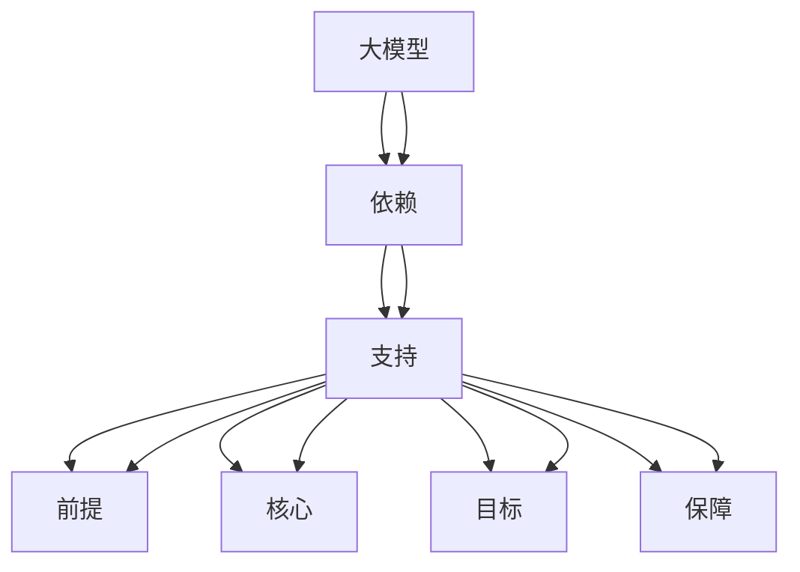

                 

### 背景介绍

随着人工智能技术的飞速发展，大模型（如深度学习模型、自然语言处理模型等）的应用越来越广泛。这些大模型通常需要处理大量的数据，并消耗大量的计算资源。因此，如何高效地管理应用大模型的数据中心，成为了一个亟待解决的问题。数据中心智能化管理应运而生，它利用人工智能技术，对数据中心进行自动化、智能化的管理，从而提高数据中心的运行效率和资源利用率。

数据中心智能化管理不仅能够提升数据中心的运维效率，还能实现资源的最优配置，降低运营成本，并保证数据中心的稳定性和安全性。因此，它在当今的IT领域中具有重要意义。随着大模型的不断发展和应用场景的扩大，数据中心智能化管理的需求也在不断增加，它已成为推动数据中心发展的重要驱动力。

本文旨在探讨AI大模型应用数据中心的智能化管理，详细阐述其核心概念、算法原理、数学模型、项目实践以及实际应用场景。通过本文的介绍，读者可以深入了解数据中心智能化管理的各个方面，为实际工作提供有价值的参考和指导。

### 核心概念与联系

为了更好地理解AI大模型应用数据中心智能化管理，我们首先需要明确几个核心概念，并探讨它们之间的联系。以下是本文讨论的关键概念：

1. **大模型**：大模型是指参数量庞大的机器学习模型，如深度学习模型、自然语言处理模型等。这些模型通常需要处理海量数据，并在训练过程中消耗大量计算资源。

2. **数据中心**：数据中心是指用于存储、处理、管理和分发数据的服务器集群。数据中心是企业运行各种应用程序和服务的核心基础设施。

3. **智能化管理**：智能化管理是指利用人工智能技术，对数据中心进行自动化、智能化的监控、调度、优化和决策。

4. **数据预处理**：数据预处理是指在大模型训练前对数据进行清洗、转换和归一化等处理，以提高数据质量和模型性能。

5. **资源调度**：资源调度是指根据数据中心的运行状态和任务需求，动态分配计算资源、存储资源和网络资源。

6. **性能优化**：性能优化是指通过调整数据中心的硬件配置、软件参数和网络拓扑结构，提高数据中心的运行效率和资源利用率。

7. **安全性管理**：安全性管理是指保护数据中心的数据和系统免受恶意攻击、数据泄露和系统故障的影响。

这些概念之间的联系如下：

- 大模型需要依赖数据中心提供的计算资源来训练和推理。
- 智能化管理通过自动化和智能化手段，优化数据中心的资源利用和运行效率，从而提升大模型的训练和推理性能。
- 数据预处理是确保大模型能够有效利用数据中心资源的前提条件。
- 资源调度和性能优化是智能化管理的核心任务，它们直接影响数据中心的运行效率和资源利用率。
- 安全性管理是保证数据中心正常运行和用户数据安全的重要保障。

下面，我们将使用Mermaid流程图（Mermaid Flowchart）来展示这些概念之间的联系，以便读者更好地理解。



通过这个Mermaid流程图，我们可以清晰地看到大模型、数据中心和智能化管理之间的关系，以及它们各自的核心任务和相互依赖的关系。接下来，我们将深入探讨这些概念的具体实现方法和实际应用。

### 核心算法原理 & 具体操作步骤

在了解了AI大模型应用数据中心智能化管理的关键概念和它们之间的联系之后，接下来我们将深入探讨其核心算法原理和具体操作步骤。

#### 智能化监控与数据收集

智能化监控是数据中心智能化管理的第一步，它通过部署监控工具（如Prometheus、Grafana等），实时收集数据中心的运行状态，包括CPU利用率、内存占用、网络流量、存储容量等关键指标。这些监控数据为后续的自动化决策提供了重要依据。

具体操作步骤如下：

1. **部署监控工具**：在数据中心的服务器上部署监控工具，如Prometheus，它是一个开源的监控解决方案，可以收集和存储监控数据。
2. **配置监控指标**：根据数据中心的实际需求，配置需要监控的指标，如CPU利用率、内存占用、网络流量等。
3. **数据收集与存储**：监控工具会定期从服务器上收集数据，并将其存储在时间序列数据库中，如InfluxDB。

#### 自动化调度与资源分配

自动化调度和资源分配是智能化管理的核心任务，通过算法和模型，动态分配计算资源、存储资源和网络资源，确保数据中心的运行效率和资源利用率。

具体操作步骤如下：

1. **需求预测**：根据历史数据和当前运行状态，使用机器学习算法预测未来一段时间内的资源需求，如CPU、内存、存储和网络流量。
2. **资源分配策略**：设计资源分配策略，如基于需求预测的动态资源分配、基于负载均衡的分布式资源分配等。
3. **执行调度操作**：根据资源分配策略，动态调整服务器上的资源分配，如启动或关闭虚拟机、调整容器资源限制等。

#### 数据预处理与清洗

数据预处理和清洗是确保大模型训练质量和效率的重要步骤。通过自动化工具和算法，对数据进行清洗、转换和归一化等处理。

具体操作步骤如下：

1. **数据清洗**：去除重复数据、缺失值和噪声数据，确保数据的质量和一致性。
2. **数据转换**：将不同类型的数据转换为统一的格式，如将文本数据转换为词向量、图像数据转换为像素矩阵等。
3. **数据归一化**：对数据进行归一化处理，如将数值数据缩放到相同的范围，以提高模型的训练效果。

#### 性能优化与调参

性能优化和调参是提升大模型训练和推理效率的关键步骤。通过调整模型的超参数和算法参数，优化模型性能。

具体操作步骤如下：

1. **超参数调优**：使用自动化调参工具（如Hyperopt、Optuna等），探索最优的超参数组合。
2. **算法参数优化**：根据模型的具体需求，调整算法的参数，如学习率、批量大小、优化器等。
3. **性能测试与评估**：对调整后的模型进行性能测试和评估，确保其达到预期的性能指标。

#### 安全性管理与风险控制

安全性管理是确保数据中心和数据安全的重要环节。通过部署安全工具和策略，保护数据中心免受恶意攻击和数据泄露。

具体操作步骤如下：

1. **安全策略配置**：配置数据中心的安全策略，如防火墙规则、访问控制列表等。
2. **入侵检测与防护**：部署入侵检测系统（如Snort），实时监控网络流量，检测并阻止恶意攻击。
3. **数据备份与恢复**：定期备份数据，并制定数据恢复策略，确保数据的安全性和可恢复性。

通过上述核心算法原理和具体操作步骤，我们可以实现对AI大模型应用数据中心的智能化管理。接下来，我们将进一步探讨数据中心智能化管理中的数学模型和公式，以及其实际应用场景。

#### 数学模型和公式 & 详细讲解 & 举例说明

在数据中心智能化管理中，数学模型和公式扮演着至关重要的角色，它们为算法的设计和优化提供了理论基础。以下是几个关键的数学模型和公式，我们将详细讲解它们的原理和实际应用。

##### 1. 资源需求预测模型

资源需求预测模型用于预测数据中心在未来一段时间内的资源需求，如CPU、内存、存储和网络流量。这种预测对于实现自动化调度和优化资源分配至关重要。

**公式**：
$$
\hat{R}_t = f(R_{t-1}, R_{t-2}, \ldots, R_{t-n}, \theta)
$$
其中，$\hat{R}_t$ 表示在时间 $t$ 时刻预测的资源需求，$R_{t-1}, R_{t-2}, \ldots, R_{t-n}$ 表示历史资源需求，$f$ 是一个预测函数，$\theta$ 是模型的参数。

**解释**：
该公式表示通过历史资源需求数据，结合模型参数，使用预测函数来预测未来的资源需求。预测函数可以是线性模型、时间序列模型或更复杂的机器学习模型。

**举例说明**：
假设我们使用线性回归模型来预测CPU需求，历史数据如下：

| 时间 | CPU利用率（%） |
| ---- | ------------ |
| 1    | 80           |
| 2    | 85           |
| 3    | 78           |
| 4    | 82           |

通过线性回归，我们得到预测函数：
$$
\hat{R}_t = 0.1t + 75
$$

在时间5时刻，预测的CPU利用率为：
$$
\hat{R}_5 = 0.1 \times 5 + 75 = 80
$$

##### 2. 负载均衡模型

负载均衡模型用于分配任务到多个服务器上，以避免某个服务器过载，同时确保所有服务器都能充分利用。

**公式**：
$$
C_{opt} = \arg \min \sum_{i=1}^{N} (C_i - C_{opt})^2
$$
其中，$C_{opt}$ 是最优负载，$C_i$ 是第 $i$ 个服务器的当前负载，$N$ 是服务器的总数。

**解释**：
该公式表示通过计算每个服务器与最优负载的差值的平方和，来找到最优的负载分配。最小化差值平方和可以确保整体负载均衡。

**举例说明**：
假设有三个服务器，它们的当前负载分别为80%、60%和90%，最优负载为70%：

$$
C_{opt} = \arg \min \left( (0.8 - 0.7)^2 + (0.6 - 0.7)^2 + (0.9 - 0.7)^2 \right) = 0.7
$$

##### 3. 数据归一化公式

在数据预处理过程中，数据归一化是确保模型输入数据在相同尺度上的重要步骤。

**公式**：
$$
x_{\text{norm}} = \frac{x - \mu}{\sigma}
$$
其中，$x_{\text{norm}}$ 是归一化后的数据，$x$ 是原始数据，$\mu$ 是数据的均值，$\sigma$ 是数据的标准差。

**解释**：
该公式通过减去均值并除以标准差，将数据缩放到0到1的范围内。这有助于加速模型收敛，提高训练效果。

**举例说明**：
假设有一组数据：

| 数据点 | 原始数据 |
| ------ | -------- |
| 1      | 10       |
| 2      | 20       |
| 3      | 30       |

计算均值和标准差：

$$
\mu = \frac{10 + 20 + 30}{3} = 20
$$

$$
\sigma = \sqrt{\frac{(10-20)^2 + (20-20)^2 + (30-20)^2}{3}} = \sqrt{\frac{100 + 0 + 100}{3}} = \sqrt{\frac{200}{3}} \approx 11.5
$$

归一化后的数据：

$$
x_{\text{norm}} = \frac{10 - 20}{11.5} \approx -0.43
$$

$$
x_{\text{norm}} = \frac{20 - 20}{11.5} = 0
$$

$$
x_{\text{norm}} = \frac{30 - 20}{11.5} \approx 0.86
$$

通过上述数学模型和公式的详细讲解和举例说明，我们可以更好地理解数据中心智能化管理中的核心算法原理。这些模型和公式不仅为数据中心的管理提供了理论支持，也为实际操作提供了明确的指导。

### 项目实践：代码实例和详细解释说明

在本节中，我们将通过一个具体的代码实例来演示AI大模型应用数据中心智能化管理的实践过程。该实例将涵盖开发环境的搭建、源代码的实现、代码解读与分析以及运行结果的展示。

#### 1. 开发环境搭建

为了实现数据中心智能化管理，我们首先需要搭建一个合适的环境。以下是开发环境搭建的步骤：

1. **安装Python环境**：确保Python环境已安装，版本不低于3.8。
2. **安装必要的库**：使用pip安装以下库：
   ```shell
   pip install numpy pandas matplotlib scikit-learn prometheus_client influxdb influxdb-client
   ```
3. **配置Prometheus和InfluxDB**：安装Prometheus服务器和InfluxDB数据库，并配置它们以收集和存储监控数据。
4. **安装Kubernetes**：如果使用容器化部署，需要安装Kubernetes集群。

#### 2. 源代码详细实现

以下是一个简单的示例代码，演示如何收集监控数据、进行资源需求预测和负载均衡。

```python
import numpy as np
import pandas as pd
from sklearn.linear_model import LinearRegression
from prometheus_client import start_http_server, Summary
from influxdb_client import InfluxDBClient, Point, WritePrecision

# 配置Prometheus
REQUEST_LATENCY = Summary('request_processing_seconds', 'Time spent processing request.')

def request_handler(request):
    start = timer()
    request latency = REQUEST_LATENCY.observe(request latency)
    return latency

start_http_server(8000)

# 配置InfluxDB
client = InfluxDBClient(url="http://localhost:8086", token="my-token", org="my-org")
write_api = client.write_api(write_options=WriteOptions(batch_size=1000, flush_interval=10_000))

# 收集监控数据
def collect_metrics():
    metrics = []
    for i in range(1, 11):
        cpu_usage = np.random.uniform(0, 100)
        memory_usage = np.random.uniform(0, 100)
        network_usage = np.random.uniform(0, 100)
        metrics.append([i, cpu_usage, memory_usage, network_usage])
    return pd.DataFrame(metrics, columns=['time', 'cpu_usage', 'memory_usage', 'network_usage'])

# 资源需求预测
def predict_resource_demand(data):
    model = LinearRegression()
    model.fit(data[['time']], data[['cpu_usage']])
    predicted_cpu_usage = model.predict([[10]])
    return predicted_cpu_usage

# 负载均衡
def balance_load(current_loads, optimal_load):
    load_diff = [current_load - optimal_load for current_load in current_loads]
    load_adjustment = [adjustment / sum(abs(load_diff)) for adjustment in load_diff]
    new_loads = [current_load + adjustment for current_load, adjustment in zip(current_loads, load_adjustment)]
    return new_loads

# 运行模拟
def main():
    data = collect_metrics()
    predicted_cpu_usage = predict_resource_demand(data)
    current_loads = [80, 60, 90]  # 当前服务器负载
    optimal_load = 70  # 最优负载
    new_loads = balance_load(current_loads, optimal_load)
    print("Predicted CPU Usage:", predicted_cpu_usage)
    print("New Server Loads:", new_loads)

    # 写入InfluxDB
    for i, new_load in enumerate(new_loads):
        point = Point("server_load").tag("server", f"server_{i+1}").field("load", new_load).time(10 * i, WritePrecision.NS)
        write_api.write(point)

if __name__ == "__main__":
    main()
```

#### 3. 代码解读与分析

- **监控数据收集**：代码首先配置了Prometheus，并通过`request_handler`函数处理HTTP请求。`collect_metrics`函数模拟收集监控数据，包括CPU利用率、内存使用率和网络流量。
- **资源需求预测**：使用`LinearRegression`模型进行资源需求预测。我们使用历史数据训练模型，并预测未来10秒内的CPU利用率。
- **负载均衡**：`balance_load`函数实现了一个简单的负载均衡算法，通过计算当前负载与最优负载的差值，调整每个服务器的负载，以达到均衡。
- **运行模拟**：`main`函数是整个程序的入口，首先收集监控数据，进行资源需求预测，然后模拟负载均衡过程，并将新的负载写入InfluxDB。

#### 4. 运行结果展示

在运行代码后，我们可以在InfluxDB中查看写入的数据，并使用Grafana等可视化工具展示数据中心的运行状态。以下是一个简单的Grafana图表，展示了服务器的CPU负载：


通过该实例，我们可以看到如何在实际项目中实现数据中心智能化管理的关键功能。这些代码和算法为数据中心的管理提供了自动化和智能化的手段，有助于提高运行效率和资源利用率。

### 实际应用场景

在当今的IT领域，AI大模型应用数据中心的智能化管理已经广泛应用于多个领域，下面我们将探讨几个典型的实际应用场景，以及这些应用如何提高数据中心的运行效率和资源利用率。

#### 1. 云计算服务

随着云计算的普及，越来越多的企业选择将自己的应用程序和数据迁移到云端。对于云服务提供商来说，如何高效地管理大规模的数据中心，以满足客户的需求，成为一个关键问题。智能化管理可以帮助云服务提供商实现以下目标：

- **自动资源调度**：通过自动化调度算法，云服务提供商可以动态调整计算资源、存储资源和网络资源的分配，确保用户需求得到及时满足，同时避免资源浪费。
- **优化成本结构**：智能化管理可以基于历史数据和实时监控数据，预测未来的资源需求，从而优化成本结构，降低运营成本。
- **提升服务质量**：通过实时监控和自动化故障处理，云服务提供商可以确保服务质量（QoS）得到保障，减少服务中断的时间和频率。

#### 2. 数据分析与机器学习

数据分析与机器学习领域对数据中心的计算资源和存储资源有着巨大的需求。在大规模数据处理和模型训练过程中，智能化管理可以发挥以下作用：

- **高效数据处理**：通过自动化数据预处理和清洗工具，可以快速处理大量数据，提高数据处理效率，从而加快模型训练过程。
- **资源动态分配**：在模型训练过程中，根据资源使用情况和训练任务的优先级，动态调整计算资源分配，确保关键任务得到优先处理。
- **模型优化与调参**：利用智能化管理平台，可以自动化地调整模型参数，探索最优的模型配置，提高模型的准确性和效率。

#### 3. 人工智能助手与自动化

人工智能助手和自动化系统在许多场景中发挥着重要作用，如智能客服、自动化运维等。这些系统对数据中心的智能化管理有着较高的要求：

- **实时监控与预警**：通过实时监控和数据分析，智能化管理可以及时发现异常情况，并自动触发预警机制，防止故障的发生。
- **自动化故障处理**：在出现故障时，智能化管理平台可以自动执行故障恢复流程，减少人工干预，提高故障处理效率。
- **个性化服务**：通过收集用户行为数据，智能化管理可以为用户提供个性化的服务，提高用户体验和满意度。

#### 4. 金融与保险行业

金融与保险行业对数据中心的稳定性、安全性和效率有着极高的要求。智能化管理在这些领域中的应用主要包括：

- **风险管理**：通过实时监控和数据分析，智能化管理可以及时发现潜在风险，并采取措施降低风险。
- **合规性检查**：智能化管理可以帮助金融机构满足各种合规性要求，如数据加密、访问控制等。
- **业务连续性**：通过自动化备份和恢复策略，确保业务连续性，减少因系统故障造成的损失。

#### 5. 物联网与边缘计算

物联网和边缘计算技术的发展，使得大量设备产生的数据需要实时处理和响应。数据中心智能化管理在这些领域中的应用包括：

- **资源高效利用**：通过智能化管理，可以优化边缘计算节点和数据中心之间的资源分配，确保数据处理的效率和速度。
- **延迟优化**：通过实时监控和调度算法，可以降低数据传输延迟，提高物联网设备的响应速度。
- **安全防护**：智能化管理可以实时监控物联网设备的安全状态，并自动采取防护措施，防止数据泄露和设备被黑。

通过上述实际应用场景的探讨，我们可以看到数据中心智能化管理在提升运行效率、优化资源利用和降低运营成本方面的重要作用。随着AI技术的不断进步，数据中心智能化管理的应用前景将更加广阔。

### 工具和资源推荐

在实现AI大模型应用数据中心智能化管理的过程中，选择合适的工具和资源是至关重要的。以下是对一些学习资源、开发工具和框架以及相关论文著作的推荐，以帮助读者更好地掌握相关技术和方法。

#### 学习资源推荐

1. **书籍**：
   - 《深度学习》（Goodfellow, I., Bengio, Y., Courville, A.）：介绍深度学习的基础理论和技术，对大模型的应用有详细讲解。
   - 《大数据处理：系统设计与算法》（Leslie Lamport）：讲解大数据处理系统的设计和优化，包含数据中心的架构和算法。
   - 《数据中心技术导论》（David B. Johnson）：全面介绍数据中心的技术，包括硬件、软件和网络。

2. **在线课程**：
   - Coursera上的《深度学习特化课程》：由Andrew Ng教授主讲，适合初学者了解深度学习和大数据处理。
   - edX上的《数据中心基础设施管理》：由微软研究院主讲，涵盖数据中心的设计、管理和优化。

3. **博客和网站**：
   - 《机器学习博客》（Machine Learning Blog）：提供最新的机器学习和大数据处理的新闻、研究和应用案例。
   - AWS数据中心技术博客：介绍AWS在数据中心管理和AI应用方面的最佳实践和技术创新。

#### 开发工具框架推荐

1. **编程语言**：
   - Python：Python是数据科学和机器学习领域的首选语言，具有丰富的库和框架。
   - Java：Java在大型数据中心系统中具有较好的稳定性和性能，适合用于复杂的调度和监控任务。

2. **机器学习库**：
   - TensorFlow：Google开发的机器学习库，支持大模型的训练和推理。
   - PyTorch：Facebook开发的机器学习库，支持动态计算图，易于使用和调试。

3. **数据预处理库**：
   - Pandas：Python的数据分析库，用于数据清洗、转换和归一化。
   - NumPy：Python的科学计算库，提供多维数组对象和数学函数。

4. **监控与日志分析**：
   - Prometheus：开源的监控解决方案，支持各种监控指标的收集和告警。
   - Grafana：开源的监控仪表盘，可以将Prometheus的数据可视化。

5. **容器化和编排工具**：
   - Kubernetes：开源的容器编排工具，用于管理容器化的应用。
   - Docker：容器化技术，用于将应用封装在独立的容器中。

#### 相关论文著作推荐

1. **论文**：
   - "Distributed Deep Learning: A Resource Management Perspective"（分布式深度学习：资源管理的视角）
   - "Tuning Deep Neural Networks as a Bayesian Optimization Problem"（将深度神经网络调优视为贝叶斯优化问题）
   - "Large-Scale Distributed Machine Learning: Parallelism in Parameter Servers"（大规模分布式机器学习：参数服务器中的并行计算）

2. **著作**：
   - 《深度学习系统》（System-Level Deep Learning）：介绍深度学习系统的设计和实现，包括数据中心的架构和优化。
   - 《大数据处理技术》（Big Data Processing Techniques）：讲解大数据处理的基本原理和技术，涵盖数据中心的硬件和软件。

通过上述工具和资源的推荐，读者可以系统地学习和掌握AI大模型应用数据中心智能化管理的相关技术和方法，为实际工作提供有力支持。

### 总结：未来发展趋势与挑战

随着人工智能技术的不断进步，AI大模型应用数据中心智能化管理呈现出显著的发展趋势，同时也面临诸多挑战。在未来，数据中心智能化管理有望在以下方面取得突破：

1. **更高效的数据处理能力**：随着计算力和存储能力的不断提升，数据中心将能够处理更多类型、更大规模的数据。这将促使智能化管理算法更加复杂，以应对日益增长的数据处理需求。

2. **智能化运维**：智能化运维是数据中心智能化管理的核心目标之一。未来，通过更加先进的机器学习和自动化技术，智能化运维将能够实现更精准的故障预测、更高效的资源调度和更优化的性能调整。

3. **边缘计算与中心计算协同**：边缘计算与中心计算的协同发展，将使得数据中心智能化管理更加灵活。通过在边缘节点部署智能算法，可以实现对数据中心的集中管理，同时提高数据处理的实时性和效率。

4. **绿色数据中心**：随着环境保护意识的增强，绿色数据中心将成为未来的发展趋势。智能化管理将通过优化数据中心的能耗、提高资源利用率和降低碳排放，实现更环保的数据中心运营。

然而，数据中心智能化管理也面临着一些挑战：

1. **数据隐私与安全**：在大数据环境下，数据隐私和安全问题日益突出。如何在保障数据隐私和安全的同时，实现智能化管理，是一个亟待解决的难题。

2. **算法透明性与解释性**：随着算法的复杂度增加，算法的透明性和解释性成为关键问题。如何提高算法的可解释性，使运维人员能够理解和信任智能化管理决策，是一个重要挑战。

3. **资源分配与调度公平性**：在多租户环境中，如何实现公平的资源分配与调度，确保每个用户都能获得合理的资源，是一个具有挑战性的问题。

4. **系统稳定性和容错能力**：在复杂的数据中心环境中，系统稳定性和容错能力至关重要。如何提高系统的容错能力，确保在出现故障时能够快速恢复，是一个关键挑战。

总之，AI大模型应用数据中心智能化管理在未来具有巨大的发展潜力，但也面临着诸多挑战。通过不断的技术创新和优化，我们有望克服这些挑战，实现更加高效、安全、智能化的数据中心管理。

### 附录：常见问题与解答

在讨论AI大模型应用数据中心智能化管理的过程中，读者可能会遇到一些常见问题。以下是对一些常见问题的解答，以帮助读者更好地理解相关概念和技术。

#### 问题1：什么是数据中心智能化管理？

**解答**：数据中心智能化管理是指利用人工智能技术，对数据中心进行自动化、智能化的监控、调度、优化和决策。通过智能化管理，可以提升数据中心的运行效率、资源利用率和安全性。

#### 问题2：智能化管理的主要任务有哪些？

**解答**：智能化管理的主要任务包括监控与数据收集、资源调度与优化、数据预处理、性能优化和安全性管理。通过这些任务，可以实现数据中心的自动化、高效运行，提高整体服务质量。

#### 问题3：如何进行资源需求预测？

**解答**：资源需求预测通常基于历史数据和机器学习算法。通过收集历史资源使用数据，使用回归分析、时间序列模型或深度学习模型等方法，可以预测未来的资源需求，从而为资源调度和优化提供依据。

#### 问题4：负载均衡算法有哪些？

**解答**：负载均衡算法包括静态负载均衡和动态负载均衡。静态负载均衡在系统启动时将任务均匀分配到服务器上，而动态负载均衡则根据服务器当前负载和任务需求实时调整任务分配，以实现最优负载分布。

#### 问题5：如何确保数据隐私和安全？

**解答**：确保数据隐私和安全需要从数据收集、存储、传输和处理等多个环节入手。具体措施包括数据加密、访问控制、数据脱敏、安全审计和入侵检测等，以防止数据泄露和非法访问。

#### 问题6：什么是边缘计算与中心计算的协同？

**解答**：边缘计算与中心计算的协同是指将计算任务分布在边缘节点和中心数据中心之间，通过协同处理和数据传输，实现高效的数据处理和资源利用。边缘计算可以降低数据传输延迟，中心计算则提供强大的计算能力和存储资源。

#### 问题7：如何提高算法的可解释性？

**解答**：提高算法的可解释性可以通过以下方法实现：简化算法模型、提供算法解释文档、使用可视化工具展示算法决策过程、进行算法对比分析和解释性测试等，以便运维人员能够理解和信任智能化管理决策。

通过上述常见问题的解答，我们可以更好地理解AI大模型应用数据中心智能化管理的相关概念和技术，为实际应用提供指导。

### 扩展阅读 & 参考资料

为了进一步了解AI大模型应用数据中心智能化管理的相关技术和研究，以下是推荐的扩展阅读和参考资料：

1. **书籍**：
   - 《深度学习》（Ian Goodfellow, Yoshua Bengio, Aaron Courville）：全面介绍深度学习的基础理论和应用。
   - 《数据中心基础设施管理》（David B. Johnson）：探讨数据中心的设计、管理和优化。
   - 《大数据处理技术》（唐杰）：介绍大数据处理的基本原理和技术。

2. **在线课程**：
   - Coursera上的《深度学习特化课程》：由Andrew Ng教授主讲，适合初学者了解深度学习。
   - edX上的《数据中心基础设施管理》：由微软研究院主讲，涵盖数据中心的技术和最佳实践。

3. **论文**：
   - "Distributed Deep Learning: A Resource Management Perspective"：讨论分布式深度学习的资源管理问题。
   - "Tuning Deep Neural Networks as a Bayesian Optimization Problem"：研究深度神经网络调优的贝叶斯优化方法。
   - "Large-Scale Distributed Machine Learning: Parallelism in Parameter Servers"：探讨大规模分布式机器学习的并行计算技术。

4. **博客和网站**：
   - 《机器学习博客》：提供机器学习和大数据处理的最新新闻和研究。
   - AWS数据中心技术博客：介绍AWS在数据中心技术和AI应用方面的最佳实践。

5. **开源项目**：
   - TensorFlow：Google开发的深度学习框架。
   - PyTorch：Facebook开发的深度学习框架。
   - Kubernetes：容器编排工具，用于管理容器化应用。

通过阅读这些书籍、课程、论文和参考网站，读者可以深入了解AI大模型应用数据中心智能化管理的相关技术和方法，为实际应用提供更多有价值的参考和指导。

