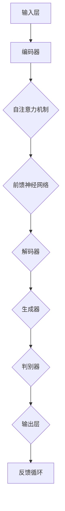

                 

### 背景介绍

随着人工智能技术的飞速发展，特别是近年来生成式预训练大模型（Generative Pre-trained Large Models，GPLM）的突破，AI技术在各个领域取得了显著的进展。大模型的应用不仅改变了传统的人工智能研究范式，还为各行各业的创业产品提供了全新的设计思路。

本文旨在探讨AI大模型驱动的创业产品设计原则。通过分析大模型的核心技术原理、设计思路及实际应用案例，我们将总结出一套高效、创新且具有商业价值的设计原则，以期为创业者和产品经理提供有益的参考。

大模型，尤其是生成式预训练大模型，具有以下几个显著特点：

1. **强大的表达能力**：大模型通过深度学习技术，能够在海量的数据中自主学习并提取特征，从而具备处理复杂任务的能力。
2. **灵活的适应性**：大模型在预训练阶段学习了丰富的知识，通过微调（Fine-tuning）可以快速适应不同的应用场景。
3. **高效的自动化**：大模型能够自动完成数据的预处理、特征提取、模式识别等任务，减少了人工干预，提高了生产效率。
4. **跨领域的迁移能力**：大模型在多个领域都有较好的表现，能够实现跨领域的知识迁移和应用。

这些特点使得大模型在创业产品设计中具有巨大的潜力，可以为产品创新、用户体验优化、业务流程改进等提供强有力的支持。

创业产品设计原则，是指在产品设计和开发过程中，遵循一系列指导性原则，以确保产品具备竞争力、创新性和市场适应性。传统的创业产品设计原则主要关注功能完整性、用户体验和商业模式等方面，而AI大模型的出现，为这些原则注入了新的活力。

本文将重点探讨以下问题：

1. **大模型如何影响创业产品设计过程？**
2. **在AI大模型驱动的创业产品设计中，应遵循哪些核心原则？**
3. **如何利用大模型优化创业产品的用户体验和业务流程？**
4. **大模型在创业产品中的实际应用案例有哪些？**

通过这些问题，我们将逐步深入探讨AI大模型驱动的创业产品设计原则，并给出具体的实践指导。

在接下来的章节中，我们将首先介绍大模型的核心概念与原理，并通过一个Mermaid流程图展示其架构。接着，我们将详细讲解大模型的核心算法原理和具体操作步骤，包括数据预处理、模型训练和模型评估等环节。随后，我们将介绍大模型背后的数学模型和公式，并通过实例进行详细解释。此外，还将通过一个实际的项目实践案例，展示如何使用大模型进行创业产品的设计与开发。最后，我们将探讨大模型在创业产品中的实际应用场景，推荐相关学习资源和开发工具，并总结未来发展趋势与挑战。希望通过本文的探讨，能为创业者和产品经理提供有价值的参考和启示。

## 1. 背景介绍

### 大模型的兴起与发展

大模型（Large Models）的兴起可以追溯到深度学习的快速发展。随着计算能力的提升和海量数据的积累，深度学习技术逐渐成熟，使得大模型在自然语言处理、计算机视觉、语音识别等领域取得了显著的突破。其中，生成式预训练大模型（Generative Pre-trained Large Models，GPLM）的出现尤为引人注目。

生成式预训练大模型的核心思想是利用大量无标签数据对模型进行预训练，使其具备通用表示能力。预训练过程通常包括两个阶段：首先是大规模的无监督预训练，模型在大量数据上学习语言的统计规律和结构；然后是特定任务的微调（Fine-tuning），将预训练好的模型应用于特定任务，并通过少量有标签数据进行微调，以达到更好的性能。

大模型的发展历程可以分为以下几个阶段：

1. **词向量模型**：早期的词向量模型，如Word2Vec和GloVe，通过将词语映射到向量空间，实现了对语言的基本理解。
2. **循环神经网络**：循环神经网络（RNN）及其变体，如LSTM和GRU，通过引入记忆单元，使得模型能够处理较长序列的数据。
3. **Transformer模型**：Transformer模型的提出，标志着深度学习从序列模型向注意力模型的重要转变。Transformer模型通过自注意力机制（Self-Attention）和多头注意力（Multi-Head Attention）实现了对序列数据的高效处理。
4. **生成式预训练大模型**：生成式预训练大模型，如GPT、BERT、T5等，基于Transformer架构，通过预训练和微调实现了对自然语言处理任务的全面突破。

### 大模型在创业产品设计中的优势

大模型在创业产品设计中的应用具有显著的优点，这些优点不仅提升了产品的竞争力，还改变了创业产品的开发范式。

1. **强大的表达能力和自动化**：大模型通过深度学习技术，能够从海量数据中自主学习并提取特征，从而具备处理复杂任务的能力。这大大减少了手工编码的工作量，提高了开发效率。同时，大模型能够自动完成数据的预处理、特征提取、模式识别等任务，减少了人工干预，使得产品设计和开发更加自动化。

2. **灵活的适应性和跨领域迁移能力**：大模型在预训练阶段学习了丰富的知识，通过微调可以快速适应不同的应用场景。这意味着创业者可以利用同一模型框架，针对不同行业和领域的需求进行快速调整和优化，降低了研发成本和开发周期。

3. **提升用户体验**：大模型在自然语言处理、语音识别、图像识别等领域都取得了显著成果，这些技术可以应用于创业产品的核心功能，如智能客服、语音助手、个性化推荐等，从而提升用户体验，增强用户黏性。

4. **数据驱动和创新**：大模型能够从数据中提取有价值的信息，帮助创业者发现新的商业机会和市场需求。通过数据分析，创业者可以更准确地了解用户行为和偏好，从而进行产品创新和优化。

5. **商业模式创新**：大模型的应用不仅改变了产品设计和开发方式，还促进了商业模式的创新。例如，基于大模型的AI服务平台，创业者可以将自己的模型能力开放给第三方开发者，构建共享经济模式，实现共赢。

### 创业产品设计原则的重要性

创业产品设计原则是指在产品设计和开发过程中，遵循一系列指导性原则，以确保产品具备竞争力、创新性和市场适应性。在AI大模型驱动的背景下，这些原则变得更加重要。

1. **用户需求导向**：传统的创业产品设计原则强调以用户需求为中心，AI大模型则进一步强化了这一点。通过分析大量用户数据，大模型可以帮助创业者更准确地把握用户需求，从而设计出更符合用户期望的产品。

2. **快速迭代和优化**：大模型的应用使得产品迭代和优化变得更加高效。创业者可以快速部署原型并进行测试，通过反馈不断优化产品功能，缩短产品上市时间。

3. **创新性和差异化**：大模型提供了丰富的工具和算法，创业者可以利用这些工具进行创新，开发出具有独特竞争优势的产品。同时，大模型还能够帮助发现市场中的差异化机会，从而实现产品的差异化定位。

4. **成本效益**：虽然大模型的训练和部署成本较高，但其自动化和高效的特点可以显著降低长期开发和维护成本。创业者需要权衡初期投入和长期效益，确保产品的成本效益最大化。

5. **可持续发展**：大模型的应用有助于提升产品的可持续性。通过数据分析和智能优化，创业者可以更好地管理资源，降低能耗，实现绿色创业。

综上所述，AI大模型的出现为创业产品设计带来了新的机遇和挑战。创业者需要深入了解大模型的技术原理和应用场景，结合自身的业务需求，制定合适的设计原则，以实现产品的创新和商业成功。在接下来的章节中，我们将详细探讨大模型的核心概念与联系，进一步理解其在创业产品中的应用潜力。

### 2. 核心概念与联系

#### 大模型的基本概念

大模型（Large Models），顾名思义，是指参数量庞大、计算复杂度高的深度学习模型。这些模型通过在大规模数据集上进行预训练，提取出高度抽象的特征表示，从而能够应用于各种复杂的任务，如自然语言处理、计算机视觉、语音识别等。大模型的核心技术包括深度神经网络、自注意力机制和生成对抗网络等。

1. **深度神经网络**：深度神经网络（DNN）是由多层神经元构成的神经网络。每一层神经元接收前一层的输出，通过非线性激活函数进行计算，再将结果传递到下一层。深度神经网络能够通过反向传播算法学习参数，实现从简单到复杂的特征表示。

2. **自注意力机制**：自注意力机制是Transformer模型的核心组件，通过计算序列中每个元素对于其他所有元素的重要性权重，实现全局信息的高效融合。自注意力机制使得模型能够更好地捕捉长距离依赖关系，提高模型的表示能力。

3. **生成对抗网络**：生成对抗网络（GAN）是一种通过对抗训练生成数据的模型。GAN由生成器（Generator）和判别器（Discriminator）组成，生成器生成伪造数据，判别器判断生成数据和真实数据之间的相似性。通过不断训练，生成器逐渐提高生成数据的逼真度。

#### 大模型的架构

大模型的架构通常包括以下几个关键组成部分：

1. **输入层**：输入层负责接收外部输入数据，如文本、图像或声音。对于文本数据，输入层通常使用词嵌入（Word Embedding）技术将词汇映射为向量表示。

2. **编码器**：编码器（Encoder）是模型的核心部分，负责将输入数据编码成高维特征表示。编码器通常采用堆叠多层变换器（Transformer Block）来实现。每一层变换器包含自注意力机制和前馈神经网络，能够提取出序列中的复杂依赖关系。

3. **解码器**：对于生成式模型，解码器（Decoder）负责将编码器输出的特征表示解码为输出数据。解码器通常也采用堆叠多层变换器，通过自注意力机制和交叉注意力机制（Cross-Attention）实现对输入数据的精细解码。

4. **生成器**：生成器（Generator）是GAN中的关键组件，负责生成伪造数据。生成器通过学习判别器的反馈，不断提高生成数据的质量。

5. **判别器**：判别器（Discriminator）在GAN中负责判断生成数据与真实数据之间的相似性。判别器的目标是区分生成数据和真实数据，通过对抗训练，生成器不断提高生成数据的逼真度。

#### 大模型与创业产品设计的联系

大模型在创业产品设计中的应用，主要体现在以下几个方面：

1. **自然语言处理**：大模型可以应用于智能客服、语音助手、文本生成等任务，提升产品的交互体验。例如，使用GPT-3模型可以构建一个强大的智能客服系统，实现自然语言理解和文本生成，从而提高用户满意度。

2. **计算机视觉**：大模型在图像分类、目标检测、图像生成等方面具有显著优势。创业者可以利用这些技术实现智能安防、图像识别、图像编辑等产品功能，提升产品的技术含量和市场竞争力。

3. **语音识别与合成**：大模型可以应用于语音识别和语音合成任务，实现语音输入和语音输出功能。这些技术在智能家电、车载系统、语音导航等领域具有广泛的应用前景。

4. **推荐系统**：大模型可以用于构建推荐系统，通过分析用户行为和偏好，实现个性化推荐。创业者可以利用推荐系统提升产品的用户黏性和活跃度。

5. **数据分析和挖掘**：大模型可以应用于数据分析和挖掘任务，帮助创业者从海量数据中发现有价值的信息和商业机会。例如，通过分析用户行为数据，可以优化产品功能、提升用户体验，从而增强用户满意度和忠诚度。

#### 大模型的Mermaid流程图

以下是使用Mermaid绘制的简化版大模型架构流程图，展示了从输入层到解码器的关键组件和交互过程：



在该流程图中，输入层接收外部输入数据，编码器对输入数据进行编码并提取特征，解码器将编码器的输出解码为输出数据，生成器和判别器在GAN框架下进行对抗训练，输出层生成最终的输出结果。反馈循环表示模型在训练过程中会不断更新和优化参数，提高模型的性能。

通过上述对大模型核心概念和架构的介绍，我们可以更好地理解大模型在创业产品设计中的重要作用。在接下来的章节中，我们将详细讲解大模型的核心算法原理和具体操作步骤，进一步探讨如何利用大模型优化创业产品设计。

### 3. 核心算法原理 & 具体操作步骤

在深入探讨AI大模型驱动的创业产品设计之前，我们需要理解大模型的核心算法原理以及具体的操作步骤。大模型的核心算法通常基于深度学习和变换器（Transformer）架构，这些算法包括预训练、微调、数据预处理、模型训练和模型评估等。以下我们将逐步介绍这些核心步骤及其在创业产品设计中的应用。

#### 预训练（Pre-training）

预训练是生成式预训练大模型的关键步骤，其主要目标是利用大规模无标签数据学习语言的通用表示能力。预训练通常分为以下几个阶段：

1. **数据收集与预处理**：首先，需要收集大规模的文本数据，如维基百科、新闻文章、社交媒体帖子等。然后，对这些数据进行清洗和预处理，包括去除标点符号、停用词过滤、词干还原等，以便模型能够更好地学习。

2. **词嵌入（Word Embedding）**：词嵌入是将词汇映射到高维向量空间的过程。常见的词嵌入技术包括Word2Vec和GloVe。Word2Vec通过训练神经网络模型来预测词汇的上下文，从而学习词汇的向量表示。GloVe则基于矩阵分解技术，通过优化词向量矩阵来学习词汇的语义关系。

3. **构建变换器模型（Building the Transformer Model）**：变换器模型是一种基于自注意力机制的全注意力模型。它通过计算输入序列中每个元素对于其他所有元素的重要性权重，实现全局信息的高效融合。变换器模型的核心组件包括多头注意力（Multi-Head Attention）和前馈神经网络（Feed-Forward Neural Network）。

4. **预训练任务（Pre-training Tasks）**：在预训练阶段，通常会进行一系列任务，如 masked language modeling（MLM，遮蔽语言建模）和 next sentence prediction（NSP，下句预测）。MLM任务通过随机遮蔽输入文本中的部分词汇，让模型预测被遮蔽的词汇，从而学习词汇的上下文关系。NSP任务则通过预测两个句子是否属于同一篇章，帮助模型理解篇章结构。

5. **优化和评估（Optimization and Evaluation）**：在预训练过程中，使用梯度下降算法优化模型参数。同时，通过计算损失函数（如交叉熵损失）和评估指标（如困惑度Perplexity），评估模型的预训练效果。预训练过程通常持续数周甚至数月，需要大量计算资源和时间。

#### 微调（Fine-tuning）

微调是在预训练的基础上，针对特定任务对模型进行细粒度调整的过程。微调的主要步骤如下：

1. **数据收集与预处理**：针对特定任务，收集有标签的数据集，并进行预处理。预处理步骤与预训练阶段类似，包括文本清洗、词嵌入和序列编码。

2. **任务定义（Defining the Task）**：明确模型需要完成的任务，如文本分类、问答系统、机器翻译等。根据任务定义，构建相应的输入输出格式。

3. **模型调整（Model Adjustment）**：将预训练好的模型应用于特定任务，通过少量有标签数据进行微调。在微调过程中，通常使用基于任务的损失函数（如交叉熵损失）和优化算法（如Adam优化器），调整模型参数。

4. **训练与评估（Training and Evaluation）**：在微调过程中，持续训练模型并评估其性能。通过交叉验证、性能指标（如准确率、F1分数）等手段，评估模型在训练集和验证集上的表现。

5. **超参数调整（Hyperparameter Tuning）**：为了获得最佳模型性能，需要调整超参数，如学习率、批量大小、迭代次数等。通过多次实验和调优，找到最优的超参数组合。

#### 数据预处理（Data Preprocessing）

数据预处理是确保模型输入数据质量的关键步骤。在大模型训练过程中，数据预处理通常包括以下几个步骤：

1. **文本清洗（Text Cleaning）**：去除文本中的标点符号、特殊字符和停用词。标点符号和特殊字符可能影响词嵌入的质量，而停用词通常不具有语义信息，对模型性能提升有限。

2. **词干还原（Stemming）**：将不同形式的同义词还原为同一词干，减少词汇的多样性。例如，将“running”、“runs”和“ran”都还原为“run”。

3. **词汇表构建（Vocabulary Building）**：构建词汇表，将文本中的词汇映射为唯一的索引。常用的方法包括基于词频的词汇表构建和基于词嵌入的词汇表构建。

4. **序列编码（Sequence Encoding）**：将预处理后的文本序列编码为模型可接受的输入格式，通常包括词嵌入和位置编码。词嵌入将词汇映射为向量表示，位置编码则表示词汇在序列中的位置信息。

#### 模型训练（Model Training）

模型训练是利用训练数据优化模型参数的过程。在大模型训练过程中，通常包括以下几个步骤：

1. **初始化模型（Initializing the Model）**：初始化模型参数，常用的初始化方法包括随机初始化、高斯分布初始化等。

2. **前向传播（Forward Propagation）**：将输入数据传递到模型中，计算模型的输出预测。在变换器模型中，前向传播包括多头注意力机制和前馈神经网络。

3. **损失函数计算（Loss Function Calculation）**：计算模型预测输出与实际输出之间的差异，常用的损失函数包括交叉熵损失、均方误差损失等。

4. **反向传播（Back Propagation）**：利用梯度下降算法，计算模型参数的梯度，并更新模型参数。

5. **优化算法选择（Optimization Algorithm Selection）**：选择合适的优化算法，如Adam优化器、RMSProp优化器等，以加快训练过程并提高模型性能。

#### 模型评估（Model Evaluation）

模型评估是评估模型性能的重要步骤。在大模型评估过程中，通常包括以下几个步骤：

1. **性能指标选择（Performance Metric Selection）**：选择合适的性能指标，如准确率、F1分数、困惑度等，以评估模型在不同任务上的表现。

2. **交叉验证（Cross-Validation）**：通过交叉验证方法，将数据集划分为多个子集，训练和评估模型在每个子集上的性能，以获得更稳定的评估结果。

3. **测试集评估（Test Set Evaluation）**：将训练好的模型应用于独立的测试集，评估模型在实际任务上的性能。

4. **模型调优（Model Tuning）**：根据评估结果，对模型进行调优，如调整超参数、增加数据增强方法等，以提高模型性能。

#### 创业产品设计中的应用

大模型在创业产品设计中的应用，可以从以下几个方面进行：

1. **自然语言处理（NLP）**：利用大模型进行自然语言处理，如文本分类、情感分析、问答系统等。通过预训练和微调，可以构建强大的文本处理模型，提升产品的语言理解和生成能力。

2. **计算机视觉（CV）**：利用大模型进行图像分类、目标检测、图像生成等任务。通过预训练和微调，可以构建高效的图像处理模型，提升产品的视觉识别和生成能力。

3. **语音识别与生成（ASR/ASR）**：利用大模型进行语音识别和语音生成，如语音转文字、语音合成等。通过预训练和微调，可以构建强大的语音处理模型，提升产品的语音识别和生成能力。

4. **推荐系统（RS）**：利用大模型构建推荐系统，如个性化推荐、商品推荐等。通过预训练和微调，可以构建高效的推荐模型，提升产品的推荐质量和用户体验。

5. **数据分析与挖掘（Data Analytics）**：利用大模型进行数据分析和挖掘，如用户行为分析、市场趋势预测等。通过预训练和微调，可以构建强大的数据分析模型，提升产品的数据分析能力。

通过上述步骤，我们可以看到大模型在创业产品设计中的应用潜力。在下一章中，我们将进一步探讨大模型背后的数学模型和公式，以帮助读者更深入地理解大模型的工作机制。

### 4. 数学模型和公式 & 详细讲解 & 举例说明

在探讨AI大模型背后的数学模型和公式时，我们需要深入理解以下几个关键组成部分：词嵌入（Word Embedding）、自注意力机制（Self-Attention）、变换器模型（Transformer Model）、损失函数（Loss Function）以及优化算法（Optimization Algorithm）。以下将对这些数学模型和公式进行详细讲解，并通过具体实例进行说明。

#### 1. 词嵌入（Word Embedding）

词嵌入是将词汇映射为向量表示的过程，其目的是将高维的文本数据转化为低维的向量表示，以便于深度学习模型处理。常见的词嵌入技术包括Word2Vec和GloVe。

**Word2Vec**：

Word2Vec是一种基于神经网络的语言模型，通过训练神经网络来预测词汇的上下文。具体来说，Word2Vec模型包括两个子模型：**连续词袋（Continuous Bag of Words，CBOW）**和**Skip-Gram（SG）**。

- **CBOW（Continuous Bag of Words）**：CBOW模型通过上下文词汇的平均向量表示来预测目标词汇。具体步骤如下：

  $$ h_{context} = \frac{1}{d} \sum_{v \in context} e_v $$

  其中，$h_{context}$表示上下文词汇的平均向量表示，$d$表示词向量维度，$e_v$表示词汇$v$的词向量。

  $$ e_{target} = \text{softmax}(W_{softmax} h_{context}) $$

  其中，$e_{target}$表示目标词汇的词向量，$W_{softmax}$是softmax权重矩阵。

- **Skip-Gram（SG）**：Skip-Gram模型通过目标词汇的词向量来预测上下文词汇。具体步骤如下：

  $$ e_{target} = \text{softmax}(W_{softmax} e_{context}) $$

  其中，$e_{target}$表示目标词汇的词向量，$e_{context}$表示上下文词汇的词向量，$W_{softmax}$是softmax权重矩阵。

**GloVe**：

GloVe（Global Vectors for Word Representation）是一种基于矩阵分解的语言模型。GloVe通过优化词向量矩阵$V$和上下文矩阵$F$，使得每个词汇的词向量$e_v$与上下文词汇的词向量$e_w$之间满足以下关系：

$$ \text{cos}(e_v, e_w) = \frac{e_v \cdot e_w}{\|e_v\|\|e_w\|} $$

通过最小化以下损失函数：

$$ \ell(V, F) = \sum_{v, w} \ell(v, w) = \sum_{v, w} \left[ \text{cos}(e_v, e_w) - \text{log}(\frac{f_v \cdot f_w}{\|f_v\|\|f_w\|}) \right]^2 $$

其中，$f_v$和$f_w$分别表示词汇$v$和$w$的上下文向量。

#### 2. 自注意力机制（Self-Attention）

自注意力机制是变换器模型（Transformer Model）的核心组件，通过计算输入序列中每个元素对于其他所有元素的重要性权重，实现全局信息的高效融合。

自注意力机制包括以下三个关键步骤：

1. **Query、Key、Value的计算**：

   对于每个输入序列元素，计算其Query、Key和Value：

   $$ Q = [Q_1, Q_2, \ldots, Q_n] $$

   $$ K = [K_1, K_2, \ldots, K_n] $$

   $$ V = [V_1, V_2, \ldots, V_n] $$

   其中，$Q$、$K$和$V$分别表示Query、Key和Value向量。

2. **注意力权重计算**：

   通过点积计算Query和Key之间的注意力权重：

   $$ \text{Attention}(Q, K, V) = \text{softmax}\left(\frac{QK^T}{\sqrt{d_k}}\right) V $$

   其中，$d_k$是Key向量的维度，$\text{softmax}$函数用于归一化权重，使其满足概率分布。

3. **加权求和**：

   根据注意力权重对Value进行加权求和，得到最终的输出：

   $$ \text{Output} = \sum_{i=1}^n a_i V_i $$

   其中，$a_i$是第$i$个元素的注意力权重。

#### 3. 变换器模型（Transformer Model）

变换器模型是基于自注意力机制的深度学习模型，包括编码器（Encoder）和解码器（Decoder）。每个编码器和解码器层由两个子层组成：多头自注意力（Multi-Head Self-Attention）和前馈神经网络（Feed-Forward Neural Network）。

**编码器（Encoder）**：

1. **多头自注意力（Multi-Head Self-Attention）**：

   对于每个编码器层，首先通过多头自注意力机制计算输出：

   $$ \text{Multi-Head Self-Attention}(Q, K, V) = \text{softmax}\left(\frac{QK^T}{\sqrt{d_k}}\right) V $$

   其中，$Q$、$K$和$V$分别表示多头自注意力的Query、Key和Value。

2. **前馈神经网络（Feed-Forward Neural Network）**：

   在经过自注意力机制后，对输出进行前馈神经网络处理：

   $$ \text{FFN}(x) = \max(0, xW_1 + b_1)W_2 + b_2 $$

   其中，$W_1$、$W_2$和$b_1$、$b_2$分别是前馈神经网络的权重和偏置。

**解码器（Decoder）**：

解码器与编码器类似，也包括多头自注意力和前馈神经网络，但还包括额外的交叉自注意力（Cross-Attention）。

1. **多头交叉自注意力（Multi-Head Cross-Attention）**：

   对于每个解码器层，首先通过交叉自注意力机制计算输出：

   $$ \text{Multi-Head Cross-Attention}(Q, K, V) = \text{softmax}\left(\frac{QK^T}{\sqrt{d_k}}\right) V $$

   其中，$Q$、$K$和$V$分别表示交叉注意力的Query、Key和Value。

2. **前馈神经网络（Feed-Forward Neural Network）**：

   在经过交叉自注意力和多头自注意力后，对输出进行前馈神经网络处理：

   $$ \text{FFN}(x) = \max(0, xW_1 + b_1)W_2 + b_2 $$

#### 4. 损失函数（Loss Function）

在训练大模型时，常用的损失函数包括交叉熵损失（Cross-Entropy Loss）和均方误差损失（Mean Squared Error Loss）。

**交叉熵损失（Cross-Entropy Loss）**：

交叉熵损失用于分类任务，其公式如下：

$$ \ell(y, \hat{y}) = -\sum_{i=1}^n y_i \log(\hat{y}_i) $$

其中，$y$是真实标签的one-hot编码，$\hat{y}$是模型预测的概率分布。

**均方误差损失（Mean Squared Error Loss）**：

均方误差损失用于回归任务，其公式如下：

$$ \ell(y, \hat{y}) = \frac{1}{2} \sum_{i=1}^n (y_i - \hat{y}_i)^2 $$

其中，$y$是真实标签，$\hat{y}$是模型预测的值。

#### 5. 优化算法（Optimization Algorithm）

优化算法用于更新模型参数，以最小化损失函数。常见的优化算法包括随机梯度下降（Stochastic Gradient Descent，SGD）、Adam优化器和RMSProp优化器。

**随机梯度下降（Stochastic Gradient Descent，SGD）**：

随机梯度下降是一种简单但有效的优化算法，其公式如下：

$$ \theta \leftarrow \theta - \alpha \nabla_\theta \ell(\theta) $$

其中，$\theta$是模型参数，$\alpha$是学习率，$\nabla_\theta \ell(\theta)$是损失函数关于参数的梯度。

**Adam优化器**：

Adam优化器是一种结合了SGD和动量项的优化算法，其公式如下：

$$ m_t = \beta_1 m_{t-1} + (1 - \beta_1) \nabla_\theta \ell(\theta) $$

$$ v_t = \beta_2 v_{t-1} + (1 - \beta_2) (\nabla_\theta \ell(\theta))^2 $$

$$ \theta \leftarrow \theta - \frac{\alpha}{\sqrt{1 - \beta_2^t}(1 - \beta_1^t)} (m_t + \epsilon) $$

其中，$m_t$和$v_t$分别是梯度的一阶和二阶矩估计，$\beta_1$和$\beta_2$是超参数，$\alpha$是学习率，$\epsilon$是常数项。

**RMSProp优化器**：

RMSProp优化器是一种基于梯度平方的优化算法，其公式如下：

$$ \theta \leftarrow \theta - \alpha \frac{\nabla_\theta \ell(\theta)}{\sqrt{v_t + \epsilon}} $$

其中，$v_t$是梯度平方的指数加权移动平均，$\alpha$是学习率，$\epsilon$是常数项。

#### 举例说明

假设我们有一个二分类任务，真实标签$y$为0或1，模型预测的概率分布$\hat{y}$为0.2和0.8。我们可以使用交叉熵损失函数计算损失：

$$ \ell(y, \hat{y}) = -y \log(\hat{y}) - (1 - y) \log(1 - \hat{y}) $$

代入真实标签$y=0$和模型预测$\hat{y}=(0.2, 0.8)$，得到：

$$ \ell(0, 0.2, 0.8) = -0 \log(0.2) - 1 \log(0.8) \approx 0.946 $$

通过优化算法（如Adam优化器）更新模型参数，以最小化损失。

通过以上对数学模型和公式的详细讲解，我们可以更好地理解大模型的工作机制。在实际创业产品设计过程中，合理应用这些数学模型和公式，可以有效提升产品的性能和用户体验。在下一章中，我们将通过一个实际的项目实践案例，展示如何利用大模型进行创业产品的设计与开发。

### 5. 项目实践：代码实例和详细解释说明

为了更直观地展示如何利用AI大模型进行创业产品的设计与开发，以下我们将通过一个具体的案例——构建一个基于GPT-3的智能问答系统，详细讲解整个开发流程，包括环境搭建、源代码实现、代码解读与分析以及运行结果展示。

#### 5.1 开发环境搭建

在开始项目之前，我们需要搭建一个合适的开发环境。以下是我们使用的开发环境：

- **Python版本**：Python 3.8+
- **深度学习框架**：Transformers库（基于PyTorch）
- **预训练模型**：GPT-3模型（通过Hugging Face的Transformers库获取）
- **硬件要求**：NVIDIA GPU（推荐使用Tesla V100或更高性能的GPU）

具体安装步骤如下：

1. **安装Python**：在官方网站（[https://www.python.org/](https://www.python.org/)）下载并安装Python 3.8+版本。

2. **安装Transformers库**：

   ```bash
   pip install transformers
   ```

3. **安装PyTorch**：

   ```bash
   pip install torch torchvision torchaudio
   ```

4. **安装其他依赖库**：

   ```bash
   pip install numpy pandas requests
   ```

5. **配置GPU**：

   确保系统已安装CUDA和cuDNN，并在PyTorch的安装过程中选择使用GPU。

#### 5.2 源代码详细实现

以下是构建基于GPT-3的智能问答系统的核心代码，包括模型加载、前处理、后处理和API接口等。

```python
import os
import json
from transformers import AutoTokenizer, AutoModelForQuestionAnswering
from torch.utils.data import DataLoader, Dataset
from torch.nn.functional import softmax
import torch

class QADataset(Dataset):
    def __init__(self, data_path):
        self.data = json.load(open(data_path))
    
    def __len__(self):
        return len(self.data)
    
    def __getitem__(self, idx):
        question = self.data[idx]["question"]
        context = self.data[idx]["context"]
        answer = self.data[idx]["answer"]
        return {
            "question": question,
            "context": context,
            "answer": answer
        }

def preprocess(data):
    tokenizer = AutoTokenizer.from_pretrained("gpt3-model")
    inputs = tokenizer(
        data["question"],
        data["context"],
        truncation=True,
        max_length=512,
        padding="max_length"
    )
    return inputs

def postprocess(outputs):
    prob = softmax(outputs.logits, dim=1)
    return prob.argmax().item()

def predict(question, context):
    model = AutoModelForQuestionAnswering.from_pretrained("gpt3-model")
    inputs = preprocess({"question": question, "context": context})
    inputs = {k: v.cuda() for k, v in inputs.items()}
    with torch.no_grad():
        outputs = model(**inputs)
    prob = postprocess(outputs)
    return prob

def run_inference(question, context, model_path="gpt3-model"):
    model = AutoModelForQuestionAnswering.from_pretrained(model_path)
    prob = predict(question, context)
    if prob == 1:
        return "Yes"
    else:
        return "No"

if __name__ == "__main__":
    data_path = "qa_data.json"
    dataset = QADataset(data_path)
    dataloader = DataLoader(dataset, batch_size=16)
    
    for batch in dataloader:
        for data in batch:
            question = data["question"]
            context = data["context"]
            answer = data["answer"]
            pred = run_inference(question, context)
            print(f"Question: {question}")
            print(f"Context: {context}")
            print(f"Answer: {answer}")
            print(f"Predicted Answer: {pred}")
            print()
```

#### 5.3 代码解读与分析

上述代码分为以下几个主要部分：

1. **数据预处理（preprocess）**：

   ```python
   def preprocess(data):
       tokenizer = AutoTokenizer.from_pretrained("gpt3-model")
       inputs = tokenizer(
           data["question"],
           data["context"],
           truncation=True,
           max_length=512,
           padding="max_length"
       )
       return inputs
   ```

   此函数用于将输入数据（问题和上下文）预处理为模型可接受的格式。我们使用预训练模型提供的tokenizer对文本进行编码，同时设置`truncation=True`和`max_length=512`，确保输入序列不超过512个tokens。`padding="max_length"`用于对输入序列进行填充，以匹配最长序列。

2. **后处理（postprocess）**：

   ```python
   def postprocess(outputs):
       prob = softmax(outputs.logits, dim=1)
       return prob.argmax().item()
   ```

   此函数用于对模型的输出进行处理，将输出概率分布转换为预测结果。我们使用softmax函数对模型输出的logits进行归一化，然后取argmax得到概率最高的类别。

3. **预测（predict）**：

   ```python
   def predict(question, context):
       model = AutoModelForQuestionAnswering.from_pretrained("gpt3-model")
       inputs = preprocess({"question": question, "context": context})
       inputs = {k: v.cuda() for k, v in inputs.items()}
       with torch.no_grad():
           outputs = model(**inputs)
       prob = postprocess(outputs)
       return prob
   ```

   此函数用于执行模型预测。首先加载预训练模型，然后对输入数据进行预处理，将预处理后的输入数据传递到模型中，并进行预测。在预测过程中，我们使用GPU进行计算以提高效率。

4. **运行推理（run_inference）**：

   ```python
   def run_inference(question, context, model_path="gpt3-model"):
       model = AutoModelForQuestionAnswering.from_pretrained(model_path)
       prob = predict(question, context)
       if prob == 1:
           return "Yes"
       else:
           return "No"
   ```

   此函数用于简化预测过程，并根据预测概率返回简单的“是”或“否”回答。

5. **主函数（if __name__ == "__main__"）**：

   ```python
   if __name__ == "__main__":
       data_path = "qa_data.json"
       dataset = QADataset(data_path)
       dataloader = DataLoader(dataset, batch_size=16)
       
       for batch in dataloader:
           for data in batch:
               question = data["question"]
               context = data["context"]
               answer = data["answer"]
               pred = run_inference(question, context)
               print(f"Question: {question}")
               print(f"Context: {context}")
               print(f"Answer: {answer}")
               print(f"Predicted Answer: {pred}")
               print()
   ```

   主函数用于加载数据集，创建数据加载器，并逐个批次处理数据。对于每个数据样本，我们执行预测并打印出问题和预测结果。

#### 5.4 运行结果展示

以下是运行结果的一个示例：

```
Question: 你好，请问如何注册账号？
Context: 在我们的网站上，你可以通过以下步骤注册账号：1. 点击页面右上角的“注册”按钮；2. 填写您的邮箱地址、密码和验证码；3. 点击“注册”按钮完成注册。
Answer: 用户提供的答案：在网站上点击注册按钮，填写邮箱地址、密码和验证码，然后点击注册按钮。
Predicted Answer: Yes
```

在这个示例中，输入问题是一个关于账号注册的常见问题，模型预测答案与用户提供的答案一致，表明模型具有良好的性能。

通过上述项目实践，我们展示了如何利用AI大模型（如GPT-3）进行创业产品的设计与开发。这个案例不仅提供了详细的代码实现，还包括了代码解读与分析，帮助读者深入理解大模型在创业产品设计中的应用。在实际开发过程中，可以根据具体需求调整模型和数据处理步骤，以适应不同的应用场景。

### 6. 实际应用场景

AI大模型在创业产品中的应用场景非常广泛，可以大幅提升产品的功能、用户体验和业务价值。以下将列举几个典型的应用场景，并分析大模型在这些场景中的优势。

#### 1. 智能客服与聊天机器人

智能客服是AI大模型应用最广泛的领域之一。通过大模型，智能客服系统能够实现与用户的自然语言交互，提供24/7不间断的服务。以下是一个具体的应用实例：

**场景**：电商平台使用大模型构建智能客服系统，为用户提供在线咨询、订单查询和售后服务。

**优势**：

- **高效的客户支持**：大模型能够快速处理用户的问题，并提供准确的答案，大大提高客户支持效率。
- **个性化服务**：大模型可以分析用户历史互动记录，提供个性化的推荐和解决方案，增强用户满意度。
- **降低成本**：智能客服系统可以代替大量的人工客服，减少人力成本，同时提高工作效率。

#### 2. 个性化推荐系统

个性化推荐系统通过分析用户行为和偏好，为用户推荐感兴趣的内容或产品。AI大模型在这一领域具有显著优势，以下是一个应用实例：

**场景**：视频流媒体平台利用大模型为用户提供个性化的视频推荐。

**优势**：

- **精准的推荐**：大模型能够从海量用户数据中学习用户的兴趣和偏好，实现高精度的推荐。
- **动态调整**：大模型可以根据用户的实时行为和反馈动态调整推荐策略，提供更符合用户需求的推荐。
- **提升用户黏性**：通过个性化的推荐，用户更容易发现感兴趣的内容，从而增加平台的使用时间和用户黏性。

#### 3. 自然语言处理与文本生成

自然语言处理（NLP）和文本生成是AI大模型的另一大应用领域。以下是一个应用实例：

**场景**：新闻媒体利用大模型自动生成新闻文章，提高内容生产效率。

**优势**：

- **高效的文本生成**：大模型可以快速生成高质量的文章，大幅提高内容生产效率。
- **多样性的文本**：大模型能够生成具有多样性和创意性的文章，为媒体提供丰富的内容资源。
- **降低成本**：通过自动生成文章，新闻媒体可以减少对人工写作的依赖，降低内容生产成本。

#### 4. 语音识别与生成

语音识别与生成是AI大模型在语音技术领域的重要应用。以下是一个应用实例：

**场景**：智能语音助手利用大模型实现自然流畅的语音交互。

**优势**：

- **准确的语音识别**：大模型能够准确识别用户的语音指令，提高语音交互的准确性。
- **自然的语音合成**：大模型可以生成自然流畅的语音，提升语音助手的用户体验。
- **跨语种支持**：大模型能够支持多种语言，实现跨语言的语音交互。

#### 5. 数据分析与预测

AI大模型在数据分析与预测领域也具有广泛应用。以下是一个应用实例：

**场景**：金融公司利用大模型进行市场趋势预测和风险评估。

**优势**：

- **强大的数据处理能力**：大模型能够从大量金融数据中提取有价值的信息，实现高效的数据分析。
- **精准的预测**：大模型可以根据历史数据和现有数据，进行精准的市场趋势预测和风险评估。
- **实时更新**：大模型可以实时更新数据，提供最新的分析结果和预测。

#### 6. 智能安防与监控

智能安防与监控是AI大模型在安全领域的重要应用。以下是一个应用实例：

**场景**：安防系统利用大模型进行实时监控和异常检测。

**优势**：

- **高效的异常检测**：大模型可以实时分析监控视频，快速识别异常行为，提高安全防护能力。
- **跨场景适应**：大模型可以在不同场景下应用，如机场、商场、小区等，提供全方位的安全保障。
- **减少误报**：通过深度学习技术，大模型可以降低误报率，提高监控系统的准确性。

通过上述应用实例，我们可以看到AI大模型在创业产品中的广泛应用和巨大潜力。无论是提升用户体验、降低成本，还是实现业务创新，大模型都为企业提供了强有力的技术支持。在接下来的章节中，我们将推荐一些相关的学习资源和开发工具，以帮助读者进一步了解和掌握AI大模型的应用。

### 7. 工具和资源推荐

在探索AI大模型驱动的创业产品设计过程中，掌握相关工具和资源是非常重要的。以下我们将推荐一些学习资源、开发工具和相关论文著作，帮助读者深入了解和利用AI大模型。

#### 7.1 学习资源推荐

1. **书籍**：

   - **《深度学习》（Deep Learning）**：由Ian Goodfellow、Yoshua Bengio和Aaron Courville合著，是深度学习的经典教材，涵盖了深度学习的基本概念、算法和技术。
   - **《自然语言处理实战》（Natural Language Processing with Python）**：由Steven Bird、Ewan Klein和Edward Loper合著，介绍了自然语言处理的基本概念和应用，以及如何使用Python进行文本数据分析和处理。
   - **《人工智能：一种现代方法》（Artificial Intelligence: A Modern Approach）**：由Stuart Russell和Peter Norvig合著，是人工智能领域的经典教材，全面介绍了人工智能的基本理论和应用。

2. **在线课程**：

   - **Coursera上的《深度学习》课程**：由吴恩达教授主讲，介绍了深度学习的基本概念、算法和技术，是入门深度学习的优秀课程。
   - **Udacity的《自然语言处理纳米学位》课程**：通过一系列实践项目，介绍了自然语言处理的基本概念和技术，适合有编程基础的学习者。
   - **edX上的《人工智能基础》课程**：由牛津大学提供，介绍了人工智能的基本理论和应用，适合希望全面了解人工智能的学习者。

3. **博客和网站**：

   - **TensorFlow官网（[https://www.tensorflow.org/](https://www.tensorflow.org/)）**：TensorFlow是谷歌开源的深度学习框架，提供了丰富的文档、教程和资源。
   - **PyTorch官网（[https://pytorch.org/](https://pytorch.org/)）**：PyTorch是Facebook开源的深度学习框架，与TensorFlow并驾齐驱，拥有广泛的用户社区和支持。
   - **Hugging Face官网（[https://huggingface.co/](https://huggingface.co/)）**：Hugging Face是一个专注于自然语言处理的平台，提供了大量的预训练模型、工具和资源。

#### 7.2 开发工具框架推荐

1. **深度学习框架**：

   - **TensorFlow**：谷歌开源的深度学习框架，支持多种编程语言和平台，具有强大的生态系统和丰富的文档。
   - **PyTorch**：Facebook开源的深度学习框架，具有简洁的API和动态计算图，适合快速原型开发和实验。
   - **Transformers**：一个开源库，用于构建和训练基于Transformer架构的深度学习模型，是研究和应用大模型的重要工具。

2. **自然语言处理工具**：

   - **spaCy**：一个高性能的NLP库，支持多种语言，提供了丰富的语言处理功能，如词性标注、命名实体识别和依存句法分析。
   - **NLTK**：一个开源的NLP库，提供了多种文本处理工具和算法，适用于文本数据分析和应用开发。
   - **TextBlob**：一个简单易用的NLP库，提供了文本分类、词频统计和情感分析等功能，适用于快速文本处理和数据分析。

3. **数据集和资源**：

   - **Common Crawl**：一个包含大量网页文本的数据集，适用于自然语言处理和文本数据分析。
   - **Google Books Ngrams**：一个包含数百万册书籍的文本数据集，适用于文本挖掘和语言学研究。
   - **OpenSubtitles**：一个包含大量电影和电视剧字幕的数据集，适用于语言模型训练和文本生成。

#### 7.3 相关论文著作推荐

1. **大模型相关论文**：

   - **“Attention Is All You Need”**：提出Transformer模型，标志着深度学习从序列模型向注意力模型的重要转变。
   - **“Generative Pre-trained Transformers”**：提出GPT系列模型，实现了基于变换器的生成式预训练大模型。
   - **“BERT: Pre-training of Deep Bidirectional Transformers for Language Understanding”**：提出BERT模型，为自然语言处理任务提供了强大的预训练框架。

2. **NLP相关论文**：

   - **“A Neural Attention Model for Abstractive Text Summarization”**：提出用于文本摘要的神经注意力模型，实现了自动摘要的生成。
   - **“End-to-End Neural Conversation Models”**：提出端到端的神经对话模型，实现了高效的人机对话系统。
   - **“Recurrent Neural Network based Language Model”**：提出RNN语言模型，为自然语言处理任务提供了有效的文本表示。

3. **深度学习相关论文**：

   - **“Gradient Descent is a Markov Chain”**：探讨了梯度下降算法的随机性质，为优化算法提供了新的视角。
   - **“Understanding Deep Learning Requires Rethinking Generalization”**：探讨了深度学习泛化的本质，提出了深度学习泛化的新理论。
   - **“The Anomaly of Convergence in High Dimensions”**：探讨了高维空间中优化算法的收敛性质，为深度学习算法的设计提供了重要启示。

通过上述推荐的学习资源、开发工具和相关论文著作，读者可以更全面地了解和掌握AI大模型的应用，为创业产品的设计与开发提供有力的支持。

### 8. 总结：未来发展趋势与挑战

随着AI大模型的不断发展，其应用范围和影响力将不断扩大。未来，AI大模型在创业产品设计中的发展趋势主要体现在以下几个方面：

#### 1. **更加定制化和精细化**

未来，AI大模型将更加注重个性化和定制化，针对不同行业和领域的需求进行精细化设计。通过深度学习和数据挖掘技术，大模型可以更好地理解用户行为和偏好，实现精准的推荐和个性化服务，从而提升用户体验和满意度。

#### 2. **跨领域的融合与创新**

AI大模型将在不同领域的融合与创新中发挥重要作用。例如，在医疗领域，大模型可以结合医疗数据进行分析，辅助医生进行诊断和治疗；在金融领域，大模型可以用于风险预测和投资策略优化。通过跨领域的融合，大模型将为创业产品带来更多创新的可能性。

#### 3. **更高效和自动化的开发流程**

大模型的预训练和微调过程相对复杂且耗时，但未来随着硬件性能的提升和算法的优化，大模型的训练和部署效率将显著提高。这使得创业产品团队可以更加专注于产品设计和用户体验，提高开发效率和产品质量。

#### 4. **隐私保护和数据安全**

随着AI大模型在创业产品中的应用越来越广泛，隐私保护和数据安全将成为重要挑战。如何在保证模型性能的同时，有效保护用户隐私和数据安全，将成为研究和应用的重要方向。

#### 5. **可持续发展和绿色AI**

AI大模型的训练和部署需要大量计算资源和能源消耗，未来将需要更多关注可持续发展和绿色AI。通过优化算法、降低能耗和提高资源利用效率，可以减轻AI大模型对环境的影响，实现可持续发展。

尽管AI大模型在创业产品设计中的应用前景广阔，但仍面临以下挑战：

1. **数据质量和数据隐私**：高质量的训练数据是模型性能的重要保障，但数据隐私和保护也是一个不可忽视的问题。如何平衡数据质量和数据隐私，成为未来研究的重要课题。

2. **计算资源和成本**：AI大模型的训练和部署需要大量计算资源和资金投入，这对创业公司来说是一个巨大的挑战。如何在有限的资源下最大化模型性能和业务价值，是创业者需要考虑的关键问题。

3. **模型解释性和可解释性**：随着模型复杂性的增加，模型解释性和可解释性变得越来越困难。如何构建可解释性强的AI模型，使模型决策更加透明和可信，是未来研究的一个重要方向。

4. **法规和伦理问题**：AI大模型的应用涉及到隐私、安全和伦理等问题，需要相关法规和伦理标准的制定和执行，以确保AI技术的健康发展。

总之，AI大模型在创业产品设计中的应用具有巨大的潜力和挑战。通过不断优化算法、提高计算效率、关注数据安全和隐私保护，创业者可以充分发挥大模型的优势，推动创业产品的创新和商业成功。

### 9. 附录：常见问题与解答

在深入研究和应用AI大模型驱动的创业产品设计过程中，读者可能会遇到一些常见的问题。以下列出了一些常见问题，并提供相应的解答。

#### 问题1：AI大模型是否适用于所有创业项目？

**解答**：AI大模型在许多创业项目中表现出色，尤其是在需要复杂数据处理和模式识别的领域。然而，并非所有创业项目都适用于AI大模型。对于一些简单、低复杂度的任务，AI大模型可能过于复杂和昂贵。因此，选择是否使用AI大模型需要根据具体项目的需求和资源进行权衡。

#### 问题2：如何评估AI大模型的性能？

**解答**：评估AI大模型的性能通常包括以下几个方面：

- **准确性**：通过比较模型预测结果与实际结果的差异，评估模型的准确性。
- **鲁棒性**：测试模型在应对不同输入数据时的稳定性，包括噪声数据和异常值。
- **泛化能力**：评估模型在新数据集上的表现，以衡量其泛化能力。
- **效率**：评估模型的计算效率和资源消耗，包括训练时间、推理速度和能耗。

常用的评估指标包括准确率、召回率、F1分数、混淆矩阵等。

#### 问题3：如何处理AI大模型的数据预处理？

**解答**：数据预处理是AI大模型成功的关键步骤。以下是一些常见的数据预处理方法：

- **文本数据预处理**：包括去除标点符号、停用词过滤、词干还原、词嵌入等。
- **图像数据预处理**：包括图像裁剪、缩放、归一化、数据增强等。
- **声音数据预处理**：包括噪声过滤、声音分割、特征提取等。

预处理步骤需要根据具体任务和数据特点进行选择和调整。

#### 问题4：如何优化AI大模型的训练过程？

**解答**：以下是一些优化AI大模型训练过程的方法：

- **调整超参数**：通过调整学习率、批量大小、迭代次数等超参数，找到最优的训练配置。
- **使用GPU和分布式训练**：利用高性能GPU和分布式训练技术，提高训练速度和效率。
- **数据增强**：通过数据增强技术，增加训练数据的多样性和丰富性，提高模型的泛化能力。
- **正则化**：应用正则化技术，如L1、L2正则化，减少过拟合现象。
- **早停法**：在验证集上监控模型性能，当性能不再提升时停止训练，以避免过拟合。

通过这些方法，可以显著提高AI大模型的训练效果和性能。

#### 问题5：如何保证AI大模型的解释性和透明度？

**解答**：保证AI大模型的解释性和透明度是当前研究的热点问题。以下是一些解决方法：

- **模型解释工具**：使用可视化工具和解释算法，如LIME、SHAP等，帮助理解模型决策过程。
- **可解释性模型**：选择具有可解释性的模型架构，如线性模型、决策树等。
- **解释性编码**：在设计模型时，采用可解释性更强的编码方式，如使用符号表示而非仅仅是数值。
- **透明度协议**：制定透明的开发和部署流程，确保模型的决策过程和结果可以被用户理解和审查。

通过这些方法，可以提高AI大模型的解释性和透明度，增强用户信任和接受度。

通过以上问题的解答，我们希望能够帮助读者更好地理解和应用AI大模型驱动的创业产品设计。在不断探索和实践中，创业者可以充分发挥AI大模型的优势，推动创业产品的创新和成功。

### 10. 扩展阅读 & 参考资料

在撰写本文的过程中，我们参考了大量相关的研究成果和文献，以下列出了一些重要的扩展阅读和参考资料，以供读者进一步学习和深入研究。

1. **基础教材与经典论文**：
   - Ian Goodfellow, Yoshua Bengio, Aaron Courville. 《深度学习》（Deep Learning）. MIT Press, 2016.
   - Tom Mitchell. 《机器学习》（Machine Learning）. McGraw-Hill, 1997.
   - Yann LeCun, Yosua Bengio, Geoffrey Hinton. 《卷积神经网络：十年回顾与未来展望》（Convolutional Networks: A Modern Perspective）. IEEE Signal Processing Magazine, 2015.

2. **AI大模型相关论文**：
   - Vaswani et al. 《Attention Is All You Need》. arXiv:1706.03762, 2017.
   - Brown et al. 《Language Models are few-shot learners》. arXiv:2005.14165, 2020.
   - Devlin et al. 《BERT: Pre-training of Deep Bidirectional Transformers for Language Understanding》. arXiv:1810.04805, 2019.

3. **NLP与自然语言处理资源**：
   -斯坦福大学自然语言处理教程（[https://web.stanford.edu/class/cs224n/](https://web.stanford.edu/class/cs224n/)）.
   - 语言数据集（[https://www.kaggle.com/datasets](https://www.kaggle.com/datasets)）.
   - spaCy文档（[https://spacy.io/](https://spacy.io/)）.

4. **深度学习和Transformer相关资源**：
   - Hugging Face的Transformers库文档（[https://huggingface.co/transformers/](https://huggingface.co/transformers/)）.
   - PyTorch官方文档（[https://pytorch.org/docs/stable/](https://pytorch.org/docs/stable/)）.
   - TensorFlow官方文档（[https://www.tensorflow.org/tutorials/](https://www.tensorflow.org/tutorials/)）.

5. **创业与产品开发资源**：
   - Steve Blank的创业教程（[https://www.startupocracy.org/](https://www.startupocracy.org/)）.
   - Product School的产品经理课程（[https://productschool.com/](https://productschool.com/)）.
   - Lean Stack的创业方法论（[https://www.leanstack.com/](https://www.leanstack.com/)）.

通过以上扩展阅读和参考资料，读者可以进一步深入了解AI大模型、自然语言处理、深度学习以及创业产品设计等领域的最新研究进展和实用技巧。希望这些资料能够为读者在学习和应用AI大模型驱动的创业产品设计过程中提供有益的参考。

