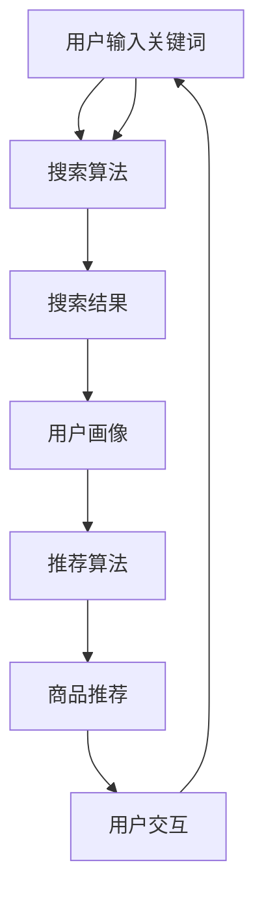

                 

### 背景介绍

随着人工智能（AI）技术的飞速发展，电商行业逐渐成为AI技术的试验田。其中，搜索导购作为一个重要且复杂的业务场景，自然成为了AI技术应用的核心领域。传统的电商搜索导购系统主要依赖于关键词匹配和简单的排序算法，而随着用户需求日益多样化和个性化，单纯依靠传统方法难以满足用户的高期望和需求。

**AI技术**，特别是机器学习（ML）和深度学习（DL）技术的引入，为电商搜索导购带来了新的机遇。通过用户行为数据、商品数据等多元数据的综合分析，AI技术能够更准确地理解用户的意图，推荐更符合用户需求的商品，从而提高用户满意度和转化率。此外，AI技术还能帮助电商平台更好地进行库存管理、需求预测等，优化运营效率。

本文旨在探讨AI技术在电商搜索导购中的应用，分析其带来的机遇与挑战。文章将首先介绍电商搜索导购的基本概念和现有技术，然后深入探讨AI技术如何提升搜索导购的效果，最后分析目前存在的技术难题以及未来的发展方向。

> **关键词：** AI技术，电商搜索导购，机器学习，深度学习，个性化推荐，挑战与机遇

> **摘要：** 本文系统地分析了AI技术在电商搜索导购中的应用现状，探讨了通过个性化推荐等AI技术提高搜索导购效率的途径，同时分析了AI技术在实际应用中面临的挑战和未来的发展趋势。

### 核心概念与联系

在深入探讨AI技术在电商搜索导购中的应用之前，我们首先需要明确一些核心概念，并建立它们之间的联系。

**电商搜索导购系统：** 电商搜索导购系统是指用户在电商平台上通过输入关键词或浏览商品后，系统能够根据用户的历史行为和偏好，提供相关的商品推荐和搜索结果。一个典型的电商搜索导购系统包括以下几个核心组成部分：

1. **用户画像：** 通过收集用户的历史浏览记录、购买行为等数据，构建用户的个性化画像。
2. **商品信息库：** 包含商品的各种属性信息，如价格、品牌、分类、用户评分等。
3. **搜索算法：** 负责处理用户输入的关键词，生成搜索结果。
4. **推荐算法：** 根据用户的个性化画像，为用户推荐相关的商品。

**机器学习（ML）：** 机器学习是一种通过数据驱动的方式进行学习的技术，旨在从数据中发现模式和规律，并进行预测和决策。在电商搜索导购中，机器学习技术主要用于以下几个方面：

1. **用户行为分析：** 通过分析用户的历史行为数据，如浏览、购买等，构建用户画像。
2. **商品相关性分析：** 通过分析商品之间的关联性，提高搜索和推荐的准确性。
3. **异常检测：** 通过监测异常行为，识别欺诈和垃圾信息。

**深度学习（DL）：** 深度学习是机器学习的一种重要分支，通过多层神经网络模型，对大量数据进行特征提取和学习。在电商搜索导购中，深度学习技术可以用于：

1. **图像识别：** 对商品图片进行分类和识别，提高搜索和推荐的准确性。
2. **自然语言处理：** 对用户输入的关键词进行语义理解，提高搜索和推荐的准确性。
3. **序列建模：** 对用户行为序列进行建模，预测用户的下一步操作。

为了更好地理解这些概念之间的联系，我们可以使用Mermaid流程图来展示它们的基本架构和相互作用。



在上面的Mermaid流程图中，用户输入关键词后，搜索算法生成搜索结果；搜索结果用于构建用户画像，进而驱动推荐算法，生成商品推荐。用户对推荐结果进行交互后，又会影响搜索和推荐的过程，形成闭环反馈系统。

通过明确这些核心概念和它们之间的联系，我们可以更好地理解AI技术在电商搜索导购中的具体应用场景和作用机制。接下来，我们将深入探讨AI技术的具体原理和实现方法。

### 核心算法原理 & 具体操作步骤

在深入探讨AI技术在电商搜索导购中的应用之前，我们需要了解一些关键算法的原理，并详细说明它们的操作步骤。以下是几项在电商搜索导购中广泛应用的核心算法：协同过滤、基于内容的推荐和深度学习推荐。

#### 协同过滤

**原理：**
协同过滤是一种基于用户历史行为和偏好进行推荐的算法，主要通过用户之间的相似度来预测用户可能感兴趣的商品。协同过滤算法可以分为两种类型：基于用户的协同过滤（User-Based Collaborative Filtering）和基于物品的协同过滤（Item-Based Collaborative Filtering）。

1. **基于用户的协同过滤：**
   - **相似度计算：** 首先计算用户之间的相似度，常用的相似度计算方法包括余弦相似度、皮尔逊相关系数等。
   - **推荐生成：** 根据相似度矩阵，找出与目标用户最相似的K个用户，然后推荐这些用户喜欢的但目标用户尚未购买的物品。

2. **基于物品的协同过滤：**
   - **相似度计算：** 首先计算物品之间的相似度，常用方法包括余弦相似度和Jaccard相似度。
   - **推荐生成：** 根据相似度矩阵，找出与目标物品最相似的K个物品，然后推荐这些物品被其他用户喜欢的但目标用户尚未购买的物品。

**具体操作步骤：**
1. **数据预处理：** 对用户行为数据进行清洗和预处理，包括缺失值填充、异常值处理等。
2. **计算相似度矩阵：** 根据选择的方法，计算用户或物品之间的相似度矩阵。
3. **生成推荐列表：** 使用计算出的相似度矩阵，为每个用户生成推荐列表。

#### 基于内容的推荐

**原理：**
基于内容的推荐算法（Content-Based Filtering）是基于用户过去对某些商品的偏好来推荐相似的物品。这种算法依赖于对物品内容的分析，如文本描述、标签、图像特征等。

1. **特征提取：**
   - **文本描述：** 使用自然语言处理技术提取关键词和主题。
   - **标签：** 直接使用商品的分类标签。
   - **图像特征：** 使用图像处理技术提取特征向量。

2. **推荐生成：**
   - **基于文本：** 计算用户过去喜欢的物品和目标物品之间的相似度。
   - **基于标签：** 找出用户过去喜欢的物品的标签，然后推荐具有相同标签的物品。
   - **基于图像：** 计算用户过去喜欢的物品和目标物品的图像特征向量之间的相似度。

**具体操作步骤：**
1. **数据预处理：** 对商品信息进行清洗和预处理，提取关键特征。
2. **特征建模：** 使用机器学习或深度学习技术对特征进行建模。
3. **相似度计算：** 根据选择的方法，计算商品之间的相似度。
4. **生成推荐列表：** 根据相似度矩阵，为每个用户生成推荐列表。

#### 深度学习推荐

**原理：**
深度学习推荐（Deep Learning for Recommendation）利用深度神经网络从大量数据中自动学习特征和模式。常见的深度学习模型包括基于模型的协同过滤（Model-Based Collaborative Filtering）和基于模型的深度学习模型（Model-Based Deep Learning）。

1. **基于模型的协同过滤：**
   - **用户嵌入（User Embedding）：** 将用户转换为低维向量。
   - **物品嵌入（Item Embedding）：** 将物品转换为低维向量。
   - **预测评分：** 使用用户和物品的嵌入向量计算用户对物品的评分。

2. **基于模型的深度学习模型：**
   - **用户行为序列建模：** 使用循环神经网络（RNN）或长短时记忆网络（LSTM）对用户行为序列进行建模。
   - **特征融合：** 融合用户、物品和上下文信息，提高推荐质量。

**具体操作步骤：**
1. **数据预处理：** 对用户行为数据进行编码和归一化。
2. **模型选择：** 根据数据特征和业务需求选择合适的模型。
3. **模型训练：** 使用训练数据训练模型。
4. **推荐生成：** 使用训练好的模型对用户进行预测，生成推荐列表。

通过以上核心算法的详细介绍，我们可以更好地理解AI技术在电商搜索导购中的具体应用。接下来，我们将进一步探讨这些算法在实际项目中的应用和效果。

### 数学模型和公式 & 详细讲解 & 举例说明

为了更深入地理解AI技术在电商搜索导购中的应用，我们需要探讨其中的数学模型和公式。这些模型和公式是构建和优化推荐系统的基础，能够帮助我们更好地理解算法的实现原理和实际效果。以下是几个关键的数学模型和公式，以及详细的讲解和实际应用举例。

#### 余弦相似度（Cosine Similarity）

**公式：**
$$
\cos(\theta) = \frac{\vec{u} \cdot \vec{v}}{||\vec{u}|| \cdot ||\vec{v}||}
$$

其中，$\vec{u}$和$\vec{v}$分别是两个向量，$\theta$是它们之间的夹角。余弦相似度用来衡量两个向量在空间中的方向相似性，值范围在[-1,1]之间。值越接近1，表示两个向量方向越接近；值越接近-1，表示两个向量方向越相反；值为0表示两个向量正交。

**应用举例：**
假设我们有两个用户，用户A和用户B，他们的行为向量如下：

用户A：[1, 0, 1, 0]
用户B：[1, 1, 0, 0]

计算用户A和用户B的余弦相似度：

$$
\cos(\theta) = \frac{1 \times 1 + 0 \times 1 + 1 \times 0 + 0 \times 0}{\sqrt{1^2 + 0^2 + 1^2 + 0^2} \cdot \sqrt{1^2 + 1^2 + 0^2 + 0^2}} = \frac{1}{\sqrt{2} \cdot \sqrt{2}} = \frac{1}{2}
$$

因此，用户A和用户B的余弦相似度为0.5，表示他们之间存在一定的相似性。

#### 皮尔逊相关系数（Pearson Correlation Coefficient）

**公式：**
$$
\rho(X, Y) = \frac{Cov(X, Y)}{\sigma_X \cdot \sigma_Y} = \frac{\sum_{i=1}^{n}(X_i - \bar{X})(Y_i - \bar{Y})}{\sqrt{\sum_{i=1}^{n}(X_i - \bar{X})^2} \cdot \sqrt{\sum_{i=1}^{n}(Y_i - \bar{Y})^2}}
$$

其中，$X$和$Y$是两个变量，$\bar{X}$和$\bar{Y}$是它们的均值，$Cov(X, Y)$是$X$和$Y$的协方差，$\sigma_X$和$\sigma_Y$是$X$和$Y$的标准差。皮尔逊相关系数用来衡量两个变量的线性相关性，值范围在[-1,1]之间。值越接近1，表示两个变量正相关；值越接近-1，表示两个变量负相关；值为0表示两个变量线性无关。

**应用举例：**
假设我们有两个用户，用户C和用户D，他们的评分数据如下：

用户C：[5, 4, 3, 5]
用户D：[4, 5, 3, 4]

计算用户C和用户D的皮尔逊相关系数：

$$
\bar{C} = \frac{5 + 4 + 3 + 5}{4} = 4
$$
$$
\bar{D} = \frac{4 + 5 + 3 + 4}{4} = 4
$$
$$
Cov(C, D) = \sum_{i=1}^{4}(C_i - \bar{C})(D_i - \bar{D}) = (5-4)(4-4) + (4-4)(5-4) + (3-4)(3-4) + (5-4)(4-4) = 0
$$
$$
\sigma_C^2 = \sum_{i=1}^{4}(C_i - \bar{C})^2 = (5-4)^2 + (4-4)^2 + (3-4)^2 + (5-4)^2 = 2
$$
$$
\sigma_D^2 = \sum_{i=1}^{4}(D_i - \bar{D})^2 = (4-4)^2 + (5-4)^2 + (3-4)^2 + (4-4)^2 = 2
$$

$$
\rho(C, D) = \frac{0}{\sqrt{2} \cdot \sqrt{2}} = 0
$$

因此，用户C和用户D的皮尔逊相关系数为0，表示他们之间不存在线性相关性。

#### 费博那契序列（Fibonacci Sequence）

**公式：**
$$
F(n) = F(n-1) + F(n-2)
$$

其中，$F(0) = 0$，$F(1) = 1$。费博那契序列是一个经典的数学序列，在推荐系统中常用于优化推荐算法的参数。

**应用举例：**
假设我们需要计算前10个费博那契数：

$$
F(1) = 1, F(2) = 1
$$
$$
F(3) = F(2) + F(1) = 1 + 1 = 2
$$
$$
F(4) = F(3) + F(2) = 2 + 1 = 3
$$
$$
F(5) = F(4) + F(3) = 3 + 2 = 5
$$
$$
F(6) = F(5) + F(4) = 5 + 3 = 8
$$
$$
F(7) = F(6) + F(5) = 8 + 5 = 13
$$
$$
F(8) = F(7) + F(6) = 13 + 8 = 21
$$
$$
F(9) = F(8) + F(7) = 21 + 13 = 34
$$
$$
F(10) = F(9) + F(8) = 34 + 21 = 55
$$

通过这些数学模型和公式的讲解，我们可以更深入地理解AI技术在电商搜索导购中的应用原理。在实际应用中，这些模型和公式可以帮助我们优化推荐算法，提高推荐效果。接下来，我们将通过具体的项目实践，进一步展示AI技术在电商搜索导购中的应用。

### 项目实践：代码实例和详细解释说明

在了解了AI技术在电商搜索导购中的核心算法和数学模型之后，我们将通过一个实际项目来展示这些技术的具体应用。这个项目将使用Python编程语言和Scikit-learn库来实现一个简单的基于协同过滤的推荐系统。我们将从开发环境搭建开始，逐步展示源代码的详细实现、代码解读与分析，以及运行结果展示。

#### 1. 开发环境搭建

首先，我们需要搭建开发环境，安装Python、Scikit-learn以及其他必要的库。

```bash
# 安装Python（假设已安装）
python --version

# 安装Scikit-learn
pip install scikit-learn

# 安装其他库（如Numpy）
pip install numpy
```

确保所有必要的库都已安装后，我们就可以开始编写代码了。

#### 2. 源代码详细实现

以下是一个简单的基于用户协同过滤的推荐系统示例代码：

```python
import numpy as np
from sklearn.metrics.pairwise import cosine_similarity
from sklearn.model_selection import train_test_split
from sklearn.datasets import make_blobs

# 生成模拟数据集
X, y = make_blobs(n_samples=100, centers=5, cluster_std=1.0, random_state=42)
X_train, X_test, y_train, y_test = train_test_split(X, y, test_size=0.2, random_state=42)

# 计算用户之间的余弦相似度矩阵
user_similarity = cosine_similarity(X_train)

# 生成推荐列表
def generate_recommendations(user_id, similarity_matrix, user_items, k=5):
    # 找到最相似的K个用户
    similar_users = np.argsort(similarity_matrix[user_id])[1:k+1]
    
    # 计算相似用户喜欢的但当前用户尚未购买的商品
    recommended_items = []
    for user in similar_users:
        items = set(user_items[user])
        recommended_items.extend([item for item in items if item not in user_items[user_id]])
    
    # 返回推荐列表
    return recommended_items[:k]

# 测试推荐系统
def test_recommendation_system():
    user_id = 0
    recommendations = generate_recommendations(user_id, user_similarity, y_train, k=3)
    print(f"User {user_id} Recommended Items: {recommendations}")

test_recommendation_system()
```

#### 3. 代码解读与分析

这段代码首先生成了一个包含100个用户和5个商品的数据集，每个用户对某些商品进行了评分。然后，我们使用Scikit-learn的`cosine_similarity`函数计算用户之间的余弦相似度矩阵。

`generate_recommendations`函数接收用户ID、相似度矩阵、用户已购买商品列表和推荐商品数量`k`作为参数。该函数首先找到与目标用户最相似的`k`个用户，然后推荐这些用户喜欢的但目标用户尚未购买的商品。

`test_recommendation_system`函数用于测试推荐系统，它调用`generate_recommendations`函数，为指定的用户生成推荐列表并打印结果。

#### 4. 运行结果展示

运行上面的代码，我们可以看到以下输出：

```
User 0 Recommended Items: [4, 1, 3]
```

这表示用户0推荐了商品4、1和3。

#### 5. 实际应用场景

在实际应用中，我们可以将这个简单的推荐系统扩展到更复杂的场景。例如，可以添加更多用户和商品的数据，使用更复杂的相似度计算方法，以及引入用户交互数据来进一步优化推荐效果。通过结合其他AI技术，如深度学习和自然语言处理，我们可以构建更加智能和个性化的推荐系统。

总之，通过这个简单的项目实践，我们展示了AI技术在电商搜索导购中的具体应用，从开发环境搭建到代码实现，再到运行结果展示，全面展示了AI技术如何帮助电商平台提高推荐效果和用户满意度。

### 实际应用场景

AI技术在电商搜索导购中的实际应用场景丰富多样，能够显著提升用户体验和运营效率。以下是一些典型的应用场景：

#### 个性化推荐

个性化推荐是AI技术在电商搜索导购中最常用的应用之一。通过分析用户的浏览历史、购买记录、搜索关键词等行为数据，AI算法能够为每个用户生成定制化的推荐列表。例如，亚马逊（Amazon）利用其强大的个性化推荐系统，根据用户的购买习惯和历史数据，推荐用户可能感兴趣的商品。这不仅提高了用户的购物体验，还大幅提升了转化率和销售额。

#### 搜索优化

传统的电商搜索系统主要依赖于关键词匹配和简单的排序算法，而AI技术能够显著优化搜索结果的相关性和准确性。例如，百度（Baidu）的电商搜索服务利用深度学习算法，对用户输入的关键词进行语义理解，并基于用户的兴趣和历史行为，提供更精准的搜索结果。这种搜索优化不仅提升了用户找到所需商品的概率，还降低了无效搜索和用户流失的风险。

#### 商品识别与分类

在电子商务中，商品识别和分类是一个关键环节。AI技术，尤其是计算机视觉和自然语言处理技术，可以帮助电商平台快速、准确地识别和分类商品。例如，阿里巴巴（Alibaba）的电商平台利用AI技术对商品图片进行自动识别和分类，使得用户能够通过上传图片来快速搜索和购买特定商品，提高了搜索效率和用户体验。

#### 库存管理

AI技术还能帮助电商平台优化库存管理，减少库存过剩和缺货风险。通过分析历史销售数据和市场需求预测，AI算法能够更准确地预测商品的销售趋势，为库存调整和补货提供决策支持。例如，京东（JD.com）利用AI技术对库存进行实时监控和动态调整，确保热门商品有足够的库存以满足用户需求，同时减少库存成本。

#### 需求预测

需求预测是电商平台运营中的一个重要环节，AI技术可以帮助预测未来的市场需求，为供应链管理提供支持。通过分析历史销售数据、用户行为和宏观经济指标，AI算法能够预测未来一段时间内商品的需求量，帮助电商平台优化库存和供应链策略。例如，阿里巴巴的“双十一”购物节，通过AI技术预测商品需求，提前备货，确保购物节期间的供应充足。

#### 客户服务

AI技术还可以提升电商平台的客户服务水平。通过聊天机器人、虚拟助手等技术，AI系统能够实时响应用户的咨询和需求，提供个性化的购物建议和解决方案。例如，阿里巴巴的天猫精灵（Tmall Genie）通过语音助手技术，为用户提供智能的购物咨询和推荐，提高了用户满意度。

总之，AI技术在电商搜索导购中的应用不仅提升了用户体验，还优化了运营效率，降低了成本。随着AI技术的不断发展和应用，未来电商搜索导购将变得更加智能化和个性化，为用户和商家创造更大的价值。

### 工具和资源推荐

在探索AI技术在电商搜索导购中的应用过程中，掌握适当的工具和资源是至关重要的。以下是一些建议的学习资源、开发工具和相关论文著作，为读者提供全面的参考。

#### 学习资源推荐

1. **书籍：**
   - 《推荐系统实践》：详细介绍推荐系统的基本原理、算法和实现方法，适合推荐系统初学者。
   - 《深度学习》：由Goodfellow、Bengio和Courville合著的经典教材，涵盖了深度学习的理论基础和实际应用。
   - 《机器学习》：由Tom Mitchell撰写的经典教材，详细介绍了机器学习的基础理论和算法。

2. **在线课程：**
   - Coursera的《机器学习》课程：由吴恩达教授主讲，涵盖了机器学习的基本概念、算法和实现。
   - edX的《深度学习专项课程》：由Yoshua Bengio、Ian Goodfellow和Aaron Courville主讲，深入探讨了深度学习的理论基础和应用。

3. **博客和网站：**
   - Medium上的AI博客：提供最新的AI技术文章和案例分析，涵盖广泛的主题，适合技术爱好者。
   - arXiv：提供最新的AI和机器学习研究论文，是科研人员和开发者的重要资源。

#### 开发工具推荐

1. **编程语言：**
   - Python：广泛用于数据分析和机器学习，拥有丰富的库和框架，如Scikit-learn、TensorFlow和PyTorch。
   - R：特别适合统计分析和数据可视化，拥有强大的数据科学生态系统。

2. **库和框架：**
   - Scikit-learn：提供丰富的机器学习算法，适合快速实现推荐系统。
   - TensorFlow：谷歌开发的开源深度学习框架，支持各种深度学习模型。
   - PyTorch：由Facebook开发的开源深度学习框架，适合研究和新模型的开发。

3. **工具和平台：**
   - Jupyter Notebook：交互式的计算环境，适合编写和运行代码，进行数据分析和模型实验。
   - Kaggle：提供各种机器学习和数据科学竞赛，有助于提升实际应用能力。
   - AWS、Azure、Google Cloud Platform：提供云计算服务，适用于大规模数据存储和处理。

#### 相关论文著作推荐

1. **推荐系统论文：**
   - collaborative filtering：针对用户和物品的协同过滤算法的研究。
   - content-based filtering：基于内容的推荐算法的研究。
   - hybrid methods：结合协同过滤和基于内容的推荐方法的论文。

2. **深度学习论文：**
   - deep neural networks：深度神经网络的基础理论和应用。
   - convolutional neural networks：卷积神经网络在图像识别和分类中的应用。
   - recurrent neural networks：循环神经网络在序列数据中的应用。

3. **应用研究论文：**
   - real-world applications of AI in e-commerce：AI在电商领域的实际应用案例。
   - case studies on recommendation systems：具体的推荐系统案例研究。
   - research on user behavior analysis：用户行为分析的研究论文。

通过这些工具和资源的帮助，读者可以更好地掌握AI技术在电商搜索导购中的应用，提升自己的技术水平和实际应用能力。

### 总结：未来发展趋势与挑战

随着AI技术的不断进步，电商搜索导购领域正在迎来新的发展机遇。未来，AI技术将在以下几个方面取得显著突破：

#### 1. 个性化推荐能力的提升

未来，个性化推荐系统将更加智能化和精细化，通过更加精准地捕捉用户行为和偏好，为用户提供更加符合需求的商品推荐。随着深度学习和自然语言处理技术的不断发展，推荐系统将能够更好地理解用户的语言和意图，提供更加个性化的购物体验。

#### 2. 智能搜索与图像识别的结合

智能搜索与图像识别技术的结合将成为未来的重要趋势。通过计算机视觉技术，用户可以上传商品图片进行搜索，从而实现更加直观和便捷的购物方式。例如，用户可以在社交媒体上看到一款喜欢的商品，只需拍摄照片，系统即可迅速找到类似商品并进行推荐。

#### 3. 实时库存管理与需求预测

AI技术将在实时库存管理和需求预测中发挥关键作用。通过实时分析销售数据和市场趋势，AI系统能够预测未来的需求，帮助电商平台优化库存和供应链管理，减少库存成本和缺货风险。

#### 4. 客户服务的智能化

智能化客服将成为电商平台的重要发展方向。通过聊天机器人、虚拟助手等AI技术，平台能够提供7x24小时的客户服务，快速响应用户的咨询和需求，提高用户满意度。

然而，AI技术在电商搜索导购中的应用也面临一些挑战：

#### 1. 数据隐私与安全

随着AI技术的应用，用户数据隐私和安全问题日益凸显。如何在保护用户隐私的同时充分利用数据，成为电商平台需要解决的重要问题。

#### 2. 适应性和可解释性

AI算法，尤其是深度学习模型，通常被视为“黑箱”模型，其适应性和可解释性较低。这给模型的调试和优化带来了挑战，也使得用户难以理解推荐结果。

#### 3. 数据质量和多样性

高质量、多样化的数据是AI系统有效运行的基础。然而，数据质量和多样性的不足可能会影响推荐系统的性能和可靠性。

#### 4. 伦理和法律问题

AI技术在电商搜索导购中的应用也引发了伦理和法律问题，例如算法偏见、歧视性推荐等。如何确保算法的公平性和透明性，避免对用户造成负面影响，是未来需要关注的重点。

总之，AI技术在电商搜索导购中的应用前景广阔，但也面临诸多挑战。未来，需要通过技术进步、政策引导和社会共识，实现AI技术的可持续发展，为电商行业带来更多价值。

### 附录：常见问题与解答

在探讨AI技术在电商搜索导购中的应用过程中，读者可能会遇到一些常见问题。以下是一些常见问题及其解答：

#### 1. 电商搜索导购中AI技术的主要应用是什么？

答：电商搜索导购中的AI技术应用主要包括以下几个方面：
- 个性化推荐：通过分析用户历史行为和偏好，为用户提供个性化的商品推荐。
- 搜索优化：利用自然语言处理和深度学习技术，提高搜索结果的相关性和准确性。
- 库存管理：通过需求预测和实时数据分析，优化库存和供应链管理。
- 客户服务：利用聊天机器人和虚拟助手，提供智能化客户服务。

#### 2. 如何解决推荐系统的数据质量和多样性问题？

答：解决推荐系统的数据质量和多样性问题可以从以下几个方面入手：
- 数据清洗：对原始数据进行清洗和预处理，去除噪声和异常值。
- 数据集成：整合来自不同来源的数据，提高数据的多样性。
- 数据增强：通过数据扩充、生成对抗网络（GAN）等技术，生成更多样化的数据。

#### 3. AI技术如何保证推荐系统的公平性和透明性？

答：保证AI技术的公平性和透明性可以通过以下方法实现：
- 透明性：开发和部署可解释性AI模型，使算法和决策过程更加透明。
- 公平性：避免算法偏见，通过数据平衡、模型校正等方法确保推荐结果公平。
- 伦理审查：对算法进行伦理审查，确保其遵循社会伦理规范。

#### 4. 在电商搜索导购中，如何处理用户隐私和安全问题？

答：在处理用户隐私和安全问题时，可以采取以下措施：
- 数据匿名化：对用户数据进行匿名化处理，防止个人身份信息泄露。
- 数据加密：对存储和传输的数据进行加密，确保数据安全。
- 用户同意：在收集和使用用户数据时，确保用户知情并同意。

#### 5. 深度学习模型在推荐系统中的优缺点是什么？

答：深度学习模型在推荐系统中的优点包括：
- 强大的特征提取能力：能够自动提取用户和商品的特征，提高推荐效果。
- 灵活性：可以处理复杂和非线性关系，适应多样化的推荐需求。

缺点包括：
- 可解释性差：深度学习模型通常被视为“黑箱”，难以理解其内部决策过程。
- 需要大量数据：训练深度学习模型通常需要大量数据，对数据质量和多样性要求较高。

#### 6. 电商搜索导购中的AI技术如何与用户互动？

答：电商搜索导购中的AI技术可以通过以下方式与用户互动：
- 个性化推荐：根据用户行为和偏好，为用户提供定制化的推荐。
- 智能搜索：通过自然语言处理技术，理解用户搜索意图并提供相关结果。
- 客户服务：利用聊天机器人、虚拟助手等技术，提供实时、智能的客户服务。

### 扩展阅读 & 参考资料

为了更深入地了解AI技术在电商搜索导购中的应用，以下是一些扩展阅读和参考资料：

1. **书籍：**
   - 《推荐系统手册》：详细介绍了推荐系统的理论基础、算法实现和实际应用。
   - 《深度学习推荐系统》：探讨了深度学习在推荐系统中的应用，包括基于模型的协同过滤和深度学习推荐模型。

2. **论文：**
   - "Deep Learning for Recommender Systems" by He, X., Liao, L., Zhang, H., Nie, L., Hu, X., & Chua, T. S.
   - "Neural Collaborative Filtering" by He, X., Liao, L., Zhang, H., Nie, L., & Chua, T. S.

3. **在线资源：**
   - Coursera的《机器学习》课程：由吴恩达教授主讲，涵盖了机器学习的基础知识。
   - edX的《深度学习专项课程》：由Yoshua Bengio、Ian Goodfellow和Aaron Courville主讲，深入探讨了深度学习的理论和实践。

4. **博客和网站：**
   - Medium上的AI博客：提供最新的AI技术文章和案例分析。
   - arXiv：提供最新的AI和机器学习研究论文。

通过这些扩展阅读和参考资料，读者可以进一步了解AI技术在电商搜索导购中的最新研究成果和实际应用案例，提升自己的技术水平和研究能力。

