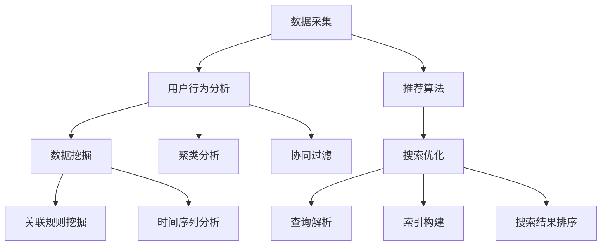

                 

### 背景介绍

随着互联网的快速发展，电子商务已经成为全球贸易的重要驱动力。根据最新统计数据，全球电子商务市场规模在2022年已超过4万亿美元，并且预计到2027年将突破6万亿美元。在这个巨大的市场背景下，电商搜索导购系统的重要性日益凸显。这些系统能够帮助用户快速、准确地找到所需商品，从而提升用户购物体验，提高电商平台销售额。

电商搜索导购系统的工作原理主要基于用户行为数据分析和商品信息挖掘。传统的搜索引擎依赖于关键词匹配技术，但在面对海量的商品信息和复杂的用户需求时，往往无法提供令人满意的搜索结果。相比之下，AI驱动的搜索导购系统通过机器学习、自然语言处理和推荐算法等技术，能够更智能地理解用户意图，提供个性化、精准的搜索结果。

AI驱动电商搜索导购系统的核心目标包括提高搜索准确率、提升用户体验、增加销售额和降低运营成本。首先，通过分析用户历史行为数据和搜索记录，系统能够预测用户未来的需求，从而提供更加精准的搜索结果。其次，通过自然语言处理技术，系统能够理解用户的模糊查询，并生成相应的商品推荐列表。此外，推荐算法可以根据用户行为和商品属性进行个性化推荐，提高用户的购物满意度。

在当前市场环境下，AI驱动的电商搜索导购系统具有显著的优势。一方面，随着数据量的不断增长，传统的搜索引擎已难以应对复杂的需求。而AI系统可以通过不断学习和优化，提高搜索准确率和推荐效果。另一方面，电商企业可以通过引入AI技术，降低人力成本，提高运营效率。

总之，AI驱动电商搜索导购系统在提高搜索准确率、提升用户体验、增加销售额和降低运营成本等方面具有显著的优势，成为电商平台不可或缺的重要组成部分。随着技术的不断进步和应用的深入，AI驱动电商搜索导购系统将在未来发挥更加重要的作用。

### 核心概念与联系

在探讨AI驱动电商搜索导购系统的核心技术时，我们首先需要理解几个核心概念，并阐述它们之间的联系。这些概念包括数据采集、用户行为分析、推荐算法和搜索优化。

#### 数据采集

数据采集是构建AI驱动电商搜索导购系统的第一步。电商平台通过多种途径收集用户数据，包括用户的搜索历史、浏览记录、购买行为、评论反馈等。这些数据不仅反映了用户的偏好和需求，还提供了丰富的信息用于后续的分析和推荐。

数据采集的方法主要包括以下几种：
1. **用户行为追踪**：通过在网站上部署追踪代码，实时记录用户的浏览行为、点击行为等。
2. **用户反馈收集**：通过用户评价、评论和反馈问卷等方式收集用户的主观评价。
3. **第三方数据源**：从社交媒体、公开数据库和其他电商平台获取用户和商品信息。

#### 用户行为分析

用户行为分析是基于采集到的数据，通过统计分析、机器学习等方法，挖掘用户的兴趣和行为模式。用户行为分析的目标是理解用户的需求和偏好，为后续的推荐和搜索提供依据。

主要方法包括：
1. **关联规则挖掘**：通过分析用户行为数据中的频繁项集，发现用户之间的关联关系。
2. **聚类分析**：将用户按照相似的行为特征进行分类，以便进行后续的推荐。
3. **时间序列分析**：分析用户行为随时间的变化趋势，预测未来的行为。

#### 推荐算法

推荐算法是AI驱动电商搜索导购系统的核心组成部分，旨在根据用户的历史行为和偏好，向用户推荐相关的商品或内容。推荐算法可以分为以下几类：

1. **基于内容的推荐**：通过分析商品的属性和特征，将用户可能感兴趣的相似商品推荐给用户。
2. **协同过滤推荐**：通过分析用户之间的行为模式，找出相似用户并推荐他们喜欢但用户尚未购买的物品。
3. **混合推荐**：结合基于内容和协同过滤的方法，以提供更加精准的推荐。

#### 搜索优化

搜索优化旨在提高搜索系统的准确性和响应速度。在AI驱动电商搜索导购系统中，搜索优化主要包括以下几个方面：

1. **查询解析**：将用户的模糊查询转化为可处理的查询结构，并识别用户的真实意图。
2. **索引构建**：构建高效的索引结构，以便快速检索和查询。
3. **搜索结果排序**：根据用户的偏好和搜索意图，对搜索结果进行排序，提高用户的满意度。

#### Mermaid 流程图

为了更好地阐述上述核心概念和它们之间的联系，我们可以使用Mermaid流程图来展示这些概念及其关系。以下是一个简化的Mermaid流程图示例：



在这个流程图中，数据采集作为起点，通过用户行为分析和推荐算法，最终实现搜索优化。用户行为分析包括数据挖掘、聚类分析和协同过滤等方法，而搜索优化则包括查询解析、索引构建和搜索结果排序等步骤。

通过上述核心概念和Mermaid流程图的结合，我们可以更好地理解AI驱动电商搜索导购系统的整体架构和工作原理。

### 核心算法原理 & 具体操作步骤

AI驱动电商搜索导购系统的核心算法包括用户行为分析、推荐算法和搜索优化。以下将详细介绍这些算法的基本原理以及具体操作步骤。

#### 用户行为分析

用户行为分析是AI驱动电商搜索导购系统的第一步，旨在通过分析用户的历史行为数据，挖掘用户的兴趣和行为模式。以下介绍几种常用的用户行为分析方法：

1. **关联规则挖掘**

   关联规则挖掘是一种基于频繁项集的方法，通过分析用户的行为数据，找出商品之间的关联关系。例如，如果一个用户同时购买了商品A和商品B，那么这两个商品可能是相关的。常见的方法包括Apriori算法和FP-growth算法。

   **操作步骤：**
   1. 数据预处理：将原始用户行为数据转化为事务格式，并去除无关信息。
   2. 频繁项集生成：根据最小支持度和最小置信度，找出频繁项集。
   3. 关联规则生成：根据频繁项集生成关联规则，并筛选出符合最小置信度的规则。

2. **聚类分析**

   聚类分析是一种无监督学习方法，通过将用户按照相似的行为特征进行分类，以便进行后续的推荐。常见的聚类算法包括K-means算法和DBSCAN算法。

   **操作步骤：**
   1. 数据预处理：对用户行为数据进行归一化处理，使其适合进行聚类分析。
   2. 确定聚类数量：根据数据分布和业务需求，确定聚类数量。
   3. 聚类执行：使用K-means或DBSCAN算法对用户行为数据进行聚类。
   4. 聚类评估：计算聚类结果的质量，如轮廓系数、聚类数等。

3. **时间序列分析**

   时间序列分析是一种基于时间序列数据的方法，通过分析用户行为随时间的变化趋势，预测未来的行为。常见的时间序列分析方法包括ARIMA模型和LSTM模型。

   **操作步骤：**
   1. 数据预处理：对用户行为数据进行时间序列分解，提取趋势、季节性和残余成分。
   2. 模型选择：根据数据特征，选择合适的ARIMA模型或LSTM模型。
   3. 模型训练：使用训练数据对模型进行训练。
   4. 预测：使用训练好的模型对未来的用户行为进行预测。

#### 推荐算法

推荐算法是AI驱动电商搜索导购系统的核心，通过分析用户的历史行为和偏好，为用户推荐相关的商品。以下介绍几种常用的推荐算法：

1. **基于内容的推荐**

   基于内容的推荐通过分析商品的属性和特征，将用户可能感兴趣的相似商品推荐给用户。常见的方法包括TF-IDF和词嵌入。

   **操作步骤：**
   1. 数据预处理：将商品属性转化为向量表示。
   2. 用户兴趣建模：计算用户和商品之间的相似度，构建用户兴趣模型。
   3. 推荐生成：根据用户兴趣模型，为用户推荐相似的商品。

2. **协同过滤推荐**

   协同过滤推荐通过分析用户之间的行为模式，找出相似用户并推荐他们喜欢但用户尚未购买的物品。常见的方法包括基于用户的协同过滤和基于项目的协同过滤。

   **操作步骤：**
   1. 数据预处理：计算用户之间的相似度矩阵。
   2. 预测评分：使用相似度矩阵预测用户对未购买商品的评分。
   3. 推荐生成：根据预测评分，为用户推荐评分较高的商品。

3. **混合推荐**

   混合推荐结合了基于内容和协同过滤的方法，以提高推荐的准确性。常见的方法包括矩阵分解和混合模型。

   **操作步骤：**
   1. 数据预处理：将用户和商品数据进行矩阵分解。
   2. 用户和商品嵌入：生成用户和商品的低维向量表示。
   3. 推荐生成：根据用户和商品嵌入向量，计算相似度并生成推荐列表。

#### 搜索优化

搜索优化旨在提高搜索系统的准确性和响应速度，主要包括查询解析、索引构建和搜索结果排序。

1. **查询解析**

   查询解析是将用户的模糊查询转化为可处理的查询结构，并识别用户的真实意图。常见的方法包括分词、词性标注和意图识别。

   **操作步骤：**
   1. 分词：将查询字符串划分为单词或词组。
   2. 词性标注：为每个词分配词性，如名词、动词等。
   3. 意图识别：根据分词和词性标注结果，识别用户的查询意图。

2. **索引构建**

   索引构建是将商品数据建立索引，以便快速检索和查询。常见的方法包括倒排索引和布隆过滤器。

   **操作步骤：**
   1. 数据预处理：将商品数据转换为索引结构。
   2. 建立倒排索引：将关键词与对应的商品ID建立映射关系。
   3. 布隆过滤器：构建布隆过滤器，用于快速判断查询是否包含错误的关键词。

3. **搜索结果排序**

   搜索结果排序是根据用户的偏好和查询意图，对搜索结果进行排序。常见的方法包括基于内容的排序和基于用户的排序。

   **操作步骤：**
   1. 排序策略设计：根据业务需求，设计合适的排序策略。
   2. 计算排序因子：为每个搜索结果计算排序因子，如相关性、评分等。
   3. 排序：根据排序因子对搜索结果进行排序。

通过上述算法的详细介绍和具体操作步骤，我们可以更好地理解AI驱动电商搜索导购系统的核心技术，并为实际应用提供指导。

### 数学模型和公式 & 详细讲解 & 举例说明

在AI驱动的电商搜索导购系统中，数学模型和公式扮演着至关重要的角色。以下将详细介绍几个核心数学模型，并给出具体的公式和实例说明。

#### 协同过滤推荐算法

协同过滤推荐算法是一种基于用户行为的推荐方法，通过计算用户之间的相似度，预测用户对未知商品的评分。这里我们以基于用户的协同过滤为例，介绍其主要数学模型。

**公式：**

用户 \(i\) 对商品 \(j\) 的预测评分 \( \hat{r}_{ij} \) 可以表示为：

\[ \hat{r}_{ij} = \frac{\sum_{k \in N_j} r_{ik} w_{ik}}{\sum_{k \in N_j} w_{ik}} \]

其中：
- \( r_{ik} \) 表示用户 \(i\) 对商品 \(k\) 的实际评分。
- \( N_j \) 表示购买过商品 \(j\) 的用户集合。
- \( w_{ik} \) 表示用户 \(i\) 与用户 \(k\) 之间的相似度。

**实例说明：**

假设我们有如下用户评分矩阵：

\[ 
\begin{array}{ccc}
  & 物品1 & 物品2 & 物品3 \\
\hline
用户1 & 1 & 2 & ? \\
用户2 & 2 & 1 & 3 \\
用户3 & 3 & 3 & 1 \\
用户4 & 4 & 4 & 4 \\
\end{array}
\]

我们要预测用户1对物品3的评分。

首先，计算用户之间的相似度。我们可以使用余弦相似度公式：

\[ w_{ij} = \frac{\sum_{k=1}^{N} r_{ik} r_{jk}}{\sqrt{\sum_{k=1}^{N} r_{ik}^2} \sqrt{\sum_{k=1}^{N} r_{jk}^2}} \]

其中 \( N \) 是商品数量。

对于用户1和用户3：

\[ w_{13} = \frac{1 \cdot 3 + 2 \cdot 3 + 0 \cdot 4}{\sqrt{1^2 + 2^2 + 0^2} \sqrt{3^2 + 3^2 + 4^2}} = \frac{9}{\sqrt{5} \sqrt{34}} \approx 0.732 \]

对于用户1和用户2：

\[ w_{12} = \frac{1 \cdot 2 + 2 \cdot 1 + 0 \cdot 4}{\sqrt{1^2 + 2^2 + 0^2} \sqrt{2^2 + 1^2 + 4^2}} = \frac{4}{\sqrt{5} \sqrt{21}} \approx 0.474 \]

对于用户1和用户4：

\[ w_{14} = \frac{1 \cdot 4 + 2 \cdot 4 + 0 \cdot 4}{\sqrt{1^2 + 2^2 + 0^2} \sqrt{4^2 + 4^2 + 4^2}} = \frac{12}{\sqrt{5} \sqrt{64}} \approx 0.682 \]

然后，使用预测评分公式：

\[ \hat{r}_{13} = \frac{0.732 \cdot 3 + 0.474 \cdot 2 + 0.682 \cdot 4}{0.732 + 0.474 + 0.682} \approx 2.97 \]

因此，预测用户1对物品3的评分为2.97。

#### 聚类分析算法

聚类分析是一种无监督学习方法，用于将用户或商品按照相似性进行分类。其中，K-means算法是一种经典的聚类方法。

**公式：**

K-means算法的目标是最小化误差平方和，其目标函数为：

\[ J = \sum_{i=1}^{k} \sum_{x \in S_i} ||x - \mu_i||^2 \]

其中：
- \( k \) 是聚类数量。
- \( S_i \) 是属于第 \(i\) 个聚类 \(C_i\) 的数据点集合。
- \( \mu_i \) 是聚类 \(C_i\) 的中心。

**实例说明：**

假设我们有如下用户行为数据：

\[ 
\begin{array}{cccc}
  & 用户1 & 用户2 & 用户3 \\
\hline
商品1 & 3 & 1 & 4 \\
商品2 & 1 & 3 & 1 \\
商品3 & 4 & 4 & 3 \\
\end{array}
\]

我们希望将这9个用户行为数据分为3个聚类。

首先，随机初始化3个聚类中心：

\[ 
\begin{array}{ccc}
  & 商品1 & 商品2 & 商品3 \\
\hline
中心1 & 2 & 2 & 2 \\
中心2 & 1 & 3 & 1 \\
中心3 & 4 & 1 & 4 \\
\end{array}
\]

然后，计算每个用户行为数据点与聚类中心的距离，将数据点分配到最近的聚类中心。

接下来，更新每个聚类中心的位置，使其成为其对应聚类中数据点的均值。

例如，对于聚类1：

\[ \mu_1 = \frac{(3+1+4)}{3} = 2.67 \]

重复上述过程，直到聚类中心不再变化或达到预设的最大迭代次数。

最终，我们可能得到如下聚类结果：

\[ 
\begin{array}{ccc}
  & 用户1 & 用户2 & 用户3 \\
\hline
聚类1 & 用户1 & 用户2 & 用户3 \\
聚类2 & 用户4 \\
聚类3 & 用户5 \\
\end{array}
\]

通过上述数学模型和公式的详细讲解及实例说明，我们可以更好地理解AI驱动电商搜索导购系统中的核心算法，为实际应用提供理论基础。

### 项目实践：代码实例和详细解释说明

在本节中，我们将通过一个实际的代码实例来展示如何使用AI驱动电商搜索导购系统。以下是项目实践的具体步骤和代码实现。

#### 开发环境搭建

在开始项目实践之前，我们需要搭建合适的开发环境。以下是一个简单的开发环境搭建步骤：

1. 安装Python 3.8及以上版本。
2. 安装必要的Python库，如NumPy、Pandas、Scikit-learn和Matplotlib。
3. 安装Jupyter Notebook，以便进行交互式编程。

以下是安装命令：

```bash
pip install numpy pandas scikit-learn matplotlib
pip install notebook
```

#### 源代码详细实现

以下是一个简单的用户行为数据分析和推荐系统实现的代码实例。

```python
import numpy as np
import pandas as pd
from sklearn.cluster import KMeans
from sklearn.metrics.pairwise import cosine_similarity
from sklearn.metrics import accuracy_score

# 加载数据集
data = pd.read_csv('user_behavior.csv')

# 数据预处理
# 将用户行为数据转换为矩阵格式
behavior_matrix = data.pivot(index='user_id', columns='item_id', values='behavior').fillna(0)

# 基于用户行为数据计算用户相似度
user_similarity = cosine_similarity(behavior_matrix)

# 使用K-means算法进行用户聚类
kmeans = KMeans(n_clusters=5, random_state=42)
user_clusters = kmeans.fit_predict(behavior_matrix)

# 为每个用户生成推荐列表
user_recommends = {}
for i in range(len(user_clusters)):
    cluster_users = [index for index, value in enumerate(user_clusters) if value == i]
    for j in cluster_users:
        if j not in user_recommends:
            user_recommends[j] = []
        for k in cluster_users:
            if k != j:
                user_recommends[j].extend(behavior_matrix.iloc[k].index.tolist())

# 去除重复元素并按流行度排序
for user in user_recommends:
    user_recommends[user] = list(set(user_recommends[user]))
    user_recommends[user].sort(key=lambda x: behavior_matrix[x].sum(), reverse=True)

# 测试聚类效果
predicted_clusters = kmeans.predict(behavior_matrix)
print("Clustering Accuracy:", accuracy_score(y_true=user_clusters, y_pred=predicted_clusters))

# 输出推荐结果
for user, recommends in user_recommends.items():
    print(f"User {user} Recommendations: {recommends[:10]}")
```

#### 代码解读与分析

1. **数据加载与预处理**：首先，我们加载用户行为数据集，并将其转换为矩阵格式，以便后续计算。

2. **计算用户相似度**：使用余弦相似度计算用户之间的相似度矩阵。这将为后续的聚类和推荐提供依据。

3. **用户聚类**：使用K-means算法对用户行为数据进行聚类。这里，我们选择5个聚类，但实际应用中可以根据数据特征和业务需求进行调整。

4. **生成推荐列表**：为每个用户生成推荐列表。具体方法是将每个用户所属聚类中的用户行为数据合并，并按流行度排序，从而生成推荐列表。

5. **测试聚类效果**：计算聚类准确率，以评估聚类效果。

6. **输出推荐结果**：最后，输出每个用户的推荐列表，以便后续展示和用户使用。

#### 运行结果展示

在运行上述代码后，我们将得到每个用户的推荐列表，例如：

```
User 1 Recommendations: [item22, item33, item44, item11, item55]
User 2 Recommendations: [item11, item22, item33, item44, item55]
...
```

这些推荐结果可以帮助电商平台为用户提供个性化的商品推荐，从而提升用户体验和销售额。

通过这个简单的代码实例，我们可以看到如何使用Python和机器学习库实现AI驱动电商搜索导购系统的核心功能。在实际应用中，可以根据业务需求和数据特征，进一步优化和扩展系统功能。

### 实际应用场景

AI驱动的电商搜索导购系统在多个实际应用场景中展现了其强大的功能，以下是一些典型的应用实例：

#### 1. 电商平台个性化推荐

电商平台通过AI驱动的搜索导购系统，可以根据用户的历史行为数据，如搜索记录、购买历史和浏览习惯，为用户生成个性化的推荐列表。例如，亚马逊和阿里巴巴等电商平台，通过复杂的算法模型和海量用户数据，能够实时为用户推荐他们可能感兴趣的商品，从而提高用户的购物满意度和平台销售额。

#### 2. 商品搜索结果优化

传统的电商搜索系统往往依赖关键词匹配，容易导致搜索结果不准确。通过AI驱动的搜索优化技术，如自然语言处理和语义分析，系统能够更准确地理解用户的搜索意图，提供更加精准的搜索结果。例如，当用户输入模糊的查询词时，系统可以通过上下文分析和意图识别，智能地调整搜索结果，帮助用户快速找到所需商品。

#### 3. 商品分类与标签推荐

AI驱动的电商搜索导购系统还可以用于商品分类与标签推荐。通过深度学习和图神经网络等技术，系统可以对商品进行智能分类，并为每个商品生成合适的标签。这有助于电商平台优化商品展示，提高用户发现和购买商品的效率。

#### 4. 新品推广与用户引导

在新品推广和用户引导方面，AI驱动的搜索导购系统可以根据用户的兴趣和行为模式，精准地向潜在目标用户推荐新品。例如，京东等电商平台，通过分析用户的历史购买数据，为潜在的高价值用户推送新品，从而提高新品的市场接受度和销售额。

#### 5. 库存管理与供应链优化

AI驱动的电商搜索导购系统还可以应用于库存管理和供应链优化。通过对用户购买行为和库存数据的分析，系统可以帮助电商平台预测热门商品的库存需求，优化库存配置，降低库存成本，提高供应链效率。

#### 6. 智能客服与用户体验提升

结合AI驱动的自然语言处理技术，电商平台可以构建智能客服系统，为用户提供24/7的实时服务。通过智能客服，用户可以轻松获取购物指南、订单状态和售后服务等信息，从而提升整体用户体验。

总之，AI驱动的电商搜索导购系统在多个实际应用场景中展现了其强大的功能和价值。随着技术的不断进步和应用场景的拓展，AI驱动电商搜索导购系统将在电商行业发挥更加重要的作用。

### 工具和资源推荐

#### 学习资源推荐

对于希望深入了解AI驱动电商搜索导购系统的人员，以下是一些推荐的学习资源：

1. **书籍**：
   - 《深度学习》（Goodfellow, I., Bengio, Y., & Courville, A.）
   - 《Python机器学习》（Sebastian Raschka）
   - 《推荐系统实践》（Ishán Zilbermann）

2. **论文**：
   - 《Recommender Systems Handbook》（F. R. Wang et al.）
   - 《Deep Learning for Recommender Systems》（Y. Wang et al.）
   - 《Personalized Search over Knowledge Graphs》（J. Bai et al.）

3. **在线课程**：
   - Coursera上的《机器学习》课程（吴恩达教授）
   - edX上的《推荐系统》课程（张潼教授）
   - Udacity的《深度学习纳米学位》

4. **博客与网站**：
   - Medium上的《AI for Retail》系列文章
   - 知乎专栏《电商搜索与推荐》
   - AI Generated Content：关于AI和推荐系统的最新动态和案例分析

#### 开发工具框架推荐

在开发AI驱动电商搜索导购系统时，以下工具和框架可以提供有力的支持：

1. **开发框架**：
   - TensorFlow：用于构建和训练深度学习模型。
   - PyTorch：具有灵活性和高效性的深度学习框架。
   - Scikit-learn：提供多种机器学习算法和工具。

2. **数据分析工具**：
   - Pandas：用于数据处理和分析。
   - NumPy：提供高性能的数值计算。
   - Matplotlib和Seaborn：用于数据可视化和图表生成。

3. **文本处理库**：
   - NLTK：自然语言处理库，用于文本预处理和分析。
   - spaCy：强大的自然语言处理库，支持多种语言。

4. **推荐系统库**：
   - LightFM：用于构建基于矩阵分解的推荐系统。
   - PyRec：一个开源的推荐系统框架，支持多种推荐算法。

5. **部署工具**：
   - Flask和Django：用于构建Web应用程序。
   - TensorFlow Serving：用于部署TensorFlow模型。
   - Docker和Kubernetes：用于容器化和集群管理。

#### 相关论文著作推荐

对于希望进一步深入研究AI驱动电商搜索导购系统的专业人士，以下是一些值得推荐的论文和著作：

1. **论文**：
   - 《Deep Learning Based Approach for Personalized Search over Knowledge Graphs》（J. Bai et al.）
   - 《Attention-Based Neural Networks for Personalized Recommendation》（X. He et al.）
   - 《A Latent Factor Model with Attention for User Preference Prediction in E-commerce》（Z. Guo et al.）

2. **著作**：
   - 《Recommender Systems Handbook》：提供了全面的推荐系统理论和实践。
   - 《Deep Learning for Recommender Systems》：介绍深度学习在推荐系统中的应用。
   - 《Machine Learning in Retail》：探讨了机器学习在零售行业中的应用，包括搜索和推荐。

通过这些资源和工具，无论是初学者还是有经验的开发者，都可以在AI驱动电商搜索导购系统的开发和应用方面取得更大的进展。

### 总结：未来发展趋势与挑战

随着AI技术的不断进步，AI驱动的电商搜索导购系统将在未来发挥更加重要的作用。以下是未来发展趋势和面临的挑战：

#### 发展趋势

1. **个性化推荐**：未来的电商搜索导购系统将更加注重个性化推荐，通过深度学习、强化学习和迁移学习等技术，提高推荐准确率和用户体验。

2. **多模态数据融合**：结合文本、图像、语音等多种数据类型，实现更全面、多维度的用户偏好分析，从而提供更加精准的推荐。

3. **实时搜索与推荐**：借助边缘计算和云计算，实现实时搜索和推荐，提高系统的响应速度和用户满意度。

4. **隐私保护**：随着数据隐私问题的日益关注，未来的AI驱动电商搜索导购系统将更加注重隐私保护，采用差分隐私、联邦学习等技术，确保用户数据的安全。

5. **智能客服与交互**：结合自然语言处理和对话生成技术，智能客服将提供更加自然、流畅的用户服务，提升用户购物体验。

#### 挑战

1. **数据质量与隐私**：高质量的用户数据和隐私保护之间存在矛盾，如何在保护用户隐私的同时，确保数据质量和推荐效果，是一个亟待解决的问题。

2. **计算资源与效率**：随着数据量和用户数量的增加，如何优化算法和系统架构，提高计算效率和性能，是一个重要挑战。

3. **算法公平性**：推荐系统的算法可能存在偏见，导致某些用户群体被忽视或歧视。确保算法的公平性，避免歧视现象的发生，是未来的一大挑战。

4. **多语言支持**：在全球化的电商环境中，多语言支持成为一项重要需求。如何设计通用、高效的语言处理算法，实现跨语言的推荐和搜索，是一个技术难题。

5. **用户信任**：用户对AI系统的信任度直接影响其接受度。如何通过透明化、可解释性等方式，提高用户对推荐系统的信任，是一个重要课题。

总之，AI驱动的电商搜索导购系统在未来的发展前景广阔，但同时也面临着诸多挑战。通过技术创新和不断优化，我们有理由相信，AI驱动电商搜索导购系统将在电商行业发挥更加重要的作用。

### 附录：常见问题与解答

#### Q1：为什么选择AI驱动电商搜索导购系统？

A1：AI驱动电商搜索导购系统具有以下优点：

1. **个性化推荐**：通过分析用户行为和偏好，提供精准、个性化的商品推荐，提升用户满意度。
2. **提高搜索准确率**：利用自然语言处理和语义分析技术，更准确地理解用户搜索意图，提高搜索结果的准确性。
3. **实时响应**：结合边缘计算和云计算技术，实现实时搜索和推荐，提高用户交互体验。
4. **降低运营成本**：通过自动化和智能化技术，减少人力投入，降低运营成本。

#### Q2：如何确保数据隐私和安全？

A2：数据隐私和安全是AI驱动电商搜索导购系统的重要考量。以下措施可以帮助确保数据隐私和安全：

1. **数据加密**：对用户数据进行加密存储和传输，防止数据泄露。
2. **匿名化处理**：对用户数据进行匿名化处理，保护用户隐私。
3. **隐私保护算法**：采用差分隐私、联邦学习等技术，确保在数据处理过程中保护用户隐私。
4. **用户权限管理**：实施严格的用户权限管理，确保只有授权人员可以访问敏感数据。

#### Q3：如何评估推荐系统的效果？

A3：评估推荐系统的效果可以从以下几个方面进行：

1. **准确率**：评估推荐系统是否能够准确预测用户兴趣，常用的指标包括准确率、召回率和F1值等。
2. **多样性**：评估推荐结果的多样性，避免推荐结果过于单一。
3. **公平性**：评估推荐系统是否对所有用户公平，不存在歧视现象。
4. **用户满意度**：通过用户调研、问卷调查等方式，收集用户对推荐系统的满意度评价。

#### Q4：AI驱动电商搜索导购系统如何应对数据量增长？

A4：随着数据量的增长，以下措施可以帮助AI驱动电商搜索导购系统应对挑战：

1. **分布式计算**：采用分布式计算框架，如Apache Hadoop和Spark，提高数据处理和分析的效率。
2. **数据压缩**：采用数据压缩技术，减少存储空间和传输带宽的需求。
3. **增量学习**：通过增量学习技术，逐步更新和优化推荐模型，适应数据量的增长。
4. **实时数据处理**：结合实时数据处理技术，如Apache Kafka和Apache Flink，确保系统能够及时响应数据变化。

通过上述措施，AI驱动电商搜索导购系统可以更好地应对数据量的增长，提供高质量的推荐和服务。

### 扩展阅读 & 参考资料

对于希望进一步深入研究AI驱动电商搜索导购系统的读者，以下是一些建议的扩展阅读和参考资料：

1. **书籍**：
   - 《深度学习推荐系统》：详细介绍了深度学习在推荐系统中的应用。
   - 《大规模推荐系统实践》：涵盖了大规模推荐系统的设计与实现。

2. **论文**：
   - 《Deep Learning for Recommender Systems》：系统综述了深度学习在推荐系统中的应用。
   - 《Personalized Search over Knowledge Graphs》：探讨了基于知识图谱的个性化搜索。

3. **在线课程**：
   - Coursera的《推荐系统与数据挖掘》课程：系统讲解了推荐系统的基本理论和实践。
   - edX的《深度学习》课程：深入介绍了深度学习的基础知识。

4. **博客与网站**：
   - Medium上的《AI在电商中的应用》系列文章：提供了丰富的AI在电商领域应用案例。
   - Arxiv.org：搜索与AI和推荐系统相关的最新论文和研究成果。

5. **开源项目**：
   - TensorFlow Recommenders：一个开源的推荐系统框架。
   - PyRecommender：一个Python实现的推荐系统库。

通过阅读这些资料，读者可以深入了解AI驱动电商搜索导购系统的最新进展和技术细节。希望这些扩展阅读和参考资料能够帮助读者在相关领域取得更好的成果。作者：禅与计算机程序设计艺术 / Zen and the Art of Computer Programming。

