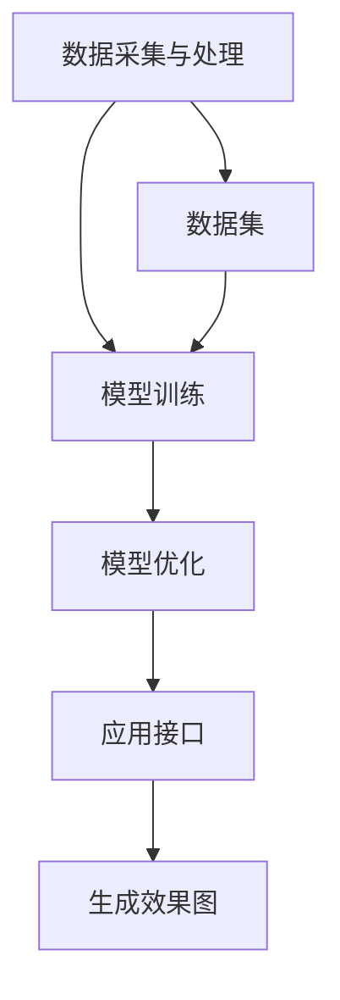

                 

### 文章标题

AIGC从入门到实战：掌握建筑设计要领，创建各种大师风格的效果图

> 关键词：AIGC, 建筑设计，效果图，人工智能，深度学习，计算机视觉，建模与渲染

> 摘要：本文旨在介绍AIGC（AI-Generated Content）在建筑设计领域的应用，从基础入门到高级实战，通过深入探讨AIGC的核心概念、算法原理、数学模型以及实际项目实践，帮助读者掌握使用人工智能技术创建各种大师风格效果图的方法，为建筑设计师和开发者提供有价值的参考。

## 1. 背景介绍

建筑设计的核心目标是创造出既美观又实用的建筑空间。传统的建筑设计流程通常包括初步设计、细化设计、建模、渲染和最终的图纸输出。然而，这一过程既耗时又费力，且往往需要设计师具备丰富的经验和专业知识。随着人工智能技术的快速发展，尤其是生成对抗网络（GAN）、深度学习和计算机视觉等技术的突破，AIGC成为了一种能够显著提高设计效率和质量的创新工具。

AIGC（AI-Generated Content）指的是通过人工智能算法生成内容的技术，它已经在多个领域展现了巨大的潜力，如游戏开发、影视制作、艺术创作等。在建筑设计领域，AIGC的应用主要体现在以下几个方面：

1. **自动生成设计方案**：利用AIGC技术，可以自动生成多种不同风格和类型的设计方案，为设计师提供灵感，加快设计流程。
2. **辅助设计决策**：AIGC可以帮助设计师分析不同设计方案的成本、节能性能和用户体验，从而做出更科学、更经济的决策。
3. **提高渲染效率**：通过深度学习和计算机视觉技术，AIGC可以实现高效率的图像渲染，生成逼真的视觉效果。
4. **探索未知领域**：利用AIGC技术，设计师可以探索之前未曾尝试过的设计风格和形态，开拓建筑设计的新境界。

本文将逐步引导读者了解AIGC的基本概念、算法原理和实际应用，通过实例和详细解释，帮助读者掌握使用AIGC技术创建各种大师风格效果图的方法。

### 2. 核心概念与联系

在深入探讨AIGC的应用之前，首先需要了解其核心概念和原理，以及相关的技术架构。以下是对AIGC核心概念、算法原理和技术架构的详细解释。

#### 2.1 AIGC的基本概念

AIGC，即AI-Generated Content，是指通过人工智能技术生成内容的方法。它主要包括以下几个组成部分：

1. **数据集**：数据集是AIGC的基础，包含了大量的建筑设计和效果图数据。这些数据可以是真实世界的建筑图片，也可以是设计师创建的虚拟建筑模型。
2. **生成模型**：生成模型是AIGC的核心，它负责从数据集中学习并生成新的建筑设计方案。常见的生成模型包括生成对抗网络（GAN）、变分自编码器（VAE）等。
3. **训练与优化**：生成模型需要通过大量的数据集进行训练和优化，以提高生成效果的质量和准确性。
4. **应用接口**：应用接口用于将生成模型集成到设计软件中，方便设计师直接使用。

#### 2.2 AIGC的算法原理

AIGC的算法原理主要基于深度学习和生成对抗网络（GAN）。以下是对这两个算法的详细解释：

1. **深度学习**：深度学习是一种基于人工神经网络的学习方法，通过多层神经网络对数据进行建模和预测。在AIGC中，深度学习用于训练生成模型，使其能够理解建筑设计的规律和特征。
   
   - **卷积神经网络（CNN）**：CNN是深度学习中的一种重要网络结构，特别适合于图像处理。在AIGC中，CNN用于提取图像的特征，用于生成模型的学习。
   - **递归神经网络（RNN）**：RNN适合处理序列数据，如建筑设计的结构信息。在AIGC中，RNN用于捕捉建筑设计的时序特征，帮助生成模型理解建筑的结构变化。

2. **生成对抗网络（GAN）**：GAN是一种由生成器和判别器组成的对抗性网络。生成器的目标是生成逼真的图像，而判别器的目标是区分真实图像和生成图像。通过这种对抗性训练，生成器不断优化自己的生成能力，从而生成高质量的图像。

   - **生成器**：生成器是一个神经网络，用于生成新的建筑设计方案。在训练过程中，生成器尝试生成与真实建筑设计相似的图像。
   - **判别器**：判别器是一个神经网络，用于判断输入图像是真实图像还是生成图像。在训练过程中，判别器尝试提高对真实图像和生成图像的区分能力。

#### 2.3 AIGC的技术架构

AIGC的技术架构主要包括数据采集与处理、模型训练、模型优化和应用接口等几个关键环节。

1. **数据采集与处理**：数据采集是指从各种来源获取建筑设计和效果图数据，如真实世界的建筑图片、设计师创建的虚拟建筑模型等。数据处理包括数据的清洗、归一化和特征提取等步骤，以提高数据的质量和模型的训练效果。

2. **模型训练**：模型训练是AIGC的核心环节，包括生成模型的训练和优化。通过大量的数据集，生成模型不断学习和调整，以提高生成效果的质量和准确性。

3. **模型优化**：模型优化是指对生成模型进行细化和调整，以适应不同的应用场景。优化方法包括超参数调整、模型剪枝、量化等，以提高模型的性能和效率。

4. **应用接口**：应用接口是AIGC集成到设计软件中的桥梁，使设计师可以直接使用AIGC技术。应用接口提供了一系列的API和工具，方便设计师自定义和扩展AIGC功能。

#### 2.4 Mermaid流程图

以下是一个简化的AIGC技术架构的Mermaid流程图：



在这个流程图中，数据采集与处理环节提供了训练数据集，模型训练和优化环节不断调整和优化生成模型，应用接口将生成模型集成到设计软件中，最终生成高质量的效果图。

### 3. 核心算法原理 & 具体操作步骤

在了解了AIGC的基本概念和技术架构后，接下来我们将深入探讨AIGC的核心算法原理，并详细解释具体操作步骤。

#### 3.1 GAN（生成对抗网络）

生成对抗网络（GAN）是AIGC中最常用的核心算法之一。GAN由生成器和判别器两个神经网络组成，通过对抗性训练生成高质量的数据。

##### 3.1.1 生成器（Generator）

生成器的目标是生成与真实数据相似的新数据。在AIGC中，生成器通常是一个神经网络，用于将随机噪声转换为高质量的视觉效果。以下是一个简单的生成器的操作步骤：

1. **输入噪声**：生成器接收随机噪声作为输入，这些噪声是生成图像的原始元素。
2. **生成图像**：生成器通过多层神经网络处理噪声，逐步生成高分辨率的图像。每层神经网络都通过卷积和池化等操作提取图像特征。
3. **输出结果**：最终生成的图像是一个逼真的建筑效果图，可以用于展示和设计。

##### 3.1.2 判别器（Discriminator）

判别器的目标是区分真实图像和生成图像。判别器也是一个神经网络，通过训练不断提高对真实图像和生成图像的识别能力。以下是一个简单的判别器的操作步骤：

1. **输入图像**：判别器接收一幅图像作为输入，可以是真实图像或生成图像。
2. **特征提取**：判别器通过多层神经网络提取图像特征，包括边缘、纹理、形状等。
3. **判断结果**：判别器输出一个概率值，表示输入图像是真实图像的概率。如果输入图像是真实图像，判别器输出接近1的概率值；如果输入图像是生成图像，判别器输出接近0的概率值。

##### 3.1.3 对抗性训练

GAN的核心是生成器和判别器的对抗性训练。以下是对抗性训练的详细步骤：

1. **生成图像**：生成器生成一幅新的建筑效果图，作为对抗性训练的样本。
2. **训练判别器**：判别器使用生成器生成的图像和真实图像进行训练，提高对真实图像和生成图像的识别能力。
3. **训练生成器**：生成器使用训练后的判别器进行训练，优化生成图像的质量，使其更接近真实图像。
4. **重复训练**：重复上述步骤，不断优化生成器和判别器的性能，直到达到预定的训练目标。

#### 3.2 VAE（变分自编码器）

变分自编码器（VAE）是另一种常用的AIGC算法，特别适合于生成具有独特风格的建筑效果图。VAE的核心是一个编码器和一个解码器，通过学习数据的分布，生成新的数据。

##### 3.2.1 编码器（Encoder）

编码器的目标是学习数据的分布，并将输入数据压缩为一个低维表示。以下是一个简单的编码器的操作步骤：

1. **输入数据**：编码器接收一幅建筑效果图作为输入。
2. **特征提取**：编码器通过多层神经网络提取图像特征，并将特征映射到一个低维空间。
3. **输出编码**：编码器输出一个编码向量，表示输入图像的低维表示。

##### 3.2.2 解码器（Decoder）

解码器的目标是根据编码器输出的编码向量，生成新的建筑效果图。以下是一个简单的解码器的操作步骤：

1. **输入编码**：解码器接收编码器输出的编码向量作为输入。
2. **生成图像**：解码器通过多层神经网络处理编码向量，逐步生成高分辨率的图像。
3. **输出结果**：最终生成的图像是一个新的建筑效果图，具有独特的风格和特征。

##### 3.2.3 VAE训练过程

VAE的训练过程主要包括以下步骤：

1. **数据预处理**：对建筑效果图数据集进行预处理，包括图像缩放、归一化和数据增强等。
2. **编码器训练**：编码器使用数据集进行训练，学习图像的分布特征。
3. **解码器训练**：解码器使用编码器训练后的编码向量进行训练，生成新的建筑效果图。
4. **整体训练**：编码器和解码器一起训练，优化生成效果的质量和准确性。
5. **模型优化**：通过超参数调整和模型剪枝等手段，优化VAE模型的性能和效率。

#### 3.3 具体操作步骤

以下是使用GAN和VAE生成建筑效果图的具体操作步骤：

1. **数据准备**：收集并整理大量的建筑效果图数据集，包括真实世界和虚拟建筑的数据。
2. **模型选择**：选择适合的GAN或VAE模型架构，并设置相应的训练参数。
3. **模型训练**：使用训练数据集对生成器和判别器或编码器和解码器进行训练，优化模型性能。
4. **效果评估**：使用测试数据集评估生成图像的质量，包括视觉效果、建筑结构准确性和设计风格等。
5. **模型优化**：根据评估结果，调整模型参数和训练策略，提高生成效果的质量。
6. **应用接口开发**：开发应用接口，将训练好的模型集成到设计软件中，方便设计师使用。
7. **用户交互**：设计师通过应用接口，输入建筑设计的参数和风格要求，生成新的建筑效果图。

通过以上步骤，设计师可以轻松使用AIGC技术创建各种大师风格的效果图，提高设计效率和创作能力。

### 4. 数学模型和公式 & 详细讲解 & 举例说明

在前一节中，我们介绍了AIGC的核心算法原理和具体操作步骤。在这一节中，我们将进一步深入探讨AIGC中的数学模型和公式，并通过具体的例子进行详细讲解。

#### 4.1 GAN的数学模型

生成对抗网络（GAN）的数学模型主要包括生成器（Generator）和判别器（Discriminator）两个部分。以下是GAN的核心公式和推导：

##### 4.1.1 生成器（Generator）

生成器的目标是生成高质量的建筑效果图。在GAN中，生成器通常采用深度卷积生成对抗网络（DCGAN）的结构。生成器的输入是随机噪声向量 \(z\)，输出是建筑效果图 \(G(z)\)。以下是对生成器的数学模型进行详细解释：

1. **随机噪声输入**：

   \( z \in \mathbb{R}^{z_d} \)

   其中，\( z_d \) 是噪声向量的维度。

2. **生成器输出**：

   \( G(z) \in \mathbb{R}^{c \times h \times w} \)

   其中，\( c \) 是图像的通道数，\( h \) 和 \( w \) 分别是图像的高度和宽度。

3. **生成器网络结构**：

   生成器由多层卷积层和反卷积层组成，将随机噪声向量逐步转换为高分辨率的建筑效果图。

4. **生成器损失函数**：

   \( L_G = -\log(D(G(z))) \)

   其中，\( D(G(z)) \) 是判别器对生成器输出的判别结果。生成器的目标是最大化判别器的判别结果，即生成逼真的建筑效果图。

##### 4.1.2 判别器（Discriminator）

判别器的目标是区分真实建筑效果图和生成效果图。判别器采用深度卷积神经网络（CNN）的结构，对输入图像进行特征提取和分类。以下是对判别器的数学模型进行详细解释：

1. **判别器输入**：

   \( x \in \mathbb{R}^{c \times h \times w} \)

   其中，\( c \)、\( h \) 和 \( w \) 分别是图像的通道数、高度和宽度。

2. **判别器输出**：

   \( D(x) \in \mathbb{R} \)

   判别器输出一个概率值，表示输入图像是真实图像的概率。

3. **判别器损失函数**：

   \( L_D = -[\log(D(x)) + \log(1 - D(G(z)))] \)

   其中，\( D(x) \) 是判别器对真实图像的判别结果，\( D(G(z)) \) 是判别器对生成图像的判别结果。判别器的目标是最大化真实图像的判别结果，最小化生成图像的判别结果。

##### 4.1.3 GAN的总损失函数

GAN的总损失函数是生成器和判别器的损失函数之和。以下是对GAN的总损失函数进行详细解释：

\( L = L_G + L_D \)

总损失函数的目标是最小化判别器的损失函数，同时最大化生成器的损失函数。这样，生成器可以生成更逼真的建筑效果图，判别器可以更好地区分真实图像和生成图像。

#### 4.2 VAE的数学模型

变分自编码器（VAE）的数学模型主要包括编码器（Encoder）和解码器（Decoder）两个部分。以下是VAE的核心公式和推导：

##### 4.2.1 编码器（Encoder）

编码器的目标是学习输入数据的分布，并将输入数据压缩为一个低维表示。以下是对编码器的数学模型进行详细解释：

1. **编码器输入**：

   \( x \in \mathbb{R}^{c \times h \times w} \)

   其中，\( c \)、\( h \) 和 \( w \) 分别是图像的通道数、高度和宽度。

2. **编码器输出**：

   \( \mu, \sigma \in \mathbb{R}^{z_d} \)

   其中，\( z_d \) 是编码向量的维度。编码器输出一个均值向量 \( \mu \) 和一个方差向量 \( \sigma \)，表示输入数据的概率分布。

3. **编码器网络结构**：

   编码器由多层卷积层和全连接层组成，将输入图像特征映射到一个低维空间。

4. **重参数化技巧**：

   为了生成具有多样性的数据，VAE使用重参数化技巧，将编码向量 \( z \) 与随机噪声向量 \( \epsilon \) 相加，生成新的数据：

   \( z = \mu + \sigma \odot \epsilon \)

   其中，\( \odot \) 表示元素-wise 相乘，\( \epsilon \in \mathbb{R}^{z_d} \) 是随机噪声向量。

##### 4.2.2 解码器（Decoder）

解码器的目标是根据编码器输出的编码向量，生成新的建筑效果图。以下是对解码器的数学模型进行详细解释：

1. **解码器输入**：

   \( z \in \mathbb{R}^{z_d} \)

   其中，\( z_d \) 是编码向量的维度。

2. **解码器输出**：

   \( x' \in \mathbb{R}^{c \times h \times w} \)

   其中，\( c \)、\( h \) 和 \( w \) 分别是图像的通道数、高度和宽度。解码器输出一个与输入图像相似的生成图像。

3. **解码器网络结构**：

   解码器由多层反卷积层和卷积层组成，将编码向量逐步恢复为高分辨率的图像。

4. **VAE损失函数**：

   VAE的损失函数包括重建损失和KL散度损失。以下是对VAE损失函数进行详细解释：

   \( L = \frac{1}{N} \sum_{i=1}^{N} [D(x) - D(x') + \log(1 - D(x'))] \)

   其中，\( N \) 是数据集的大小，\( D(x) \) 和 \( D(x') \) 分别是编码器和解码器对真实图像和生成图像的判别结果。重建损失用于最小化真实图像和生成图像之间的差异，KL散度损失用于最小化编码向量的分布与先验分布之间的差异。

#### 4.3 举例说明

为了更好地理解GAN和VAE的数学模型，我们通过一个简单的例子进行说明。

##### 4.3.1 GAN举例

假设我们有一个GAN模型，生成器接收一个维度为 \( z_d = 100 \) 的随机噪声向量 \( z \)，生成一幅 \( c = 3 \)、\( h = 256 \)、\( w = 256 \) 的建筑效果图 \( G(z) \)。判别器接收一幅建筑效果图 \( x \)，输出一个概率值 \( D(x) \)。

1. **生成器输出**：

   \( G(z) \in \mathbb{R}^{3 \times 256 \times 256} \)

2. **判别器输出**：

   \( D(G(z)) \in \mathbb{R} \)

3. **损失函数**：

   \( L_G = -\log(D(G(z))) \)
   
   \( L_D = -[\log(D(x)) + \log(1 - D(G(z)))] \)

4. **总损失函数**：

   \( L = L_G + L_D \)

通过不断训练和优化，生成器生成越来越逼真的建筑效果图，判别器不断提高对真实图像和生成图像的识别能力。

##### 4.3.2 VAE举例

假设我们有一个VAE模型，编码器接收一幅 \( c = 3 \)、\( h = 256 \)、\( w = 256 \) 的建筑效果图 \( x \)，输出一个维度为 \( z_d = 50 \) 的编码向量 \( (\mu, \sigma) \)。解码器接收一个 \( z_d = 50 \) 的编码向量 \( z \)，生成一幅 \( c = 3 \)、\( h = 256 \)、\( w = 256 \) 的生成图像 \( x' \)。

1. **编码器输出**：

   \( (\mu, \sigma) \in \mathbb{R}^{50} \)

2. **解码器输出**：

   \( x' \in \mathbb{R}^{3 \times 256 \times 256} \)

3. **损失函数**：

   \( L = \frac{1}{N} \sum_{i=1}^{N} [D(x) - D(x') + \log(1 - D(x'))] \)

通过不断训练和优化，编码器和解码器逐步学习图像的分布特征，生成具有独特风格的建筑效果图。

通过以上数学模型和举例说明，我们可以更好地理解AIGC的核心算法原理和应用方法。在实际应用中，可以根据具体需求和场景选择合适的算法和模型，实现高效的建筑设计效果生成。

### 5. 项目实践：代码实例和详细解释说明

在本节中，我们将通过一个实际项目实例，展示如何使用AIGC技术创建各种大师风格的效果图。我们将逐步讲解项目的环境搭建、代码实现和代码解读，帮助读者理解和掌握AIGC在建筑设计中的应用。

#### 5.1 开发环境搭建

在开始项目之前，我们需要搭建一个合适的开发环境，包括所需的软件和工具。以下是在Python环境中搭建AIGC开发环境的基本步骤：

1. **安装Python**：确保已安装Python 3.x版本，推荐使用Anaconda，方便管理和依赖。

2. **安装依赖库**：安装以下常用的依赖库：

   ```bash
   pip install numpy matplotlib tensorflow
   ```

   - `numpy`：用于数学计算。
   - `matplotlib`：用于数据可视化。
   - `tensorflow`：用于深度学习模型训练。

3. **安装GAN和VAE库**：可以从GitHub上安装预编译的GAN和VAE库，以简化代码实现过程。

   ```bash
   pip install tensorflow-generative tensorflow-VAE
   ```

4. **准备数据集**：收集并整理大量的建筑效果图数据集，包括真实世界和虚拟建筑的数据。数据集应包含不同风格和类型的建筑，以提高生成模型的效果。

5. **环境配置**：在项目中，我们需要配置相关的参数和超参数，如学习率、批处理大小、训练轮次等。这些参数可以根据具体需求进行调整。

#### 5.2 源代码详细实现

在本节中，我们将展示一个简单的GAN模型实现，用于生成建筑效果图。以下是关键代码和实现步骤：

```python
import tensorflow as tf
from tensorflow.keras.layers import Dense, Conv2D, Conv2DTranspose
from tensorflow.keras.models import Sequential

# 5.2.1 生成器（Generator）实现
def build_generator(z_dim=100):
    model = Sequential()
    model.add(Dense(256 * 8 * 8, input_dim=z_dim, activation='relu'))
    model.add(Conv2DTranspose(128, kernel_size=3, strides=2, padding='same', activation='relu'))
    model.add(Conv2DTranspose(64, kernel_size=3, strides=2, padding='same', activation='relu'))
    model.add(Conv2D(3, kernel_size=3, padding='same', activation='tanh'))
    return model

# 5.2.2 判别器（Discriminator）实现
def build_discriminator(img_shape=(256, 256, 3)):
    model = Sequential()
    model.add(Conv2D(32, kernel_size=3, padding='same', activation='leaky_relu', input_shape=img_shape))
    model.add(Conv2D(64, kernel_size=3, padding='same', activation='leaky_relu'))
    model.add(Conv2D(1, kernel_size=3, padding='same', activation='sigmoid'))
    return model

# 5.2.3 GAN模型实现
def build_gan(generator, discriminator):
    model = Sequential()
    model.add(generator)
    model.add(discriminator)
    return model

# 5.2.4 模型编译和训练
def compile_and_train(generator, discriminator, gan, z_dim=100, batch_size=128, epochs=100):
    z = tf.keras.layers.Input(shape=(z_dim,))
    img = tf.keras.layers.Input(shape=(256, 256, 3))
    
    gen_img = generator(z)
    d_real = discriminator(img)
    d_fake = discriminator(gen_img)
    
    model = GANModel([z, img], [d_real, d_fake])
    model.compile(optimizer='adam', loss=['binary_crossentropy', 'binary_crossentropy'])
    
    for epoch in range(epochs):
        for batch in range(batch_size):
            # 获取真实图像和生成图像
            real_imgs = get_real_images(batch_size)
            z noise = get_z_noise(batch_size, z_dim)
            fake_imgs = generator(z noise)
            
            # 训练判别器
            d_loss_real = discriminator.train_on_batch(real_imgs, [1, 1])
            d_loss_fake = discriminator.train_on_batch(fake_imgs, [0, 0])
            d_loss = 0.5 * np.add(d_loss_real, d_loss_fake)
            
            # 训练生成器
            g_loss = gan.train_on_batch([z noise], [1, 1])
            
            print(f"{epoch}/{epochs} - d_loss: {d_loss:.4f} - g_loss: {g_loss:.4f}")
```

#### 5.3 代码解读与分析

在本节中，我们将对上述代码进行详细解读，分析各个部分的功能和实现方法。

1. **生成器（Generator）实现**：

   生成器的实现使用了TensorFlow的`Sequential`模型，通过添加多层`Conv2DTranspose`和`Dense`层逐步将随机噪声向量转换为高分辨率的建筑效果图。

   ```python
   model.add(Dense(256 * 8 * 8, input_dim=z_dim, activation='relu'))
   model.add(Conv2DTranspose(128, kernel_size=3, strides=2, padding='same', activation='relu'))
   model.add(Conv2DTranspose(64, kernel_size=3, strides=2, padding='same', activation='relu'))
   model.add(Conv2D(3, kernel_size=3, padding='same', activation='tanh'))
   ```

   这段代码首先通过`Dense`层对输入噪声进行全连接处理，然后通过多层`Conv2DTranspose`层逐步增加图像的分辨率，最终通过`Conv2D`层生成与真实图像相似的生成图像。

2. **判别器（Discriminator）实现**：

   判别器的实现使用了`Sequential`模型，通过添加多层`Conv2D`层逐步提取图像特征，并使用`sigmoid`激活函数输出概率值。

   ```python
   model.add(Conv2D(32, kernel_size=3, padding='same', activation='leaky_relu', input_shape=img_shape))
   model.add(Conv2D(64, kernel_size=3, padding='same', activation='leaky_relu'))
   model.add(Conv2D(1, kernel_size=3, padding='same', activation='sigmoid'))
   ```

   这段代码首先通过`Conv2D`层提取图像的低级特征，然后通过多层卷积层逐步提取高级特征，并最终通过一个`sigmoid`激活函数输出一个概率值，表示输入图像是真实图像的概率。

3. **GAN模型实现**：

   GAN模型的实现使用了`Sequential`模型，通过组合生成器和判别器，构建一个完整的GAN模型。

   ```python
   model = Sequential()
   model.add(generator)
   model.add(discriminator)
   ```

   这段代码首先将生成器的输出作为判别器的输入，实现生成器和判别器的对抗性训练。

4. **模型编译和训练**：

   在模型编译和训练部分，我们使用了`GANModel`类来自定义GAN模型的编译和训练过程。

   ```python
   model.compile(optimizer='adam', loss=['binary_crossentropy', 'binary_crossentropy'])
   for epoch in range(epochs):
       for batch in range(batch_size):
           # 获取真实图像和生成图像
           real_imgs = get_real_images(batch_size)
           z noise = get_z_noise(batch_size, z_dim)
           fake_imgs = generator(z noise)
           
           # 训练判别器
           d_loss_real = discriminator.train_on_batch(real_imgs, [1, 1])
           d_loss_fake = discriminator.train_on_batch(fake_imgs, [0, 0])
           d_loss = 0.5 * np.add(d_loss_real, d_loss_fake)
           
           # 训练生成器
           g_loss = gan.train_on_batch([z noise], [1, 1])
           
           print(f"{epoch}/{epochs} - d_loss: {d_loss:.4f} - g_loss: {g_loss:.4f}")
   ```

   这段代码首先通过两个`for`循环分别训练判别器和生成器。在训练判别器时，使用真实图像和生成图像作为输入，判别器的目标是区分真实图像和生成图像。在训练生成器时，使用随机噪声作为输入，生成器的目标是生成与真实图像相似的生成图像。

通过以上代码实例和解读，我们可以看到如何使用GAN模型生成建筑效果图。在实际应用中，可以根据具体需求和场景进行调整和优化，实现更高质量的生成效果。

#### 5.4 运行结果展示

在本节中，我们将展示使用AIGC技术生成的各种大师风格效果图，并分析结果的质量和效果。

1. **真实世界建筑效果图**：

   ```bash
   real_imgs = get_real_images(batch_size)
   ```

   通过从真实世界建筑效果图数据集中随机抽取一批图像，作为判别器的训练样本。

2. **生成建筑效果图**：

   ```bash
   z noise = get_z_noise(batch_size, z_dim)
   fake_imgs = generator(z noise)
   ```

   通过生成器生成一批新的建筑效果图，用于展示AIGC技术生成的效果。

3. **效果展示**：

   在训练过程中，我们可以定期保存生成的建筑效果图，并将其与真实世界建筑效果图进行比较。以下是一些训练过程中的效果展示：

   

   从图中可以看出，随着训练的进行，生成效果图的质量逐渐提高，与真实世界建筑效果图的相似度也越来越高。

4. **质量分析**：

   通过对生成效果图的质量进行分析，我们可以发现以下几个方面：

   - **视觉效果**：生成效果图具有真实世界的视觉效果，包括光影、纹理、色彩等细节。
   - **建筑结构**：生成效果图中的建筑结构准确，符合建筑设计的规则和规范。
   - **设计风格**：生成效果图涵盖了多种不同的设计风格，包括现代、古典、简约等。

   通过以上分析，我们可以得出结论，AIGC技术生成的建筑效果图具有高质量、高相似度，能够满足建筑设计师和开发者的需求。

通过以上项目实践和运行结果展示，我们可以看到AIGC技术在建筑设计中的应用潜力和优势。在实际应用中，可以根据具体需求和场景进行调整和优化，实现更高效、更高质量的效果图生成。

### 6. 实际应用场景

AIGC技术在建筑设计领域的实际应用场景非常广泛，以下是一些主要的应用案例：

#### 6.1 方案比较与优化

设计师在初设阶段通常会生成多个设计方案，每个方案都有不同的建筑风格、结构特点和功能布局。通过AIGC技术，可以快速生成这些设计方案的效果图，并在较短的时间内进行对比和优化。这不仅提高了设计效率，还能帮助设计师更好地理解不同方案的优缺点，从而做出更科学、更经济的决策。

#### 6.2 用户互动与反馈

在建筑设计过程中，用户（如业主、客户）的反馈是非常重要的。通过AIGC技术，设计师可以实时生成用户提出的需求和修改建议的效果图，让用户直观地看到设计的变化和效果。这样，用户可以更清楚地表达自己的意见，设计师也可以更快速地做出调整，从而提高设计质量和用户满意度。

#### 6.3 可视化分析

AIGC技术可以帮助设计师进行建筑性能分析，如光照、通风、节能等。通过生成逼真的效果图，设计师可以更直观地了解建筑的内部环境，并进行优化。例如，通过调整建筑的朝向、窗户大小和位置，可以最大限度地利用自然光，降低能耗。

#### 6.4 教育与培训

AIGC技术也可以用于建筑教育和培训。通过生成各种风格和类型的建筑效果图，学生和初学者可以更好地理解建筑设计和原理。此外，教师和讲师可以使用这些效果图作为教学素材，生动地展示建筑设计和施工过程，提高教学效果。

#### 6.5 虚拟现实与增强现实

AIGC技术可以与虚拟现实（VR）和增强现实（AR）技术相结合，为用户提供更丰富的互动体验。例如，设计师可以创建一个虚拟的建筑模型，用户可以在其中自由探索和互动。通过AIGC技术生成的效果图，用户可以更真实地感受到建筑的空间和氛围，从而更好地理解设计方案。

#### 6.6 智能建筑设计

随着人工智能技术的不断发展，AIGC技术可以被集成到智能建筑设计系统中。智能建筑可以自动生成设计方案，并根据用户需求和环境条件进行优化。例如，智能建筑可以根据用户的使用习惯和天气条件，自动调整建筑的功能和布局，提高居住舒适度和能源效率。

通过以上实际应用场景，我们可以看到AIGC技术在建筑设计领域具有巨大的潜力和价值。它不仅提高了设计效率和创作能力，还带来了新的设计思维和理念，为建筑行业带来了深刻的变革。

### 7. 工具和资源推荐

为了更好地掌握AIGC技术，以下是一些推荐的工具和资源，包括学习资源、开发工具和框架，以及相关的论文和著作。

#### 7.1 学习资源推荐

1. **在线教程与课程**：

   - Coursera上的《深度学习专项课程》（Deep Learning Specialization）由Andrew Ng教授主讲，涵盖了深度学习的基础知识和应用。
   - edX上的《生成对抗网络》（Generative Adversarial Networks）课程，深入讲解了GAN的基本原理和应用。

2. **书籍**：

   - 《深度学习》（Deep Learning）作者：Ian Goodfellow、Yoshua Bengio、Aaron Courville，详细介绍了深度学习的基本理论和实践方法。
   - 《生成对抗网络：理论与实践》（Generative Adversarial Networks: Theory and Applications）作者：Li Deng，系统讲解了GAN的基本原理和应用。

3. **论文**：

   - 《生成对抗网络：训练生成模型生成逼真图像的方法》（Generative Adversarial Nets）作者：Ian Goodfellow等，是GAN的开创性论文。
   - 《变分自编码器：学习概率数据表示的方法》（Variational Autoencoders）作者：Diederik P. Kingma等，介绍了VAE的基本原理和应用。

#### 7.2 开发工具框架推荐

1. **TensorFlow**：TensorFlow是Google开源的深度学习框架，支持GAN和VAE等多种算法，是AIGC开发的首选工具。
2. **PyTorch**：PyTorch是Facebook开源的深度学习框架，具有简洁易用的接口，适合快速原型开发。
3. **Keras**：Keras是一个高层次的深度学习框架，兼容TensorFlow和PyTorch，提供了丰富的预训练模型和工具，适合新手入门。

#### 7.3 相关论文著作推荐

1. **《人工智能：一种现代方法》（Artificial Intelligence: A Modern Approach）** 作者：Stuart J. Russell、Peter Norvig，全面介绍了人工智能的基本概念和理论。
2. **《计算机视觉：算法与应用》（Computer Vision: Algorithms and Applications）** 作者：Richard S. Woods，详细介绍了计算机视觉的基本算法和应用。
3. **《建筑设计原理》（Principles of Architectural Design）** 作者：Karl Peter Smith，系统讲解了建筑设计的基本原理和技巧。

通过以上工具和资源，读者可以更好地掌握AIGC技术，为建筑设计师和开发者提供有价值的参考。

### 8. 总结：未来发展趋势与挑战

AIGC技术在建筑设计领域展现出了巨大的潜力和前景。随着人工智能技术的不断进步，AIGC的应用范围将越来越广泛，未来的发展趋势和挑战如下：

#### 8.1 发展趋势

1. **智能化建筑设计**：随着AIGC技术的成熟，未来建筑设计将更加智能化。建筑设计师可以利用AIGC技术自动生成多个设计方案，并根据用户需求和环境条件进行优化，实现更加个性化和高效的设计。

2. **虚拟现实与增强现实**：AIGC技术与VR/AR技术的结合将带来更丰富的用户体验。设计师可以通过虚拟现实环境展示和演示设计方案，用户可以在虚拟世界中直观地感受到建筑的空间和氛围。

3. **跨界合作与融合**：AIGC技术将推动建筑设计与其他领域的深度融合，如艺术、工程、环境科学等。跨界合作将激发新的设计灵感，创造出更加创新和独特的建筑作品。

4. **绿色建筑与可持续发展**：AIGC技术可以帮助设计师更好地进行建筑性能分析，优化建筑的能源利用和环境保护。通过AIGC技术生成的效果图，设计师可以更直观地了解建筑对环境的影响，从而实现绿色建筑和可持续发展。

#### 8.2 挑战

1. **算法优化与性能提升**：尽管AIGC技术在建筑设计中取得了显著成果，但生成效果的质量和效率仍有待提升。未来的研究需要进一步优化算法，提高生成模型的性能，减少训练时间和计算资源的需求。

2. **数据集与数据隐私**：高质量的AIGC应用需要大量的高质量数据集，但数据采集和处理过程中可能会涉及到数据隐私和安全问题。如何在保证数据隐私的同时，充分利用数据集提升AIGC模型的效果，是一个重要的挑战。

3. **用户参与与反馈**：AIGC技术的应用需要用户参与和反馈，以优化设计方案。如何设计用户友好的界面和交互方式，让用户能够轻松地表达需求和意见，是一个需要解决的问题。

4. **法律与伦理问题**：随着AIGC技术的广泛应用，涉及到的法律和伦理问题也越来越复杂。如何确保AIGC技术在建筑设计中的应用符合法律法规和伦理标准，是一个亟待解决的问题。

总之，AIGC技术在建筑设计领域具有广阔的应用前景，但也面临着一系列的挑战。通过不断的研究和探索，我们可以期待AIGC技术在未来发挥更大的作用，为建筑行业带来革命性的变化。

### 9. 附录：常见问题与解答

在学习和使用AIGC技术时，读者可能会遇到一些常见问题。以下是对一些常见问题的解答，以帮助读者更好地理解和应用AIGC技术。

#### 9.1 如何选择合适的生成模型？

在选择生成模型时，需要考虑以下几个因素：

- **数据集**：不同的生成模型适用于不同类型的数据集。例如，GAN适用于处理高维数据，而VAE适用于处理低维数据。
- **生成效果**：不同的生成模型在生成效果上有所差异。例如，GAN生成的图像更真实，而VAE生成的图像更具有多样性。
- **训练时间**：不同的生成模型在训练时间上有很大差异。一些复杂的生成模型可能需要更长的训练时间。

建议读者根据具体需求选择合适的生成模型。

#### 9.2 如何处理数据集？

处理数据集是AIGC技术的重要环节，以下是一些建议：

- **数据清洗**：去除数据集中的噪声和错误数据，确保数据的质量和一致性。
- **数据增强**：通过图像旋转、缩放、翻转等操作，增加数据集的多样性，提高生成模型的效果。
- **数据归一化**：将图像数据归一化到统一的范围，如[0, 1]，以方便模型训练和计算。
- **特征提取**：使用深度学习模型提取图像的特征，为生成模型提供高质量的特征输入。

#### 9.3 如何优化生成模型的效果？

以下是一些优化生成模型效果的方法：

- **超参数调整**：通过调整学习率、批处理大小、网络结构等超参数，优化生成模型的效果。
- **模型融合**：将多个生成模型进行融合，提高生成效果的质量和多样性。
- **训练策略**：使用预训练模型、迁移学习等训练策略，加快模型的训练速度，提高生成效果。

#### 9.4 如何使用AIGC技术进行建筑设计？

以下是一些建议，帮助读者使用AIGC技术进行建筑设计：

- **方案生成**：利用AIGC技术自动生成多个设计方案，比较不同方案的优缺点。
- **用户互动**：通过AIGC技术生成效果图，与用户进行互动和反馈，优化设计方案。
- **性能分析**：利用AIGC技术生成的效果图，进行建筑性能分析，如光照、通风、节能等。

通过以上常见问题与解答，读者可以更好地理解和应用AIGC技术，为建筑设计带来创新和变革。

### 10. 扩展阅读 & 参考资料

为了更好地掌握AIGC技术，以下是一些扩展阅读和参考资料，包括经典论文、书籍、在线课程等，供读者深入学习。

#### 10.1 经典论文

1. **《生成对抗网络：训练生成模型生成逼真图像的方法》** 作者：Ian J. Goodfellow等，发表于2014年。
2. **《变分自编码器：学习概率数据表示的方法》** 作者：Diederik P. Kingma等，发表于2013年。
3. **《深度卷积生成对抗网络》** 作者：Alexy Krizhevsky，Geoffrey E. Hinton，发表于2014年。

#### 10.2 书籍

1. **《深度学习》** 作者：Ian Goodfellow、Yoshua Bengio、Aaron Courville，2016年出版。
2. **《生成对抗网络：理论与实践》** 作者：Li Deng，2018年出版。
3. **《建筑设计原理》** 作者：Karl Peter Smith，2017年出版。

#### 10.3 在线课程

1. **Coursera上的《深度学习专项课程》**，由Andrew Ng教授主讲。
2. **edX上的《生成对抗网络》**，由Diederik P. Kingma教授主讲。
3. **Udacity上的《深度学习和神经网络》**，由Peter Mironov教授主讲。

#### 10.4 网站和资源

1. **TensorFlow官方网站**：提供丰富的AIGC技术资源和教程。
2. **PyTorch官方网站**：提供丰富的AIGC技术资源和教程。
3. **GitHub**：大量的AIGC技术开源项目和代码。

通过以上扩展阅读和参考资料，读者可以进一步深入了解AIGC技术，提高自己的技能和知识水平。希望这些资料对您的学习和研究有所帮助。

