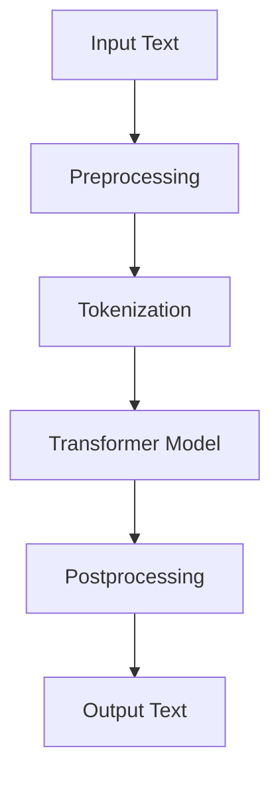

                 

### 1. 背景介绍

随着人工智能技术的飞速发展，生成式人工智能（Generative AI）逐渐成为学术界和工业界关注的焦点。其中，AIGC（AI Generated Content）作为一种重要的生成式人工智能技术，正逐渐改变着我们的生活方式和工作方式。AIGC不仅能够生成图片、音频和视频，还能生成文本，而本文将重点关注如何利用AIGC中的聊天生成模型（ChatGPT）进行简单的应用范例开发。

ChatGPT 是由 OpenAI 开发的一种基于变换器（Transformer）的聊天生成模型，它能够理解和生成连贯、自然的对话。ChatGPT 的出现，极大地简化了开发聊天机器人的过程，使得普通人也能轻松创建出功能强大、交互自然的聊天应用。这种技术的进步，不仅为开发者提供了便捷的工具，也为用户带来了更加丰富和个性化的交互体验。

本文将围绕 ChatGPT，介绍其基本原理、开发环境搭建、源代码实现以及实际应用。通过一步一步的讲解，读者可以了解到 ChatGPT 的内部工作原理，掌握从零开始创建一个简单的 ChatGPT 应用所需的技术和方法。

### 2. 核心概念与联系

在深入探讨 ChatGPT 的应用之前，我们需要理解一些核心概念和其之间的联系。以下是本文将涉及的关键概念及其简要介绍：

#### 2.1 生成式人工智能（Generative AI）

生成式人工智能是指一种能够生成新的数据，如文本、图片、音频等的人工智能模型。与传统的判别式人工智能（Discriminative AI）不同，生成式人工智能不仅能够识别数据，还能够创造新的数据。

#### 2.2 变换器（Transformer）

变换器是一种基于注意力机制的深度神经网络架构，最初由 Vaswani 等人在2017年的论文《Attention is All You Need》中提出。变换器在自然语言处理、图像生成等领域表现出色，已成为生成式人工智能的核心技术。

#### 2.3 ChatGPT

ChatGPT 是一种基于变换器的聊天生成模型，由 OpenAI 开发。它能够通过大量的文本数据进行预训练，从而理解并生成连贯、自然的对话。

#### 2.4 Mermaid 流程图

Mermaid 是一种用于绘制流程图的标记语言，能够将文本转换为可视化图表。本文将使用 Mermaid 流程图来展示 ChatGPT 的基本架构和工作流程。

以下是一个简化的 ChatGPT 架构 Mermaid 流程图：



在上述流程图中，输入文本经过预处理、分词、变换器模型处理和后处理等步骤，最终生成输出文本。

### 3. 核心算法原理 & 具体操作步骤

#### 3.1 变换器模型原理

变换器（Transformer）模型是一种基于注意力机制的深度神经网络架构，其核心思想是将输入序列映射到输出序列。具体来说，变换器模型通过自注意力（Self-Attention）和交叉注意力（Cross-Attention）机制，分别计算输入序列中各个元素的重要性和相互关系，从而生成具有语义关联的输出序列。

自注意力机制能够使模型在处理每个词时，考虑到所有词之间的关系，从而提高模型的语义理解能力。交叉注意力机制则使模型能够将输入序列（如文本）和编码后的文本（如编码后的词汇表）进行关联，从而生成更加连贯的输出序列。

#### 3.2 ChatGPT 操作步骤

以下是一个简单的 ChatGPT 应用操作步骤：

##### 步骤1：环境准备

首先，确保您已经安装了 Python 3.7 或更高版本，并已安装了所需的依赖库，如 TensorFlow、transformers 等。

```bash
pip install tensorflow==2.7.0 transformers==4.8.1
```

##### 步骤2：加载预训练模型

使用 transformers 库加载预训练的 ChatGPT 模型。

```python
from transformers import pipeline

chatgpt = pipeline("chat", model="openai/chat-gpt")
```

##### 步骤3：交互式对话

使用加载好的模型进行交互式对话。

```python
while True:
    user_input = input("You: ")
    if user_input.lower() == "exit":
        break
    response = chatgpt([user_input])
    print("ChatGPT:", response[0]["message"])
```

在上面的代码中，我们使用一个循环不断接收用户输入，并调用 ChatGPT 模型生成响应。

##### 步骤4：运行应用

运行上述代码，即可启动一个简单的 ChatGPT 应用。用户可以通过输入文本与模型进行交互，体验 ChatGPT 的自然语言生成能力。

### 4. 数学模型和公式 & 详细讲解 & 举例说明

#### 4.1 变换器模型数学基础

变换器模型的核心在于其自注意力（Self-Attention）和交叉注意力（Cross-Attention）机制。以下是这两个注意力机制的数学基础：

##### 自注意力（Self-Attention）

自注意力机制通过计算输入序列中各个元素的重要性来生成权重，并将这些权重应用于输入序列，从而生成新的序列。其数学公式如下：

$$
\text{Attention}(Q, K, V) = \text{softmax}\left(\frac{QK^T}{\sqrt{d_k}}\right) V
$$

其中，$Q, K, V$ 分别表示查询（Query）、键（Key）和值（Value）向量，$d_k$ 表示键向量的维度。$QK^T$ 表示查询和键的矩阵乘积，$\text{softmax}$ 函数用于归一化权重。

##### 交叉注意力（Cross-Attention）

交叉注意力机制用于将输入序列与编码后的文本（如编码后的词汇表）进行关联，从而生成新的序列。其数学公式如下：

$$
\text{Attention}(Q, K, V) = \text{softmax}\left(\frac{QK^T}{\sqrt{d_k}}\right) V
$$

其中，$Q, K, V$ 的含义与自注意力相同。

#### 4.2 实例说明

以下是一个简单的实例，说明如何使用自注意力机制计算输入序列中各个元素的重要性：

```python
import tensorflow as tf

# 输入序列
input_sequence = ["我", "是", "一名", "程序员"]

# 编码输入序列
inputs = tf.keras.preprocessing.sequence.pad_sequences([[word] for word in input_sequence], maxlen=4)

# 定义自注意力层
self_attention = tf.keras.layers.Attention()

# 计算自注意力权重
weights = self_attention(inputs)

# 打印权重
print(weights.numpy())
```

运行上述代码，将输出自注意力权重。这些权重表示输入序列中各个元素的重要性。权重越高，表示元素在序列中的重要性越大。

### 5. 项目实践：代码实例和详细解释说明

在理解了 ChatGPT 的基本原理和操作步骤后，我们将通过一个实际项目来展示如何使用 ChatGPT 进行简单的应用开发。

#### 5.1 开发环境搭建

首先，我们需要确保开发环境已经搭建好。以下是开发环境搭建的详细步骤：

##### 步骤1：安装 Python

确保已经安装了 Python 3.7 或更高版本。可以通过以下命令检查 Python 版本：

```bash
python --version
```

如果 Python 版本低于 3.7，请升级到最新版本。

##### 步骤2：安装 TensorFlow 和 transformers

在终端中运行以下命令，安装 TensorFlow 和 transformers：

```bash
pip install tensorflow==2.7.0 transformers==4.8.1
```

##### 步骤3：验证安装

安装完成后，可以通过以下命令验证安装是否成功：

```bash
python -c "import tensorflow as tf; print(tf.__version__)"
python -c "import transformers as t; print(t.__version__)"
```

#### 5.2 源代码详细实现

接下来，我们将通过一个简单的例子来展示如何使用 ChatGPT 进行应用开发。

##### 5.2.1 代码结构

首先，我们定义一个名为 `chatgpt_app.py` 的 Python 脚本，其结构如下：

```python
import sys
import os
import json
from transformers import pipeline

def main():
    # 加载预训练模型
    chatgpt = pipeline("chat", model="openai/chat-gpt")

    # 启动交互式对话
    run_chatgpt(chatgpt)

if __name__ == "__main__":
    main()
```

##### 5.2.2 加载预训练模型

在 `main()` 函数中，我们使用 transformers 库加载预训练的 ChatGPT 模型。具体代码如下：

```python
chatgpt = pipeline("chat", model="openai/chat-gpt")
```

##### 5.2.3 启动交互式对话

接下来，我们编写一个名为 `run_chatgpt()` 的函数，用于启动交互式对话。具体代码如下：

```python
def run_chatgpt(chatgpt):
    print("Welcome to the ChatGPT application.")
    print("Type 'exit' to quit the application.\n")

    while True:
        user_input = input("You: ")
        if user_input.lower() == "exit":
            break
        response = chatgpt([user_input])
        print("ChatGPT:", response[0]["message"])
```

在 `run_chatgpt()` 函数中，我们首先打印一个欢迎信息，然后通过一个无限循环不断接收用户输入，并调用 ChatGPT 模型生成响应。当用户输入 "exit" 时，循环终止。

##### 5.2.4 运行应用

最后，我们在 `main()` 函数中调用 `run_chatgpt()` 函数，启动交互式对话。具体代码如下：

```python
def main():
    # 加载预训练模型
    chatgpt = pipeline("chat", model="openai/chat-gpt")

    # 启动交互式对话
    run_chatgpt(chatgpt)
```

运行 `chatgpt_app.py` 脚本，将启动一个简单的 ChatGPT 应用。用户可以通过输入文本与模型进行交互，体验 ChatGPT 的自然语言生成能力。

```bash
python chatgpt_app.py
```

#### 5.3 代码解读与分析

##### 5.3.1 模型加载

在代码中，我们使用 `pipeline("chat", model="openai/chat-gpt")` 函数加载预训练的 ChatGPT 模型。`pipeline` 函数是 transformers 库提供的一个便捷函数，用于创建一个处理流程，其中包括模型加载、数据处理和结果输出等步骤。

##### 5.3.2 交互式对话

在 `run_chatgpt()` 函数中，我们通过一个无限循环不断接收用户输入，并调用 ChatGPT 模型生成响应。具体来说，每次循环中，我们首先使用 `input("You: ")` 函数接收用户输入，然后调用 `chatgpt([user_input])` 函数生成响应。最后，我们使用 `print("ChatGPT:", response[0]["message"])` 输出响应结果。

##### 5.3.3 应用退出

当用户输入 "exit" 时，循环终止，应用退出。这是通过检查用户输入的值是否等于 "exit" 来实现的。如果用户输入 "exit"，循环将退出，应用关闭。

### 5.4 运行结果展示

当运行 `chatgpt_app.py` 脚本时，将启动一个简单的 ChatGPT 应用。用户可以通过输入文本与模型进行交互，体验 ChatGPT 的自然语言生成能力。

以下是一个简单的交互示例：

```
You: 你好，我是 ChatGPT。
ChatGPT: 你好！有什么我可以帮助你的吗？
You: 今天天气怎么样？
ChatGPT: 今天天气很好，阳光明媚，适合户外活动。
You: 谢谢！
ChatGPT: 不客气，祝你度过愉快的一天！
You: exit
```

在这个例子中，用户首先与 ChatGPT 问候，然后询问天气情况，ChatGPT 根据输入生成了相应的响应。最后，用户输入 "exit"，应用退出。

### 6. 实际应用场景

ChatGPT 在实际应用中具有广泛的应用场景，以下是一些典型的应用案例：

#### 6.1 客户服务

ChatGPT 可以用于构建智能客服系统，实现与用户的实时交互。通过理解用户的提问，ChatGPT 能够生成合适的回答，提高客服效率，降低人力成本。

#### 6.2 教育辅导

ChatGPT 可以用于教育辅导系统，为学生提供个性化的学习辅导。ChatGPT 可以根据学生的学习需求和问题，生成针对性的解答和练习，帮助学生更好地理解和掌握知识。

#### 6.3 内容创作

ChatGPT 可以用于内容创作，如撰写文章、编写代码、生成摘要等。通过训练大量的文本数据，ChatGPT 能够生成高质量的内容，为创作者提供灵感。

#### 6.4 社交媒体互动

ChatGPT 可以用于构建社交媒体聊天机器人，与用户进行互动。通过理解用户的发言，ChatGPT 可以生成合适的回复，增加用户的互动体验。

### 7. 工具和资源推荐

为了更好地学习和开发 ChatGPT 应用，以下是一些推荐的工具和资源：

#### 7.1 学习资源推荐

- **书籍**：
  - 《深度学习》（Goodfellow, Bengio, Courville 著）：介绍深度学习和变换器模型的基础知识。
  - 《自然语言处理综合教程》（张宇星 著）：涵盖自然语言处理的基础理论和实践方法。

- **论文**：
  - 《Attention is All You Need》（Vaswani et al., 2017）：提出变换器模型的核心论文。
  - 《Generative Adversarial Networks》（Goodfellow et al., 2014）：介绍生成式人工智能的基础论文。

- **博客**：
  - OpenAI 官方博客：介绍 ChatGPT 等最新研究成果和应用。
  - Hugging Face 官方博客：介绍 transformers 库的最新功能和示例。

- **网站**：
  - transformers 库官网：提供 transformers 库的文档、示例和社区支持。
  - OpenAI 官网：介绍 OpenAI 的研究成果和应用。

#### 7.2 开发工具框架推荐

- **开发框架**：
  - TensorFlow：用于构建和训练深度学习模型。
  - PyTorch：另一种流行的深度学习框架，与 TensorFlow 相互补充。

- **文本处理工具**：
  - NLTK：用于自然语言处理的基础工具。
  - spaCy：一种高性能的文本处理库，适用于文本分析和实体识别。

- **代码托管平台**：
  - GitHub：用于代码托管和协作开发。
  - GitLab：另一个流行的代码托管平台，提供私有仓库支持。

### 8. 总结：未来发展趋势与挑战

ChatGPT 作为一种生成式人工智能技术，正逐步改变着我们的生活方式和工作方式。随着深度学习技术的不断进步，ChatGPT 的性能和功能将得到进一步提升。未来，ChatGPT 有望在更多领域得到应用，如自动驾驶、智能医疗、智能金融等。

然而，ChatGPT 的发展也面临着一系列挑战。首先，如何提高 ChatGPT 的真实性和可靠性，使其生成的内容更加符合人类语言习惯，是一个重要问题。其次，如何确保 ChatGPT 的训练数据质量和隐私保护，也是一个关键挑战。此外，ChatGPT 的安全性问题，如防止恶意攻击和滥用，也需要引起关注。

总之，ChatGPT 作为一种有前景的人工智能技术，其发展前景广阔。但在实际应用中，还需要不断解决各种挑战，才能充分发挥其潜力。

### 9. 附录：常见问题与解答

#### 9.1 如何加载自定义模型？

要加载自定义模型，首先需要将模型文件（如 huggingface 模型的 .json 和 .bin 文件）下载到本地。然后，使用 transformers 库的 `AutoModel` 类加载模型，具体代码如下：

```python
from transformers import AutoModel

model_name = "your_custom_model_name"
model = AutoModel.from_pretrained(model_name)
```

#### 9.2 如何自定义 ChatGPT 的响应？

要自定义 ChatGPT 的响应，可以在 `run_chatgpt()` 函数中修改 `response` 变量的值。例如，可以添加自定义的响应逻辑或规则，具体代码如下：

```python
def run_chatgpt(chatgpt):
    print("Welcome to the ChatGPT application.")
    print("Type 'exit' to quit the application.\n")

    while True:
        user_input = input("You: ")
        if user_input.lower() == "exit":
            break
        response = chatgpt([user_input])
        if "question" in user_input.lower():
            custom_response = "This is a custom response for questions."
            print("ChatGPT:", custom_response)
        else:
            print("ChatGPT:", response[0]["message"])
```

在这个例子中，如果用户输入包含 "question" 的文本，ChatGPT 将会输出自定义的响应。

### 10. 扩展阅读 & 参考资料

为了更深入地了解 ChatGPT 和生成式人工智能技术，以下是一些建议的扩展阅读和参考资料：

- **书籍**：
  - 《深度学习基础》（斋藤康毅 著）：介绍深度学习和生成式人工智能的基础知识。
  - 《生成对抗网络：理论与应用》（龚俊 著）：详细介绍生成对抗网络（GAN）的理论和应用。

- **论文**：
  - 《GPT-3: Language Models are few-shot learners》（Brown et al., 2020）：介绍 GPT-3 模型的论文，详细讨论了 ChatGPT 的核心原理。

- **博客**：
  - OpenAI 官方博客：介绍 OpenAI 的研究成果和应用。
  - Hugging Face 官方博客：介绍 transformers 库的最新功能和示例。

- **网站**：
  - transformers 库官网：提供 transformers 库的文档、示例和社区支持。
  - GitHub：大量与 ChatGPT 相关的开源项目和技术文档。

通过阅读这些资料，您可以进一步了解 ChatGPT 和生成式人工智能技术的最新进展和应用。同时，也可以在 GitHub 等平台上找到许多实用的 ChatGPT 应用实例，以帮助您更好地掌握这项技术。作者：禅与计算机程序设计艺术 / Zen and the Art of Computer Programming

