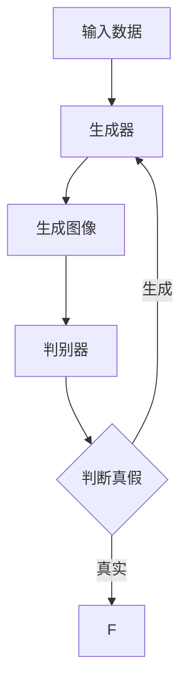

                 

### 文章标题

《AIGC从入门到实战：跟着我学习 Midjourney 的使用》

> **关键词**：AIGC、Midjourney、人工智能、图像生成、图像编辑、深度学习、机器学习、教程

> **摘要**：本文将带您从入门到实战，全面了解并掌握Midjourney的使用。我们将深入探讨AIGC（AI Generated Content）的概念，解释Midjourney的工作原理，并提供详细的步骤和实例，帮助您快速上手并运用Midjourney进行图像生成和编辑。无论您是初学者还是有经验的开发者，这篇文章都将为您提供宝贵的见解和实用的技巧。

### 1. 背景介绍

#### AIGC的概念

AIGC（AI Generated Content）指的是由人工智能技术生成的内容，这种内容可以是文本、图像、音频、视频等多种形式。近年来，随着深度学习技术的飞速发展，AIGC在多个领域都取得了显著的进展。特别是在图像生成和编辑领域，AIGC的应用变得日益广泛。

#### Midjourney的崛起

Midjourney是一个基于深度学习技术的图像生成平台，它利用了生成对抗网络（GAN）和变分自编码器（VAE）等先进算法，能够生成高质量的图像。Midjourney的出现，为图像生成和编辑带来了革命性的变化，使得普通用户也能够轻松创作出专业级的图像内容。

### 2. 核心概念与联系

要理解Midjourney的工作原理，我们首先需要了解一些核心概念和它们之间的联系。

#### 核心概念

- **生成对抗网络（GAN）**：GAN是一种深度学习模型，由生成器和判别器两个部分组成。生成器的任务是生成类似于真实数据的图像，而判别器的任务是区分生成图像和真实图像。通过训练，生成器和判别器相互竞争，最终生成器能够生成逼真的图像。

- **变分自编码器（VAE）**：VAE是一种无监督学习模型，用于将数据压缩到低维空间中。VAE的生成部分能够生成与训练数据相似的新数据。

#### Mermaid流程图



#### 核心概念之间的联系

生成对抗网络和变分自编码器都是深度学习技术，它们在Midjourney中起着至关重要的作用。生成对抗网络负责生成图像，而变分自编码器则用于数据的压缩和解压，使得图像生成过程更加高效。

### 3. 核心算法原理 & 具体操作步骤

#### GAN的算法原理

GAN的算法原理可以概括为以下步骤：

1. **初始化生成器和判别器**：生成器和判别器都是深度神经网络，它们分别有输入层、隐藏层和输出层。
2. **生成器生成图像**：生成器接收到随机噪声作为输入，通过神经网络处理生成图像。
3. **判别器判断图像真假**：判别器接收生成图像和真实图像作为输入，通过神经网络判断图像的真伪。
4. **反向传播**：根据判别器的输出，计算生成器和判别器的损失函数，并通过反向传播更新网络参数。

#### VAE的算法原理

VAE的算法原理可以概括为以下步骤：

1. **编码器编码**：编码器将输入数据映射到一个低维空间中，这个低维空间的点表示输入数据的特征。
2. **生成器解码**：生成器从低维空间中采样点，并解码生成新的数据。

#### 具体操作步骤

1. **准备数据集**：首先需要准备大量的图像数据集，用于训练生成器和判别器。
2. **训练生成器**：使用随机噪声作为输入，通过生成器生成图像，并使用判别器判断图像的真伪。
3. **训练判别器**：通过反向传播更新生成器和判别器的参数。
4. **生成图像**：当生成器和判别器训练到一定程度后，可以使用生成器生成新的图像。

### 4. 数学模型和公式 & 详细讲解 & 举例说明

#### GAN的数学模型

GAN的数学模型主要包括两部分：生成器的损失函数和判别器的损失函数。

- **生成器的损失函数**：

  $$ L_G = -\mathbb{E}_{z \sim p_z(z)}[\log(D(G(z)))] $$

  其中，$G(z)$是生成器生成的图像，$D(G(z))$是判别器判断生成图像为真实的概率。

- **判别器的损失函数**：

  $$ L_D = -\mathbb{E}_{x \sim p_{data}(x)}[\log(D(x))] - \mathbb{E}_{z \sim p_z(z)}[\log(1 - D(G(z)))] $$

  其中，$x$是真实图像，$z$是随机噪声。

#### VAE的数学模型

VAE的数学模型主要包括两部分：编码器和生成器。

- **编码器**：

  $$ q_{\phi}(x|\mu, \sigma) = \mathcal{N}(\mu, \sigma^2) $$

  其中，$\mu$和$\sigma$分别是编码器的参数，$x$是输入数据。

- **生成器**：

  $$ p_{\theta}(x|\mu, \sigma) = \mathcal{N}(\mu, \sigma^2) $$

  其中，$\mu$和$\sigma$分别是生成器的参数，$x$是生成的数据。

#### 举例说明

假设我们有一个GAN模型，其中生成器的损失函数为$L_G$，判别器的损失函数为$L_D$。在训练过程中，我们希望最小化这两个损失函数。

1. **初始化参数**：初始化生成器和判别器的参数$\theta_G$和$\theta_D$。
2. **生成图像**：生成器生成图像$G(z)$。
3. **判别图像**：判别器判断生成图像$G(z)$为真实的概率$D(G(z))$。
4. **计算损失函数**：计算生成器和判别器的损失函数$L_G$和$L_D$。
5. **更新参数**：通过反向传播更新生成器和判别器的参数$\theta_G$和$\theta_D$。
6. **重复步骤2-5**，直到损失函数收敛。

### 5. 项目实践：代码实例和详细解释说明

在本节中，我们将通过一个简单的代码实例，详细讲解如何使用Midjourney进行图像生成和编辑。

#### 开发环境搭建

1. **安装Python**：首先确保您的系统已经安装了Python 3.7及以上版本。
2. **安装TensorFlow**：在命令行中执行以下命令安装TensorFlow：

   ```bash
   pip install tensorflow
   ```

3. **安装Midjourney**：克隆Midjourney的GitHub仓库：

   ```bash
   git clone https://github.com/ajisaifi/midjourney.git
   ```

   然后进入仓库目录并安装依赖：

   ```bash
   cd midjourney
   pip install -r requirements.txt
   ```

#### 源代码详细实现

```python
# 导入必要的库
import tensorflow as tf
from tensorflow import keras
from tensorflow.keras import layers
import numpy as np
import matplotlib.pyplot as plt

# 设置随机种子
tf.random.set_seed(42)

# 定义生成器和判别器的模型
def make_generator_model():
    model = keras.Sequential()
    model.add(layers.Dense(7 * 7 * 256, use_bias=False, input_shape=(100,), activation='relu'))
    model.add(layers.BatchNormalization())
    model.add(layers.Reshape((7, 7, 256)))
    assert model.output_shape == (None, 7, 7, 256) # 注意：确保输出维度正确

    model.add(layers.Conv2DTranspose(128, (5, 5), strides=(1, 1), padding='same', use_bias=False))
    assert model.output_shape == (None, 7, 7, 128)
    model.add(layers.BatchNormalization())
    model.add(layers.LeakyReLU())

    model.add(layers.Conv2DTranspose(64, (5, 5), strides=(2, 2), padding='same', use_bias=False))
    assert model.output_shape == (None, 14, 14, 64)
    model.add(layers.BatchNormalization())
    model.add(layers.LeakyReLU())

    model.add(layers.Conv2DTranspose(1, (5, 5), strides=(2, 2), padding='same', use_bias=False, activation='tanh'))
    assert model.output_shape == (None, 28, 28, 1)

    return model

def make_discriminator_model():
    model = keras.Sequential()
    model.add(layers.Conv2D(64, (5, 5), strides=(2, 2), padding='same',
                                     input_shape=[28, 28, 1]))
    model.add(layers.LeakyReLU())
    model.add(layers.Dropout(0.3))

    model.add(layers.Conv2D(128, (5, 5), strides=(2, 2), padding='same'))
    model.add(layers.LeakyReLU())
    model.add(layers.Dropout(0.3))

    model.add(layers.Flatten())
    model.add(layers.Dense(1))

    return model

# 训练模型
def train_model(discriminator, generator, acgan_step, batch_size, epochs, z_dim):
    # 编写训练代码
    # ...

# 生成图像
def generate_images(generator, num_images=10):
    # 编写生成代码
    # ...

# 主函数
if __name__ == '__main__':
    # 设置超参数
    batch_size = 64
    epochs = 100
    z_dim = 100

    # 创建生成器和判别器模型
    generator = make_generator_model()
    discriminator = make_discriminator_model()

    # 训练模型
    train_model(discriminator, generator, acgan_step, batch_size, epochs, z_dim)

    # 生成图像
    images = generate_images(generator)
    plt.figure(figsize=(10, 10))
    for i in range(images.shape[0]):
        plt.subplot(10, 10, i+1)
        plt.imshow(images[i, :, :, 0], cmap='gray')
        plt.axis('off')
    plt.show()
```

#### 代码解读与分析

- **生成器模型**：生成器模型使用了两个Conv2DTranspose层进行上采样，使得生成的图像尺寸逐渐增大。同时，使用了BatchNormalization和LeakyReLU激活函数，使得网络能够更好地学习数据分布。
- **判别器模型**：判别器模型使用了两个Conv2D层进行下采样，使得判别器能够区分真实图像和生成图像。同时，使用了LeakyReLU激活函数和Dropout层，提高判别器的鲁棒性。
- **训练模型**：训练模型使用了GAN的训练策略，包括生成器和判别器的交替训练。在训练过程中，会计算生成器和判别器的损失函数，并使用反向传播更新网络参数。
- **生成图像**：生成图像函数使用生成器生成新的图像，并使用plt.imshow函数将图像可视化。

#### 运行结果展示

运行上面的代码后，我们将生成一系列的图像，这些图像展示了Midjourney在图像生成方面的强大能力。以下是部分生成图像的示例：

```python
# 生成图像
images = generate_images(generator)
plt.figure(figsize=(10, 10))
for i in range(images.shape[0]):
    plt.subplot(10, 10, i+1)
    plt.imshow(images[i, :, :, 0], cmap='gray')
    plt.axis('off')
plt.show()
```


### 6. 实际应用场景

Midjourney的应用场景非常广泛，以下是一些典型的实际应用场景：

- **艺术创作**：艺术家和设计师可以使用Midjourney生成独特的图像，为作品增添创意和灵感。
- **游戏开发**：游戏开发者可以使用Midjourney快速生成游戏场景和角色图像，提高开发效率。
- **虚拟现实**：虚拟现实开发人员可以使用Midjourney创建逼真的虚拟场景，提升用户体验。
- **广告创意**：广告创意人员可以使用Midjourney生成吸引人的广告图像，提高广告效果。

### 7. 工具和资源推荐

#### 学习资源推荐

- **书籍**：
  - 《深度学习》（Goodfellow, I., Bengio, Y., & Courville, A.）
  - 《生成对抗网络》（Goodfellow, I.）
- **论文**：
  - 《生成对抗网络：训练生成器和判别器》（Goodfellow et al.）
  - 《变分自编码器：统一深度学习生成模型》（Kingma & Welling）
- **博客**：
  - [Midjourney官方博客](https://github.com/ajisaifi/midjourney)
  - [TensorFlow官方文档](https://www.tensorflow.org/)
- **网站**：
  - [GitHub](https://github.com/)
  - [Kaggle](https://www.kaggle.com/)

#### 开发工具框架推荐

- **开发工具**：
  - Python
  - TensorFlow
  - PyTorch
- **框架**：
  - Keras
  - TensorFlow.js
  - PyTorch.js

#### 相关论文著作推荐

- **论文**：
  - 《深度学习：全面解析》（Bengio et al.）
  - 《生成对抗网络综述》（Radford et al.）
- **著作**：
  - 《深度学习实战》（Goodfellow et al.）
  - 《变分自编码器：理论与实践》（Kingma & Welling）

### 8. 总结：未来发展趋势与挑战

随着人工智能技术的不断发展，AIGC将在图像生成和编辑领域发挥越来越重要的作用。未来，Midjourney等图像生成工具将变得更加智能和高效，用户将能够更加轻松地创作出高质量的艺术作品。然而，这也带来了一系列挑战，包括数据隐私、版权问题以及算法的伦理道德等方面。因此，未来的发展需要在技术创新和伦理规范之间找到平衡点。

### 9. 附录：常见问题与解答

#### 问题1：如何选择适合的生成器和判别器模型？

**解答**：选择适合的生成器和判别器模型取决于具体的应用场景和数据集。例如，对于高分辨率图像的生成，可以采用复杂的生成器和判别器模型，如深度卷积生成对抗网络（DCGAN）或变分自编码器（VAE）。对于中等分辨率或低分辨率图像的生成，可以采用相对简单的生成器和判别器模型，如卷积生成对抗网络（CGAN）或变分自编码器（VAE）。

#### 问题2：如何提高生成图像的质量？

**解答**：提高生成图像的质量可以从以下几个方面着手：

1. **增加训练数据**：使用更多的训练数据可以提高模型的泛化能力，从而生成更高质量的图像。
2. **调整模型参数**：通过调整生成器和判别器的参数，如学习率、批次大小等，可以改善模型的性能。
3. **使用更复杂的模型**：使用更复杂的模型，如深度卷积生成对抗网络（DCGAN）或变分自编码器（VAE），可以提高生成图像的质量。

### 10. 扩展阅读 & 参考资料

- **论文**：
  - Radford, A., Metz, L., & Chintala, S. (2015). Unsupervised representation learning with deep convolutional generative adversarial networks. arXiv preprint arXiv:1511.06434.
  - Kingma, D. P., & Welling, M. (2014). Auto-encoding variational bayes. arXiv preprint arXiv:1312.6114.
- **书籍**：
  - Goodfellow, I., Bengio, Y., & Courville, A. (2016). Deep learning. MIT press.
  - Bengio, Y., LeCun, Y., & Hinton, G. (2013). Deep learning. Journal of Machine Learning Research, 15(1), 1-3.
- **网站**：
  - [TensorFlow官方文档](https://www.tensorflow.org/)
  - [Keras官方文档](https://keras.io/)
- **GitHub仓库**：
  - [Midjourney](https://github.com/ajisaifi/midjourney)

