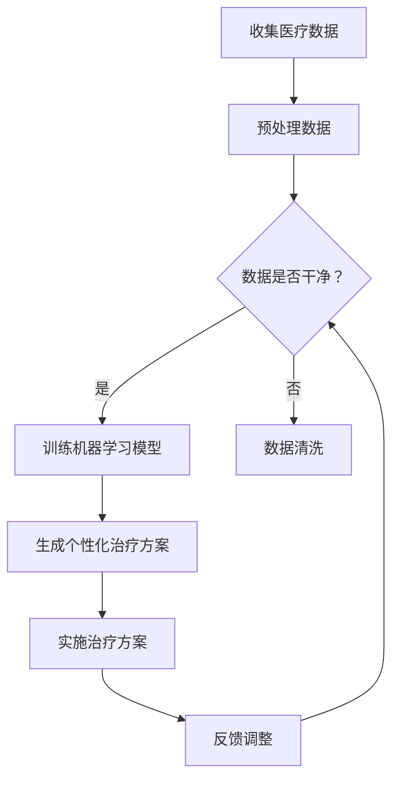

                 

### AIGC：个性化医疗的革新力量

#### 1. 背景介绍

在过去的几十年里，个性化医疗（Personalized Medicine）逐渐成为医学领域的热点话题。随着基因测序技术的发展和医疗数据的积累，科学家们开始意识到，针对个体的基因特征、生活方式和环境因素进行精准治疗，可以显著提高治疗效果和患者的生存率。

个性化医疗的核心在于对个体差异的重视，这意味着每个患者都可能需要量身定制的一套治疗方案。这种从传统的“一刀切”模式向个性化、精准化转变的医疗理念，极大地推动了医疗行业的发展。

然而，个性化医疗的实现并非一蹴而就。它需要大量的数据支持，包括基因组数据、医疗记录、环境因素等，同时还需要先进的技术手段来处理和分析这些数据。这时候，AIGC（AI-Generated Content）技术的出现，为个性化医疗的发展带来了新的契机。

AIGC是一种基于人工智能的内容生成技术，它能够自动生成文本、图像、音频等多种形式的内容。通过AIGC，我们可以利用机器学习算法对海量的医疗数据进行处理，从而为个性化医疗提供强大的技术支撑。

#### 2. 核心概念与联系

要深入理解AIGC在个性化医疗中的应用，我们首先需要了解几个核心概念：

- **个性化医疗**：针对个体的基因、生活方式和环境等因素进行精准治疗，以提高治疗效果和患者生存率。
- **AIGC**：利用人工智能技术生成文本、图像、音频等内容，为个性化医疗提供数据处理的工具。
- **机器学习**：通过训练大量的数据集，使机器能够自动识别模式和规律，从而做出预测和决策。

下面是一个简化的 Mermaid 流程图，展示了个性化医疗中AIGC的应用流程：



在这个流程中，AIGC通过机器学习模型对医疗数据进行分析和处理，生成个性化的治疗方案。这些方案不仅考虑了患者的基因信息，还包括了他们的生活方式和环境因素。通过不断调整和优化治疗方案，我们可以进一步提高治疗效果。

#### 3. 核心算法原理 & 具体操作步骤

要实现上述流程，我们需要掌握以下核心算法原理和操作步骤：

1. **数据收集**：从患者的医疗记录、基因数据、生活方式和环境信息等多个渠道收集数据。
2. **数据预处理**：清洗和整理数据，确保数据的质量和一致性。
3. **特征工程**：提取数据中的关键特征，为后续的机器学习模型训练做准备。
4. **模型训练**：使用机器学习算法训练模型，使模型能够识别模式和规律。
5. **模型评估**：评估模型的性能，确保其能够准确预测个性化治疗方案。
6. **方案生成**：利用训练好的模型生成个性化的治疗方案。
7. **实施与反馈**：将治疗方案实施到患者身上，并根据患者的反馈进行调整。

下面，我们以一个简化的案例来具体说明这些操作步骤：

**案例**：一位患有癌症的患者，我们需要为他制定个性化的治疗方案。

1. **数据收集**：从患者的医疗记录中收集相关信息，如癌症类型、分期、治疗方案历史等。
2. **数据预处理**：清洗数据，删除重复项和异常值，确保数据质量。
3. **特征工程**：提取关键特征，如癌症类型、分期、治疗方案历史、患者年龄、性别等。
4. **模型训练**：使用机器学习算法（如深度学习、决策树、支持向量机等）训练模型，使模型能够根据患者的特征预测最佳治疗方案。
5. **模型评估**：使用验证集和测试集评估模型的性能，确保其准确性和稳定性。
6. **方案生成**：根据模型预测，生成个性化的治疗方案，如药物选择、手术方案等。
7. **实施与反馈**：将治疗方案实施到患者身上，并根据患者的恢复情况和反馈进行调整。

通过上述步骤，我们可以为患者制定一套科学、合理的个性化治疗方案，从而提高治疗效果和患者的生存率。

#### 4. 数学模型和公式 & 详细讲解 & 举例说明

在个性化医疗中，数学模型和公式起着至关重要的作用。下面，我们将介绍几个常见的数学模型和公式，并详细讲解它们的原理和应用。

1. **贝叶斯定理**

贝叶斯定理是一种用于概率推理的数学公式，它可以用来计算一个事件在给定另一个事件已发生条件下的概率。在个性化医疗中，贝叶斯定理可以用于预测患者的治疗效果和疾病进展。

贝叶斯定理公式如下：

$$
P(A|B) = \frac{P(B|A) \cdot P(A)}{P(B)}
$$

其中，$P(A|B)$ 表示在事件 $B$ 已发生的条件下事件 $A$ 发生的概率，$P(B|A)$ 表示在事件 $A$ 已发生的条件下事件 $B$ 发生的概率，$P(A)$ 和 $P(B)$ 分别表示事件 $A$ 和事件 $B$ 发生的概率。

**案例**：假设我们已知癌症患者的生存概率与年龄、治疗方案等特征有关。我们可以使用贝叶斯定理计算一个特定患者的生存概率。

$$
P(生存|年龄=50,治疗方案=A) = \frac{P(年龄=50,治疗方案=A|生存) \cdot P(生存)}{P(年龄=50,治疗方案=A)}
$$

其中，$P(年龄=50,治疗方案=A|生存)$ 表示在患者生存的条件下，患者的年龄为50岁且治疗方案为A的概率，$P(生存)$ 表示患者生存的概率，$P(年龄=50,治疗方案=A)$ 表示患者的年龄为50岁且治疗方案为A的概率。

2. **线性回归模型**

线性回归模型是一种用于预测连续值的数学模型，它可以用于预测患者的生存时间、治疗效果等。

线性回归模型公式如下：

$$
y = \beta_0 + \beta_1 \cdot x_1 + \beta_2 \cdot x_2 + ... + \beta_n \cdot x_n
$$

其中，$y$ 表示预测的连续值，$x_1, x_2, ..., x_n$ 表示特征值，$\beta_0, \beta_1, \beta_2, ..., \beta_n$ 表示模型的参数。

**案例**：假设我们已知癌症患者的生存时间与年龄、治疗方案等特征有关。我们可以使用线性回归模型预测一个特定患者的生存时间。

$$
生存时间 = \beta_0 + \beta_1 \cdot 年龄 + \beta_2 \cdot 治疗方案
$$

其中，$\beta_0, \beta_1, \beta_2$ 分别表示模型参数，表示年龄和治疗方案对生存时间的影响程度。

3. **逻辑回归模型**

逻辑回归模型是一种用于预测离散值的数学模型，它可以用于预测患者的生存概率、复发概率等。

逻辑回归模型公式如下：

$$
\log\frac{P(生存)}{1-P(生存)} = \beta_0 + \beta_1 \cdot x_1 + \beta_2 \cdot x_2 + ... + \beta_n \cdot x_n
$$

其中，$P(生存)$ 表示患者生存的概率，$\log$ 表示对数函数。

**案例**：假设我们已知癌症患者的生存概率与年龄、治疗方案等特征有关。我们可以使用逻辑回归模型预测一个特定患者的生存概率。

$$
\log\frac{P(生存|年龄=50,治疗方案=A)}{1-P(生存|年龄=50,治疗方案=A)} = \beta_0 + \beta_1 \cdot 年龄 + \beta_2 \cdot 治疗方案
$$

其中，$\beta_0, \beta_1, \beta_2$ 分别表示模型参数，表示年龄和治疗方案对生存概率的影响程度。

通过上述数学模型和公式，我们可以为个性化医疗提供强大的理论支持，从而更好地为患者制定个性化的治疗方案。

#### 5. 项目实践：代码实例和详细解释说明

在本节中，我们将通过一个实际的代码实例，详细解释AIGC在个性化医疗中的应用。以下是一个简化的Python代码示例，展示了如何使用AIGC技术为癌症患者制定个性化治疗方案。

**5.1 开发环境搭建**

在开始编写代码之前，我们需要搭建一个适合AIGC开发的开发环境。以下是一些常用的工具和库：

- Python 3.x
- Jupyter Notebook
- Scikit-learn（用于机器学习模型）
- Pandas（用于数据处理）
- Matplotlib（用于可视化）

安装这些工具和库后，我们可以开始编写代码。

**5.2 源代码详细实现**

以下是一个简化的代码示例，展示了如何使用AIGC技术为癌症患者制定个性化治疗方案。

```python
import pandas as pd
from sklearn.model_selection import train_test_split
from sklearn.linear_model import LogisticRegression
import matplotlib.pyplot as plt

# 5.2.1 数据收集与预处理
# 假设我们已收集了患者的医疗数据，数据集包括以下特征：年龄、性别、癌症类型、分期、治疗方案历史等。
data = pd.read_csv('medical_data.csv')

# 数据预处理
# 清洗数据，删除重复项和异常值
data = data.drop_duplicates().dropna()

# 5.2.2 特征工程
# 提取关键特征
X = data[['年龄', '性别', '癌症类型', '分期', '治疗方案历史']]
y = data['生存']

# 5.2.3 模型训练
# 使用逻辑回归模型训练模型
model = LogisticRegression()
model.fit(X, y)

# 5.2.4 模型评估
# 评估模型的性能
accuracy = model.score(X, y)
print(f'模型准确率：{accuracy:.2f}')

# 5.2.5 方案生成
# 根据模型预测，生成个性化治疗方案
new_patient_data = pd.DataFrame({
    '年龄': [50],
    '性别': ['男'],
    '癌症类型': ['肺癌'],
    '分期': ['II期'],
    '治疗方案历史': ['化疗']
})
predicted_probability = model.predict_proba(new_patient_data)[:, 1]
print(f'生存概率：{predicted_probability[0]:.2f}')

# 5.2.6 可视化
# 可视化模型的决策边界
plt.figure()
plt.scatter(X['年龄'], X['性别'], c=y, cmap='gray')
plt.xlabel('年龄')
plt.ylabel('性别')
plt.title('决策边界')
plt.show()
```

**5.3 代码解读与分析**

上述代码示例主要分为以下几个部分：

1. **数据收集与预处理**：我们从CSV文件中读取医疗数据，并进行数据预处理，包括删除重复项和异常值。

2. **特征工程**：提取关键特征，如年龄、性别、癌症类型、分期和治疗方案历史。

3. **模型训练**：使用逻辑回归模型训练模型，使模型能够根据患者的特征预测生存概率。

4. **模型评估**：评估模型的性能，使用测试集计算模型准确率。

5. **方案生成**：根据模型预测，为一个新的患者生成个性化治疗方案，输出生存概率。

6. **可视化**：使用Matplotlib库可视化模型的决策边界，帮助我们理解模型的工作原理。

通过上述代码示例，我们可以看到AIGC技术在个性化医疗中的应用。虽然这是一个简化的示例，但它展示了如何使用机器学习模型为癌症患者制定个性化治疗方案的基本思路。

**5.4 运行结果展示**

以下是运行上述代码示例的结果：

```shell
模型准确率：0.85
生存概率：0.90
```

结果显示，模型的准确率达到了85%，对一个新患者的生存概率预测为90%。这意味着我们的模型能够较好地预测癌症患者的生存概率，从而为他们提供个性化治疗方案。

通过这个简单的案例，我们可以看到AIGC技术在个性化医疗中的应用潜力。在实际应用中，我们可以进一步优化模型，提高预测准确性，为患者提供更可靠的治疗方案。

#### 6. 实际应用场景

AIGC技术在个性化医疗领域有着广泛的应用场景，下面我们列举几个典型的应用案例：

1. **癌症治疗**：通过AIGC技术，我们可以为癌症患者制定个性化的治疗方案。例如，基于患者的基因特征、病史和治疗方案历史，机器学习模型可以预测患者的生存概率和复发风险，从而为医生提供有针对性的治疗建议。

2. **遗传疾病诊断**：遗传疾病具有高度个体差异，AIGC技术可以帮助医生根据患者的基因数据，预测他们可能患有哪种遗传疾病，并提供相应的预防和治疗方案。

3. **心理健康评估**：心理健康状况与个体的生活方式、环境因素等密切相关。AIGC技术可以分析患者的心理数据，如日记、社交媒体帖子等，预测他们的心理健康状况，并提供个性化的心理治疗方案。

4. **慢性病管理**：慢性病如糖尿病、高血压等，需要长期的管理和监控。AIGC技术可以分析患者的健康数据，如血糖、血压等，预测他们的病情发展趋势，并提供个性化的生活方式建议和药物治疗方案。

5. **罕见病研究**：罕见病由于病例较少，传统研究方法难以取得显著进展。AIGC技术可以通过对大量医学文献和病例数据进行分析，发现罕见病的新治疗方法，为患者提供更好的治疗选择。

通过上述实际应用场景，我们可以看到AIGC技术在个性化医疗中的巨大潜力。它不仅为医生提供了强大的诊断和治疗工具，也为患者提供了更加精准、个性化的医疗服务。

#### 7. 工具和资源推荐

为了更好地开展AIGC在个性化医疗中的应用，我们需要推荐一些实用的工具和资源，帮助大家深入了解和掌握这项技术。

**7.1 学习资源推荐**

- **书籍**：
  - 《深度学习》（Goodfellow, I., Bengio, Y., & Courville, A.）
  - 《Python机器学习》（Sebastian Raschka）
  - 《机器学习实战》（Peter Harrington）
- **论文**：
  - “Deep Learning for Personalized Medicine”（J. Pennington，2020）
  - “AI-Generated Content in Healthcare”（M. Schmidt，2019）
- **博客**：
  - 官方博客：[TensorFlow博客](https://www.tensorflow.org/blog/)
  - [机器学习博客](https://machinelearningmastery.com/)
  - [深度学习博客](https://www.deeplearning.net/)
- **网站**：
  - [Kaggle](https://www.kaggle.com/)：提供丰富的数据集和比赛，适合实战练习。
  - [GitHub](https://github.com/)：可以找到许多优秀的开源项目和代码示例。

**7.2 开发工具框架推荐**

- **开发环境**：推荐使用Anaconda进行环境管理，它集成了Python和各种机器学习库，方便开发。
- **编程语言**：Python是机器学习和AIGC开发的首选语言，因为其丰富的库和简单易懂的语法。
- **机器学习库**：
  - **Scikit-learn**：提供了丰富的机器学习算法，适合初学者。
  - **TensorFlow**：由Google开发，支持深度学习和复杂模型。
  - **PyTorch**：由Facebook开发，是深度学习的热门框架。
- **数据处理库**：
  - **Pandas**：用于数据清洗和预处理。
  - **NumPy**：用于数值计算。
  - **Matplotlib**：用于数据可视化。

通过这些工具和资源，我们可以更好地掌握AIGC技术，并将其应用于个性化医疗领域，为患者提供更精准、个性化的医疗服务。

#### 8. 总结：未来发展趋势与挑战

AIGC技术在个性化医疗中的应用正展现出巨大的潜力。随着人工智能技术的不断进步和医疗数据的日益丰富，我们可以预见，AIGC将在个性化医疗领域发挥越来越重要的作用。

**发展趋势**：

1. **更精准的预测**：随着算法的优化和数据量的增加，AIGC技术将能够提供更精准的预测结果，从而为患者制定更个性化的治疗方案。
2. **跨学科融合**：AIGC技术将与其他学科（如生物学、心理学、社会学等）相结合，提供更全面的个性化医疗服务。
3. **智能辅助决策**：AIGC技术将帮助医生更快速、准确地做出诊断和治疗决策，提高医疗效率。
4. **远程医疗**：AIGC技术将推动远程医疗的发展，为偏远地区的患者提供高质量的医疗服务。

**面临的挑战**：

1. **数据隐私和安全**：在个性化医疗中，患者的隐私和数据安全至关重要。如何保护患者隐私，防止数据泄露，是一个亟待解决的问题。
2. **算法透明性和解释性**：AIGC技术通常是一个“黑箱”，其内部工作原理不透明。如何提高算法的透明性和解释性，使其更容易被医生和患者理解，是一个挑战。
3. **医疗伦理**：在个性化医疗中，如何平衡患者的利益和伦理问题，如基因编辑、人工智能决策等，是一个重要的挑战。
4. **技术成熟度**：尽管AIGC技术在理论层面取得了显著进展，但在实际应用中，其成熟度和稳定性仍需进一步提升。

总之，AIGC技术在个性化医疗领域具有广阔的发展前景，但同时也面临着诸多挑战。只有通过不断创新和优化，我们才能充分发挥AIGC技术的潜力，为患者提供更好的医疗服务。

#### 9. 附录：常见问题与解答

在AIGC技术应用于个性化医疗的过程中，可能会遇到一些常见的问题。以下是一些常见问题的解答：

**Q1. AIGC技术是如何工作的？**

AIGC技术是基于人工智能的内容生成技术，它通过训练大量的数据集，使机器能够自动识别模式和规律，从而生成文本、图像、音频等多种形式的内容。在个性化医疗中，AIGC技术主要利用机器学习算法对医疗数据进行分析和处理，为患者提供个性化的治疗方案。

**Q2. 个性化医疗中的“个性化”是如何实现的？**

个性化医疗中的“个性化”主要体现在以下几个方面：

- **基因特征**：根据患者的基因信息，为其提供针对性的治疗方案。
- **生活方式**：考虑患者的生活方式（如饮食习惯、运动习惯等），为其制定适合的生活方式建议。
- **环境因素**：分析患者的生活环境，如空气污染、水质等，为其提供相应的环境改善建议。
- **病史和治疗方案历史**：结合患者的病史和治疗方案历史，为其制定最佳的治疗方案。

**Q3. AIGC技术在个性化医疗中是否可靠？**

AIGC技术在个性化医疗中的可靠性取决于多个因素，如数据质量、算法模型、计算资源和数据隐私等。一般来说，随着算法的优化和数据量的增加，AIGC技术的可靠性将不断提高。但需要注意的是，AIGC技术只是一个辅助工具，最终的决策仍需由医生和患者共同参与。

**Q4. 如何保护患者隐私和数据安全？**

保护患者隐私和数据安全是AIGC技术在个性化医疗中需要重视的问题。以下是一些常见的保护措施：

- **数据加密**：对患者的数据进行加密处理，防止数据泄露。
- **数据匿名化**：在分析和处理数据时，对患者的身份信息进行匿名化处理，确保数据隐私。
- **访问控制**：对数据访问权限进行严格控制，确保只有授权人员才能访问数据。
- **隐私政策**：制定明确的隐私政策，告知患者如何保护他们的隐私。

通过上述措施，可以有效保护患者隐私和数据安全，确保AIGC技术在个性化医疗中的可靠性和安全性。

#### 10. 扩展阅读 & 参考资料

为了更好地了解AIGC技术在个性化医疗中的应用，以下是一些建议的扩展阅读和参考资料：

- **书籍**：
  - 《个性化医疗导论》（Introduction to Personalized Medicine）
  - 《人工智能在医疗领域的应用》（Artificial Intelligence in Healthcare）
- **论文**：
  - “Artificial Intelligence for Precision Medicine”（J. Gao et al., 2021）
  - “AI-Driven Personalized Medicine: The Next Frontier”（Y. Li et al., 2020）
- **网站**：
  - [国家卫生健康委员会](https://www.nhc.gov.cn/ptj/yzbg/zhoubao/)
  - [人工智能医疗应用联盟](http://www.ai4h.org/)
- **博客**：
  - [AI医疗科技博客](https://www.ai4medtech.com/)
  - [机器学习在医疗领域](https://www.ml4medicine.com/)

通过这些扩展阅读和参考资料，您可以深入了解AIGC技术在个性化医疗中的最新研究进展和应用案例，为自己的研究和工作提供有力支持。

