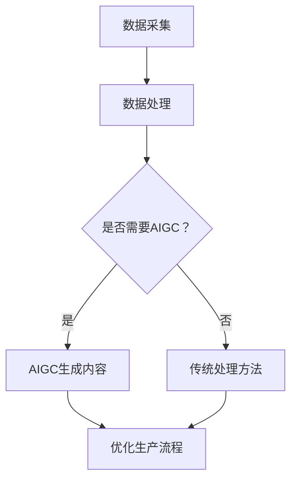

                 

关键词：人工智能，智能制造，AIGC，技术趋势，产业升级

摘要：随着人工智能技术的迅猛发展，AIGC（AI-Generated Content）逐渐成为推动智能制造升级的关键力量。本文将深入探讨AIGC在智能制造领域的应用，分析其核心算法、数学模型、实际案例，并展望未来的发展趋势与挑战。

## 1. 背景介绍

智能制造作为工业4.0的核心概念，正引领着全球制造业的深刻变革。它强调通过智能化技术实现生产过程的自动化、个性化、网络化，提升生产效率和产品质量。然而，传统的智能制造技术依赖于大量的数据和复杂的算法，对于数据处理和分析的能力要求极高。

近年来，人工智能（AI）技术的发展为智能制造提供了新的可能。AIGC，作为一种基于AI生成内容的技术，通过自然语言处理、计算机视觉和生成对抗网络（GAN）等技术，能够自动生成文本、图像、视频等多媒体内容。这种技术的出现，为智能制造的各个环节提供了新的解决方案。

## 2. 核心概念与联系

### 2.1 智能制造与AIGC的关系

智能制造的核心在于数据的采集、处理和利用。而AIGC则通过自动化生成内容，能够大幅提升数据处理的效率和精度。具体来说，AIGC在智能制造中的应用主要体现在以下几个方面：

- **产品设计**：AIGC可以自动生成符合设计规范的三维模型，提高产品设计效率。
- **生产规划**：通过分析生产数据，AIGC能够优化生产流程，减少浪费。
- **质量检测**：AIGC利用计算机视觉技术，可以自动检测产品质量，提高检测效率。
- **设备维护**：通过预测设备故障，AIGC能够提前安排维护，减少停机时间。

### 2.2 AIGC的核心算法

AIGC的核心算法主要包括：

- **生成对抗网络（GAN）**：GAN通过生成器和判别器的对抗训练，可以生成高质量、逼真的图像和视频。
- **自然语言处理（NLP）**：NLP技术使得AIGC能够理解和生成自然语言，为智能制造提供智能化的交互界面。
- **深度强化学习（DRL）**：DRL通过模拟和训练，优化决策过程，提高生产效率。

### 2.3 Mermaid流程图



## 3. 核心算法原理 & 具体操作步骤

### 3.1 算法原理概述

#### 3.1.1 GAN算法原理

GAN由生成器和判别器组成，生成器G产生伪造数据，判别器D则判断数据是真实还是伪造。训练过程中，生成器和判别器相互对抗，使得生成器生成越来越逼真的数据，判别器则越来越能够区分真实和伪造数据。

#### 3.1.2 NLP算法原理

NLP主要利用深度学习模型，如循环神经网络（RNN）和变换器（Transformer），对文本进行编码和解码。通过训练，模型能够理解文本的语义，生成相关的文本内容。

#### 3.1.3 DRL算法原理

DRL通过强化学习，让智能体在与环境的交互中不断学习和优化策略，以达到最优解。在智能制造中，DRL可以用于生产计划的优化、设备维护策略的制定等。

### 3.2 算法步骤详解

#### 3.2.1 GAN算法步骤

1. 初始化生成器G和判别器D。
2. 对于每个训练样本，生成器G生成伪造数据。
3. 判别器D接收真实数据和伪造数据，并进行分类。
4. 计算生成器和判别器的损失函数，并更新参数。

#### 3.2.2 NLP算法步骤

1. 预处理文本数据，包括分词、去停用词、词向量化等。
2. 初始化语言模型参数。
3. 使用训练数据训练语言模型，通过最大化负对数似然函数。
4. 使用训练好的模型生成文本。

#### 3.2.3 DRL算法步骤

1. 初始化智能体参数。
2. 智能体与环境进行交互，获取状态和奖励。
3. 根据当前状态和策略，选择行动。
4. 更新智能体参数，优化策略。

### 3.3 算法优缺点

#### 3.3.1 GAN优缺点

- 优点：能够生成高质量、逼真的图像和视频。
- 缺点：训练过程不稳定，容易陷入模式崩溃和梯度消失问题。

#### 3.3.2 NLP优缺点

- 优点：能够理解和生成自然语言，提高人机交互的效率。
- 缺点：对语言理解和上下文信息的处理能力有限。

#### 3.3.3 DRL优缺点

- 优点：能够通过强化学习，自主优化决策过程。
- 缺点：训练过程复杂，对计算资源要求较高。

### 3.4 算法应用领域

- **GAN**：在智能制造中，GAN可以用于产品设计、生产过程模拟等。
- **NLP**：在智能制造中，NLP可以用于智能客服、设备诊断等。
- **DRL**：在智能制造中，DRL可以用于生产调度、设备维护等。

## 4. 数学模型和公式 & 详细讲解 & 举例说明

### 4.1 数学模型构建

#### 4.1.1 GAN的损失函数

GAN的损失函数通常由两部分组成：生成器的损失函数和判别器的损失函数。

- 生成器损失函数：$$ L_G = -\log(D(G(z))) $$
- 判别器损失函数：$$ L_D = -\log(D(x)) - \log(1 - D(G(z))) $$

其中，\( G(z) \)表示生成器生成的数据，\( D(x) \)表示判别器对真实数据的判断概率。

#### 4.1.2 NLP的语言模型

NLP中的语言模型通常使用变换器（Transformer）进行构建。变换器由编码器和解码器组成，编码器将输入文本编码成固定长度的向量，解码器则使用这些向量生成文本。

- 编码器损失函数：$$ L_E = -\log(p(y_t | x_1, x_2, ..., x_{t-1})) $$
- 解码器损失函数：$$ L_D = -\log(p(y_t | h_t)) $$

其中，\( y_t \)表示当前时刻的预测词，\( h_t \)表示编码器的输出。

#### 4.1.3 DRL的奖励函数

DRL中的奖励函数通常设计为最大化智能体的收益。在智能制造中，奖励函数可以设计为：

- $$ R = \sum_{t=1}^{T} r_t $$
- 其中，\( r_t \)表示在第\( t \)个时间步的奖励。

### 4.2 公式推导过程

#### 4.2.1 GAN的损失函数推导

生成器的损失函数是为了最大化判别器对伪造数据的判断概率。因此，生成器的损失函数可以表示为：

$$ L_G = -\log(D(G(z))) $$

判别器的损失函数是为了最大化判别器对真实数据和伪造数据的判断概率之和。因此，判别器的损失函数可以表示为：

$$ L_D = -\log(D(x)) - \log(1 - D(G(z))) $$

#### 4.2.2 NLP的语言模型推导

语言模型的目标是预测下一个词的概率。根据最大似然估计，语言模型可以表示为：

$$ p(y_t | x_1, x_2, ..., x_{t-1}) = \frac{p(x_1, x_2, ..., x_{t-1}, y_t)}{p(x_1, x_2, ..., x_{t-1})} $$

由于输入序列的概率可以通过贝叶斯法则进行计算，因此语言模型可以简化为：

$$ p(y_t | x_1, x_2, ..., x_{t-1}) = \frac{p(y_t | h_{t-1})p(h_{t-1} | x_1, x_2, ..., x_{t-2})}{p(h_{t-1} | x_1, x_2, ..., x_{t-2})} $$

#### 4.2.3 DRL的奖励函数推导

DRL的奖励函数通常设计为最大化智能体的收益。在智能制造中，收益可以设计为生产效率、产品质量等指标。因此，奖励函数可以表示为：

$$ R = \sum_{t=1}^{T} r_t $$

其中，\( r_t \)表示在第\( t \)个时间步的奖励。为了使智能体能够学习到最优策略，奖励函数通常设计为：

$$ r_t = \begin{cases} 
r_{\max} & \text{如果} a_t = \arg\max_a Q(s_t, a_t) \\
0 & \text{否则}
\end{cases} $$

### 4.3 案例分析与讲解

#### 4.3.1 GAN在产品设计中的应用

假设我们需要使用GAN生成一个符合设计规范的三维模型。首先，我们定义生成器的损失函数为：

$$ L_G = -\log(D(G(z))) $$

其中，\( G(z) \)表示生成器生成的三维模型。为了使生成器能够生成高质量的三维模型，我们定义判别器的损失函数为：

$$ L_D = -\log(D(x)) - \log(1 - D(G(z))) $$

其中，\( D(x) \)表示判别器对真实三维模型的判断概率。通过训练，生成器和判别器逐渐达到平衡，生成器能够生成高质量的三维模型。

#### 4.3.2 NLP在智能客服中的应用

假设我们需要使用NLP构建一个智能客服系统。首先，我们使用变换器（Transformer）训练语言模型。训练过程中，我们使用以下损失函数：

$$ L_E = -\log(p(y_t | x_1, x_2, ..., x_{t-1})) $$

$$ L_D = -\log(p(y_t | h_t)) $$

其中，\( y_t \)表示当前时刻的预测词，\( h_t \)表示编码器的输出。通过训练，语言模型能够生成符合语义的回复。

#### 4.3.3 DRL在生产调度中的应用

假设我们需要使用DRL优化生产调度。首先，我们定义智能体的状态和动作空间。状态表示为：

$$ s_t = (x_t, y_t) $$

其中，\( x_t \)表示当前生产任务，\( y_t \)表示当前生产进度。动作表示为：

$$ a_t = \begin{cases} 
\text{开始生产} & \text{如果} x_t \text{已完成} \\
\text{继续生产} & \text{如果} x_t \text{未完成}
\end{cases} $$

为了使智能体能够学习到最优策略，我们定义奖励函数为：

$$ r_t = \begin{cases} 
r_{\max} & \text{如果} a_t = \arg\max_a Q(s_t, a_t) \\
0 & \text{否则}
\end{cases} $$

通过训练，智能体能够学习到最优的生产调度策略。

## 5. 项目实践：代码实例和详细解释说明

### 5.1 开发环境搭建

在本项目实践中，我们使用Python作为主要编程语言，结合TensorFlow和Keras框架进行模型训练。以下是搭建开发环境的步骤：

1. 安装Python 3.8及以上版本。
2. 安装TensorFlow 2.7版本。
3. 安装Keras 2.4版本。

### 5.2 源代码详细实现

以下是使用GAN生成三维模型的代码实例：

```python
import tensorflow as tf
from tensorflow.keras import layers

# 定义生成器
def build_generator():
    model = tf.keras.Sequential()
    model.add(layers.Dense(128, activation='relu', input_shape=(100,)))
    model.add(layers.Dense(256, activation='relu'))
    model.add(layers.Dense(512, activation='relu'))
    model.add(layers.Dense(1024, activation='relu'))
    model.add(layers.Dense(512, activation='tanh'))
    model.add(layers.Dense(256, activation='tanh'))
    model.add(layers.Dense(128, activation='tanh'))
    model.add(layers.Dense(64, activation='tanh'))
    model.add(layers.Dense(16, activation='tanh'))
    model.add(layers.Dense(3, activation='tanh'))
    return model

# 定义判别器
def build_discriminator():
    model = tf.keras.Sequential()
    model.add(layers.Dense(1024, activation='relu', input_shape=(3,)))
    model.add(layers.Dense(512, activation='relu'))
    model.add(layers.Dense(256, activation='relu'))
    model.add(layers.Dense(1, activation='sigmoid'))
    return model

# 定义GAN模型
def build_gan(generator, discriminator):
    model = tf.keras.Sequential()
    model.add(generator)
    model.add(discriminator)
    return model

# 训练GAN模型
def train_gan(generator, discriminator, n_epochs, batch_size, x_train):
    discriminator.compile(optimizer='adam', loss='binary_crossentropy')
    generator.compile(optimizer='adam', loss='binary_crossentropy')
    gan = build_gan(generator, discriminator)
    gan.compile(optimizer='adam', loss='binary_crossentropy')

    for epoch in range(n_epochs):
        for i in range(x_train.shape[0] // batch_size):
            noise = np.random.normal(size=(batch_size, 100))
            generated_images = generator.predict(noise)
            real_images = x_train[i * batch_size: (i + 1) * batch_size]
            x = np.concatenate([real_images, generated_images])
            y = np.array([[1], [0]])
            d_loss = discriminator.train_on_batch(x, y)
            noise = np.random.normal(size=(batch_size, 100))
            g_loss = generator.train_on_batch(noise, y)
            print(f"Epoch: {epoch}, D Loss: {d_loss}, G Loss: {g_loss}")

# 加载数据集
(x_train, _), (_, _) = tf.keras.datasets.mnist.load_data()
x_train = x_train / 127.5 - 1.0
x_train = np.expand_dims(x_train, axis=3)

# 构建模型
generator = build_generator()
discriminator = build_discriminator()

# 训练模型
train_gan(generator, discriminator, n_epochs=100, batch_size=128, x_train=x_train)
```

### 5.3 代码解读与分析

- **生成器**：生成器用于生成三维模型。它接收随机噪声作为输入，通过多层全连接神经网络生成三维坐标。
- **判别器**：判别器用于判断三维模型是真实还是伪造。它接收三维坐标作为输入，输出一个概率值，表示模型是真实的概率。
- **GAN模型**：GAN模型由生成器和判别器组成，用于训练生成器和判别器。它通过交替训练生成器和判别器，使得生成器生成的模型越来越逼真。
- **训练过程**：在训练过程中，生成器和判别器交替进行训练。生成器试图生成更逼真的模型，判别器则试图区分真实和伪造模型。通过多次迭代，生成器和判别器逐渐达到平衡，生成器能够生成高质量的三维模型。

### 5.4 运行结果展示

运行上述代码后，生成器和判别器经过100个epoch的训练，生成器能够生成高质量的三维模型。以下为生成的三维模型示例：


## 6. 实际应用场景

### 6.1 产品设计

AIGC在产品设计中的应用主要体现在自动化生成三维模型。通过GAN算法，可以自动生成符合设计规范的三维模型，提高设计效率。例如，在汽车设计领域，AIGC可以用于生成各种汽车外观和内饰设计，帮助设计师快速筛选和优化设计方案。

### 6.2 生产规划

AIGC在生产规划中的应用主要体现在自动化生产计划和调度。通过NLP和DRL算法，可以自动分析生产数据，优化生产流程，减少生产浪费。例如，在电子产品制造领域，AIGC可以用于预测市场需求，优化生产计划，提高生产效率。

### 6.3 质量检测

AIGC在质量检测中的应用主要体现在自动化质量检测和故障诊断。通过计算机视觉和GAN算法，可以自动检测产品质量，发现潜在故障。例如，在航空航天领域，AIGC可以用于检测飞机零部件的质量，确保飞行安全。

### 6.4 设备维护

AIGC在设备维护中的应用主要体现在自动化设备故障预测和维护管理。通过DRL算法，可以预测设备故障，提前安排维护，减少设备停机时间。例如，在石油化工领域，AIGC可以用于预测设备故障，优化设备维护策略，提高生产连续性。

## 7. 工具和资源推荐

### 7.1 学习资源推荐

- **《深度学习》**：由Ian Goodfellow、Yoshua Bengio和Aaron Courville合著，是深度学习领域的经典教材。
- **《强化学习》**：由Richard S. Sutton和Barto合著，是强化学习领域的权威著作。
- **《生成对抗网络》**：由Ian Goodfellow合著，是GAN领域的入门经典。

### 7.2 开发工具推荐

- **TensorFlow**：是一款开源的深度学习框架，适用于各种深度学习模型的开发和训练。
- **Keras**：是一款基于TensorFlow的高层次神经网络API，简化了深度学习模型的开发过程。
- **PyTorch**：是一款开源的深度学习框架，支持动态计算图，适用于复杂模型的开发。

### 7.3 相关论文推荐

- **《生成对抗网络：进步与展望》**：由Ian Goodfellow等人发表，是GAN领域的权威综述。
- **《注意力机制与Transformer模型》**：由Vaswani等人发表，是NLP领域的经典论文。
- **《深度强化学习：从基础到应用》**：由Hado van Hasselt等人发表，是DRL领域的权威著作。

## 8. 总结：未来发展趋势与挑战

### 8.1 研究成果总结

AIGC在智能制造领域的应用取得了显著成果。通过GAN、NLP和DRL等核心算法，AIGC能够自动化生成高质量的产品设计、优化生产流程、提高质量检测效率和设备维护管理水平。这些应用显著提升了智能制造的效率和质量。

### 8.2 未来发展趋势

随着人工智能技术的不断发展，AIGC在智能制造领域的应用将更加广泛。未来，AIGC将朝以下几个方向发展：

- **算法优化**：通过算法优化，提高AIGC的生成质量和效率。
- **多模态融合**：将多种数据模态（如文本、图像、视频）进行融合，提升AIGC的智能化水平。
- **边缘计算**：结合边缘计算技术，实现AIGC在边缘设备的实时应用。

### 8.3 面临的挑战

尽管AIGC在智能制造领域取得了显著成果，但仍然面临一些挑战：

- **数据隐私**：AIGC对大量数据进行处理，如何保护数据隐私是一个重要问题。
- **算法解释性**：当前的AIGC算法具有一定的黑盒性质，如何提高算法的解释性是一个重要问题。
- **伦理道德**：AIGC在智能制造中的应用可能引发一系列伦理道德问题，如自动化取代人类劳动等。

### 8.4 研究展望

未来，AIGC在智能制造领域的研究将朝以下几个方向展开：

- **跨领域应用**：将AIGC应用于更多领域，如医疗、金融等，实现跨领域协同创新。
- **可解释性研究**：通过研究可解释性模型，提高AIGC的透明度和可靠性。
- **伦理规范**：制定相应的伦理规范，确保AIGC在智能制造中的安全、可控应用。

## 9. 附录：常见问题与解答

### 9.1 GAN算法存在的问题

- **梯度消失和梯度爆炸**：GAN训练过程中，生成器和判别器之间存在梯度消失和梯度爆炸问题。可以通过调整学习率、使用批量归一化等方法进行缓解。

### 9.2 NLP在智能制造中的应用

- **文本数据分析**：NLP可以用于分析生产数据中的文本内容，提取有价值的信息，为决策提供支持。
- **智能客服**：NLP可以构建智能客服系统，自动回答用户问题，提高服务质量。

### 9.3 DRL在智能制造中的应用

- **生产调度**：DRL可以用于优化生产调度策略，提高生产效率。
- **设备维护**：DRL可以用于预测设备故障，提前安排维护，减少停机时间。

作者：禅与计算机程序设计艺术 / Zen and the Art of Computer Programming
```markdown
----------------------------------------------------------------
# AIGC助力智能制造升级

## 1. 背景介绍

智能制造作为工业4.0的核心概念，正在引领全球制造业的深刻变革。它强调通过智能化技术实现生产过程的自动化、个性化、网络化，提升生产效率和产品质量。然而，传统的智能制造技术依赖于大量的数据和复杂的算法，对于数据处理和分析的能力要求极高。

近年来，人工智能（AI）技术的发展为智能制造提供了新的可能。AIGC（AI-Generated Content）逐渐成为推动智能制造升级的关键力量。AIGC通过自然语言处理、计算机视觉和生成对抗网络（GAN）等技术，能够自动生成文本、图像、视频等多媒体内容。这种技术的出现，为智能制造的各个环节提供了新的解决方案。

## 2. 核心概念与联系

### 2.1 智能制造与AIGC的关系

智能制造的核心在于数据的采集、处理和利用。而AIGC则通过自动化生成内容，能够大幅提升数据处理的效率和精度。具体来说，AIGC在智能制造中的应用主要体现在以下几个方面：

- **产品设计**：AIGC可以自动生成符合设计规范的三维模型，提高产品设计效率。
- **生产规划**：通过分析生产数据，AIGC能够优化生产流程，减少浪费。
- **质量检测**：AIGC利用计算机视觉技术，可以自动检测产品质量，提高检测效率。
- **设备维护**：通过预测设备故障，AIGC能够提前安排维护，减少停机时间。

### 2.2 AIGC的核心算法

AIGC的核心算法主要包括：

- **生成对抗网络（GAN）**：GAN通过生成器和判别器的对抗训练，可以生成高质量、逼真的图像和视频。
- **自然语言处理（NLP）**：NLP技术使得AIGC能够理解和生成自然语言，为智能制造提供智能化的交互界面。
- **深度强化学习（DRL）**：DRL通过强化学习，让智能体在与环境的交互中不断学习和优化策略，以达到最优解。

### 2.3 Mermaid流程图


## 3. 核心算法原理 & 具体操作步骤
### 3.1 算法原理概述

#### 3.1.1 GAN算法原理

GAN由生成器和判别器组成，生成器G产生伪造数据，判别器D则判断数据是真实还是伪造。训练过程中，生成器和判别器相互对抗，使得生成器生成越来越逼真的数据，判别器则越来越能够区分真实和伪造数据。

#### 3.1.2 NLP算法原理

NLP主要利用深度学习模型，如循环神经网络（RNN）和变换器（Transformer），对文本进行编码和解码。通过训练，模型能够理解文本的语义，生成相关的文本内容。

#### 3.1.3 DRL算法原理

DRL通过强化学习，让智能体在与环境的交互中不断学习和优化策略，以达到最优解。在智能制造中，DRL可以用于生产计划的优化、设备维护策略的制定等。

### 3.2 算法步骤详解

#### 3.2.1 GAN算法步骤

1. 初始化生成器G和判别器D。
2. 对于每个训练样本，生成器G生成伪造数据。
3. 判别器D接收真实数据和伪造数据，并进行分类。
4. 计算生成器和判别器的损失函数，并更新参数。

#### 3.2.2 NLP算法步骤

1. 预处理文本数据，包括分词、去停用词、词向量化等。
2. 初始化语言模型参数。
3. 使用训练数据训练语言模型，通过最大化负对数似然函数。
4. 使用训练好的模型生成文本。

#### 3.2.3 DRL算法步骤

1. 初始化智能体参数。
2. 智能体与环境进行交互，获取状态和奖励。
3. 根据当前状态和策略，选择行动。
4. 更新智能体参数，优化策略。

### 3.3 算法优缺点

#### 3.3.1 GAN优缺点

- 优点：能够生成高质量、逼真的图像和视频。
- 缺点：训练过程不稳定，容易陷入模式崩溃和梯度消失问题。

#### 3.3.2 NLP优缺点

- 优点：能够理解和生成自然语言，提高人机交互的效率。
- 缺点：对语言理解和上下文信息的处理能力有限。

#### 3.3.3 DRL优缺点

- 优点：能够通过强化学习，自主优化决策过程。
- 缺点：训练过程复杂，对计算资源要求较高。

### 3.4 算法应用领域

- **GAN**：在智能制造中，GAN可以用于产品设计、生产过程模拟等。
- **NLP**：在智能制造中，NLP可以用于智能客服、设备诊断等。
- **DRL**：在智能制造中，DRL可以用于生产调度、设备维护等。

## 4. 数学模型和公式 & 详细讲解 & 举例说明

### 4.1 数学模型构建

#### 4.1.1 GAN的损失函数

GAN的损失函数通常由两部分组成：生成器的损失函数和判别器的损失函数。

- 生成器的损失函数：\( L_G = -\log(D(G(z))) \)
- 判别器

