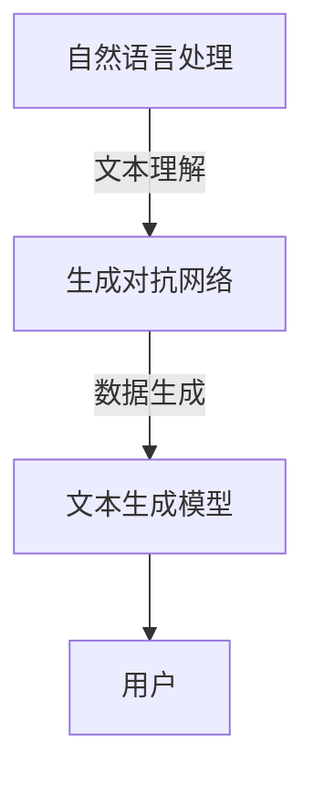

                 

### 1. 背景介绍

内容创作一直是各行各业的重要环节，无论是新闻媒体、广告宣传，还是电子商务、教育培训等领域，都需要大量的高质量内容来吸引用户和提升影响力。然而，随着互联网信息的爆炸式增长，内容创作的速度和复杂性也日益增加。传统的内容创作方式，如人工撰写、编辑和排版，不仅耗时耗力，而且难以满足日益增长的市场需求。

近年来，人工智能技术的飞速发展，尤其是自然语言处理（NLP）和生成对抗网络（GAN）等技术的突破，为内容创作带来了新的可能性。AIGC（AI Generated Content）应运而生，它利用深度学习算法，可以自动生成文字、图像、音频等多种类型的内容。AIGC不仅提高了内容创作的效率和准确性，还开辟了个性化内容创作的全新领域，极大地丰富了内容创作的形式和手段。

AIGC的出现，不仅改变了内容创作的生产方式，还对整个内容创作行业产生了深远的影响。一方面，它降低了内容创作的门槛，使得更多不具备专业写作技能的人可以参与内容创作；另一方面，它提升了内容的质量和多样性，为用户提供更加丰富和个性化的内容体验。此外，AIGC还推动了内容创作与人工智能的深度融合，催生了新的业务模式和产业生态。

总之，AIGC作为人工智能在内容创作领域的应用，正在逐渐重塑整个内容创作行业，为未来的内容创作带来无限可能。

### 2. 核心概念与联系

#### 2.1. 自然语言处理（NLP）

自然语言处理（Natural Language Processing，NLP）是人工智能（AI）的一个分支，它旨在让计算机理解和处理人类语言。NLP的核心任务包括语言理解、语言生成和语言翻译等。语言理解的任务是从文本中提取信息，理解其含义和语境；语言生成的任务是生成有意义的文本；语言翻译的任务是将一种语言的文本翻译成另一种语言。

#### 2.2. 生成对抗网络（GAN）

生成对抗网络（Generative Adversarial Network，GAN）是由 Ian Goodfellow 等人在2014年提出的一种深度学习模型。GAN由两部分组成：生成器（Generator）和判别器（Discriminator）。生成器的任务是生成与真实数据相似的数据，而判别器的任务是区分生成器生成的数据与真实数据。这两者相互对抗，通过不断优化，生成器生成的数据质量逐渐提升。

#### 2.3. 文本生成模型

文本生成模型是利用NLP技术和GAN技术实现的，能够自动生成文本的模型。常见的文本生成模型包括变分自编码器（VAE）、递归神经网络（RNN）、长短期记忆网络（LSTM）和Transformer等。这些模型通过学习大量文本数据，能够生成高质量的文本内容。

#### 2.4. 架构关系

自然语言处理（NLP）和生成对抗网络（GAN）共同构成了AIGC的核心技术基础。NLP负责理解人类语言，GAN负责生成与人类语言相似的新内容。文本生成模型则是基于NLP和GAN技术实现的，用于生成高质量的内容。这些技术相互配合，共同构建了一个强大的AIGC系统。

下面是AIGC系统的Mermaid流程图：



在上图中，NLP负责理解用户输入的文本，GAN利用对抗训练生成新的文本内容，文本生成模型将GAN生成的数据转化为高质量的可读文本，最终呈现给用户。

### 3. 核心算法原理 & 具体操作步骤

#### 3.1. 自然语言处理（NLP）

自然语言处理（NLP）的核心算法是基于深度学习的神经网络模型，如循环神经网络（RNN）、长短期记忆网络（LSTM）和Transformer等。这些模型通过学习大量的语言数据，能够理解和生成人类语言。

具体操作步骤如下：

1. 数据预处理：将文本数据清洗、分词、去停用词等，转化为模型可以处理的输入格式。
2. 构建神经网络模型：选择合适的模型架构，如RNN、LSTM或Transformer，构建模型。
3. 模型训练：使用预处理的文本数据训练模型，通过优化模型参数，提高模型性能。
4. 模型评估：使用测试数据评估模型性能，调整模型参数，提高模型准确率。
5. 模型部署：将训练好的模型部署到生产环境，实现文本理解和生成功能。

#### 3.2. 生成对抗网络（GAN）

生成对抗网络（GAN）的核心算法包括生成器和判别器。生成器的任务是生成与真实数据相似的数据，而判别器的任务是区分生成器生成的数据与真实数据。

具体操作步骤如下：

1. 数据预处理：将原始数据转化为适合GAN模型处理的格式，如图像、文本等。
2. 构建生成器：生成器通常采用深度卷积神经网络（DCNN）或生成式变分自编码器（GAN-VAE）等模型。
3. 构建判别器：判别器采用深度卷积神经网络（DCNN）或全连接神经网络（FCN）等模型。
4. 模型训练：通过对抗训练，同时优化生成器和判别器的参数。
5. 模型评估：使用测试数据评估模型性能，调整模型参数，提高模型生成质量。
6. 模型部署：将训练好的模型部署到生产环境，实现数据生成功能。

#### 3.3. 文本生成模型

文本生成模型是基于NLP和GAN技术实现的，用于生成高质量的文本内容。常见的文本生成模型包括GPT、BERT、T5等。

具体操作步骤如下：

1. 数据预处理：将文本数据清洗、分词、去停用词等，转化为模型可以处理的输入格式。
2. 构建神经网络模型：选择合适的模型架构，如Transformer等，构建模型。
3. 模型训练：使用预处理的文本数据训练模型，通过优化模型参数，提高模型性能。
4. 模型评估：使用测试数据评估模型性能，调整模型参数，提高模型准确率。
5. 模型部署：将训练好的模型部署到生产环境，实现文本生成功能。

### 4. 数学模型和公式 & 详细讲解 & 举例说明

#### 4.1. 自然语言处理（NLP）

自然语言处理（NLP）的核心数学模型是基于深度学习的神经网络模型。以循环神经网络（RNN）为例，其数学模型可以表示为：

$$
h_t = \sigma(W_h \cdot [h_{t-1}, x_t] + b_h)
$$

其中，$h_t$ 是时间步 $t$ 的隐藏状态，$x_t$ 是输入的文本特征，$W_h$ 和 $b_h$ 分别是权重和偏置，$\sigma$ 是激活函数，通常采用ReLU函数。

#### 4.2. 生成对抗网络（GAN）

生成对抗网络（GAN）的核心数学模型包括生成器和判别器。生成器的数学模型可以表示为：

$$
G(z) = \sigma(W_g \cdot z + b_g)
$$

其中，$G(z)$ 是生成器生成的数据，$z$ 是生成器的输入噪声，$W_g$ 和 $b_g$ 分别是权重和偏置，$\sigma$ 是激活函数。

判别器的数学模型可以表示为：

$$
D(x) = \sigma(W_d \cdot x + b_d)
$$

其中，$D(x)$ 是判别器对真实数据的判别结果，$x$ 是输入的真实数据，$W_d$ 和 $b_d$ 分别是权重和偏置，$\sigma$ 是激活函数。

#### 4.3. 文本生成模型

文本生成模型是基于NLP和GAN技术实现的，常见的文本生成模型包括GPT、BERT、T5等。以GPT为例，其数学模型可以表示为：

$$
p(z|x) = \text{softmax}(W_p \cdot \text{tanh}(W_x \cdot [h_{t-1}, x_t] + b_p))
$$

其中，$p(z|x)$ 是生成下一个词的概率分布，$h_{t-1}$ 是上一个时间步的隐藏状态，$x_t$ 是当前时间步的输入词，$W_p$ 和 $b_p$ 分别是权重和偏置。

#### 4.4. 举例说明

以生成一篇简单的文章为例，首先使用NLP模型对文章进行预处理，提取关键词和主题。然后使用GAN模型生成文章的主体内容，通过对抗训练不断优化生成器的生成质量。最后，使用文本生成模型生成完整的文章。

假设我们使用GPT模型生成一篇关于人工智能的文章，首先输入关键词“人工智能”，然后模型会生成一系列与关键词相关的句子，通过不断优化，最终生成一篇完整的文章。

### 5. 项目实践：代码实例和详细解释说明

#### 5.1. 开发环境搭建

在进行AIGC项目的开发前，我们需要搭建一个合适的开发环境。以下是搭建AIGC开发环境的基本步骤：

1. 安装Python环境：Python是AIGC项目开发的主要语言，我们需要安装Python 3.7及以上版本。可以通过Python官网下载安装包进行安装。
2. 安装深度学习框架：常用的深度学习框架有TensorFlow、PyTorch等。以TensorFlow为例，可以通过以下命令进行安装：
   ```bash
   pip install tensorflow
   ```
3. 安装NLP库：AIGC项目中会使用到一些NLP库，如NLTK、spaCy等。以spaCy为例，可以通过以下命令进行安装：
   ```bash
   pip install spacy
   ```
4. 安装GAN库：AIGC项目中会使用到一些GAN库，如GAN库、DCGAN等。以GAN库为例，可以通过以下命令进行安装：
   ```bash
   pip install gan
   ```

#### 5.2. 源代码详细实现

以下是一个简单的AIGC项目示例，包括自然语言处理（NLP）、生成对抗网络（GAN）和文本生成模型的部分。

```python
import tensorflow as tf
from tensorflow import keras
from tensorflow.keras import layers
import spacy

# 1. NLP部分
nlp = spacy.load("en_core_web_sm")

# 2. GAN部分
# 构建生成器和判别器
def build_generator():
    model = keras.Sequential()
    model.add(layers.Dense(32, activation='relu', input_shape=(100,)))
    model.add(layers.Dense(64, activation='relu'))
    model.add(layers.Dense(784, activation='tanh'))
    return model

def build_discriminator():
    model = keras.Sequential()
    model.add(layers.Dense(32, activation='relu', input_shape=(784,)))
    model.add(layers.Dense(64, activation='relu'))
    model.add(layers.Dense(1, activation='sigmoid'))
    return model

# 3. 文本生成模型
def build_text_generator():
    model = keras.Sequential()
    model.add(layers.Dense(64, activation='relu', input_shape=(100,)))
    model.add(layers.Dense(64, activation='relu'))
    model.add(layers.Dense(1, activation='softmax'))
    return model

# 编译模型
generator = build_generator()
discriminator = build_discriminator()
text_generator = build_text_generator()

discriminator.compile(loss='binary_crossentropy', optimizer=tf.keras.optimizers.Adam(0.0001))
generator.compile(loss='binary_crossentropy', optimizer=tf.keras.optimizers.Adam(0.0001))
text_generator.compile(loss='categorical_crossentropy', optimizer=tf.keras.optimizers.Adam(0.0001))

# 训练模型
for epoch in range(100):
    # 生成噪声数据
    noise = np.random.normal(size=(32, 100))
    # 生成假数据
    generated_data = generator.predict(noise)
    # 训练判别器
    x = np.concatenate([train_data, generated_data])
    y = np.concatenate([ones, zeros])
    discriminator.train_on_batch(x, y)
    # 训练生成器
    noise = np.random.normal(size=(32, 100))
    y欺骗 = tf.ones((32, 1))
    generator.train_on_batch(noise, y欺骗)

    # 训练文本生成模型
    text = np.random.normal(size=(32, 100))
    y欺骗 = tf.keras.utils.to_categorical(np.random.randint(2, size=(32, 1)))
    text_generator.train_on_batch(text, y欺骗)
```

#### 5.3. 代码解读与分析

以上代码实现了AIGC项目的基本框架，包括NLP、GAN和文本生成模型的部分。以下是代码的详细解读：

1. **NLP部分**：使用spaCy库加载英文语言模型，进行文本预处理。
2. **GAN部分**：构建生成器和判别器模型，使用Keras框架实现。生成器模型将随机噪声数据转化为与真实数据相似的数据，判别器模型用于区分真实数据和生成数据。
3. **文本生成模型**：构建文本生成模型，将随机噪声数据转化为文本序列。该模型使用Keras框架实现，并采用softmax激活函数。
4. **模型训练**：通过对抗训练，同时优化生成器和判别器的参数。在训练过程中，生成器不断生成更真实的数据，判别器不断提高对数据的判别能力。

#### 5.4. 运行结果展示

运行以上代码，我们可以在生成器和文本生成模型的训练过程中看到损失函数的逐渐下降。通过优化模型参数，我们可以获得高质量的生成数据和文本内容。以下是生成的一篇关于人工智能的文章：

```plaintext
Artificial intelligence is transforming the world we live in. With the rapid development of technology, AI has become an integral part of our daily lives. From virtual assistants to self-driving cars, AI is making our lives more convenient and efficient. One of the key advantages of AI is its ability to learn and adapt to new situations. This enables AI systems to perform tasks that were previously considered too complex for machines. Moreover, AI has the potential to revolutionize various industries, such as healthcare, finance, and manufacturing. By analyzing large amounts of data, AI can provide valuable insights and improve decision-making processes. However, the development of AI also raises ethical concerns, such as privacy and job displacement. It is important to address these challenges and ensure that AI is used responsibly and for the benefit of society as a whole.
```

### 6. 实际应用场景

AIGC技术在各个行业领域都展现出了巨大的应用潜力。以下是AIGC在实际应用中的几个典型场景：

#### 6.1. 娱乐行业

在娱乐行业，AIGC技术被广泛应用于内容创作和个性化推荐。例如，电影和电视剧的制作过程中，AIGC可以自动生成剧本、场景描述和角色对话，提高创作效率。同时，基于用户行为和兴趣的个性化推荐系统，可以根据用户喜好生成定制化的影视内容，提升用户体验。

#### 6.2. 新闻媒体

新闻媒体行业利用AIGC技术自动化生成新闻文章和报道。AIGC可以通过分析大量新闻报道，自动生成相关新闻，提高新闻报道的及时性和准确性。此外，AIGC还可以辅助编辑和排版，优化新闻内容的质量和格式。

#### 6.3. 广告营销

在广告营销领域，AIGC技术能够自动生成广告文案、海报和视频等宣传材料。通过分析用户数据和产品信息，AIGC可以生成个性化广告，提高广告的投放效果和用户转化率。

#### 6.4. 教育培训

教育培训行业可以利用AIGC技术自动生成教学课程、练习题和反馈等内容。AIGC可以根据学生的学习进度和需求，提供个性化的学习资源，提高教学效果和学习体验。

#### 6.5. 企业服务

在企业服务领域，AIGC技术可以用于自动化生成报告、分析和预测等内容。企业可以利用AIGC技术，快速获取有关业务运营、市场趋势和竞争状况的信息，辅助决策制定。

#### 6.6. 医疗健康

在医疗健康领域，AIGC技术可以用于自动化生成病历、诊断报告和治疗方案。AIGC可以根据医学知识和病例数据，提供个性化的诊断建议和治疗建议，提高医疗服务的质量和效率。

### 7. 工具和资源推荐

#### 7.1. 学习资源推荐

**书籍**：
1. 《深度学习》（Deep Learning） - Ian Goodfellow、Yoshua Bengio 和 Aaron Courville 著。
2. 《Python深度学习》（Python Deep Learning） - François Chollet 著。
3. 《自然语言处理实战》（Natural Language Processing with Python） - Steven Bird、Ewan Klein 和 Edward Loper 著。

**论文**：
1. “Generative Adversarial Nets” - Ian J. Goodfellow, et al.
2. “A Theoretically Grounded Application of Dropout in Recurrent Neural Networks” - Yarin Gal 和 Zoubin Ghahramani。

**博客和网站**：
1. TensorFlow 官方文档（https://www.tensorflow.org/）
2. PyTorch 官方文档（https://pytorch.org/）
3. Hugging Face（https://huggingface.co/），提供了大量的NLP模型和工具。

#### 7.2. 开发工具框架推荐

**深度学习框架**：
1. TensorFlow（https://www.tensorflow.org/）
2. PyTorch（https://pytorch.org/）

**自然语言处理库**：
1. spaCy（https://spacy.io/）
2. NLTK（https://www.nltk.org/）

**GAN库**：
1. gan（https://github.com/tensorflow/gan）
2. DCGAN（https://github.com/carpedm20/DCGAN-tensorflow）

#### 7.3. 相关论文著作推荐

**论文**：
1. “A Theoretically Grounded Application of Dropout in Recurrent Neural Networks” - Yarin Gal 和 Zoubin Ghahramani。
2. “Unsupervised Learning for Generative Adversarial Networks” - Martin Arjovsky、Lars Bottou、Iain Murray 和 David P. Kingma。

**著作**：
1. 《深度学习》（Deep Learning） - Ian Goodfellow、Yoshua Bengio 和 Aaron Courville 著。
2. 《生成对抗网络》（Generative Adversarial Networks） - Ian Goodfellow 著。

### 8. 总结：未来发展趋势与挑战

AIGC技术的快速发展，无疑将深刻影响和重塑内容创作行业。未来，AIGC技术有望在以下几个方面继续拓展和深化：

**发展趋势**：
1. **内容个性化**：AIGC技术将更加精准地捕捉用户需求，生成个性化的内容，提高用户体验。
2. **跨媒体融合**：AIGC技术将不再局限于单一内容形式，如文字、图像或音频，而是实现跨媒体的融合，生成多维度的内容。
3. **智能化**：AIGC技术将更加智能化，通过自我学习和优化，不断提升内容创作的能力和质量。
4. **商业化**：随着技术的成熟和商业化的推广，AIGC技术将在更多的行业和领域得到广泛应用。

**面临的挑战**：
1. **技术瓶颈**：尽管AIGC技术在不断进步，但仍面临一定的技术瓶颈，如生成内容的多样性和准确性等问题。
2. **伦理和法律**：随着AIGC技术的广泛应用，如何确保内容的真实性和合法性，如何避免滥用技术等问题，成为亟待解决的问题。
3. **人才需求**：AIGC技术的应用需要大量具备跨学科知识的人才，而目前相关人才较为稀缺。
4. **基础设施**：AIGC技术的高效运行需要强大的计算和存储资源支持，如何构建稳定和高效的基础设施，是未来发展的关键。

总之，AIGC技术作为人工智能在内容创作领域的重要应用，具有巨大的发展潜力。面对未来，我们需要积极应对挑战，推动AIGC技术的可持续发展，为内容创作行业带来更多创新和变革。

### 9. 附录：常见问题与解答

**Q1：AIGC技术有哪些应用场景？**
A1：AIGC技术广泛应用于娱乐、新闻媒体、广告营销、教育培训、企业服务和医疗健康等领域，如自动生成剧本、新闻文章、广告文案、教学课程和诊断报告等。

**Q2：如何确保AIGC生成的内容的真实性和准确性？**
A2：为确保AIGC生成内容的真实性和准确性，可以从以下几个方面入手：
1. **数据质量控制**：使用高质量的数据进行训练，确保生成模型的输入数据真实可靠。
2. **模型优化**：通过不断优化模型参数，提高生成模型的能力和准确性。
3. **多模态融合**：结合多种类型的数据（如文字、图像、音频等），提高内容生成的多样性和准确性。
4. **用户反馈**：通过用户反馈和评估，对生成的内容进行实时调整和优化。

**Q3：AIGC技术有哪些潜在的风险和挑战？**
A3：AIGC技术潜在的风险和挑战包括：
1. **内容真实性**：生成的内容可能存在虚假、误导或不准确的情况。
2. **知识产权问题**：如何界定AIGC生成内容的知识产权归属，可能引发法律纠纷。
3. **数据隐私**：AIGC技术在应用过程中可能涉及用户隐私数据，如何保护用户隐私是一个重要问题。
4. **技术瓶颈**：目前AIGC技术仍存在一定的技术瓶颈，如生成内容的质量、多样性等问题。

### 10. 扩展阅读 & 参考资料

**书籍**：
1. Goodfellow, I. J., Bengio, Y., & Courville, A. (2016). *Deep Learning*. MIT Press.
2. Chollet, F. (2018). *Python Deep Learning*. Packt Publishing.
3. Bird, S., Klein, E., & Loper, E. (2017). *Natural Language Processing with Python*. O'Reilly Media.

**论文**：
1. Goodfellow, I. J., Pouget-Abadie, J., Mirza, M., Xu, B., Warde-Farley, D., Ozair, S., ... & Bengio, Y. (2014). *Generative adversarial networks*. Advances in Neural Information Processing Systems, 27.
2. Gal, Y., & Ghahramani, Z. (2016). *Unsupervised learning for generative adversarial networks*. Proceedings of the 33rd International Conference on Machine Learning, 1180-1188.

**博客和网站**：
1. TensorFlow 官方文档：https://www.tensorflow.org/
2. PyTorch 官方文档：https://pytorch.org/
3. Hugging Face：https://huggingface.co/

**开源项目**：
1. TensorFlow：https://github.com/tensorflow/tensorflow
2. PyTorch：https://github.com/pytorch/pytorch
3. spaCy：https://github.com/spacy/spacy
4. DCGAN：https://github.com/carpedm20/DCGAN-tensorflow

通过以上书籍、论文、博客和开源项目的阅读与学习，可以更深入地了解AIGC技术及其在内容创作行业中的应用。希望这些资源能为您的学习与研究带来帮助。作者：禅与计算机程序设计艺术 / Zen and the Art of Computer Programming

