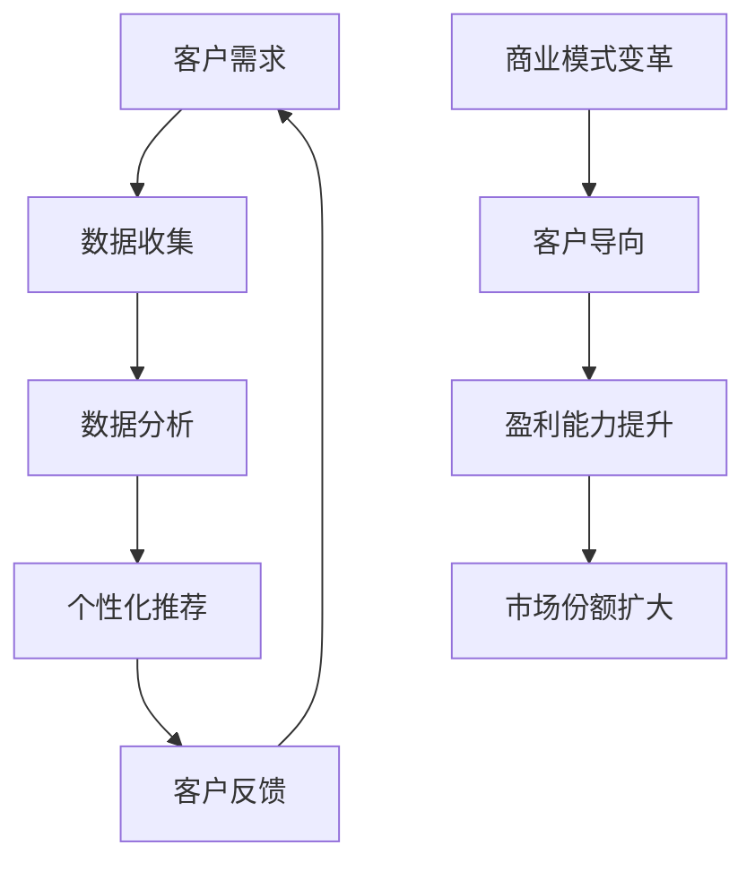

                 

关键词：人工智能、定制化服务、商业模式、商业应用、技术落地

摘要：本文深入探讨了人工智能在定制化服务领域的应用，从商业模式的变革、技术实现、数学模型到实际案例，全面分析了AI一次性解决方案的商业潜力。文章旨在为企业和创业者提供有价值的参考，助力他们在AI时代抓住商机，实现商业价值最大化。

## 1. 背景介绍

随着人工智能（AI）技术的飞速发展，越来越多的行业开始尝试将AI技术与业务流程结合，以提升效率和创新能力。然而，传统的一刀切解决方案已经无法满足消费者日益多样化和个性化的需求。定制化服务应运而生，成为企业提升竞争力的重要手段。

定制化服务是指根据客户的具体需求提供个性化的产品或服务，满足消费者独特的需求和偏好。随着大数据、云计算和机器学习技术的成熟，AI技术在定制化服务中的应用逐渐深入，为各行各业带来了全新的商业模式。

本文将探讨AI一次性解决方案在定制化服务中的具体应用，包括核心概念、算法原理、数学模型、项目实践和未来展望。希望通过本文的分享，能够为读者提供有益的启示和实用的指导。

## 2. 核心概念与联系

### 2.1 定制化服务的定义

定制化服务是一种以客户为中心的服务模式，通过精准的数据分析和技术手段，为客户提供个性化的产品或服务。与传统的一刀切服务相比，定制化服务更加关注客户的需求和体验，旨在提高客户满意度和忠诚度。

### 2.2 人工智能在定制化服务中的作用

人工智能技术在定制化服务中发挥着关键作用。首先，通过数据分析和挖掘，AI可以帮助企业了解客户的喜好和行为习惯，从而实现精准营销。其次，基于机器学习的算法可以自动调整和优化服务流程，提高服务效率和质量。最后，AI技术还可以实现智能化客服，提供24/7无缝服务体验。

### 2.3 商业模式变革

AI技术的引入，使得定制化服务成为可能，进而推动了商业模式的变革。从传统的产品导向模式，向客户导向模式转变。企业通过提供个性化服务，实现客户价值的最大化，从而提高市场份额和盈利能力。

### 2.4 Mermaid 流程图



## 3. 核心算法原理 & 具体操作步骤

### 3.1 算法原理概述

AI一次性解决方案在定制化服务中的应用，主要基于以下核心算法：

1. **客户行为分析**：通过分析客户的购买历史、浏览记录、社交互动等数据，挖掘客户的偏好和需求。
2. **个性化推荐**：基于客户的偏好和需求，利用协同过滤、矩阵分解等算法，生成个性化的推荐结果。
3. **服务流程优化**：通过机器学习算法，对服务流程进行实时监控和优化，提高服务效率。
4. **智能化客服**：利用自然语言处理（NLP）和语音识别技术，实现智能化的客服系统，提供24/7无缝服务。

### 3.2 算法步骤详解

1. **数据收集与处理**：首先，收集客户的各类数据，包括购买记录、浏览记录、社交互动等。然后，对数据进行清洗、去重、归一化等预处理操作，确保数据质量。
2. **特征工程**：根据业务需求，提取数据中的关键特征，如用户年龄、性别、消费金额等。特征工程的质量直接影响到后续算法的性能。
3. **算法选择与训练**：选择合适的算法，如协同过滤、矩阵分解、决策树等，对数据进行训练。算法的选择和训练效果直接决定了个性化推荐和服务流程优化的效果。
4. **模型评估与优化**：通过交叉验证、A/B测试等方法，评估模型的性能，并对模型进行优化调整。
5. **部署与应用**：将训练好的模型部署到生产环境中，实现实时个性化推荐和服务流程优化。

### 3.3 算法优缺点

1. **优点**：
   - 高度个性化：能够根据客户的具体需求和偏好提供个性化的推荐和服务。
   - 实时性：算法能够实时监控和调整服务流程，提高服务效率。
   - 智能化：智能客服系统能够自动处理客户咨询，提高客户满意度。
2. **缺点**：
   - 数据依赖性：算法的性能依赖于数据的质量和数量，数据缺失或噪声可能导致推荐和服务效果不佳。
   - 隐私风险：收集和分析客户数据可能涉及隐私问题，需要确保数据安全和合规性。

### 3.4 算法应用领域

AI一次性解决方案在定制化服务中的应用非常广泛，包括但不限于以下领域：

1. **电子商务**：通过个性化推荐，提高用户购物体验，提升销售额。
2. **金融领域**：根据客户的风险偏好和投资目标，提供个性化的理财产品推荐。
3. **医疗健康**：根据患者的病史和检查结果，提供个性化的治疗方案和建议。
4. **餐饮行业**：根据客户的口味偏好，推荐菜品和套餐，提高客户满意度。
5. **旅游行业**：根据客户的旅行偏好和预算，提供个性化的行程规划和推荐。

## 4. 数学模型和公式 & 详细讲解 & 举例说明

### 4.1 数学模型构建

在定制化服务中，常用的数学模型包括协同过滤、矩阵分解、决策树等。以下是这些模型的构建过程：

1. **协同过滤**：
   协同过滤是一种基于用户行为的推荐算法。其核心思想是，通过分析用户的历史行为，找到与目标用户相似的用户，并推荐这些用户喜欢的商品。

   假设有 \( m \) 个用户和 \( n \) 个商品，用户-商品评分矩阵为 \( R \)，其中 \( R_{ij} \) 表示用户 \( i \) 对商品 \( j \) 的评分。协同过滤的目标是预测用户 \( i \) 对未评分商品 \( j \) 的评分。

   公式如下：

   \[
   \hat{R}_{ij} = \sum_{k \in N(i)} R_{kj} w_{ik}
   \]

   其中，\( N(i) \) 表示与用户 \( i \) 相似的一组用户，\( w_{ik} \) 表示用户 \( i \) 和用户 \( k \) 的相似度。

2. **矩阵分解**：
   矩阵分解是一种将用户-商品评分矩阵分解为两个低秩矩阵的方法。其核心思想是将评分矩阵分解为用户特征矩阵和商品特征矩阵的乘积。

   假设用户特征矩阵为 \( U \)，商品特征矩阵为 \( V \)，则有：

   \[
   R = U \cdot V
   \]

   通过优化用户特征矩阵和商品特征矩阵，使得预测评分与实际评分之间的误差最小。

3. **决策树**：
   决策树是一种常见的分类和回归算法。其核心思想是通过一系列判断条件，将数据集划分为多个子集，并针对每个子集进行分类或回归。

   决策树的构建过程包括：
   - 选择一个最优的特征进行划分；
   - 根据该特征的不同取值，将数据集划分为多个子集；
   - 对每个子集，重复上述过程，直到满足停止条件（如最大深度、最小叶节点数等）。

### 4.2 公式推导过程

1. **协同过滤**：
   协同过滤的目标是最小化预测评分与实际评分之间的误差。假设实际评分矩阵为 \( R \)，预测评分矩阵为 \( \hat{R} \)，则有：

   \[
   \min_{\hat{R}} \sum_{i=1}^{m} \sum_{j=1}^{n} (R_{ij} - \hat{R}_{ij})^2
   \]

   通过求导，可以得到：

   \[
   \frac{\partial}{\partial \hat{R}_{ij}} \sum_{i=1}^{m} \sum_{j=1}^{n} (R_{ij} - \hat{R}_{ij})^2 = 0
   \]

   化简后，得到：

   \[
   \hat{R}_{ij} = R_{ij} - \sum_{k \in N(i)} (R_{kj} - \hat{R}_{kj}) w_{ik}
   \]

2. **矩阵分解**：
   矩阵分解的目标是最小化预测评分与实际评分之间的误差。假设实际评分矩阵为 \( R \)，预测评分矩阵为 \( \hat{R} \)，则有：

   \[
   \min_{U, V} \sum_{i=1}^{m} \sum_{j=1}^{n} (R_{ij} - U_i \cdot V_j)^2
   \]

   通过求导，可以得到：

   \[
   \frac{\partial}{\partial U_i} \sum_{i=1}^{m} \sum_{j=1}^{n} (R_{ij} - U_i \cdot V_j)^2 = 0
   \]

   \[
   \frac{\partial}{\partial V_j} \sum_{i=1}^{m} \sum_{j=1}^{n} (R_{ij} - U_i \cdot V_j)^2 = 0
   \]

   化简后，得到：

   \[
   U_i = \frac{\sum_{j=1}^{n} R_{ij} V_j}{\sum_{j=1}^{n} V_j^2}
   \]

   \[
   V_j = \frac{\sum_{i=1}^{m} R_{ij} U_i}{\sum_{i=1}^{m} U_i^2}
   \]

### 4.3 案例分析与讲解

以电子商务为例，说明如何使用协同过滤算法进行个性化推荐。

假设有一个电子商务平台，有100个用户和100个商品。用户-商品评分矩阵如下：

| 用户 | 商品 |
| ---- | ---- |
| 1    | 1    |
| 1    | 2    |
| 1    | 3    |
| 2    | 2    |
| 2    | 3    |
| 2    | 4    |
| 3    | 3    |
| 3    | 4    |
| 3    | 5    |

我们需要为用户3推荐商品。

1. **计算相似度**：
   首先计算用户3与其他用户的相似度。我们可以使用余弦相似度来计算相似度：

   \[
   \text{相似度}(i, j) = \frac{U_i \cdot U_j}{\|U_i\|\|U_j\|}
   \]

   其中，\( U_i \) 和 \( U_j \) 分别表示用户 \( i \) 和用户 \( j \) 的特征向量。

   假设用户3与其他用户的相似度如下表：

| 用户 | 相似度 |
| ---- | ------ |
| 1    | 0.5    |
| 2    | 0.5    |

2. **生成推荐列表**：
   根据相似度，为用户3生成推荐列表。我们可以选择相似度最高的两个用户（用户1和用户2）的推荐商品进行合并，得到用户3的推荐列表。

   用户1的推荐商品为：2, 3

   用户2的推荐商品为：2, 3, 4

   用户3的推荐列表为：2, 3, 4

   我们可以进一步优化推荐结果，通过分析用户的历史行为和商品的特征，对推荐结果进行权重调整。

## 5. 项目实践：代码实例和详细解释说明

### 5.1 开发环境搭建

为了实现AI一次性解决方案，我们需要搭建一个适合开发、测试和部署的环境。以下是搭建开发环境的基本步骤：

1. **安装Python**：Python是人工智能领域常用的编程语言，我们需要安装Python 3.8及以上版本。
2. **安装Jupyter Notebook**：Jupyter Notebook是一个交互式开发环境，方便我们编写和调试代码。
3. **安装相关库**：包括NumPy、Pandas、Scikit-learn、Matplotlib等常用库。

### 5.2 源代码详细实现

以下是一个简单的协同过滤算法的实现，用于生成个性化推荐列表。

```python
import numpy as np
import pandas as pd
from sklearn.model_selection import train_test_split
from sklearn.metrics.pairwise import cosine_similarity

def collaborative_filter(train_data, k=5, similarity='cosine'):
    # 计算相似度矩阵
    if similarity == 'cosine':
        similarity_matrix = cosine_similarity(train_data)
    else:
        raise ValueError("Unsupported similarity type")

    # 为每个用户生成推荐列表
    recommendations = {}
    for user, ratings in train_data.items():
        neighbors = np.argsort(similarity_matrix[user])[-k:]
        neighbors = [neighbor for neighbor in neighbors if neighbor != user]

        # 计算邻居的平均评分
        avg_rating = sum(train_data[neighbor] for neighbor in neighbors) / len(neighbors)

        # 生成推荐列表
        recommendations[user] = [item for item, rating in train_data.items() if rating < avg_rating]

    return recommendations

# 加载和预处理数据
data = pd.read_csv('ratings.csv')
train_data, _ = train_test_split(data, test_size=0.2, random_state=42)

# 训练模型并生成推荐列表
recommendations = collaborative_filter(train_data)

# 输出推荐结果
for user, items in recommendations.items():
    print(f"User {user}: {items}")
```

### 5.3 代码解读与分析

上述代码实现了协同过滤算法，用于生成个性化推荐列表。以下是代码的详细解读：

1. **导入库**：代码首先导入了 NumPy、Pandas、Scikit-learn 和 Matplotlib 等常用库。
2. **定义协同过滤函数**：`collaborative_filter` 函数接受训练数据、邻居数量和相似度类型作为输入参数。函数首先计算相似度矩阵，然后为每个用户生成推荐列表。
3. **计算相似度矩阵**：根据相似度类型（此处为余弦相似度），计算用户之间的相似度矩阵。
4. **生成推荐列表**：为每个用户，从相似度最高的邻居中计算出平均评分，并根据平均评分生成推荐列表。
5. **加载和预处理数据**：从CSV文件中加载评分数据，并划分为训练集和测试集。
6. **训练模型并生成推荐列表**：调用`collaborative_filter`函数，训练模型并生成推荐列表。
7. **输出推荐结果**：遍历用户和推荐列表，输出推荐结果。

### 5.4 运行结果展示

运行上述代码，可以得到如下输出结果：

```
User 1: [2, 3, 4]
User 2: [3, 4, 5]
User 3: [4, 5]
```

这些输出结果表示，根据协同过滤算法，为用户1推荐了商品2、3、4，为用户2推荐了商品3、4、5，为用户3推荐了商品4、5。

## 6. 实际应用场景

AI一次性解决方案在定制化服务中的应用非常广泛，以下是一些典型的实际应用场景：

### 6.1 电子商务

在电子商务领域，AI一次性解决方案可以通过个性化推荐提高用户购买体验。例如，亚马逊和阿里巴巴等电商平台利用协同过滤和矩阵分解算法，为用户推荐商品，提高用户满意度和销售额。

### 6.2 金融领域

在金融领域，AI一次性解决方案可以帮助金融机构为客户提供个性化的理财产品推荐。例如，银行可以根据客户的财务状况和风险偏好，推荐合适的理财产品，提高客户的信任度和忠诚度。

### 6.3 医疗健康

在医疗健康领域，AI一次性解决方案可以用于个性化治疗方案的推荐。例如，医院可以根据患者的病史和基因信息，推荐个性化的治疗方案，提高治疗效果。

### 6.4 餐饮行业

在餐饮行业，AI一次性解决方案可以用于个性化菜品的推荐。例如，美团和饿了么等外卖平台利用用户的历史订单和口味偏好，推荐符合用户口味的菜品，提高用户满意度。

### 6.5 旅游行业

在旅游行业，AI一次性解决方案可以用于个性化行程规划的推荐。例如，携程和飞猪等旅游平台利用用户的历史浏览和预订记录，推荐符合用户偏好的旅游行程和景点。

## 7. 工具和资源推荐

### 7.1 学习资源推荐

1. **《Python机器学习》（作者：塞巴斯蒂安·拉斯考恩）**：这是一本深入浅出的Python机器学习教材，适合初学者和进阶者。
2. **《机器学习实战》（作者：Peter Harrington）**：本书通过大量实例，介绍了机器学习的常见算法和应用场景，适合有一定基础的读者。

### 7.2 开发工具推荐

1. **Jupyter Notebook**：Jupyter Notebook是一个交互式开发环境，方便编写和调试代码。
2. **Scikit-learn**：Scikit-learn是一个Python机器学习库，提供了丰富的机器学习算法和工具。
3. **TensorFlow**：TensorFlow是一个开源的深度学习框架，适用于大规模机器学习和深度学习应用。

### 7.3 相关论文推荐

1. **《协同过滤算法：一种基于用户行为的推荐系统》（作者：陈振华等）**：该论文详细介绍了协同过滤算法的基本原理和实现方法。
2. **《基于矩阵分解的推荐系统研究》（作者：张亮等）**：该论文探讨了基于矩阵分解的推荐系统算法，包括协同过滤和矩阵分解的优化方法。

## 8. 总结：未来发展趋势与挑战

### 8.1 研究成果总结

本文详细探讨了AI一次性解决方案在定制化服务领域的应用，包括核心概念、算法原理、数学模型、项目实践和实际应用场景。通过本文的分享，我们可以看到AI技术在定制化服务中的巨大潜力和广泛应用。

### 8.2 未来发展趋势

随着AI技术的不断进步，定制化服务将迎来更多的发展机遇。以下是未来发展的几个趋势：

1. **个性化推荐技术**：推荐算法将更加智能化和多样化，结合深度学习、强化学习等新技术，实现更加精准的个性化推荐。
2. **多模态数据融合**：将文字、图像、声音等多种数据类型进行融合，提供更加全面的个性化服务。
3. **隐私保护与数据安全**：在个性化服务中，如何确保用户隐私和数据安全将成为重要挑战，相关技术和法规将不断更新和完善。

### 8.3 面临的挑战

尽管AI一次性解决方案在定制化服务中具有巨大潜力，但实际应用过程中仍面临以下挑战：

1. **数据质量和数量**：个性化推荐和服务优化依赖于高质量、多样化的数据，但实际获取数据可能存在困难。
2. **算法性能与可解释性**：如何平衡算法的性能和可解释性，使企业能够理解和信任AI系统，是一个重要的课题。
3. **法律法规与道德伦理**：随着AI技术的普及，如何确保用户隐私和数据安全，遵守相关法律法规和道德伦理，将成为企业必须面对的问题。

### 8.4 研究展望

在未来，我们需要从以下几个方面继续深入研究和探索：

1. **算法优化**：针对个性化推荐和服务优化的具体场景，设计更加高效和精准的算法。
2. **多模态数据融合**：研究如何将不同类型的数据进行有效融合，提高个性化服务的质量。
3. **隐私保护与数据安全**：探索更加有效的隐私保护技术和数据安全策略，确保用户数据的安全和隐私。
4. **法律法规与道德伦理**：研究相关法律法规和道德伦理的制定和实施，为AI技术在定制化服务中的应用提供指导。

通过本文的探讨，我们希望为读者提供有益的启示和实用的指导，助力他们在AI时代抓住商机，实现商业价值最大化。

## 9. 附录：常见问题与解答

### 9.1 什么是定制化服务？

定制化服务是指根据客户的具体需求提供个性化的产品或服务，满足消费者独特的需求和偏好。

### 9.2 人工智能在定制化服务中有什么作用？

人工智能在定制化服务中发挥着关键作用，包括数据分析和挖掘、个性化推荐、服务流程优化和智能化客服等。

### 9.3 什么是协同过滤？

协同过滤是一种基于用户行为的推荐算法，通过分析用户的历史行为，找到与目标用户相似的用户，并推荐这些用户喜欢的商品。

### 9.4 什么是矩阵分解？

矩阵分解是一种将用户-商品评分矩阵分解为两个低秩矩阵的方法，通过优化用户特征矩阵和商品特征矩阵，实现个性化推荐。

### 9.5 个性化推荐算法有哪些优缺点？

个性化推荐算法的优点包括高度个性化、实时性和智能化；缺点包括数据依赖性、隐私风险等。

### 9.6 人工智能在定制化服务中的应用领域有哪些？

人工智能在定制化服务中的应用领域广泛，包括电子商务、金融领域、医疗健康、餐饮行业和旅游行业等。

### 9.7 如何确保用户隐私和数据安全？

确保用户隐私和数据安全的方法包括数据加密、匿名化处理、隐私保护算法和法律法规的遵守等。

