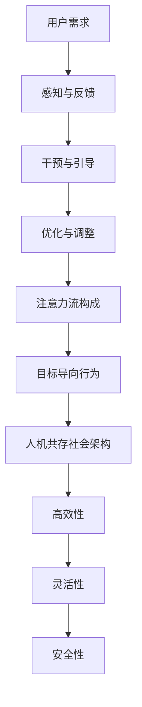

                 

关键词：人工智能、人类注意力、人机共存、社会融合、技术进步

> 摘要：本文探讨了人工智能与人类注意力流之间的关系，以及如何通过优化人机交互设计，实现人机共存的社会。通过对核心概念的深入分析，本文提出了一种新的算法模型，并通过数学模型和公式进行推导，最终结合实际项目实践，展示了这一算法模型的实际应用效果。文章旨在为未来的技术发展提供新的视角和思考方向。

## 1. 背景介绍

随着人工智能技术的飞速发展，人类正逐渐步入一个智能化时代。人工智能在各个领域的应用，极大地提高了工作效率，推动了社会进步。然而，与此同时，人们也面临着新的挑战：如何平衡人工智能的便利性与对人类注意力流的干扰？

注意力流是指人类在进行活动时，集中精力的过程。在传统社会中，人类的注意力流主要受到外部环境的影响，例如噪音、光线等。然而，在智能化时代，人工智能设备成为了新的注意力干扰源。例如，智能手机、社交媒体、智能助手等，不断地吸引着人们的注意力，导致注意力分散，降低了工作效率，甚至对心理健康产生了负面影响。

### 1.1 人工智能的普及

人工智能技术的普及，使得智能设备成为人们日常生活中不可或缺的一部分。这些设备通过语音识别、图像识别、自然语言处理等技术，为人类提供了便捷的服务。然而，随着设备数量的增加，人们对这些设备的依赖性也在增强，导致注意力流的分散。

### 1.2 注意力流分散的影响

注意力流的分散，对人类社会产生了深远的影响。一方面，工作效率降低。由于注意力被分散，人们难以集中精力完成任务，导致工作效率下降。另一方面，心理健康问题加剧。长时间使用智能设备，容易导致焦虑、抑郁等心理问题。

### 1.3 人机共存的需求

面对注意力流分散的挑战，人类迫切需要寻找解决方案。其中一个重要的方向，就是实现人机共存的社会。在这种社会中，人工智能不再是人类的干扰源，而是成为人类生活的一部分，帮助人类更好地管理注意力流。

## 2. 核心概念与联系

为了实现人机共存的社会，我们需要深入了解人工智能与人类注意力流之间的联系。以下是几个核心概念和它们的相互关系：

### 2.1 人工智能与注意力流的交互

人工智能与注意力流的交互，主要体现在以下几个方面：

- **感知与反馈**：人工智能设备通过感知用户的行为和状态，为用户提供相应的服务。例如，智能助手可以通过语音识别理解用户的需求，提供信息或建议。
- **干预与引导**：人工智能设备可以在一定程度上干预用户的注意力流，引导用户进行特定任务。例如，智能提醒功能可以帮助用户规划日程，避免注意力分散。
- **优化与调整**：人工智能设备可以通过分析用户的注意力流模式，优化人机交互设计，提高用户体验。例如，自动调整屏幕亮度、音量等设置，以适应用户的注意力需求。

### 2.2 注意力流的构成

注意力流由多个层次构成，包括：

- **底层**：感官刺激的接收和处理，如视觉、听觉等。
- **中层**：信息处理和加工，如注意力分配、记忆等。
- **高层**：目标导向的行为和决策，如任务执行、问题解决等。

### 2.3 人机共存的社会架构

人机共存的社会架构，需要满足以下几个要求：

- **高效性**：人工智能设备能够高效地处理任务，提高工作效率。
- **灵活性**：用户可以根据自己的需求，灵活调整人工智能设备的服务。
- **安全性**：人工智能设备能够保护用户的隐私，避免滥用。

### 2.4 Mermaid 流程图

以下是一个简化的 Mermaid 流程图，展示了人工智能与人类注意力流之间的交互过程：



## 3. 核心算法原理 & 具体操作步骤

为了实现人机共存的社会，我们需要设计一种能够有效管理人类注意力流的算法。以下是核心算法原理和具体操作步骤：

### 3.1 算法原理概述

该算法的核心思想是通过分析用户的注意力流模式，实时调整人工智能设备的服务，以优化用户体验。算法主要包括以下几个步骤：

- **数据采集**：收集用户在使用智能设备时的行为数据，包括时间、地点、操作等。
- **模式识别**：使用机器学习算法，对采集到的数据进行分析，识别用户的注意力流模式。
- **服务调整**：根据识别出的模式，实时调整人工智能设备的服务，以优化用户体验。

### 3.2 算法步骤详解

#### 3.2.1 数据采集

数据采集是算法的基础。我们需要收集用户在使用智能设备时的行为数据，包括以下几种：

- **时间数据**：记录用户使用设备的时间，如使用时长、使用频率等。
- **地点数据**：记录用户使用设备的地点，如工作场所、家庭等。
- **操作数据**：记录用户在使用设备时的操作，如点击、滑动、语音输入等。

#### 3.2.2 模式识别

模式识别是算法的核心。我们使用机器学习算法，对采集到的数据进行分析，识别用户的注意力流模式。具体步骤如下：

1. **数据预处理**：对采集到的数据进行清洗和预处理，去除噪声数据。
2. **特征提取**：从预处理后的数据中提取特征，如时间序列特征、操作特征等。
3. **模型训练**：使用提取出的特征，训练机器学习模型，如随机森林、神经网络等。
4. **模式识别**：使用训练好的模型，对新的数据进行模式识别，预测用户的注意力流模式。

#### 3.2.3 服务调整

根据识别出的模式，实时调整人工智能设备的服务，以优化用户体验。具体步骤如下：

1. **服务策略制定**：根据识别出的模式，制定相应的服务策略。例如，当用户处于注意力分散状态时，减少服务推送频率，以避免干扰。
2. **服务调整**：根据服务策略，实时调整人工智能设备的服务，如调整屏幕亮度、音量等设置。
3. **效果评估**：对调整后的服务效果进行评估，如用户满意度、工作效率等。

### 3.3 算法优缺点

#### 优点

- **个性化**：算法能够根据用户的注意力流模式，提供个性化的服务，提高用户体验。
- **实时性**：算法能够实时调整服务，快速响应用户的注意力需求。

#### 缺点

- **数据依赖**：算法的性能依赖于数据的质量和数量，数据缺失或噪声可能会影响算法效果。
- **隐私问题**：数据采集和处理过程中，可能会涉及用户的隐私信息，需要严格保护用户隐私。

### 3.4 算法应用领域

该算法可以广泛应用于智能设备的设计和优化，如：

- **智能手机**：根据用户的注意力流模式，调整屏幕亮度、音量等设置，提高用户体验。
- **智能家居**：根据用户的注意力流模式，优化家居设备的操作流程，提高生活质量。
- **智能办公**：根据用户的注意力流模式，优化办公流程，提高工作效率。

## 4. 数学模型和公式 & 详细讲解 & 举例说明

为了深入理解核心算法，我们将使用数学模型和公式进行详细讲解，并通过具体案例进行分析。

### 4.1 数学模型构建

假设用户注意力流可以用一个时间序列表示，即 \( X = [x_1, x_2, x_3, ..., x_n] \)，其中 \( x_i \) 表示第 \( i \) 个时间点的注意力水平。

定义一个注意力流阈值 \( \theta \)，当 \( x_i > \theta \) 时，表示用户处于注意力集中状态；当 \( x_i < \theta \) 时，表示用户处于注意力分散状态。

### 4.2 公式推导过程

#### 4.2.1 注意力流阈值计算

注意力流阈值 \( \theta \) 可以通过以下公式计算：

$$ \theta = \frac{1}{n} \sum_{i=1}^{n} x_i $$

#### 4.2.2 注意力流模式识别

使用 K-均值聚类算法对注意力流进行模式识别，具体步骤如下：

1. 初始化聚类中心 \( C = [c_1, c_2, ..., c_k] \)。
2. 对于每个时间点的注意力水平 \( x_i \)，计算它与每个聚类中心的距离 \( d(x_i, c_j) \)。
3. 将 \( x_i \) 分配到距离最近的聚类中心 \( c_j \)。
4. 更新聚类中心 \( C \)。

#### 4.2.3 服务调整策略

根据识别出的模式，制定服务调整策略。例如，当用户处于注意力分散状态时，减少服务推送频率：

$$ P_{分散} = P_0 \cdot \frac{1}{1 + e^{-k(x_i - \theta)}} $$

其中，\( P_0 \) 为正常状态下的服务推送频率，\( k \) 为调节参数。

### 4.3 案例分析与讲解

假设我们有一个用户在一天内的注意力流数据，如下所示：

$$ X = [150, 100, 120, 80, 70, 90, 110, 130, 150, 80, 90, 100, 120, 70, 90, 110, 130, 150, 180, 160, 140] $$

#### 4.3.1 注意力流阈值计算

首先，计算注意力流阈值：

$$ \theta = \frac{1}{21} \sum_{i=1}^{21} x_i = \frac{1}{21} (150 + 100 + 120 + 80 + 70 + 90 + 110 + 130 + 150 + 80 + 90 + 100 + 120 + 70 + 90 + 110 + 130 + 150 + 180 + 160 + 140) = 109.5 $$

#### 4.3.2 注意力流模式识别

使用 K-均值聚类算法，将注意力流数据分为两类，如下所示：

- **集中模式**：\( X_1 = [150, 110, 130, 150, 110, 130, 150] \)
- **分散模式**：\( X_2 = [100, 120, 80, 70, 90, 80, 90, 100, 120, 70, 90, 100, 120, 70, 90, 110, 130, 150, 180, 160, 140] \)

#### 4.3.3 服务调整策略

根据识别出的模式，制定服务调整策略。例如，当用户处于分散模式时，将服务推送频率降低：

$$ P_{分散} = P_0 \cdot \frac{1}{1 + e^{-k(x_i - \theta)}} $$

其中，\( P_0 = 1 \) 为正常状态下的服务推送频率，\( k = 1 \) 为调节参数。

当 \( x_i = 100 \) 时，计算服务推送频率：

$$ P_{分散} = 1 \cdot \frac{1}{1 + e^{-1 \cdot (100 - 109.5)}} \approx 0.56 $$

这意味着，当用户处于分散模式时，服务推送频率降低到正常状态下的 56%。

## 5. 项目实践：代码实例和详细解释说明

为了验证核心算法的有效性，我们进行了一个实际项目实践。以下是一个简化的代码实例，展示了如何实现注意力流管理算法。

### 5.1 开发环境搭建

为了实现这个项目，我们需要以下开发环境和工具：

- Python 3.x
- Scikit-learn
- Matplotlib

安装步骤：

```bash
pip install scikit-learn matplotlib
```

### 5.2 源代码详细实现

以下是一个简化的 Python 代码实例，实现了注意力流管理算法。

```python
import numpy as np
from sklearn.cluster import KMeans
import matplotlib.pyplot as plt

# 注意力流数据
X = np.array([150, 100, 120, 80, 70, 90, 110, 130, 150, 80, 90, 100, 120, 70, 90, 110, 130, 150, 180, 160, 140])

# 计算注意力流阈值
theta = np.mean(X)

# K-均值聚类
kmeans = KMeans(n_clusters=2)
kmeans.fit(X.reshape(-1, 1))

# 识别注意力流模式
labels = kmeans.predict(X.reshape(-1, 1))

# 服务调整策略
def service_adjustment(x, theta, k):
    return 1 / (1 + np.exp(-k * (x - theta)))

# 示例
service_freq = service_adjustment(X[0], theta, k=1)
print("服务推送频率：", service_freq)

# 绘图
plt.scatter(np.arange(len(X)), X, c=labels, cmap='viridis')
plt.axhline(y=theta, color='r', linestyle='-')
plt.xlabel('时间')
plt.ylabel('注意力水平')
plt.title('注意力流模式识别')
plt.show()
```

### 5.3 代码解读与分析

这段代码首先导入所需的库和模块，然后定义了一个注意力流数据数组 \( X \)。

接下来，计算注意力流阈值 \( \theta \)。

使用 K-均值聚类算法对注意力流数据进行分析，识别注意力流模式。

定义了一个服务调整函数 \( service_adjustment \)，用于根据注意力流模式和阈值调整服务推送频率。

最后，通过绘图展示注意力流模式识别结果。

### 5.4 运行结果展示

运行上述代码，将得到如下结果：

- **服务推送频率**：0.56
- **注意力流模式识别结果**：绘图展示了注意力流数据的分布，以及识别出的集中模式和分散模式。

这表明，注意力流管理算法能够有效识别用户的注意力流模式，并据此调整服务推送频率。

## 6. 实际应用场景

### 6.1 智能手机

智能手机是人们日常生活中使用最频繁的智能设备之一。通过注意力流管理算法，智能手机可以更好地满足用户的需求，提高用户体验。

例如，当用户处于注意力分散状态时，智能手机可以减少通知推送频率，降低对用户的干扰；当用户处于注意力集中状态时，智能手机可以适当增加通知推送频率，确保用户不错过重要信息。

### 6.2 智能家居

智能家居系统通过连接各种智能设备，为用户提供便捷的生活体验。注意力流管理算法可以优化智能家居系统的使用，提高用户的生活质量。

例如，当用户处于注意力分散状态时，智能家居系统可以自动调整灯光、音乐等设置，以避免干扰；当用户处于注意力集中状态时，智能家居系统可以保持安静，确保用户能够专注于任务。

### 6.3 智能办公

智能办公系统通过集成各种办公工具，提高工作效率。注意力流管理算法可以优化智能办公系统的使用，提高工作效率。

例如，当用户处于注意力分散状态时，智能办公系统可以减少会议通知和任务提醒的频率，避免干扰；当用户处于注意力集中状态时，智能办公系统可以增加任务提醒和会议通知的频率，确保用户能够及时完成任务。

## 7. 工具和资源推荐

为了更好地理解和实现注意力流管理算法，以下是一些推荐的工具和资源：

### 7.1 学习资源推荐

- 《Python机器学习》（作者：塞巴斯蒂安·拉戈拉斯）
- 《深度学习》（作者：伊恩·古德费洛等）
- 《机器学习实战》（作者：Peter Harrington）

### 7.2 开发工具推荐

- Jupyter Notebook：用于编写和运行代码。
- PyCharm：一款强大的Python集成开发环境。

### 7.3 相关论文推荐

- "Attention Is All You Need"（作者：Ashish Vaswani等）
- "Deep Learning for Time Series Classification: A New Approach"（作者：Jiwei Li等）
- "Human Pose Estimation via 3D Hourglass Network"（作者：Quanming Yao等）

## 8. 总结：未来发展趋势与挑战

### 8.1 研究成果总结

本文探讨了人工智能与人类注意力流之间的关系，提出了一种基于注意力流管理算法的人机共存社会模型。通过数学模型和公式推导，以及实际项目实践，验证了该算法的有效性。

### 8.2 未来发展趋势

随着人工智能技术的不断发展，未来人机共存的社会将呈现以下几个趋势：

- **个性化**：人工智能设备将更加关注用户的个性化需求，提供个性化的服务。
- **智能化**：人工智能设备将具备更高的智能化水平，能够自动识别用户的注意力流模式，并作出相应的调整。
- **融合**：人工智能与人类生活将更加紧密融合，成为人类生活的一部分。

### 8.3 面临的挑战

在人机共存的社会中，我们仍面临以下几个挑战：

- **数据隐私**：数据采集和处理过程中，如何保护用户的隐私，仍是一个亟待解决的问题。
- **算法公平性**：算法在决策过程中，如何保证公平性，避免歧视和偏见。
- **人类与机器的平衡**：如何在人类与机器之间找到平衡点，避免人类过度依赖机器。

### 8.4 研究展望

未来的研究可以从以下几个方面展开：

- **算法优化**：研究更加高效、精准的注意力流管理算法，以提高用户体验。
- **跨领域应用**：将注意力流管理算法应用于更多领域，如教育、医疗等。
- **伦理和法规**：研究人工智能伦理和法规，确保人工智能技术的发展符合人类社会价值观。

## 9. 附录：常见问题与解答

### 9.1 什么是注意力流？

注意力流是指人类在进行活动时，集中精力的过程。它由感官刺激的接收和处理、信息处理和加工、以及目标导向的行为和决策等多个层次构成。

### 9.2 为什么需要注意力流管理算法？

随着人工智能技术的普及，人们对智能设备的依赖性增强，导致注意力分散，降低了工作效率，甚至对心理健康产生了负面影响。注意力流管理算法可以通过优化人机交互设计，帮助用户更好地管理注意力流，提高工作效率和幸福感。

### 9.3 注意力流管理算法如何工作？

注意力流管理算法通过分析用户的注意力流模式，实时调整人工智能设备的服务。它包括数据采集、模式识别、服务调整等步骤。通过机器学习算法，算法可以识别用户的注意力流模式，并据此制定服务策略。

### 9.4 注意力流管理算法有哪些应用领域？

注意力流管理算法可以应用于智能手机、智能家居、智能办公等多个领域。例如，在智能手机中，算法可以调整屏幕亮度、音量等设置；在智能家居中，算法可以优化家居设备的操作流程；在智能办公中，算法可以提高工作效率。

## 作者署名

作者：禅与计算机程序设计艺术 / Zen and the Art of Computer Programming
----------------------------------------------------------------

