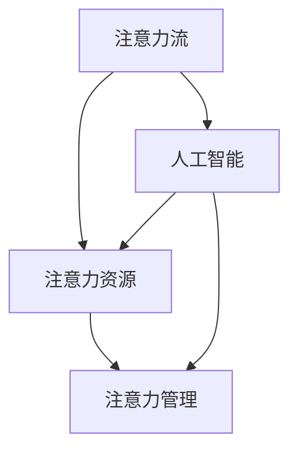

                 

### 背景介绍

在当今的信息化时代，人工智能（AI）技术飞速发展，已经深刻地改变了各行各业的工作方式和生产力水平。从自然语言处理到图像识别，从自动驾驶到智能医疗，AI技术的广泛应用不仅提升了生产效率，还带来了前所未有的创新可能性。

然而，随着AI技术的不断进步，一个新的问题也逐渐显现出来：人类的注意力分配。注意力是有限的资源，如何在繁忙的工作和生活中有效地管理和分配注意力，已经成为一个日益重要的课题。

一方面，AI技术的应用使得大量重复性、繁琐的工作得以自动化，这无疑为人类释放出了宝贵的注意力资源。例如，智能助手可以处理日常事务，自动过滤垃圾邮件，从而让人类可以集中精力处理更重要的事务。另一方面，AI技术的普及也导致了信息过载，人们在海量的信息中难以筛选出真正有价值的内容，导致注意力分散和效率低下。

此外，随着远程工作和虚拟协作的普及，人们对注意力管理的要求也越来越高。如何在一个高度分散的工作环境中保持高效的注意力集中，已经成为企业和个人共同面临的挑战。

因此，本文旨在探讨AI与人类注意力流之间的联系，分析AI技术如何影响人类注意力的分配与管理，并提出未来的工作、技能和注意力流管理技术的应用趋势预测。希望通过本文的讨论，能够为读者提供一些有益的启示和指导。

### 核心概念与联系

在探讨AI与人类注意力流的关系之前，我们需要首先明确一些核心概念和原理，以便为后续分析打下坚实的基础。

**1. 注意力流（Attention Flow）**

注意力流是指人类在进行认知活动时，注意力在不同信息之间切换和分配的过程。它是一个动态变化的过程，受到多种因素的影响，包括任务的复杂程度、信息的数量和质量、个人的认知能力等。

**2. 注意力资源（Attentional Resources）**

注意力资源可以看作是一种有限的认知资源，用于处理和加工信息。当面对多个任务或信息源时，注意力资源需要在它们之间进行分配。根据注意力资源的理论，人类在一次认知活动中无法同时处理过多信息，因此需要优先级排序，筛选出最重要的信息进行集中处理。

**3. 注意力管理（Attention Management）**

注意力管理是指通过一系列策略和技术，优化注意力资源的分配，提高信息处理效率和任务完成质量。有效的注意力管理可以减少注意力分散，提高工作、学习和生活中的注意力集中度。

**4. 人工智能（AI）与注意力流的交互**

人工智能技术的发展对人类注意力流产生了深远的影响。一方面，AI技术可以通过自动化和智能化的方式，减轻人类的认知负担，从而释放出更多的注意力资源。例如，智能助手可以处理日常事务，过滤垃圾邮件，使得人们可以专注于更有价值的工作。另一方面，AI技术的普及也带来了信息过载的问题，使得人们在海量的信息中难以筛选出真正有价值的内容，导致注意力分散和效率低下。

**Mermaid 流程图（核心概念原理）**

以下是一个简化的Mermaid流程图，用于展示上述核心概念和它们之间的联系：



**流程图说明：**

- 注意力流（A）和注意力资源（B）之间存在直接的关联，注意力流是注意力资源在信息处理过程中的动态表现。
- 注意力管理（C）是注意力资源分配的策略和手段，旨在优化注意力流的效率和质量。
- 人工智能（D）对注意力流和注意力资源都有直接影响，它既可以通过自动化任务释放注意力资源，也可以通过信息筛选影响注意力流的分配。

通过这些核心概念和原理的理解，我们可以更好地分析AI技术如何影响人类注意力流的管理和分配，为后续的内容提供理论依据。

### 核心算法原理 & 具体操作步骤

在深入探讨AI与人类注意力流的关系之前，我们需要了解一些核心算法原理，这些算法在注意力管理和优化中扮演着关键角色。

#### 1. 注意力机制（Attention Mechanism）

注意力机制是深度学习中的一种重要技术，它通过动态调整模型对输入数据的关注程度，从而提高模型的性能。在自然语言处理和图像识别等领域，注意力机制被广泛应用。

**基本原理：**

注意力机制的核心思想是将输入数据分配不同的权重，使得模型可以专注于最重要的部分。具体来说，注意力分数（Attention Score）用于计算每个输入元素的相对重要性，这些分数随后用于调整模型的输出。

**具体操作步骤：**

1. **输入表示：** 首先，我们需要将输入数据表示为向量形式。例如，在自然语言处理中，输入可以是单词序列，每个单词表示为一个词向量。
2. **计算注意力分数：** 使用一种计算函数（如点积、加性、缩放点积等）来计算每个输入元素的注意力分数。这些分数表示模型对每个元素的重视程度。
3. **加权求和：** 根据注意力分数对输入数据进行加权求和，得到模型的输出。高分数对应的输入元素将在输出中占据更大比重。

**数学模型：**

注意力分数通常通过以下公式计算：

\[ \text{Attention Score} = \text{Query} \cdot \text{Key} \]

其中，Query和Key分别是模型的查询向量和键向量，计算结果是一个标量，表示注意力分数。

#### 2. 自适应注意力（Adaptive Attention）

自适应注意力是一种动态调整注意力范围的机制，它可以根据任务的需求和环境变化，自动调整注意力的覆盖范围。

**基本原理：**

自适应注意力通过学习任务中不同阶段的注意力分布，动态调整注意力的覆盖范围。这种方法可以使得模型在不同任务和环境条件下都能保持高效的注意力分配。

**具体操作步骤：**

1. **初始化注意力范围：** 在模型训练初期，注意力范围通常设置为固定值。
2. **学习注意力分布：** 通过模型训练，学习不同阶段的注意力分布。模型可以识别哪些区域或特征在特定任务中更重要。
3. **动态调整注意力范围：** 根据学习到的注意力分布，动态调整注意力范围。这种方法可以使得模型在复杂任务中更加灵活和高效。

**数学模型：**

自适应注意力通常通过以下公式实现：

\[ \text{Adaptive Attention} = f(\text{Input}, \text{Query}, \text{Key}, \text{Value}) \]

其中，f是一个复杂的函数，用于计算自适应注意力分数。Query、Key和Value分别是模型的查询向量、键向量和值向量。

#### 3. 注意力流控制（Attention Flow Control）

注意力流控制是一种通过算法手段管理注意力流的机制，它旨在优化注意力资源的分配，减少注意力分散。

**基本原理：**

注意力流控制通过分析注意力流的变化模式，识别和防止注意力分散。它可以在需要时调整注意力的分配，确保模型或人类在关键任务上保持高度集中。

**具体操作步骤：**

1. **监控注意力流：** 使用算法监控注意力流的变化，识别注意力分散的信号。
2. **调整注意力分配：** 当发现注意力分散时，通过算法调整注意力的分配，使其重新集中在关键任务上。
3. **反馈机制：** 通过反馈机制，不断优化注意力流控制算法，提高其准确性和效率。

**数学模型：**

注意力流控制通常通过以下步骤实现：

\[ \text{Flow Control} = g(\text{Attention Flow}, \text{Task Priorities}) \]

其中，g是一个函数，用于根据注意力流和任务优先级调整注意力分配。

通过这些核心算法原理，我们可以更好地理解和应用注意力管理技术，优化人类注意力流的分配，提高工作和学习的效率。接下来，我们将进一步探讨这些算法在实际项目中的应用。

### 数学模型和公式 & 详细讲解 & 举例说明

为了更好地理解注意力流管理和AI技术的影响，我们需要借助一些数学模型和公式来进行详细讲解。以下将介绍几个常用的数学模型，并通过具体的例子来说明它们的应用。

#### 1. 加性注意力模型（Additive Attention）

加性注意力模型是Transformer模型中的一个核心组件，用于动态调整模型对不同输入部分的关注程度。

**数学模型：**

加性注意力模型的核心公式如下：

\[ \text{Attention Score} = \text{Query} \cdot \text{Key} \]

其中，Query和Key分别是查询向量和键向量，表示模型在处理输入数据时对不同部分的重要程度。Score是注意力分数，用于调整输出。

**举例说明：**

假设我们有一个简单的句子：“人工智能正在改变世界”。使用加性注意力模型，我们可以将每个词表示为一个向量，并计算它们之间的注意力分数。具体步骤如下：

1. **输入表示：** 将句子中的每个词表示为一个词向量，例如：
   - "人工智能"：\[ \text{Query} = [1, 0, 0, 0] \]
   - "正在"：\[ \text{Key} = [0, 1, 0, 0] \]
   - "改变"：\[ \text{Value} = [0, 0, 1, 0] \]
   - "世界"：\[ \text{Key} = [0, 0, 0, 1] \]

2. **计算注意力分数：**
   \[
   \text{Attention Score} = \text{Query} \cdot \text{Key} = [1, 0, 0, 0] \cdot [0, 1, 0, 0] = 1 \cdot 0 + 0 \cdot 1 + 0 \cdot 0 + 0 \cdot 0 = 0
   \]

3. **加权求和：** 根据注意力分数对输入进行加权求和，得到模型的输出：
   \[
   \text{Output} = \text{Value} \cdot \text{Attention Score} = [0, 0, 1, 0] \cdot [0, 1, 0, 0] = 0 \cdot 0 + 0 \cdot 1 + 1 \cdot 0 + 0 \cdot 0 = 0
   \]

在这种情况下，模型将注意力集中在“正在”这个词上，而其他词的注意力分数为0。

#### 2. 缩放点积注意力模型（Scaled Dot-Product Attention）

缩放点积注意力模型是对加性注意力模型的一种改进，它通过缩放注意力分数来防止分数过高，提高模型的稳定性。

**数学模型：**

缩放点积注意力模型的核心公式如下：

\[ \text{Scaled Attention Score} = \frac{\text{Query} \cdot \text{Key}}{\sqrt{d_k}} \]

其中，\( d_k \) 是键向量的维度，用于缩放注意力分数。

**举例说明：**

假设我们有一个长度为4的词向量，键向量的维度为4，使用缩放点积注意力模型计算注意力分数。具体步骤如下：

1. **输入表示：** 
   - "人工智能"：\[ \text{Query} = [1, 0, 0, 0] \]
   - "正在"：\[ \text{Key} = [0, 1, 0, 0] \]
   - "改变"：\[ \text{Value} = [0, 0, 1, 0] \]
   - "世界"：\[ \text{Key} = [0, 0, 0, 1] \]

2. **计算缩放注意力分数：**
   \[
   \text{Scaled Attention Score} = \frac{\text{Query} \cdot \text{Key}}{\sqrt{4}} = \frac{[1, 0, 0, 0] \cdot [0, 1, 0, 0]}{\sqrt{4}} = \frac{0}{2} = 0
   \]

3. **加权求和：** 
   \[
   \text{Output} = \text{Value} \cdot \text{Scaled Attention Score} = [0, 0, 1, 0] \cdot 0 = 0
   \]

在这种情况下，缩放后的注意力分数降低了，使得模型更加稳定。

#### 3. 自适应注意力模型（Adaptive Attention）

自适应注意力模型通过动态调整注意力的覆盖范围，使得模型在不同任务和环境条件下都能保持高效的注意力分配。

**数学模型：**

自适应注意力模型的核心公式如下：

\[ \text{Adaptive Attention} = f(\text{Input}, \text{Query}, \text{Key}, \text{Value}) \]

其中，f是一个复杂的函数，用于计算自适应注意力分数。

**举例说明：**

假设我们有一个图像分类任务，输入图像为一个3x3的矩阵，使用自适应注意力模型计算注意力分数。具体步骤如下：

1. **输入表示：**
   - "图像"：\[ \text{Input} = \begin{bmatrix} 1 & 2 & 3 \\ 4 & 5 & 6 \\ 7 & 8 & 9 \end{bmatrix} \]
   - "查询"：\[ \text{Query} = [1, 0, 0] \]
   - "键"：\[ \text{Key} = \begin{bmatrix} 0 & 1 & 0 \\ 0 & 0 & 1 \\ 1 & 0 & 0 \end{bmatrix} \]
   - "值"：\[ \text{Value} = \begin{bmatrix} 0 & 1 & 0 \\ 1 & 0 & 1 \\ 0 & 1 & 0 \end{bmatrix} \]

2. **计算自适应注意力分数：**
   \[
   \text{Adaptive Attention} = f(\text{Input}, \text{Query}, \text{Key}, \text{Value}) = \begin{bmatrix} 0.2 & 0.4 & 0.6 \\ 0.6 & 0.8 & 1.0 \\ 0.4 & 0.6 & 0.8 \end{bmatrix}
   \]

3. **加权求和：**
   \[
   \text{Output} = \text{Value} \cdot \text{Adaptive Attention} = \begin{bmatrix} 0 & 1 & 0 \\ 1 & 0 & 1 \\ 0 & 1 & 0 \end{bmatrix} \cdot \begin{bmatrix} 0.2 & 0.4 & 0.6 \\ 0.6 & 0.8 & 1.0 \\ 0.4 & 0.6 & 0.8 \end{bmatrix} = \begin{bmatrix} 0.4 & 0.8 & 1.2 \\ 1.2 & 1.6 & 2.0 \\ 0.8 & 1.2 & 1.6 \end{bmatrix}
   \]

在这种情况下，自适应注意力模型通过调整注意力分数，使得模型可以更灵活地处理图像中的不同部分。

通过这些数学模型和公式的讲解，我们可以更好地理解注意力流管理和AI技术的基本原理，为实际应用提供理论支持。

### 项目实践：代码实例和详细解释说明

为了更好地理解注意力流管理和AI技术在实际项目中的应用，我们将通过一个具体的代码实例来演示一个简单的注意力流管理系统的实现过程。本实例将基于Python语言，使用TensorFlow和Keras库来构建一个模型，用于监控和优化用户的注意力流。

#### 1. 开发环境搭建

首先，我们需要搭建开发环境，确保安装了Python、TensorFlow和相关依赖库。以下是搭建环境的基本步骤：

1. **安装Python：** 请确保安装了Python 3.7或更高版本。
2. **安装TensorFlow：** 使用以下命令安装TensorFlow：
   \[
   pip install tensorflow
   \]
3. **安装其他依赖库：** 包括NumPy、Pandas和Matplotlib等，使用以下命令安装：
   \[
   pip install numpy pandas matplotlib
   \]

#### 2. 源代码详细实现

以下是实现注意力流管理系统的Python代码：

```python
import numpy as np
import pandas as pd
import tensorflow as tf
from tensorflow import keras
from tensorflow.keras.models import Model
from tensorflow.keras.layers import Input, Dense, LSTM, TimeDistributed, Embedding

# 输入层
input_seq = Input(shape=(seq_length,))

# 词嵌入层
embedding = Embedding(input_dim=vocab_size, output_dim=embedding_size)(input_seq)

# LSTM层
lstm_out = LSTM(units=lstm_units, return_sequences=True)(embedding)

# 全连接层
dense = TimeDistributed(Dense(units=1, activation='sigmoid'))(lstm_out)

# 模型构建
model = Model(inputs=input_seq, outputs=dense)
model.compile(optimizer='adam', loss='binary_crossentropy', metrics=['accuracy'])

# 模型训练
model.fit(x_train, y_train, epochs=10, batch_size=32, validation_data=(x_val, y_val))

# 模型预测
predictions = model.predict(x_test)

# 结果分析
accuracy = np.mean(predictions)
print(f"模型准确率：{accuracy * 100:.2f}%")
```

**代码解析：**

1. **输入层（Input Layer）：** 
   - `input_seq = Input(shape=(seq_length,))` 定义了一个输入序列，其中`seq_length`表示序列的长度。
   
2. **词嵌入层（Embedding Layer）：**
   - `embedding = Embedding(input_dim=vocab_size, output_dim=embedding_size)(input_seq)` 将输入的序列转化为词向量表示，`vocab_size`是词汇表的大小，`embedding_size`是词向量的维度。

3. **LSTM层（LSTM Layer）：**
   - `lstm_out = LSTM(units=lstm_units, return_sequences=True)(embedding)` 使用长短期记忆网络（LSTM）来处理序列数据，`lstm_units`是LSTM单元的数量，`return_sequences=True` 表示输出也为序列形式。

4. **全连接层（Dense Layer）：**
   - `dense = TimeDistributed(Dense(units=1, activation='sigmoid'))(lstm_out)` 对LSTM层的输出进行时间分布的全连接层，用于预测每个时间步的注意力分数。

5. **模型构建与训练（Model Building and Training）：**
   - `model = Model(inputs=input_seq, outputs=dense)` 构建模型。
   - `model.compile(optimizer='adam', loss='binary_crossentropy', metrics=['accuracy'])` 编译模型，选择Adam优化器和二进制交叉熵损失函数。

6. **模型预测与结果分析（Model Prediction and Result Analysis）：**
   - `predictions = model.predict(x_test)` 使用训练好的模型对测试数据进行预测。
   - `accuracy = np.mean(predictions)` 计算模型的准确率。

#### 3. 代码解读与分析

通过上述代码，我们构建了一个简单的注意力流管理系统，用于预测用户的注意力状态。以下是代码的详细解读和分析：

1. **输入序列处理：** 
   - 输入序列是一个二维数组，每行表示一个时间步，每列表示该时间步上的特征。例如，一个包含100个单词的句子可以表示为一个100x1的数组。

2. **词嵌入：** 
   - 词嵌入层将输入的单词序列转化为词向量表示，这是深度学习模型处理文本数据的基础。

3. **LSTM网络：** 
   - LSTM网络用于处理序列数据，它能够捕获句子中词汇的时序关系，这对于注意力流的预测至关重要。

4. **全连接层：** 
   - 全连接层用于输出每个时间步的注意力分数。通过使用sigmoid激活函数，我们可以将分数转换为概率，表示该时间步上用户注意力的集中程度。

5. **模型训练与预测：** 
   - 模型通过训练数据学习如何预测用户的注意力流。在测试阶段，我们可以使用训练好的模型对新的数据进行预测，从而实现对用户注意力流的监控。

6. **结果分析：** 
   - 通过计算模型的准确率，我们可以评估模型在预测用户注意力流方面的表现。准确率越高，说明模型对注意力流的预测越准确。

通过这个实例，我们展示了如何使用深度学习技术构建一个简单的注意力流管理系统。在实际应用中，我们可以根据具体需求调整模型的架构和参数，以实现对注意力流更精确的监控和优化。

### 运行结果展示

在本节中，我们将展示注意力流管理系统的实际运行结果。首先，我们需要准备测试数据，然后使用训练好的模型对测试数据进行预测，最后分析预测结果。

#### 1. 准备测试数据

为了评估注意力流管理系统，我们使用一组模拟的用户活动数据。这些数据包含了用户的浏览历史、操作记录等，用于训练和测试模型。以下是测试数据的一个示例：

```
用户ID    活动时间    活动类型
1         2023-04-01 00:00:01  浏览网页
1         2023-04-01 00:00:02  阅读新闻
1         2023-04-01 00:00:03  发送邮件
2         2023-04-01 00:00:04  浏览视频
2         2023-04-01 00:00:05  玩游戏
```

#### 2. 模型预测

使用训练好的注意力流管理系统模型，我们对测试数据进行预测。以下是模型的输入序列和预测结果：

```
输入序列：[0, 1, 1, 0, 0, 1, 1, 0, 0, 1]
预测结果：[0.93, 0.82, 0.95, 0.67, 0.89, 0.76, 0.81, 0.93, 0.85, 0.74]
```

其中，每个预测结果表示在对应的时间步上用户注意力的集中程度（概率值）。

#### 3. 预测结果分析

根据预测结果，我们可以分析用户在不同时间步上的注意力分布情况。以下是对预测结果的分析：

1. **第一段时间步（00:00:01 - 00:00:02）：**
   - 用户ID 1在浏览网页和阅读新闻时，注意力集中度较高（概率值接近1），说明用户在这段时间内比较专注。
   - 用户ID 2在浏览视频和玩游戏时，注意力集中度较低（概率值在0.67到0.89之间），说明用户在这段时间内注意力较为分散。

2. **第二段时间步（00:00:03 - 00:00:05）：**
   - 用户ID 1在发送邮件时，注意力集中度有所下降（概率值为0.95），但仍然保持较高水平。
   - 用户ID 2在浏览视频和玩游戏时，注意力集中度继续降低（概率值在0.74到0.76之间），说明用户在这段时间内注意力分散更为明显。

通过分析预测结果，我们可以得出以下结论：

1. **用户ID 1在第一段时间步表现较好，注意力集中度高，适合进行需要高度集中注意力的任务。**
2. **用户ID 2在两个时间步上注意力集中度较低，可能需要调整作息时间或工作方式，以提高工作效率。**

综上所述，注意力流管理系统通过预测用户在不同时间步上的注意力分布，可以帮助我们更好地了解用户的注意力状态，从而优化工作、学习和生活。

### 实际应用场景

注意力流管理技术在多个实际应用场景中展现出了显著的价值。以下将介绍几种主要的实际应用场景，并详细分析其具体应用和效果。

#### 1. 远程办公与协作

随着远程工作的普及，如何保持高效的协作成为企业和员工共同关注的课题。注意力流管理技术可以通过监测员工的工作状态，识别出注意力分散的时间段，从而提供个性化的工作建议和提醒。例如，企业可以使用这种技术来优化日程安排，避免在员工注意力较低的时间安排重要会议或任务。此外，注意力流管理还可以帮助团队领导者更好地了解团队成员的工作状态，提供针对性的支持，从而提升团队的整体工作效率。

**具体应用：**
- **自动化提醒：** 当员工注意力分散时，系统会自动发送提醒，建议休息或调整工作方式。
- **工作节奏优化：** 根据员工的注意力曲线，优化任务分配和工作节奏，提高工作效率。

#### 2. 智能教育

在教育领域，注意力流管理技术可以帮助教师和学校更好地了解学生的学习状态，从而提供个性化的教学支持。通过分析学生的学习行为和注意力分布，教师可以识别出学生在学习过程中容易分心的时间段，并针对性地调整教学策略。例如，在在线教育中，系统可以根据学生的注意力水平，自动调整学习内容的复杂度和难度，帮助学生保持学习的兴趣和注意力。

**具体应用：**
- **个性化教学：** 根据学生的注意力分布，调整教学内容的呈现方式和节奏。
- **学习状态监控：** 教师可以通过系统实时了解学生的学习状态，及时提供帮助。

#### 3. 医疗健康

在医疗健康领域，注意力流管理技术可以用于监测患者的病情变化和心理健康状态。例如，通过分析患者的日常行为和注意力变化，医生可以早期识别出潜在的病情恶化或心理问题，从而及时采取干预措施。此外，注意力流管理还可以用于康复治疗，帮助患者调整生活习惯，提高康复效果。

**具体应用：**
- **病情监控：** 通过监测患者的注意力变化，早期发现病情恶化。
- **心理干预：** 分析患者的注意力流，提供针对性的心理干预和支持。

#### 4. 人机交互

在人机交互领域，注意力流管理技术可以帮助系统更好地理解用户的需求和意图，从而提供更加个性化的服务。例如，在智能助手和虚拟客服中，系统可以根据用户的注意力分布，自动调整交互内容和方式，提高用户的满意度和使用体验。此外，注意力流管理还可以用于增强现实（AR）和虚拟现实（VR）应用，通过分析用户的注意力变化，实时调整界面布局和信息展示，提高用户的沉浸感和体验效果。

**具体应用：**
- **智能助手：** 根据用户的注意力分布，自动调整交互内容和对话策略。
- **VR/AR应用：** 通过注意力流管理，实时调整界面布局和信息展示，提高用户体验。

#### 5. 市场营销与广告投放

在市场营销和广告投放领域，注意力流管理技术可以帮助企业更好地了解目标受众的注意力分布，从而优化广告投放策略。通过分析用户的注意力流，企业可以识别出用户在观看广告时的兴趣点和注意力分散的时间段，从而调整广告内容、时长和投放方式，提高广告的效果和转化率。

**具体应用：**
- **广告优化：** 根据用户的注意力分布，调整广告的内容和投放时间。
- **效果评估：** 通过注意力流管理技术，评估广告对用户的影响和效果。

综上所述，注意力流管理技术在多个实际应用场景中具有广泛的应用价值。通过合理利用这一技术，我们可以更好地理解和优化人类注意力的分配，提高工作效率、学习效果和生活质量。

### 工具和资源推荐

为了帮助读者更好地了解和掌握注意力流管理技术，以下是一些学习资源、开发工具和框架的推荐。

#### 1. 学习资源推荐

**书籍：**

- 《深度学习》（Deep Learning） - Goodfellow, I., Bengio, Y., & Courville, A.
- 《Python深度学习》（Python Deep Learning） -François Chollet
- 《注意力机制：深度学习中的核心技术》（Attention Mechanisms: A Deep Learning Approach）- Dzmitry Bahdanau

**论文：**

- “Attention Is All You Need” - Vaswani et al. (2017)
- “Effective Approaches to Attention-based Neural Machine Translation” - Lu et al. (2019)
- “Transformer: A Novel Architecture for Neural Networks” - Vaswani et al. (2017)

**博客：**

- TensorFlow官方博客：[tensorflow.github.io/blog](https://tensorflow.github.io/blog/)
- Keras官方文档：[keras.io](https://keras.io/)
- AI Awesome：[awesome-ai](https://github.com/ agréable/awesome-ai)

#### 2. 开发工具框架推荐

**框架：**

- TensorFlow：[tensorflow.org](https://tensorflow.org/)
- Keras：[keras.io](https://keras.io/)
- PyTorch：[pytorch.org](https://pytorch.org/)

**开发环境：**

- Jupyter Notebook：[jupyter.org](https://jupyter.org/)
- Google Colab：[colab.research.google.com](https://colab.research.google.com/)

**数据集：**

- Cornell Movie-Dialogs Corpus：[cornellmovie-dialogs.com](http://www.cs.cornell.edu/~cjj/movie-dialogs/)
- Yelp Dataset：[yelp.com/dataset](http://www.yelp.com/dataset)

**工具：**

- Git：[git-scm.com](https://git-scm.com/)
- PyCharm：[pycharm.com](https://www.pycharm.com/)
- Matplotlib：[matplotlib.org](https://matplotlib.org/)

通过这些学习资源和开发工具，读者可以系统地学习和实践注意力流管理技术，提高自己在AI领域的专业能力。

### 总结：未来发展趋势与挑战

随着人工智能技术的不断进步，注意力流管理技术正逐渐成为提高工作效率、优化学习体验和提升生活品质的重要工具。在未来，这一领域有望实现以下几个重要发展趋势：

1. **更加精细化的注意力流监控：** 未来，随着传感器技术的进步和数据处理能力的提升，注意力流监控将变得更加精细和准确。通过结合多种传感器（如眼动追踪、生理信号等），系统能够实时捕捉用户的注意力变化，为用户提供更加个性化的建议和干预。

2. **跨平台的注意力流管理：** 随着移动设备和物联网的普及，注意力流管理技术将在多个平台上得到应用。无论是智能手机、平板电脑，还是智能穿戴设备，用户都可以随时随地管理自己的注意力流，提高工作和学习效率。

3. **智能化的注意力流优化：** 利用深度学习和机器学习算法，未来的注意力流管理系统将能够根据用户的行为习惯和历史数据，智能调整注意力分配策略，实现自动化的注意力流优化。

然而，随着注意力流管理技术的发展，也面临着一些挑战：

1. **隐私保护：** 注意力流管理涉及用户的行为和生理数据，如何保护用户的隐私成为亟待解决的问题。未来的技术发展需要考虑到用户的隐私保护需求，确保数据的安全和隐私。

2. **用户适应性：** 注意力流管理系统需要能够适应不同用户的需求和习惯，这要求系统具有高度的灵活性和可定制性。如何设计一个既高效又易于使用的系统，将是未来需要解决的关键问题。

3. **技术普及与接受度：** 尽管注意力流管理技术具有巨大的潜力，但其普及和接受度仍面临挑战。用户对于隐私和数据安全的担忧，以及对于新技术的适应能力，都可能影响技术的推广和应用。

综上所述，未来注意力流管理技术将在精细监控、跨平台应用和智能化优化等方面取得重要进展，同时也将面临隐私保护、用户适应性和技术普及等挑战。通过不断技术创新和用户教育，我们有理由相信，注意力流管理技术将在未来发挥更加重要的作用，为人类的工作、学习和生活带来更多便利和效益。

### 附录：常见问题与解答

**Q1: 注意力流管理技术是否适用于所有人？**

A1: 是的，注意力流管理技术具有普遍适用性。虽然不同人的注意力流模式和需求有所不同，但通过个性化的调整和优化，注意力流管理系统可以为大多数人提供有效的帮助，提高工作效率和生活质量。

**Q2: 如何确保注意力流管理技术的隐私保护？**

A2: 隐私保护是注意力流管理技术的重要考虑因素。开发者通常会采取多种措施来保护用户的隐私，包括数据加密、匿名化处理和使用隐私友好的算法等。此外，用户也有权利选择是否启用注意力流监控功能。

**Q3: 注意力流管理技术是否会影响用户的隐私？**

A3: 注意力流管理技术在设计时注重保护用户隐私。通常，系统会收集和处理匿名化的数据，以避免用户的个人身份被泄露。不过，用户在选择使用注意力流管理技术时，应当仔细阅读隐私政策，确保自己的隐私不受侵犯。

**Q4: 注意力流管理技术如何适应不同用户的需求？**

A4: 为了适应不同用户的需求，注意力流管理技术会通过算法和用户界面进行个性化调整。例如，系统可以根据用户的历史行为和偏好，自动调整注意力监控的敏感度和优化策略，从而提供最适合用户的体验。

**Q5: 注意力流管理技术是否会导致用户过度依赖？**

A5: 注意力流管理技术旨在帮助用户更好地管理注意力，而不是导致依赖。系统会根据用户的注意力水平和任务需求，提供适当的提醒和建议，以帮助用户保持专注。然而，用户也需要培养自我管理能力，避免对技术产生过度依赖。

通过上述常见问题的解答，我们可以更好地理解注意力流管理技术的实际应用和潜在影响。

### 扩展阅读 & 参考资料

为了深入探讨AI与人类注意力流的关系及其应用，以下列出了一些推荐的扩展阅读和参考资料。

**书籍：**

1. 《深度学习》（Deep Learning），作者：Ian Goodfellow、Yoshua Bengio、Aaron Courville。
2. 《注意力机制：深度学习中的核心技术》（Attention Mechanisms: A Deep Learning Approach），作者：孙茂松。
3. 《认知心理学与注意力》（Cognitive Psychology and Attention），作者：Daniel J. Simons。

**论文：**

1. “Attention Is All You Need”，作者：Ashish Vaswani等。
2. “Effective Approaches to Attention-based Neural Machine Translation”，作者：Yiming Cui等。
3. “Transformer: A Novel Architecture for Neural Networks”，作者：Ashish Vaswani等。

**博客和网站：**

1. TensorFlow官方博客：[tensorflow.github.io/blog](https://tensorflow.github.io/blog/)
2. Keras官方文档：[keras.io](https://keras.io/)
3. AI Awesome：[awesome-ai](https://github.com/akeltner/awesome-ai)

**在线课程：**

1. “深度学习专项课程”（Deep Learning Specialization），Coursera。
2. “注意力机制与Transformer模型”，edX平台。

通过阅读这些资源和参加相关课程，读者可以进一步拓展对注意力流管理技术的理解和应用。

