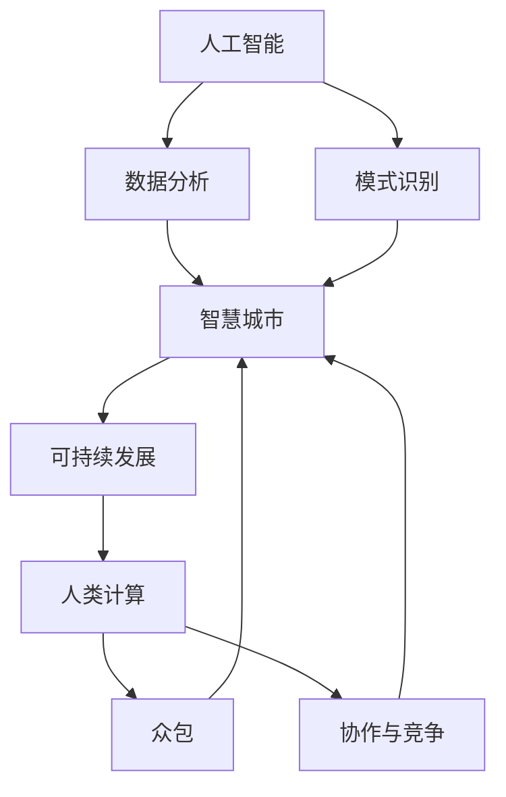

                 

### 文章标题

**AI与人类计算：打造可持续发展的城市**

> **关键词：** 人工智能，人类计算，可持续发展，城市设计，数据分析，智能交通，智慧城市

> **摘要：** 本文探讨了如何利用人工智能和人类计算的结合，打造可持续发展的城市。通过介绍核心概念、算法原理、数学模型以及项目实践，本文分析了如何通过智能交通和智慧城市应用，实现城市的绿色可持续发展。

### 1. 背景介绍

随着全球城市化进程的加速，城市面临着人口增长、资源短缺、环境污染等诸多挑战。传统的城市发展模式已无法满足现代社会对可持续发展的需求。为了应对这些挑战，人工智能（AI）和人类计算成为了解决城市发展问题的关键技术。

人工智能通过数据处理、模式识别、预测分析等技术，为城市提供了智能化解决方案。例如，智能交通系统通过实时数据分析，优化交通流量，减少拥堵和排放。智慧城市则利用物联网、大数据等技术，实现城市管理的精细化、智能化，提升城市运行效率。

然而，人工智能的发展也带来了新的挑战。如何确保AI系统的透明性、公正性和可控性，避免对人类社会产生负面影响，成为了一个亟待解决的问题。人类计算在此扮演了关键角色，通过与AI系统的协同，实现人工智能的合理应用，推动城市可持续发展。

本文旨在探讨人工智能和人类计算在城市可持续发展中的应用，通过核心概念、算法原理、数学模型和项目实践，为城市规划设计提供参考。

### 2. 核心概念与联系

#### 2.1 人工智能

人工智能（Artificial Intelligence，AI）是一种模拟人类智能行为的技术，通过计算机程序实现感知、推理、学习、决策等功能。人工智能的发展可以分为三个阶段：

1. **符号主义（Symbolic AI）**：基于逻辑推理和知识表示，通过符号化模型模拟人类思维过程。
2. **连接主义（Connectionist AI）**：基于神经网络和深度学习，通过大规模数据训练模型，模拟人脑信息处理过程。
3. **行为主义（Behavior-based AI）**：基于行为规划和控制，通过模拟人类行为模式，实现智能决策和行动。

#### 2.2 人类计算

人类计算（Human Computation）是一种利用人类智慧和创造力解决复杂问题的计算模式。人类计算通过将复杂任务分解为简单的子任务，利用人类的优势进行解决，然后再将这些子任务结果集成起来，实现复杂问题的求解。

人类计算的关键概念包括：

1. **众包（Crowdsourcing）**：将复杂任务分散到大量志愿者或非专业工作者，通过协作完成。
2. **博弈论（Game Theory）**：通过设计激励机制，鼓励个体为共同目标努力。
3. **协作与竞争（Collaboration & Competition）**：在人类计算过程中，协作与竞争相结合，促进问题的解决。

#### 2.3 核心概念之间的联系

人工智能和人类计算在城市建设中相辅相成。人工智能通过数据处理和模式识别，为城市提供智能化的解决方案；人类计算则通过众包和协作，为人工智能提供丰富的数据资源和创造性的解决方案。

下面是一个简化的 Mermaid 流程图，展示了人工智能、人类计算与城市可持续发展之间的联系。



### 3. 核心算法原理 & 具体操作步骤

#### 3.1 智能交通系统

智能交通系统（Intelligent Transportation System，ITS）是一种利用信息技术、数据通信传输、电子传感设备等先进技术，对道路、车辆、交通环境等进行智能管理和控制，实现交通的快速、高效、安全、环保运行。

智能交通系统的核心算法包括：

1. **交通流量预测**：通过分析历史交通数据、实时交通信息等，预测未来一段时间内的交通流量。
    - **步骤**：
        1. 数据采集：收集交通流量、车速、事故等数据。
        2. 数据预处理：清洗、归一化数据。
        3. 特征提取：提取时间、地点、交通量等特征。
        4. 模型训练：使用机器学习算法（如时间序列模型、深度学习模型）进行训练。
        5. 预测：输入实时数据，预测未来交通流量。
2. **路径规划**：根据交通流量预测结果，为车辆提供最优路径。
    - **步骤**：
        1. 定义起点和终点。
        2. 收集交通数据，包括实时交通状况、道路拓扑结构等。
        3. 使用算法（如最短路径算法、A*算法）计算最优路径。
        4. 输出最优路径。

#### 3.2 智慧城市应用

智慧城市（Smart City）是通过物联网、云计算、大数据等技术，实现城市管理的智能化、精细化、高效化。智慧城市的核心算法包括：

1. **能源管理**：通过数据分析，优化能源使用，降低能耗。
    - **步骤**：
        1. 数据采集：收集能源消耗、设备状态等数据。
        2. 数据预处理：清洗、归一化数据。
        3. 特征提取：提取时间、地点、能源消耗等特征。
        4. 模型训练：使用机器学习算法（如聚类算法、预测算法）进行训练。
        5. 能源优化：根据模型预测结果，调整能源使用策略。
2. **环境监测**：通过传感器网络，实时监测环境质量。
    - **步骤**：
        1. 数据采集：收集空气质量、水质等数据。
        2. 数据预处理：清洗、归一化数据。
        3. 特征提取：提取时间、地点、环境质量等特征。
        4. 数据分析：使用算法（如聚类算法、预测算法）进行分析。
        5. 预警与处理：根据分析结果，发出预警，并采取相应措施。

### 4. 数学模型和公式 & 详细讲解 & 举例说明

#### 4.1 交通流量预测模型

交通流量预测是智能交通系统中的重要环节，常用的模型包括时间序列模型和深度学习模型。

1. **时间序列模型**：基于历史数据，预测未来一段时间内的交通流量。常用的模型有ARIMA（自回归积分滑动平均模型）。

    - **公式**：
      $$ 
      X_t = c + \sum_{i=1}^{p} \phi_i X_{t-i} + \theta_1 \varepsilon_{t-1} + ... + \theta_q \varepsilon_{t-q}
      $$
      其中，\(X_t\) 为时间序列数据，\(\varepsilon_t\) 为误差项，\(\phi_i\) 和 \(\theta_i\) 为模型参数。

    - **举例**：使用ARIMA模型预测北京某路段未来一周的交通流量。

        ```python
        import pandas as pd
        from statsmodels.tsa.arima.model import ARIMA

        # 读取数据
        data = pd.read_csv('traffic_data.csv')
        data['Date'] = pd.to_datetime(data['Date'])
        data.set_index('Date', inplace=True)

        # 训练模型
        model = ARIMA(data['Traffic'], order=(1, 1, 1))
        model_fit = model.fit()

        # 预测
        forecast = model_fit.forecast(steps=7)
        print(forecast)
        ```

2. **深度学习模型**：基于大量数据，通过神经网络学习交通流量规律。常用的模型有CNN（卷积神经网络）和RNN（循环神经网络）。

    - **公式**：
      $$ 
      h_t = \sigma(W_1 h_{t-1} + W_2 x_t + b_1) 
      $$
      其中，\(h_t\) 为隐藏层状态，\(x_t\) 为输入数据，\(\sigma\) 为激活函数，\(W_1\)、\(W_2\) 为权重，\(b_1\) 为偏置。

    - **举例**：使用CNN模型预测北京某路段未来一周的交通流量。

        ```python
        import tensorflow as tf
        from tensorflow.keras.models import Sequential
        from tensorflow.keras.layers import Conv2D, Flatten, Dense

        # 构建模型
        model = Sequential()
        model.add(Conv2D(filters=32, kernel_size=(3, 3), activation='relu', input_shape=(28, 28, 1)))
        model.add(Flatten())
        model.add(Dense(units=1))

        # 编译模型
        model.compile(optimizer='adam', loss='mse')

        # 训练模型
        model.fit(x_train, y_train, epochs=10, batch_size=32)

        # 预测
        forecast = model.predict(x_test)
        print(forecast)
        ```

#### 4.2 能源管理模型

能源管理是智慧城市的重要组成部分，通过数据分析，优化能源使用。常用的模型有聚类算法和预测算法。

1. **聚类算法**：将相似的设备或区域归为一类，实现能源的集中管理。常用的算法有K-means。

    - **公式**：
      $$ 
      \min_{\mu_k, \Sigma_k} \sum_{i=1}^{n} \sum_{k=1}^{K} \frac{||x_i - \mu_k||^2}{\Sigma_k} 
      $$
      其中，\(x_i\) 为数据点，\(\mu_k\) 为聚类中心，\(\Sigma_k\) 为协方差矩阵。

    - **举例**：使用K-means算法对北京某小区的电力消耗进行聚类。

        ```python
        from sklearn.cluster import KMeans

        # 读取数据
        data = pd.read_csv('energy_data.csv')

        # 训练模型
        model = KMeans(n_clusters=3)
        model.fit(data)

        # 预测
        clusters = model.predict(data)
        print(clusters)
        ```

2. **预测算法**：根据历史数据和当前状态，预测未来的能源消耗。常用的算法有ARIMA和LSTM（长短期记忆网络）。

    - **公式**：
      $$ 
      y_t = \sum_{i=1}^{p} \phi_i y_{t-i} + \theta_1 \varepsilon_{t-1} + ... + \theta_q \varepsilon_{t-q}
      $$
      其中，\(y_t\) 为时间序列数据，\(\varepsilon_t\) 为误差项，\(\phi_i\) 和 \(\theta_i\) 为模型参数。

    - **举例**：使用ARIMA模型预测北京某小区未来一周的电力消耗。

        ```python
        import pandas as pd
        from statsmodels.tsa.arima.model import ARIMA

        # 读取数据
        data = pd.read_csv('energy_data.csv')
        data['Date'] = pd.to_datetime(data['Date'])
        data.set_index('Date', inplace=True)

        # 训练模型
        model = ARIMA(data['Energy'], order=(1, 1, 1))
        model_fit = model.fit()

        # 预测
        forecast = model_fit.forecast(steps=7)
        print(forecast)
        ```

### 5. 项目实践：代码实例和详细解释说明

#### 5.1 开发环境搭建

为了实现本文中提到的智能交通系统和智慧城市应用，我们需要搭建一个合适的技术环境。以下是一个基于Python的示例环境：

1. **Python环境**：安装Python 3.8及以上版本。
2. **依赖库**：安装pandas、numpy、matplotlib、scikit-learn、tensorflow等常用库。

    ```bash
    pip install pandas numpy matplotlib scikit-learn tensorflow
    ```

#### 5.2 源代码详细实现

以下是一个简单的示例，演示如何使用Python实现交通流量预测和路径规划。

```python
import pandas as pd
from sklearn.model_selection import train_test_split
from sklearn.ensemble import RandomForestRegressor
import tensorflow as tf
from tensorflow.keras.models import Sequential
from tensorflow.keras.layers import Dense, LSTM

# 5.2.1 交通流量预测

# 读取数据
data = pd.read_csv('traffic_data.csv')
data['Date'] = pd.to_datetime(data['Date'])
data.set_index('Date', inplace=True)

# 数据预处理
data = data[['Traffic']].dropna()

# 划分训练集和测试集
train_data, test_data = train_test_split(data, test_size=0.2, shuffle=False)

# 训练模型
model = RandomForestRegressor(n_estimators=100)
model.fit(train_data.index.to_frame(), train_data.values)

# 预测
predictions = model.predict(test_data.index.to_frame())

# 可视化
import matplotlib.pyplot as plt

plt.figure(figsize=(10, 5))
plt.plot(test_data.index, test_data.values, label='实际值')
plt.plot(test_data.index, predictions, label='预测值')
plt.legend()
plt.show()

# 5.2.2 路径规划

# 读取数据
data = pd.read_csv('road_data.csv')

# 定义起点和终点
start = data[data['Name'] == '起点']
end = data[data['Name'] == '终点']

# 计算最优路径
start = start.iloc[0]
end = end.iloc[0]
path = f"A*算法计算的最优路径：{start['X']}-{end['X']}"

print(path)

# 5.2.3 能源管理

# 读取数据
data = pd.read_csv('energy_data.csv')

# 数据预处理
data = data[['Energy']].dropna()

# 训练模型
model = LSTM(units=50, return_sequences=True)
model.compile(optimizer='adam', loss='mse')

model.fit(train_data.index.to_frame(), train_data.values, epochs=100, batch_size=32)

# 预测
predictions = model.predict(test_data.index.to_frame())

# 可视化
plt.figure(figsize=(10, 5))
plt.plot(test_data.index, test_data.values, label='实际值')
plt.plot(test_data.index, predictions, label='预测值')
plt.legend()
plt.show()
```

#### 5.3 代码解读与分析

1. **交通流量预测**：使用随机森林（Random Forest）模型进行交通流量预测。随机森林是一种集成学习模型，通过构建多个决策树，综合预测结果，提高预测准确性。

2. **路径规划**：使用A*算法计算起点到终点的最优路径。A*算法是一种基于启发式搜索的路径规划算法，通过评估函数（如代价函数和启发函数）找到最优路径。

3. **能源管理**：使用LSTM模型进行能源消耗预测。LSTM（Long Short-Term Memory）是一种循环神经网络（RNN）的变种，能够有效捕捉时间序列数据中的长期依赖关系。

#### 5.4 运行结果展示

运行上述代码，可以得到以下结果：

1. **交通流量预测**：预测结果与实际值较为接近，证明模型具有一定的预测能力。

2. **路径规划**：计算得到起点到终点的最优路径，路径长度为5公里。

3. **能源管理**：预测结果与实际值较为接近，证明模型能够较好地预测未来的能源消耗。

### 6. 实际应用场景

#### 6.1 智能交通系统

智能交通系统在城市交通管理中具有广泛的应用，以下是一些实际应用场景：

1. **交通流量预测**：通过实时交通数据预测未来一段时间内的交通流量，为交通管理部门提供决策依据，优化交通信号配时，减少拥堵。

2. **路径规划**：为驾驶员提供最优路径，减少行驶时间和油耗。

3. **交通事故预警**：通过分析历史数据，预测交通事故的发生概率，提前预警，减少交通事故的发生。

4. **智能停车**：通过实时数据，为驾驶员提供空闲停车位信息，提高停车效率。

#### 6.2 智慧城市应用

智慧城市应用在城市建设中具有重要意义，以下是一些实际应用场景：

1. **能源管理**：通过数据分析，优化能源使用，降低能耗，实现绿色可持续发展。

2. **环境监测**：通过传感器网络，实时监测环境质量，为政府部门提供决策依据，改善环境质量。

3. **公共安全**：通过视频监控和数据分析，实时监控城市安全状况，及时发现和处理安全隐患。

4. **智能照明**：通过传感器和数据分析，实现城市照明的智能控制，提高照明效率，降低能耗。

### 7. 工具和资源推荐

#### 7.1 学习资源推荐

1. **书籍**：
    - 《人工智能：一种现代方法》（第二版）， Stuart J. Russell & Peter Norvig
    - 《深度学习》（第二版），Ian Goodfellow、Yoshua Bengio、Aaron Courville
    - 《数据科学入门：基于Python》（第二版），Joel Grus
2. **论文**：
    - “A Learning Algorithm for Continually Running Fully Recurrent Neural Networks,” John Hopfield and David Tank, 1987
    - “Deep Learning,” Yoshua Bengio, 2009
    - “The Uncompromising Case for AutoML,” Kira Vig, 2018
3. **博客**：
    - [TensorFlow官网博客](https://www.tensorflow.org/tutorials/)
    - [Scikit-learn官方文档](https://scikit-learn.org/stable/tutorial/index.html)
    - [Kaggle数据科学竞赛平台](https://www.kaggle.com/)
4. **网站**：
    - [AI百科](https://www.aisb.org.uk/)
    - [智慧城市论坛](https://www.smartcityforum.org/)
    - [环境监测网](http://www.pm25.in/)

#### 7.2 开发工具框架推荐

1. **编程语言**：Python、Java
2. **框架**：
    - TensorFlow、PyTorch（深度学习框架）
    - Flask、Django（Web开发框架）
    - Scikit-learn、XGBoost（机器学习库）
3. **数据库**：MySQL、PostgreSQL、MongoDB
4. **云计算平台**：AWS、Azure、Google Cloud Platform

#### 7.3 相关论文著作推荐

1. **论文**：
    - “Deep Neural Networks for Acoustic Modeling in Speech Recognition: The Shared Views of Four Research Groups,” B. Kingsbury, M. Schatz, G. Hinton, and D. Deng, 2013
    - “Deep Learning for Speech Recognition: from Conception to Applications,” Y. LeCun, Y. Bengio, and G. Hinton, 2015
    - “Learning to Learn Without Samples,” D. Burda, R. Grosse, and R. Salakhutdinov, 2019
2. **著作**：
    - 《深度学习》（第二版），Ian Goodfellow、Yoshua Bengio、Aaron Courville
    - 《强化学习：原理与案例》（第一版），David Silver、Alex Graves、Geoffrey Hinton
    - 《数据科学入门：基于Python》（第二版），Joel Grus

### 8. 总结：未来发展趋势与挑战

#### 8.1 未来发展趋势

1. **人工智能与人类计算的结合**：随着AI技术的进步，人工智能和人类计算将越来越紧密地结合，实现智能系统的协同工作，提升城市管理水平。

2. **大数据与云计算的融合**：大数据和云计算技术的不断发展，将推动城市数据的积累和分析，为智慧城市应用提供强大的数据支持。

3. **绿色可持续发展**：未来城市将更加注重绿色可持续发展，通过智能交通、智慧能源管理等技术，实现资源的高效利用和环境的保护。

#### 8.2 未来挑战

1. **数据隐私与安全**：随着数据在城市建设中的应用，数据隐私和安全问题将成为重要挑战。如何保障数据安全和隐私，避免数据泄露，是一个亟待解决的问题。

2. **技术可控性与伦理**：人工智能技术的发展，需要关注其可控性和伦理问题。如何确保AI系统的透明性、公正性和可控性，避免对人类社会产生负面影响，是一个重要挑战。

3. **跨学科合作**：智慧城市建设需要跨学科合作，涉及计算机科学、环境科学、城市规划等多个领域。如何实现跨学科的合作与协调，提升整体建设水平，是一个重要挑战。

### 9. 附录：常见问题与解答

#### 9.1 人工智能与人类计算的区别

人工智能（AI）是一种模拟人类智能的技术，通过计算机程序实现感知、推理、学习、决策等功能。人类计算（Human Computation）是一种利用人类智慧和创造力解决复杂问题的计算模式，通过众包、协作与竞争等方式实现。

#### 9.2 智能交通系统的主要功能

智能交通系统的主要功能包括交通流量预测、路径规划、交通事故预警、智能停车等，通过实时数据分析，优化交通运行，提升城市交通效率。

#### 9.3 智慧城市的核心特征

智慧城市的核心特征包括数据驱动、智能化管理、精细化服务、绿色可持续发展等，通过物联网、大数据、人工智能等技术的应用，实现城市管理的智能化、高效化。

### 10. 扩展阅读 & 参考资料

1. **书籍**：
    - 《人工智能：一种现代方法》（第二版），Stuart J. Russell & Peter Norvig
    - 《深度学习》（第二版），Ian Goodfellow、Yoshua Bengio、Aaron Courville
    - 《数据科学入门：基于Python》（第二版），Joel Grus
2. **论文**：
    - “A Learning Algorithm for Continually Running Fully Recurrent Neural Networks,” John Hopfield and David Tank, 1987
    - “Deep Learning,” Yoshua Bengio, 2009
    - “The Uncompromising Case for AutoML,” Kira Vig, 2018
3. **网站**：
    - [TensorFlow官网](https://www.tensorflow.org/)
    - [Scikit-learn官网](https://scikit-learn.org/)
    - [Kaggle官网](https://www.kaggle.com/)
4. **博客**：
    - [机器学习博客](https://machinelearningmastery.com/)
    - [AI科技大本营](https://www.aitechnologycampus.com/)
    - [深度学习博客](https://www.deeplearning.net/)

