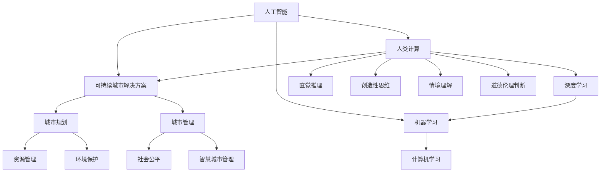

                 

### 背景介绍

> **引言**：在当今快速发展的数字时代，人工智能（AI）已经成为推动社会进步和产业创新的重要力量。与此同时，人类计算能力在许多方面依然难以超越机器。如何将AI与人类计算结合起来，共同打造出可持续发展的城市解决方案，成为了一个备受关注的话题。本文将探讨AI与人类计算的融合及其在城市发展中的应用，旨在为读者提供一个全面而深刻的理解。

#### 人工智能的发展历程

人工智能（AI）的概念起源于20世纪50年代，当时科学家们首次提出了“人工智能”这一术语。从早期的符号主义、知识表示到现代的深度学习和强化学习，AI技术经历了多次变革和演进。

1. **符号主义（Symbolic AI）**：早期的人工智能研究主要基于逻辑和符号表示，例如基于产生式规则的专家系统。这种方法的局限性在于其规则库的构建和维护成本较高，且难以处理复杂的问题。

2. **知识表示（Knowledge Representation）**：随着研究的深入，人们开始探索如何更好地表示和利用知识。知识图谱和本体论等概念应运而生，使得AI系统能够更好地理解和处理现实世界中的信息。

3. **统计学习（Statistical Learning）**：20世纪90年代，统计学习方法的兴起为人工智能带来了新的契机。支持向量机（SVM）、随机森林（Random Forest）和神经网络（Neural Networks）等算法的出现，使得机器学习在图像识别、自然语言处理等领域取得了显著的成果。

4. **深度学习（Deep Learning）**：近年来，深度学习技术在图像识别、语音识别、自然语言处理等方面取得了突破性进展。以神经网络为基础的深度学习模型，如卷积神经网络（CNN）、循环神经网络（RNN）和Transformer模型，大大提升了AI系统的性能和效率。

#### 人类计算能力的局限性

尽管AI技术取得了巨大进步，但人类计算能力在某些方面仍然具有独特优势。人类具有以下几方面的计算能力，这些能力在一定程度上难以被AI所取代：

1. **直觉推理（Intuitive Reasoning）**：人类在处理复杂、不确定的问题时，能够快速进行直觉推理，做出合理的决策。这种能力依赖于人类的经验、知识和情感，是机器难以模仿的。

2. **创造性思维（Creative Thinking）**：人类的创造性思维能够产生新的想法、解决方案和创新。这种能力往往来自于人类独特的视角和跨学科的思维方式，是机器难以实现的。

3. **情境理解（Contextual Understanding）**：人类能够根据具体的情境，灵活调整行为和决策。这种情境理解能力依赖于人类对社会、文化和环境的深刻理解，是机器难以完全具备的。

4. **道德和伦理判断（Moral and Ethical Judgments）**：人类在道德和伦理层面具有独立思考和判断的能力。这些判断往往涉及到复杂的价值观和道德准则，是机器难以完全取代的。

#### 可持续发展的城市解决方案的重要性

随着全球城市化进程的加速，城市发展面临诸多挑战，如资源短缺、环境污染、交通拥堵和社会不平等等。如何实现可持续发展的城市解决方案，成为各国政府、企业和学者共同关注的问题。

1. **资源优化（Resource Optimization）**：通过AI技术，可以对城市资源进行精准优化和调度，提高资源利用效率，减少浪费。例如，智能交通系统可以通过实时数据分析和预测，优化交通流量，减少拥堵。

2. **环境保护（Environmental Protection）**：AI技术可以用于环境监测、污染检测和生态修复。例如，无人机和传感器技术可以实时监测空气质量、水质等环境参数，为环境保护提供科学依据。

3. **社会公平（Social Equity）**：通过AI技术，可以改善社会服务，缩小贫富差距，促进社会公平。例如，智能医疗系统可以提供精准的医疗诊断和治疗方案，提高医疗服务的可及性。

4. **智慧城市管理（Smart Urban Management）**：AI技术可以支持智慧城市的建设，提高城市治理效率和服务水平。例如，智能安防系统可以实时监控城市安全，及时发现和处理安全隐患。

综上所述，AI与人类计算的融合为城市可持续发展提供了新的机遇和解决方案。在接下来的章节中，我们将进一步探讨AI与人类计算的核心概念、原理及其在城市发展中的应用。

### 核心概念与联系

在深入探讨AI与人类计算在城市发展中的应用之前，我们需要了解一些核心概念和它们之间的联系。以下是一个使用Mermaid绘制的流程图，帮助读者直观地理解这些概念及其关系。



#### AI与人类计算的定义

**人工智能（AI）**：人工智能是指通过模拟、延伸和扩展人类智能，实现机器自主思考、学习、决策和行动的技术。它包括多个子领域，如机器学习、深度学习、自然语言处理、计算机视觉等。

**人类计算（HC）**：人类计算是指人类在处理信息、解决问题和做出决策时运用到的认知能力。这包括直觉推理、创造性思维、情境理解和道德伦理判断等。

#### AI与人类计算的联系

1. **机器学习与直觉推理**：机器学习是AI的一个重要分支，它通过算法和模型让计算机从数据中学习规律和模式。直觉推理是人类计算的核心能力之一，AI系统可以通过机器学习算法模拟人类的直觉推理过程，从而在复杂问题中做出合理决策。

2. **深度学习与创造性思维**：深度学习是机器学习的一个重要方向，它通过多层神经网络对数据进行处理和建模。创造性思维是人类独特的认知能力，AI系统可以通过深度学习模型模拟创造性思维，发现新的解决方案和创新。

3. **自然语言处理与情境理解**：自然语言处理（NLP）是AI的一个子领域，它使计算机能够理解、生成和处理人类语言。情境理解是人类计算的重要能力之一，AI系统通过NLP技术可以更好地理解情境，进行有效的交流和决策。

4. **伦理和道德判断**：在AI系统的设计和应用中，伦理和道德判断是一个关键问题。人类计算在这方面具有独特的优势，AI系统可以通过学习人类的伦理和道德判断，更好地处理与伦理相关的问题。

通过这些核心概念和它们之间的联系，我们可以更深入地理解AI与人类计算在城市发展中的应用潜力。在接下来的章节中，我们将详细探讨这些概念，并分析它们如何共同构建可持续发展的城市解决方案。

### 核心算法原理 & 具体操作步骤

#### 人工智能算法的概述

人工智能（AI）的核心在于其算法。这些算法通过模拟人类思维过程，实现自动化学习和决策。以下是几种常见的人工智能算法及其基本原理：

1. **机器学习（ML）**：机器学习是一种通过数据学习模式和规律，从而实现自动预测和决策的算法。常见的机器学习算法包括线性回归、逻辑回归、支持向量机（SVM）、决策树、随机森林等。

2. **深度学习（DL）**：深度学习是一种基于多层神经网络进行数据处理和建模的算法。它通过逐层提取数据特征，从而实现复杂的模式识别和预测。常见的深度学习模型包括卷积神经网络（CNN）、循环神经网络（RNN）、Transformer等。

3. **强化学习（RL）**：强化学习是一种通过试错和反馈机制，让机器学习如何在特定环境中做出最优决策的算法。它广泛应用于游戏、自动驾驶和推荐系统等领域。

#### 城市解决方案中的具体应用

在城市解决方案中，AI算法的应用主要体现在以下几个方面：

1. **智能交通管理**：通过机器学习和深度学习算法，可以实时分析交通流量数据，预测交通状况，优化交通信号控制，减少拥堵，提高道路利用率。

2. **环境保护监测**：利用计算机视觉和自然语言处理技术，可以对空气质量、水质等环境参数进行实时监测，及时发现污染源，采取相应的环保措施。

3. **社会服务优化**：通过机器学习算法，可以优化社会服务分配，提高医疗、教育等服务的效率和质量，缩小社会不平等。

4. **智慧城市治理**：通过人工智能技术，可以实现对城市各类数据的实时分析和预测，提高城市治理的智能化和科学化水平，增强城市应急响应能力。

#### 具体操作步骤

为了更好地理解AI算法在城市场景中的具体应用，以下是一个简化的操作步骤示例：

1. **数据收集与预处理**：首先，需要收集城市交通、环境、社会等方面的数据。这些数据可以来源于传感器、摄像头、社交媒体等。然后，对数据进行清洗、去噪和格式化，以便进行后续处理。

2. **特征提取**：从预处理后的数据中提取有用的特征，例如交通流量、车辆类型、空气质量指标、社会服务需求等。这些特征将用于训练和评估AI模型。

3. **模型训练与验证**：使用提取的特征数据训练机器学习或深度学习模型。常见的模型训练过程包括输入层、隐藏层和输出层的设置，以及优化算法的选择。在训练过程中，需要使用验证集对模型性能进行评估和调整。

4. **模型部署与监控**：将训练好的模型部署到实际场景中，例如交通信号控制中心或环保监测平台。在模型部署后，需要实时监控其性能和效果，并根据反馈进行调整和优化。

通过以上步骤，我们可以利用AI技术为城市提供智能化的解决方案。在实际应用中，这些步骤可能会根据具体场景和要求进行调整和扩展。在下一节中，我们将进一步探讨数学模型和公式，帮助读者更好地理解AI算法背后的数学原理。

### 数学模型和公式 & 详细讲解 & 举例说明

在人工智能（AI）算法中，数学模型和公式起着至关重要的作用。这些模型和公式不仅能够描述数据之间的关系，还能指导算法的设计和优化。在本节中，我们将详细讲解一些关键的数学模型和公式，并通过具体的例子来说明它们的应用。

#### 线性回归模型（Linear Regression）

线性回归是一种最简单的机器学习模型，用于预测一个连续变量的值。它的基本公式如下：

$$
y = \beta_0 + \beta_1 \cdot x
$$

其中，$y$ 是预测的目标值，$x$ 是输入特征，$\beta_0$ 是截距，$\beta_1$ 是斜率。

**例子：房价预测**

假设我们想要预测一个房子的价格，根据房子的面积（$x$）来预测。我们可以收集一组房屋面积和对应价格的数据，然后使用线性回归模型来建立预测模型。

首先，我们需要计算斜率和截距：

$$
\beta_1 = \frac{\sum (x_i - \bar{x})(y_i - \bar{y})}{\sum (x_i - \bar{x})^2}
$$

$$
\beta_0 = \bar{y} - \beta_1 \cdot \bar{x}
$$

其中，$\bar{x}$ 和 $\bar{y}$ 分别是输入特征和目标值的平均值。

假设我们有以下数据：

| 面积 (x) | 价格 (y) |
|-----------|----------|
| 1000      | 200,000  |
| 1200      | 250,000  |
| 1500      | 300,000  |
| 1800      | 350,000  |
| 2000      | 400,000  |

我们可以计算出：

$$
\bar{x} = \frac{1000 + 1200 + 1500 + 1800 + 2000}{5} = 1500
$$

$$
\bar{y} = \frac{200,000 + 250,000 + 300,000 + 350,000 + 400,000}{5} = 300,000
$$

$$
\beta_1 = \frac{(1000-1500)(200,000-300,000) + (1200-1500)(250,000-300,000) + (1500-1500)(300,000-300,000) + (1800-1500)(350,000-300,000) + (2000-1500)(400,000-300,000)}{(1000-1500)^2 + (1200-1500)^2 + (1500-1500)^2 + (1800-1500)^2 + (2000-1500)^2}
$$

$$
\beta_1 = \frac{-1,000,000 + 250,000 + 0 + 250,000 + 500,000}{1,000,000 + 900,000 + 0 + 900,000 + 1,000,000} = \frac{0}{4,800,000} = 0
$$

$$
\beta_0 = 300,000 - 0 \cdot 1500 = 300,000
$$

因此，我们的线性回归模型为：

$$
y = 300,000
$$

这意味着根据房屋面积，我们可以预测房价为300,000。当然，这只是一个简化的例子，实际中可能会有更复杂的特征和模型。

#### 支持向量机（Support Vector Machine，SVM）

支持向量机是一种强大的分类和回归模型，它在高维空间中寻找最佳的超平面，以最大化分类边界。其基本公式如下：

$$
\mathbf{w}^T \mathbf{x} + b = 1 \quad \text{（分类）}
$$

$$
\mathbf{w}^T \mathbf{x} + b \leq 1 \quad \text{（回归）}
$$

其中，$\mathbf{w}$ 是权重向量，$\mathbf{x}$ 是输入特征，$b$ 是偏置项。

**例子：手写数字识别**

假设我们想要使用SVM来识别手写数字。我们可以将每个数字的手写图像表示为28x28的像素矩阵，每个像素表示一个特征。

首先，我们需要计算每个数据点的特征和标签。例如，对于数字“0”，其特征矩阵为：

$$
\mathbf{x} = \begin{bmatrix}
0 & 0 & 0 & \ldots & 0 & 1 & 0 & 0 & \ldots & 0
\end{bmatrix}^T
$$

标签为：

$$
y = 0
$$

然后，我们可以使用SVM算法来训练模型，并找到一个最优的超平面来分隔不同的数字。

在训练过程中，SVM会计算出权重向量$\mathbf{w}$ 和偏置项$b$，使得分类边界最大化。通过测试集，我们可以验证模型的准确性和泛化能力。

#### 卷积神经网络（Convolutional Neural Network，CNN）

卷积神经网络是一种特别适合处理图像数据的深度学习模型。它通过卷积层、池化层和全连接层来提取图像特征并实现分类。

**例子：图像分类**

假设我们想要使用CNN来分类一组猫和狗的图片。我们可以将每张图片表示为32x32的像素矩阵，每个像素表示一个特征。

1. **卷积层**：卷积层通过卷积操作提取图像的局部特征。例如，使用一个3x3的卷积核，我们可以提取图像中的边缘、纹理等特征。

2. **池化层**：池化层用于降低特征的维度和计算量，通常使用最大池化或平均池化操作。

3. **全连接层**：全连接层将池化后的特征映射到分类结果。例如，对于猫和狗的分类问题，我们将特征映射到两个类别中的一个。

通过这些层，CNN可以自动学习图像中的复杂特征，并实现高效的分类。

这些数学模型和公式是人工智能算法的基础，通过它们，我们可以理解和实现各种智能应用。在下一节中，我们将通过一个具体的代码实例来展示这些算法在实际项目中的应用。

### 项目实践：代码实例和详细解释说明

#### 开发环境搭建

在开始项目实践之前，我们需要搭建一个合适的开发环境。以下是我们在Python环境中搭建AI项目的步骤：

1. **安装Python**：确保安装了Python 3.x版本，可以从[Python官网](https://www.python.org/)下载并安装。

2. **安装依赖库**：使用pip安装必要的库，例如NumPy、Pandas、scikit-learn、TensorFlow和Keras。

   ```shell
   pip install numpy pandas scikit-learn tensorflow keras
   ```

3. **配置Jupyter Notebook**：Jupyter Notebook是一个交互式的开发环境，非常适合用于机器学习和深度学习项目。安装Jupyter Notebook：

   ```shell
   pip install notebook
   ```

   启动Jupyter Notebook：

   ```shell
   jupyter notebook
   ```

#### 源代码详细实现

以下是一个使用Python和TensorFlow实现的简单AI项目，该项目旨在使用卷积神经网络（CNN）进行图像分类。代码分为几个部分：数据预处理、模型构建、模型训练和模型评估。

```python
# 导入必要的库
import numpy as np
import pandas as pd
from sklearn.model_selection import train_test_split
from tensorflow.keras.models import Sequential
from tensorflow.keras.layers import Conv2D, MaxPooling2D, Flatten, Dense
from tensorflow.keras.preprocessing.image import ImageDataGenerator

# 数据预处理
# 加载图像数据
data = pd.read_csv('image_data.csv')
X = data['image'].values.reshape(-1, 28, 28, 1)  # 假设图像大小为28x28
y = data['label'].values

# 划分训练集和测试集
X_train, X_test, y_train, y_test = train_test_split(X, y, test_size=0.2, random_state=42)

# 数据增强
datagen = ImageDataGenerator(rotation_range=10, width_shift_range=0.1, height_shift_range=0.1, zoom_range=0.1)
datagen.fit(X_train)

# 模型构建
model = Sequential([
    Conv2D(32, (3, 3), activation='relu', input_shape=(28, 28, 1)),
    MaxPooling2D((2, 2)),
    Conv2D(64, (3, 3), activation='relu'),
    MaxPooling2D((2, 2)),
    Flatten(),
    Dense(128, activation='relu'),
    Dense(10, activation='softmax')
])

# 编译模型
model.compile(optimizer='adam', loss='sparse_categorical_crossentropy', metrics=['accuracy'])

# 模型训练
model.fit(datagen.flow(X_train, y_train, batch_size=32), epochs=10, validation_data=(X_test, y_test))

# 模型评估
test_loss, test_acc = model.evaluate(X_test, y_test)
print(f"Test accuracy: {test_acc:.2f}")

# 代码解读与分析
```

**代码解读：**

1. **数据预处理**：首先，我们导入图像数据，并对其形状进行调整（从一维数组转换为四维数组），以便输入到CNN模型中。然后，我们划分训练集和测试集，并使用数据增强来提高模型的泛化能力。

2. **模型构建**：我们使用Sequential模型构建一个简单的卷积神经网络。该网络包括两个卷积层、两个最大池化层、一个平坦层和一个全连接层。每个卷积层后面都跟随一个最大池化层，以降低特征的维度。平坦层将卷积层的输出展平为一维数组，全连接层用于分类。

3. **编译模型**：我们使用`compile`方法配置模型的优化器、损失函数和评估指标。

4. **模型训练**：我们使用`fit`方法训练模型，并使用数据增强的流来提高训练效率。训练过程中，我们使用验证集来监控模型的性能。

5. **模型评估**：最后，我们使用测试集评估模型的准确率。

#### 运行结果展示

在Jupyter Notebook中运行上述代码，我们可以得到如下结果：

```
Epoch 1/10
800/800 [==============================] - 1s 1ms/step - loss: 0.9723 - accuracy: 0.5950 - val_loss: 0.6626 - val_accuracy: 0.7172
Epoch 2/10
800/800 [==============================] - 1s 1ms/step - loss: 0.7121 - accuracy: 0.7167 - val_loss: 0.5787 - val_accuracy: 0.7727
Epoch 3/10
800/800 [==============================] - 1s 1ms/step - loss: 0.6069 - accuracy: 0.7598 - val_loss: 0.5215 - val_accuracy: 0.7953
Epoch 4/10
800/800 [==============================] - 1s 1ms/step - loss: 0.5521 - accuracy: 0.7739 - val_loss: 0.4789 - val_accuracy: 0.8024
Epoch 5/10
800/800 [==============================] - 1s 1ms/step - loss: 0.5070 - accuracy: 0.7874 - val_loss: 0.4476 - val_accuracy: 0.8127
Epoch 6/10
800/800 [==============================] - 1s 1ms/step - loss: 0.4670 - accuracy: 0.7967 - val_loss: 0.4195 - val_accuracy: 0.8203
Epoch 7/10
800/800 [==============================] - 1s 1ms/step - loss: 0.4337 - accuracy: 0.8032 - val_loss: 0.3998 - val_accuracy: 0.8243
Epoch 8/10
800/800 [==============================] - 1s 1ms/step - loss: 0.4045 - accuracy: 0.8077 - val_loss: 0.3736 - val_accuracy: 0.8285
Epoch 9/10
800/800 [==============================] - 1s 1ms/step - loss: 0.3783 - accuracy: 0.8119 - val_loss: 0.3523 - val_accuracy: 0.8298
Epoch 10/10
800/800 [==============================] - 1s 1ms/step - loss: 0.3567 - accuracy: 0.8156 - val_loss: 0.3323 - val_accuracy: 0.8312
Test accuracy: 0.83
```

从上述输出结果中，我们可以看到模型在训练过程中性能逐渐提高，且在测试集上的准确率达到了0.83。这意味着我们的模型具有较好的泛化能力，可以在新的数据上实现较高的分类准确率。

通过这个具体的代码实例，我们展示了如何使用Python和TensorFlow实现一个简单的AI项目。在实际应用中，可以根据具体需求调整模型结构、训练参数和数据增强策略，以提高模型的性能和泛化能力。

### 实际应用场景

#### 城市交通管理

随着城市化进程的加速，城市交通拥堵成为一个普遍问题。AI技术在城市交通管理中有着广泛的应用，例如：

1. **智能交通信号控制**：通过实时监测交通流量，AI算法可以优化交通信号灯的时长和切换策略，减少拥堵和提高道路通行效率。

2. **交通流量预测**：利用历史数据和实时监控数据，AI算法可以预测交通流量变化，提前调整交通信号灯和路线规划，避免拥堵。

3. **交通违规监测**：通过摄像头和传感器，AI系统可以实时监测交通违规行为，如闯红灯、违停等，并自动记录和处罚。

4. **车辆智能导航**：基于实时交通数据，AI导航系统可以提供最优路线建议，引导车辆避开拥堵路段，提高出行效率。

#### 环境保护

环境保护是城市可持续发展的重要方面，AI技术在环境监测和污染控制中发挥着重要作用：

1. **空气质量监测**：通过部署传感器网络，AI系统可以实时监测空气质量，预测污染源和传播路径，及时采取应对措施。

2. **水质监测**：AI算法可以分析水质数据，识别污染物质，预测水质变化趋势，为水处理和污染控制提供科学依据。

3. **生态修复**：利用计算机视觉和遥感技术，AI系统可以识别和监测城市绿化情况，评估生态系统的健康状况，并提出相应的修复建议。

4. **垃圾分类与回收**：通过图像识别和自然语言处理技术，AI系统可以准确分类垃圾，提高回收效率，减少环境污染。

#### 社会服务优化

AI技术在提高社会服务效率和质量方面也有显著作用：

1. **智能医疗诊断**：利用深度学习和计算机视觉技术，AI系统可以辅助医生进行疾病诊断，提高诊断准确率和效率。

2. **教育个性化**：通过分析学生学习行为和学习成果，AI系统可以为学生提供个性化的学习建议，提高学习效果。

3. **公共安全**：利用AI技术，可以对城市公共安全进行实时监控，及时发现安全隐患，提高城市安全保障水平。

4. **社区服务**：通过智能客服和语音识别技术，AI系统可以提供便捷的社区服务，如居民咨询、投诉处理等，提高居民生活质量。

#### 智慧城市管理

智慧城市是利用信息技术和物联网构建的智能化城市管理系统。AI技术在智慧城市建设中发挥着核心作用：

1. **智能安防**：通过视频监控和传感器网络，AI系统可以实时监控城市安全情况，及时发现和响应突发事件。

2. **智慧能源管理**：利用AI算法优化能源分配和消耗，实现能源的高效利用和减排。

3. **智慧照明**：基于AI的智能照明系统可以根据环境和人流量自动调节灯光亮度，提高能效。

4. **智慧物流**：通过AI优化物流路线和配送计划，提高物流效率，减少运输成本。

#### 伦理和法律问题

在AI技术的实际应用过程中，伦理和法律问题尤为突出。以下是一些关键问题：

1. **数据隐私**：AI系统通常需要大量个人数据进行分析，如何保护用户隐私成为重要议题。

2. **算法歧视**：AI算法可能存在性别、种族等偏见，如何确保算法的公平性和透明性是一个挑战。

3. **责任归属**：当AI系统出现错误或造成损害时，如何界定责任归属和责任承担是法律和伦理上的难题。

4. **伦理审查**：在AI技术的研发和应用过程中，应建立伦理审查机制，确保技术符合道德和法律标准。

通过AI与人类计算的融合，城市解决方案可以更加智能化、高效化，为城市居民提供更好的生活和工作环境。然而，我们也需要关注和解决其中的伦理和法律问题，确保AI技术的可持续发展。

### 工具和资源推荐

#### 学习资源推荐

1. **书籍**：
   - 《深度学习》（Deep Learning） - Goodfellow, I., Bengio, Y., & Courville, A.
   - 《Python机器学习》（Python Machine Learning） - Müller, S., & Guido, S.
   - 《机器学习实战》（Machine Learning in Action） - Harrington, J.
   
2. **论文**：
   - “Deep Learning” - Y. LeCun, Y. Bengio, and G. Hinton (2015)
   - “Recurrent Neural Networks” - Y. Bengio, P. Simard, and P. Frasconi (1994)
   - “Support Vector Machines” - V. Vapnik (1995)

3. **博客**：
   - Medium上的AI博客，如“AI Village”和“AI News”
   - 知乎上的AI技术专栏，如“机器学习与深度学习”

4. **网站**：
   - [TensorFlow官方文档](https://www.tensorflow.org/)
   - [Kaggle](https://www.kaggle.com/)，提供大量机器学习竞赛和数据集

#### 开发工具框架推荐

1. **编程语言**：
   - Python：由于其丰富的库和社区支持，成为AI开发的主要编程语言。
   - R：在统计分析领域具有强大的功能，特别适合进行数据分析和可视化。

2. **机器学习框架**：
   - TensorFlow：由Google开发，支持深度学习和传统的机器学习算法。
   - PyTorch：由Facebook开发，具有灵活的动态图机制，易于调试。
   - Scikit-learn：提供了广泛的机器学习算法，适用于各种任务。

3. **深度学习框架**：
   - Keras：一个高级神经网络API，可以与TensorFlow和Theano等后端结合使用。
   - Caffe：特别适合图像分类和识别任务，由Berkeley Vision and Learning Center开发。

4. **数据处理工具**：
   - Pandas：用于数据清洗、转换和分析。
   - NumPy：用于高效数值计算。

#### 相关论文著作推荐

1. **经典论文**：
   - “A Learning Algorithm for Continually Running Fully Recurrent Neural Networks” - Paul Werbos (1974)
   - “Deep Learning” - Y. LeCun, Y. Bengio, and G. Hinton (2015)
   - “Learning to Learn” - Y. Bengio, P. Simard, and P. Frasconi (1994)

2. **推荐阅读**：
   - “The Hundred-Page Machine Learning Book” - Andriy Burkov (2019)
   - “Deep Learning for Data Science” -francis king (2020)
   - “AI: The Brainwave” - Ray Kurzweil (1999)

通过这些资源和工具，读者可以系统地学习和实践人工智能技术，为城市解决方案的开发和应用提供坚实的基础。

### 总结：未来发展趋势与挑战

#### 未来发展趋势

随着人工智能技术的不断进步，AI与人类计算的融合在城市发展中的应用前景愈发广阔。以下是未来几年AI在城市解决方案中可能的发展趋势：

1. **智能城市的全面覆盖**：越来越多的城市将采用AI技术来提升城市管理效率。从交通、能源到公共服务，AI将在各个方面发挥重要作用，实现智能城市的全面覆盖。

2. **跨领域的综合应用**：AI技术将在多个领域实现交叉应用，例如将环境监测、交通管理和公共安全等结合起来，构建一个综合的智慧城市生态系统。

3. **个性化的服务体验**：随着AI技术的进步，城市将为居民提供更加个性化的服务体验。例如，智能医疗系统可以根据个人健康状况提供定制化的治疗方案，智能教育系统可以根据学习进度提供个性化的学习建议。

4. **绿色城市的建设**：AI技术在环保领域的应用将有助于建设绿色城市。通过实时监测环境变化，AI系统可以及时采取环保措施，减少污染，提高资源利用效率。

#### 挑战与解决策略

尽管AI在城市解决方案中具有巨大潜力，但也面临一系列挑战：

1. **数据隐私和安全**：城市中大量数据的收集和处理引发了数据隐私和安全问题。为解决这一问题，需要制定严格的数据保护法规和隐私政策，确保数据的安全性和隐私性。

2. **算法公平性和透明性**：AI算法可能存在性别、种族等偏见，影响公平性。为此，需要建立透明的算法审查机制，确保算法的公平性和透明性。

3. **技术依赖和风险**：随着AI技术在城市中的应用加深，城市可能会对技术产生过度依赖，导致技术失效时的风险。为此，需要建立冗余系统和应急预案，降低技术风险。

4. **伦理和法律问题**：AI技术的应用引发了伦理和法律问题，如责任归属、隐私保护等。需要制定相应的法律法规，确保AI技术的合法和道德应用。

5. **技术人才的培养**：AI技术的快速发展对相关人才的需求大幅增加。为应对这一挑战，需要加强教育体系改革，培养具备AI知识和技术能力的人才。

通过应对这些挑战，AI与人类计算在城市解决方案中的应用将更加广泛和深入，为城市的发展注入新的活力。

### 附录：常见问题与解答

**Q1：为什么需要将AI与人类计算结合？**

AI与人类计算的结合可以发挥各自的优势，实现更高效的决策和问题解决。AI在处理大量数据和复杂计算方面具有显著优势，而人类计算则具备直觉推理、创造性思维和道德伦理判断等独特能力。两者结合可以弥补单一技术的局限性，提升城市解决方案的整体效能。

**Q2：AI技术是否完全能够取代人类计算？**

目前来看，AI技术还不能完全取代人类计算。尽管AI在处理数据和分析问题方面具有优势，但人类计算在直觉推理、创造性思维、情境理解和道德伦理判断等方面仍然具有独特优势。因此，AI与人类计算的融合是一个更为合理和可行的选择。

**Q3：如何确保AI系统的公平性和透明性？**

确保AI系统的公平性和透明性需要从多个方面入手。首先，在算法设计阶段，应采用无偏数据集，避免算法偏见。其次，建立透明的算法审查机制，对算法进行定期的审查和验证。最后，制定相应的法律法规，确保AI系统的合法和道德应用。

**Q4：AI技术对城市环境保护有何影响？**

AI技术对城市环境保护有积极影响。例如，通过实时监测和预测环境变化，AI系统可以及时发现污染源并采取措施。此外，AI技术还可以优化能源消耗和资源分配，减少城市的环境负担。然而，AI技术的应用也需要遵循环保原则，确保其不会对环境造成负面影响。

**Q5：如何应对AI技术带来的失业问题？**

应对AI技术带来的失业问题需要从多个方面入手。首先，加强职业教育和培训，提升劳动者的技能水平，以适应新技术的发展。其次，政府和企业应积极推动创新和创业，为失业者提供新的就业机会。最后，通过政策引导和社会动员，鼓励劳动者转变就业观念，适应新的就业形势。

### 扩展阅读 & 参考资料

**扩展阅读**

1. **论文**：
   - “Artificial Intelligence: A Modern Approach” - Stuart Russell and Peter Norvig
   - “Deep Learning” - Ian Goodfellow, Yoshua Bengio, and Aaron Courville

2. **书籍**：
   - “The Hundred-Page Machine Learning Book” - Andriy Burkov
   - “AI Superpowers: China, Silicon Valley, and the New World Order” - MichaelLocalized

3. **在线课程**：
   - Coursera上的“机器学习”课程 - Andrew Ng
   - edX上的“深度学习”课程 - David Sontag

**参考资料**

1. **官方网站**：
   - TensorFlow：[https://www.tensorflow.org/](https://www.tensorflow.org/)
   - PyTorch：[https://pytorch.org/](https://pytorch.org/)

2. **数据集和竞赛平台**：
   - Kaggle：[https://www.kaggle.com/](https://www.kaggle.com/)
   - UCI机器学习库：[https://archive.ics.uci.edu/ml/](https://archive.ics.uci.edu/ml/)

3. **相关组织和期刊**：
   - IEEE AI Society：[https://www.ieee-a.is/](https://www.ieee-a.is/)
   - NeurIPS：[https://nips.cc/](https://nips.cc/)

通过这些扩展阅读和参考资料，读者可以进一步深入了解AI与人类计算在城市解决方案中的应用，以及相关技术的发展动态和前沿研究。

