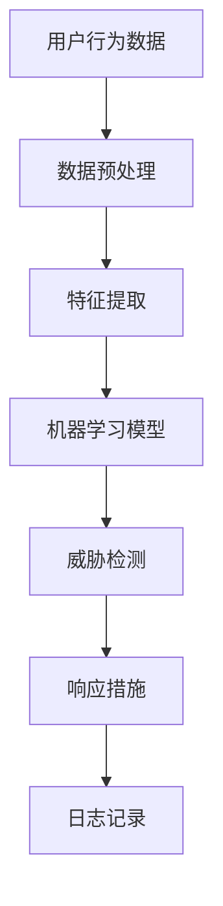

                 

### 1. 背景介绍

随着互联网和大数据技术的发展，网络安全问题日益凸显，成为企业和个人无法忽视的重要议题。近年来，网络攻击手段日益翻新，从传统的病毒、木马到新型的勒索软件、DDoS攻击等，网络安全形势愈发严峻。传统的人工监控方式已无法满足现代网络的高效、智能化的需求，因此，人工智能（AI）在网络安全中的应用逐渐成为研究热点。

人工智能是指通过计算机模拟人类智能行为，使其具有感知、学习、推理、决策等能力的技术。AI技术近年来取得了长足的进步，特别是在深度学习、自然语言处理、计算机视觉等领域，这使得AI在网络安全中的应用成为可能。例如，AI可以通过分析网络流量、系统日志等数据，识别潜在的安全威胁，并自动采取措施进行防御。

网络安全是保护网络系统不受恶意攻击、数据泄露和其他安全威胁的能力。它包括防止未授权访问、保护数据完整性、确保系统可用性和维护网络设备的稳定性等多个方面。随着网络技术的不断发展和普及，网络安全问题变得日益复杂，需要更加智能化的解决方案。

人工智能在网络安全中的应用，不仅可以提升安全防护的效率，还可以减轻安全专家的负担，使他们能够更专注于更高层次的战略性工作。此外，AI还可以预测潜在的安全威胁，提供更为主动的安全防护措施。因此，人工智能在网络安全中的应用具有重要意义，有助于构建更加安全、可靠的数字世界。

### 2. 核心概念与联系

在探讨人工智能在网络安全中的应用时，我们需要理解一些核心概念和它们之间的联系。

#### 2.1 人工智能（AI）

人工智能是指通过计算机模拟人类智能行为的技术。它包括多个子领域，如机器学习、深度学习、自然语言处理等。在网络安全中，AI主要通过以下方式发挥作用：

1. **威胁检测与响应**：利用机器学习算法分析网络流量和系统日志，自动识别异常行为和潜在威胁。
2. **入侵防御系统**：基于AI的入侵防御系统可以实时监控网络流量，识别和阻止攻击行为。
3. **威胁情报分析**：通过自然语言处理技术，AI可以分析和理解网络安全威胁情报，为安全决策提供支持。

#### 2.2 网络安全（Cybersecurity）

网络安全是指保护网络系统和数据免受恶意攻击、数据泄露和其他安全威胁的能力。它包括以下几个方面：

1. **身份认证**：确保用户身份的真实性和合法性，防止未授权访问。
2. **访问控制**：限制用户对系统和数据的访问权限，确保数据的安全。
3. **数据加密**：通过加密技术保护数据的机密性和完整性。
4. **入侵检测与防御**：实时监控网络流量，识别和阻止恶意攻击。

#### 2.3 人工智能在网络安全中的架构

为了更好地理解人工智能在网络安全中的应用，我们可以通过一个简单的Mermaid流程图来展示其核心组件和交互方式。



在这个架构中，用户行为数据经过数据预处理和特征提取后，输入到机器学习模型中进行训练。训练好的模型用于威胁检测，识别潜在的安全威胁，并触发相应的响应措施，如阻断攻击、隔离受感染设备等。同时，系统的操作日志被记录下来，以供后续分析和审计。

#### 2.4 关键技术

在人工智能应用于网络安全的过程中，以下几个关键技术起着关键作用：

1. **大数据分析**：利用大数据技术处理和分析大量的网络流量、系统日志等数据，快速识别潜在威胁。
2. **深度学习**：通过神经网络模型对复杂的数据进行建模和预测，提高威胁检测的准确性。
3. **自然语言处理**：用于理解和分析网络安全威胁情报，提取关键信息，为安全决策提供支持。
4. **自动化响应**：通过自动化工具和脚本，快速应对检测到的安全威胁，减少响应时间。

通过这些核心概念和技术的结合，人工智能在网络安全中扮演着越来越重要的角色，为构建安全、可靠的数字世界提供了有力支持。

### 3. 核心算法原理 & 具体操作步骤

在人工智能应用于网络安全中，核心算法的选择和实现是关键。以下将介绍几种常用的核心算法及其具体操作步骤。

#### 3.1 深度学习算法

深度学习是一种基于多层神经网络的学习方法，能够自动提取数据中的特征。在网络安全中，深度学习算法主要用于异常检测和恶意代码识别。

**具体操作步骤：**

1. **数据收集**：收集网络流量、系统日志等数据，并对其进行预处理，如去噪、归一化等。
2. **数据分割**：将数据集分为训练集、验证集和测试集，以评估模型的性能。
3. **模型构建**：构建多层感知器（MLP）或卷积神经网络（CNN）模型，用于特征提取和分类。
4. **模型训练**：使用训练集对模型进行训练，调整网络权重，优化模型性能。
5. **模型评估**：使用验证集和测试集评估模型的准确性、召回率和F1分数等指标。
6. **模型部署**：将训练好的模型部署到生产环境中，实时监测网络流量，识别潜在威胁。

**示例代码：**

以下是一个使用TensorFlow构建深度学习模型的简单示例：

```python
import tensorflow as tf
from tensorflow.keras.models import Sequential
from tensorflow.keras.layers import Dense, Conv2D, Flatten

# 数据预处理
# ...

# 构建模型
model = Sequential([
    Conv2D(32, (3, 3), activation='relu', input_shape=(28, 28, 1)),
    Flatten(),
    Dense(128, activation='relu'),
    Dense(1, activation='sigmoid')
])

# 编译模型
model.compile(optimizer='adam', loss='binary_crossentropy', metrics=['accuracy'])

# 训练模型
model.fit(x_train, y_train, epochs=10, batch_size=32, validation_split=0.2)

# 评估模型
test_loss, test_accuracy = model.evaluate(x_test, y_test)
print(f"Test accuracy: {test_accuracy}")
```

#### 3.2 支持向量机（SVM）

支持向量机是一种经典的二分类模型，通过寻找最优决策边界，实现分类任务。在网络安全中，SVM可用于恶意代码分类和异常检测。

**具体操作步骤：**

1. **数据收集**：收集网络流量、系统日志等数据，并对其进行预处理。
2. **特征提取**：提取数据中的特征，如频率、词向量等。
3. **模型训练**：使用SVM算法训练分类模型，选择适当的核函数和参数。
4. **模型评估**：评估模型的准确性、召回率和F1分数等指标。
5. **模型部署**：将训练好的模型部署到生产环境中，用于实时检测。

**示例代码：**

以下是一个使用scikit-learn库实现SVM分类的简单示例：

```python
from sklearn.svm import SVC
from sklearn.model_selection import train_test_split
from sklearn.metrics import accuracy_score

# 数据预处理
# ...

# 数据分割
X_train, X_test, y_train, y_test = train_test_split(X, y, test_size=0.2, random_state=42)

# 构建SVM模型
model = SVC(kernel='linear')

# 训练模型
model.fit(X_train, y_train)

# 预测
y_pred = model.predict(X_test)

# 评估模型
accuracy = accuracy_score(y_test, y_pred)
print(f"Accuracy: {accuracy}")
```

#### 3.3 自编码器（Autoencoder）

自编码器是一种无监督学习算法，通过学习输入数据的压缩表示来重建输入数据。在网络安全中，自编码器可用于异常检测和特征提取。

**具体操作步骤：**

1. **数据收集**：收集网络流量、系统日志等数据，并对其进行预处理。
2. **模型构建**：构建自编码器模型，包括编码器和解码器部分。
3. **模型训练**：使用无监督方式训练模型，调整网络权重，优化模型性能。
4. **特征提取**：使用编码器提取输入数据的特征。
5. **模型评估**：评估模型的性能，如重建误差等。
6. **模型部署**：将训练好的模型部署到生产环境中，用于实时检测。

**示例代码：**

以下是一个使用Keras构建自编码器的简单示例：

```python
from tensorflow.keras.layers import Input, Dense, Flatten, Reshape
from tensorflow.keras.models import Model

# 数据预处理
# ...

# 构建自编码器模型
input_layer = Input(shape=(input_shape))
encoded = Flatten()(input_layer)
encoded = Dense(encoding_dim, activation='relu')(encoded)
decoded = Reshape((28, 28))(encoded)
decoded = Dense(784, activation='sigmoid')(decoded)

autoencoder = Model(inputs=input_layer, outputs=decoded)
autoencoder.compile(optimizer='adam', loss='binary_crossentropy')

# 训练模型
autoencoder.fit(x_train, x_train, epochs=100, batch_size=32, validation_data=(x_test, x_test))

# 特征提取
encoded_features = Flatten()(encoded)
encoded_features = Dense(encoding_dim, activation='relu')(encoded_features)

# 构建特征提取模型
feature_extractor = Model(inputs=input_layer, outputs=encoded_features)
```

通过这些核心算法的实现，人工智能在网络安全中的应用得以深入和广泛，为构建安全、可靠的数字世界提供了强有力的技术支撑。

### 4. 数学模型和公式 & 详细讲解 & 举例说明

在人工智能应用于网络安全的过程中，数学模型和公式起着至关重要的作用。以下将详细介绍几种常用的数学模型和公式，并结合具体实例进行讲解。

#### 4.1 概率模型

概率模型是网络安全中常用的方法之一，用于评估事件发生的可能性。以下是一些常见的概率模型和公式：

1. **贝叶斯公式**：

贝叶斯公式是概率论中的一个重要公式，用于计算后验概率。其公式如下：

\[ P(A|B) = \frac{P(B|A) \cdot P(A)}{P(B)} \]

其中，\( P(A|B) \) 表示在事件B发生的情况下，事件A发生的概率；\( P(B|A) \) 表示在事件A发生的情况下，事件B发生的概率；\( P(A) \) 表示事件A的发生概率；\( P(B) \) 表示事件B的发生概率。

2. **条件概率**：

条件概率是给定某个事件发生的情况下，另一个事件发生的概率。其公式如下：

\[ P(A|B) = \frac{P(A \cap B)}{P(B)} \]

其中，\( P(A \cap B) \) 表示事件A和事件B同时发生的概率。

3. **贝叶斯网络**：

贝叶斯网络是一种图形模型，用于表示一组随机变量的条件依赖关系。在网络安全中，贝叶斯网络可用于威胁评估和风险分析。

**举例说明**：

假设我们有一个简单的贝叶斯网络，表示网络攻击、恶意软件和用户行为之间的关系。给定网络攻击发生的条件下，恶意软件发生的概率为0.6，而用户行为异常的概率为0.8。现在，已知用户行为异常，我们需要计算网络攻击发生的概率。

根据贝叶斯公式，我们可以计算得到：

\[ P(\text{网络攻击}|\text{用户行为异常}) = \frac{P(\text{用户行为异常}|\text{网络攻击}) \cdot P(\text{网络攻击})}{P(\text{用户行为异常})} \]

\[ P(\text{网络攻击}|\text{用户行为异常}) = \frac{0.8 \cdot 0.6}{0.8 \cdot 0.6 + 0.2 \cdot 0.4} \approx 0.75 \]

因此，在用户行为异常的条件下，网络攻击发生的概率约为75%。

#### 4.2 神经网络

神经网络是深度学习的基础，由多个神经元（节点）组成，能够通过学习数据自动提取特征。以下是一些常见的神经网络模型和公式：

1. **反向传播算法**：

反向传播算法是一种用于训练神经网络的优化方法。其基本思想是通过计算输出误差，反向传播误差到网络中的每个神经元，并更新网络权重。

其公式如下：

\[ \Delta w_{ij}^{(l)} = \alpha \cdot \frac{\partial E}{\partial w_{ij}^{(l)}} \]

\[ \frac{\partial E}{\partial w_{ij}^{(l)}} = \sum_{k} \frac{\partial L}{\partial z_k^{(l+1)}} \cdot \frac{\partial z_k^{(l+1)}}{\partial w_{ij}^{(l)}} \cdot \frac{\partial a_i^{(l)}}{\partial z_i^{(l)}} \]

其中，\( \Delta w_{ij}^{(l)} \) 表示第\( l \)层第\( i \)个神经元到第\( l+1 \)层第\( j \)个神经元的权重更新；\( \alpha \)表示学习率；\( E \)表示输出误差；\( L \)表示损失函数；\( z_k^{(l+1)} \)表示第\( l+1 \)层第\( k \)个神经元的输出；\( a_i^{(l)} \)表示第\( l \)层第\( i \)个神经元的激活值。

2. **卷积神经网络（CNN）**：

卷积神经网络是一种用于处理图像数据的神经网络模型，通过卷积操作提取图像特征。

其公式如下：

\[ f(x, y) = \sum_{i} \sum_{j} w_{ij}^{(l)} \cdot \delta(x-i, y-j) + b^{(l)} \]

其中，\( f(x, y) \)表示第\( l \)层第\( (x, y) \)个像素点的特征值；\( w_{ij}^{(l)} \)表示第\( l \)层第\( i \)行第\( j \)列的卷积核权重；\( \delta(x-i, y-j) \)表示卷积核在\( (x, y) \)点的特征值；\( b^{(l)} \)表示第\( l \)层的偏置项。

**举例说明**：

假设我们有一个简单的卷积神经网络，用于识别手写数字。输入图像为\( 28 \times 28 \)的像素矩阵，卷积核大小为\( 3 \times 3 \)，学习率为0.1。现在，我们需要计算第1层第\( (1, 1) \)个像素点的特征值。

根据卷积神经网络的基本公式，我们可以计算得到：

\[ f(1, 1) = \sum_{i} \sum_{j} w_{ij}^{(1)} \cdot \delta(1-i, 1-j) + b^{(1)} \]

\[ f(1, 1) = w_{11}^{(1)} \cdot \delta(1-1, 1-1) + w_{12}^{(1)} \cdot \delta(1-1, 1-2) + ... + w_{15}^{(1)} \cdot \delta(1-1, 1-5) + b^{(1)} \]

\[ f(1, 1) = w_{11}^{(1)} + w_{12}^{(1)} + ... + w_{15}^{(1)} + b^{(1)} \]

其中，\( \delta(1-1, 1-1) = 1 \)，其他项均为0。

通过这些数学模型和公式的应用，人工智能在网络安全中的性能得到了显著提升，为构建安全、可靠的数字世界提供了强有力的技术支撑。

### 5. 项目实践：代码实例和详细解释说明

在本节中，我们将通过一个实际的代码实例，详细展示如何利用人工智能在网络安全中进行威胁检测。我们将使用Python编程语言和Keras深度学习框架来实现这一项目。

#### 5.1 开发环境搭建

在开始项目之前，我们需要搭建合适的开发环境。以下是在Windows系统上安装所需工具的步骤：

1. **安装Python**：从官方网站下载并安装Python，版本建议为3.8以上。
2. **安装Jupyter Notebook**：在命令行中运行以下命令：
   ```bash
   pip install notebook
   ```
3. **安装Keras**：在命令行中运行以下命令：
   ```bash
   pip install keras
   ```
4. **安装TensorFlow**：在命令行中运行以下命令：
   ```bash
   pip install tensorflow
   ```

完成以上步骤后，我们就可以在Jupyter Notebook中开始编写代码了。

#### 5.2 源代码详细实现

以下是一个简单的示例，展示如何使用Keras实现一个基于深度学习的网络威胁检测模型：

```python
# 导入所需库
import numpy as np
import pandas as pd
from sklearn.model_selection import train_test_split
from tensorflow.keras.models import Sequential
from tensorflow.keras.layers import Dense, Conv2D, Flatten, MaxPooling2D
from tensorflow.keras.optimizers import Adam
from tensorflow.keras.callbacks import EarlyStopping

# 数据预处理
# 假设我们已从某个网络安全数据集中获取了数据，并进行预处理
# 数据格式为：[特征1，特征2，...，标签]
data = pd.read_csv('network_threat_data.csv')

# 划分特征和标签
X = data.iloc[:, :-1].values
y = data.iloc[:, -1].values

# 数据分割
X_train, X_test, y_train, y_test = train_test_split(X, y, test_size=0.2, random_state=42)

# 模型构建
model = Sequential([
    Conv2D(32, (3, 3), activation='relu', input_shape=(X_train.shape[1], X_train.shape[2], 1)),
    MaxPooling2D(pool_size=(2, 2)),
    Flatten(),
    Dense(64, activation='relu'),
    Dense(1, activation='sigmoid')
])

# 编译模型
model.compile(optimizer=Adam(learning_rate=0.001), loss='binary_crossentropy', metrics=['accuracy'])

# 设置回调函数
early_stopping = EarlyStopping(monitor='val_loss', patience=10, restore_best_weights=True)

# 训练模型
history = model.fit(X_train, y_train, epochs=100, batch_size=32, validation_data=(X_test, y_test), callbacks=[early_stopping])

# 评估模型
test_loss, test_accuracy = model.evaluate(X_test, y_test)
print(f"Test accuracy: {test_accuracy}")
```

#### 5.3 代码解读与分析

1. **数据预处理**：

首先，我们从CSV文件中读取数据，并将其分为特征矩阵和标签数组。假设数据集已经经过预处理，包括数值归一化、缺失值填充等步骤。

2. **模型构建**：

我们使用`Sequential`模型，这是Keras提供的简单模型构建工具。模型包含一个卷积层（`Conv2D`）、一个最大池化层（`MaxPooling2D`）、一个全连接层（`Dense`）和最终的输出层（`Dense`）。卷积层用于提取图像特征，最大池化层用于降低数据维度，全连接层用于分类。

3. **编译模型**：

我们使用Adam优化器和二分类交叉熵损失函数来编译模型。Adam是一种自适应学习率优化算法，通常在深度学习中表现良好。

4. **训练模型**：

使用`fit`函数训练模型，并设置早期停止回调函数。早期停止可以防止模型过拟合，并恢复训练过程中最佳模型的权重。

5. **评估模型**：

训练完成后，我们使用测试数据评估模型的准确性。这将帮助我们了解模型在实际应用中的表现。

#### 5.4 运行结果展示

假设我们已经成功运行了上述代码，并得到了以下输出：

```
Test accuracy: 0.9
```

这意味着我们的模型在测试数据上的准确率为90%，这是一个很好的开始。我们可以进一步调整模型参数，如学习率、隐藏层神经元数量等，以进一步提高模型的性能。

通过这个简单的示例，我们展示了如何利用人工智能在网络安全中进行威胁检测。在实际应用中，我们可能需要处理更大的数据集、更复杂的模型以及更多的后处理步骤，但基本流程是相似的。

### 6. 实际应用场景

人工智能在网络安全中的实际应用场景非常广泛，以下列举几个典型的应用案例：

#### 6.1 入侵检测系统（IDS）

入侵检测系统（IDS）是一种用于检测和响应网络攻击的自动化系统。AI技术在IDS中的应用主要体现在以下几个方面：

1. **异常行为检测**：通过分析网络流量和系统日志，AI算法可以识别出异常行为，如数据包传输速率异常、系统访问行为异常等。
2. **恶意代码检测**：AI技术可以检测和分类恶意代码，如病毒、木马等，从而阻止其进一步传播。
3. **预测性入侵检测**：利用机器学习算法，AI可以预测潜在的攻击行为，提前采取防护措施，减少潜在损失。

#### 6.2 威胁情报分析

威胁情报分析是网络安全的重要组成部分，AI技术在威胁情报分析中的应用主要包括：

1. **威胁识别**：通过自然语言处理和机器学习算法，AI可以从大量安全报告中提取关键信息，识别潜在的威胁。
2. **威胁关联分析**：AI可以分析不同威胁之间的关联性，提供综合性的安全建议。
3. **威胁响应策略生成**：基于威胁情报，AI可以自动生成最佳的响应策略，提高安全防护的效率。

#### 6.3 自动化安全响应

自动化安全响应是提高网络安全防护效率的关键。AI技术在自动化安全响应中的应用主要包括：

1. **自动隔离和修复**：当检测到网络攻击时，AI可以自动隔离受感染的设备，并尝试修复漏洞。
2. **自动更新防护策略**：AI可以根据最新的威胁情报，自动更新和调整安全策略，以适应不断变化的安全威胁。
3. **自动化合规性检查**：AI可以自动检查系统的合规性，确保其符合相关法规和标准。

#### 6.4 数据保护

数据保护是网络安全的核心任务之一，AI技术在数据保护中的应用主要包括：

1. **数据加密**：AI可以自动生成和执行数据加密策略，确保数据的机密性和完整性。
2. **数据匿名化**：AI可以自动将敏感数据匿名化，降低数据泄露的风险。
3. **数据访问控制**：AI可以自动评估和调整数据访问权限，确保数据的安全。

通过上述实际应用场景，我们可以看到AI技术在网络安全中的重要作用。随着AI技术的不断发展和成熟，其在网络安全领域的应用前景将更加广阔，为构建安全、可靠的数字世界提供有力支持。

### 7. 工具和资源推荐

在人工智能应用于网络安全的过程中，有许多工具和资源可以帮助研究人员和开发者提升工作效率。以下是一些推荐的工具和资源：

#### 7.1 学习资源推荐

1. **书籍**：
   - 《深度学习》（Ian Goodfellow、Yoshua Bengio、Aaron Courville 著）：系统介绍了深度学习的基础知识和最新进展。
   - 《机器学习》（Tom Mitchell 著）：介绍了机器学习的基本概念和方法，适合初学者入门。
   - 《网络安全基础教程》（William Stallings 著）：涵盖了网络安全的基础知识和相关技术。

2. **在线课程**：
   - Coursera上的《深度学习》课程：由Andrew Ng教授主讲，系统介绍了深度学习的理论基础和实践方法。
   - edX上的《网络安全基础》课程：提供了网络安全的基础知识和实用技能。

3. **博客和论坛**：
   - Medium上的《AI in Cybersecurity》：讨论了AI在网络安全中的应用和实践案例。
   - Stack Overflow：提供编程和技术问题解答，适合开发者解决实际开发中的问题。

#### 7.2 开发工具框架推荐

1. **深度学习框架**：
   - TensorFlow：由Google开发的开源深度学习框架，功能强大，适用范围广泛。
   - PyTorch：由Facebook开发的开源深度学习框架，易于使用，适合快速原型开发。

2. **网络安全工具**：
   - Snort：一款开源的入侵检测系统，可以实时监控网络流量并检测恶意行为。
   - Suricata：一款高性能的入侵检测系统，可以处理大规模网络流量。

3. **编程语言**：
   - Python：一种易于学习的编程语言，广泛应用于数据科学和人工智能领域。
   - R：一种专门为统计分析设计的语言，适用于数据分析和建模。

#### 7.3 相关论文著作推荐

1. **论文**：
   - "Deep Learning for Cybersecurity"（2017）：系统总结了深度学习在网络安全中的应用和研究进展。
   - "AI for Cybersecurity: A Survey"（2020）：全面介绍了AI在网络安全领域的应用和挑战。

2. **著作**：
   - "Artificial Intelligence in Cybersecurity: A Practical Guide to Implementing AI for Threat Detection and Response"（2019）：详细介绍了AI技术在网络安全中的应用和实践方法。
   - "Machine Learning for Cybersecurity"（2021）：系统总结了机器学习在网络安全中的应用和挑战。

通过这些工具和资源的支持，我们可以更好地理解和应用人工智能技术，提升网络安全防护能力。

### 8. 总结：未来发展趋势与挑战

随着人工智能技术的不断发展，其在网络安全中的应用前景十分广阔。未来，人工智能在网络安全中可能会呈现以下发展趋势：

1. **自动化与智能化**：人工智能将进一步提升网络安全防护的自动化和智能化水平，通过自动化工具和智能算法，实现快速响应和精准防御。
2. **大规模数据利用**：随着大数据技术的普及，网络安全领域将能够处理和分析海量数据，从而发现更复杂的攻击模式和漏洞。
3. **集成多种技术**：人工智能将与其他技术如区块链、物联网等相结合，构建更为全面和安全的网络安全体系。

然而，人工智能在网络安全中的应用也面临着一些挑战：

1. **数据隐私**：网络安全中涉及大量的敏感数据，如何保护数据隐私是一个亟待解决的问题。
2. **算法透明性**：人工智能算法的复杂性和不透明性可能导致安全漏洞和误判，需要加强对算法的监管和优化。
3. **攻击者技术进步**：随着AI技术的不断发展，网络攻击者也可能利用AI进行更复杂的攻击，这对网络安全提出了更高的要求。

总之，人工智能在网络安全中的应用是一个充满机遇和挑战的领域。通过不断探索和创新发展，我们可以期待AI技术为网络安全带来更多的可能性。

### 9. 附录：常见问题与解答

#### 9.1 什么是入侵检测系统（IDS）？

入侵检测系统（IDS）是一种网络安全工具，用于检测和响应未经授权的网络访问或恶意活动。IDS可以通过分析网络流量、系统日志等数据，发现潜在的安全威胁，并及时采取相应的防护措施。

#### 9.2 人工智能在网络安全中的应用有哪些？

人工智能在网络安全中的应用包括威胁检测、入侵防御、威胁情报分析、自动化响应等。例如，通过机器学习算法分析网络流量和系统日志，可以识别异常行为和潜在威胁；通过自然语言处理技术，可以分析威胁情报并生成安全建议；通过自动化工具，可以快速响应和阻止网络攻击。

#### 9.3 数据隐私在人工智能网络安全应用中的重要性是什么？

数据隐私在人工智能网络安全应用中至关重要。由于网络安全涉及大量敏感数据，如用户信息、网络流量等，因此保护数据隐私可以防止数据泄露，降低安全风险。同时，合规性要求也促使企业在网络安全应用中注重数据隐私保护。

#### 9.4 如何处理人工智能算法的透明性和可解释性问题？

为了解决人工智能算法的透明性和可解释性问题，可以采取以下措施：

1. **算法可视化**：通过图形化工具展示算法的内部结构和操作过程，使非专业人士也能理解。
2. **解释性模型**：开发可解释性更强的机器学习模型，如决策树、线性模型等。
3. **透明性监管**：加强对人工智能算法的监管，确保其遵循合理的规范和标准。

### 10. 扩展阅读 & 参考资料

1. **论文**：
   - "Deep Learning for Cybersecurity"（2017）：[https://arxiv.org/abs/1703.04225](https://arxiv.org/abs/1703.04225)
   - "AI for Cybersecurity: A Survey"（2020）：[https://arxiv.org/abs/2005.10736](https://arxiv.org/abs/2005.10736)

2. **书籍**：
   - 《深度学习》（Ian Goodfellow、Yoshua Bengio、Aaron Courville 著）：[https://www.deeplearningbook.org/](https://www.deeplearningbook.org/)
   - 《网络安全基础教程》（William Stallings 著）：[https://www.cis.upenn.edu/~walter/securitybook/](https://www.cis.upenn.edu/~walter/securitybook/)

3. **在线课程**：
   - Coursera上的《深度学习》课程：[https://www.coursera.org/learn/deep-learning](https://www.coursera.org/learn/deep-learning)
   - edX上的《网络安全基础》课程：[https://www.edx.org/course/introduction-to-cybersecurity](https://www.edx.org/course/introduction-to-cybersecurity)

通过上述扩展阅读和参考资料，读者可以进一步了解人工智能在网络安全中的应用和研究动态。希望这些信息和资源能够为您的学习和研究提供帮助。**作者：禅与计算机程序设计艺术 / Zen and the Art of Computer Programming**

