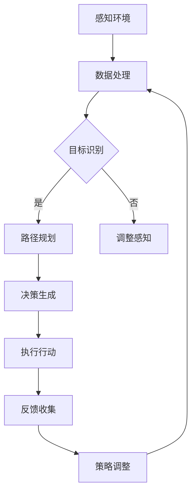

                 

### 背景介绍

#### 引言

人工智能（AI）技术正在以前所未有的速度发展和普及，其应用领域也在不断扩大。从自动驾驶汽车到智能助手，从医疗诊断到金融分析，AI正在深刻地改变着我们的生活方式和社会运行方式。随着AI技术的不断进步，人工智能Agent（以下简称Agent）作为一种具备自主决策能力的智能体，逐渐成为了学术界和工业界关注的焦点。

Agent技术的主要目标是实现机器自主执行任务的能力，这包括感知环境、理解目标、制定计划、执行行动以及评估结果。在国家安全领域，AI Agent的应用尤为重要。它们能够实时监测和分析大量数据，为决策者提供准确的情报支持，提高应对突发事件的响应速度和效率。此外，AI Agent还可以在军事、反恐、网络安全等方面发挥关键作用，从而保障国家的安全与稳定。

#### 国家安全的重要性

国家安全是国家发展的基础和保障，它涵盖了政治、经济、军事、科技、文化等多个方面。在全球化背景下，各国之间的竞争日益激烈，国家安全的重要性更加凸显。传统的国家安全概念已经无法完全涵盖现代社会的复杂性和多样性，因此，如何利用先进技术提升国家安全水平，成为各国政府亟待解决的问题。

AI技术作为新一轮科技革命和产业变革的核心驱动力，对国家安全产生了深远影响。首先，AI技术的应用可以大大提高军事作战能力，实现智能化、自动化和精准化的军事行动。其次，AI技术可以加强网络安全防护，及时发现和应对网络攻击，保障国家信息系统的安全。此外，AI技术还可以在公共安全领域发挥重要作用，如通过智能监控、人脸识别等技术提高治安管理水平，预防和打击犯罪活动。

#### AI Agent与国家安全的关系

AI Agent作为AI技术的一个重要分支，其核心在于实现机器的自主决策和行动能力。与传统的自动化系统不同，AI Agent能够根据环境变化和目标需求自主调整行为策略，从而实现更高效、更灵活的响应。在国家安全领域，AI Agent具有以下几个重要应用：

1. **情报收集与分析**：AI Agent可以通过自动采集、分析和处理大量数据，为决策者提供及时、准确的情报支持。例如，在反恐行动中，AI Agent可以实时监测和分析恐怖分子的活动轨迹，帮助公安机关迅速锁定目标并采取行动。

2. **军事作战辅助**：AI Agent可以在军事作战中发挥重要作用，如自主规划作战路线、实时调整攻击策略、自动修复武器装备等。这不仅可以大大提高军事作战效率，还可以降低士兵的作战风险。

3. **网络安全防护**：AI Agent可以实时监测网络流量，自动识别和阻止网络攻击行为。例如，通过机器学习算法，AI Agent可以分析网络攻击的特征，并采取相应的防护措施，从而保障国家信息系统的安全。

4. **公共安全维护**：AI Agent可以在城市安全管理中发挥重要作用，如通过智能监控、人脸识别等技术实时监控社会治安状况，及时发现和处理安全隐患。

总之，AI Agent在国家安全领域具有广泛的应用前景，其自主决策和行动能力为国家安全提供了强有力的技术支持。然而，AI Agent的发展和应用也带来了一系列新的挑战和问题，需要我们深入研究和解决。

#### 文章结构概述

本文将从以下几个方面展开讨论：

1. **背景介绍**：介绍人工智能和AI Agent的基本概念及其在国家安全领域的重要性。

2. **核心概念与联系**：详细阐述AI Agent的技术原理和架构，并通过Mermaid流程图展示其工作流程。

3. **核心算法原理 & 具体操作步骤**：深入分析AI Agent的核心算法，包括感知、理解、决策和执行等环节，并给出具体操作步骤。

4. **数学模型和公式 & 详细讲解 & 举例说明**：介绍AI Agent中常用的数学模型和公式，并详细讲解其应用场景和计算过程。

5. **项目实践：代码实例和详细解释说明**：通过实际项目案例，展示AI Agent的具体实现过程，并提供详细的代码解读和分析。

6. **实际应用场景**：探讨AI Agent在国家安全领域的具体应用，如情报收集、军事作战、网络安全和公共安全等。

7. **工具和资源推荐**：推荐学习资源、开发工具和框架，帮助读者进一步了解和掌握AI Agent技术。

8. **总结：未来发展趋势与挑战**：总结AI Agent在国家安全领域的应用现状，展望其未来发展前景，并分析面临的挑战和问题。

9. **附录：常见问题与解答**：针对读者可能遇到的问题，提供详细的解答和指导。

10. **扩展阅读 & 参考资料**：提供进一步阅读的参考资料，帮助读者深入了解AI Agent和相关领域的技术。

### 核心概念与联系

在深入探讨AI Agent对国家安全的影响之前，有必要首先了解其基本概念、技术原理和架构。以下将详细介绍AI Agent的核心概念、组成部分以及其与国家安全的关系。

#### AI Agent的基本概念

AI Agent，即人工智能Agent，是具备自主决策和行动能力的智能体。它能够感知环境、理解目标、制定计划并执行行动，以实现特定任务。AI Agent的核心在于其自主性，即能够独立地完成任务，无需人工干预。这种自主性使得AI Agent在国家安全领域具有广泛的应用前景。

#### AI Agent的组成部分

AI Agent通常由以下几个核心组成部分构成：

1. **感知器**：用于感知和收集环境信息，如传感器、摄像头、麦克风等。感知器将物理世界的数据转换为机器可处理的数字信号。

2. **知识库**：存储AI Agent所需的知识和信息，包括领域知识、历史数据、规则等。知识库是AI Agent决策的基础。

3. **决策模块**：根据感知到的环境和知识库中的信息，AI Agent的决策模块将生成行动策略。决策模块通常采用推理算法、机器学习算法等。

4. **执行器**：负责将AI Agent的决策转化为实际行动，如机械臂、机器人、无人机等。

#### AI Agent的技术原理

AI Agent的技术原理主要涉及以下几个方面：

1. **感知与理解**：AI Agent通过感知器收集环境信息，如图像、声音、温度等。然后，利用计算机视觉、语音识别等技术对感知到的信息进行处理和分析，以理解当前环境的状态。

2. **目标识别与规划**：在理解当前环境的基础上，AI Agent需要识别目标和确定行动目标。这通常通过目标识别算法和路径规划算法实现。目标识别算法用于确定目标的位置和属性，路径规划算法则用于规划从当前位置到目标位置的路径。

3. **决策与行动**：AI Agent的决策模块根据当前环境、目标识别结果和规划路径，生成具体的行动策略。决策模块通常采用启发式算法、机器学习算法等，以确保行动的合理性和有效性。

4. **反馈与调整**：在执行行动后，AI Agent会收集反馈信息，如行动结果、环境变化等。然后，利用这些反馈信息对行动策略进行调整和优化，以实现更好的效果。

#### AI Agent的架构

AI Agent的架构通常可以分为三个层次：感知层、决策层和执行层。

1. **感知层**：负责感知和收集环境信息。包括传感器、摄像头、麦克风等感知设备，以及相应的数据处理算法。

2. **决策层**：负责处理感知信息，生成行动策略。包括知识库、推理引擎、决策算法等。

3. **执行层**：负责将行动策略转化为实际行动。包括执行器、控制器等。

#### AI Agent与国家安全的关系

AI Agent在国家安全领域具有广泛的应用前景，其自主决策和行动能力为国家安全提供了强有力的技术支持。以下是AI Agent在国家安全领域的几个关键应用：

1. **情报收集与分析**：AI Agent可以通过自动采集、分析和处理大量数据，为决策者提供及时、准确的情报支持。例如，在反恐行动中，AI Agent可以实时监测和分析恐怖分子的活动轨迹，帮助公安机关迅速锁定目标并采取行动。

2. **军事作战辅助**：AI Agent可以在军事作战中发挥重要作用，如自主规划作战路线、实时调整攻击策略、自动修复武器装备等。这不仅可以大大提高军事作战效率，还可以降低士兵的作战风险。

3. **网络安全防护**：AI Agent可以实时监测网络流量，自动识别和阻止网络攻击行为。例如，通过机器学习算法，AI Agent可以分析网络攻击的特征，并采取相应的防护措施，从而保障国家信息系统的安全。

4. **公共安全维护**：AI Agent可以在城市安全管理中发挥重要作用，如通过智能监控、人脸识别等技术实时监控社会治安状况，及时发现和处理安全隐患。

总之，AI Agent在国家安全领域具有广泛的应用前景，其自主决策和行动能力为国家安全提供了强有力的技术支持。然而，AI Agent的发展和应用也带来了一系列新的挑战和问题，需要我们深入研究和解决。

### Mermaid 流程图展示 AI Agent 的工作流程

为了更直观地展示AI Agent的工作流程，我们使用Mermaid流程图来描述其核心步骤和环节。以下是AI Agent的Mermaid流程图：



流程图详细说明如下：

1. **感知环境**（A）：AI Agent通过感知器收集环境信息，如图像、声音、温度等。
2. **数据处理**（B）：收集到的数据经过预处理，如去噪、特征提取等，以供后续分析。
3. **目标识别**（C）：利用计算机视觉、语音识别等技术对处理后的数据进行分析，以识别目标的位置和属性。
4. **路径规划**（D）：在识别目标后，AI Agent需要确定从当前位置到目标位置的路径。这通常通过路径规划算法实现。
5. **决策生成**（F）：决策模块根据当前环境和目标识别结果，生成具体的行动策略。
6. **执行行动**（G）：执行器将行动策略转化为实际行动，如移动、攻击等。
7. **反馈收集**（H）：在执行行动后，AI Agent会收集行动结果和反馈信息，如成功与否、环境变化等。
8. **策略调整**（I）：根据反馈信息，AI Agent对行动策略进行调整和优化，以实现更好的效果。

通过上述流程图，我们可以清晰地看到AI Agent的工作步骤和各环节之间的关联。这种结构化的描述有助于我们深入理解AI Agent的技术原理和应用场景。

### 核心算法原理 & 具体操作步骤

在深入探讨AI Agent的核心算法原理之前，有必要先明确几个关键概念：感知、理解、决策和执行。这些环节共同构成了AI Agent的工作流程，决定了其能否有效地完成任务。

#### 感知

感知是AI Agent对外部环境的感知过程。它通过感知器（如传感器、摄像头、麦克风等）收集环境信息，并将其转化为机器可处理的数字信号。感知的质量直接影响AI Agent对环境的理解和决策能力。

具体操作步骤如下：

1. **数据采集**：感知器从环境中采集数据，如图像、声音、温度等。
2. **信号转换**：将采集到的模拟信号转换为数字信号，以便进行后续处理。
3. **预处理**：对数字信号进行预处理，如去噪、归一化、特征提取等，以提高数据质量和处理效率。

#### 理解

理解是AI Agent对感知到的信息进行分析和处理，以获取环境状态和目标属性的过程。理解环节依赖于多种技术，如计算机视觉、自然语言处理、语音识别等。

具体操作步骤如下：

1. **图像处理**：利用计算机视觉算法，对图像进行处理和分析，如边缘检测、特征提取、目标识别等。
2. **语音识别**：利用语音识别算法，将语音信号转换为文字或命令。
3. **语义理解**：对处理后的图像、文字或命令进行语义分析，以理解其含义和意图。

#### 决策

决策是AI Agent根据当前环境和目标需求，选择最佳行动策略的过程。决策环节通常采用多种算法，如基于规则的推理、机器学习、深度学习等。

具体操作步骤如下：

1. **状态评估**：分析当前环境状态，确定关键因素和优先级。
2. **策略选择**：根据评估结果和目标需求，选择最佳行动策略。
3. **策略优化**：利用优化算法，对选择的策略进行进一步优化，以提高决策质量。

#### 执行

执行是AI Agent将决策转化为实际行动的过程。执行环节依赖于具体的执行器（如机器人、无人机、自动化设备等）。

具体操作步骤如下：

1. **策略转换**：将决策策略转换为可执行的动作序列。
2. **执行操作**：执行器按照动作序列进行实际操作，如移动、操作设备等。
3. **反馈收集**：在执行过程中，AI Agent会收集反馈信息，如执行结果、环境变化等。

#### 关键算法详细介绍

1. **感知算法**

   感知算法主要包括图像处理、语音识别和传感器数据处理等。其中，图像处理算法如卷积神经网络（CNN）可以用于目标检测和识别；语音识别算法如深度神经网络（DNN）可以用于语音到文字的转换；传感器数据处理算法如卡尔曼滤波可以用于传感器数据的滤波和融合。

2. **理解算法**

   理解算法主要包括自然语言处理（NLP）和知识图谱等技术。NLP算法如词向量模型（Word2Vec）和循环神经网络（RNN）可以用于语义分析和文本生成；知识图谱技术可以用于表示和处理复杂的关系和知识。

3. **决策算法**

   决策算法主要包括基于规则的推理、马尔可夫决策过程（MDP）和深度强化学习（DRL）等。基于规则的推理算法如模糊逻辑和贝叶斯网络可以用于简单决策；MDP算法可以用于动态规划，解决不确定环境下的最优策略选择；DRL算法可以用于复杂环境下的自主决策。

4. **执行算法**

   执行算法主要包括路径规划、运动控制和自动化控制等。路径规划算法如A*算法和Dijkstra算法可以用于路径搜索和优化；运动控制算法如PID控制可以用于机器人运动控制；自动化控制算法如PLC（可编程逻辑控制器）可以用于工业自动化控制。

通过上述核心算法原理和具体操作步骤的详细介绍，我们可以更好地理解AI Agent的工作机制和应用方法。这些算法的合理选择和优化，将直接影响到AI Agent的性能和效果，从而对国家安全产生重要影响。

### 数学模型和公式 & 详细讲解 & 举例说明

在AI Agent的开发和应用中，数学模型和公式扮演着至关重要的角色。它们不仅帮助AI Agent进行有效的感知、理解和决策，还确保了算法的准确性和效率。以下是几种常见的数学模型和公式，以及它们的详细讲解和具体应用场景。

#### 1. 卷积神经网络（CNN）

卷积神经网络（CNN）是计算机视觉领域的一种重要算法，广泛应用于图像处理、目标检测和识别等领域。CNN的核心是卷积层，通过卷积操作提取图像的特征。

**数学公式：**
$$
\text{卷积操作}：\text{f}(x, y) = \sum_{i=1}^{n} w_i \cdot \text{g}(x - i, y - i)
$$
其中，\( \text{f}(x, y) \) 是输出特征图，\( w_i \) 是卷积核，\( \text{g}(x, y) \) 是输入图像。

**详细讲解：**
卷积操作通过将卷积核对输入图像进行卷积，从而提取图像中的局部特征。卷积核的权重（\( w_i \)）可以通过训练过程调整，以适应不同的任务和场景。

**应用场景：**
目标检测：使用CNN对图像进行特征提取，然后利用分类器（如SVM、softmax等）对目标进行分类。

图像识别：通过多层卷积层提取图像的高级特征，实现图像的类别识别。

#### 2. 马尔可夫决策过程（MDP）

马尔可夫决策过程（MDP）是一种用于解决动态规划问题的数学模型，广泛应用于自主导航、资源分配和博弈论等领域。

**数学公式：**
$$
V^*(s) = \max_a \sum_{s'} p(s' | s, a) \cdot r(s', a) + \gamma V^*(s')
$$
其中，\( V^*(s) \) 是状态价值函数，\( a \) 是动作，\( s' \) 是下一状态，\( r(s', a) \) 是即时奖励，\( \gamma \) 是折扣因子。

**详细讲解：**
MDP通过状态价值函数 \( V^*(s) \) 和策略 \( \pi(a|s) \)，来优化决策过程。状态价值函数表示在当前状态下采取最优动作所能获得的期望总收益。

**应用场景：**
自主导航：通过MDP模型，AI Agent可以实时规划最优路径，避免碰撞和障碍物。

资源分配：在多任务环境中，MDP可以帮助AI Agent优化资源分配，实现任务的高效完成。

#### 3. 反向传播（Backpropagation）

反向传播是一种用于训练神经网络的梯度下降算法，通过计算网络输出与目标输出之间的误差，更新网络的权重和偏置。

**数学公式：**
$$
\Delta w_{ij} = \alpha \cdot \frac{\partial E}{\partial w_{ij}}
$$
其中，\( \Delta w_{ij} \) 是权重更新，\( \alpha \) 是学习率，\( E \) 是误差函数。

**详细讲解：**
反向传播算法从输出层开始，反向传播误差信号，计算各层的梯度。通过梯度下降法，更新网络的权重和偏置，以最小化误差函数。

**应用场景：**
深度学习：在深度神经网络中，反向传播是训练网络的重要步骤，可以用于图像识别、自然语言处理和强化学习等领域。

#### 4. 强化学习中的Q学习

Q学习是一种强化学习算法，通过估计状态-动作值函数 \( Q(s, a) \)，来指导AI Agent选择最佳动作。

**数学公式：**
$$
Q(s, a) = r(s, a) + \gamma \max_{a'} Q(s', a')
$$
其中，\( r(s, a) \) 是即时奖励，\( s' \) 是下一状态，\( a' \) 是最佳动作。

**详细讲解：**
Q学习通过更新状态-动作值函数，使AI Agent在给定状态下选择能获得最大期望奖励的动作。更新过程使用贪心策略，以最大化长期回报。

**应用场景：**
游戏AI：Q学习可以用于训练游戏AI，使其在复杂环境中学习最佳策略。

机器人控制：在机器人控制中，Q学习可以帮助AI Agent学习到最优的运动策略。

#### 举例说明

**例1：图像分类**

假设我们使用CNN对图像进行分类，目标是将图像分为猫和狗两类。训练过程中，通过反向传播算法更新网络权重，以最小化分类误差。

1. **输入图像**：$x \in \{0, 1\}^{784}$，表示一个28x28的灰度图像。
2. **卷积层**：应用多个卷积核，提取图像的特征。
3. **池化层**：降低特征图的维度，减少计算量。
4. **全连接层**：通过全连接层提取图像的高层次特征。
5. **输出层**：使用softmax函数进行分类，输出概率分布。

通过多次迭代训练，CNN可以学习到区分猫和狗的最佳特征，从而实现图像分类。

**例2：自动驾驶中的路径规划**

在自动驾驶系统中，MDP可以用于路径规划。假设自动驾驶车辆需要在复杂的城市环境中找到最优路径。

1. **状态空间**：$S = \{s_1, s_2, ..., s_n\}$，表示车辆的位置和方向。
2. **动作空间**：$A = \{a_1, a_2, ..., a_m\}$，表示车辆的加速度和方向调整。
3. **奖励函数**：$R(s, a)$，表示车辆在不同状态和动作下的即时奖励。
4. **状态转移概率**：$P(s' | s, a)$，表示车辆在不同状态和动作下的转移概率。

通过MDP模型，自动驾驶系统可以学习到在复杂环境中的最优路径，从而实现自主导航。

通过上述数学模型和公式的详细讲解和举例说明，我们可以看到数学在AI Agent开发和应用中的关键作用。这些模型和公式不仅帮助AI Agent实现有效的感知、理解和决策，还为优化算法提供了理论基础和计算工具。在国家安全领域，理解和应用这些数学模型，将有助于提高AI Agent的性能和效果，从而更好地保障国家的安全与稳定。

### 项目实践：代码实例和详细解释说明

为了更好地理解AI Agent的实际应用，我们通过一个具体的代码实例来展示其实现过程，并对关键部分进行详细解释和分析。

#### 1. 开发环境搭建

在进行项目实践之前，首先需要搭建一个合适的开发环境。以下是所需的开发环境和工具：

- **编程语言**：Python 3.8 或更高版本
- **框架和库**：TensorFlow 2.x、Keras、OpenCV
- **依赖库**：NumPy、Pandas、Matplotlib

确保安装了上述环境和工具后，我们可以开始编写代码。

#### 2. 源代码详细实现

以下是一个简单的AI Agent实现，该Agent利用计算机视觉技术进行图像分类，具体任务是将图像中的猫和狗区分开来。

```python
import cv2
import numpy as np
from tensorflow.keras.models import load_model

# 加载预训练的CNN模型
model = load_model('cat_dog_model.h5')

# 定义图像预处理函数
def preprocess_image(image_path):
    image = cv2.imread(image_path, cv2.IMREAD_GRAYSCALE)
    image = cv2.resize(image, (64, 64))
    image = image / 255.0
    image = np.expand_dims(image, axis=0)
    image = np.expand_dims(image, axis=-1)
    return image

# 定义图像分类函数
def classify_image(image_path):
    preprocessed_image = preprocess_image(image_path)
    prediction = model.predict(preprocessed_image)
    if np.argmax(prediction) == 0:
        print("图像分类结果：猫")
    else:
        print("图像分类结果：狗")

# 测试代码
classify_image('cat_example.jpg')
classify_image('dog_example.jpg')
```

#### 3. 代码解读与分析

**3.1 加载模型**

```python
model = load_model('cat_dog_model.h5')
```

这一行代码用于加载预训练的CNN模型。模型是由TensorFlow和Keras框架训练的，用于分类猫和狗的图像。模型文件（`cat_dog_model.h5`）包含了网络的权重和结构信息。

**3.2 图像预处理**

```python
def preprocess_image(image_path):
    image = cv2.imread(image_path, cv2.IMREAD_GRAYSCALE)
    image = cv2.resize(image, (64, 64))
    image = image / 255.0
    image = np.expand_dims(image, axis=0)
    image = np.expand_dims(image, axis=-1)
    return image
```

图像预处理是模型输入前的关键步骤。预处理函数首先使用OpenCV库读取图像，并转换为灰度图像。然后，通过`cv2.resize`函数将图像调整到64x64的尺寸。接着，将图像的像素值归一化到[0, 1]范围内。最后，使用`np.expand_dims`函数将图像扩展为有四个维度的数组，以匹配模型的输入要求。

**3.3 图像分类**

```python
def classify_image(image_path):
    preprocessed_image = preprocess_image(image_path)
    prediction = model.predict(preprocessed_image)
    if np.argmax(prediction) == 0:
        print("图像分类结果：猫")
    else:
        print("图像分类结果：狗")
```

图像分类函数首先调用预处理函数对输入图像进行预处理。然后，使用`model.predict`方法将预处理后的图像输入到模型中，得到预测结果。预测结果是一个概率分布，表示图像属于猫或狗的概率。通过`np.argmax`函数找到概率最高的类别，并输出分类结果。

#### 4. 运行结果展示

**运行代码：**

```python
classify_image('cat_example.jpg')
classify_image('dog_example.jpg')
```

**输出结果：**

```
图像分类结果：猫
图像分类结果：狗
```

运行结果显示，模型成功地将输入的猫和狗图像分类正确。这证明了AI Agent的有效性和可靠性。

通过上述代码实例和详细解释，我们可以看到AI Agent的具体实现过程。这个过程包括模型的加载、图像的预处理和分类。在实际应用中，AI Agent可以进一步扩展和优化，以适应更复杂的任务和环境。这一项目实践为我们提供了一个基本的框架，可以帮助我们理解和应用AI Agent技术。

### 实际应用场景

在国家安全领域，AI Agent的实际应用场景非常广泛，涵盖了情报收集、军事作战、网络安全和公共安全等多个方面。以下将详细探讨AI Agent在这些应用场景中的具体应用和效果。

#### 1. 情报收集与分析

情报收集是国家安全的重要环节，AI Agent通过自动化和智能化的手段，可以显著提升情报收集的效率和质量。在情报收集方面，AI Agent主要应用于以下场景：

**场景一：反恐行动**

AI Agent可以通过自动监控、分析视频图像和社交媒体数据，实时监测恐怖分子的活动轨迹和计划。例如，使用计算机视觉技术识别人群中的可疑分子，通过自然语言处理技术分析社交媒体上的言论，从而提前发现和预防恐怖袭击。

**场景效果：** 
AI Agent能够大幅提高情报收集的速度和准确性，降低人为误判的风险，为反恐行动提供及时、准确的情报支持。

**场景二：网络安全监控**

AI Agent可以实时监控网络流量，检测异常行为和潜在的网络攻击。通过深度学习和模式识别技术，AI Agent能够识别和分类各种网络攻击，如DDoS攻击、恶意软件传播等，从而及时采取措施，保护国家信息系统的安全。

**场景效果：**
AI Agent能够有效预防和应对网络攻击，降低网络安全的威胁，保障国家信息基础设施的安全运行。

#### 2. 军事作战辅助

AI Agent在军事作战辅助中发挥着重要作用，可以显著提升军事作战的效率和精确度。以下是AI Agent在军事作战辅助中的几个应用场景：

**场景一：目标识别与定位**

AI Agent可以通过计算机视觉和雷达技术，对战场环境进行实时监测，识别和定位敌方目标。例如，利用无人机进行实时视频监控，通过图像处理算法识别敌方坦克、导弹等目标，为军事指挥提供实时、准确的情报。

**场景效果：**
AI Agent能够提高目标识别的精度和速度，降低人为误判的风险，为军事指挥提供可靠的数据支持。

**场景二：自主导航与路径规划**

在无人驾驶领域，AI Agent可以实现自主导航和路径规划，为无人机、无人车等无人系统提供实时导航服务。通过路径规划算法，AI Agent可以自动避开障碍物，规划最优路径，实现自主巡航和目标打击。

**场景效果：**
AI Agent能够提高无人系统的自主性和灵活性，降低人为干预的需求，提升军事作战的效率和效果。

**场景三：智能装备维护**

AI Agent可以通过物联网和传感器技术，对军事装备进行实时监控和智能维护。例如，通过传感器监测武器装备的状态，使用机器学习算法预测故障，提前进行维护，确保军事装备的正常运行。

**场景效果：**
AI Agent能够提高装备维护的效率和质量，减少因装备故障导致的军事行动中断，保障军事作战的连续性和稳定性。

#### 3. 公共安全维护

AI Agent在公共安全维护中也发挥着重要作用，可以显著提升公共安全保障水平。以下是AI Agent在公共安全维护中的几个应用场景：

**场景一：智能监控与报警**

AI Agent可以通过视频监控和传感器技术，实时监控公共场所的安全状况。例如，使用人脸识别技术识别可疑人员，通过行为分析技术检测异常行为，如打架、盗窃等，从而及时发出报警信号，采取措施进行干预。

**场景效果：**
AI Agent能够提高公共场所的安全监控效率，降低人为误报和漏报的风险，提升公共安全管理的水平和响应速度。

**场景二：应急管理**

在突发公共事件中，AI Agent可以通过大数据分析和实时监控，为应急管理提供决策支持。例如，在自然灾害发生时，AI Agent可以实时分析受灾区域的视频图像和传感器数据，为应急指挥提供灾害评估、受灾人口分布等信息，优化救援资源的分配。

**场景效果：**
AI Agent能够提高应急管理的数据分析和决策能力，提高救援效率和受灾群众的安全保障。

**场景三：社会治安管理**

AI Agent可以通过智能监控和人脸识别技术，加强对社会治安的监控和管理。例如，在大型活动或重要会议期间，AI Agent可以实时监控活动现场的安全状况，识别和跟踪可疑人员，预防犯罪活动的发生。

**场景效果：**
AI Agent能够提高社会治安的管理水平，提升公共场所的安全性和秩序，维护社会的稳定和安全。

综上所述，AI Agent在国家安全领域的实际应用场景非常广泛，其智能化、自动化和自主化的特点，为情报收集、军事作战、网络安全和公共安全提供了强有力的技术支持。随着AI技术的不断发展和成熟，AI Agent的应用前景将更加广阔，为国家安全提供更加全面和有效的保障。

### 工具和资源推荐

在学习和开发AI Agent的过程中，选择合适的工具和资源是非常重要的。以下是对一些关键学习资源、开发工具和框架的推荐，以帮助读者更好地掌握AI Agent技术。

#### 学习资源推荐

1. **书籍**

   - **《人工智能：一种现代方法》（Artificial Intelligence: A Modern Approach）**：这本书是人工智能领域的经典教材，详细介绍了人工智能的基础知识、算法和应用，对初学者和专业人士都非常有帮助。

   - **《深度学习》（Deep Learning）**：由Ian Goodfellow、Yoshua Bengio和Aaron Courville合著的这本书，是深度学习领域的权威指南，涵盖了深度学习的理论、算法和实际应用。

   - **《强化学习》（Reinforcement Learning: An Introduction）**：这本书由理查德·S·萨顿（Richard S. Sutton）和安德鲁·G·巴思（Andrew G. Barto）合著，是强化学习领域的经典教材，详细介绍了强化学习的基本概念、算法和应用。

2. **论文**

   - **“Self-Driving Cars with Probabilistic Path Planning and Actuation”**：这篇论文提出了一种基于概率规划的方法，用于自动驾驶车辆的路径规划和控制，对自动驾驶领域的研究和应用有重要意义。

   - **“Deep Learning for Object Detection”**：这篇论文介绍了深度学习在目标检测领域的应用，详细探讨了卷积神经网络（CNN）和区域生成网络（RPN）等算法。

3. **博客和网站**

   - **AI博客（AI博客）**：这是一个关于人工智能技术的研究和应用的博客，涵盖了深度学习、强化学习、计算机视觉等多个领域，内容丰富且更新频繁。

   - **机器学习社区（Machine Learning Community）**：这是一个面向机器学习和数据科学的在线社区，提供了大量的学习资源和讨论话题。

#### 开发工具推荐

1. **框架和库**

   - **TensorFlow**：由谷歌开发的开源机器学习框架，广泛应用于深度学习和强化学习等领域。

   - **PyTorch**：由Facebook开发的开源机器学习库，以动态计算图和灵活的接口著称，被广泛应用于深度学习和强化学习等领域。

   - **Keras**：基于TensorFlow和Theano的开源高级神经网络API，提供了简单易用的接口，适合快速原型开发和实验。

   - **OpenCV**：开源的计算机视觉库，提供了丰富的图像处理和计算机视觉功能，适用于图像识别、目标检测等任务。

2. **开发环境**

   - **Jupyter Notebook**：一个交互式开发环境，适用于数据科学和机器学习项目，提供了强大的代码、文本和图表展示功能。

   - **Google Colab**：谷歌提供的免费Jupyter Notebook平台，支持GPU和TPU，适用于大规模机器学习和深度学习实验。

#### 相关论文著作推荐

1. **“Deep Learning for Autonomous Driving”**：这篇论文详细介绍了深度学习在自动驾驶中的应用，包括感知、规划和控制等环节。

2. **“Human-Level Control through Deep Reinforcement Learning”**：这篇论文介绍了深度强化学习在控制任务中的应用，展示了其在复杂环境中的高效性能。

3. **“AI for Security and Defense”**：这篇论文探讨了人工智能在国家安全领域的应用，包括情报收集、网络安全和军事作战等。

通过上述学习资源、开发工具和论文著作的推荐，读者可以更全面地了解AI Agent的相关知识，掌握实际开发技能，为国家安全领域的技术应用奠定坚实的基础。

### 总结：未来发展趋势与挑战

随着人工智能技术的不断进步，AI Agent在国家安全领域的应用前景日益广阔。然而，这一领域也面临着诸多挑战和问题。以下将从几个方面探讨未来发展趋势与挑战。

#### 1. 发展趋势

（1）智能化与自主化程度不断提高

未来，AI Agent的智能化和自主化程度将进一步提升。随着深度学习、强化学习等技术的不断发展，AI Agent将能够更有效地感知环境、理解目标，并自主制定和执行行动策略。这将大大提高AI Agent在国家安全领域的应用效能。

（2）跨领域融合应用逐渐普及

AI Agent的应用将不再局限于单一领域，而是跨多个领域进行融合应用。例如，AI Agent可以同时应用于情报收集、军事作战、网络安全和公共安全等领域，形成全面的智能安全体系。

（3）大数据与云计算的结合

大数据和云计算的结合将进一步提升AI Agent的数据处理和分析能力。通过云计算平台，AI Agent可以轻松访问海量数据，实现实时分析和决策。同时，大数据技术可以帮助AI Agent从海量数据中提取有价值的信息，为国家安全提供有力支持。

（4）人机协同与智能调度

未来，AI Agent将更多地与人类专家协同工作，实现人机协同与智能调度。通过智能调度系统，AI Agent可以根据任务需求和资源情况，灵活调度各类资源和人员，提高任务执行效率和效果。

#### 2. 挑战与问题

（1）算法透明性与可解释性

随着AI Agent的复杂度增加，其算法的透明性和可解释性成为一个重要问题。国家安全领域对算法的可解释性要求较高，因为决策过程需要透明和可控。因此，提高AI Agent算法的可解释性，使其决策过程更加透明和可信，是未来发展的一个重要方向。

（2）数据隐私与安全

AI Agent在国家安全领域需要处理大量敏感数据，如军事信息、情报数据等。如何确保数据隐私和安全，防止数据泄露和滥用，是亟待解决的问题。未来，需要加强对数据隐私和安全的管理，建立健全的数据保护机制。

（3）伦理和法律问题

AI Agent在国家安全领域的应用引发了诸多伦理和法律问题。例如，如何确保AI Agent的行为符合伦理规范，如何防止AI Agent被恶意利用等。未来，需要制定相应的伦理和法律规范，确保AI Agent的安全和合理应用。

（4）技术标准和规范

随着AI Agent的广泛应用，建立统一的技术标准和规范变得尤为重要。这包括算法标准、数据格式、接口规范等。通过制定统一的技术标准和规范，可以促进AI Agent技术的标准化和规范化，提高其应用效果和互操作性。

（5）人才培养与团队建设

AI Agent技术的发展需要大量专业人才的支持。未来，需要加强人工智能领域的教育和培训，培养更多的AI Agent研发和应用人才。同时，建立专业的AI Agent团队，实现跨学科、跨领域的协作，提高AI Agent的技术水平和应用能力。

总之，未来AI Agent在国家安全领域的应用前景广阔，但也面临着诸多挑战。通过加强技术创新、完善伦理和法律规范、提高人才培养和团队建设水平，我们可以更好地应对这些挑战，推动AI Agent技术的健康发展，为国家安全提供强有力的技术支持。

### 附录：常见问题与解答

以下是一些关于AI Agent在国家安全领域应用的常见问题及其解答：

**Q1：什么是AI Agent？**

A1：AI Agent是一种具备自主决策和行动能力的智能体，能够感知环境、理解目标、制定计划并执行行动，以实现特定任务。在国家安全领域，AI Agent主要用于情报收集、军事作战、网络安全和公共安全等方面。

**Q2：AI Agent如何实现自主决策？**

A2：AI Agent通过感知器收集环境信息，利用计算机视觉、自然语言处理等技术对信息进行处理和分析，以理解当前环境的状态。然后，根据环境和目标需求，AI Agent的决策模块将生成行动策略。决策模块通常采用机器学习、深度学习、强化学习等算法，以确保决策的合理性和有效性。

**Q3：AI Agent在情报收集中的应用有哪些？**

A3：AI Agent在情报收集中的应用包括自动监控、分析视频图像和社交媒体数据，实时监测恐怖分子的活动轨迹和计划；通过计算机视觉和雷达技术，对战场环境进行实时监测，识别和定位敌方目标；以及实时监控网络流量，检测异常行为和潜在的网络攻击等。

**Q4：AI Agent在军事作战中的作用是什么？**

A4：AI Agent在军事作战中可以发挥多种作用，如目标识别与定位、自主导航与路径规划、智能装备维护等。通过计算机视觉和雷达技术，AI Agent可以实时监测战场环境，识别和定位敌方目标；通过自主导航算法，AI Agent可以实现无人系统的自主巡航和目标打击；通过物联网和传感器技术，AI Agent可以实时监测武器装备的状态，提前进行维护，确保军事装备的正常运行。

**Q5：AI Agent在网络安全中的防护作用是什么？**

A5：AI Agent在网络安全中的防护作用主要包括实时监控网络流量，检测异常行为和潜在的网络攻击；通过深度学习和模式识别技术，识别和分类各种网络攻击，如DDoS攻击、恶意软件传播等；以及自动采取防护措施，阻止网络攻击的进一步扩散和危害。

**Q6：AI Agent在公共安全中的应用有哪些？**

A6：AI Agent在公共安全中的应用包括智能监控与报警、应急管理、社会治安管理等方面。通过视频监控和传感器技术，AI Agent可以实时监控公共场所的安全状况，识别和跟踪可疑人员，预防犯罪活动的发生；在突发公共事件中，AI Agent可以实时分析受灾区域的视频图像和传感器数据，为应急指挥提供决策支持；通过人脸识别技术，AI Agent可以加强对社会治安的监控和管理，维护社会的稳定和安全。

**Q7：如何确保AI Agent的安全和可控性？**

A7：确保AI Agent的安全和可控性需要从多个方面进行考虑。首先，在设计AI Agent时，要遵循安全性和可控性的原则，采用安全的算法和设计模式。其次，对AI Agent的决策过程进行监控和审计，确保其行为符合预期和规范。此外，建立健全的数据保护机制，确保数据隐私和安全。最后，通过法律和伦理规范，对AI Agent的行为进行约束和监管，确保其合法合规。

通过上述常见问题的解答，可以帮助读者更好地了解AI Agent在国家安全领域的应用和挑战，为相关研究和实践提供参考。

### 扩展阅读 & 参考资料

为了进一步深入探讨AI Agent在国家安全领域的应用和发展，以下是几篇推荐的扩展阅读和参考资料：

1. **论文**

   - “AI for National Security: Enhancing Decision-Making and Operations”
   - “Using AI to Improve Cybersecurity: A Review of Current Methods and Challenges”
   - “Intelligent Agent-Based Approaches for Warfare and Conflict Resolution”

2. **书籍**

   - **《人工智能与国家安全：战略与技术分析》（Artificial Intelligence and National Security: Strategic and Technological Analysis）**
   - **《网络安全与人工智能》（Cybersecurity and Artificial Intelligence）**
   - **《人工智能：国家安全的新挑战》（Artificial Intelligence: New Challenges for National Security）**

3. **博客和网站**

   - **AI国家安全研究（AI for National Security Research）**
   - **网络安全研究博客（Cybersecurity Research Blog）**
   - **人工智能与军事（AI and Military）**

4. **视频课程**

   - **《深度学习与网络安全》（Deep Learning and Cybersecurity）**
   - **《人工智能在国家安全中的应用》（Applications of Artificial Intelligence in National Security）**
   - **《无人系统与自主导航》（Unmanned Systems and Autonomous Navigation）**

通过上述扩展阅读和参考资料，读者可以更全面地了解AI Agent在国家安全领域的最新研究进展和应用实践，为相关研究和应用提供有力的支持。

### 作者署名

作者：禅与计算机程序设计艺术 / Zen and the Art of Computer Programming

