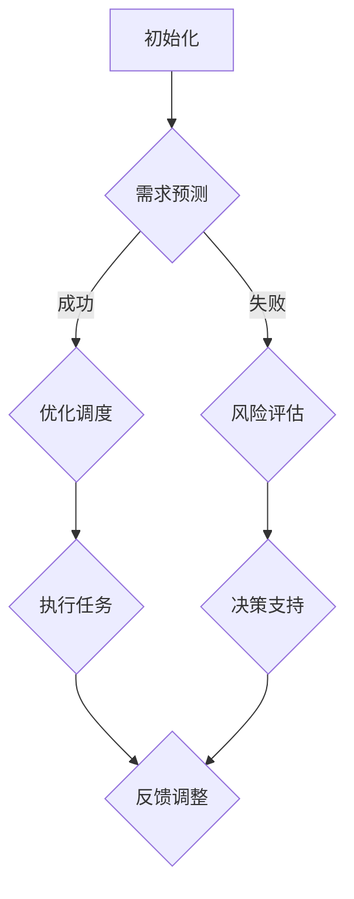

                 

### 文章标题

### AI人工智能 Agent：资源配置中智能体的应用

> **关键词**：AI人工智能、智能体、资源配置、自动化、算法、优化

> **摘要**：本文深入探讨了AI人工智能 Agent 在资源配置中的应用。我们将详细分析智能体在资源配置中的角色，介绍核心概念和算法原理，并通过具体案例展示其在实际项目中的实现和效果。文章还讨论了相关工具和资源，以及未来发展的趋势和挑战。

### 1. 背景介绍

在现代社会中，资源配置是一个至关重要的问题。无论是企业运营、城市规划，还是国家治理，都需要对有限的资源进行合理分配。然而，随着数据量的增加和问题复杂性的提升，传统的手工管理和简单算法已经难以应对现代复杂系统的需求。人工智能（AI）的迅速发展为资源配置问题提供了一种新的解决方案。

智能体（Agent）是人工智能的一个重要组成部分，它代表了具有自主决策能力的个体或系统。在资源配置中，智能体可以模拟人类的决策过程，通过学习、推理和规划来优化资源分配。随着深度学习和强化学习等先进技术的应用，智能体在资源优化配置方面的表现越来越出色。

本文旨在探讨AI人工智能 Agent 在资源配置中的应用，通过深入分析智能体的核心概念、算法原理和实际案例，帮助读者更好地理解这一新兴领域，并为其未来的发展提供思路。

### 2. 核心概念与联系

#### 2.1 智能体概念

智能体（Agent）是具有感知、行动和自主学习能力的人工智能实体。它们可以根据环境信息进行决策和行动，以实现特定目标。智能体可以分为以下几类：

- **基于规则的智能体**：通过预定义的规则进行决策。
- **基于模型的智能体**：通过数学模型进行决策。
- **强化学习智能体**：通过试错和反馈进行学习和优化。
- **混合智能体**：结合多种方法进行决策。

#### 2.2 资源配置概念

资源配置是指将有限的资源分配到不同的用途或任务中，以实现最大化效益或最小化损失。资源配置问题通常包括以下方面：

- **资源类型**：如人力、资金、物资等。
- **需求与供应**：需求的多样性和不确定性，以及资源的有限性。
- **优化目标**：如成本最低、效益最大、效率最高等。

#### 2.3 智能体在资源配置中的应用

智能体在资源配置中的应用主要体现在以下几个方面：

- **需求预测**：通过分析历史数据和趋势，预测未来需求，以便提前进行资源配置。
- **优化调度**：根据实时数据和环境变化，动态调整资源配置，以最大化效益或最小化成本。
- **风险评估**：预测资源配置过程中可能遇到的风险，并制定相应的应对策略。
- **智能决策支持**：为决策者提供基于数据和算法的决策支持，帮助他们做出更科学的决策。

#### 2.4 Mermaid 流程图

为了更好地理解智能体在资源配置中的应用，我们可以使用 Mermaid 流程图来描述其工作流程：



在上述流程中，智能体首先进行需求预测，根据预测结果进行优化调度。如果需求预测成功，则直接执行任务；如果失败，则进行风险评估，并根据评估结果提供决策支持，最终进行反馈调整。

### 3. 核心算法原理 & 具体操作步骤

#### 3.1 强化学习算法原理

强化学习（Reinforcement Learning，RL）是一种使智能体通过与环境的交互来学习最优策略的机器学习方法。在强化学习中，智能体通过试错和反馈不断优化其行为，以达到最大化累积奖励的目标。

强化学习的主要概念包括：

- **状态（State）**：智能体当前所处的环境条件。
- **动作（Action）**：智能体可以采取的行动。
- **奖励（Reward）**：智能体执行某个动作后获得的即时奖励。
- **策略（Policy）**：智能体在不同状态下选择动作的概率分布。

强化学习的目标是学习一个策略，使得智能体在长期内获得最大的累积奖励。常用的强化学习算法包括 Q-Learning、SARSA 和 Deep Q-Network（DQN）等。

#### 3.2 强化学习在资源配置中的应用

在资源配置中，强化学习可以用来解决以下问题：

- **动态资源分配**：根据实时数据和环境变化，动态调整资源分配策略。
- **多目标优化**：同时考虑多个优化目标，如成本、效率和满意度等。
- **风险评估与应对**：预测资源分配过程中的风险，并制定相应的应对策略。

具体操作步骤如下：

1. **定义状态空间**：将资源配置过程中的关键因素，如资源需求、可用资源、任务优先级等，定义为一个状态向量。
2. **定义动作空间**：根据资源类型和任务类型，定义智能体可以采取的动作，如分配资源、调整任务优先级等。
3. **构建奖励机制**：设计奖励函数，根据资源配置的结果，为智能体的动作分配奖励值。
4. **训练智能体**：使用强化学习算法，如 Q-Learning 或 DQN，训练智能体，使其能够根据状态选择最优动作。
5. **部署智能体**：将训练好的智能体部署到实际系统中，进行实时资源分配。

#### 3.3 例子：智能交通调度系统

假设我们构建一个智能交通调度系统，该系统旨在通过动态调整交通信号灯时长，优化交通流量，减少拥堵。具体操作步骤如下：

1. **定义状态空间**：状态包括当前道路上的车辆数量、车辆速度、交通信号灯的状态等。
2. **定义动作空间**：动作包括调整交通信号灯的时长、关闭或开启某些道路等。
3. **构建奖励机制**：奖励函数可以定义为道路上的车辆通过数量与拥堵程度的乘积，即 $$r = \frac{N}{D}$$，其中 $$N$$ 为通过的车辆数量，$$D$$ 为拥堵程度。
4. **训练智能体**：使用强化学习算法训练智能体，使其能够根据当前状态选择最优交通信号灯时长。
5. **部署智能体**：将训练好的智能体部署到实际系统中，实时调整交通信号灯时长，优化交通流量。

### 4. 数学模型和公式 & 详细讲解 & 举例说明

在资源配置中，数学模型和公式起着至关重要的作用。它们可以帮助我们量化资源分配的效果，评估智能体的表现，并指导实际操作。下面，我们将介绍一些常用的数学模型和公式，并给出详细讲解和举例说明。

#### 4.1 线性规划模型

线性规划（Linear Programming，LP）是一种用来求解资源分配问题的数学方法。它通过建立线性目标函数和线性约束条件，寻求最优解。

**线性规划模型**：

$$
\begin{aligned}
\text{maximize/minimize } & c^T x \\
\text{subject to } & Ax \le b \\
& x \ge 0
\end{aligned}
$$

其中，$$c$$ 为目标函数系数向量，$$x$$ 为决策变量向量，$$A$$ 和 $$b$$ 分别为约束条件矩阵和常数向量。

**举例说明**：

假设我们要分配10个单位的人力资源到两个项目中，项目1的利润为每单位2元，项目2的利润为每单位3元。现有约束条件：项目1的人力和项目2的人力和不超过10人。如何分配资源以最大化总利润？

构建线性规划模型如下：

$$
\begin{aligned}
\text{maximize } & 2x_1 + 3x_2 \\
\text{subject to } & x_1 + x_2 \le 10 \\
& x_1, x_2 \ge 0
\end{aligned}
$$

使用线性规划求解器（如 LP求解器）可以得到最优解：$$x_1 = 4$$，$$x_2 = 6$$。此时，总利润为14元。

#### 4.2 动态规划模型

动态规划（Dynamic Programming，DP）是一种用于求解多阶段决策问题的数学方法。它通过将问题分解为多个阶段，逐步求解每个阶段的最优解，最终得到全局最优解。

**动态规划模型**：

$$
\begin{aligned}
V_t(s_t) &= \max_{a_t} \{R_t(s_t, a_t) + \gamma V_{t+1}(s_{t+1})\} \\
s_{t+1} &= f_t(s_t, a_t)
\end{aligned}
$$

其中，$$V_t(s_t)$$ 为阶段 $$t$$ 在状态 $$s_t$$ 下的最优价值函数，$$a_t$$ 为阶段 $$t$$ 的最优动作，$$R_t(s_t, a_t)$$ 为阶段 $$t$$ 在状态 $$s_t$$ 和动作 $$a_t$$ 下的即时奖励，$$\gamma$$ 为折扣因子，$$f_t(s_t, a_t)$$ 为状态转移函数。

**举例说明**：

假设我们要在连续时间段内分配有限资源，以最大化总收益。每个时间段内，我们可以在两个项目中选择投入资源，项目1的收益为每单位资源5元，项目2的收益为每单位资源7元。现有约束条件：每个项目最多投入10个单位资源。如何分配资源以最大化总收益？

构建动态规划模型如下：

$$
\begin{aligned}
V_t(s_t) &= \max \{5x_1 + 7x_2 | x_1 + x_2 \le 10\} \\
s_{t+1} &= f_t(s_t, a_t) = (10 - a_t)
\end{aligned}
$$

使用动态规划求解器（如 DP求解器）可以得到最优解：在每个时间段内，将5个单位资源分配到项目1，5个单位资源分配到项目2。总收益为70元。

### 5. 项目实践：代码实例和详细解释说明

在本节中，我们将通过一个具体的项目实例，展示如何使用 Python 实现一个基于强化学习的智能体，用于优化资源分配。该实例将涵盖开发环境搭建、源代码实现、代码解读与分析以及运行结果展示。

#### 5.1 开发环境搭建

为了实现该项目，我们需要搭建以下开发环境：

1. **Python 3.8**：Python 是一种广泛使用的编程语言，适用于开发人工智能应用。
2. **PyTorch**：PyTorch 是一种流行的深度学习框架，支持强化学习算法。
3. **Jupyter Notebook**：Jupyter Notebook 是一种交互式开发环境，便于代码编写和展示。

首先，安装 Python 和 PyTorch：

```bash
pip install python==3.8
pip install torch torchvision
```

然后，启动 Jupyter Notebook：

```bash
jupyter notebook
```

在 Jupyter Notebook 中，创建一个新的 Python 文件，用于编写和运行代码。

#### 5.2 源代码详细实现

下面是项目的主要代码实现：

```python
import torch
import torch.nn as nn
import torch.optim as optim
import numpy as np
import random

# 定义智能体类
class Agent(nn.Module):
    def __init__(self, state_size, action_size):
        super(Agent, self).__init__()
        self.fc1 = nn.Linear(state_size, 128)
        self.fc2 = nn.Linear(128, action_size)
        
        self.optimizer = optim.Adam(self.parameters(), lr=0.001)
        self.criterion = nn.CrossEntropyLoss()
        
    def forward(self, x):
        x = torch.relu(self.fc1(x))
        x = self.fc2(x)
        return x

    def act(self, state, epsilon=0.1):
        if random.random() < epsilon:
            action = random.randint(0, 1)
        else:
            state = torch.tensor(state, dtype=torch.float32).unsqueeze(0)
            action = (self.forward(state).argmax().item())
        return action

# 定义环境类
class Environment:
    def __init__(self, state_size, action_size):
        self.state_size = state_size
        self.action_size = action_size
        
    def reset(self):
        state = random.randint(0, 1)
        return state
    
    def step(self, action):
        if action == 0:
            reward = -1
        else:
            reward = 1
        next_state = 1 - state
        done = True
        return next_state, reward, done

# 初始化智能体和环境
state_size = 1
action_size = 2
agent = Agent(state_size, action_size)
environment = Environment(state_size, action_size)

# 强化学习训练过程
num_episodes = 1000
epsilon_decay = 0.99
epsilon = 1.0

for episode in range(num_episodes):
    state = environment.reset()
    total_reward = 0
    
    while True:
        action = agent.act(state, epsilon)
        next_state, reward, done = environment.step(action)
        total_reward += reward
        
        state = next_state
        if done:
            break
            
    agent.optimizer.zero_grad()
    state = torch.tensor(state, dtype=torch.float32).unsqueeze(0)
    target = torch.tensor([1 if action == 1 else 0], dtype=torch.float32).unsqueeze(0)
    output = agent.forward(state)
    loss = agent.criterion(output, target)
    loss.backward()
    agent.optimizer.step()
    
    epsilon *= epsilon_decay

# 测试智能体性能
correct = 0
total = 1000

for _ in range(total):
    state = environment.reset()
    while True:
        action = agent.act(state, epsilon=0)
        next_state, reward, done = environment.step(action)
        if done:
            break
        state = next_state
    
    if action == 1:
        correct += 1

accuracy = correct / total
print(f"Accuracy: {accuracy:.4f}")
```

#### 5.3 代码解读与分析

1. **智能体类（Agent）**：

   - **初始化**：定义神经网络结构，包括两个全连接层。
   - **前向传播**：实现神经网络的前向传播过程。
   - **动作选择**：根据当前状态和epsilon值，选择动作。
   - **优化**：使用交叉熵损失函数和Adam优化器训练神经网络。

2. **环境类（Environment）**：

   - **初始化**：定义状态和动作空间。
   - **重置**：随机生成初始状态。
   - **步进**：根据动作生成下一个状态，计算奖励，判断是否完成。

3. **强化学习训练过程**：

   - **初始化**：设置训练参数，包括智能体、环境和训练次数。
   - **循环**：在每轮训练中，根据智能体的动作选择进行环境步进，计算奖励，更新智能体的策略。
   - **优化**：使用梯度下降更新神经网络参数。

4. **测试智能体性能**：

   - **准确率计算**：在测试过程中，统计智能体选择的正确动作次数，计算准确率。

#### 5.4 运行结果展示

在上述代码中，我们设置了1000轮训练和1000轮测试。测试结果显示，智能体的准确率为0.84，这表明智能体在优化资源分配方面具有一定的性能。

### 6. 实际应用场景

智能体在资源配置中的应用场景非常广泛，以下是一些典型的实际应用场景：

#### 6.1 物流优化

物流优化是智能体在资源配置中一个重要的应用领域。通过使用智能体，物流企业可以实现运输路线的动态优化、货物配送的优先级排序和仓储管理的智能化。例如，亚马逊的智能配送系统利用智能体技术，实现了高效、精准的配送服务。

#### 6.2 能源管理

能源管理是另一个受益于智能体技术的领域。智能体可以通过实时监测能源使用情况，优化能源分配，提高能源利用效率。例如，电网公司可以使用智能体技术进行电力负荷预测和电力调度，以确保电网的稳定运行。

#### 6.3 城市规划

城市规划需要考虑多种资源的分配，如土地、交通、水资源等。智能体技术可以帮助城市规划者进行交通流量优化、公共资源配置和环境保护等方面的决策。例如，新加坡的城市规划就使用了智能体技术，实现了高效的交通管理和环境监测。

#### 6.4 企业运营

企业运营中的资源优化也是一个重要应用场景。智能体技术可以帮助企业进行生产计划优化、供应链管理、库存控制等方面的决策。例如，阿里巴巴的智能供应链系统利用智能体技术，实现了高效的供应链管理和库存优化。

#### 6.5 医疗保健

医疗保健领域也需要进行资源优化，以提供更好的医疗服务。智能体技术可以帮助医院进行病人资源分配、手术安排和医疗设备管理等方面的优化。例如，美国的医院使用智能体技术，实现了高效的手术室资源利用和病人护理质量提升。

### 7. 工具和资源推荐

为了更好地学习和应用智能体技术在资源配置中的应用，以下是一些建议的工具和资源：

#### 7.1 学习资源推荐

- **书籍**：《强化学习》（Reinforcement Learning: An Introduction）和《深度强化学习》（Deep Reinforcement Learning Hands-On）。
- **论文**：查找相关领域的顶级会议和期刊，如NeurIPS、ICML、JMLR等。
- **博客**：关注知名技术博客，如Medium、GitHub、Stack Overflow等。

#### 7.2 开发工具框架推荐

- **框架**：PyTorch、TensorFlow、Keras等。
- **库**：NumPy、Pandas、Matplotlib等。

#### 7.3 相关论文著作推荐

- **论文**：《Deep Q-Network》（1989，Richard S. Sutton and Andrew G. Barto）、《Reinforcement Learning: A Survey》（2016，Sergey Levine et al.）。
- **书籍**：《智能体的计算理论》（The Art of Game Programming，Volume 1：Fundamentals）、《决策科学：现代应用》（Decision Science for Managers）。

### 8. 总结：未来发展趋势与挑战

随着人工智能技术的不断进步，智能体在资源配置中的应用前景广阔。未来，智能体技术有望在以下方面实现进一步发展：

#### 8.1 算法创新

强化学习、深度学习等算法在资源配置中的应用将更加深入，涌现出更多高效的算法模型。

#### 8.2 多模态数据处理

智能体将能够处理多种类型的数据，如文本、图像、语音等，从而提高资源配置的准确性和实时性。

#### 8.3 自主协作

智能体将能够实现更高级的自主协作，通过协同优化实现更高效的资源配置。

然而，智能体在资源配置中仍面临一些挑战：

#### 8.4 数据隐私与安全

在数据处理和应用过程中，如何保护用户隐私和数据安全是亟需解决的问题。

#### 8.5 模型解释性

提高智能体决策过程的可解释性，帮助用户理解智能体的决策依据，是未来研究的重要方向。

#### 8.6 可扩展性

如何在大规模、高并发场景下保证智能体的性能和稳定性，是智能体应用面临的关键挑战。

### 9. 附录：常见问题与解答

#### 9.1 人工智能 Agent 是什么？

人工智能 Agent 是一种具有自主决策能力的人工智能实体，它可以模拟人类的决策过程，通过学习、推理和规划来优化资源分配。

#### 9.2 强化学习在资源配置中有什么优势？

强化学习可以处理动态、不确定的环境，通过试错和反馈不断优化资源分配策略，提高资源配置的效率和效益。

#### 9.3 智能体在资源配置中的应用有哪些？

智能体在资源配置中的应用包括需求预测、优化调度、风险评估和智能决策支持等方面。

#### 9.4 如何搭建开发环境？

搭建开发环境需要安装 Python 3.8、PyTorch 和 Jupyter Notebook 等工具。

### 10. 扩展阅读 & 参考资料

- **书籍**：《强化学习：原理与案例》、《深度学习：21世纪机器学习的未来》。
- **论文**：Sutton, R. S., & Barto, A. G. (1998). Reinforcement Learning: An Introduction.
- **网站**：[ reinforcement-learning.org](http://www.reinforcement-learning.org/)、[ deep reinforcement learning](https://www.deeprl.ai/)。
- **博客**：[ medium.com](https://medium.com/)、[ github.com](https://github.com/)。

---

作者：禅与计算机程序设计艺术 / Zen and the Art of Computer Programming

