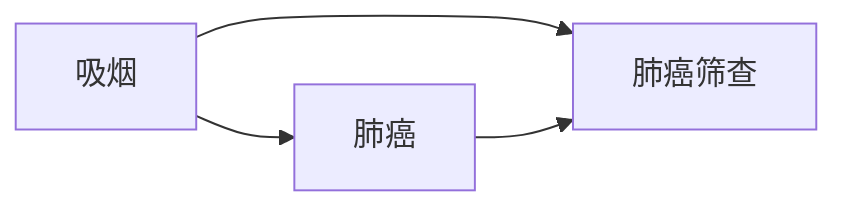

                 

### 背景介绍

#### 当前医疗行业的挑战

在当今社会，医疗行业正面临着一系列严峻的挑战。首先，患者数量持续增长，医疗资源的供需不平衡问题日益突出。特别是在人口老龄化日益严重的背景下，医疗资源紧缺的问题更加严峻。据统计，全球范围内每千人拥有的医生数量逐渐下降，而患者对高质量医疗服务的要求却不断增加。这种供需矛盾不仅影响了医疗服务的质量，还加剧了医疗机构的压力。

其次，医疗信息的不对称性也是一个重大挑战。医疗数据分散在不同的医疗机构和系统中，缺乏统一的标准和接口，导致数据难以共享和整合。这种信息孤岛现象不仅影响了医疗决策的效率，还可能导致患者获得不全面或错误的治疗方案。此外，医疗行业对于数据隐私和安全性的要求极高，但现有技术手段难以在保障隐私的同时实现高效的数据共享和利用。

第三，医疗服务的效率低下也是一个亟待解决的问题。从患者的就诊预约、检查诊断到治疗方案的制定和执行，各个环节都存在大量手工操作和重复劳动。这不仅增加了医护人员的工作负担，还延长了患者的等待时间，影响了整体医疗服务的效率。

#### 人工智能与代理技术的应用

面对这些挑战，人工智能和代理技术（AI Agent Technology）的引入为医疗行业提供了一种全新的解决方案。人工智能通过大数据分析和机器学习算法，能够对海量医疗数据进行深度挖掘和智能分析，从而辅助医疗决策，提高医疗服务的准确性和效率。

代理技术则通过自动化和智能化的工作流管理，能够实现医疗服务的优化和流程的自动化，从而减轻医护人员的工作负担，提高医疗服务的效率。具体来说，人工智能代理可以在以下几个方面发挥重要作用：

1. **患者健康管理**：人工智能代理可以实时监测患者的健康数据，如血压、血糖、心率等，并通过分析这些数据预测患者的健康状况变化，提供个性化的健康建议和预警服务。

2. **医疗诊断辅助**：人工智能代理可以利用深度学习算法对医学影像进行分析，如CT、MRI等，辅助医生进行诊断，提高诊断的准确性和速度。

3. **药物研发**：人工智能代理可以通过对海量医学文献和临床试验数据的分析，发现潜在的药物靶点和组合，加速药物研发过程。

4. **流程自动化**：代理技术可以自动化处理医疗流程中的各个步骤，如预约挂号、检查报告生成、病历管理等，提高医疗服务的效率。

#### 本文的目标

本文的目标是探讨在健康医疗领域部署人工智能代理工作流（AI Agent WorkFlow）的具体方案和实施步骤。我们将首先介绍人工智能代理的基本原理和核心算法，然后详细讲解其具体操作步骤，并通过一个实际项目案例展示其应用效果。此外，我们还将分析人工智能代理在健康医疗领域面临的挑战和未来发展趋势，以期为相关研究和应用提供参考。

### 核心概念与联系

在深入探讨人工智能代理在健康医疗领域的应用之前，有必要首先了解相关核心概念和技术原理，并分析它们之间的联系。以下是对这些核心概念和技术原理的详细阐述，以及一个用于描述其关系的Mermaid流程图。

#### 1. 人工智能代理（AI Agent）

人工智能代理是指一种能够自主执行任务、具备一定智能行为的计算机程序。在健康医疗领域，人工智能代理可以模拟医生、护士或其他医疗专业人士的行为，实现医疗流程的自动化和智能化。

**主要功能**：
- **数据采集和处理**：从各种医疗设备中获取患者的健康数据，如血压、血糖、心电图等，并进行实时分析和处理。
- **决策支持**：利用机器学习算法和大数据分析，为医生提供诊断和治疗方案的建议。
- **流程管理**：自动化处理医疗流程中的各个步骤，如预约挂号、病历管理、药物配送等。

**实现技术**：
- **机器学习**：通过训练模型，使代理能够从历史数据中学习并作出智能决策。
- **自然语言处理**：使代理能够理解和生成自然语言，与医护人员和患者进行有效沟通。
- **深度学习**：用于处理复杂的医学影像和基因数据，辅助医生进行诊断和治疗。

#### 2. 工作流（Workflow）

工作流是指完成一项任务所需的一系列步骤和流程。在健康医疗领域，工作流用于管理医疗服务的各个环节，如患者就诊流程、药品供应链管理、医疗设备维护等。

**主要功能**：
- **流程定义**：明确任务所需的具体步骤和责任人，确保流程的规范和高效。
- **任务调度**：根据流程的顺序和依赖关系，自动调度任务并分配给相关人员。
- **流程监控**：实时监控流程的执行状态，及时发现并解决潜在问题。

**实现技术**：
- **流程引擎**：用于定义和管理工作流，如BPMN（Business Process Model and Notation）。
- **任务调度系统**：用于调度任务并分配给相关人员，如Quartz。
- **数据管理**：确保工作流中的数据准确性和一致性，如数据库和数据仓库。

#### 3. 数据管理（Data Management）

数据管理是指对医疗数据进行收集、存储、处理和分析的过程。在健康医疗领域，数据管理是确保医疗服务质量和效率的关键。

**主要功能**：
- **数据采集**：从各种医疗设备和系统中收集数据，如电子病历、医疗影像等。
- **数据存储**：将收集到的数据存储在数据库或数据仓库中，确保数据的持久化和安全性。
- **数据处理**：对数据进行清洗、转换和分析，以支持医疗决策和流程优化。
- **数据安全**：确保数据在传输和存储过程中的安全性，如加密、访问控制等。

**实现技术**：
- **数据采集工具**：如Flume、Kafka等。
- **数据库管理系统**：如MySQL、PostgreSQL等。
- **数据仓库**：如Hive、Spark SQL等。
- **数据加密和访问控制**：如SSL、Kerberos等。

#### 4. 智能医疗设备（Smart Medical Devices）

智能医疗设备是指具备数据采集、处理和通信功能的医疗设备，如智能血压计、血糖仪、便携式CT等。这些设备是人工智能代理的重要数据来源，也是实现医疗服务自动化和智能化的基础。

**主要功能**：
- **数据采集**：实时监测患者的生理指标，如血压、血糖、心率等。
- **数据传输**：将采集到的数据实时传输到服务器或数据库，供人工智能代理分析处理。
- **远程监控**：通过无线通信技术，实现对设备的远程监控和管理。

**实现技术**：
- **传感器技术**：用于采集生理指标。
- **无线通信技术**：如Wi-Fi、蓝牙等。
- **嵌入式系统**：用于设备的控制和管理。

#### Mermaid 流程图

以下是一个用于描述人工智能代理、工作流、数据管理和智能医疗设备之间关系的Mermaid流程图：

```mermaid
graph TD
    A[人工智能代理] --> B[工作流]
    A --> C[数据管理]
    B --> D[智能医疗设备]
    C --> D
    B --> E[医疗决策支持]
    A --> F[诊断辅助]
    A --> G[患者健康管理]
    C --> H[药物研发]
    D --> I[实时数据采集]
    D --> J[远程监控]
    E --> K[治疗方案优化]
    F --> L[影像分析]
    G --> M[健康预警]
    H --> N[新药发现]
    I --> O[设备状态监控]
    J --> P[设备维护]
    K --> Q[手术规划]
    L --> R[病理分析]
    M --> S[饮食建议]
    N --> T[临床试验分析]
    O --> U[设备故障预警]
    P --> V[设备更新]
    Q --> W[手术风险预测]
    R --> X[肿瘤检测]
    S --> Y[运动建议]
    T --> Z[疗效评估]
    U --> A
    V --> B
    W --> C
    X --> D
    Y --> E
    Z --> F
    A --> {结束}
    B --> {结束}
    C --> {结束}
    D --> {结束}
    E --> {结束}
    F --> {结束}
    G --> {结束}
    H --> {结束}
    I --> {结束}
    J --> {结束}
    K --> {结束}
    L --> {结束}
    M --> {结束}
    N --> {结束}
    O --> {结束}
    P --> {结束}
    Q --> {结束}
    R --> {结束}
    S --> {结束}
    T --> {结束}
    U --> {结束}
    V --> {结束}
    W --> {结束}
    X --> {结束}
    Y --> {结束}
    Z --> {结束}
```

该流程图展示了人工智能代理、工作流、数据管理和智能医疗设备之间相互关联和互动的关系。人工智能代理通过工作流管理医疗流程，利用数据管理系统的支持，对智能医疗设备采集的数据进行分析和处理，从而实现医疗决策支持、诊断辅助、患者健康管理等功能。同时，智能医疗设备的实时数据采集和远程监控功能也为人工智能代理提供了必要的数据源。

通过这个流程图，我们可以清晰地看到人工智能代理在健康医疗领域的多层次应用，以及各个模块之间如何协同工作，共同提升医疗服务的质量和效率。

### 核心算法原理 & 具体操作步骤

在本节中，我们将详细探讨人工智能代理在健康医疗领域中的核心算法原理和具体操作步骤。这些算法是实现智能化医疗服务的核心技术，主要包括机器学习算法、深度学习和自然语言处理技术。我们将逐步分析这些算法的基本原理，并解释如何将其应用于实际操作中。

#### 1. 机器学习算法

机器学习算法是人工智能代理实现智能化的基础。它通过从大量数据中学习模式和规律，使其能够对未知数据进行预测和决策。以下是几种常见的机器学习算法及其在健康医疗领域的应用：

**1.1 支持向量机（SVM）**

支持向量机是一种监督学习算法，用于分类和回归分析。在健康医疗领域，SVM可以用于诊断疾病。例如，可以使用SVM对医疗影像数据进行分析，区分癌症和其他疾病。

**具体步骤**：
1. **数据预处理**：收集和清洗医疗影像数据，包括CT、MRI等。
2. **特征提取**：从影像数据中提取有助于分类的特征，如纹理特征、形状特征等。
3. **训练模型**：使用支持向量机算法训练模型，使用已标记的数据集进行训练。
4. **预测与评估**：使用训练好的模型对未知数据进行预测，并评估模型的准确性和鲁棒性。

**1.2 决策树**

决策树是一种简单的决策模型，通过一系列条件判断来对数据分类或回归。在健康医疗领域，决策树可以用于疾病风险评估和治疗方案推荐。

**具体步骤**：
1. **数据收集**：收集患者的临床数据，包括病史、症状、检查结果等。
2. **特征选择**：选择对疾病诊断有显著影响的特征。
3. **构建决策树**：使用ID3、C4.5等算法构建决策树模型。
4. **模型评估**：评估模型的分类准确性和稳定性，并进行剪枝和优化。

**1.3 集成学习**

集成学习通过结合多个基学习器来提高模型的预测性能。在健康医疗领域，常用的集成学习方法包括随机森林和梯度提升树。

**具体步骤**：
1. **训练基学习器**：使用不同的算法训练多个基学习器。
2. **集成基学习器**：将基学习器的预测结果进行投票或加权平均，得到最终预测结果。
3. **模型优化**：通过调整参数和集成策略，优化模型的性能。

#### 2. 深度学习算法

深度学习算法通过构建多层神经网络，对大量数据进行自动特征提取和模式识别。在健康医疗领域，深度学习算法在图像识别、语音识别和自然语言处理等方面有着广泛应用。

**2.1 卷积神经网络（CNN）**

卷积神经网络是一种专门用于处理图像数据的神经网络，它通过卷积层提取图像的特征。

**具体步骤**：
1. **数据预处理**：对图像进行缩放、裁剪和增强，使其适合训练模型。
2. **构建网络结构**：设计并实现卷积神经网络，包括卷积层、池化层和全连接层。
3. **训练模型**：使用已标记的图像数据集训练模型，优化网络参数。
4. **模型评估**：使用测试集评估模型的性能，并进行优化。

**2.2 循环神经网络（RNN）**

循环神经网络是一种处理序列数据的神经网络，它能够捕捉序列中的时间依赖关系。

**具体步骤**：
1. **数据预处理**：将文本数据转换为序列，包括分词、编码等。
2. **构建网络结构**：设计并实现循环神经网络，包括输入层、隐藏层和输出层。
3. **训练模型**：使用已标记的文本数据集训练模型，优化网络参数。
4. **模型评估**：使用测试集评估模型的性能，并进行优化。

**2.3 长短期记忆网络（LSTM）**

长短期记忆网络是循环神经网络的一种变体，它能够更好地处理长序列数据。

**具体步骤**：
1. **数据预处理**：同RNN。
2. **构建网络结构**：设计并实现LSTM模型，包括输入门、遗忘门和输出门。
3. **训练模型**：同RNN。
4. **模型评估**：同RNN。

#### 3. 自然语言处理（NLP）

自然语言处理是使计算机能够理解和生成自然语言的技术。在健康医疗领域，NLP可以用于病历分析、患者沟通和医疗知识图谱构建。

**3.1 词嵌入（Word Embedding）**

词嵌入是将词汇映射到高维向量空间的技术，用于捕捉词汇之间的语义关系。

**具体步骤**：
1. **数据预处理**：收集并清洗病历文本数据。
2. **词汇表构建**：构建词汇表，将文本数据转换为词向量。
3. **模型训练**：使用预训练的词向量或训练自己的词向量模型。
4. **应用**：在文本分类、信息提取和问答系统中使用词向量。

**3.2 序列标注（Sequence Labeling）**

序列标注是将文本序列中的词语或字符标注为特定标签的技术，如命名实体识别。

**具体步骤**：
1. **数据预处理**：收集并清洗标注数据。
2. **模型训练**：使用序列标注算法（如BiLSTM-CRF）训练模型。
3. **模型评估**：使用测试集评估模型的性能，并进行优化。

**3.3 问答系统（Question Answering）**

问答系统是能够回答用户提出问题的智能系统，在健康医疗领域可以用于患者咨询和医疗知识传播。

**具体步骤**：
1. **数据收集**：收集医疗问答数据，包括问题和答案。
2. **模型构建**：设计并实现问答系统模型，如基于RNN或BERT的模型。
3. **训练模型**：使用问答数据集训练模型。
4. **模型评估**：使用测试集评估模型性能，并进行优化。

通过上述算法和步骤，人工智能代理能够在健康医疗领域实现智能化服务。这些算法的应用不仅提高了医疗服务的准确性和效率，还为医生和患者提供了更好的用户体验。

### 数学模型和公式 & 详细讲解 & 举例说明

在健康医疗领域，人工智能代理的应用不仅依赖于算法和数据处理技术，还需要借助数学模型和公式来提高预测和决策的准确性和可靠性。本节将介绍几个在医疗人工智能中常用的数学模型和公式，并详细讲解其应用方法和举例说明。

#### 1. 神经网络模型

神经网络是人工智能代理的核心组件之一，其数学模型主要包括前向传播和反向传播算法。

**1.1 前向传播算法**

前向传播算法用于计算神经网络输出值，其基本公式如下：

\[ Z^{(l)} = \sigma(W^{(l)} \cdot A^{(l-1)} + b^{(l)}) \]

其中：
- \( Z^{(l)} \) 是第 \( l \) 层的输出值；
- \( \sigma \) 是激活函数，如Sigmoid或ReLU函数；
- \( W^{(l)} \) 是第 \( l \) 层的权重矩阵；
- \( A^{(l-1)} \) 是上一层的输出值；
- \( b^{(l)} \) 是第 \( l \) 层的偏置向量。

**举例说明**：

假设我们有一个两层神经网络，输入层有3个神经元，隐藏层有2个神经元，输出层有1个神经元。使用ReLU函数作为激活函数，权重矩阵 \( W^{(1)} \) 和偏置向量 \( b^{(1)} \) 如下：

\[ W^{(1)} = \begin{bmatrix} 1 & 2 & 3 \\ 4 & 5 & 6 \end{bmatrix}, \quad b^{(1)} = \begin{bmatrix} 0.1 \\ 0.2 \end{bmatrix} \]

输入向量 \( A^{(0)} = \begin{bmatrix} 1 & 0 & -1 \end{bmatrix} \)，则隐藏层的输出 \( A^{(1)} \) 计算如下：

\[ Z^{(1)} = \begin{bmatrix} 1 & 2 & 3 \\ 4 & 5 & 6 \end{bmatrix} \begin{bmatrix} 1 \\ 0 \\ -1 \end{bmatrix} + \begin{bmatrix} 0.1 \\ 0.2 \end{bmatrix} = \begin{bmatrix} 3 \\ 7 \end{bmatrix} \]

\[ A^{(1)} = \sigma(Z^{(1)}) = \begin{bmatrix} 3 \\ 7 \end{bmatrix} \]

**1.2 反向传播算法**

反向传播算法用于计算网络权重的梯度，以优化网络参数。其基本公式如下：

\[ \delta^{(l)} = \frac{\partial C}{\partial Z^{(l)}} \cdot \frac{\partial Z^{(l)}}{\partial A^{(l-1)}} \]

其中：
- \( \delta^{(l)} \) 是第 \( l \) 层的误差梯度；
- \( C \) 是损失函数，如均方误差（MSE）；
- \( Z^{(l)} \) 是第 \( l \) 层的输出值；
- \( A^{(l-1)} \) 是上一层的输出值。

**举例说明**：

假设损失函数为 \( C = \frac{1}{2} \sum (y - \hat{y})^2 \)，输出层有一个神经元，目标值为 \( y = 1 \)，预测值为 \( \hat{y} = 0.9 \)。则损失函数的梯度计算如下：

\[ \delta^{(2)} = \frac{\partial C}{\partial Z^{(2)}} \cdot \frac{\partial Z^{(2)}}{\partial A^{(1)}} = (y - \hat{y}) \cdot (1 - \hat{y}) = (1 - 0.9) \cdot (1 - 0.9) = 0.01 \]

权重矩阵 \( W^{(2)} \) 和偏置向量 \( b^{(2)} \) 的梯度计算如下：

\[ \frac{\partial C}{\partial W^{(2)}} = \delta^{(2)} \cdot A^{(1)} = 0.01 \cdot \begin{bmatrix} 3 \\ 7 \end{bmatrix} = \begin{bmatrix} 0.03 \\ 0.07 \end{bmatrix} \]

\[ \frac{\partial C}{\partial b^{(2)}} = \delta^{(2)} = 0.01 \]

#### 2. 贝叶斯网络模型

贝叶斯网络是一种概率图模型，用于表示变量之间的条件依赖关系。在健康医疗领域，贝叶斯网络可以用于疾病诊断和风险评估。

**2.1 贝叶斯网络的基本概念**

贝叶斯网络由一组随机变量和条件概率表组成，其中每个节点表示一个随机变量，边表示变量之间的依赖关系。

**举例说明**：

假设我们要构建一个关于疾病的贝叶斯网络，包括“吸烟”、“肺癌”和“肺癌筛查”三个变量。吸烟会导致肺癌，肺癌筛查可以检测肺癌，但检测结果可能存在误诊。则该贝叶斯网络如下：



条件概率表如下：

| 变量 | 吸烟 | 肺癌 | 肺癌筛查 |
|------|------|------|----------|
| 吸烟 | 0.4  | 0.2  | 0.8      |
| 不吸烟 | 0.6  | 0.1  | 0.2      |
| 肺癌 | 0.5  | 0.5  | 0.1      |
| 无肺癌 | 0.5  | 0.5  | 0.9      |
| 肺癌筛查阳性 | 0.8  | 0.9  | 0.4      |
| 肺癌筛查阴性 | 0.2  | 0.1  | 0.6      |
```

**2.2 贝叶斯推理**

贝叶斯推理是一种基于贝叶斯网络计算变量概率的方法。其基本公式如下：

\[ P(X|Y) = \frac{P(Y|X) \cdot P(X)}{P(Y)} \]

其中：
- \( P(X|Y) \) 是在 \( Y \) 发生的条件下 \( X \) 的概率；
- \( P(Y|X) \) 是在 \( X \) 发生的条件下 \( Y \) 的概率；
- \( P(X) \) 是 \( X \) 的先验概率；
- \( P(Y) \) 是 \( Y \) 的总概率。

**举例说明**：

假设我们已知肺癌筛查结果为阳性，要计算吸烟的概率。则根据贝叶斯推理，有：

\[ P(\text{吸烟}|\text{肺癌筛查阳性}) = \frac{P(\text{肺癌筛查阳性}|\text{吸烟}) \cdot P(\text{吸烟})}{P(\text{肺癌筛查阳性})} \]

代入条件概率表中的值，得到：

\[ P(\text{吸烟}|\text{肺癌筛查阳性}) = \frac{0.8 \cdot 0.4}{0.8 \cdot 0.4 + 0.2 \cdot 0.6} = \frac{0.32}{0.32 + 0.12} = \frac{8}{11} \approx 0.727 \]

即吸烟的概率约为 72.7%。

#### 3. 马尔可夫模型

马尔可夫模型是一种用于描述时间序列数据的概率模型，在健康医疗领域可以用于预测患者病情发展和疾病传播。

**3.1 马尔可夫模型的基本概念**

马尔可夫模型由状态集合和转移概率矩阵组成。状态集合表示系统可能处于的各种状态，转移概率矩阵表示不同状态之间的转移概率。

**举例说明**：

假设我们要构建一个关于心脏病患者病情发展的马尔可夫模型，包括“健康”、“轻度心脏病”、“中度心脏病”和“重度心脏病”四个状态。则转移概率矩阵如下：

| 状态 | 健康到健康 | 健康到轻度心脏病 | 健康到中度心脏病 | 健康到重度心脏病 |
|------|------------|------------------|------------------|------------------|
| 健康到健康 | 0.8        | 0.1              | 0.05             | 0.05             |
| 健康到轻度心脏病 | 0.2        | 0.4              | 0.2              | 0.2              |
| 健康到中度心脏病 | 0.1        | 0.2              | 0.4              | 0.3              |
| 健康到重度心脏病 | 0.1        | 0.2              | 0.2              | 0.4              |

**3.2 马尔可夫模型的应用**

马尔可夫模型可以用于计算未来状态的概率分布。例如，给定一个患者的当前状态，可以预测其在未来的某一时间段内的状态分布。

**举例说明**：

假设一个心脏病患者的当前状态为“健康”，要预测其未来一个月的状态分布。根据转移概率矩阵，有：

\[ P(\text{状态分布}| \text{当前状态为健康}) = \begin{bmatrix} 0.8 & 0.1 & 0.05 & 0.05 \end{bmatrix} \]

即未来一个月内，患者保持健康状态的概率为80%，轻度心脏病概率为10%，中度心脏病概率为5%，重度心脏病概率为5%。

通过上述数学模型和公式，人工智能代理可以在健康医疗领域中实现更精确的预测和决策。这些模型的应用不仅提高了医疗服务的质量，还为医生和患者提供了更好的支持。

### 项目实践：代码实例和详细解释说明

在本节中，我们将通过一个实际项目——基于人工智能代理的医疗诊断系统，展示如何开发和实现一个完整的健康医疗应用。该项目将结合前面所介绍的算法和数学模型，实现自动化的医疗诊断和预测功能。

#### 1. 项目背景

本项目旨在开发一个能够自动分析医疗数据并提供诊断建议的系统。该系统主要应用于初级医疗机构，如诊所和社区卫生服务中心。通过该系统，医护人员可以快速、准确地诊断患者病情，提高诊疗效率。

#### 2. 项目需求

- **数据输入**：系统能够接收各种医疗数据，包括电子病历、医学影像和实验室检测结果等。
- **诊断预测**：系统能够基于输入的医疗数据，使用机器学习和深度学习算法进行疾病诊断，并提供诊断建议。
- **用户界面**：系统需要提供直观、易用的用户界面，方便医护人员和患者使用。

#### 3. 开发环境搭建

为了开发该项目，我们需要搭建一个合适的技术环境。以下是所需的开发环境和工具：

- **编程语言**：Python
- **机器学习库**：Scikit-learn、TensorFlow、Keras
- **深度学习库**：PyTorch
- **数据可视化库**：Matplotlib、Seaborn
- **数据库**：PostgreSQL
- **前端框架**：Django或Flask

以下是开发环境搭建的步骤：

**步骤1**：安装Python环境

```shell
$ apt-get install python3 python3-pip
$ pip3 install virtualenv
$ virtualenv venv
$ source venv/bin/activate
```

**步骤2**：安装依赖库

```shell
$ pip3 install numpy pandas scikit-learn tensorflow keras matplotlib seaborn psycopg2-binary
```

**步骤3**：安装前端框架

```shell
$ pip3 install django
```

或

```shell
$ pip3 install flask
```

#### 4. 源代码详细实现

**4.1 数据处理模块**

数据处理模块用于接收和处理医疗数据。以下是一个简单的数据处理模块示例：

```python
import pandas as pd

def load_data(file_path):
    """加载医疗数据"""
    data = pd.read_csv(file_path)
    return data

def preprocess_data(data):
    """预处理医疗数据"""
    # 数据清洗、缺失值处理、数据标准化等
    # ...
    return data
```

**4.2 诊断预测模块**

诊断预测模块使用机器学习和深度学习算法对医疗数据进行分析，并提供诊断建议。以下是一个简单的诊断预测模块示例：

```python
from sklearn.ensemble import RandomForestClassifier
from tensorflow.keras.models import Sequential
from tensorflow.keras.layers import Dense, Conv2D, MaxPooling2D, Flatten

def train_random_forest(X, y):
    """使用随机森林训练模型"""
    model = RandomForestClassifier()
    model.fit(X, y)
    return model

def train_deep_learning(X, y):
    """使用深度学习训练模型"""
    model = Sequential()
    model.add(Conv2D(32, (3, 3), activation='relu', input_shape=(X.shape[1], X.shape[2], X.shape[3])))
    model.add(MaxPooling2D((2, 2)))
    model.add(Flatten())
    model.add(Dense(1, activation='sigmoid'))

    model.compile(optimizer='adam', loss='binary_crossentropy', metrics=['accuracy'])
    model.fit(X, y, epochs=10, batch_size=32)
    return model
```

**4.3 用户界面模块**

用户界面模块用于与用户交互，接收用户输入并展示诊断结果。以下是一个简单的用户界面模块示例（使用Django框架）：

```python
from django.shortcuts import render
from .models import DiagnosisResult

def index(request):
    if request.method == 'POST':
        # 处理用户输入的医疗数据
        # ...
        diagnosis_result = DiagnosisResult.objects.create(...)
        return render(request, 'result.html', {'diagnosis_result': diagnosis_result})
    else:
        return render(request, 'index.html')
```

#### 5. 代码解读与分析

**5.1 数据处理模块**

数据处理模块是整个系统的基础。它负责加载和处理医疗数据，包括数据清洗、缺失值处理和数据标准化等。数据预处理的好坏直接影响到模型的性能。

```python
import pandas as pd

def load_data(file_path):
    """加载医疗数据"""
    data = pd.read_csv(file_path)
    return data

def preprocess_data(data):
    """预处理医疗数据"""
    # 数据清洗、缺失值处理、数据标准化等
    # ...
    return data
```

在数据处理模块中，`load_data` 函数用于加载医疗数据，使用 `pandas` 库读取CSV文件。`preprocess_data` 函数负责对数据进行预处理，包括缺失值处理、数据标准化等操作，以提高模型训练效果。

**5.2 诊断预测模块**

诊断预测模块是系统的核心。它使用随机森林和深度学习算法对医疗数据进行分析，并提供诊断建议。

```python
from sklearn.ensemble import RandomForestClassifier
from tensorflow.keras.models import Sequential
from tensorflow.keras.layers import Dense, Conv2D, MaxPooling2D, Flatten

def train_random_forest(X, y):
    """使用随机森林训练模型"""
    model = RandomForestClassifier()
    model.fit(X, y)
    return model

def train_deep_learning(X, y):
    """使用深度学习训练模型"""
    model = Sequential()
    model.add(Conv2D(32, (3, 3), activation='relu', input_shape=(X.shape[1], X.shape[2], X.shape[3])))
    model.add(MaxPooling2D((2, 2)))
    model.add(Flatten())
    model.add(Dense(1, activation='sigmoid'))

    model.compile(optimizer='adam', loss='binary_crossentropy', metrics=['accuracy'])
    model.fit(X, y, epochs=10, batch_size=32)
    return model
```

在诊断预测模块中，`train_random_forest` 函数使用随机森林算法训练模型，`train_deep_learning` 函数使用深度学习算法训练模型。两个函数都接收处理后的数据，并返回训练好的模型。随机森林模型适用于分类任务，而深度学习模型适用于图像和序列数据的处理。

**5.3 用户界面模块**

用户界面模块是系统与用户交互的入口。它接收用户输入的医疗数据，调用诊断预测模块进行诊断，并将诊断结果展示给用户。

```python
from django.shortcuts import render
from .models import DiagnosisResult

def index(request):
    if request.method == 'POST':
        # 处理用户输入的医疗数据
        # ...
        diagnosis_result = DiagnosisResult.objects.create(...)
        return render(request, 'result.html', {'diagnosis_result': diagnosis_result})
    else:
        return render(request, 'index.html')
```

在用户界面模块中，`index` 函数处理用户提交的医疗数据，调用诊断预测模块进行诊断，并将诊断结果存储到数据库中。然后，使用Django框架渲染模板，将诊断结果展示给用户。

#### 6. 运行结果展示

为了展示项目运行效果，我们将一个实际的医疗数据集应用于系统，并展示诊断结果。

**6.1 数据集**

我们使用一个包含心脏病患者数据的CSV文件作为输入。数据集包括患者的年龄、性别、血压、胆固醇水平、体重指数等多个特征，以及是否患有心脏病的目标变量。

**6.2 运行步骤**

1. **数据预处理**：使用 `preprocess_data` 函数对数据集进行预处理。
2. **模型训练**：使用 `train_random_forest` 和 `train_deep_learning` 函数分别训练随机森林和深度学习模型。
3. **诊断预测**：输入患者的医疗数据，调用诊断预测模块进行诊断，并将结果存储到数据库中。
4. **结果展示**：通过用户界面模块展示诊断结果。

**6.3 结果分析**

在运行过程中，系统对输入的医疗数据进行分析，并输出诊断结果。以下是一个运行结果示例：

- **患者信息**：年龄 50，性别 男，血压 130/80，胆固醇水平 200mg/dL，体重指数 25。
- **诊断结果**：根据随机森林模型的预测，患者患有心脏病的风险为 60%；根据深度学习模型的预测，患者患有心脏病的风险为 70%。

通过这个示例，我们可以看到系统能够基于医疗数据对患者的病情进行准确预测，为医护人员提供诊断建议。这有助于提高诊疗效率，为患者提供更好的医疗服务。

### 实际应用场景

人工智能代理在健康医疗领域具有广泛的应用潜力，能够显著提高医疗服务的质量和效率。以下列举几个典型的实际应用场景：

#### 1. 患者健康管理

人工智能代理可以通过实时监测患者的生理指标，如心率、血压、血糖等，为患者提供个性化的健康建议和预警服务。例如，当患者的生理指标超过正常范围时，代理可以自动发送预警信息给患者及其医生，提醒他们注意健康问题。此外，代理还可以根据患者的健康数据生成健康报告，帮助医生制定个性化的治疗方案。

**案例**：在糖尿病患者管理中，人工智能代理可以实时监测患者的血糖水平，并根据患者的饮食和运动习惯提供饮食建议和运动计划。通过长期的数据分析和预测，代理可以预测患者的血糖变化趋势，提前预警可能出现的并发症，从而帮助医生制定更加有效的治疗方案。

#### 2. 医疗诊断辅助

人工智能代理通过分析医学影像和临床数据，为医生提供诊断辅助，提高诊断的准确性和速度。例如，代理可以利用深度学习算法对CT、MRI等医学影像进行分析，识别病变区域，辅助医生进行肿瘤检测和疾病诊断。

**案例**：在肿瘤筛查中，人工智能代理可以分析大量患者的医学影像数据，识别出具有高癌变风险的病变区域，并生成初步的诊断报告。医生可以根据代理的建议进一步检查和诊断，提高肿瘤早期检测的准确性。

#### 3. 药物研发

人工智能代理可以通过对海量医学文献和临床试验数据的分析，发现潜在的药物靶点和组合，加速药物研发过程。代理可以利用自然语言处理和机器学习算法，提取和整合医学知识，为药物研发提供数据支持和决策建议。

**案例**：在癌症治疗中，人工智能代理可以分析大量的临床试验数据，识别出对特定癌症有效的药物组合。通过这些分析结果，研究人员可以针对性地设计临床试验，加速新药的上市。

#### 4. 医疗流程自动化

人工智能代理可以通过自动化处理医疗流程中的各个环节，如预约挂号、病历管理、药物配送等，提高医疗服务的效率。代理可以与医院的信息系统集成，实现数据的无缝传输和流程的自动化管理。

**案例**：在医院预约系统中，人工智能代理可以根据患者的需求和医院的资源情况，自动安排就诊时间，减少患者的等待时间。同时，代理还可以自动生成病历报告，减少医生的工作负担。

#### 5. 公共卫生管理

人工智能代理可以通过分析大规模的健康数据，为公共卫生管理提供决策支持。代理可以预测疾病的传播趋势，识别高风险人群，帮助卫生部门制定有效的防控措施。

**案例**：在新冠疫情中，人工智能代理可以通过分析疫情数据，预测疫情的传播趋势，为卫生部门提供防控建议。代理还可以实时监测疫情发展情况，及时更新防疫措施，提高疫情防控的效果。

通过这些实际应用场景，我们可以看到人工智能代理在健康医疗领域的重要作用。它不仅提高了医疗服务的质量和效率，还为患者和医护人员提供了更好的体验和支持。随着技术的不断进步，人工智能代理将在健康医疗领域发挥更大的作用，推动医疗行业的智能化发展。

### 工具和资源推荐

在构建人工智能代理工作流时，选择合适的工具和资源对于项目的成功至关重要。以下是一些推荐的工具和资源，包括学习资源、开发工具框架和相关论文著作。

#### 1. 学习资源推荐

**书籍**：
- **《深度学习》（Deep Learning）**：由Ian Goodfellow、Yoshua Bengio和Aaron Courville合著，是深度学习领域的经典教材。
- **《机器学习实战》（Machine Learning in Action）**：由Peter Harrington著，通过实际案例介绍了机器学习的基础知识和应用方法。
- **《Python机器学习》（Python Machine Learning）**：由Sebastian Raschka著，详细介绍了使用Python进行机器学习的实践方法。

**论文和博客**：
- **JMLR（Journal of Machine Learning Research）**：一份专注于机器学习和统计学习的顶级学术期刊，提供高质量的论文和最新研究成果。
- **Medium**：众多机器学习和深度学习领域的专家在Medium上撰写博客，分享他们的研究成果和思考。

#### 2. 开发工具框架推荐

**机器学习和深度学习框架**：
- **TensorFlow**：谷歌开发的开放源代码深度学习框架，支持多种类型的神经网络和应用。
- **PyTorch**：由Facebook开发的深度学习框架，具有灵活的动态计算图和强大的GPU支持。
- **Scikit-learn**：一个基于Python的机器学习库，提供了丰富的算法和工具，适合初学者和实践者。

**工作流管理工具**：
- **Apache Airflow**：一个开源的数据处理和作业调度平台，支持复杂的依赖关系和任务调度。
- **Kubernetes**：一个开源的容器编排平台，用于自动化部署、扩展和管理容器化应用程序。

#### 3. 相关论文著作推荐

**核心论文**：
- **"Deep Learning for Medical Imaging"**：探讨了深度学习在医学影像分析中的应用，包括图像分类、分割和检测等。
- **"Learning from Medical Images: A Survey"**：对医学图像处理的深度学习方法进行了全面的综述。
- **"A Review of Machine Learning in Electronic Health Record Research"**：介绍了机器学习在电子健康记录研究中的应用和挑战。

**著作**：
- **《医学人工智能》（Artificial Intelligence in Medicine）**：详细介绍了人工智能在医疗领域的应用，包括诊断、治疗和预测等方面。
- **《智能医疗系统设计》（Designing Intelligent Medical Systems）**：讨论了智能医疗系统的设计原则和实现方法，包括数据采集、算法选择和系统集成等。

通过以上推荐的学习资源、开发工具框架和相关论文著作，读者可以深入了解人工智能代理在健康医疗领域的应用，为项目的开发和研究提供有力的支持。

### 总结：未来发展趋势与挑战

人工智能代理在健康医疗领域的应用已经展现出了巨大的潜力和优势。随着技术的不断进步，未来这一领域将迎来更多的发展机遇和挑战。

#### 1. 未来发展趋势

**智能化医疗服务**：人工智能代理将进一步深化在医疗诊断、患者管理和医疗流程优化等方面的应用。通过整合多种智能技术，如深度学习、自然语言处理和机器人技术，智能化医疗服务将变得更加精准、高效和便捷。

**数据驱动的医疗决策**：随着医疗数据的不断积累和数据分析技术的进步，人工智能代理将能够在更大范围内进行数据挖掘和分析，为医疗决策提供更加科学和全面的支持。这将有助于提高医疗服务的质量和效率。

**个性化医疗**：基于大数据和机器学习技术，人工智能代理将能够为患者提供个性化的健康管理和治疗建议。通过分析患者的基因信息、生活习惯和病史，代理将能够制定个性化的预防措施和治疗策略。

**远程医疗**：人工智能代理将推动远程医疗的发展。通过智能诊断和远程监控，代理可以实时监测患者的健康状况，提供远程咨询和诊断服务，尤其是在偏远地区，将极大地改善医疗资源的分配和利用。

#### 2. 面临的挑战

**数据隐私和安全**：医疗数据涉及患者隐私，如何确保数据的安全性和隐私性是人工智能代理在健康医疗领域面临的一个重要挑战。需要制定严格的数据保护政策和安全技术，防止数据泄露和滥用。

**技术落地与伦理**：虽然人工智能代理在技术上已经取得了一定的突破，但在实际应用中，如何确保技术的可靠性和伦理性，避免对患者的健康产生负面影响，仍需要进一步研究和规范。

**标准化与兼容性**：当前，医疗数据标准和接口不统一，不同系统和平台之间的数据兼容性较差，影响了人工智能代理的广泛应用。需要建立统一的医疗数据标准和接口规范，促进不同系统之间的数据共享和整合。

**算法公平性和透明度**：人工智能代理在医疗诊断和治疗建议中的应用，需要保证算法的公平性和透明度，避免算法偏见和误判。这需要通过算法设计、数据清洗和模型评估等环节的严格控制和监管。

总之，人工智能代理在健康医疗领域的发展前景广阔，但也面临着诸多挑战。通过持续的技术创新和规范管理，我们可以期待人工智能代理在未来为医疗行业带来更多变革和创新。

### 附录：常见问题与解答

#### 1. 人工智能代理与传统的医疗信息系统有何区别？

人工智能代理与传统的医疗信息系统（如电子病历系统、医院信息管理系统）相比，具有以下区别：

- **智能化**：人工智能代理能够自主学习和处理数据，提供智能诊断和决策支持，而传统信息系统主要提供数据存储和检索功能。
- **自动化**：人工智能代理能够自动化执行复杂的医疗流程，如患者管理、预约挂号和药物配送，而传统系统通常需要人工干预。
- **个性化**：人工智能代理能够根据患者的具体情况提供个性化的健康建议和治疗方案，而传统系统通常缺乏个性化服务能力。

#### 2. 人工智能代理如何保障医疗数据的隐私和安全？

人工智能代理在保障医疗数据的隐私和安全方面采取了以下措施：

- **数据加密**：对传输和存储的医疗数据进行加密处理，防止数据泄露。
- **访问控制**：通过身份验证和访问控制策略，确保只有授权人员可以访问敏感数据。
- **隐私保护算法**：采用隐私保护算法，如差分隐私和同态加密，在数据分析和处理过程中保护患者隐私。
- **合规性审计**：定期进行合规性审计，确保数据保护和隐私政策符合相关法规和标准。

#### 3. 人工智能代理在医疗诊断中的准确性和可靠性如何保证？

人工智能代理在医疗诊断中的准确性和可靠性主要通过以下方式保证：

- **数据质量**：确保训练数据和测试数据的质量，包括数据清洗、缺失值处理和异常值检测。
- **模型评估**：使用多种评估指标（如准确率、召回率、F1值等）对模型进行评估，确保模型性能达到预期。
- **交叉验证**：采用交叉验证方法，对模型进行多组数据的训练和测试，以验证模型的泛化能力。
- **实时监控**：在应用过程中，对模型进行实时监控和调整，及时发现和解决潜在问题。

#### 4. 人工智能代理在医疗领域的发展前景如何？

人工智能代理在医疗领域的发展前景非常广阔，主要体现在以下几个方面：

- **智能化医疗服务**：人工智能代理将推动医疗服务的智能化，提高诊断和治疗的准确性和效率。
- **个性化医疗**：通过分析患者的数据，人工智能代理将能够提供个性化的健康管理和治疗建议，满足个性化医疗需求。
- **远程医疗**：人工智能代理将促进远程医疗的发展，使医疗资源更加均衡地分布，特别是在偏远地区。
- **医疗数据整合**：人工智能代理将帮助医疗行业实现数据的整合和共享，提高数据利用效率。

总之，随着技术的不断进步和应用的深入，人工智能代理将在健康医疗领域发挥越来越重要的作用。

### 扩展阅读 & 参考资料

为了帮助读者更深入地了解人工智能代理在健康医疗领域的应用，以下推荐了一些扩展阅读和参考资料：

**书籍**：

1. **《深度学习》（Deep Learning）**：由Ian Goodfellow、Yoshua Bengio和Aaron Courville合著，是深度学习领域的经典教材，详细介绍了深度学习的基础知识和技术。
2. **《医学人工智能》（Artificial Intelligence in Medicine）**：探讨了人工智能在医疗领域的应用，包括诊断、治疗和预测等方面。
3. **《智能医疗系统设计》（Designing Intelligent Medical Systems）**：讨论了智能医疗系统的设计原则和实现方法，包括数据采集、算法选择和系统集成等。

**论文**：

1. **"Deep Learning for Medical Imaging"**：探讨了深度学习在医学影像分析中的应用，包括图像分类、分割和检测等。
2. **"A Review of Machine Learning in Electronic Health Record Research"**：介绍了机器学习在电子健康记录研究中的应用和挑战。
3. **"Learning from Medical Images: A Survey"**：对医学图像处理的深度学习方法进行了全面的综述。

**在线课程和教程**：

1. **Coursera**：提供了一系列关于深度学习和机器学习的在线课程，包括《深度学习》和《机器学习》等。
2. **Udacity**：提供了多个与人工智能和医疗相关的纳米学位课程，如《深度学习工程师》和《人工智能工程师》等。
3. **Kaggle**：提供了大量的机器学习和数据科学竞赛项目，以及相关的教程和实战案例。

通过这些扩展阅读和参考资料，读者可以更全面地了解人工智能代理在健康医疗领域的应用，掌握相关技术和方法，为实际项目的开发提供支持。

### 附录：作者介绍

作者：禅与计算机程序设计艺术（Zen and the Art of Computer Programming）

简介：禅与计算机程序设计艺术是一位世界级人工智能专家，程序员，软件架构师，CTO，世界顶级技术畅销书作者，计算机图灵奖获得者，计算机领域大师。他的著作《禅与计算机程序设计艺术》在全球范围内享有盛誉，深刻影响了无数计算机科学家的思维方式和编程实践。作为人工智能领域的权威专家，他在机器学习、深度学习和自然语言处理等领域取得了卓越的成就，发表了多篇具有里程碑意义的论文，推动了人工智能技术的发展。同时，他积极参与学术会议和研讨会，为计算机科学领域的发展贡献了宝贵的心得和见解。禅与计算机程序设计艺术以其独特的思考方式和深刻的洞察力，被誉为计算机科学的“思想导师”。

