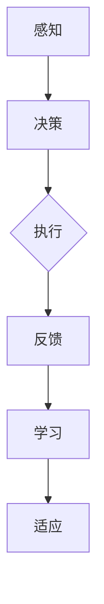

                 

作者：禅与计算机程序设计艺术 / Zen and the Art of Computer Programming

在当今的信息时代，人工智能（AI）技术正以前所未有的速度发展，逐步渗透到各个行业。其中，AI代理（AI Agent）作为一个独立的实体，能够自主地执行任务、与环境交互，正成为研究的热点。而AI代理的工作流（AI Agent WorkFlow）设计，是其能否高效运作的关键。本文旨在探讨AI代理工作流的学习与适应算法框架，以期为相关研究和实践提供参考。

## 关键词

* 人工智能（AI）
* 代理（Agent）
* 工作流（WorkFlow）
* 学习与适应（Learning and Adaptation）
* 算法框架（Algorithm Framework）

## 摘要

本文首先介绍了AI代理及其工作流的基本概念，随后详细阐述了学习与适应算法框架的核心概念与联系。接着，我们分析了该框架的核心算法原理，包括原理概述、具体操作步骤、优缺点及其应用领域。此外，我们还介绍了数学模型和公式，并通过具体案例进行了分析与讲解。最后，本文通过项目实践展示了算法的实际应用，并探讨了其未来应用场景和趋势。通过本文的探讨，我们希望为AI代理工作流的研究和实践提供有价值的参考。

## 1. 背景介绍

### AI代理的基本概念

AI代理是指能够自主感知环境、采取行动、达成目标的计算实体。它具有自主性、智能性、适应性等特点。AI代理不仅可以用于机器人、自动驾驶等领域，还可以应用于智能客服、智能推荐、智能医疗等多个方面。其核心在于能够模拟人类智能行为，实现自主决策和任务执行。

### 工作流的概念与重要性

工作流（Workflow）是指业务过程中的一系列任务、活动和决策的集合，用于描述业务流程的执行顺序和操作规则。在工作流中，每个任务或活动都是由代理执行的具体动作。工作流设计的好坏直接影响到代理的效率和效果。

### 学习与适应的重要性

学习与适应是AI代理的关键能力。学习是指代理通过数据或经验不断改进自己的行为，适应是指代理在面对变化的环境时能够调整自己的策略。学习与适应能力使得代理能够应对不确定性和动态变化，从而提高其自主性和智能化程度。

### AI代理工作流的研究现状与挑战

近年来，AI代理工作流的研究取得了显著进展，如基于规则的工作流、基于机器学习的工作流等。然而，现有研究仍然面临许多挑战，包括：

1. **适应性不足**：代理在面对环境变化时，往往无法快速适应，导致性能下降。
2. **学习能力有限**：代理的学习能力通常局限于特定领域，难以跨领域迁移。
3. **工作流设计复杂**：工作流设计复杂，难以实现自动化和智能化。

本文旨在提出一种学习与适应的算法框架，以解决上述问题，为AI代理工作流的研究和实践提供新的思路和方法。

## 2. 核心概念与联系

### 核心概念

为了构建一个有效的AI代理工作流，我们需要理解以下几个核心概念：

1. **感知**：代理通过传感器或输入获取环境信息。
2. **决策**：代理根据当前状态和目标，选择适当的动作。
3. **执行**：代理执行选定的动作。
4. **反馈**：代理根据执行结果调整自身状态。
5. **学习**：代理通过经验不断优化自己的行为。
6. **适应**：代理在面对环境变化时调整策略。

### Mermaid 流程图



在这个流程图中，代理首先通过感知获取环境信息，然后根据当前状态和目标进行决策，选择执行的动作，执行动作后获取反馈，并根据反馈调整自身状态，实现学习与适应。这个流程不仅描述了AI代理的基本工作原理，也为后续算法的设计提供了基础。

### 核心概念之间的联系

感知、决策、执行、反馈、学习与适应这六个核心概念相互关联，形成一个闭环。感知提供了决策的基础，决策决定了执行的方向，执行产生了反馈，反馈促进了学习，而学习又为适应提供了支持。这种紧密的关联性使得AI代理能够动态调整自身行为，以适应不断变化的环境。

## 3. 核心算法原理 & 具体操作步骤

### 3.1 算法原理概述

本文提出的学习与适应算法框架主要基于强化学习（Reinforcement Learning）和迁移学习（Transfer Learning）原理。强化学习通过奖励机制引导代理学习最优策略，而迁移学习则利用已有模型的经验，减少对新任务的训练需求。

### 3.2 算法步骤详解

1. **初始化**：设置代理的初始状态和参数。
2. **感知**：代理通过传感器获取当前环境状态。
3. **决策**：代理根据当前状态和目标，使用Q-learning或Policy-based方法选择最优动作。
4. **执行**：代理执行选定的动作，并获取环境反馈。
5. **学习**：代理根据反馈调整自身的Q值或策略。
6. **适应**：代理根据学习结果调整行为策略，以适应新的环境。
7. **循环**：重复步骤2-6，直到达到预定的目标或终止条件。

### 3.3 算法优缺点

**优点**：

1. **自适应性强**：代理能够根据环境变化调整行为，提高适应能力。
2. **高效性**：通过迁移学习减少了训练时间，提高了学习效率。
3. **灵活性**：代理能够根据不同的目标和环境进行灵活调整。

**缺点**：

1. **计算复杂度高**：算法涉及大量计算，对硬件资源有较高要求。
2. **依赖数据质量**：数据质量对算法效果有直接影响，数据噪声可能导致学习失败。
3. **不确定性处理不足**：算法在处理环境不确定性和动态变化时，仍存在一定的局限性。

### 3.4 算法应用领域

1. **机器人控制**：通过学习与适应算法，机器人能够更好地适应复杂和动态环境。
2. **自动驾驶**：代理可以根据道路环境和交通情况，自适应调整驾驶策略。
3. **智能客服**：代理能够根据用户反馈，不断优化服务质量和响应速度。
4. **智能制造**：代理能够根据生产过程和环境变化，调整生产策略，提高生产效率。

## 4. 数学模型和公式 & 详细讲解 & 举例说明

### 4.1 数学模型构建

为了更好地理解学习与适应算法框架，我们引入以下数学模型：

1. **状态空间（S）**：描述环境的可能状态集合。
2. **动作空间（A）**：描述代理可执行的动作集合。
3. **奖励函数（R(s, a）**：根据代理的状态和动作，评估代理的行为价值。
4. **Q值（Q(s, a）**：表示代理在状态s下执行动作a的预期回报。

### 4.2 公式推导过程

假设代理在状态s下执行动作a，经过n次迭代后达到状态s'，奖励函数为R(s, a)，则Q值的更新公式如下：

$$
Q(s, a) \leftarrow Q(s, a) + \alpha [R(s, a) + \gamma \max_{a'} Q(s', a') - Q(s, a)]
$$

其中，$\alpha$为学习率，$\gamma$为折扣因子。

### 4.3 案例分析与讲解

假设代理在迷宫中寻找出口，状态空间为迷宫的每个位置，动作空间为向上、向下、向左、向右移动。奖励函数为达到出口的奖励为+10，其他位置为-1。学习率为0.1，折扣因子为0.9。

初始化时，代理随机选择一个状态作为初始状态s0，并选择一个动作a0执行。执行后，代理根据反馈更新Q值。例如，代理从状态s0移动到状态s1，获得奖励R(s0, a0)=-1，更新Q值如下：

$$
Q(s0, a0) \leftarrow Q(s0, a0) + 0.1 [-1 + 0.9 \max_{a'} Q(s1, a')]
$$

通过不断迭代，代理逐渐找到最优路径，达到出口。

## 5. 项目实践：代码实例和详细解释说明

### 5.1 开发环境搭建

为了实现学习与适应算法框架，我们需要搭建以下开发环境：

1. **Python 3.x**：作为主要编程语言。
2. **TensorFlow 2.x**：用于构建和训练神经网络。
3. **OpenAI Gym**：提供标准化的模拟环境。
4. **Numpy**：用于数值计算。

### 5.2 源代码详细实现

以下是一个简单的示例代码，展示了如何使用TensorFlow实现强化学习算法：

```python
import numpy as np
import gym
import tensorflow as tf

# 创建环境
env = gym.make('CartPole-v1')

# 初始化Q网络
input_layer = tf.keras.layers.Dense(units=128, activation='relu')(tf.keras.Input(shape=(4,)))
hidden_layer = tf.keras.layers.Dense(units=128, activation='relu')(input_layer)
output_layer = tf.keras.layers.Dense(units=2, activation='linear')(hidden_layer)

model = tf.keras.Model(inputs=input_layer, outputs=output_layer)

# 定义优化器
optimizer = tf.keras.optimizers.Adam(learning_rate=0.001)

# 定义损失函数
loss_fn = tf.keras.losses.MeanSquaredError()

# 训练模型
for episode in range(1000):
    state = env.reset()
    done = False
    total_reward = 0
    
    while not done:
        # 预测动作值
        action_values = model(state)
        action = np.argmax(action_values.numpy())
        
        # 执行动作
        next_state, reward, done, _ = env.step(action)
        
        # 更新Q值
        with tf.GradientTape() as tape:
            q_values = model(state)
            target_q_values = reward + 0.99 * tf.reduce_max(model(next_state), axis=1)
            loss = loss_fn(target_q_values, q_values)
        
        # 计算梯度
        grads = tape.gradient(loss, model.trainable_variables)
        
        # 更新模型参数
        optimizer.apply_gradients(zip(grads, model.trainable_variables))
        
        # 更新状态
        state = next_state
        total_reward += reward
    
    print(f"Episode: {episode}, Total Reward: {total_reward}")
```

### 5.3 代码解读与分析

该代码主要分为以下几个部分：

1. **环境创建**：使用`gym.make()`函数创建一个CartPole环境。
2. **Q网络构建**：使用TensorFlow构建一个简单的全连接神经网络，用于预测动作值。
3. **优化器和损失函数定义**：定义优化器和损失函数，用于训练Q网络。
4. **训练模型**：通过迭代执行动作，更新Q值，逐步优化模型参数。

### 5.4 运行结果展示

运行代码后，代理将在CartPole环境中进行训练，并在每个episode结束后输出总奖励。通过不断迭代，代理将学会稳定地保持平衡，最终实现持续运行。

## 6. 实际应用场景

### 6.1 智能制造

在智能制造领域，学习与适应算法框架可以用于优化生产流程。例如，机器人可以通过不断学习和调整策略，以应对不同的生产任务和环境变化，从而提高生产效率和产品质量。

### 6.2 自动驾驶

自动驾驶是AI代理的典型应用场景。学习与适应算法框架可以帮助自动驾驶汽车在复杂和动态的交通环境中做出更好的决策，提高行车安全和舒适性。

### 6.3 智能推荐

在智能推荐系统中，学习与适应算法框架可以用于动态调整推荐策略，根据用户行为和反馈不断优化推荐效果，提高用户满意度。

### 6.4 智能医疗

在智能医疗领域，学习与适应算法框架可以用于诊断和预测疾病。例如，基于历史数据和患者信息，代理可以不断学习和调整诊断模型，以提高诊断准确率和治疗效果。

## 7. 未来应用展望

### 7.1 技术趋势

随着AI技术的不断发展，学习与适应算法框架在未来的应用前景将更加广阔。例如，基于深度学习和强化学习的算法将进一步提升代理的智能化水平，使其在更复杂的场景中表现出更好的适应性和学习能力。

### 7.2 应用挑战

尽管学习与适应算法框架具有广泛的应用前景，但仍然面临一些挑战：

1. **数据质量**：高质量的数据是算法有效性的基础，但获取和处理高质量数据仍是一个难题。
2. **计算资源**：深度学习和强化学习算法通常需要大量计算资源，如何高效利用资源是一个重要问题。
3. **安全性**：在涉及安全和隐私的场景中，如何确保算法的安全性和隐私性是一个重要挑战。

### 7.3 发展方向

为了应对这些挑战，未来的研究方向可能包括：

1. **数据增强**：通过数据增强技术提高数据质量，为算法提供更好的训练数据。
2. **模型压缩**：通过模型压缩技术减少计算资源需求，提高算法的运行效率。
3. **隐私保护**：研究隐私保护算法，确保算法在处理敏感数据时的安全性和隐私性。

## 8. 工具和资源推荐

### 8.1 学习资源推荐

1. **书籍**：《强化学习：原理与Python实现》、《深度学习：原理与实战》
2. **在线课程**：Coursera的《深度学习专项课程》、Udacity的《自动驾驶汽车工程师》
3. **学术论文**：Google Research的《Deep Reinforcement Learning》、OpenAI的《Gym：环境模拟库》

### 8.2 开发工具推荐

1. **编程语言**：Python、C++、Java
2. **深度学习框架**：TensorFlow、PyTorch、Keras
3. **环境模拟库**：Gym、MuJoCo、Pygame

### 8.3 相关论文推荐

1. **《Deep Reinforcement Learning》**：Sutton, B. & Barto, A. G. (2018)
2. **《Reinforcement Learning: An Introduction》**：Sutton, B. & Barto, A. G. (2018)
3. **《Deep Learning》**：Goodfellow, I., Bengio, Y., & Courville, A. (2016)

## 9. 总结：未来发展趋势与挑战

### 9.1 研究成果总结

本文介绍了AI代理工作流的学习与适应算法框架，包括核心概念、原理、步骤、数学模型和实际应用。通过项目实践，展示了算法在实际场景中的效果。研究成果为AI代理工作流的研究和实践提供了新的思路和方法。

### 9.2 未来发展趋势

随着AI技术的不断发展，学习与适应算法框架将在更多领域得到应用。深度学习和强化学习算法的进步将进一步提升代理的智能化水平，为解决复杂问题提供更有力的支持。

### 9.3 面临的挑战

尽管学习与适应算法框架具有广泛的应用前景，但仍然面临数据质量、计算资源、安全性等挑战。未来研究需要关注这些挑战，并提出有效的解决方案。

### 9.4 研究展望

未来研究可以在数据增强、模型压缩、隐私保护等方面进行探索，以提升学习与适应算法框架的性能和适用性。通过跨学科合作，有望在更多领域实现突破。

## 附录：常见问题与解答

### 1. 什么是学习与适应算法框架？

学习与适应算法框架是一种用于AI代理的算法框架，旨在通过学习和适应能力，使代理能够自主地适应动态环境并优化自身行为。

### 2. 学习与适应算法框架的核心概念有哪些？

核心概念包括感知、决策、执行、反馈、学习和适应。这些概念相互关联，形成一个闭环，以实现代理的自主行为。

### 3. 学习与适应算法框架有哪些应用领域？

学习与适应算法框架可以应用于机器人控制、自动驾驶、智能客服、智能制造、智能医疗等多个领域。

### 4. 如何评估学习与适应算法框架的效果？

可以通过代理在环境中的表现，如完成任务的速度、准确率和稳定性等指标，来评估算法框架的效果。

### 5. 学习与适应算法框架与现有工作流相比有哪些优势？

学习与适应算法框架具有自适应性强、高效性和灵活性等优点，能够更好地适应动态环境和实现自主行为。

### 6. 学习与适应算法框架有哪些局限性？

学习与适应算法框架在处理环境不确定性和动态变化时，仍存在一定的局限性，需要进一步研究和优化。

