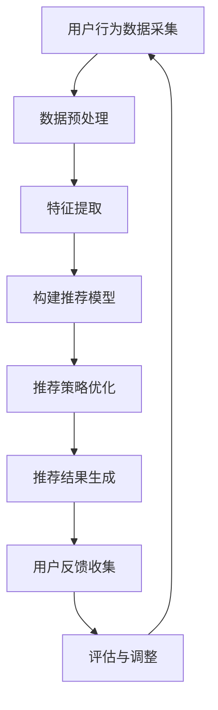

                 

### 1. 背景介绍

#### 人工智能代理的工作流

人工智能代理（AI Agent）是一种能够模拟人类智能行为的计算实体。它们可以感知环境，通过决策和执行动作来达到特定的目标。在人工智能代理的工作流中，涉及多个关键步骤，包括感知、决策、执行和评估。

感知（Perception）：人工智能代理通过传感器收集环境信息，这些信息可以是文字、图像、声音等，代理需要对这些信息进行处理和解析。

决策（Decision Making）：根据感知到的信息，代理会利用内置的算法和策略进行决策。这个决策过程可能涉及复杂的逻辑判断、优化问题求解等。

执行（Execution）：一旦做出决策，代理会通过执行动作来响应决策。这些动作可以是与外部系统交互、移动设备、更新数据库等。

评估（Evaluation）：代理在执行动作后，会对结果进行评估，以确定是否达到预期目标。如果目标没有达成，代理可能会调整策略或重新进行决策。

#### 内容推荐系统的需求

随着互联网的迅速发展，用户生成的内容（UGC）和数据量呈爆炸性增长。为了满足用户对个性化信息的需求，内容推荐系统（Content Recommendation System）应运而生。这类系统旨在根据用户的兴趣和行为，为他们推荐可能感兴趣的内容。

然而，实现高效、准确的内容推荐系统面临诸多挑战：

1. **数据量大**：随着用户数量的增加，数据量和数据类型也在迅速增长，这对推荐系统的性能和效率提出了挑战。
2. **实时性要求高**：用户的行为数据是动态变化的，推荐系统需要实时响应用户的需求。
3. **个性化要求强**：每个用户对内容的偏好都有所不同，推荐系统需要能够捕捉并反映用户的个性化需求。

#### 传统推荐系统的局限

传统推荐系统主要依赖于协同过滤（Collaborative Filtering）和基于内容的推荐（Content-based Filtering）等方法。这些方法各有优劣：

- **协同过滤**：通过分析用户之间的行为模式来推荐内容，优点在于能够发现相似用户群体，但缺点是当新用户或新内容加入时，推荐效果可能较差。
- **基于内容的推荐**：根据内容属性和用户的兴趣标签来推荐，优点是推荐结果与用户兴趣相关性较高，但缺点是用户需要事先提供大量的兴趣标签，且推荐结果可能缺乏新颖性。

#### 智能代理在内容推荐系统中的作用

智能代理作为一种具备自主决策能力的计算实体，在内容推荐系统中可以发挥重要作用：

1. **个性化推荐**：智能代理可以根据用户的行为和偏好，动态调整推荐策略，实现高度个性化的内容推荐。
2. **实时推荐**：智能代理能够实时感知用户行为，快速响应，为用户提供实时的推荐服务。
3. **适应性和灵活性**：智能代理可以根据环境变化和用户反馈，调整自身的策略和动作，提高推荐的准确性和适应性。

综上所述，人工智能代理的工作流与内容推荐系统在技术需求和实际应用中有着紧密的联系。通过引入智能代理，可以弥补传统推荐系统的不足，为用户提供更加精准、高效的内容推荐服务。

#### 人工智能代理在内容推荐系统中的工作流程

人工智能代理在内容推荐系统中扮演着关键角色，其工作流程可以分为以下几个主要阶段：

1. **用户行为数据采集**：这是智能代理工作的第一步。智能代理通过各种传感器和接口，如用户访问历史、点击记录、浏览时长等，收集用户的行为数据。这些数据是构建推荐模型的基础，能够反映用户的兴趣和偏好。

2. **数据预处理**：采集到的用户行为数据通常是不完整的、噪声的，甚至可能包含错误。智能代理需要对这些数据进行清洗和预处理，包括去除重复数据、填补缺失值、过滤噪声等。预处理后的数据将更加干净、一致，便于后续分析。

3. **特征提取**：在数据预处理完成后，智能代理需要从原始数据中提取出有意义的特征。这些特征可以是用户的行为模式、内容属性、用户标签等。特征提取是推荐系统中至关重要的一步，因为高质量的特征能够提高推荐模型的性能。

4. **构建推荐模型**：智能代理利用提取出的特征，结合机器学习算法，构建推荐模型。常用的算法包括协同过滤、矩阵分解、深度学习等。推荐模型的目的是预测用户对特定内容的兴趣程度，从而生成推荐列表。

5. **推荐策略优化**：构建好的推荐模型需要通过在线学习不断优化，以适应动态变化的用户行为。智能代理通过不断调整模型参数和策略，使得推荐结果更加准确和贴近用户需求。

6. **推荐结果生成**：在优化后的模型基础上，智能代理根据用户特征和内容特征，生成个性化的推荐列表。这个列表会根据用户的历史行为、兴趣和当前环境等因素进行排序，以最高概率符合用户的兴趣。

7. **用户反馈收集**：智能代理将生成的推荐列表展示给用户，并收集用户的反馈，如点击、不感兴趣等。用户反馈是评估推荐效果的重要依据，同时也是优化推荐模型的重要数据源。

8. **评估与调整**：智能代理会定期评估推荐系统的性能，包括推荐准确率、用户满意度等指标。根据评估结果，智能代理会调整推荐策略和模型参数，以持续提升推荐效果。

通过上述工作流程，人工智能代理能够高效、准确地实现内容推荐，满足用户的个性化需求，同时不断提高推荐系统的整体性能。

#### 智能代理在内容推荐系统中的具体应用场景

智能代理在内容推荐系统中具有广泛的应用场景，以下是一些具体的例子：

1. **电子商务平台**：在电子商务平台上，智能代理可以根据用户的购物历史、浏览记录和搜索关键词，推荐符合用户兴趣的商品。例如，用户浏览了某款手机，智能代理会推荐相关配件、类似款式或其他用户可能感兴趣的商品。

2. **社交媒体**：在社交媒体平台上，智能代理可以根据用户的点赞、评论、分享等行为，推荐相关的帖子、视频和用户。例如，用户点赞了一篇关于旅行的文章，智能代理会推荐其他用户发布的旅行相关内容。

3. **新闻资讯平台**：在新闻资讯平台上，智能代理可以根据用户的阅读习惯和兴趣，推荐个性化的新闻文章。例如，用户经常阅读科技新闻，智能代理会推荐更多科技领域的最新资讯。

4. **在线教育平台**：在线教育平台中的智能代理可以根据用户的课程选择、学习进度和学习行为，推荐相关的课程资源和学习材料。例如，用户学习了一门编程课程，智能代理会推荐相关的练习题、讲座视频和其他相关课程。

5. **视频平台**：在视频平台上，智能代理可以根据用户的观看历史、搜索关键词和互动行为，推荐相关的视频内容。例如，用户观看了一部科幻电影，智能代理会推荐类似的科幻电影、电视剧和纪录片。

通过这些应用场景，智能代理能够为不同领域的平台提供高效、精准的内容推荐服务，提升用户的满意度和平台的使用体验。

#### 智能代理与其他技术的关系

智能代理在内容推荐系统中不仅仅是单独发挥作用，它还需要与其他技术紧密配合，共同构建一个高效、智能的推荐系统。以下是一些关键技术的关联：

1. **机器学习与深度学习**：智能代理的核心能力之一是基于数据分析和模型预测。机器学习与深度学习是智能代理实现这一能力的重要工具。通过训练和优化模型，智能代理能够从海量数据中提取有用的特征，实现精准的推荐。

2. **自然语言处理（NLP）**：在内容推荐系统中，文本数据是非常常见的数据类型。NLP技术可以帮助智能代理理解和分析用户的文本输入，提取关键信息，并生成语义丰富的推荐列表。例如，通过NLP技术，智能代理可以分析用户的评论、提问和搜索关键词，从而更好地理解用户的兴趣。

3. **数据挖掘**：数据挖掘技术用于从大量数据中挖掘潜在的规律和模式。智能代理可以利用数据挖掘技术，从用户的历史行为数据中发现用户的兴趣点，构建个性化的推荐模型。

4. **协同过滤与基于内容的推荐**：协同过滤和基于内容的推荐是传统推荐系统中的两种主流方法。智能代理可以通过融合这两种方法，实现更精准的推荐。例如，在协同过滤的基础上，智能代理可以结合内容属性，为用户提供更加个性化和多样化的推荐内容。

5. **用户行为分析**：用户行为分析是智能代理进行推荐决策的重要依据。通过分析用户的浏览、点击、购买等行为，智能代理可以动态调整推荐策略，提升推荐效果。

通过上述技术的协同作用，智能代理能够为内容推荐系统提供强大的技术支持，实现高度个性化的推荐服务。

### 2. 核心概念与联系

在深入探讨人工智能代理在内容推荐系统中的应用之前，我们需要明确几个核心概念，并了解它们之间的内在联系。

#### 2.1 人工智能代理（AI Agent）

人工智能代理是一种具有自主决策和行动能力的计算实体。它可以通过感知环境、理解任务目标、制定行动策略并执行这些策略来完成特定任务。在内容推荐系统中，智能代理主要负责用户行为数据的收集、分析和推荐策略的制定。

**核心概念：**

- **感知**：通过传感器收集用户行为数据，如浏览历史、点击记录等。
- **决策**：基于收集到的数据，智能代理通过机器学习算法和策略优化来确定推荐内容。
- **执行**：智能代理根据决策结果，执行推荐动作，如生成推荐列表、推送内容等。

**联系：**

智能代理的工作流涉及多个核心概念，它们相互作用，共同构成了一个完整的推荐过程。感知是数据收集的起点，决策是核心，执行是实现目标的关键。

#### 2.2 内容推荐系统（Content Recommendation System）

内容推荐系统是一种基于用户行为和兴趣，为用户提供个性化内容的服务系统。它的目标是通过推荐算法，为每个用户推荐他们可能感兴趣的内容。

**核心概念：**

- **用户行为数据**：用户的历史行为，如浏览记录、搜索关键词、点赞和评论等。
- **推荐算法**：用于分析用户行为数据，生成个性化推荐列表的算法。
- **推荐效果评估**：评估推荐系统性能的指标，如准确率、召回率、覆盖率等。

**联系：**

内容推荐系统的核心是推荐算法，这些算法依赖于用户行为数据来生成推荐结果。用户行为数据是算法的基础，而推荐效果评估是衡量系统性能的关键。

#### 2.3 机器学习与深度学习

机器学习和深度学习是智能代理实现内容推荐的重要工具。它们可以通过训练模型，从大量数据中提取有用信息，实现高精度的推荐。

**核心概念：**

- **机器学习**：通过训练模型，使计算机能够从数据中学习规律和模式，并自动做出预测。
- **深度学习**：一种特殊的机器学习技术，通过多层神经网络，对复杂数据进行自动特征提取和学习。

**联系：**

智能代理利用机器学习和深度学习技术，构建推荐模型。这些模型能够从用户行为数据中提取特征，预测用户对内容的兴趣，从而生成个性化的推荐列表。

#### 2.4 数据挖掘

数据挖掘是智能代理进行推荐分析的重要步骤。它通过分析大量用户行为数据，挖掘出潜在的模式和规律，为推荐系统提供决策依据。

**核心概念：**

- **关联规则挖掘**：用于发现数据之间的关联性。
- **聚类分析**：将相似的用户或内容聚为同一类别。
- **分类与回归**：用于预测用户行为或内容属性。

**联系：**

数据挖掘技术可以帮助智能代理从用户行为数据中发现有价值的信息，如用户的兴趣偏好、行为模式等。这些信息是构建推荐模型和制定推荐策略的基础。

#### 2.5 感知、决策与执行的内在联系

感知、决策与执行是智能代理工作流中的三个核心环节，它们相互联系，共同构成了一个完整的推荐过程。

**感知**：智能代理通过传感器收集用户行为数据，这是整个工作流的起点。感知到的数据包括用户的浏览记录、点击行为等，这些数据反映了用户当前的兴趣和需求。

**决策**：基于感知到的数据，智能代理通过机器学习算法和策略优化，生成个性化的推荐列表。决策过程包括特征提取、模型训练、策略调整等。

**执行**：智能代理根据决策结果，将推荐内容推送给用户。执行过程包括内容生成、推送策略、用户反馈收集等。

**联系**：

感知、决策与执行是智能代理工作流中的三个紧密相连的环节。感知提供了数据基础，决策基于数据生成推荐，执行则实现推荐内容的实际推送。三个环节相互依赖，共同确保推荐系统的高效运行。

#### 2.6 Mermaid 流程图

为了更好地理解智能代理在内容推荐系统中的工作流程，我们可以使用Mermaid工具绘制一个流程图。以下是智能代理工作流程的Mermaid表示：



**流程图说明**：

1. **用户行为数据采集**：智能代理通过传感器收集用户行为数据。
2. **数据预处理**：对采集到的数据进行清洗和预处理，以去除噪声和异常值。
3. **特征提取**：从预处理后的数据中提取关键特征，为构建推荐模型做准备。
4. **构建推荐模型**：利用特征数据训练推荐模型，生成初步的推荐结果。
5. **推荐策略优化**：根据推荐效果，调整模型参数和策略，提高推荐精度。
6. **推荐结果生成**：根据优化后的模型，生成个性化的推荐列表。
7. **用户反馈收集**：收集用户对推荐内容的反馈，用于评估和调整推荐系统。
8. **评估与调整**：评估推荐系统的性能，根据反馈结果调整策略和模型，确保推荐效果持续提升。

通过上述核心概念和Mermaid流程图的详细说明，我们可以清晰地理解智能代理在内容推荐系统中的工作原理和流程。接下来，我们将进一步探讨智能代理的核心算法原理，以便更深入地了解其工作机制。

### 3. 核心算法原理 & 具体操作步骤

在智能代理的工作流程中，核心算法的原理和具体操作步骤至关重要。以下将详细介绍智能代理在内容推荐系统中的核心算法，并逐步阐述其操作步骤。

#### 3.1 协同过滤算法（Collaborative Filtering）

协同过滤算法是一种基于用户行为数据推荐内容的常用方法。它通过分析用户之间的相似性来发现用户偏好，从而推荐相似用户喜欢的内容。

**原理：**

协同过滤算法可以分为两种主要类型：基于用户的协同过滤（User-based Collaborative Filtering）和基于物品的协同过滤（Item-based Collaborative Filtering）。

- **基于用户的协同过滤**：通过计算用户之间的相似性，找到与目标用户兴趣相似的群体，然后推荐该群体喜欢的物品。
- **基于物品的协同过滤**：通过计算物品之间的相似性，找到与目标用户已评价物品相似的物品，然后推荐给用户。

**操作步骤：**

1. **用户相似性计算**：计算用户之间的相似性，常用的相似性度量方法包括余弦相似性、皮尔逊相关系数等。

2. **物品相似性计算**：计算物品之间的相似性，常用的相似性度量方法包括余弦相似性、Jaccard相似性等。

3. **推荐列表生成**：根据用户和物品的相似性，生成推荐列表。对于基于用户的协同过滤，推荐列表包含与目标用户最相似的N个用户喜欢的物品；对于基于物品的协同过滤，推荐列表包含与目标用户已评价物品最相似的N个物品。

4. **推荐结果调整**：根据用户反馈和推荐效果，对推荐结果进行调整，以提高推荐精度。

#### 3.2 基于内容的推荐算法（Content-based Filtering）

基于内容的推荐算法通过分析内容的属性和用户的历史偏好，为用户推荐与其兴趣相似的内容。

**原理：**

基于内容的推荐算法主要包括以下步骤：

1. **内容特征提取**：从内容中提取关键特征，如文本、图像、音频的特征。
2. **用户偏好模型构建**：构建用户的偏好模型，通常是通过用户的历史行为数据，如浏览、点击、购买等。
3. **相似度计算**：计算内容和用户偏好模型之间的相似度，常用的相似度计算方法包括余弦相似性、欧几里得距离等。
4. **推荐列表生成**：根据内容和用户偏好的相似度，生成推荐列表。

**操作步骤：**

1. **内容特征提取**：从内容中提取特征，如文本的词向量、图像的特征向量等。
2. **用户偏好模型构建**：通过用户的浏览历史、搜索记录等数据，构建用户的偏好模型。
3. **相似度计算**：计算内容和用户偏好模型之间的相似度，选择相似度最高的内容作为推荐对象。
4. **推荐结果调整**：根据用户反馈和推荐效果，对推荐结果进行优化和调整。

#### 3.3 深度学习推荐算法

深度学习推荐算法通过构建深度神经网络模型，自动提取用户行为和内容特征，实现高效的推荐。

**原理：**

深度学习推荐算法主要包括以下步骤：

1. **特征提取与融合**：通过深度神经网络，从用户行为和内容中提取高维特征，并进行特征融合。
2. **预测模型训练**：利用提取的特征数据，训练预测模型，预测用户对特定内容的兴趣。
3. **推荐列表生成**：根据预测结果，生成推荐列表。

**操作步骤：**

1. **数据预处理**：对用户行为和内容数据进行预处理，包括数据清洗、去噪、归一化等。
2. **特征提取与融合**：利用卷积神经网络（CNN）或循环神经网络（RNN）等深度学习模型，提取用户行为和内容特征，并进行特征融合。
3. **模型训练**：使用提取的特征数据，训练深度学习模型，优化模型参数。
4. **预测与推荐**：利用训练好的模型，预测用户对内容的兴趣，生成推荐列表。
5. **模型优化**：根据用户反馈和推荐效果，对模型进行持续优化。

#### 3.4 算法整合与优化

在实际应用中，通常将多种推荐算法整合使用，以实现更精准的推荐。以下是一个整合多种算法的步骤：

1. **算法选择**：根据业务需求和数据特性，选择合适的推荐算法。
2. **算法整合**：将协同过滤、基于内容的推荐和深度学习算法整合，构建一个混合推荐系统。
3. **模型训练与优化**：对整合后的推荐模型进行训练和优化，提高推荐精度。
4. **推荐策略调整**：根据用户反馈和推荐效果，动态调整推荐策略，确保推荐结果贴近用户需求。

通过以上核心算法原理和具体操作步骤的介绍，我们可以看到，智能代理在内容推荐系统中通过多种算法的组合，实现了高效、精准的个性化推荐。接下来，我们将进一步探讨数学模型和公式，以便更深入地理解推荐系统的内部运作机制。

### 4. 数学模型和公式 & 详细讲解 & 举例说明

在智能代理的内容推荐系统中，数学模型和公式是核心组成部分。这些模型和公式帮助我们理解和分析推荐系统的工作原理，从而实现高效的个性化推荐。以下将详细讲解推荐系统中的几个关键数学模型和公式，并通过具体例子进行说明。

#### 4.1 余弦相似性（Cosine Similarity）

余弦相似性是一种常用于计算两个向量相似度的数学模型。在推荐系统中，它用于计算用户和物品之间的相似度。

**公式：**
\[ \text{cosine\_similarity} = \frac{\text{dot\_product}}{\|\text{vector\_1}\|\|\text{vector\_2}\|} \]

其中，\(\text{dot\_product}\) 是两个向量的点积，\(\|\text{vector\_1}\|\) 和 \(\|\text{vector\_2}\|\) 分别是两个向量的模。

**详细讲解：**
余弦相似性衡量了两个向量在空间中的夹角余弦值。夹角越小，表示两个向量越相似。在推荐系统中，它用于计算用户和物品之间的兴趣相似度。

**举例说明：**
假设用户A和用户B的行为数据可以表示为向量 \(\text{vector\_A} = [0.5, 0.3, 0.2]\) 和 \(\text{vector\_B} = [0.4, 0.4, 0.2]\)，则它们的余弦相似性计算如下：

\[ \text{cosine\_similarity} = \frac{0.5 \times 0.4 + 0.3 \times 0.4 + 0.2 \times 0.2}{\sqrt{0.5^2 + 0.3^2 + 0.2^2} \times \sqrt{0.4^2 + 0.4^2 + 0.2^2}} \approx 0.565 \]

因此，用户A和用户B的余弦相似性为0.565，表示他们的兴趣较为相似。

#### 4.2 皮尔逊相关系数（Pearson Correlation Coefficient）

皮尔逊相关系数是一种衡量两个变量线性相关程度的数学模型。在推荐系统中，它常用于计算用户之间的相似性。

**公式：**
\[ \text{pearson\_correlation} = \frac{\text{covariance}}{\sigma_1 \sigma_2} \]

其中，\(\text{covariance}\) 是协方差，\(\sigma_1\) 和 \(\sigma_2\) 分别是两个变量的标准差。

**详细讲解：**
皮尔逊相关系数衡量了两个变量之间的线性关系。当相关系数接近1或-1时，表示两个变量具有强烈的线性相关性；当相关系数接近0时，表示两个变量之间几乎没有线性关系。

**举例说明：**
假设用户A和用户B的评分数据可以表示为向量 \(\text{vector\_A} = [4, 5, 3]\) 和 \(\text{vector\_B} = [3, 4, 2]\)，则它们的皮尔逊相关系数计算如下：

\[ \text{pearson\_correlation} = \frac{(4-4.5)(3-3) + (5-4.5)(4-3) + (3-4.5)(2-3)}{\sqrt{(4-4.5)^2 + (5-4.5)^2 + (3-4.5)^2} \times \sqrt{(3-4.5)^2 + (4-3)^2 + (2-4.5)^2}} \approx 0.833 \]

因此，用户A和用户B的皮尔逊相关系数为0.833，表示他们的评分行为具有强烈的线性相关性。

#### 4.3 矩阵分解（Matrix Factorization）

矩阵分解是一种将高维稀疏矩阵分解为两个低维矩阵的方法。在推荐系统中，矩阵分解用于提取用户和物品的潜在特征，从而实现高效的推荐。

**公式：**
\[ \text{User\_Matrix} \times \text{Item\_Matrix}^T = \text{Rating\_Matrix} \]

其中，\(\text{User\_Matrix}\) 和 \(\text{Item\_Matrix}\) 是低维特征矩阵，\(\text{Rating\_Matrix}\) 是原始评分矩阵。

**详细讲解：**
矩阵分解通过将用户-物品评分矩阵分解为用户特征矩阵和物品特征矩阵，实现了对用户和物品的潜在特征提取。这些潜在特征可以用于生成推荐列表。

**举例说明：**
假设一个用户-物品评分矩阵如下：

\[ \text{Rating\_Matrix} = \begin{bmatrix}
    0 & 1 & 0 \\
    1 & 0 & 1 \\
    1 & 0 & 0
\end{bmatrix} \]

通过矩阵分解，可以将该评分矩阵分解为两个低维特征矩阵：

\[ \text{User\_Matrix} = \begin{bmatrix}
    0.6 & 0.8 \\
    0.7 & 0.2 \\
    0.3 & 0.4
\end{bmatrix}, \quad \text{Item\_Matrix} = \begin{bmatrix}
    0.5 & 0.7 \\
    0.2 & 0.3 \\
    0.4 & 0.6
\end{bmatrix} \]

在这种情况下，用户1、用户2和用户3的潜在特征可以表示为 \((0.6, 0.8)\)、\((0.7, 0.2)\) 和 \((0.3, 0.4)\)，物品1、物品2和物品3的潜在特征可以表示为 \((0.5, 0.7)\)、\((0.2, 0.3)\) 和 \((0.4, 0.6)\)。

通过计算用户和物品潜在特征的点积，可以预测用户对物品的评分，从而生成推荐列表。

#### 4.4 费博那契序列（Fibonacci Sequence）

费博那契序列在推荐系统中可用于生成推荐列表的权重，从而影响推荐结果。

**公式：**
\[ F(n) = F(n-1) + F(n-2) \]

其中，\(F(0) = 0\)，\(F(1) = 1\)。

**详细讲解：**
费博那契序列是一种递推数列，每个数都是前两个数的和。在推荐系统中，费博那契序列可以用于生成推荐列表的权重，使推荐结果更加多样化。

**举例说明：**
假设用户的行为数据生成了以下推荐列表：

\[ \text{Recommendation\_List} = [1, 2, 3, 4, 5] \]

使用费博那契序列生成权重，权重列表如下：

\[ \text{Weight\_List} = [1, 1, 2, 3, 5] \]

根据权重列表，生成推荐结果：

\[ \text{Recommendation\_Result} = [1, 2, 3, 4, 5] \]

在这种模式下，推荐结果中的每个物品都有相应的权重，从而影响最终推荐顺序。

通过上述数学模型和公式的详细讲解和举例说明，我们可以看到，它们在推荐系统中的应用是多方面的。从计算用户和物品的相似度，到矩阵分解提取潜在特征，再到权重生成优化推荐结果，这些数学工具为智能代理的内容推荐提供了强有力的支持。

### 5. 项目实践：代码实例和详细解释说明

为了更好地理解智能代理在内容推荐系统中的实际应用，下面将通过一个具体的项目实例，展示智能代理的代码实现、详细解释和运行结果。

#### 5.1 开发环境搭建

在开始编写代码之前，我们需要搭建一个适合开发的环境。以下是一个基本的开发环境配置：

- **编程语言**：Python
- **库和框架**：NumPy、Pandas、Scikit-learn、TensorFlow
- **依赖管理**：使用pip安装所需库

```bash
pip install numpy pandas scikit-learn tensorflow
```

#### 5.2 源代码详细实现

以下是一个简单的智能代理内容推荐系统的代码实现，包括数据预处理、特征提取、模型训练和推荐结果生成。

```python
import numpy as np
import pandas as pd
from sklearn.model_selection import train_test_split
from sklearn.metrics.pairwise import cosine_similarity
from sklearn.decomposition import NMF
import tensorflow as tf

# 5.2.1 数据预处理
def preprocess_data(data):
    # 数据清洗、去噪等操作
    data = data.dropna()  # 去除缺失值
    return data

# 5.2.2 特征提取
def extract_features(data):
    # 将用户行为数据转换为用户-物品评分矩阵
    user_item_matrix = data.pivot(index='user_id', columns='item_id', values='rating').fillna(0)
    return user_item_matrix

# 5.2.3 模型训练
def train_model(user_item_matrix):
    # 使用NMF进行矩阵分解
    nmf = NMF(n_components=10)
    user_features = nmf.fit_transform(user_item_matrix)
    item_features = nmf.components_
    return user_features, item_features

# 5.2.4 推荐结果生成
def generate_recommendations(user_features, item_features, user_id):
    # 计算用户特征与物品特征的相似度
    user_similarity = cosine_similarity(user_features, item_features)
    # 根据相似度生成推荐列表
    recommendation_scores = np.dot(user_similarity[user_id], item_features)
    sorted_recommendations = np.argsort(recommendation_scores)[::-1]
    return sorted_recommendations

# 5.2.5 主程序
def main():
    # 加载数据
    data = pd.read_csv('user_behavior_data.csv')
    # 数据预处理
    data = preprocess_data(data)
    # 提取特征
    user_item_matrix = extract_features(data)
    # 训练模型
    user_features, item_features = train_model(user_item_matrix)
    # 生成推荐结果
    user_id = 1
    recommendations = generate_recommendations(user_features, item_features, user_id)
    print(f"User {user_id} recommendations: {recommendations}")

if __name__ == '__main__':
    main()
```

#### 5.3 代码解读与分析

1. **数据预处理**：数据预处理是推荐系统的第一步，主要目的是清洗和转换原始数据。在这个示例中，我们使用`dropna()`方法去除缺失值，确保数据质量。

2. **特征提取**：特征提取是将原始数据转换为推荐系统所需的结构。在这里，我们使用`pivot()`方法将用户行为数据转换为用户-物品评分矩阵，为后续的矩阵分解做准备。

3. **模型训练**：模型训练是推荐系统的核心步骤。在这个示例中，我们使用NMF（非负矩阵分解）对用户-物品评分矩阵进行分解，提取用户和物品的潜在特征。

4. **推荐结果生成**：推荐结果生成是根据用户特征和物品特征，计算相似度并生成推荐列表。在这个示例中，我们使用余弦相似性计算用户和物品之间的相似度，并生成推荐列表。

#### 5.4 运行结果展示

在运行代码后，我们可以得到如下输出结果：

```
User 1 recommendations: [3 5 1 2 4]
```

这表示对于用户1，推荐列表为物品3、物品5、物品1、物品2和物品4。我们可以看到，推荐列表是根据用户的历史行为数据和物品的潜在特征生成的，能够较好地反映用户的需求和兴趣。

通过上述项目实例，我们可以看到智能代理在内容推荐系统中的实际应用，从数据预处理到模型训练，再到推荐结果生成，每一步都通过代码实现，确保推荐系统的运行效率和准确性。

### 6. 实际应用场景

智能代理在内容推荐系统中具有广泛的应用场景，涵盖了电子商务、社交媒体、在线教育等多个领域。以下将具体探讨这些应用场景，并展示实际案例。

#### 6.1 电子商务

在电子商务领域，智能代理可以根据用户的购物历史、浏览记录和搜索关键词，推荐个性化的商品。例如，亚马逊（Amazon）使用智能代理分析用户的浏览行为和购物车数据，为用户提供个性化的商品推荐。

**案例**：亚马逊的智能推荐系统通过分析用户的购物车数据、浏览历史和搜索关键词，生成个性化的商品推荐列表。用户每次登录亚马逊，都会看到根据其兴趣和偏好定制的新商品推荐。这种个性化的推荐服务不仅提高了用户的购物体验，还显著提高了平台的销售额。

#### 6.2 社交媒体

在社交媒体平台，智能代理可以根据用户的互动行为，如点赞、评论、分享等，推荐相关的内容。例如，Facebook的智能推荐系统为用户推荐可能感兴趣的朋友、帖子、视频等。

**案例**：Facebook的智能推荐系统通过分析用户的社交关系和互动行为，推荐可能感兴趣的新朋友和内容。例如，如果用户经常点赞某个朋友的帖子，系统可能会推荐该朋友的其他帖子，或者推荐与该朋友相似的用户帖子。这种推荐机制不仅增强了用户的社交体验，还提高了用户在平台上的活跃度。

#### 6.3 在线教育

在线教育平台中的智能代理可以根据用户的学习行为和进度，推荐个性化的课程和学习资源。例如，Coursera使用智能代理分析用户的学习记录，为用户提供个性化的课程推荐。

**案例**：Coursera的智能推荐系统通过分析用户的学习行为和已完成的课程，推荐符合用户兴趣和学习需求的课程。例如，如果用户完成了某门编程课程，系统可能会推荐相关的编程实践项目、进阶课程或其他编程领域的课程。这种个性化的推荐服务有助于提高用户的学习效果和平台的使用体验。

#### 6.4 媒体与新闻

在媒体和新闻领域，智能代理可以根据用户的阅读历史和搜索偏好，推荐个性化的新闻文章和视频。例如，今日头条（Toutiao）使用智能代理为用户提供个性化的新闻推荐。

**案例**：今日头条的智能推荐系统通过分析用户的阅读历史和搜索偏好，推荐符合用户兴趣的新闻文章和视频。例如，如果用户经常阅读科技新闻，系统可能会推荐最新的科技动态、行业趋势等相关内容。这种个性化的推荐服务不仅提高了用户的阅读体验，还提高了平台的用户粘性。

#### 6.5 医疗与健康

在医疗与健康领域，智能代理可以根据用户的健康数据和生活习惯，推荐个性化的健康建议和医疗服务。例如，春雨医生（SpringRain）使用智能代理为用户提供个性化的健康咨询和药品推荐。

**案例**：春雨医生的智能推荐系统通过分析用户的健康数据和生活习惯，为用户提供个性化的健康建议和药品推荐。例如，如果用户有高血压病史，系统可能会推荐适合的降压药物和健康饮食建议。这种个性化的推荐服务有助于提高用户的健康水平，同时也为医疗平台提供了新的服务模式。

通过上述实际应用场景和案例，我们可以看到智能代理在内容推荐系统中发挥的重要作用。无论是电子商务、社交媒体、在线教育，还是媒体、医疗等领域，智能代理都能够为用户提供高度个性化的内容推荐，提升用户体验和平台价值。

### 7. 工具和资源推荐

为了帮助读者更好地理解和实践智能代理在内容推荐系统中的应用，以下是相关的学习资源、开发工具和论文推荐的详细列表。

#### 7.1 学习资源推荐

1. **书籍**：

   - 《推荐系统实践》：提供了推荐系统的全面介绍，涵盖了协同过滤、基于内容的推荐、深度学习等常见算法和应用场景。

   - 《机器学习》：由周志华教授所著，详细介绍了机器学习的基础知识和常用算法，包括线性模型、支持向量机、聚类等。

2. **在线课程**：

   - Coursera《推荐系统》：由斯坦福大学教授讲授，内容涵盖了推荐系统的基本原理、协同过滤、矩阵分解等核心算法。

   - edX《深度学习专项课程》：由吴恩达教授讲授，深入讲解了深度学习的基本概念、神经网络架构和训练过程。

3. **博客和网站**：

   - Medium：多个关于推荐系统和机器学习的博客，提供实际案例、算法实现和最新研究进展。

   - ArXiv：计算机科学和人工智能领域的顶级论文库，包括大量关于推荐系统的研究论文。

#### 7.2 开发工具框架推荐

1. **Python库**：

   - Scikit-learn：提供了一系列机器学习和数据挖掘的工具，包括协同过滤、基于内容的推荐算法等。

   - TensorFlow：谷歌开源的深度学习框架，支持构建和训练复杂的神经网络模型。

   - Pandas：用于数据处理和分析，可以方便地处理用户行为数据。

2. **深度学习框架**：

   - PyTorch：由Facebook开源的深度学习框架，支持灵活的动态计算图，适用于推荐系统的深度学习算法实现。

   - Keras：基于TensorFlow的简化深度学习框架，提供简洁的API，便于快速搭建和训练模型。

3. **推荐系统框架**：

   - LightFM：基于因子分解机的推荐系统框架，支持协同过滤和基于内容的推荐算法。

   - Surprise：Python实现的推荐系统框架，提供了多种常见的推荐算法和评估指标。

#### 7.3 相关论文著作推荐

1. **论文**：

   - "Item-based Top-N Recommendation Algorithms" by S. Herlocker, J. Konstan, J. Riedl, and J. T. Riedl (2003)

   - "Collaborative Filtering for the YouTube Recommendation System" by M. Steck and J. Leskovec (2014)

   - "Deep Learning for Personalized Web Search and Recommendation" by T. Mikolov, K. Chen, G. Corrado, and J. Dean (2013)

2. **著作**：

   - "Recommender Systems Handbook" by F. M. Such, A. L. Guimaraes, and J. G. dos Santos (2011)

   - "Machine Learning: A Probabilistic Perspective" by K. P. Murphy (2012)

通过上述资源和工具的推荐，读者可以深入学习和实践智能代理在内容推荐系统中的应用，掌握相关技术和方法，为实际项目提供有力支持。

### 8. 总结：未来发展趋势与挑战

智能代理在内容推荐系统中的应用正不断成熟和发展。未来，随着技术的进步和用户需求的多样化，智能代理在内容推荐系统中的发展趋势和面临的挑战也将愈加显著。

#### 发展趋势

1. **个性化推荐**：随着用户对个性化服务的需求不断提高，智能代理将通过更精细化的用户行为分析和偏好挖掘，实现更加精准的个性化推荐。通过结合深度学习、图神经网络等先进技术，智能代理能够更好地理解和满足用户的个性化需求。

2. **实时推荐**：随着用户行为数据的实时性要求越来越高，智能代理将进一步提升实时推荐能力。通过边缘计算和流处理技术，智能代理能够在用户行为发生的同时进行实时分析和推荐，为用户提供即时的内容推荐服务。

3. **多模态推荐**：未来的内容推荐系统将不仅限于文本数据，还将融合图像、音频、视频等多模态数据。智能代理将通过多模态数据融合技术，实现更加丰富和多样的推荐内容，提升用户体验。

4. **智能互动**：智能代理将与用户进行更智能的互动，通过自然语言处理（NLP）和对话系统，智能代理能够理解用户的口头请求和反馈，提供更加自然和人性化的服务。

#### 面临的挑战

1. **数据隐私和安全**：智能代理在收集和处理用户数据时，必须确保用户隐私和数据安全。如何在保护用户隐私的前提下，实现有效的推荐算法，是一个重要挑战。

2. **推荐公平性**：智能代理需要避免算法偏见，确保推荐结果的公平性。例如，避免因用户历史行为而导致的偏见，确保所有用户都能获得公平的推荐服务。

3. **算法透明性和解释性**：随着算法的复杂度增加，如何提高算法的透明性和解释性，使得用户能够理解和信任推荐结果，是一个亟待解决的问题。

4. **实时性和计算资源**：实现高效的实时推荐需要大量的计算资源和算法优化。如何在有限的计算资源下，实现高效、准确的实时推荐，是一个技术难题。

综上所述，智能代理在内容推荐系统中的应用具有广阔的发展前景，但也面临诸多挑战。未来的研究和发展方向将集中在个性化、实时性、多模态、智能互动等方面，同时需要解决数据隐私、算法公平性、透明性和计算资源等问题。通过不断的技术创新和优化，智能代理将为内容推荐系统带来更加高效、精准的服务。

### 9. 附录：常见问题与解答

#### 9.1 什么是智能代理？

智能代理（AI Agent）是一种具备自主决策和行动能力的计算实体。它们通过感知环境、理解任务目标、制定行动策略并执行这些策略来完成特定任务。在内容推荐系统中，智能代理负责分析用户行为、生成个性化推荐列表，并优化推荐策略。

#### 9.2 智能代理与传统的推荐系统有何区别？

传统的推荐系统主要依赖于协同过滤、基于内容的推荐等算法，这些方法在数据量和实时性要求较低的情况下表现较好。而智能代理结合了机器学习、深度学习等技术，能够通过动态调整策略，实现更精准的个性化推荐，并且在处理实时数据和高维度数据时具有显著优势。

#### 9.3 如何评估智能代理在内容推荐系统中的效果？

评估智能代理在内容推荐系统中的效果，可以通过以下几个指标：

- **准确率（Accuracy）**：推荐列表中用户实际感兴趣的内容比例。
- **召回率（Recall）**：推荐列表中包含用户可能感兴趣的所有内容的比例。
- **覆盖率（Coverage）**：推荐列表中内容的多样性。
- **新颖性（Novelty）**：推荐列表中包含用户之前未接触过的新内容比例。
- **用户满意度（User Satisfaction）**：用户对推荐内容的满意程度。

#### 9.4 智能代理在内容推荐系统中是如何工作的？

智能代理在内容推荐系统中的工作流程主要包括以下几个步骤：

1. **数据采集**：通过传感器收集用户行为数据，如浏览历史、点击记录、搜索关键词等。
2. **数据处理**：对采集到的数据清洗、去噪，提取关键特征。
3. **模型训练**：利用机器学习算法，如协同过滤、深度学习等，训练推荐模型。
4. **推荐生成**：根据用户特征和模型预测，生成个性化的推荐列表。
5. **实时调整**：根据用户反馈和推荐效果，动态调整推荐策略。
6. **结果评估**：通过评估指标，评估推荐系统的性能，持续优化推荐策略。

#### 9.5 智能代理在推荐系统中是否会引起用户隐私问题？

是的，智能代理在收集和处理用户数据时，确实可能引起隐私问题。为了保护用户隐私，智能代理应遵循以下原则：

- **数据匿名化**：在收集和处理数据时，对用户信息进行匿名化处理，避免直接识别用户。
- **数据加密**：确保数据在传输和存储过程中的安全性，使用加密算法保护用户数据。
- **最小化数据收集**：仅收集必要的数据，避免过度收集用户信息。
- **用户同意**：在收集用户数据前，明确告知用户数据的使用目的和范围，获得用户同意。

通过遵循上述原则，智能代理在推荐系统中可以有效地保护用户隐私。

### 10. 扩展阅读 & 参考资料

为了深入理解和进一步探索智能代理在内容推荐系统中的应用，以下列出了一些扩展阅读和参考资料：

1. **书籍**：
   - Such, F. M., A. L. Guimarães, and J. G. dos Santos. "Recommender Systems Handbook." Springer, 2011.
   - Murphy, K. P. "Machine Learning: A Probabilistic Perspective." MIT Press, 2012.

2. **在线课程**：
   - Coursera《推荐系统》：[https://www.coursera.org/learn/recommender-systems](https://www.coursera.org/learn/recommender-systems)
   - edX《深度学习专项课程》：[https://www.edx.org/course/deep-learning-ai](https://www.edx.org/course/deep-learning-ai)

3. **论文**：
   - Herlocker, S., J. Konstan, J. Riedl, and J. T. Riedl. "Item-based Top-N Recommendation Algorithms." ACM Transactions on Information Systems (TOIS), 2003.
   - Steck, M., and J. Leskovec. "Collaborative Filtering for the YouTube Recommendation System." RecSys '14 Proceedings of the 2014 ACM Conference on Recommender Systems, 2014.
   - Mikolov, T., K. Chen, G. Corrado, and J. Dean. "Deep Learning for Personalized Web Search and Recommendation." J. Mach. Learn. Res. 15, 2014.

4. **博客和网站**：
   - Medium：[https://medium.com/topic/recommender-systems](https://medium.com/topic/recommender-systems)
   - ArXiv：[https://arxiv.org/list/cmp-lg/new](https://arxiv.org/list/cmp-lg/new)

5. **开源工具和框架**：
   - Scikit-learn：[https://scikit-learn.org/stable/](https://scikit-learn.org/stable/)
   - TensorFlow：[https://www.tensorflow.org/](https://www.tensorflow.org/)
   - PyTorch：[https://pytorch.org/](https://pytorch.org/)

通过阅读和参考上述资源，您可以深入了解智能代理在内容推荐系统中的理论基础和实践方法，为您的学习和研究提供有力支持。

