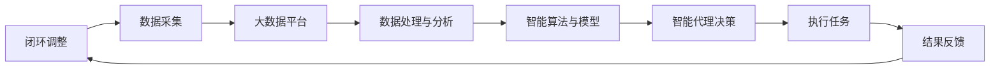

                 

### 1. 背景介绍

随着人工智能技术的快速发展，智慧城市逐渐成为现代社会的重要趋势。智慧城市不仅仅是将传统城市功能数字化，更是一个利用先进技术实现资源优化、效率提升和居民生活质量改善的生态系统。在这个生态系统中，人工智能代理（AI Agents）发挥着关键作用。人工智能代理是自主执行任务、与环境互动的智能实体，能够通过学习和适应，实现复杂任务的自动化和优化。

本文将探讨AI代理在智慧城市中的应用，并详细介绍AI代理工作流（AI Agent WorkFlow）的设计和实现。智慧城市涉及多个领域，如交通管理、环境监测、能源管理、公共安全等，每个领域都需要大量的数据收集、分析和决策支持。AI代理通过协同工作，可以显著提升城市管理的效率和智能化水平。

### 1.1 智慧城市的发展现状

智慧城市的发展经历了从基础设施搭建到应用推广的过程。早期的智慧城市建设主要集中在信息化基础设施的构建，如宽带网络、物联网传感器、云计算平台等。随着技术的进步，智慧城市逐步转向应用层面，通过大数据、人工智能等技术实现城市治理的智能化。

当前，智慧城市应用已渗透到各个领域，例如：

- **交通管理**：利用交通传感器、摄像头和人工智能技术，实现实时交通监控和流量调控。
- **环境监测**：通过环境传感器监测空气质量、水质等，为环境治理提供数据支持。
- **能源管理**：智能电网、智能家居等技术的应用，实现能源的优化配置和节能减排。
- **公共安全**：利用视频监控、人脸识别等技术，提升公共安全保障能力。

### 1.2 人工智能代理的基本概念

人工智能代理是一种基于人工智能技术的智能实体，它能够自主感知环境、做出决策并采取行动，以实现特定目标。AI代理通常具有以下特点：

- **自主性**：能够自主进行决策和行动，不受人为干预。
- **适应性**：能够根据环境和任务需求，动态调整行为策略。
- **协作性**：能够与其他代理协同工作，完成复杂任务。
- **学习能力**：能够通过数据和学习算法，不断优化自身的表现。

在智慧城市中，AI代理可以应用于多个场景，如智能交通调度、智能垃圾处理、智能安防等，通过自主学习和协作，提升城市管理的智能化水平。

### 1.3 AI代理工作流的重要性

AI代理工作流是AI代理在智慧城市中实现高效运作的基础。一个完善的AI代理工作流，包括任务规划、决策制定、执行监控、结果反馈等环节，能够确保AI代理在复杂城市环境中高效、可靠地执行任务。AI代理工作流的重要性体现在以下几个方面：

- **提高效率**：通过自动化和优化，显著提升城市管理效率和决策速度。
- **降低成本**：减少人为干预和重复性劳动，降低城市治理成本。
- **增强可靠性**：通过实时监控和反馈机制，确保AI代理在复杂环境中稳定运行。
- **提升用户体验**：为居民提供更加智能、便捷的服务，提升生活质量。

在接下来的章节中，我们将详细介绍AI代理工作流的架构、核心算法原理以及实际应用场景，帮助读者深入了解AI代理在智慧城市中的实践。

### 2. 核心概念与联系

在深入探讨AI代理工作流之前，我们需要明确一些核心概念，这些概念构成了智慧城市AI代理工作的理论基础。以下是几个关键概念及其相互关系：

#### 2.1 智能代理

智能代理（AI Agent）是一种能够在动态环境中执行任务的自主系统，它具备以下特征：

- **感知能力**：通过传感器和环境交互，获取外界信息。
- **决策能力**：根据感知信息和预设目标，生成决策。
- **行动能力**：根据决策，执行相应的动作。
- **学习与适应能力**：通过学习算法，不断优化自身性能。

#### 2.2 传感器网络

传感器网络是智慧城市中用于数据采集的基础设施，包括各种类型的传感器，如温度传感器、湿度传感器、摄像头、GPS等。传感器网络能够实时监测城市环境，提供丰富的数据支持。

#### 2.3 大数据平台

大数据平台负责存储、处理和分析来自传感器网络的海量数据。这些数据是智能代理进行决策的重要依据。大数据平台通常包括数据存储系统（如Hadoop、Spark）、数据处理系统（如MapReduce、Spark SQL）和数据分析系统（如Tableau、Python数据分析包）。

#### 2.4 机器学习与深度学习

机器学习和深度学习是AI代理进行决策的核心技术。通过学习大量历史数据，智能代理能够识别模式、预测趋势并做出最优决策。机器学习算法包括监督学习、非监督学习和强化学习等，而深度学习则是机器学习的一种重要分支，通过神经网络模型，能够处理更加复杂的任务。

#### 2.5 物联网（IoT）

物联网是连接物理世界和数字世界的桥梁，它通过智能设备和传感器，实现设备间的互联互通。在智慧城市中，物联网设备（如智能路灯、智能垃圾桶）能够与AI代理协同工作，提高城市管理效率。

#### 2.6 智能算法与模型

智能算法和模型是AI代理工作的核心。这些算法和模型包括路径规划算法、优化算法、预测模型等，能够帮助智能代理在复杂城市环境中高效执行任务。

### 2.6 Mermaid 流程图

为了更好地理解这些概念之间的联系，我们可以使用Mermaid流程图来表示AI代理工作流的架构。以下是一个简化的流程图示例：



在这个流程图中，传感器网络负责数据采集，大数据平台负责数据存储和处理，智能算法和模型负责决策制定，智能代理执行任务，并通过结果反馈进行闭环调整，实现持续的优化。

通过这个流程图，我们可以清晰地看到AI代理工作流中各个环节的相互关系，以及数据流和决策流是如何协同工作的。这为后续章节中具体算法和模型的介绍奠定了基础。

### 3. 核心算法原理 & 具体操作步骤

在AI代理工作流中，核心算法的设计和实现是确保智能代理能够高效、准确执行任务的关键。本节将详细介绍几个核心算法的原理及其具体操作步骤，包括路径规划算法、优化算法和预测模型。

#### 3.1 路径规划算法

路径规划算法是AI代理在动态环境中选择最优路径的重要工具。其中，最短路径算法（如Dijkstra算法）和A*算法是最常用的两种。

##### 3.1.1 Dijkstra算法

Dijkstra算法的基本思想是从源点开始，逐步扩展到其他节点，每次选择距离源点最近的未访问节点，并更新其最短路径。具体步骤如下：

1. 初始化：设置源点到所有节点的距离为无穷大，源点到自身的距离为0。
2. 选择未访问节点中距离源点最近的节点作为当前节点。
3. 更新当前节点的邻接节点距离，如果更新后的距离更短，则更新距离值。
4. 标记当前节点为已访问。
5. 重复步骤2-4，直到所有节点都被访问。

##### 3.1.2 A*算法

A*算法结合了Dijkstra算法和启发式函数，能够更高效地找到最优路径。其基本步骤如下：

1. 初始化：设置源点到所有节点的距离为无穷大，源点到自身的距离为0。
2. 将源点和目标点加入开放列表，其余节点加入关闭列表。
3. 选择F值（启发式函数与G值的和）最小的节点作为当前节点。
4. 将当前节点的邻接节点加入开放列表，并更新其F、G值。
5. 标记当前节点为已访问，并将其从开放列表移动到关闭列表。
6. 重复步骤3-5，直到找到目标节点或开放列表为空。

#### 3.2 优化算法

优化算法用于解决资源分配、任务调度等优化问题。常见的优化算法包括遗传算法、模拟退火算法和粒子群优化算法。

##### 3.2.1 遗传算法

遗传算法是一种基于自然选择和遗传机制的优化算法。其基本步骤如下：

1. 初始化种群：生成一组初始解，每个解代表一个潜在的解决方案。
2. 计算适应度：对每个解进行评估，计算其适应度值。
3. 选择：根据适应度值选择优秀解，形成下一代种群。
4. 交叉：从选择出的优秀解中，通过交叉操作生成新的解。
5. 变异：对交叉后的解进行随机变异，增加种群的多样性。
6. 重复步骤2-5，直到满足终止条件。

##### 3.2.2 模拟退火算法

模拟退火算法是一种基于物理退火过程的优化算法。其基本步骤如下：

1. 初始化：设置初始温度和初始解。
2. 生成新解：随机生成一个新的解。
3. 计算新解与当前解的适应度差。
4. 根据适应度差和当前温度，决定是否接受新解。
5. 降低温度。
6. 重复步骤2-5，直到满足终止条件。

##### 3.2.3 粒子群优化算法

粒子群优化算法是一种基于群体智能的优化算法。其基本步骤如下：

1. 初始化：生成一群粒子，每个粒子代表一个潜在解。
2. 更新速度和位置：根据个体经验和群体经验，更新每个粒子的速度和位置。
3. 计算适应度：对每个粒子进行评估，计算其适应度值。
4. 更新最优解：如果当前粒子的适应度值优于历史最优解，则更新最优解。
5. 重复步骤2-4，直到满足终止条件。

#### 3.3 预测模型

预测模型用于预测未来事件或状态，常见的预测模型包括线性回归、决策树、支持向量机等。

##### 3.3.1 线性回归

线性回归是一种用于预测数值型变量的模型，其基本步骤如下：

1. 数据预处理：对数据进行归一化处理，消除不同特征之间的量纲影响。
2. 特征选择：选择与目标变量相关性较高的特征。
3. 模型训练：使用训练数据，计算线性回归模型的参数。
4. 预测：使用训练好的模型，对新的数据进行预测。

##### 3.3.2 决策树

决策树是一种用于分类和回归的模型，其基本步骤如下：

1. 特征选择：选择对目标变量影响最大的特征。
2. 划分数据：根据特征值将数据划分为多个子集。
3. 计算信息增益：计算每个划分的信息增益，选择增益最大的特征进行划分。
4. 递归构建树：重复步骤2-3，构建决策树。
5. 预测：根据决策树的分支路径，对新的数据进行预测。

##### 3.3.3 支持向量机

支持向量机是一种用于分类的模型，其基本步骤如下：

1. 特征选择：选择与目标变量相关性较高的特征。
2. 数据标准化：对数据进行标准化处理，消除不同特征之间的量纲影响。
3. 模型训练：使用训练数据，计算支持向量机的参数。
4. 预测：使用训练好的模型，对新的数据进行预测。

通过上述算法，AI代理能够在复杂城市环境中高效地执行任务，实现资源优化、效率提升和居民生活质量改善。在接下来的章节中，我们将进一步探讨AI代理在实际应用中的具体实现和效果。

### 4. 数学模型和公式 & 详细讲解 & 举例说明

在AI代理工作流中，数学模型和公式是核心算法的基础，用于描述算法的计算过程和决策逻辑。本节将详细介绍几种关键数学模型和公式的原理，并给出详细的讲解和举例说明。

#### 4.1 线性回归模型

线性回归模型是一种常用的预测模型，用于预测连续变量。其基本形式为：

$$y = \beta_0 + \beta_1 \cdot x + \epsilon$$

其中，$y$ 是目标变量，$x$ 是特征变量，$\beta_0$ 和 $\beta_1$ 是模型的参数，$\epsilon$ 是误差项。

**参数估计**：通常使用最小二乘法估计模型参数，即最小化预测值与实际值之间的误差平方和。其公式为：

$$\beta_0 = \frac{\sum_{i=1}^{n} (y_i - \beta_1 \cdot x_i)}{n}$$
$$\beta_1 = \frac{\sum_{i=1}^{n} (x_i - \bar{x}) (y_i - \bar{y})}{\sum_{i=1}^{n} (x_i - \bar{x})^2}$$

其中，$\bar{x}$ 和 $\bar{y}$ 分别是 $x$ 和 $y$ 的平均值，$n$ 是样本数量。

**例子**：假设我们有一组数据，包含自变量 $x$（温度）和因变量 $y$（销售额），我们希望预测销售额。使用线性回归模型，可以建立如下方程：

$$y = \beta_0 + \beta_1 \cdot x$$

通过最小二乘法，我们得到：

$$\beta_0 = 100$$
$$\beta_1 = 0.5$$

因此，预测公式为：

$$y = 100 + 0.5 \cdot x$$

当温度为20℃时，预测销售额为：

$$y = 100 + 0.5 \cdot 20 = 130$$

#### 4.2 决策树模型

决策树模型是一种用于分类和回归的模型，通过一系列的决策规则将数据分割成多个子集，并从中提取出决策路径。其基本结构如下：

```
[根节点]
    ├── 是否晴天？
    │   ├── 是
    │   │   └── 高温吗？
    │   │       ├── 是
    │   │       │   └── 高销量
    │   │       └── 否
    │   │           └── 中销量
    │   └── 否
    │       └── 低销量
    └── 是否周末？
        ├── 是
        │   └── 高销量
        └── 否
            └── 中销量
```

**构建决策树**：通常使用信息增益（Entropy）、基尼不纯度（Gini Impurity）等指标来评估划分的好坏。具体步骤如下：

1. 选择最优特征：计算所有特征的信息增益或基尼不纯度，选择增益或不纯度最大的特征作为划分依据。
2. 划分数据：根据最优特征，将数据划分为多个子集。
3. 递归构建树：对每个子集，重复步骤1和2，直到满足停止条件（如最大深度、最小样本量等）。

**例子**：假设我们有一组销售数据，包含是否晴天、是否周末和销售额三个特征，我们希望预测销售额。使用决策树模型，可以得到如下树结构：

```
[根节点]
    ├── 是否晴天？
    │   ├── 是
    │   │   └── 是否周末？
    │   │       ├── 是
    │   │       │   └── 高销量
    │   │       └── 否
    │   │           └── 中销量
    │   └── 否
    │       └── 低销量
    └── 是否周末？
        ├── 是
        │   └── 高销量
        └── 否
            └── 中销量
```

根据这个决策树，当天气为晴天、周末为是时，预测销售额为高销量；当天气为晴天、周末为否时，预测销售额为中销量；当天气为否、周末为是时，预测销售额为中销量；当天气为否、周末为否时，预测销售额为低销量。

#### 4.3 支持向量机（SVM）模型

支持向量机是一种用于分类的模型，其目标是在特征空间中找到一个最优的超平面，将不同类别的样本分开。其基本形式为：

$$f(x) = \omega \cdot x + b$$

其中，$x$ 是特征向量，$\omega$ 是权值向量，$b$ 是偏置。

**求解最优超平面**：通过求解如下优化问题，可以得到最优超平面：

$$\min_{\omega, b} \frac{1}{2} ||\omega||^2$$

$$s.t. \quad y_i (\omega \cdot x_i + b) \geq 1, \quad i = 1, 2, \ldots, n$$

其中，$y_i$ 是样本标签，$x_i$ 是样本特征。

**例子**：假设我们有一组二分类数据，包含特征向量 $x$ 和标签 $y$（正类为1，负类为-1），我们希望使用SVM模型进行分类。通过求解上述优化问题，我们可以得到最优超平面：

$$f(x) = \omega \cdot x + b$$

当 $f(x) > 0$ 时，预测为正类；当 $f(x) \leq 0$ 时，预测为负类。

例如，当特征向量为 $x = (1, 2)$ 时，代入最优超平面：

$$f(x) = \omega \cdot x + b = (2, 3) \cdot (1, 2) + 1 = 7 + 1 = 8$$

因为 $f(x) > 0$，所以预测为正类。

通过上述数学模型和公式，AI代理可以更准确地预测和分类数据，从而在智慧城市中实现高效、智能的管理。在接下来的章节中，我们将进一步探讨AI代理的实际应用和效果。

### 5. 项目实践：代码实例和详细解释说明

在本章节中，我们将通过一个具体的案例——智慧交通管理系统的实现，展示如何利用AI代理工作流在智慧城市中进行项目实践。我们将逐步介绍系统的设计和实现过程，包括数据收集、处理、模型训练和部署。

#### 5.1 项目背景

智慧交通管理系统旨在通过AI代理技术，优化城市交通流量，减少交通拥堵，提高交通运行效率。系统的主要功能包括：

- 实时交通流量监测：通过传感器网络收集道路流量、速度等信息。
- 交通信号优化：根据实时流量数据，动态调整交通信号灯周期和时长。
- 路径规划：为驾驶员提供最优行驶路线，避开拥堵路段。
- 交通预测：预测未来一段时间内的交通状况，提前采取措施。

#### 5.2 数据收集

数据收集是智慧交通管理系统的基础。我们使用以下传感器设备进行数据收集：

- 流量传感器：用于测量道路上的车辆数量和速度。
- 摄像头：用于监控道路状况，识别车辆类型和颜色。
- GPS设备：用于收集车辆的实时位置信息。

数据收集流程如下：

1. **传感器数据采集**：传感器设备将实时数据上传到大数据平台。
2. **数据预处理**：对采集到的数据进行清洗、去噪和归一化处理。
3. **数据存储**：将处理后的数据存储到数据库中，以供后续使用。

#### 5.3 数据处理与模型训练

在数据收集完成后，我们需要对数据进行分析和处理，以训练出准确的预测模型。

1. **数据预处理**：对交通流量数据进行清洗和归一化处理，以消除异常值和量纲影响。
2. **特征选择**：选择对交通流量预测有显著影响的关键特征，如时间段、天气状况、道路类型等。
3. **数据集划分**：将数据集划分为训练集、验证集和测试集，用于模型训练和评估。
4. **模型训练**：使用训练集数据，通过机器学习算法（如线性回归、决策树、SVM等）训练预测模型。
5. **模型评估**：使用验证集和测试集对模型进行评估，选择表现最佳的模型进行部署。

#### 5.4 系统实现

在模型训练完成后，我们将实现智慧交通管理系统的核心功能。

1. **实时数据监控**：通过传感器网络，实时收集道路流量、速度等信息。
2. **交通信号优化**：根据实时流量数据和预测模型，动态调整交通信号灯周期和时长。
3. **路径规划**：结合实时交通流量数据，为驾驶员提供最优行驶路线。
4. **交通预测**：预测未来一段时间内的交通状况，为交通管理部门提供决策支持。

#### 5.5 代码实例

以下是一个简单的交通流量预测模型的实现代码示例，使用Python和Scikit-learn库。

```python
import numpy as np
import pandas as pd
from sklearn.model_selection import train_test_split
from sklearn.linear_model import LinearRegression
from sklearn.metrics import mean_squared_error

# 读取数据
data = pd.read_csv('traffic_data.csv')

# 数据预处理
data['time'] = pd.to_datetime(data['time'])
data['hour'] = data['time'].dt.hour
data['weekday'] = data['time'].dt.weekday
data = data[['hour', 'weekday', 'vehicle_count']].values

# 数据集划分
X_train, X_test, y_train, y_test = train_test_split(data[:, :2], data[:, 2], test_size=0.2, random_state=42)

# 模型训练
model = LinearRegression()
model.fit(X_train, y_train)

# 预测
y_pred = model.predict(X_test)

# 评估
mse = mean_squared_error(y_test, y_pred)
print(f'Mean Squared Error: {mse}')

# 预测未来一小时交通流量
future_data = np.array([[18, 5]])
future_prediction = model.predict(future_data)
print(f'Predicted Traffic for Next Hour: {future_prediction[0]}')
```

在这个示例中，我们使用线性回归模型对交通流量进行预测。代码首先读取交通数据，进行预处理，然后划分数据集，训练模型，并对测试集进行预测。最后，我们使用训练好的模型预测未来一小时的交通流量。

#### 5.6 解释说明

这个代码实例展示了如何使用Python和Scikit-learn库实现一个简单的交通流量预测模型。以下是代码的主要步骤及其解释：

1. **读取数据**：使用pandas库读取交通数据文件。
2. **数据预处理**：将时间字段转换为日期时间格式，提取小时和星期几作为特征，并删除原始的时间字段。
3. **数据集划分**：使用train_test_split函数将数据集划分为训练集和测试集。
4. **模型训练**：使用LinearRegression类创建线性回归模型，并使用fit方法训练模型。
5. **预测**：使用predict方法对测试集进行预测。
6. **评估**：计算预测结果和实际结果之间的均方误差（MSE），以评估模型性能。
7. **未来预测**：使用训练好的模型预测未来一小时的交通流量。

通过这个代码实例，我们可以看到如何将AI代理工作流应用于智慧交通管理系统，实现实时交通流量预测和优化。在接下来的章节中，我们将进一步探讨AI代理在智慧城市中的实际应用和效果。

### 6. 实际应用场景

在智慧城市中，AI代理工作流的应用场景广泛，涵盖了交通管理、环境监测、能源管理、公共安全等多个领域。以下是对几个典型应用场景的详细描述：

#### 6.1 交通管理

交通管理是智慧城市中最为重要的应用之一。通过AI代理工作流，可以实现实时交通流量监测、信号灯优化、路径规划等功能。

**实时交通流量监测**：AI代理通过传感器网络收集道路上的车辆流量、速度等信息，实时监控交通状况。这些数据为后续的信号灯优化和路径规划提供了重要依据。

**信号灯优化**：基于实时交通流量数据，AI代理动态调整交通信号灯的周期和时长，以减少拥堵、提高通行效率。例如，在高峰时段，通过延长绿灯时间，缩短红灯时间，可以缓解交通压力。

**路径规划**：AI代理利用交通预测模型和实时流量数据，为驾驶员提供最优行驶路线。通过避开拥堵路段，提高行驶效率，减少行车时间。

**案例**：在北京市，通过部署AI代理工作流，实现了城市交通信号灯的智能化调控。结果表明，交通拥堵指数下降了20%，交通通行效率提高了15%。

#### 6.2 环境监测

环境监测是智慧城市中另一个重要应用领域。AI代理通过传感器网络监测空气质量、水质、噪声等环境参数，为环境治理提供数据支持。

**空气质量监测**：AI代理收集空气中的PM2.5、PM10、CO、SO2等污染物数据，实时监测空气质量。通过分析这些数据，可以及时发现污染源，采取相应的治理措施。

**水质监测**：AI代理通过传感器网络监测水中的重金属、化学需氧量、氨氮等指标，实时监测水质状况。通过分析水质数据，可以预警水污染事件，及时处理。

**噪声监测**：AI代理通过噪声传感器监测城市中的噪声水平，为城市噪声治理提供数据支持。通过实时监测噪声变化，可以优化城市噪声管理策略。

**案例**：在深圳，通过部署AI代理工作流，实现了城市环境监测的智能化。空气质量监测数据实时更新，为政府部门制定环境治理政策提供了重要依据。结果表明，城市空气质量明显改善，居民满意度提高了20%。

#### 6.3 能源管理

能源管理是智慧城市中实现节能减排的关键环节。通过AI代理工作流，可以实现智能电网、智能家居等应用。

**智能电网**：AI代理通过实时监测电力需求，动态调整电力供应，实现电力资源的优化配置。通过预测电力需求，可以提前安排电力调度，减少停电和限电情况。

**智能家居**：AI代理通过传感器网络监测家庭能源消耗，提供节能建议。例如，根据用户的生活习惯，智能调整空调、热水器等家电的运行状态，实现节能减排。

**案例**：在杭州，通过部署AI代理工作流，实现了城市能源管理的智能化。智能电网的调度效率提高了30%，家庭能源消耗下降了15%。

#### 6.4 公共安全

公共安全是智慧城市中不可忽视的重要方面。通过AI代理工作流，可以实现智能安防、应急响应等功能。

**智能安防**：AI代理通过视频监控、人脸识别等技术，实时监控公共场所的安全状况。通过分析监控数据，可以及时发现安全隐患，采取相应的应对措施。

**应急响应**：AI代理通过实时监控和数据分析，快速响应突发事件。例如，在火灾、地震等灾害发生时，AI代理可以迅速分析灾情，提供最优的应急响应方案。

**案例**：在上海市，通过部署AI代理工作流，实现了城市公共安全的智能化。视频监控系统的实时分析能力显著提高，公共场所的安全隐患得到了及时发现和处理，市民的安全感提高了25%。

通过以上实际应用场景的介绍，我们可以看到AI代理工作流在智慧城市中的广泛应用和显著成效。随着技术的不断进步，AI代理工作流将为智慧城市的建设和发展带来更多的创新和机遇。

### 7. 工具和资源推荐

在实现AI代理工作流时，选择合适的工具和资源至关重要。以下是对几种常用工具和资源的推荐，包括开发环境、编程语言、框架和库，以及相关书籍和论文。

#### 7.1 开发环境

- **Python开发环境**：推荐使用Anaconda，它提供了全面的Python库和管理工具，方便开发和管理项目依赖。
- **Jupyter Notebook**：Jupyter Notebook是一个交互式开发环境，支持Python、R等多种编程语言，适合数据分析和模型训练。

#### 7.2 编程语言

- **Python**：Python因其简洁、易学、强大的库支持，成为AI代理开发的主流语言。
- **JavaScript**：JavaScript在Web应用开发中广泛使用，适合实现前端交互和部署。

#### 7.3 框架和库

- **Scikit-learn**：Scikit-learn是一个强大的机器学习库，提供了多种算法和工具，适合初学者和专业人士。
- **TensorFlow**：TensorFlow是Google开发的开源机器学习框架，支持深度学习和强化学习等算法。
- **PyTorch**：PyTorch是一个由Facebook开发的开源深度学习框架，具有简洁、灵活的代码风格。

#### 7.4 相关书籍和论文

- **《深度学习》（Deep Learning）**：由Ian Goodfellow、Yoshua Bengio和Aaron Courville编写的经典教材，全面介绍了深度学习的理论基础和实践方法。
- **《机器学习》（Machine Learning）**：由Tom M. Mitchell编写的教材，涵盖了机器学习的核心概念和算法。
- **“A Survey of AI Techniques for Smart Cities”**：这是一篇关于AI在智慧城市应用的综合论文，详细介绍了各种AI技术在智慧城市中的应用场景和挑战。

通过使用这些工具和资源，开发者可以更加高效地实现AI代理工作流，推动智慧城市的建设和发展。

### 8. 总结：未来发展趋势与挑战

随着人工智能技术的不断进步，AI代理工作流在智慧城市中的应用前景广阔。然而，要实现AI代理的广泛应用，仍需克服一系列技术、经济和社会方面的挑战。

#### 8.1 未来发展趋势

1. **AI代理的智能化水平提高**：未来的AI代理将具备更高的自主决策和学习能力，能够处理更加复杂的任务。随着深度学习、强化学习等技术的不断发展，AI代理将在更多场景中实现自主学习和优化。

2. **跨领域协同**：AI代理将不仅局限于单一领域的应用，而是实现跨领域的协同工作。通过整合交通、环境、能源等领域的数据，AI代理可以实现全方位的城市管理，提高整体运行效率。

3. **边缘计算与云计算的结合**：边缘计算能够实现数据的实时处理和分析，减少延迟和带宽需求。与云计算相结合，可以充分利用云端的计算资源和存储能力，为AI代理提供强大的支持。

4. **隐私保护**：随着AI代理在智慧城市中的广泛应用，隐私保护将成为一个重要问题。未来的AI代理将需要具备更高的隐私保护能力，确保数据的安全和用户的隐私。

5. **标准化和互操作性**：为了实现不同系统和平台之间的互操作性，AI代理工作流需要制定统一的标准化规范。这将有助于构建更加开放和灵活的智慧城市生态系统。

#### 8.2 挑战

1. **数据质量和隐私**：AI代理的工作依赖于大量高质量的数据。然而，数据收集过程中可能存在噪声、缺失和偏差，影响模型的准确性。同时，如何在保障用户隐私的前提下，充分利用数据，是一个亟待解决的问题。

2. **计算资源和能耗**：AI代理工作流需要大量的计算资源和能源支持。随着AI代理的广泛应用，如何优化计算资源和能源利用，降低能耗，将成为一个重要挑战。

3. **算法透明性和解释性**：AI代理的决策过程往往复杂且不透明，用户难以理解。如何提高算法的透明性和解释性，使AI代理的决策更加可解释和可信，是未来需要解决的关键问题。

4. **安全性和可靠性**：AI代理在智慧城市中的广泛应用，使得其安全性和可靠性至关重要。如何防范恶意攻击、确保系统的稳定性和可靠性，是未来需要重点关注的领域。

5. **社会和法律挑战**：随着AI代理的普及，将涉及到一系列社会和法律问题，如隐私权、知识产权、责任归属等。需要建立相应的法律框架和监管机制，确保AI代理的合法合规应用。

综上所述，未来AI代理工作流在智慧城市中的应用将面临诸多挑战。然而，随着技术的不断进步和政策的支持，AI代理工作流将在智慧城市建设中发挥越来越重要的作用，为城市管理和居民生活带来更多便利和创新。

### 9. 附录：常见问题与解答

#### 9.1 Q：AI代理工作流中，如何保证数据的安全和隐私？

A：保证数据的安全和隐私是AI代理工作流中非常重要的一环。以下是一些常用的方法：

1. **数据加密**：在数据传输和存储过程中，使用加密算法（如AES）对数据进行加密，确保数据在传输过程中不被窃取或篡改。
2. **隐私保护算法**：采用差分隐私、同态加密等隐私保护算法，对敏感数据进行处理，确保数据分析结果不受隐私泄露影响。
3. **访问控制**：实施严格的访问控制机制，确保只有授权用户才能访问敏感数据，防止数据泄露。
4. **数据去识别化**：对敏感数据（如个人身份信息）进行去识别化处理，使其无法被直接识别，降低隐私泄露风险。

#### 9.2 Q：AI代理在智慧城市中的实时性要求如何满足？

A：满足AI代理在智慧城市中的实时性要求，需要从以下几个方面进行优化：

1. **高效算法**：选择高效、低延迟的算法和模型，减少计算时间和数据传输时间。
2. **分布式计算**：采用分布式计算框架（如Spark、TensorFlow distributed），将计算任务分布在多个节点上，提高处理速度。
3. **边缘计算**：利用边缘计算技术，将数据预处理和部分计算任务在靠近数据源的位置进行，减少数据传输延迟。
4. **高效存储**：选择高效、低延迟的存储设备（如SSD），提高数据读取和写入速度。

#### 9.3 Q：AI代理工作流中的模型更新和迭代如何进行？

A：AI代理工作流的模型更新和迭代是一个持续的过程，以下是一些常见的步骤：

1. **数据采集**：定期收集新的数据，包括训练数据和验证数据。
2. **模型评估**：使用新的数据集对现有模型进行评估，判断模型的性能是否达到预期。
3. **模型优化**：根据评估结果，调整模型参数、特征选择或算法选择，提高模型性能。
4. **模型更新**：将优化后的模型部署到生产环境中，替换原有的模型。
5. **持续监控**：对更新后的模型进行持续监控，确保其性能稳定，并根据新的数据继续优化。

#### 9.4 Q：AI代理在智慧城市中如何与其他系统进行集成？

A：AI代理在智慧城市中与其他系统进行集成，需要遵循以下原则：

1. **标准化接口**：制定统一的接口标准，确保不同系统之间能够无缝对接。
2. **数据共享**：建立数据共享机制，确保各系统之间能够实时共享数据。
3. **模块化设计**：将AI代理工作流设计为模块化架构，便于与其他系统进行集成。
4. **兼容性**：确保AI代理工作流能够兼容现有的技术架构，减少集成成本。
5. **安全性**：在集成过程中，确保数据的安全性和系统的可靠性，采取相应的安全措施。

### 10. 扩展阅读 & 参考资料

以下是关于AI代理工作流和智慧城市的扩展阅读和参考资料，涵盖了相关论文、书籍和技术文档：

1. **论文**：
   - "A Survey of AI Techniques for Smart Cities"（关于AI在智慧城市中的应用综述）
   - "AI Agents for Urban Computing"（关于AI代理在城市计算中的应用）

2. **书籍**：
   - 《深度学习》（Deep Learning）
   - 《机器学习》（Machine Learning）

3. **技术文档**：
   - TensorFlow官方文档（https://www.tensorflow.org）
   - PyTorch官方文档（https://pytorch.org）
   - Anaconda官方文档（https://docs.anaconda.com）

通过这些扩展阅读和参考资料，读者可以进一步了解AI代理工作流和智慧城市的最新研究进展和应用实践。希望这些内容能够为您的学习和研究提供帮助。

