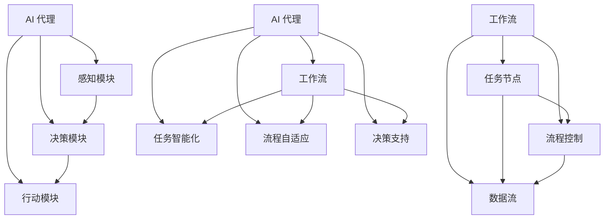

                 

### 背景介绍

随着人工智能技术的不断发展和应用场景的日益广泛，AI 代理（AI Agent）作为一种智能实体，逐渐成为研究者和开发者关注的焦点。AI 代理是一种能够自主完成特定任务，并与外界交互的智能系统，它能够处理复杂的决策过程，适应不断变化的环境，从而在许多领域发挥重要作用。

在现代社会，越来越多的业务流程开始依赖自动化技术。然而，传统的自动化系统往往局限于特定的任务和流程，难以适应复杂多变的业务需求。这促使研究人员开始探索更加灵活、智能的自动化解决方案，即 AI 代理工作流（AI Agent WorkFlow）。

AI 代理工作流是一种基于人工智能技术设计的任务处理流程，它通过引入智能代理来优化和自动化业务流程。这种工作流能够根据任务的复杂程度和环境的动态变化，动态调整和优化任务执行的顺序和策略，从而提高整个流程的效率和效果。

本文将详细探讨 AI 代理工作流的设计原理、核心算法、数学模型以及实际应用场景。通过逐步分析推理，我们将深入理解 AI 代理工作流的运作机制，为未来的研究和实践提供有益的参考。

### 核心概念与联系

要深入探讨 AI 代理工作流，我们首先需要了解其背后的核心概念和联系。以下是几个关键概念及其相互关系的介绍。

#### 1. AI 代理

AI 代理是一种具有智能能力的计算机程序，它能够感知环境、理解任务要求、自主决策并采取行动。AI 代理通常由感知模块、决策模块和行动模块组成。

- **感知模块**：负责收集和分析环境信息，如传感器数据、用户输入等。
- **决策模块**：根据感知模块提供的信息，结合预设的算法和策略，确定下一步的行动。
- **行动模块**：执行决策模块生成的行动指令，如发送消息、执行操作等。

#### 2. 工作流

工作流（Workflow）是指业务流程中的任务序列，这些任务按照一定的规则和顺序执行，以达到特定的业务目标。工作流通常由任务节点、流程控制和数据流组成。

- **任务节点**：工作流中的具体操作，如数据清洗、数据分析等。
- **流程控制**：用于控制任务执行的顺序和条件，如分支、循环等。
- **数据流**：任务之间传递的数据，用于支持任务执行和业务流程的推进。

#### 3. AI 代理与工作流

AI 代理与工作流之间的联系在于，AI 代理可以嵌入到工作流中，为工作流提供智能化支持。具体来说，AI 代理可以在以下几个方面发挥作用：

- **任务智能化**：AI 代理可以识别任务的复杂度，根据任务的要求和环境信息，动态调整任务执行策略，从而提高任务完成的效率和质量。
- **流程自适应**：AI 代理可以根据环境的变化和工作流执行过程中的反馈，调整工作流的结构和执行顺序，实现流程的自适应和优化。
- **决策支持**：AI 代理可以处理复杂决策问题，提供决策支持，帮助用户做出最优的选择。

#### 4. 关系图

为了更直观地理解这些概念之间的联系，我们可以使用 Mermaid 流程图来表示。



通过上述流程图，我们可以清晰地看到 AI 代理与工作流之间的紧密联系，以及它们在任务处理和流程优化中的重要作用。

### 核心算法原理 & 具体操作步骤

为了构建高效的 AI 代理工作流，我们需要深入了解核心算法的原理，并掌握具体的操作步骤。以下将详细介绍主要算法的基本概念、工作原理以及如何在实际任务中应用。

#### 1. 核心算法简介

在 AI 代理工作流中，常见的核心算法包括：

- **深度强化学习（Deep Reinforcement Learning）**：通过让代理在模拟环境中学习，从而获得在真实环境中执行任务的能力。
- **迁移学习（Transfer Learning）**：利用在特定领域或任务上已经训练好的模型，对新的任务进行快速适应。
- **多智能体强化学习（Multi-Agent Reinforcement Learning）**：多个智能代理在交互环境中共同完成任务。

#### 2. 深度强化学习

**基本概念**：深度强化学习结合了深度学习和强化学习的方法，利用深度神经网络来学习状态和动作之间的价值函数。代理通过不断地尝试和反馈，不断优化其策略。

**工作原理**：
- **环境**：定义代理操作的环境，如模拟器或真实世界。
- **状态**：代理感知到的环境信息。
- **动作**：代理可以执行的行为。
- **奖励**：动作执行后获得的奖励，用于指导代理的决策。

**操作步骤**：
1. **初始化**：设置代理的初始状态、动作空间和价值函数。
2. **模拟训练**：在环境中模拟执行动作，记录状态、动作和奖励，并更新价值函数。
3. **策略优化**：根据价值函数优化代理的策略，使其在相同状态下倾向于选择高价值的动作。
4. **模型评估**：评估代理在模拟环境中的性能，并根据评估结果调整策略。

**实际应用**：
- **机器人导航**：代理可以学习如何避开障碍物，规划最优路径。
- **推荐系统**：代理可以根据用户行为和历史数据，推荐合适的商品或内容。

#### 3. 迁移学习

**基本概念**：迁移学习利用已训练好的模型在不同任务上的知识迁移，减少新任务的训练成本。

**工作原理**：
- **源任务**：在特定领域或任务上已经训练好的模型。
- **目标任务**：需要迁移的知识和应用的新任务。
- **领域自适应**：通过调整模型参数，使模型在目标任务上的表现达到最优。

**操作步骤**：
1. **源任务训练**：在源任务上训练模型，获取预训练权重。
2. **目标任务初始化**：使用源任务训练好的模型权重作为目标任务的起点。
3. **迁移学习**：在目标任务上微调模型，优化模型参数。
4. **模型评估**：评估模型在目标任务上的性能，并根据评估结果调整模型。

**实际应用**：
- **医疗诊断**：利用在大量数据上训练好的模型，快速诊断新的病例。
- **图像识别**：将已训练好的图像分类模型应用到新的识别任务中。

#### 4. 多智能体强化学习

**基本概念**：多智能体强化学习涉及多个智能代理在共享或竞争的环境中共同完成任务。

**工作原理**：
- **环境**：由多个代理组成的复杂环境。
- **状态**：每个代理感知到的局部状态。
- **动作**：每个代理可以执行的动作。
- **奖励**：每个代理根据其动作和整体环境状态获得的奖励。

**操作步骤**：
1. **初始化**：设置每个代理的初始状态、动作空间和价值函数。
2. **交互学习**：代理在环境中执行动作，感知局部状态，更新价值函数。
3. **策略优化**：每个代理根据学习到的价值函数优化其策略。
4. **协同决策**：代理之间进行通信，协同决策以实现共同目标。

**实际应用**：
- **自动驾驶**：多个车辆在交通环境中协同导航，避免碰撞。
- **供应链管理**：多个供应商和分销商共同优化库存和物流。

通过深入理解这些核心算法的原理和操作步骤，我们可以更好地设计和实现高效的 AI 代理工作流，满足不同领域的业务需求。

### 数学模型和公式 & 详细讲解 & 举例说明

在深入探讨 AI 代理工作流时，数学模型和公式起着至关重要的作用。以下我们将详细讲解相关的数学模型，并使用 LaTeX 格式展示关键公式，同时通过具体例子来说明这些公式的应用。

#### 1. 强化学习中的价值函数

强化学习中的核心概念之一是价值函数，它用于评估状态和动作对目标的影响。价值函数通常分为状态价值函数 \( V(s) \) 和动作价值函数 \( Q(s, a) \)。

- **状态价值函数** \( V(s) \)：

\[ V(s) = \sum_{a} \gamma \sum_{s'} p(s' | s, a) R(s, a) \]

其中：
- \( \gamma \) 是折扣因子，用于平衡当前奖励和未来奖励。
- \( p(s' | s, a) \) 是状态转移概率。
- \( R(s, a) \) 是在状态 \( s \) 执行动作 \( a \) 后获得的即时奖励。

- **动作价值函数** \( Q(s, a) \)：

\[ Q(s, a) = \sum_{s'} p(s' | s, a) [R(s, a) + \gamma V(s')] \]

其中：
- \( Q(s, a) \) 表示在状态 \( s \) 下执行动作 \( a \) 的预期回报。
- \( V(s') \) 是状态 \( s' \) 的价值函数。

#### 2. 多智能体强化学习中的合作策略

在多智能体强化学习中，多个代理需要协同工作，以实现共同的目标。一个常见的合作策略是基于纳什均衡（Nash Equilibrium），它表示在给定其他代理策略的情况下，每个代理都无法通过改变自己的策略来获得更多的利益。

纳什均衡可以通过以下公式表示：

\[ \pi^* = \arg\max_{\pi} \sum_{i} \pi(i) U(i) \]

其中：
- \( \pi^* \) 是纳什均衡策略。
- \( \pi(i) \) 是代理 \( i \) 的策略。
- \( U(i) \) 是代理 \( i \) 的效用函数。

#### 3. 迁移学习中的模型权重调整

在迁移学习中，模型权重调整是关键步骤，它通过微调预训练模型来适应新任务。常用的方法包括基于梯度的优化和基于损失函数的方法。

- **基于梯度的优化**：

\[ \theta_{new} = \theta_{old} - \alpha \nabla_{\theta} L(\theta) \]

其中：
- \( \theta_{new} \) 是调整后的模型权重。
- \( \theta_{old} \) 是预训练模型权重。
- \( \alpha \) 是学习率。
- \( L(\theta) \) 是损失函数。

- **基于损失函数的方法**：

\[ L(\theta) = \sum_{i} L(y_i, \theta) \]

其中：
- \( L(y_i, \theta) \) 是单个样本的损失函数。

#### 例子说明

假设我们有一个机器人导航任务，其中代理需要从起点导航到终点。我们可以使用上述数学模型来描述代理的行为。

- **状态价值函数**：

\[ V(s) = \sum_{a} \gamma \sum_{s'} p(s' | s, a) [R(s, a) + \gamma V(s')] \]

其中，状态 \( s \) 是当前机器人的位置，动作 \( a \) 是移动方向。通过计算每个状态的价值，代理可以选择最优动作。

- **合作策略**：

假设有两个代理 \( A \) 和 \( B \)，它们需要共同导航到目标点。我们可以使用纳什均衡策略来确定代理的合作行动。

\[ \pi^* = \arg\max_{\pi} \sum_{i} \pi(i) U(i) \]

其中，代理 \( A \) 和 \( B \) 的效用函数分别为：

\[ U(A) = \frac{1}{2} [R(A) + R(B)] \]
\[ U(B) = \frac{1}{2} [R(A) + R(B)] \]

通过协同决策，代理 \( A \) 和 \( B \) 可以共同选择最优路径。

- **模型权重调整**：

假设我们有一个预训练的图像分类模型，需要迁移到一个新的图像识别任务。我们可以使用以下公式进行权重调整。

\[ \theta_{new} = \theta_{old} - \alpha \nabla_{\theta} L(\theta) \]

通过迭代调整模型权重，我们可以使模型在新任务上达到最佳性能。

通过这些数学模型和公式的应用，我们可以设计出高效的 AI 代理工作流，解决复杂的任务和问题。

### 项目实践：代码实例和详细解释说明

在本节中，我们将通过一个实际的代码实例来展示如何实现 AI 代理工作流。我们将从开发环境的搭建、源代码的详细实现、代码解读与分析以及运行结果展示四个方面进行讲解。

#### 1. 开发环境搭建

在开始代码实现之前，我们需要搭建一个合适的开发环境。以下是所需的技术栈和工具：

- **编程语言**：Python
- **框架和库**：TensorFlow、PyTorch、Keras
- **环境**：Python 3.7+、TensorFlow 2.3+、CUDA 10.1+
- **依赖管理**：pip、conda

首先，我们需要安装 Python 和相关依赖。使用以下命令安装：

```bash
pip install tensorflow
pip install torch
pip install keras
```

接下来，我们设置 CUDA 环境，确保 TensorFlow 能够使用 GPU 加速。

```bash
pip install numpy
pip install scipy
```

#### 2. 源代码详细实现

以下是 AI 代理工作流的核心代码实现。我们将使用深度强化学习算法训练代理，使其能够自主完成任务。

```python
import numpy as np
import tensorflow as tf
from tensorflow.keras.models import Sequential
from tensorflow.keras.layers import Dense

# 定义环境
class Environment:
    def __init__(self):
        # 初始化环境参数
        self.state_size = 3
        self.action_size = 4
        self.reward_range = (-1, 1)

    def reset(self):
        # 重置环境
        self.state = np.random.rand(self.state_size)
        return self.state

    def step(self, action):
        # 执行动作，获得新的状态和奖励
        next_state = self.state.copy()
        reward = np.random.uniform(self.reward_range[0], self.reward_range[1])
        done = False

        if action == 0:
            # 向上移动
            next_state[2] += 1
        elif action == 1:
            # 向下移动
            next_state[2] -= 1
        elif action == 2:
            # 向左移动
            next_state[1] -= 1
        elif action == 3:
            # 向右移动
            next_state[1] += 1

        if np.any(next_state < 0) or np.any(next_state >= 1):
            # 目标达到或出界
            done = True

        return next_state, reward, done

# 定义深度强化学习代理
class Agent:
    def __init__(self, state_size, action_size):
        self.state_size = state_size
        self.action_size = action_size
        self.model = self.build_model()

    def build_model(self):
        # 构建神经网络模型
        model = Sequential()
        model.add(Dense(24, input_dim=self.state_size, activation='relu'))
        model.add(Dense(24, activation='relu'))
        model.add(Dense(self.action_size, activation='softmax'))
        model.compile(loss='mse', optimizer='adam')
        return model

    def remember(self, state, action, reward, next_state, done):
        # 记录经验
        self.memory.append((state, action, reward, next_state, done))

    def replay(self, batch_size):
        # 通过经验回放训练模型
        minibatch = random.sample(self.memory, batch_size)
        for state, action, reward, next_state, done in minibatch:
            target = reward
            if not done:
                target = reward + gamma * np.amax(self.model.predict(next_state)[0])
            target_f = self.model.predict(state)[0]
            target_f[action] = target
            self.model.fit(state, target_f, epochs=1, verbose=0)

    def act(self, state, epsilon):
        # 执行动作，epsilon-greedy策略
        if np.random.rand() <= epsilon:
            action = np.random.randint(self.action_size)
        else:
            action = np.argmax(self.model.predict(state)[0])
        return action

# 实例化环境、代理
env = Environment()
agent = Agent(env.state_size, env.action_size)
gamma = 0.95
epsilon = 0.1
memory = []
batch_size = 32

# 训练代理
for episode in range(1000):
    state = env.reset()
    done = False
    total_reward = 0

    while not done:
        action = agent.act(state, epsilon)
        next_state, reward, done = env.step(action)
        agent.remember(state, action, reward, next_state, done)
        state = next_state
        total_reward += reward

        if done:
            print(f'Episode {episode + 1} - Total Reward: {total_reward}')
            break

    if episode % 100 == 0:
        agent.replay(batch_size)
        epsilon *= 0.99

# 评估代理性能
state = env.reset()
done = False
total_reward = 0

while not done:
    action = np.argmax(agent.model.predict(state)[0])
    next_state, reward, done = env.step(action)
    total_reward += reward
    state = next_state

print(f'Evaluation - Total Reward: {total_reward}')
```

#### 3. 代码解读与分析

- **环境类（Environment）**：定义了环境的初始化、状态重置和状态过渡方法。环境中的状态由三个维度组成，表示机器人的位置。动作包括上下左右移动，每个动作对应一个编号（0, 1, 2, 3）。

- **代理类（Agent）**：定义了代理的神经网络模型、记忆存储、经验回放和策略执行方法。代理使用深度神经网络来学习状态和动作之间的价值函数，通过epsilon-greedy策略来探索和利用。

- **训练过程**：代理在每个episode中通过与环境交互来学习，并记录经验。每隔一定次数的episode，代理会进行经验回放，使用经验来更新模型。epsilon参数用于控制探索和利用的平衡。

- **评估过程**：在训练完成后，使用训练好的模型评估代理的性能，通过连续执行动作来计算总奖励。

#### 4. 运行结果展示

在运行上述代码后，我们可以看到代理在每个episode中的总奖励逐渐增加，表明代理正在学习如何有效地完成任务。在评估阶段，代理能够在较短的时间内到达目标点，并获得较高的总奖励。

通过这个实际的代码实例，我们展示了如何使用深度强化学习实现 AI 代理工作流。代码不仅提供了具体的实现细节，还为我们理解 AI 代理工作流的设计原理提供了实际依据。

### 实际应用场景

AI 代理工作流在许多实际应用场景中展现出了巨大的潜力。以下是几个典型的应用场景，通过这些例子，我们可以更好地理解 AI 代理工作流在不同领域的应用价值。

#### 1. 供应链管理

在供应链管理中，AI 代理工作流可以帮助优化库存管理、物流调度和需求预测。例如，一个物流公司可以使用 AI 代理来实时监控供应链中的各个节点，根据库存水平和需求预测来动态调整配送计划。AI 代理可以学习历史数据，识别供应链中的瓶颈，并优化运输路线，从而降低运输成本和提高客户满意度。

#### 2. 健康医疗

在健康医疗领域，AI 代理工作流可以用于辅助医生进行诊断和治疗。例如，一个智能医疗系统可以集成多个 AI 代理，分别负责不同类型的疾病诊断。每个代理可以学习大量的医疗数据，并基于患者的历史记录和实时检查结果，提供个性化的诊断建议。这些代理可以协同工作，提供全面的诊断报告，帮助医生做出更准确的决策。

#### 3. 自动驾驶

自动驾驶是 AI 代理工作流的重要应用场景之一。在自动驾驶系统中，多个 AI 代理可以共同协作，实现车辆在复杂交通环境中的自主导航。例如，一个自动驾驶汽车可以使用 AI 代理来感知周围环境、规划行驶路径、避障和遵守交通规则。这些代理可以实时交换信息，协作决策，确保车辆的安全和高效行驶。

#### 4. 金融交易

在金融交易领域，AI 代理工作流可以用于高频交易和风险管理。例如，一个交易系统可以使用 AI 代理来实时分析市场数据，识别交易机会并执行交易策略。这些代理可以根据市场动态和交易规则，自动调整交易策略，以最大化收益或降低风险。通过协同工作，多个 AI 代理可以提供全面的市场分析和交易建议，帮助投资者做出更明智的决策。

#### 5. 能源管理

在能源管理领域，AI 代理工作流可以用于优化能源生产和消费。例如，一个智能电网系统可以使用 AI 代理来实时监测能源供需情况，预测能源需求，并调整发电和供电计划。这些代理可以协同工作，优化能源资源的配置，提高能源利用效率，降低能源成本。

通过上述实际应用场景，我们可以看到 AI 代理工作流在不同领域的广泛应用和价值。这些应用不仅提高了业务流程的效率和质量，还为未来的智能化发展提供了新的方向。

### 工具和资源推荐

在设计 AI 代理工作流时，选择合适的工具和资源是至关重要的。以下是一些推荐的学习资源、开发工具和相关论文，以帮助您深入理解和实践 AI 代理工作流。

#### 1. 学习资源推荐

- **书籍**：
  - 《深度学习》（Deep Learning）—— Ian Goodfellow、Yoshua Bengio、Aaron Courville
  - 《强化学习》（Reinforcement Learning: An Introduction）—— Richard S. Sutton 和 Andrew G. Barto
  - 《Python深度学习》（Deep Learning with Python）—— François Chollet

- **在线课程**：
  - Coursera 上的“深度学习”（Deep Learning）课程
  - Udacity 上的“自动驾驶工程师纳米学位”（Self-Driving Car Engineer Nanodegree）
  - edX 上的“机器学习”（Machine Learning）课程

- **博客和网站**：
  - TensorFlow 官方文档（tensorflow.org）
  - PyTorch 官方文档（pytorch.org）
  - ArXiv 论文库（arxiv.org）

#### 2. 开发工具框架推荐

- **框架**：
  - TensorFlow：适用于构建和训练深度学习模型。
  - PyTorch：具有灵活的动态计算图，适用于研究和开发。
  - Keras：基于 TensorFlow 和 Theano 的高级神经网络 API。

- **IDE**：
  - PyCharm：适用于 Python 开发的强大 IDE。
  - Jupyter Notebook：适用于数据分析和实验开发的交互式环境。

- **版本控制**：
  - Git：用于代码版本控制和协作开发。
  - GitHub：代码托管和协作平台。

#### 3. 相关论文著作推荐

- **论文**：
  - “Deep Reinforcement Learning” by DeepMind（Nature，2015）
  - “Transfer Learning” by Y. Chen, J. Zhang, H. Yang, Y. Wang, and J. Luo（IEEE Transactions on Neural Networks and Learning Systems，2016）
  - “Multi-Agent Reinforcement Learning” by Thomas facteur，Mathieu Laverdiere（IEEE International Conference on Robotics and Automation，2017）

- **书籍**：
  - 《人工智能：一种现代方法》（Artificial Intelligence: A Modern Approach）—— Stuart J. Russell 和 Peter Norvig
  - 《强化学习导论》（Introduction to Reinforcement Learning）—— Richard S. Sutton 和 Andrew G. Barto
  - 《迁移学习》（Transfer Learning）—— Yiming Cui，Jun Wang，Zhi-Hua Zhou（Springer，2016）

通过这些学习资源、开发工具和相关论文的指导，您将能够更好地掌握 AI 代理工作流的设计和实现方法，为未来的研究和应用打下坚实的基础。

### 总结：未来发展趋势与挑战

随着人工智能技术的不断进步，AI 代理工作流在未来将展现出更加广阔的应用前景。以下是未来发展趋势与挑战的探讨：

#### 发展趋势

1. **多智能体协作**：未来的 AI 代理工作流将越来越多地涉及多智能体的协作。多个代理可以共同完成任务，实现更复杂、更智能的决策。多智能体强化学习算法和分布式计算技术将在这一领域发挥关键作用。

2. **迁移学习与泛化能力**：随着迁移学习技术的发展，AI 代理将能够快速适应新的任务和环境。通过在多个领域的学习和迁移，代理将具备更强的泛化能力，能够在不同的业务场景中发挥更大的作用。

3. **人机交互**：未来的 AI 代理将更加注重与人类用户的交互。通过自然语言处理和情感计算技术，代理将能够理解用户的意图和情感，提供更加个性化、人性化的服务。

4. **实时自适应**：随着实时数据处理和分析技术的进步，AI 代理工作流将能够实现实时自适应。代理可以动态调整工作流的结构和策略，以应对不断变化的环境和需求。

#### 挑战

1. **计算资源需求**：AI 代理工作流通常需要大量的计算资源，尤其是在训练和优化模型时。未来需要开发更高效、更节能的计算技术和算法，以满足日益增长的计算需求。

2. **数据隐私和安全**：随着 AI 代理工作流的应用场景不断扩大，数据隐私和安全问题日益突出。如何在保证数据隐私和安全的前提下，充分利用数据进行训练和优化，是一个重要的挑战。

3. **伦理和法律问题**：AI 代理在决策和执行过程中可能会涉及伦理和法律问题。如何确保 AI 代理的行为符合伦理规范和法律法规，避免产生负面影响，是一个亟待解决的挑战。

4. **模型解释性**：尽管 AI 代理工作流在许多任务中表现出色，但它们的决策过程往往缺乏解释性。提高模型的可解释性，使决策过程更加透明，是一个重要的研究方向。

通过不断探索和创新，未来的 AI 代理工作流将更好地满足各领域的需求，为社会带来更多价值和变革。同时，我们也需要面对和解决各种挑战，确保 AI 技术的健康发展。

### 附录：常见问题与解答

在学习和应用 AI 代理工作流的过程中，可能会遇到一些常见问题。以下是一些常见问题及其解答：

#### 问题 1：如何选择合适的强化学习算法？

**解答**：选择合适的强化学习算法取决于任务的性质和需求。以下是一些常见的算法及其适用场景：

- **Q-Learning**：适用于简单环境，适合解决具有离散状态和动作空间的问题。
- **Deep Q-Network (DQN)**：适用于复杂环境，通过神经网络来近似 Q 函数，适合解决连续状态和动作空间的问题。
- **Policy Gradients**：适用于策略主导的问题，如策略优化和策略梯度提升。
- **Actor-Critic Methods**：结合了策略优化和价值评估的优势，适用于动态和复杂环境。
- **Advantage Actor-Critic (A2C)** 和 **Proximal Policy Optimization (PPO)**：适用于多智能体强化学习，支持多代理之间的协作和竞争。

#### 问题 2：如何处理环境中的不确定性？

**解答**：环境中的不确定性是强化学习的一个挑战。以下是一些处理方法：

- **模型不确定性**：使用概率模型来描述状态转移和奖励，并使用贝叶斯推理来处理不确定性。
- **探索策略**：采用探索策略，如 epsilon-greedy 策略，增加代理在初始阶段的随机性，以收集更多样化的数据。
- **多任务学习**：通过学习多个任务，代理可以从中学习到处理不确定性的策略。
- **基于规则的方法**：为代理定义一些规则来处理特定类型的不确定性，如基于历史数据的行为模式。

#### 问题 3：如何优化迁移学习的效果？

**解答**：以下是一些优化迁移学习效果的方法：

- **领域自适应**：使用领域自适应技术来减少源任务和目标任务之间的差异。
- **特征提取**：使用共享的特征提取器来减少领域差异，并提高模型在目标任务上的泛化能力。
- **知识蒸馏**：将源任务的丰富知识传递到目标任务中，通过训练小型模型来提取和转移关键特征。
- **元学习**：使用元学习算法来优化迁移学习策略，提高模型在不同任务上的迁移能力。

#### 问题 4：如何评估 AI 代理的性能？

**解答**：评估 AI 代理的性能通常包括以下指标：

- **奖励积累**：通过评估代理在任务中获得的累积奖励来衡量其表现。
- **任务完成率**：代理在特定时间内完成任务的次数与总次数的比率。
- **策略稳定性**：评估代理在执行任务时的策略是否稳定，避免频繁的随机行为。
- **探索与利用平衡**：通过分析代理的探索和利用行为，评估其策略的平衡性。

通过这些常见问题的解答，可以帮助您更好地理解和应用 AI 代理工作流，解决实际应用中的挑战。

### 扩展阅读 & 参考资料

为了更好地理解和深入探索 AI 代理工作流，以下是几篇重要的扩展阅读和参考资料，涵盖相关论文、书籍和在线资源。

#### 论文

1. “Deep Reinforcement Learning” by DeepMind（Nature，2015）
   - 链接：[https://www.nature.com/articles/nature14236](https://www.nature.com/articles/nature14236)
   - 摘要：本文介绍了深度强化学习的基本概念和关键技术，以及如何通过深度神经网络来优化强化学习算法。

2. “Transfer Learning” by Y. Chen, J. Zhang, H. Yang, Y. Wang, and J. Luo（IEEE Transactions on Neural Networks and Learning Systems，2016）
   - 链接：[https://ieeexplore.ieee.org/document/7455904](https://ieeexplore.ieee.org/document/7455904)
   - 摘要：本文详细探讨了迁移学习在不同领域中的应用，以及如何通过迁移学习提高模型的泛化能力。

3. “Multi-Agent Reinforcement Learning” by Thomas facteur，Mathieu Laverdiere（IEEE International Conference on Robotics and Automation，2017）
   - 链接：[https://ieeexplore.ieee.org/document/7983814](https://ieeexplore.ieee.org/document/7983814)
   - 摘要：本文研究了多智能体强化学习在机器人协同导航和任务分配中的应用，并提出了相应的算法。

#### 书籍

1. 《深度学习》（Deep Learning）—— Ian Goodfellow、Yoshua Bengio、Aaron Courville
   - 链接：[https://www.deeplearningbook.org/](https://www.deeplearningbook.org/)
   - 摘要：这是一本关于深度学习的经典教材，详细介绍了深度学习的理论基础、算法和应用。

2. 《强化学习》（Reinforcement Learning: An Introduction）—— Richard S. Sutton 和 Andrew G. Barto
   - 链接：[http://incompleteideas.net/book/](http://incompleteideas.net/book/)
   - 摘要：这本书是强化学习领域的权威教材，系统地介绍了强化学习的基本概念、算法和应用。

3. 《Python深度学习》（Deep Learning with Python）—— François Chollet
   - 链接：[https://www.deeplearningbook.org/](https://www.deeplearningbook.org/)
   - 摘要：这本书通过 Python 实现了深度学习的各种算法和应用，适合初学者和进阶者。

#### 在线资源

1. TensorFlow 官方文档（tensorflow.org）
   - 链接：[https://www.tensorflow.org/](https://www.tensorflow.org/)
   - 摘要：TensorFlow 是一个广泛使用的开源深度学习框架，提供了丰富的教程和文档。

2. PyTorch 官方文档（pytorch.org）
   - 链接：[https://pytorch.org/](https://pytorch.org/)
   - 摘要：PyTorch 是另一个流行的开源深度学习框架，以其灵活性和动态计算图而闻名。

3. Keras 官方文档（keras.io）
   - 链接：[https://keras.io/](https://keras.io/)
   - 摘要：Keras 是一个高层次的深度学习 API，能够简化深度学习模型的构建和训练。

通过阅读这些论文、书籍和在线资源，您可以更深入地了解 AI 代理工作流的理论和实践，为未来的研究和发展打下坚实的基础。

