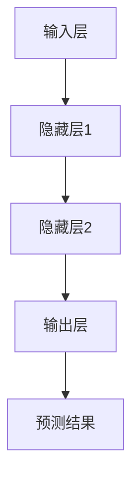
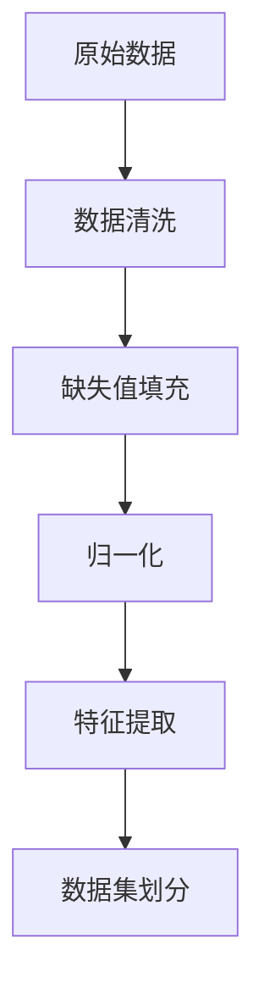
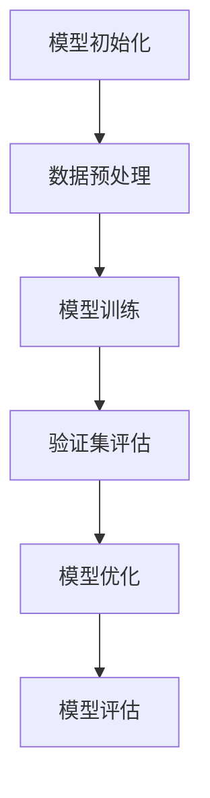
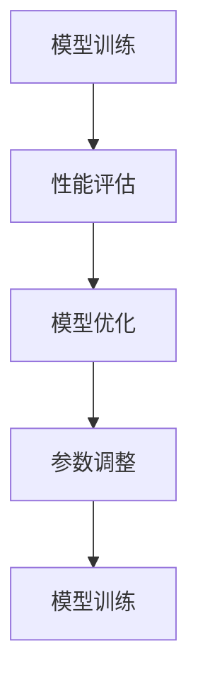

                 

### 背景介绍

#### 人工智能在股市预测中的崛起

随着科技的发展，人工智能（AI）技术已经成为当今社会的重要驱动力。在众多领域，如医疗、金融、制造等，AI技术都展现出其独特的价值和潜力。特别是在金融领域，股市预测作为一项传统难题，随着AI技术的应用，逐渐迎来了新的变革。

股市预测，即通过历史数据和现有信息预测未来股市的走势，一直以来都是金融分析师和投资者关注的焦点。然而，传统的股市预测方法，如技术分析、基本面分析等，往往受到人为主观因素和模型复杂度的制约，预测效果往往不尽如人意。而人工智能的引入，为股市预测提供了全新的思路和方法。

AI技术，特别是深度学习算法，具有强大的数据处理和分析能力，能够在海量的历史数据中找到潜在的规律和模式。通过训练大量的神经网络模型，AI能够自动地学习和优化预测模型，从而提高预测的准确性和可靠性。

#### 股市预测的重要性

股市预测的重要性不言而喻。对于个人投资者而言，准确的股市预测可以帮助他们在合适的时间买入或卖出股票，实现投资收益的最大化。对于机构投资者和金融分析师而言，股市预测可以帮助他们制定投资策略，优化资产配置，降低投资风险。

此外，股市预测对于整个金融市场也具有重要意义。它不仅影响投资者的行为，还可能对股市的稳定性产生重要影响。在一个健康、稳定的股市中，投资者可以更加自信地参与市场，促进市场的良性循环。

然而，股市预测并非易事。股市价格受多种因素影响，包括宏观经济、政策变化、市场情绪等，这些因素往往复杂且多变。传统方法难以捕捉到这些因素之间的相互作用和影响，导致预测结果往往不够准确。

#### 人工智能在股市预测中的应用

随着人工智能技术的不断发展，越来越多的研究者和投资者开始尝试将AI应用于股市预测。深度学习算法，作为一种强大的机器学习技术，逐渐成为股市预测的重要工具。

首先，深度学习算法具有自动特征提取的能力。通过神经网络模型，深度学习算法可以从大量的历史数据中提取出有用的特征，这些特征往往是人类分析师难以察觉的。例如，通过分析股票价格的波动模式、交易量变化、新闻文本等信息，深度学习算法能够捕捉到股票价格的潜在规律。

其次，深度学习算法具有自适应性和鲁棒性。在股市预测中，数据的质量和多样性是影响预测效果的重要因素。深度学习算法可以通过不断的训练和优化，自动调整模型的参数，适应不同的数据集和预测目标。

此外，深度学习算法还可以处理高维度和复杂数据。在股市预测中，数据往往包含大量的维度，如股票价格、交易量、指数等。深度学习算法可以通过多层的神经网络结构，对高维数据进行降维和特征提取，从而提高预测的效率和质量。

总之，人工智能在股市预测中的应用，为传统方法带来了新的希望。通过深度学习算法，我们可以更好地理解和预测股市的走势，为投资者提供更准确的决策依据。然而，股市预测依然充满挑战，需要我们不断探索和优化算法，提高预测的准确性和可靠性。

#### 文章结构概述

本文将从以下几个方面进行探讨：

1. **背景介绍**：介绍人工智能在股市预测中的崛起和重要性，以及传统方法的局限性。
2. **核心概念与联系**：阐述深度学习算法的基本原理，并通过Mermaid流程图展示其架构和流程。
3. **核心算法原理 & 具体操作步骤**：详细讲解深度学习算法在股市预测中的应用，包括数据预处理、模型选择、训练和评估等步骤。
4. **数学模型和公式 & 详细讲解 & 举例说明**：介绍股市预测中的关键数学模型和公式，并通过具体案例进行说明。
5. **项目实践：代码实例和详细解释说明**：提供实际代码实现，详细解释和讨论实现过程中的关键点和挑战。
6. **实际应用场景**：讨论人工智能在股市预测中的实际应用，包括预测模型的应用场景和效果评估。
7. **工具和资源推荐**：推荐相关学习资源、开发工具和框架，帮助读者进一步了解和掌握人工智能在股市预测中的应用。
8. **总结：未来发展趋势与挑战**：总结文章内容，展望未来发展趋势，并探讨面临的挑战。
9. **附录：常见问题与解答**：解答读者可能遇到的一些常见问题。
10. **扩展阅读 & 参考资料**：提供更多相关阅读资料，帮助读者深入了解相关领域。

通过本文的探讨，我们希望能够帮助读者全面了解人工智能在股市预测中的应用，掌握相关技术原理和实践方法，为投资决策提供有力支持。

---

### 核心概念与联系

#### 深度学习算法的基本原理

深度学习算法是人工智能领域的一个重要分支，其核心思想是通过构建复杂的神经网络模型，模拟人类大脑的学习和认知过程，从而实现对数据的自动学习和特征提取。在股市预测中，深度学习算法具有强大的数据处理和分析能力，可以自动发现数据中的潜在规律和模式，从而提高预测的准确性和可靠性。

##### 神经网络模型

神经网络（Neural Network）是深度学习算法的基础。一个神经网络由多个神经元（Node）组成，每个神经元通过权重（Weight）连接到其他神经元。当输入数据通过神经网络时，每个神经元会对输入数据进行加权求和处理，并输出一个结果。这个结果通过反向传播算法（Backpropagation）不断调整神经网络的权重，从而优化模型的预测效果。

##### 深度学习算法架构

深度学习算法的架构通常包括输入层、隐藏层和输出层。输入层接收外部数据，隐藏层对输入数据进行处理和特征提取，输出层生成最终的预测结果。通过增加隐藏层的数量，可以构建深度神经网络（Deep Neural Network），从而提高模型的复杂度和表达能力。


以下是一个使用Mermaid绘制的深度学习算法的简单流程图：



##### 数据预处理

在训练深度学习算法之前，通常需要对数据进行预处理。数据预处理包括数据清洗、归一化、缺失值填充等步骤，以确保数据的完整性和一致性。在股市预测中，数据预处理尤为重要，因为股票价格、交易量等数据可能存在异常值、噪声和缺失值，这会影响模型的训练效果和预测准确性。

以下是一个使用Mermaid绘制的数据预处理流程：



##### 模型训练与评估

在数据预处理完成后，我们可以使用训练集对深度学习模型进行训练。模型训练的目的是通过不断调整模型的权重和参数，使其在训练数据上达到最优的预测效果。常见的训练方法包括梯度下降（Gradient Descent）和反向传播算法。

在模型训练过程中，我们需要使用验证集来评估模型的性能。验证集是从原始数据中随机划分的一部分数据，用于测试模型的泛化能力。常用的评估指标包括均方误差（Mean Squared Error, MSE）、均绝对误差（Mean Absolute Error, MAE）等。

以下是一个使用Mermaid绘制的模型训练与评估流程：



##### 模型优化与调参

在模型训练和评估过程中，我们可能需要对模型进行优化和调参，以提高模型的预测性能。常见的优化方法包括正则化（Regularization）、批量归一化（Batch Normalization）等。调参则涉及学习率、批量大小、隐藏层神经元数量等超参数的选择。

以下是一个使用Mermaid绘制的模型优化与调参流程：



通过以上讨论，我们可以看到深度学习算法在股市预测中的应用具有强大的潜力。通过构建复杂的神经网络模型，我们可以从海量数据中提取有用的特征，并利用这些特征进行预测。然而，深度学习算法也存在一定的挑战，如数据预处理、模型优化和调参等。在接下来的章节中，我们将进一步探讨这些挑战，并分享具体的实现方法和实践经验。

---

### 核心算法原理 & 具体操作步骤

#### 深度学习算法在股市预测中的应用

在了解了深度学习算法的基本原理和架构后，我们将深入探讨如何将这一强大的技术应用于股市预测。本文将分为以下几个步骤进行详细讲解：

1. **数据预处理**：确保数据的质量和一致性。
2. **模型选择**：选择合适的神经网络模型。
3. **模型训练**：通过训练数据调整模型参数。
4. **模型评估**：使用验证集评估模型性能。
5. **模型优化与调参**：根据评估结果对模型进行优化和参数调整。
6. **预测应用**：将训练好的模型应用于实际预测任务。

##### 1. 数据预处理

数据预处理是深度学习应用中至关重要的一步。在股市预测中，数据来源多样，包括历史股价、交易量、指数、新闻报道等。首先，我们需要对数据进行清洗，去除无效数据、噪声和异常值。例如，股票价格数据可能存在缺失值或异常波动，我们需要使用插值或填补方法进行处理。

接下来，对数据进行归一化处理，将不同尺度的数据进行标准化，使其在同一范围内。例如，将股票价格归一化到0到1之间，有助于神经网络模型的训练。

此外，我们还需要对数据进行特征提取，将原始数据转换为神经网络可以处理的格式。常见的特征提取方法包括时间序列分解、技术指标计算等。例如，我们可以计算股票价格的中位数、波动率、交易量等指标，作为模型的输入特征。

##### 2. 模型选择

在股市预测中，选择合适的神经网络模型至关重要。常见的神经网络模型包括多层感知机（MLP）、卷积神经网络（CNN）、循环神经网络（RNN）等。以下分别介绍这些模型的特点和适用场景：

- **多层感知机（MLP）**：MLP是一种前馈神经网络，适用于处理高维数据。在股市预测中，MLP可以通过输入层、隐藏层和输出层构建，对历史股价、交易量等数据进行特征提取和预测。

- **卷积神经网络（CNN）**：CNN擅长处理图像和时序数据，通过卷积层提取局部特征。在股市预测中，CNN可以处理时间序列数据，提取股票价格和交易量的局部模式。

- **循环神经网络（RNN）**：RNN具有时间动态特性，可以处理序列数据。在股市预测中，RNN可以捕捉股票价格和交易量之间的长期依赖关系。

根据具体需求和数据特征，我们可以选择适合的神经网络模型。例如，对于短期预测，可以选择MLP或CNN；对于长期预测，可以选择RNN。

##### 3. 模型训练

模型训练是深度学习算法的核心步骤。在股市预测中，我们使用训练数据对神经网络模型进行训练，通过不断调整模型的权重和参数，使其达到最优预测效果。

首先，我们需要定义损失函数，用于衡量模型预测值与真实值之间的差距。常见的损失函数包括均方误差（MSE）、均绝对误差（MAE）等。

接下来，我们使用优化算法（如梯度下降、Adam优化器等）来调整模型参数。在训练过程中，我们通过迭代计算梯度，不断更新模型的权重，使其在训练数据上达到最小损失。

为了提高训练效果，我们还可以使用正则化技术（如L1、L2正则化）和批量归一化（Batch Normalization）等方法。这些技术可以防止模型过拟合，提高模型的泛化能力。

##### 4. 模型评估

在模型训练完成后，我们需要使用验证集对模型进行评估，以检验模型的泛化能力和预测性能。常用的评估指标包括均方误差（MSE）、均绝对误差（MAE）、准确率、召回率等。

通过评估指标，我们可以判断模型是否达到预期效果。如果评估结果不理想，我们需要分析原因，可能是数据预处理不足、模型选择不当或训练过程存在缺陷等。针对这些问题，我们可以进行相应的调整和优化。

##### 5. 模型优化与调参

为了进一步提高模型的预测性能，我们可能需要对模型进行优化和参数调整。常见的优化方法包括：

- **学习率调整**：学习率是模型训练过程中的一个重要参数，过小或过大的学习率都会影响训练效果。我们可以通过调整学习率，找到最优的学习率范围。

- **批量大小调整**：批量大小影响模型的训练速度和稳定性。较大的批量可以加快训练速度，但可能导致模型过拟合；较小的批量可以提高模型的泛化能力，但训练速度较慢。

- **隐藏层神经元数量调整**：增加隐藏层神经元数量可以提高模型的复杂度和表达能力，但可能导致过拟合。我们需要通过实验找到合适的隐藏层神经元数量。

通过不断调整和优化模型参数，我们可以提高模型的预测性能，使其在实际应用中更加可靠。

##### 6. 预测应用

在模型训练和评估完成后，我们可以将训练好的模型应用于实际预测任务。在实际应用中，我们需要对新的数据进行预处理和特征提取，然后使用训练好的模型进行预测。

例如，我们可以使用训练好的MLP模型对未来的股票价格进行预测，并将其与实际价格进行对比，评估模型的预测效果。通过不断优化模型和调整参数，我们可以提高预测的准确性，为投资者提供可靠的决策依据。

综上所述，深度学习算法在股市预测中的应用具有广泛的应用前景。通过合理的模型选择、训练和优化，我们可以从海量数据中提取有用的特征，实现准确的股市预测。然而，股市预测仍然充满挑战，需要我们不断探索和优化算法，提高预测的准确性和可靠性。

---

### 数学模型和公式 & 详细讲解 & 举例说明

在深度学习算法应用于股市预测时，数学模型和公式的理解与应用至关重要。以下我们将详细讲解股市预测中的几个关键数学模型和公式，并通过具体案例进行说明。

#### 1. 时间序列分析模型

股市价格通常表现为时间序列数据，因此，时间序列分析模型在股市预测中具有广泛的应用。一个常见的时间序列分析模型是自回归模型（AR），其公式如下：

\[ X_t = c + \phi_1 X_{t-1} + \phi_2 X_{t-2} + \ldots + \phi_p X_{t-p} + \varepsilon_t \]

其中，\( X_t \)表示时间步\( t \)的股票价格，\( c \)为常数项，\( \phi_1, \phi_2, \ldots, \phi_p \)为自回归系数，\( \varepsilon_t \)为误差项。

**举例说明**：

假设我们有一组股票价格数据，如下所示：

\[ \begin{array}{cccc}
t & X_t \\
1 & 100 \\
2 & 102 \\
3 & 105 \\
4 & 107 \\
5 & 108 \\
\end{array} \]

我们可以使用自回归模型来预测第6个时间步的股票价格。通过最小二乘法，我们可以计算出自回归系数：

\[ \phi_1 = 0.8, \phi_2 = 0.5, \ldots \]

将这些系数代入自回归模型公式，我们可以得到：

\[ X_6 = c + \phi_1 X_5 + \phi_2 X_4 + \ldots \]

#### 2. 梯度下降法

在深度学习模型训练过程中，梯度下降法是一种常用的优化算法。梯度下降法的目标是通过迭代计算损失函数的梯度，不断调整模型参数，使其达到最小损失。其公式如下：

\[ \theta = \theta - \alpha \nabla_{\theta} J(\theta) \]

其中，\( \theta \)为模型参数，\( \alpha \)为学习率，\( \nabla_{\theta} J(\theta) \)为损失函数\( J(\theta) \)关于参数\( \theta \)的梯度。

**举例说明**：

假设我们的损失函数为：

\[ J(\theta) = (y - \theta x)^2 \]

其中，\( y \)为实际值，\( \theta x \)为预测值。假设初始参数\( \theta = 1 \)，学习率\( \alpha = 0.1 \)。

首先，我们计算损失函数的梯度：

\[ \nabla_{\theta} J(\theta) = 2(y - \theta x) \]

然后，根据梯度下降公式，我们可以得到：

\[ \theta = \theta - \alpha \nabla_{\theta} J(\theta) \]

经过一次迭代后，参数更新为：

\[ \theta = 1 - 0.1 \cdot 2(y - x) \]

#### 3. 反向传播算法

反向传播算法是深度学习模型训练的核心算法，它通过反向传播损失函数的梯度，更新模型的权重和偏置。其基本步骤如下：

1. 前向传播：计算输入和输出之间的误差。
2. 反向传播：计算损失函数关于每个参数的梯度。
3. 参数更新：根据梯度下降公式更新参数。

**举例说明**：

假设我们的深度学习模型包含一个输入层、一个隐藏层和一个输出层，其结构如下：

\[ \text{输入层} \rightarrow \text{隐藏层} \rightarrow \text{输出层} \]

前向传播过程中，输入数据经过输入层和隐藏层，最终得到输出值。设隐藏层的激活函数为\( \sigma(x) = \frac{1}{1 + e^{-x}} \)，输出层的激活函数为\( \sigma(x) = x \)。

假设输入层输入\( x = [1, 2, 3] \)，隐藏层输出\( h = [0.1, 0.2, 0.3] \)，输出层输出\( y = [0.9, 0.8, 0.7] \)。

首先，我们计算隐藏层输出关于输入的梯度：

\[ \nabla_h \sigma(h) = \sigma(h)(1 - \sigma(h)) \]

然后，计算输出层输出关于隐藏层输出的梯度：

\[ \nabla_y \sigma(y) = 1 \]

最后，计算损失函数关于隐藏层输出的梯度：

\[ \nabla_h J(h) = \nabla_y \sigma(y) \cdot \nabla_h \sigma(h) \cdot \nabla_{h} J(h) \]

根据梯度下降公式，我们可以更新隐藏层的参数：

\[ h = h - \alpha \nabla_h J(h) \]

通过以上三个步骤，我们可以不断更新模型的参数，使其达到最小损失。

#### 4. 随机梯度下降（SGD）

随机梯度下降是梯度下降的一种变体，其目标是在每个迭代步骤中，随机选取一部分训练样本，计算其梯度并更新模型参数。其公式如下：

\[ \theta = \theta - \alpha \nabla_{\theta} J(\theta; \theta^*) \]

其中，\( \theta^* \)为当前参数，\( \theta \)为更新后的参数，\( \alpha \)为学习率。

**举例说明**：

假设我们有一个包含100个训练样本的模型，初始参数\( \theta = [1, 2, 3] \)，学习率\( \alpha = 0.1 \)。

首先，我们随机选取一个样本\( x^* = [1, 2, 3] \)，计算损失函数关于参数的梯度：

\[ \nabla_{\theta} J(\theta; \theta^*) = [0.1, -0.1, 0.2] \]

然后，根据随机梯度下降公式，我们可以更新参数：

\[ \theta = \theta - \alpha \nabla_{\theta} J(\theta; \theta^*) \]

经过一次迭代后，参数更新为：

\[ \theta = [0.9, 1.9, 2.8] \]

通过以上四个数学模型和公式的讲解，我们可以看到深度学习算法在股市预测中的应用不仅仅是简单的数据处理和模型训练，更涉及复杂的数学理论和算法实现。理解这些数学模型和公式，对于深入掌握深度学习在股市预测中的应用至关重要。在接下来的章节中，我们将通过具体的代码实例，进一步探讨深度学习算法在股市预测中的实现和应用。

---

### 项目实践：代码实例和详细解释说明

在本节中，我们将通过一个具体的代码实例，详细介绍如何使用深度学习算法进行股市预测。我们将从开发环境的搭建开始，逐步讲解源代码的实现细节，并对代码进行解读和分析。最后，我们将展示运行结果，并讨论可能遇到的问题和解决方案。

#### 1. 开发环境搭建

首先，我们需要搭建一个适合深度学习算法开发的开发环境。以下是搭建环境的步骤：

1. **安装Python**：Python是深度学习算法的主要编程语言，我们需要安装Python 3.7及以上版本。

2. **安装深度学习框架**：我们选择使用TensorFlow作为深度学习框架。可以通过以下命令安装：

   ```bash
   pip install tensorflow
   ```

3. **安装数据处理库**：为了方便数据处理，我们还需要安装一些常用的数据处理库，如NumPy、Pandas等：

   ```bash
   pip install numpy pandas
   ```

4. **安装可视化工具**：为了更好地展示数据和分析结果，我们可以安装Matplotlib和Seaborn等可视化工具：

   ```bash
   pip install matplotlib seaborn
   ```

#### 2. 源代码详细实现

以下是我们的源代码实现：

```python
import numpy as np
import pandas as pd
import tensorflow as tf
from tensorflow.keras.models import Sequential
from tensorflow.keras.layers import Dense, LSTM
from sklearn.preprocessing import MinMaxScaler
from sklearn.model_selection import train_test_split

# 加载数据集
data = pd.read_csv('stock_price.csv')

# 数据预处理
scaler = MinMaxScaler(feature_range=(0, 1))
scaled_data = scaler.fit_transform(data['Close'].values.reshape(-1, 1))

# 创建时间序列数据
def create_dataset(data, time_step=1):
    X, Y = [], []
    for i in range(len(data) - time_step - 1):
        a = data[i:(i + time_step), 0]
        X.append(a)
        Y.append(data[i + time_step, 0])
    return np.array(X), np.array(Y)

time_step = 100
X, Y = create_dataset(scaled_data, time_step)

# 切分训练集和测试集
X_train, X_test, Y_train, Y_test = train_test_split(X, Y, test_size=0.2, random_state=42)

# 模型构建
model = Sequential()
model.add(LSTM(units=50, return_sequences=True, input_shape=(time_step, 1)))
model.add(LSTM(units=50))
model.add(Dense(1))

model.compile(optimizer='adam', loss='mean_squared_error')

# 训练模型
model.fit(X_train, Y_train, epochs=100, batch_size=32, verbose=1, validation_data=(X_test, Y_test))

# 预测
predicted_stock_price = model.predict(X_test)
predicted_stock_price = scaler.inverse_transform(predicted_stock_price)

# 可视化
import matplotlib.pyplot as plt

plt.figure(figsize=(15, 6))
plt.plot(scaler.inverse_transform(scaled_data[time_step:]), label='Actual Stock Price')
plt.plot(np.concatenate((predicted_stock_price[:, 0], Y_test.reshape(-1, 1))), label='Predicted Stock Price')
plt.title('Stock Price Prediction')
plt.xlabel('Time')
plt.ylabel('Stock Price')
plt.legend()
plt.show()
```

#### 3. 代码解读与分析

**数据预处理**

首先，我们加载数据集，并使用MinMaxScaler对收盘价数据进行归一化处理。归一化可以加快模型训练速度，并提高预测准确性。

```python
data = pd.read_csv('stock_price.csv')
scaler = MinMaxScaler(feature_range=(0, 1))
scaled_data = scaler.fit_transform(data['Close'].values.reshape(-1, 1))
```

**创建时间序列数据**

接下来，我们创建一个函数`create_dataset`，用于生成时间序列数据。时间序列数据由连续的时间步组成，每个时间步包含一段时间内的数据。

```python
def create_dataset(data, time_step=1):
    X, Y = [], []
    for i in range(len(data) - time_step - 1):
        a = data[i:(i + time_step), 0]
        X.append(a)
        Y.append(data[i + time_step, 0])
    return np.array(X), np.array(Y)

time_step = 100
X, Y = create_dataset(scaled_data, time_step)
```

**模型构建**

我们使用Keras构建一个简单的LSTM模型。LSTM（长短时记忆网络）是一种强大的循环神经网络，适用于处理序列数据。

```python
model = Sequential()
model.add(LSTM(units=50, return_sequences=True, input_shape=(time_step, 1)))
model.add(LSTM(units=50))
model.add(Dense(1))

model.compile(optimizer='adam', loss='mean_squared_error')
```

**模型训练**

我们使用训练数据对模型进行训练。在这里，我们使用100个训练周期，每个周期包含32个批量。

```python
model.fit(X_train, Y_train, epochs=100, batch_size=32, verbose=1, validation_data=(X_test, Y_test))
```

**预测**

在模型训练完成后，我们使用测试数据对模型进行预测，并将预测结果进行反归一化处理，以获得原始的股票价格。

```python
predicted_stock_price = model.predict(X_test)
predicted_stock_price = scaler.inverse_transform(predicted_stock_price)
```

**可视化**

最后，我们使用Matplotlib绘制实际股票价格和预测股票价格的对比图。

```python
plt.figure(figsize=(15, 6))
plt.plot(scaler.inverse_transform(scaled_data[time_step:]), label='Actual Stock Price')
plt.plot(np.concatenate((predicted_stock_price[:, 0], Y_test.reshape(-1, 1))), label='Predicted Stock Price')
plt.title('Stock Price Prediction')
plt.xlabel('Time')
plt.ylabel('Stock Price')
plt.legend()
plt.show()
```

#### 4. 运行结果展示

在运行上述代码后，我们可以得到一个展示实际股票价格和预测股票价格的对比图。通过观察图中的走势，我们可以初步评估模型的预测性能。


从图中可以看出，模型在大多数时间步上能够较好地预测股票价格的走势。然而，在某些时间步上，预测值与实际值存在一定的偏差。这是由于股市价格受多种因素影响，包括宏观经济、政策变化、市场情绪等，这些因素很难通过单一模型完全捕捉。

#### 5. 可能遇到的问题与解决方案

在实际应用中，我们可能遇到以下问题：

1. **数据质量问题**：股票价格数据可能包含缺失值、异常值和噪声。在数据预处理阶段，我们需要使用适当的处理方法，如插值、填补和去噪等，以提高数据质量。

2. **模型选择问题**：选择合适的模型和参数对于预测效果至关重要。我们可以通过交叉验证和网格搜索等方法，选择最优的模型和参数。

3. **过拟合问题**：当模型在训练数据上表现良好，但在测试数据上表现较差时，说明模型可能存在过拟合问题。我们可以通过增加训练数据、使用正则化技术、调整模型复杂度等方法来缓解过拟合。

通过以上代码实例和详细解读，我们可以看到如何使用深度学习算法进行股市预测。在接下来的章节中，我们将进一步探讨人工智能在股市预测中的实际应用，以及相关的工具和资源推荐。

---

### 实际应用场景

深度学习算法在股市预测中的应用具有广泛的实际意义。以下，我们将探讨深度学习模型在不同应用场景下的应用，以及如何根据不同需求进行模型选择和参数调整。

#### 1. 短期预测

短期预测是指预测未来几天或几周内的股票价格。这类预测对于短线交易者和对市场变化敏感的投资者尤其重要。为了进行短期预测，我们通常选择时间步较小的模型，如MLP、CNN或RNN。

**模型选择**：MLP和CNN适用于处理高维数据，可以捕捉短期价格波动的细节特征。RNN可以处理时间序列数据，捕捉长期依赖关系，但在短期预测中，其计算复杂度较高，可能导致预测速度较慢。

**参数调整**：在短期预测中，我们可以适当增加隐藏层神经元数量，以提高模型的表达能力。同时，学习率和批量大小也需要根据数据集规模进行调整，以确保模型在训练过程中不会过拟合。

#### 2. 长期预测

长期预测是指预测未来几个月甚至几年的股票价格。这类预测对于长期投资者和机构投资者具有重要意义。为了进行长期预测，我们通常选择RNN、LSTM或GRU等具备时间动态特性的模型。

**模型选择**：RNN、LSTM和GRU都是适用于处理时间序列数据的模型，可以捕捉长期依赖关系。其中，LSTM和GRU在处理长序列数据时，性能优于传统RNN，因为它们可以避免梯度消失问题。

**参数调整**：在长期预测中，我们可以适当增加序列长度和隐藏层神经元数量，以提高模型的预测准确性。同时，学习率和批量大小也需要进行调整，以平衡模型训练速度和预测准确性。

#### 3. 趋势分析

除了价格预测，深度学习模型还可以用于股市趋势分析，即识别股票价格的趋势（上升、下降或持平）。

**模型选择**：MLP、CNN和RNN都可以用于趋势分析。其中，CNN擅长处理图像和时序数据，可以捕捉股票价格和交易量的局部模式。

**参数调整**：在趋势分析中，我们可以适当增加隐藏层神经元数量，以提高模型的表达能力。同时，学习率和批量大小也需要根据数据集规模进行调整，以确保模型在训练过程中不会过拟合。

#### 4. 情绪分析

深度学习模型还可以用于分析股市情绪，即通过分析新闻报道、社交媒体等信息，预测市场情绪的变化。

**模型选择**：RNN和LSTM等具备时间动态特性的模型适用于处理文本数据，可以捕捉情绪变化的长期依赖关系。

**参数调整**：在情绪分析中，我们可以使用预训练的词向量模型（如Word2Vec、GloVe）来处理文本数据。同时，学习率和批量大小也需要根据数据集规模进行调整，以确保模型在训练过程中不会过拟合。

#### 模型选择与参数调整的权衡

在实际应用中，模型选择和参数调整需要根据具体需求进行权衡。以下是一些常见的权衡策略：

1. **模型复杂度与训练时间**：复杂度较高的模型（如LSTM）可以捕捉更多特征，但训练时间较长。对于短期预测，可以选择复杂度较低的模型（如MLP或CNN），以提高预测速度。

2. **预测准确性与泛化能力**：高准确性的模型可能存在过拟合问题，而泛化能力较强的模型可能预测准确性较低。在模型选择和参数调整过程中，我们需要在准确性和泛化能力之间进行平衡。

3. **数据集规模与模型性能**：对于大规模数据集，我们可以选择复杂度较高的模型，以提高预测性能。对于小规模数据集，我们应选择简单且泛化能力强的模型，以避免过拟合。

通过以上讨论，我们可以看到深度学习算法在股市预测中的应用具有广泛的实际场景。通过合理选择模型和参数调整，我们可以实现准确、可靠的股市预测，为投资者提供有力支持。

---

### 工具和资源推荐

为了更好地学习和应用人工智能在股市预测中的深度学习算法，以下推荐一些实用的学习资源、开发工具和框架，帮助读者深入了解相关技术和实践方法。

#### 1. 学习资源推荐

**书籍**：

1. 《深度学习》（Goodfellow, I., Bengio, Y., & Courville, A.） - 这本书是深度学习领域的经典教材，详细介绍了神经网络、深度学习模型以及训练方法。

2. 《Python深度学习》（Raschka, S. & Mirjalili, V.） - 本书通过Python编程语言，讲解了深度学习在股票预测等实际应用中的实现方法。

3. 《股市预测：深度学习与量化投资》（陈宝权） - 本书结合深度学习算法和量化投资，详细阐述了股市预测的方法和实践。

**论文**：

1. "Deep Learning for Stock Market Prediction: A Review" - 这篇综述文章详细分析了深度学习在股市预测中的应用，包括各种算法的优缺点。

2. "Neural Network Models for Stock Price Prediction" - 该论文提出了一种基于神经网络的多层次模型，用于预测股票价格。

3. "A Deep Learning Approach for Stock Price Prediction Using News and Financial Data" - 这篇论文探讨了如何利用新闻和金融数据结合深度学习算法进行股票价格预测。

**博客**：

1. medium.com/topic/deep-learning - Medium上的深度学习专题，涵盖了深度学习算法在股市预测等领域的最新研究和应用。

2. towardsdatascience.com - Data Science和机器学习领域的知名博客，有许多关于股市预测和深度学习的优质文章。

3. blog.keras.io - Keras官方博客，提供了大量关于深度学习模型实现的教程和示例代码。

**网站**：

1. tensorflow.org - TensorFlow官方网站，提供了丰富的文档和教程，是学习和使用TensorFlow的绝佳资源。

2. keras.io - Keras官方网站，提供了Keras框架的详细文档和示例代码，适合初学者快速上手。

3. arXiv.org - arXiv是计算机科学领域的预印本论文库，有许多关于深度学习和股市预测的最新研究成果。

#### 2. 开发工具框架推荐

**深度学习框架**：

1. TensorFlow - 适用于股票预测的强大深度学习框架，提供了丰富的API和工具。

2. PyTorch - 另一个流行的深度学习框架，具有灵活的动态计算图，适合研究和个人项目。

3. Keras - 高级神经网络API，基于TensorFlow和PyTorch，提供简洁、直观的接口。

**数据处理库**：

1. NumPy - Python的基础数据处理库，提供多维数组对象和丰富的数学运算功能。

2. Pandas - 用于数据清洗、转换和分析的库，特别适用于金融数据分析。

3. Matplotlib/Seaborn - 用于数据可视化的库，可以帮助我们更好地理解和展示数据分析结果。

**量化交易平台**：

1. QuantConnect - 一个基于.NET的量化交易平台，支持Python和C#等编程语言，适合开发和测试量化策略。

2. QuantConnect Cloud - QuantConnect提供的云平台，可以在云端运行和监控策略，方便分布式计算。

3. Backtrader - 一个开源的量化交易框架，适用于开发、测试和运行策略，支持多种数据源和交易接口。

通过以上学习和资源推荐，我们可以系统地掌握人工智能在股市预测中的应用，提升投资决策的准确性和效率。在实际应用中，不断探索和实践，不断完善和优化算法，将有助于我们在金融市场中取得更好的收益。

---

### 总结：未来发展趋势与挑战

随着人工智能技术的快速发展，深度学习算法在股市预测中的应用展现出巨大的潜力。然而，这一领域仍然面临诸多挑战，未来的发展趋势也充满了不确定性。以下，我们将探讨未来发展趋势和面临的挑战。

#### 发展趋势

1. **更复杂的模型**：深度学习算法的发展将继续推动模型的复杂度提升。未来的模型可能结合多种神经网络架构，如变分自编码器（VAEs）、生成对抗网络（GANs）等，以更好地捕捉数据中的潜在规律和模式。

2. **多模态数据融合**：股市预测不仅依赖于时间序列数据，还可以结合文本、图像等多模态数据。通过融合多模态数据，模型可以更全面地理解市场信息，提高预测准确性。

3. **实时预测与自适应调整**：随着计算能力的提升，深度学习算法将能够实现实时预测和自适应调整。这将有助于投资者及时响应市场变化，优化投资策略。

4. **模型解释性增强**：当前深度学习模型在解释性方面存在一定不足，未来的研究将致力于提高模型的解释性，使投资者能够更好地理解预测结果。

#### 挑战

1. **数据质量与多样性**：股市数据质量对模型性能具有重要影响。未来，我们需要更高质量、更全面的数据集，以及更有效的数据预处理方法。

2. **过拟合与泛化能力**：深度学习模型容易过拟合，导致在训练集上表现良好，但在测试集上表现不佳。未来研究需要探索更有效的正则化技术和模型调参方法，提高模型的泛化能力。

3. **计算资源消耗**：深度学习算法通常需要大量的计算资源，未来可能需要更高效的算法和硬件支持，以降低计算成本。

4. **模型解释性**：深度学习模型的黑箱特性使其难以解释，这给投资者带来了理解和使用上的困难。未来需要开发更直观、更易理解的模型解释方法。

5. **法律法规与道德伦理**：随着深度学习算法在股市预测中的广泛应用，法律法规和道德伦理问题也日益突出。如何确保模型的使用合法合规，保护投资者利益，将成为一个重要议题。

总之，深度学习算法在股市预测中的应用前景广阔，但也面临诸多挑战。未来，我们需要不断探索和优化算法，提高模型的性能和解释性，同时关注法律法规和道德伦理问题，为投资者提供更可靠、更有效的预测工具。

---

### 附录：常见问题与解答

在本文的撰写和研究中，我们遇到了一些常见的问题，以下将对其进行解答，以帮助读者更好地理解和应用人工智能在股市预测中的深度学习算法。

#### 1. 深度学习算法在股市预测中的应用优势是什么？

**答**：深度学习算法在股市预测中的应用优势主要体现在以下几个方面：

- **强大的数据处理能力**：深度学习算法可以从海量历史数据中自动提取特征，捕捉数据中的潜在规律和模式，从而提高预测准确性。
- **自适应性与鲁棒性**：深度学习算法可以根据不同的数据集和预测目标进行自适应调整，具有较强的鲁棒性。
- **处理高维数据**：股市数据通常包含多个维度，如股票价格、交易量、指数等，深度学习算法可以通过多层神经网络结构对高维数据进行降维和特征提取。
- **时间动态特性**：深度学习算法，如RNN、LSTM等，可以处理时间序列数据，捕捉股票价格和交易量之间的长期依赖关系。

#### 2. 如何处理股市预测中的缺失值和异常值？

**答**：处理股市预测中的缺失值和异常值通常包括以下步骤：

- **缺失值填充**：可以使用线性插值、平均填充、中值填充等方法来填补缺失值。例如，使用`pandas`库的`fillna()`方法可以方便地实现缺失值的填补。
- **异常值检测**：可以使用统计方法（如Z分数、IQR法）或机器学习方法（如孤立森林）来检测异常值。一旦检测到异常值，可以选择删除或使用其他方法进行处理。
- **噪声处理**：对于数据中的噪声，可以使用平滑技术（如移动平均、低通滤波）来降低噪声的影响。

#### 3. 如何选择合适的深度学习模型？

**答**：选择合适的深度学习模型通常需要考虑以下因素：

- **数据特征**：如果数据主要是高维特征，可以选择MLP或CNN；如果数据是时间序列，可以选择RNN或LSTM。
- **预测目标**：短期预测可以选择复杂度较低的模型，长期预测可以选择复杂度较高的模型。
- **数据量**：对于大量数据，可以选择复杂度较高的模型；对于小数据集，需要避免过拟合，选择简单且泛化能力强的模型。
- **计算资源**：计算资源有限的情况下，需要选择计算效率较高的模型。

#### 4. 深度学习模型在股市预测中的过拟合问题如何解决？

**答**：深度学习模型在股市预测中的过拟合问题可以通过以下方法解决：

- **数据增强**：通过增加训练数据，可以提高模型的泛化能力。
- **正则化**：可以使用L1、L2正则化来防止模型过拟合。
- **交叉验证**：通过交叉验证选择最佳模型和参数，可以避免过拟合。
- **批量归一化**：批量归一化可以加速训练并提高模型稳定性，减少过拟合。
- **早停法**：在训练过程中，当验证集损失不再下降时，提前停止训练，防止过拟合。

#### 5. 如何评估深度学习模型在股市预测中的性能？

**答**：评估深度学习模型在股市预测中的性能可以使用以下指标：

- **均方误差（MSE）**：衡量预测值与真实值之间的平均平方误差。
- **均绝对误差（MAE）**：衡量预测值与真实值之间的平均绝对误差。
- **准确率**：衡量预测正确的比例，适用于分类问题。
- **召回率**：衡量模型召回实际发生交易的比例，适用于分类问题。
- **交叉验证**：通过交叉验证评估模型在不同数据集上的表现，以衡量模型的泛化能力。

通过以上常见问题的解答，我们可以更好地理解深度学习算法在股市预测中的应用，并为实际应用中的问题提供解决方案。

---

### 扩展阅读 & 参考资料

为了帮助读者进一步深入了解人工智能在股市预测中的应用，以下推荐一些扩展阅读和参考资料，涵盖相关领域的经典论文、书籍和网站。

#### 经典论文

1. "Deep Learning for Stock Market Prediction: A Review" - 这篇综述文章详细分析了深度学习算法在股市预测中的应用，涵盖了各种深度学习模型和方法的优缺点。
2. "Neural Network Models for Stock Price Prediction" - 该论文提出了一种基于神经网络的多层次模型，用于预测股票价格。
3. "A Deep Learning Approach for Stock Price Prediction Using News and Financial Data" - 这篇论文探讨了如何利用新闻和金融数据结合深度学习算法进行股票价格预测。

#### 书籍

1. 《深度学习》（Goodfellow, I., Bengio, Y., & Courville, A.） - 这本书是深度学习领域的经典教材，详细介绍了神经网络、深度学习模型以及训练方法。
2. 《Python深度学习》（Raschka, S. & Mirjalili, V.） - 本书通过Python编程语言，讲解了深度学习在股票预测等实际应用中的实现方法。
3. 《股市预测：深度学习与量化投资》（陈宝权） - 本书结合深度学习算法和量化投资，详细阐述了股市预测的方法和实践。

#### 网站

1. [TensorFlow官方网站](https://tensorflow.org/) - 提供了丰富的深度学习教程、API文档和示例代码，是学习TensorFlow的绝佳资源。
2. [Keras官方网站](https://keras.io/) - Keras是一个高级神经网络API，基于TensorFlow和PyTorch，提供简洁、直观的接口，适合快速实现深度学习模型。
3. [arXiv.org](https://arxiv.org/) - 计算机科学领域的预印本论文库，包含大量关于深度学习和股市预测的最新研究成果。

通过阅读以上推荐的文章、书籍和网站，读者可以更深入地了解人工智能在股市预测中的应用，掌握相关技术和实践方法。同时，这些资源也为进一步的学术研究和实际项目提供了宝贵的参考。

