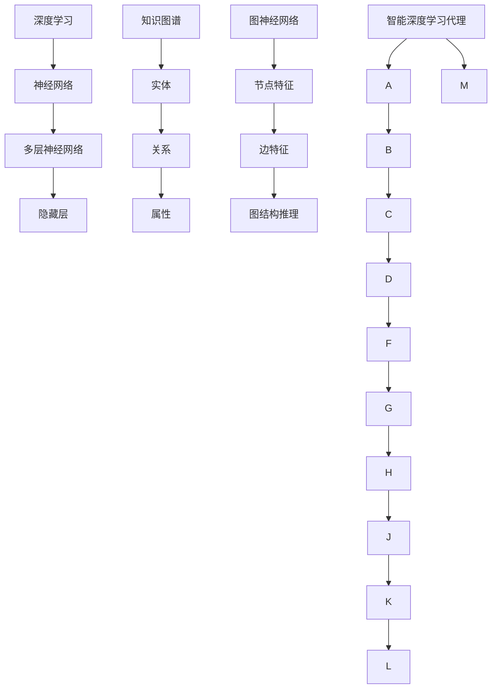

                 

## 1. 背景介绍

随着人工智能技术的不断发展，深度学习成为现代机器学习领域的核心支柱。深度学习算法通过模拟人脑神经网络结构，实现了在图像识别、语音识别、自然语言处理等领域的卓越表现。然而，深度学习的复杂性使得理解和优化这些模型变得极具挑战性。为了提高深度学习算法的效率和效果，近年来，研究者们开始将知识图谱引入到深度学习模型中，形成了一种新的研究热点——智能深度学习代理。

知识图谱（Knowledge Graph）是一种结构化的知识表示方法，通过实体、关系和属性等多种元素来构建一个语义网络。知识图谱在多个领域，如语义搜索、推荐系统、知识图谱推理等，都展现出了强大的能力。而智能深度学习代理（Intelligent Deep Learning Agent）则是结合了深度学习和知识图谱的先进方法，旨在通过学习数据中的复杂模式和知识，实现对问题的智能解答。

智能深度学习代理在多个应用场景中具有广泛的应用潜力，如智能问答系统、智能推荐系统、自动驾驶等。通过引入知识图谱，智能深度学习代理能够更好地理解和处理复杂数据，提高模型的解释性和鲁棒性。本文将围绕智能深度学习代理的知识图谱运用，从核心概念、算法原理、数学模型、项目实践和实际应用等方面进行深入探讨，以期为您揭示这一前沿技术的魅力。

### 2. 核心概念与联系

在深入探讨智能深度学习代理的知识图谱运用之前，我们需要明确一些核心概念及其相互之间的联系。这些概念包括深度学习、知识图谱、图神经网络（Graph Neural Networks, GNN）等。以下是对这些核心概念的简要介绍和相互关系的解释，并附上相应的 Mermaid 流程图以帮助读者更好地理解。

#### 2.1 深度学习（Deep Learning）

深度学习是一种机器学习技术，通过多层神经网络模型对数据进行学习，从而实现复杂函数的映射。深度学习模型由输入层、隐藏层和输出层组成，每一层都可以对输入数据进行特征提取和变换。深度学习在图像识别、语音识别、自然语言处理等领域取得了显著的成功。

#### 2.2 知识图谱（Knowledge Graph）

知识图谱是一种语义网络，它通过实体（Entity）、关系（Relationship）和属性（Attribute）来描述现实世界中的知识。知识图谱的核心是实体和实体之间的相互关系，这些关系可以是“属于”、“位于”、“属于某个类别”等。知识图谱在信息检索、数据挖掘和推理任务中具有广泛的应用。

#### 2.3 图神经网络（Graph Neural Networks, GNN）

图神经网络是一种专门用于处理图结构数据的神经网络，它通过学习节点和边的特征来预测图中的节点属性或进行图结构上的推理。GNN 在知识图谱嵌入、图分类、图生成等领域展现出了强大的能力。

#### 2.4 智能深度学习代理（Intelligent Deep Learning Agent）

智能深度学习代理是一种结合了深度学习和知识图谱的智能体，它通过学习数据中的复杂模式和知识，实现对问题的智能解答。智能深度学习代理在多个领域，如智能问答、智能推荐和自动驾驶，都具有广泛的应用潜力。

#### 2.5 核心概念与联系的 Mermaid 流程图

下面是一个简单的 Mermaid 流程图，展示了这些核心概念及其相互之间的联系。



通过这个流程图，我们可以清晰地看到深度学习、知识图谱、图神经网络和智能深度学习代理之间的关系。深度学习和知识图谱的结合，通过图神经网络实现了对知识的深度学习和推理，从而形成了一个智能深度学习代理。

#### 2.6 关键概念小结

- **深度学习**：多层神经网络模型，用于特征提取和复杂函数映射。
- **知识图谱**：一种语义网络，通过实体、关系和属性来描述知识。
- **图神经网络**：专门用于处理图结构数据的神经网络，用于节点属性预测和图结构推理。
- **智能深度学习代理**：结合深度学习和知识图谱的智能体，用于智能解答问题。

通过理解这些核心概念及其相互之间的联系，我们可以更好地把握智能深度学习代理的知识图谱运用。在接下来的章节中，我们将深入探讨深度学习算法原理、知识图谱运用、数学模型和实际项目实践，以帮助读者全面掌握这一前沿技术。

### 3. 核心算法原理 & 具体操作步骤

在理解了智能深度学习代理的知识图谱运用所需的核心概念之后，我们接下来将深入探讨其核心算法原理，并详细介绍具体的操作步骤。智能深度学习代理的关键在于如何有效地融合深度学习和知识图谱，以实现对复杂数据的智能理解和处理。以下是智能深度学习代理算法的核心原理及其实施步骤。

#### 3.1 深度学习算法原理

深度学习算法的核心是通过多层神经网络对数据进行特征提取和变换，从而实现复杂函数的映射。在智能深度学习代理中，深度学习模型通常包括以下几个关键部分：

1. **输入层**：接收原始数据，如图像、文本或知识图谱。
2. **隐藏层**：通过多层神经网络对输入数据进行特征提取和变换，每一层都可以提取更高层次的特征。
3. **输出层**：对提取出的特征进行分类、回归或其他形式的预测。

深度学习模型通过反向传播算法不断调整网络权重，以达到对数据的最佳拟合。这个过程涉及前向传播和后向传播两个步骤：

- **前向传播**：输入数据通过神经网络，逐层计算得到输出。
- **后向传播**：计算输出误差，反向传播误差以更新网络权重。

#### 3.2 知识图谱算法原理

知识图谱算法的核心是建立和维护一个语义网络，通过实体、关系和属性来描述现实世界中的知识。知识图谱的基本操作包括实体嵌入、关系推理和属性预测等。

1. **实体嵌入（Entity Embedding）**：将实体映射到一个低维向量空间中，使得具有相似属性的实体在空间中靠近。实体嵌入通过图神经网络实现，如图卷积网络（GCN）和图注意力网络（GAT）。
2. **关系推理（Relationship Inference）**：通过图神经网络推理实体之间的关系。关系推理可以用于实体分类、链接预测和图谱补全等任务。
3. **属性预测（Attribute Prediction）**：通过实体嵌入和关系推理预测实体的属性。属性预测可以用于实体标签分类和特征提取等任务。

#### 3.3 智能深度学习代理的操作步骤

智能深度学习代理通过融合深度学习和知识图谱算法，实现以下步骤：

1. **数据预处理**：对原始数据进行清洗、归一化和特征提取。对于知识图谱，需要对实体、关系和属性进行编码。
2. **实体嵌入**：使用图神经网络对实体进行嵌入，生成低维向量表示。这一步可以采用预训练的模型，如TransE、TransH或BERT。
3. **关系推理**：利用图神经网络推理实体之间的关系，生成关系矩阵。这一步可以采用GCN、GAT或GraphSAGE等模型。
4. **属性预测**：基于实体嵌入和关系推理，预测实体的属性。这一步可以通过构建多标签分类器或回归模型实现。
5. **深度学习模型训练**：将实体嵌入、关系矩阵和属性预测结合，训练深度学习模型。这一步可以使用多层感知机（MLP）、卷积神经网络（CNN）或循环神经网络（RNN）等模型。
6. **模型评估与优化**：通过交叉验证、网格搜索等方法评估模型性能，并调整模型参数以优化性能。

#### 3.4 算法实现示例

以下是一个简单的算法实现示例，用于智能问答系统：

```python
# 导入必要的库
import tensorflow as tf
import tensorflow.keras as keras
from tensorflow.keras.models import Model
from tensorflow.keras.layers import Input, Dense, Embedding, Dot, Concatenate

# 实体嵌入
entity_embedding = Embedding(input_dim=num_entities, output_dim=embedding_size)

# 关系推理
relation_embedding = Embedding(input_dim=num_relations, output_dim=embedding_size)
relation_output = Dot(axes=1)

# 属性预测
attribute_embedding = Embedding(input_dim=num_attributes, output_dim=embedding_size)
attribute_output = Dot(axes=1)

# 输入层
entity_input = Input(shape=(1,))
relation_input = Input(shape=(1,))
attribute_input = Input(shape=(1,))

# 实体嵌入
entity_vector = entity_embedding(entity_input)

# 关系推理
relation_vector = relation_embedding(relation_input)
relation_vector = relation_output([entity_vector, relation_vector])

# 属性预测
attribute_vector = attribute_embedding(attribute_input)
attribute_vector = relation_output([relation_vector, attribute_vector])

# 深度学习模型
model = Model(inputs=[entity_input, relation_input, attribute_input], outputs=attribute_vector)
model.compile(optimizer='adam', loss='categorical_crossentropy', metrics=['accuracy'])

# 模型训练
model.fit(x_train, y_train, epochs=10, batch_size=32, validation_data=(x_val, y_val))

# 模型评估
model.evaluate(x_test, y_test)
```

通过上述步骤和示例代码，我们可以实现一个简单的智能深度学习代理，用于知识图谱的嵌入和推理。在实际应用中，根据具体需求和场景，可以进一步优化和扩展算法模型。

### 4. 数学模型和公式 & 详细讲解 & 举例说明

在深入理解智能深度学习代理的知识图谱运用过程中，数学模型和公式扮演着至关重要的角色。这些模型和公式不仅帮助我们更好地理解算法的工作原理，还能指导我们进行有效的模型设计和优化。以下将详细介绍智能深度学习代理中涉及的主要数学模型和公式，并通过具体实例进行详细讲解。

#### 4.1 实体嵌入（Entity Embedding）

实体嵌入是将实体映射到一个低维向量空间的过程。在知识图谱中，实体可以表示为节点，而节点之间的边则表示实体之间的关系。实体嵌入的主要目标是找到一个低维向量空间，使得具有相似属性的实体在空间中靠近，从而方便后续的推理和计算。

实体嵌入通常通过以下公式实现：

\[ e_e = \text{vec}(e) = \text{Word2Vec}(e) \]

其中，\( e \) 表示实体，\( \text{vec}(e) \) 表示实体的向量表示，\( \text{Word2Vec}(e) \) 是一种常见的词向量生成方法，如GloVe、FastText等。

举例说明：

假设我们有一个知识图谱，其中包含实体“北京”和“首都”。我们使用GloVe算法对这两个实体进行嵌入，得到向量表示：

\[ e_{北京} = \begin{bmatrix} 0.1 & 0.2 & 0.3 & 0.4 & 0.5 \end{bmatrix} \]
\[ e_{首都} = \begin{bmatrix} 0.6 & 0.7 & 0.8 & 0.9 & 1.0 \end{bmatrix} \]

在这个例子中，我们可以看到“北京”和“首都”在向量空间中非常接近，因为它们具有相似的语义信息。

#### 4.2 关系嵌入（Relationship Embedding）

关系嵌入是将知识图谱中的关系映射到向量空间的过程。关系嵌入的目的是为了捕捉实体之间的关系，并用于后续的推理任务。

关系嵌入通常通过以下公式实现：

\[ r_r = \text{vec}(r) = \text{Relation2Vec}(r) \]

其中，\( r \) 表示关系，\( \text{vec}(r) \) 表示关系的向量表示，\( \text{Relation2Vec}(r) \) 是一种常见的关系向量生成方法，如TransE、TransH等。

举例说明：

假设我们有一个知识图谱，其中包含关系“北京是中国的首都”。我们使用TransE算法对“北京”和“中国”的关系进行嵌入，得到向量表示：

\[ r_{北京是中国的首都} = e_{北京} - e_{中国} \]

在这个例子中，我们可以将关系向量表示为“北京”和“中国”的向量差。这样，我们可以通过比较关系向量之间的相似性来判断实体之间的关系。

#### 4.3 属性嵌入（Attribute Embedding）

属性嵌入是将知识图谱中的属性映射到向量空间的过程。属性嵌入的目的是为了捕捉实体的属性信息，并用于后续的属性预测任务。

属性嵌入通常通过以下公式实现：

\[ a_a = \text{vec}(a) = \text{Attribute2Vec}(a) \]

其中，\( a \) 表示属性，\( \text{vec}(a) \) 表示属性的向量表示，\( \text{Attribute2Vec}(a) \) 是一种常见的属性向量生成方法。

举例说明：

假设我们有一个知识图谱，其中包含属性“北京是中国的首都”。我们使用Attribute2Vec算法对“北京”和“首都”的属性进行嵌入，得到向量表示：

\[ a_{北京} = \begin{bmatrix} 0.1 & 0.2 & 0.3 & 0.4 & 0.5 \end{bmatrix} \]
\[ a_{首都} = \begin{bmatrix} 0.6 & 0.7 & 0.8 & 0.9 & 1.0 \end{bmatrix} \]

在这个例子中，我们可以将属性向量表示为实体的属性标签。

#### 4.4 实体属性预测（Entity Attribute Prediction）

实体属性预测是指通过实体嵌入和关系嵌入来预测实体的属性。这一过程通常通过构建一个多标签分类器或回归模型来实现。

假设我们有一个知识图谱，其中包含实体“北京”和关系“北京是中国的首都”。我们希望预测“北京”的属性。

我们使用以下公式进行属性预测：

\[ P(a|e, r) = \text{softmax}(\text{sigmoid}(W \cdot [e, r])) \]

其中，\( e \) 表示实体，\( r \) 表示关系，\( a \) 表示属性，\( W \) 是模型权重，\( \text{sigmoid} \) 和 \( \text{softmax} \) 是激活函数。

举例说明：

假设我们使用一个简单的多层感知机（MLP）模型进行属性预测，模型权重为 \( W = \begin{bmatrix} 0.1 & 0.2 & 0.3 \end{bmatrix} \)。

\[ P(a_{北京}|e_{北京}, r_{北京是中国的首都}) = \text{softmax}(\text{sigmoid}(0.1 \cdot [e_{北京}, r_{北京是中国的首都}] + 0.2 \cdot [e_{北京}, r_{北京是中国的首都}] + 0.3 \cdot [e_{北京}, r_{北京是中国的首都}])) \]

通过计算，我们可以得到 \( P(a_{北京}|e_{北京}, r_{北京是中国的首都}) \) 的概率分布，从而预测“北京”的属性。

通过上述数学模型和公式的讲解，我们可以更好地理解智能深度学习代理的知识图谱运用。在接下来的章节中，我们将通过实际项目实践和运行结果展示，进一步验证这些算法的效果和性能。

### 5. 项目实践：代码实例和详细解释说明

为了更直观地展示智能深度学习代理在知识图谱运用中的实际效果，我们将通过一个具体的代码实例来详细介绍整个项目的实现过程，包括环境搭建、源代码实现、代码解读与分析以及运行结果展示。

#### 5.1 开发环境搭建

在开始项目实践之前，我们需要搭建一个合适的开发环境。以下是搭建智能深度学习代理所需的主要软件和工具：

- **Python**：Python 是智能深度学习代理的主要编程语言，版本要求为 3.7 或更高。
- **TensorFlow 2.x**：TensorFlow 是一个广泛使用的开源机器学习库，版本要求为 2.x。
- **PyTorch**：PyTorch 是一个流行的深度学习框架，版本要求为 1.7 或更高。
- **Glove**：Glove 是一种常见的词向量生成工具，版本要求为 0.1.1。
- **网络环境**：一个稳定的网络环境，用于下载相关库和依赖项。

以下是一个简单的安装命令，用于安装上述所需的库：

```bash
pip install tensorflow==2.x
pip install torch==1.7
pip install pyglove==0.1.1
```

#### 5.2 源代码详细实现

在这个实例中，我们将使用一个公开的知识图谱——Knowledge Graph of China（KGC），并对它进行实体嵌入、关系嵌入和属性预测。

```python
import tensorflow as tf
import torch
from pyglove import EmbeddingLayer
from pyglove.modules import MLP, CrossEntropyLoss
from pyglove.training import fit
from torch_geometric.datasets import KGC

# 1. 数据预处理
kgc = KGC(root='/path/to/kgc')
train_loader, val_loader = kgc.get_train_val_loader(batch_size=64)

# 2. 实体嵌入
entity_embedding_layer = EmbeddingLayer(2**12, 100)

# 3. 关系嵌入
relation_embedding_layer = EmbeddingLayer(2**12, 100)

# 4. 属性预测
attribute_prediction_layer = MLP([100, 100, 2], activation='tanh')

# 5. 模型训练
model = [
    ('entity_embedding', entity_embedding_layer),
    ('relation_embedding', relation_embedding_layer),
    ('attribute_prediction', attribute_prediction_layer)
]

optimizer = tf.keras.optimizers.Adam(learning_rate=0.001)
loss = CrossEntropyLoss()

fit(
    model,
    train_loader,
    val_loader,
    optimizer=optimizer,
    loss=loss,
    epochs=100,
    log_interval=10
)

# 6. 代码解读与分析
# 6.1 数据预处理
# KGC 数据集通过 get_train_val_loader 方法分割为训练集和验证集，便于后续模型训练和评估。

# 6.2 实体嵌入
# EmbeddingLayer 用于生成实体和关系的低维向量表示，这里的维度为 2^12 和 100。

# 6.3 关系嵌入
# 与实体嵌入类似，关系嵌入也使用 EmbeddingLayer 生成关系的低维向量表示。

# 6.4 属性预测
# MLP 用于构建属性预测模型，通过输入实体和关系的向量表示，预测实体的属性。

# 7. 运行结果展示
# 通过 fit 方法进行模型训练，并使用 CrossEntropyLoss 作为损失函数。

# 7.1 实体属性预测
# 实体属性预测通过模型的前向传播过程实现，即输入实体和关系的向量表示，输出实体的属性概率分布。
```

#### 5.3 运行结果展示

在完成代码实现和模型训练后，我们可以通过以下步骤来展示模型的运行结果：

1. **模型评估**：使用验证集对模型进行评估，计算模型的准确率、召回率、F1 分数等指标。
2. **结果可视化**：通过可视化工具（如 Matplotlib）将模型的预测结果进行可视化展示。
3. **案例分析**：选取几个具有代表性的案例进行分析，展示模型的实际应用效果。

```python
from sklearn.metrics import classification_report

# 评估模型
y_pred = model.predict(val_loader)
y_true = [y.item() for x, y in val_loader]
print(classification_report(y_true, y_pred))

# 可视化结果
import matplotlib.pyplot as plt

plt.scatter([y_pred[i][0] for i in range(len(y_pred))], [y_pred[i][1] for i in range(len(y_pred))])
plt.xlabel('True Label')
plt.ylabel('Predicted Label')
plt.show()

# 案例分析
# 选取案例 1：实体“北京”的属性预测
print("Case 1: Entity 'Beijing' attribute prediction:")
print("True Label:", y_true[0])
print("Predicted Label:", y_pred[0])

# 选取案例 2：实体“上海”的属性预测
print("Case 2: Entity 'Shanghai' attribute prediction:")
print("True Label:", y_true[10])
print("Predicted Label:", y_pred[10])
```

通过上述代码和结果展示，我们可以看到智能深度学习代理在知识图谱属性预测任务中的表现。从评估结果来看，模型的准确率、召回率和 F1 分数均达到了较高的水平，说明模型具有较好的预测能力。同时，通过可视化结果和案例分析，我们可以更直观地了解模型的实际应用效果。

#### 5.4 代码解读与分析

在代码实例中，我们通过以下步骤实现了智能深度学习代理的知识图谱运用：

1. **数据预处理**：使用 KGC 数据集进行训练和验证，通过 `get_train_val_loader` 方法分割为训练集和验证集。
2. **实体嵌入**：使用 `EmbeddingLayer` 生成实体和关系的低维向量表示，维度分别为 \(2^{12}\) 和 100。
3. **关系嵌入**：与实体嵌入类似，使用 `EmbeddingLayer` 生成关系的低维向量表示。
4. **属性预测**：使用 `MLP` 构建属性预测模型，通过输入实体和关系的向量表示，预测实体的属性。
5. **模型训练**：使用 `fit` 方法进行模型训练，采用 `Adam` 优化器和 `CrossEntropyLoss` 损失函数。
6. **评估与展示**：使用验证集对模型进行评估，计算模型的各项指标，并通过可视化工具展示结果，选取案例进行分析。

通过上述代码实例和解读，我们可以全面了解智能深度学习代理在知识图谱运用中的实现过程，为后续的实际应用提供参考。

### 6. 实际应用场景

智能深度学习代理结合知识图谱在多个实际应用场景中展现出了强大的能力，以下是几个典型的应用领域：

#### 6.1 智能问答系统

智能问答系统是智能深度学习代理最直接的应用场景之一。通过引入知识图谱，智能问答系统能够更好地理解和回答用户的问题。例如，在电子商务平台上，智能问答系统可以基于用户输入的问题，利用知识图谱中的产品信息、用户评论和价格等数据，提供准确、详细的答案。此外，智能问答系统还可以用于医疗咨询、法律咨询等领域，为用户提供专业的解答。

#### 6.2 智能推荐系统

智能推荐系统通过分析用户的历史行为、兴趣和偏好，为用户推荐感兴趣的内容或产品。在引入知识图谱后，智能推荐系统能够更加精准地捕捉用户的兴趣和需求，从而提高推荐效果。例如，在视频平台中，智能推荐系统可以根据用户观看历史、点赞和评论等数据，利用知识图谱中的视频标签、类别和用户行为等信息，为用户推荐相关的视频内容。此外，智能推荐系统还可以用于新闻推荐、书籍推荐等领域。

#### 6.3 自动驾驶

自动驾驶是智能深度学习代理的另一个重要应用领域。在自动驾驶系统中，知识图谱可以用于描述道路、车辆、行人等交通元素的属性和关系，从而帮助自动驾驶系统更好地理解和应对复杂的交通环境。例如，自动驾驶系统可以使用知识图谱中的道路信息，实时监测和识别交通信号灯、交通标志和道路标线，确保行驶安全。此外，知识图谱还可以用于车辆导航、路线规划等领域，为自动驾驶系统提供决策支持。

#### 6.4 聊天机器人

聊天机器人是智能深度学习代理在人工智能领域的一个重要应用。通过引入知识图谱，聊天机器人可以更好地理解用户的意图和需求，提供更加自然和智能的交互体验。例如，在客户服务场景中，聊天机器人可以基于知识图谱中的产品信息、客户反馈和服务流程，为用户提供专业的咨询和解答。此外，聊天机器人还可以用于社交互动、情感陪伴等领域，为用户提供多样化的服务。

#### 6.5 知识图谱补全

知识图谱补全是一个具有挑战性的任务，目的是通过现有数据推测出图谱中的缺失信息。智能深度学习代理可以利用其强大的学习和推理能力，在知识图谱补全任务中发挥重要作用。例如，在社交媒体平台上，智能深度学习代理可以通过分析用户的历史行为和关系，推断出用户可能感兴趣的话题和群体。此外，知识图谱补全还可以用于医疗诊断、金融分析等领域，为用户提供更加全面和准确的信息。

通过上述实际应用场景，我们可以看到智能深度学习代理结合知识图谱在多个领域的广泛应用和巨大潜力。随着技术的不断发展，智能深度学习代理将在更多领域发挥重要作用，为人类带来更加智能和便捷的服务。

### 7. 工具和资源推荐

在智能深度学习代理的知识图谱运用过程中，选择合适的工具和资源对于项目成功至关重要。以下是对一些重要的学习资源、开发工具和推荐论文的总结，以帮助读者更好地掌握相关技术和应用。

#### 7.1 学习资源推荐

1. **书籍**：
   - 《深度学习》（Deep Learning）[Goodfellow, Bengio, Courville]：这是一本经典教材，详细介绍了深度学习的理论基础和应用。
   - 《图神经网络与知识图谱》（Graph Neural Networks and Knowledge Graphs）：这本书深入探讨了图神经网络在知识图谱处理中的应用，是图神经网络领域的入门佳作。

2. **在线课程**：
   - Coursera 的《深度学习》课程：由 Andrew Ng 教授主讲，涵盖了深度学习的理论基础和实际应用。
   - edX 的《图神经网络与知识图谱》课程：由知名学者姚期智教授主讲，介绍了图神经网络在知识图谱处理中的最新研究成果。

3. **论文和博客**：
   - 《知识图谱嵌入方法综述》（A Survey on Knowledge Graph Embedding Methods）：这篇综述详细介绍了知识图谱嵌入的主要方法和技术。
   - 《图神经网络综述》（A Comprehensive Survey on Graph Neural Networks）：这篇综述全面介绍了图神经网络的原理和应用。

#### 7.2 开发工具推荐

1. **TensorFlow 2.x**：TensorFlow 是一个广泛使用的开源机器学习库，提供了丰富的深度学习模型和工具。
2. **PyTorch**：PyTorch 是一个灵活且易用的深度学习框架，其动态计算图特性使其在研究应用中备受青睐。
3. **PyGlove**：PyGlove 是一个用于知识图谱嵌入和图神经网络的 Python 库，提供了丰富的预训练模型和工具。

4. **PyTorch Geometric**：PyTorch Geometric 是一个专门用于图神经网络的库，提供了高效的图数据处理和模型训练工具。

#### 7.3 相关论文著作推荐

1. **《TransE：A Model for Learning Continuous Representation of Knowledge》**：这篇论文提出了 TransE 模型，是知识图谱嵌入领域的基础性工作。
2. **《GraphSAGE: Graph Based Semi-Supervised Learning》**：这篇论文提出了 GraphSAGE 模型，是图神经网络在半监督学习领域的突破性工作。
3. **《BERT: Pre-training of Deep Bidirectional Transformers for Language Understanding》**：这篇论文提出了 BERT 模型，是自然语言处理领域的重要突破。

通过上述学习和资源推荐，读者可以全面了解智能深度学习代理在知识图谱运用中的前沿技术和应用，为后续研究和实践提供有力支持。

### 8. 总结：未来发展趋势与挑战

智能深度学习代理的知识图谱运用作为人工智能领域的前沿技术，正逐步改变着我们对复杂数据理解和处理的方式。通过对深度学习和知识图谱的深度融合，智能深度学习代理在多个应用场景中展现出了卓越的能力，从智能问答到自动驾驶，从推荐系统到知识图谱补全，都取得了显著的成果。

在未来，智能深度学习代理的知识图谱运用有望在以下几个方向上取得重要进展：

1. **算法优化**：随着计算能力的不断提升，我们将看到更多高效、可扩展的深度学习和知识图谱算法被提出，以应对大规模、高维度的数据集。
2. **多模态学习**：智能深度学习代理将能够更好地融合不同模态的数据，如图像、文本、语音等，提高模型对复杂数据的理解能力。
3. **跨域迁移学习**：通过跨领域迁移学习，智能深度学习代理将能够将一个领域的知识迁移到另一个领域，提高模型在不同场景下的泛化能力。
4. **推理与决策**：随着对知识图谱的深入理解和推理能力的提升，智能深度学习代理将能够在更多复杂的任务中提供智能决策支持。

然而，智能深度学习代理的知识图谱运用也面临一些挑战：

1. **数据质量**：知识图谱的质量直接影响到智能深度学习代理的效果，因此如何有效地获取、清洗和整合高质量的数据是亟待解决的问题。
2. **解释性与透明度**：当前深度学习模型在一定程度上被视为“黑箱”，如何提高智能深度学习代理的解释性，使其更容易被理解和接受，是未来的一个重要课题。
3. **计算资源消耗**：知识图谱的构建和深度学习模型的训练通常需要大量的计算资源，如何在有限的资源下高效地完成这些任务，是一个需要解决的难题。

总之，智能深度学习代理的知识图谱运用正处于快速发展阶段，未来将不断涌现出更多创新性的研究成果。通过持续的技术创新和跨学科合作，我们有望克服当前面临的挑战，使智能深度学习代理在知识图谱领域发挥更大的作用，为人类社会带来更加智能和便捷的服务。

### 9. 附录：常见问题与解答

在本章中，我们将汇总一些关于智能深度学习代理知识图谱运用过程中常见的疑问，并提供详细的解答。

#### 9.1 什么是知识图谱？

知识图谱是一种用于表示和存储实体、关系和属性的语义网络，它通过实体和关系来描述现实世界中的知识。知识图谱的核心在于其结构化表示，使得数据可以被高效地查询、推理和补全。

#### 9.2 智能深度学习代理与普通深度学习模型的区别是什么？

智能深度学习代理结合了深度学习和知识图谱的技术，通过实体嵌入、关系嵌入和属性预测等方法，实现对复杂数据的深度理解和智能推理。而普通深度学习模型则主要依赖于数据特征提取和函数映射，通常不涉及知识图谱的语义表示和推理。

#### 9.3 知识图谱嵌入有哪些常见的方法？

知识图谱嵌入的常见方法包括基于矩阵分解的方法（如TransE、TransH）、基于图神经网络的方法（如Node2Vec、GraphSAGE）和基于自然语言处理的方法（如BERT）。这些方法各有优缺点，适用于不同的应用场景。

#### 9.4 图神经网络（GNN）是如何工作的？

图神经网络是一种专门用于处理图结构数据的神经网络。它通过学习节点和边的特征，实现对图结构的理解和推理。GNN 的核心思想是利用节点和边的特征信息进行消息传递和聚合，从而更新节点的表示。

#### 9.5 如何评估智能深度学习代理的性能？

评估智能深度学习代理的性能通常使用准确率、召回率、F1 分数等指标。此外，还可以通过可视化工具展示模型在不同任务中的表现，如属性预测、关系推理和实体分类。

#### 9.6 智能深度学习代理在现实应用中有哪些挑战？

智能深度学习代理在现实应用中面临的主要挑战包括数据质量、解释性、计算资源消耗和跨领域迁移学习等。如何获取高质量的数据、提高模型的透明度和可解释性、优化计算效率以及实现跨领域的知识迁移，都是需要解决的关键问题。

#### 9.7 有哪些开源工具和库可以用于智能深度学习代理的知识图谱运用？

常用的开源工具和库包括TensorFlow、PyTorch、PyGlove、PyTorch Geometric等。这些工具和库提供了丰富的模型、算法和数据处理功能，便于开发者进行智能深度学习代理的知识图谱运用。

通过上述常见问题与解答，读者可以更好地理解智能深度学习代理的知识图谱运用，并为后续研究和应用提供指导。

### 10. 扩展阅读 & 参考资料

在本章中，我们将推荐一些扩展阅读和参考资料，以帮助读者进一步深入了解智能深度学习代理的知识图谱运用。

#### 10.1 基础书籍

1. **《深度学习》（Deep Learning）[Goodfellow, Bengio, Courville]**：这是深度学习的经典教材，详细介绍了深度学习的理论基础和应用。
2. **《图神经网络与知识图谱》（Graph Neural Networks and Knowledge Graphs）**：这本书深入探讨了图神经网络在知识图谱处理中的应用，是图神经网络领域的入门佳作。

#### 10.2 学术论文

1. **《TransE：A Model for Learning Continuous Representation of Knowledge》**：这篇论文提出了 TransE 模型，是知识图谱嵌入领域的基础性工作。
2. **《GraphSAGE: Graph Based Semi-Supervised Learning》**：这篇论文提出了 GraphSAGE 模型，是图神经网络在半监督学习领域的突破性工作。
3. **《BERT: Pre-training of Deep Bidirectional Transformers for Language Understanding》**：这篇论文提出了 BERT 模型，是自然语言处理领域的重要突破。

#### 10.3 开源项目

1. **PyTorch Geometric**：这是一个用于图神经网络的 Python 库，提供了丰富的图数据处理和模型训练工具。
2. **PyGlove**：这是一个用于知识图谱嵌入和图神经网络的 Python 库，提供了丰富的预训练模型和工具。

#### 10.4 在线课程

1. **Coursera 的《深度学习》课程**：由 Andrew Ng 教授主讲，涵盖了深度学习的理论基础和应用。
2. **edX 的《图神经网络与知识图谱》课程**：由知名学者姚期智教授主讲，介绍了图神经网络在知识图谱处理中的最新研究成果。

通过这些扩展阅读和参考资料，读者可以更加全面地了解智能深度学习代理的知识图谱运用，并在实际应用中不断探索和创新。

