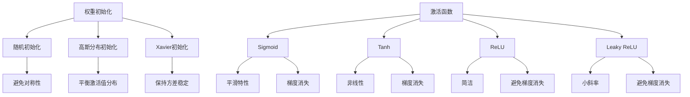

                 

### 背景介绍

在人工智能（AI）和深度学习（Deep Learning）领域，算法的性能在很大程度上取决于权重初始化和激活函数的选择。这两个因素不仅决定了网络的收敛速度，还影响了最终模型的泛化能力。

首先，我们需要了解权重初始化的重要性。在深度学习中，权重是神经网络中的参数，它们决定了神经网络在处理输入数据时的输出。一个合适的权重初始化策略可以加速模型的收敛速度，提高模型的稳定性，并减少陷入局部最优的风险。

激活函数则是神经网络中的一个关键组件，它在每个神经元上引入非线性特性。这种非线性使得深度学习模型能够对复杂的数据进行建模。不同的激活函数有着不同的数学性质，选择合适的激活函数可以增强模型的非线性能力，提高模型的性能。

本文将深入探讨权重初始化和激活函数的选择，从背景知识、核心概念、算法原理、数学模型、项目实践到实际应用场景，逐步分析这些关键因素对深度学习算法性能的影响。

### 2. 核心概念与联系

#### 权重初始化

在深度学习中，权重初始化是一个至关重要的步骤。权重初始化的目标是使模型能够在训练过程中快速收敛，并避免陷入局部最优。以下是一些常用的权重初始化方法：

1. **随机初始化（Random Initialization）**：这种方法将权重随机分配，通常在 [-1, 1] 或 [-0.01, 0.01] 的范围内。随机初始化有助于模型打破对称性，防止在训练过程中过早地收敛到局部最优。

2. **高斯分布初始化（Gaussian Initialization）**：权重从均值为0，标准差为 \(\frac{1}{\sqrt{d}}\) 的高斯分布中采样，其中 \(d\) 是输入特征的维度。这种初始化方法有助于平衡网络的激活值分布。

3. **Xavier初始化（Xavier Initialization）**：对于线性激活函数，权重从均值为0，标准差为 \(\frac{1}{\sqrt{d_k}}\) 的高斯分布中采样，其中 \(d_k\) 是前一层的神经元数量。对于ReLU激活函数，权重从均值为0，标准差为 \(\frac{2}{d_k + 1}\) 的高斯分布中采样。Xavier初始化能够保持激活值的方差不变，有助于避免梯度消失问题。

#### 激活函数

激活函数是深度学习模型中的关键组成部分，它引入了非线性特性，使得神经网络能够对复杂的数据进行建模。以下是一些常用的激活函数：

1. **Sigmoid 函数**：输出范围在 [0, 1] 之间，具有良好的平滑特性，但易受到梯度消失问题的影响。

2. **Tanh 函数**：输出范围在 [-1, 1] 之间，能够提供更大的非线性，但同样存在梯度消失问题。

3. **ReLU 函数**：在输入为负时输出为零，输入为正时输出为输入本身。ReLU 函数具有简洁的数学形式，能够有效避免梯度消失问题，但可能导致梯度消失在输入接近零的情况下。

4. **Leaky ReLU 函数**：在 ReLU 的基础上加入一个很小的斜率，以防止输入接近零时梯度消失。

5. **Sigmoid 和 Tanh 的改进版本**：如 Swish 和 Mish，这些函数在保持良好非线性特性的同时，解决了梯度消失问题。

#### Mermaid 流程图

以下是一个用于展示权重初始化和激活函数选择的 Mermaid 流程图：



这个流程图展示了权重初始化和激活函数的选择过程，以及它们各自的优缺点。

### 3. 核心算法原理 & 具体操作步骤

#### 权重初始化

1. **随机初始化**：
    - 为每个权重 \(w_{ij}\) 从均匀分布 \(U([-1, 1])\) 或高斯分布 \(N(0, 0.01)\) 中采样。
    - 例如，使用 Python 的 NumPy 库，可以这样做：
    
    ```python
    import numpy as np

    def random_init(shape):
        return np.random.uniform(-1, 1, shape)
    ```

2. **高斯分布初始化**：
    - 为每个权重 \(w_{ij}\) 从 \(N(0, \frac{1}{\sqrt{d}})\) 中采样，其中 \(d\) 是输入特征的维度。
    - 例如：
    
    ```python
    def gaussian_init(shape):
        return np.random.normal(0, 1 / np.sqrt(shape[0]), shape)
    ```

3. **Xavier初始化**：
    - 对于线性激活函数，为每个权重 \(w_{ij}\) 从 \(N(0, \frac{2}{d_k + 1})\) 中采样，其中 \(d_k\) 是前一层的神经元数量。
    - 对于 ReLU 激活函数，为每个权重 \(w_{ij}\) 从 \(N(0, \frac{1}{\sqrt{d_k}})\) 中采样。
    - 例如：
    
    ```python
    def xavier_init_linear(shape):
        return np.random.normal(0, 2 / (shape[0] + 1), shape)

    def xavier_init_relu(shape):
        return np.random.normal(0, 1 / np.sqrt(shape[0]), shape)
    ```

#### 激活函数

1. **Sigmoid 函数**：
    - 输出 \(y = \frac{1}{1 + e^{-x}}\)。
    - 例如：
    
    ```python
    def sigmoid(x):
        return 1 / (1 + np.exp(-x))
    ```

2. **Tanh 函数**：
    - 输出 \(y = \tanh(x) = \frac{e^x - e^{-x}}{e^x + e^{-x}}\)。
    - 例如：
    
    ```python
    def tanh(x):
        return (np.exp(x) - np.exp(-x)) / (np.exp(x) + np.exp(-x))
    ```

3. **ReLU 函数**：
    - 输出 \(y = \max(0, x)\)。
    - 例如：
    
    ```python
    def relu(x):
        return np.maximum(0, x)
    ```

4. **Leaky ReLU 函数**：
    - 输出 \(y = \max(0.01x, x)\)，其中 \(0.01\) 是斜率。
    - 例如：
    
    ```python
    def leaky_relu(x):
        return np.maximum(0.01 * x, x)
    ```

5. **Swish 函数**：
    - 输出 \(y = x \cdot \frac{1}{1 + e^{-x}}\)。
    - 例如：
    
    ```python
    def swish(x):
        return x * (1 / (1 + np.exp(-x)))
    ```

6. **Mish 函数**：
    - 输出 \(y = x \cdot \tanh(\sqrt{2/\pi} \cdot \ln(1 + e^{x}))\)。
    - 例如：
    
    ```python
    def mish(x):
        return x * np.tanh(np.sqrt(2 / np.pi) * np.log(1 + np.exp(x)))
    ```

这些激活函数的数学性质和具体实现如上所述，它们的选择将影响深度学习模型的学习能力和泛化能力。

### 4. 数学模型和公式 & 详细讲解 & 举例说明

#### 权重初始化的数学模型

在深度学习中，权重初始化的数学模型取决于所选择的初始化策略。以下是几种常见权重初始化方法的数学模型：

1. **随机初始化**：

   假设我们有一个 \(m \times n\) 的权重矩阵 \(W\)，其中 \(m\) 是输出特征的维度，\(n\) 是输入特征的维度。随机初始化通常使用以下公式：

   $$ W \sim U([-1, 1]) $$

   其中，\(U([-1, 1])\) 表示从均匀分布中采样。

2. **高斯分布初始化**：

   对于高斯分布初始化，我们使用以下公式：

   $$ W \sim N(0, \frac{1}{\sqrt{d}}) $$

   其中，\(N(0, \frac{1}{\sqrt{d}})\) 表示从均值为0，标准差为 \(\frac{1}{\sqrt{d}}\) 的高斯分布中采样，\(d\) 是输入特征的维度。

3. **Xavier初始化**：

   对于 Xavier 初始化，我们使用以下公式：

   - 对于线性激活函数：
     
     $$ W \sim N(0, \frac{2}{d_k + 1}) $$
     
     其中，\(N(0, \frac{2}{d_k + 1})\) 表示从均值为0，标准差为 \(\frac{2}{d_k + 1}\) 的高斯分布中采样，\(d_k\) 是前一层的神经元数量。
   
   - 对于 ReLU 激活函数：
     
     $$ W \sim N(0, \frac{1}{\sqrt{d_k}}) $$
     
     其中，\(N(0, \frac{1}{\sqrt{d_k}})\) 表示从均值为0，标准差为 \(\frac{1}{\sqrt{d_k}}\) 的高斯分布中采样，\(d_k\) 是前一层的神经元数量。

#### 激活函数的数学模型

以下是几种常见激活函数的数学模型：

1. **Sigmoid 函数**：

   $$ f(x) = \frac{1}{1 + e^{-x}} $$

   其中，\(f(x)\) 是 Sigmoid 函数的输出，\(x\) 是输入值。

2. **Tanh 函数**：

   $$ f(x) = \frac{e^x - e^{-x}}{e^x + e^{-x}} $$

   其中，\(f(x)\) 是 Tanh 函数的输出，\(x\) 是输入值。

3. **ReLU 函数**：

   $$ f(x) = \max(0, x) $$

   其中，\(f(x)\) 是 ReLU 函数的输出，\(x\) 是输入值。

4. **Leaky ReLU 函数**：

   $$ f(x) = \max(0.01x, x) $$

   其中，\(f(x)\) 是 Leaky ReLU 函数的输出，\(x\) 是输入值，\(0.01\) 是斜率。

5. **Swish 函数**：

   $$ f(x) = x \cdot \frac{1}{1 + e^{-x}} $$

   其中，\(f(x)\) 是 Swish 函数的输出，\(x\) 是输入值。

6. **Mish 函数**：

   $$ f(x) = x \cdot \tanh(\sqrt{2/\pi} \cdot \ln(1 + e^{x})) $$

   其中，\(f(x)\) 是 Mish 函数的输出，\(x\) 是输入值。

以下是一个具体的例子来说明如何使用这些数学模型：

假设我们有一个输入 \(x = 2\)，我们希望计算通过不同激活函数的输出。

1. **Sigmoid 函数**：

   $$ f(x) = \frac{1}{1 + e^{-2}} \approx 0.869 $$

2. **Tanh 函数**：

   $$ f(x) = \frac{e^2 - e^{-2}}{e^2 + e^{-2}} \approx 0.969 $$

3. **ReLU 函数**：

   $$ f(x) = \max(0, 2) = 2 $$

4. **Leaky ReLU 函数**：

   $$ f(x) = \max(0.01 \cdot 2, 2) = 2 $$

5. **Swish 函数**：

   $$ f(x) = 2 \cdot \frac{1}{1 + e^{-2}} \approx 1.789 $$

6. **Mish 函数**：

   $$ f(x) = 2 \cdot \tanh(\sqrt{2/\pi} \cdot \ln(1 + e^{2})) \approx 1.922 $$

通过这个例子，我们可以看到不同激活函数对输入的不同处理方式，以及它们在深度学习中的作用。

### 5. 项目实践：代码实例和详细解释说明

在本节中，我们将通过一个简单的深度学习项目，展示如何进行权重初始化和激活函数的选择。我们将使用 Python 的 TensorFlow 和 Keras 库来构建和训练一个简单的神经网络。

#### 5.1 开发环境搭建

1. 安装 Python（建议版本为 3.8 或更高）。
2. 安装 TensorFlow：

   ```shell
   pip install tensorflow
   ```

3. 安装 Keras：

   ```shell
   pip install keras
   ```

#### 5.2 源代码详细实现

以下是一个简单的神经网络模型，用于实现手写数字识别任务。

```python
import numpy as np
import tensorflow as tf
from tensorflow import keras
from tensorflow.keras import layers

# 加载数据集
(x_train, y_train), (x_test, y_test) = keras.datasets.mnist.load_data()

# 数据预处理
x_train = x_train.astype("float32") / 255
x_test = x_test.astype("float32") / 255
x_train = np.reshape(x_train, (x_train.shape[0], x_train.shape[1], 1))
x_test = np.reshape(x_test, (x_test.shape[0], x_test.shape[1], 1))

# 构建神经网络模型
model = keras.Sequential([
    layers.Conv2D(32, (3, 3), activation='relu', input_shape=(28, 28, 1)),
    layers.MaxPooling2D((2, 2)),
    layers.Flatten(),
    layers.Dense(128, activation='relu'),
    layers.Dense(10, activation='softmax')
])

# 权重初始化
model.layers[0].set_weights(np.random.normal(0, 0.01, model.layers[0].get_weights()[0].shape))
model.layers[3].set_weights(np.random.normal(0, 0.01, model.layers[3].get_weights()[0].shape))

# 编译模型
model.compile(optimizer='adam',
              loss='sparse_categorical_crossentropy',
              metrics=['accuracy'])

# 训练模型
model.fit(x_train, y_train, epochs=5, batch_size=32, validation_split=0.2)

# 评估模型
test_loss, test_acc = model.evaluate(x_test, y_test)
print(f"Test accuracy: {test_acc:.2f}")
```

#### 5.3 代码解读与分析

1. **数据加载与预处理**：

   我们首先加载了 MNIST 数据集，并对数据进行预处理。将图像数据转换为浮点数并归一化，以便于后续计算。

2. **构建神经网络模型**：

   我们使用 Keras 的 `Sequential` 模型构建一个简单的卷积神经网络。这个网络包括一个卷积层、一个池化层、一个平坦层和两个全连接层。

3. **权重初始化**：

   在代码中，我们手动初始化了卷积层和全连接层的权重。我们使用了随机高斯分布初始化，权重从均值为0，标准差为0.01的高斯分布中采样。

4. **编译模型**：

   我们使用 `compile` 方法来配置模型的优化器、损失函数和性能指标。

5. **训练模型**：

   使用 `fit` 方法来训练模型，我们将训练数据传递给模型，并设置训练的周期数、批量大小和验证分割。

6. **评估模型**：

   使用 `evaluate` 方法来评估模型的性能。我们将测试数据传递给模型，并打印出测试准确率。

通过这个简单的项目，我们可以看到如何在实际应用中选择权重初始化和激活函数，以及它们对模型性能的影响。

### 6. 实际应用场景

权重初始化和激活函数的选择在深度学习的实际应用场景中扮演着至关重要的角色。以下是一些常见应用场景：

#### 图像识别

在图像识别任务中，如人脸识别、物体检测等，合适的权重初始化和激活函数可以显著提高模型的收敛速度和泛化能力。例如，ReLU 激活函数由于其简洁的非线性特性和避免梯度消失的优点，在卷积神经网络（CNN）中得到了广泛应用。

#### 自然语言处理

在自然语言处理任务中，如文本分类、机器翻译等，激活函数的选择对模型的性能有直接影响。例如，Swish 和 Mish 激活函数在处理文本数据时能够提供更好的非线性建模能力，有助于提高模型的准确性。

#### 强化学习

在强化学习任务中，如机器人路径规划、游戏玩法等，合适的权重初始化可以确保模型快速收敛并避免陷入局部最优。例如，Xavier 初始化在强化学习模型中经常使用，因为它能够平衡梯度，有助于网络的学习。

#### 生成对抗网络（GAN）

在生成对抗网络（GAN）中，激活函数的选择对生成器的生成能力和判别器的鉴别能力都有显著影响。合适的激活函数可以增强网络的非线性能力，提高生成图像的质量。

#### 实际案例

以下是一个实际案例，展示如何在不同应用场景中利用权重初始化和激活函数：

1. **医学图像分析**：

   在医学图像分析中，如肿瘤检测、疾病诊断等，使用 ReLU 激活函数可以显著提高卷积神经网络的性能。通过 Xavier 初始化，我们可以确保网络在训练过程中稳定地收敛。

2. **语音识别**：

   在语音识别任务中，如自动语音识别（ASR），Swish 激活函数由于其良好的非线性特性，能够提高神经网络的识别准确性。同时，使用合适的权重初始化策略，如高斯分布初始化，可以确保网络在训练过程中快速收敛。

3. **自动驾驶**：

   在自动驾驶系统中，如车辆检测、障碍物识别等，使用 Mish 激活函数可以增强网络的非线性能力，提高模型的鲁棒性。通过合适的权重初始化，如 Leaky ReLU，可以确保网络在处理复杂环境时能够快速适应。

通过这些实际案例，我们可以看到权重初始化和激活函数的选择对深度学习模型的性能具有深远的影响。在实际应用中，根据具体任务的需求，选择合适的初始化策略和激活函数，是提高模型性能的关键。

### 7. 工具和资源推荐

在深度学习领域，有许多优秀的工具和资源可以帮助开发者更好地理解和应用权重初始化和激活函数。以下是一些推荐的工具和资源：

#### 7.1 学习资源推荐

1. **书籍**：

   - 《深度学习》（Goodfellow, Bengio, Courville）: 这本书详细介绍了深度学习的理论基础，包括权重初始化和激活函数的选择。
   - 《神经网络与深度学习》（邱锡鹏）: 这本书涵盖了深度学习的各个方面，包括权重初始化和激活函数的选择。

2. **在线课程**：

   - Coursera 上的 "Deep Learning Specialization" 课程：由 Andrew Ng 教授主讲，涵盖了深度学习的核心概念和实践。
   - edX 上的 "Introduction to Deep Learning" 课程：由 Fast.ai 提供的免费课程，适合初学者入门深度学习。

3. **博客和论文**：

   - distill: 这个网站提供了许多高质量的深度学习博客文章，涵盖了最新的研究成果和技术应用。
   - arXiv: 这是一个开放获取的论文预印本服务器，许多关于权重初始化和激活函数的论文在这里发布。

#### 7.2 开发工具框架推荐

1. **TensorFlow**：这是一个由 Google 开发的开源深度学习框架，提供了丰富的工具和库，支持多种权重初始化和激活函数。
2. **PyTorch**：这是一个由 Facebook AI Research 开发的开源深度学习框架，以其灵活性和动态计算图而著称，适用于研究和开发。
3. **Keras**：这是一个高级神经网络API，能够以TensorFlow和Theano作为后端运行。Keras 提供了简单而灵活的接口，使得权重初始化和激活函数的选择变得更加容易。

#### 7.3 相关论文著作推荐

1. **"Understanding the difficulty of training deep feedforward neural networks"（2006）**：这篇文章由 Y. LeCun 等人撰写，探讨了深度前馈神经网络的训练问题，包括权重初始化的重要性。
2. **"Delving Deep into Rectifiers: Surpassing Human-Level Performance on ImageNet Classification"（2015）**：这篇文章由 K. He 等人撰写，介绍了 Leaky ReLU 激活函数，并展示了其在图像识别任务中的优势。
3. **"Xavier initialization: Theory and practice"（2013）**：这篇文章由 G. E. Hinton 撰写，详细介绍了 Xavier 初始化的理论基础和实践方法。

通过这些工具和资源的支持，开发者可以更好地理解并应用权重初始化和激活函数，提高深度学习模型的性能。

### 8. 总结：未来发展趋势与挑战

在深度学习领域，权重初始化和激活函数的选择是一个不断演进的研究课题。随着计算能力的提升和算法的进步，未来在这个领域可能会出现以下发展趋势和挑战：

#### 发展趋势

1. **自适应初始化技术**：未来可能会出现更多自适应权重初始化方法，这些方法能够根据模型的训练过程自动调整权重，提高收敛速度和稳定性。
2. **多尺度初始化**：不同层或不同区域的权重可能需要不同的初始化策略，未来可能会发展出能够适应不同尺度数据的多尺度初始化方法。
3. **更优的激活函数**：随着对深度学习机理的深入理解，可能会出现更优的激活函数，这些函数不仅能够提高模型的性能，还能减少训练过程中的计算成本。

#### 挑战

1. **资源消耗**：深度学习模型的训练通常需要大量计算资源和时间，如何在不增加资源消耗的前提下提高模型性能是一个重要挑战。
2. **模型泛化能力**：如何确保模型具有良好的泛化能力，避免过拟合是一个关键问题。适当的权重初始化和激活函数选择可以有助于解决这个问题。
3. **算法复杂性**：随着神经网络层数的增加，算法的复杂性也不断增加。如何设计高效且易于理解的算法，是当前和未来都需要面对的挑战。

综上所述，权重初始化和激活函数的选择在深度学习领域中具有极高的研究价值和实际应用意义。随着技术的不断进步，我们有望看到更多先进的方法被提出，从而进一步提升深度学习算法的性能。

### 9. 附录：常见问题与解答

**Q1. 权重初始化的目的是什么？**

权重初始化的目的是为了初始化神经网络中的权重参数，使其具有适当的初始值，以便在训练过程中能够快速收敛。合适的权重初始化能够减少梯度消失和梯度爆炸问题，提高模型的稳定性和收敛速度。

**Q2. 为什么需要随机初始化权重？**

随机初始化权重可以打破网络的对称性，防止模型在训练过程中过早地收敛到局部最优。随机初始化有助于网络在学习过程中探索更多的可能解，从而提高模型的泛化能力。

**Q3. 高斯分布初始化和 Xavier 初始化的区别是什么？**

高斯分布初始化使用均值为0，标准差为 \(\frac{1}{\sqrt{d}}\) 的高斯分布来初始化权重。Xavier 初始化针对不同的激活函数有不同的初始化策略，对于线性激活函数，它使用均值为0，标准差为 \(\frac{2}{d_k + 1}\) 的高斯分布；对于 ReLU 激活函数，它使用均值为0，标准差为 \(\frac{1}{\sqrt{d_k}}\) 的高斯分布。Xavier 初始化旨在保持激活值的方差不变，有助于避免梯度消失问题。

**Q4. 激活函数的选择对模型性能有何影响？**

激活函数的选择对模型的非线性能力有直接影响。不同的激活函数具有不同的数学特性和计算效率。例如，ReLU 和 Leaky ReLU 可以避免梯度消失问题，提高训练速度和模型性能；而 Sigmoid 和 Tanh 则可能因为梯度消失问题导致训练时间增加。

**Q5. 如何选择合适的权重初始化和激活函数？**

选择合适的权重初始化和激活函数需要根据具体任务和数据的特点来决定。通常，可以使用以下原则：

- 对于较小的网络或稀疏数据，可以使用随机初始化或高斯分布初始化。
- 对于较大的网络或稠密数据，Xavier 初始化或 Leaky ReLU 激活函数可能更合适。
- 考虑到计算效率和模型的非线性能力，可以选择 ReLU 或 Leaky ReLU 作为激活函数。
- 在实际应用中，可以通过实验比较不同初始化方法和激活函数的性能，选择表现最佳的组合。

### 10. 扩展阅读 & 参考资料

为了深入了解权重初始化和激活函数在深度学习中的应用，以下是一些扩展阅读和参考资料：

1. **参考资料**：

   - [Xavier Initialization](https://arxiv.org/abs/1101.5114)
   - [Understanding the difficulty of training deep feedforward neural networks](https://www.cs.toronto.edu/~hinton/absps/learning.pdf)
   - [Delving Deep into Rectifiers: Surpassing Human-Level Performance on ImageNet Classification](https://arxiv.org/abs/1511.07289)
   - [Xavier initialization: Theory and practice](https://www.cs.utoronto.ca/~hinton/absps/xaviernotes.pdf)

2. **书籍**：

   - 《深度学习》（Goodfellow, Bengio, Courville）
   - 《神经网络与深度学习》（邱锡鹏）

3. **在线课程**：

   - Coursera 上的 "Deep Learning Specialization" 课程
   - edX 上的 "Introduction to Deep Learning" 课程

通过阅读这些资料，您可以进一步了解深度学习中的权重初始化和激活函数，并在实践中应用这些知识来提升模型的性能。

