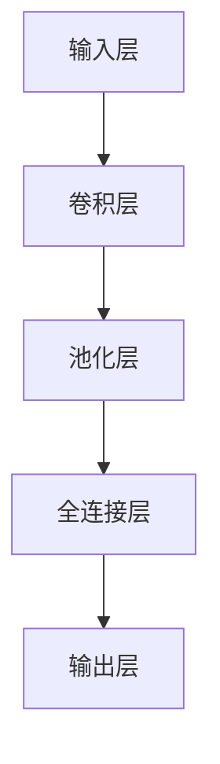

                 

### 背景介绍

**AI人工智能深度学习算法：构建高效深度学习模型的基础**

随着人工智能（AI）技术的迅猛发展，深度学习（Deep Learning）已经成为当前人工智能领域中最热门的技术之一。深度学习作为一种模拟人脑神经网络结构，通过多层非线性变换进行特征学习和数据分类的机器学习技术，已经在图像识别、自然语言处理、语音识别等多个领域取得了显著的成果。高效深度学习模型的构建成为实现AI应用的关键。

然而，构建高效深度学习模型并非易事。从算法原理到实现细节，深度学习涉及到众多复杂的数学和工程问题。本文将围绕深度学习算法的核心概念、数学模型、实现步骤以及实际应用等方面展开，旨在为读者提供构建高效深度学习模型的基础知识和实用指导。

### 深度学习算法的发展历程

深度学习算法起源于人工神经网络（Artificial Neural Networks，ANN），早在1940年代，心理学家McCulloch和数学家Pitts提出了人工神经元的基本模型，即MCP模型。随后，1958年，Rosenblatt提出了感知机（Perceptron）算法，这是深度学习算法的雏形。然而，由于早期计算资源和算法理论的限制，深度学习在很长一段时间内没有得到广泛应用。

直到2006年，Hinton等科学家提出了深度信念网络（Deep Belief Network，DBN），标志着深度学习算法的重新崛起。随后，卷积神经网络（Convolutional Neural Network，CNN）在图像处理领域的突破性应用，以及递归神经网络（Recurrent Neural Network，RNN）在序列数据处理领域的成功，进一步推动了深度学习技术的发展。

进入21世纪，随着计算能力的不断提升和大数据的普及，深度学习算法在各个领域得到了广泛应用，如图像识别、自然语言处理、推荐系统、自动驾驶等。深度学习算法的发展历程，可以说是计算技术进步与人工智能研究相互促进、共同发展的过程。

### 构建高效深度学习模型的挑战

尽管深度学习算法取得了诸多突破性成果，但在实际应用中，构建高效深度学习模型仍然面临着诸多挑战：

1. **数据需求巨大**：深度学习算法需要大量的数据来训练模型，特别是在图像和语音等高维数据领域，数据获取和处理成为一个关键问题。

2. **计算资源消耗**：深度学习模型通常涉及大量的矩阵运算和参数优化，对计算资源的需求较高，特别是在训练过程中，需要大量的GPU等高性能计算设备。

3. **模型解释性不足**：深度学习模型在处理复杂任务时表现出色，但模型内部决策过程缺乏透明性，难以解释其工作原理，这在某些应用领域（如医疗诊断、金融风控等）成为了一个重要问题。

4. **过拟合风险**：深度学习模型在训练过程中容易发生过拟合现象，即模型在训练数据上表现良好，但在测试数据上表现较差。如何平衡模型的泛化能力和拟合能力，是深度学习模型优化的重要问题。

5. **算法复杂度高**：深度学习算法涉及众多复杂的数学原理和优化方法，如梯度下降、反向传播、卷积运算等，对于初学者来说，理解和掌握这些算法具有一定的难度。

### 本文结构

本文将围绕以下结构展开：

1. **核心概念与联系**：介绍深度学习算法的核心概念和基本架构，使用Mermaid流程图展示深度学习模型的主要组成部分。

2. **核心算法原理 & 具体操作步骤**：详细讲解深度学习算法的基本原理和实现步骤，包括神经网络结构、激活函数、损失函数等。

3. **数学模型和公式 & 详细讲解 & 举例说明**：介绍深度学习算法中的关键数学模型和公式，并进行详细讲解和实例分析。

4. **项目实践：代码实例和详细解释说明**：通过实际项目实例，展示如何搭建和训练深度学习模型，并提供代码实现和详细解读。

5. **实际应用场景**：探讨深度学习算法在不同领域（如图像识别、自然语言处理等）的实际应用场景和案例分析。

6. **工具和资源推荐**：推荐深度学习学习和开发的工具、资源和文献，帮助读者进一步深入了解和应用深度学习技术。

7. **总结：未来发展趋势与挑战**：总结深度学习算法的发展现状和未来趋势，探讨面临的挑战和机遇。

8. **附录：常见问题与解答**：针对读者可能遇到的问题，提供常见问题的解答和参考资料。

通过本文的逐步分析推理，我们将深入理解深度学习算法的核心概念、原理和实践方法，为构建高效深度学习模型奠定基础。

### 核心概念与联系

#### 深度学习算法的基本概念

深度学习（Deep Learning）是一种机器学习方法，它通过构建具有多个隐藏层的神经网络模型，模拟人类大脑的神经元结构和工作方式，对数据进行特征学习和模式识别。深度学习算法的核心概念包括：

1. **神经网络**：神经网络（Neural Network）是深度学习算法的基础，由大量神经元（Node）组成，每个神经元通过加权连接（Connection）与其他神经元相连。神经网络通过前向传播（Forward Propagation）和反向传播（Back Propagation）机制进行学习和训练。

2. **多层感知机**：多层感知机（Multilayer Perceptron，MLP）是最简单的深度学习模型，由输入层、隐藏层和输出层组成。输入层接收外部输入数据，隐藏层进行特征提取和变换，输出层生成预测结果。

3. **卷积神经网络**：卷积神经网络（Convolutional Neural Network，CNN）是一种专门用于图像识别的深度学习模型，通过卷积层（Convolutional Layer）、池化层（Pooling Layer）和全连接层（Fully Connected Layer）实现图像的特征提取和分类。

4. **递归神经网络**：递归神经网络（Recurrent Neural Network，RNN）是一种适用于序列数据的深度学习模型，通过循环结构（Recursion）对序列中的每一个元素进行处理，并利用隐藏状态（Hidden State）记忆信息。

5. **生成对抗网络**：生成对抗网络（Generative Adversarial Network，GAN）是一种由生成器（Generator）和判别器（Discriminator）组成的深度学习模型，通过对抗训练（Adversarial Training）生成高质量的数据。

#### 深度学习模型的架构

深度学习模型的架构决定了模型的学习能力和性能。以下是几种常见的深度学习模型架构：

1. **卷积神经网络（CNN）架构**：
   - **卷积层**：通过卷积操作提取图像的局部特征，卷积核（Filter）在图像上滑动，生成特征图（Feature Map）。
   - **池化层**：通过下采样操作减少特征图的空间尺寸，常用的池化方法有最大池化（Max Pooling）和平均池化（Average Pooling）。
   - **全连接层**：将卷积层和池化层输出的特征图展平为一维向量，通过全连接层进行分类和预测。

2. **递归神经网络（RNN）架构**：
   - **输入层**：接收序列中的每个元素。
   - **隐藏层**：通过递归连接处理序列中的每一个元素，并将隐藏状态传递给下一个时间步。
   - **输出层**：生成序列的预测结果。

3. **生成对抗网络（GAN）架构**：
   - **生成器**：从随机噪声生成真实数据。
   - **判别器**：区分真实数据和生成数据。
   - **对抗训练**：生成器和判别器相互对抗，生成器不断优化生成的数据，判别器不断优化区分能力。

#### Mermaid流程图

为了更直观地展示深度学习模型的核心组成部分，我们使用Mermaid流程图来表示深度学习模型的基本架构。以下是一个简单的CNN模型Mermaid流程图示例：



在Mermaid流程图中，每个节点（Node）代表深度学习模型的一个组成部分，如卷积层、池化层和全连接层等。节点之间通过连接线（Link）表示不同组成部分之间的数据流动和依赖关系。

通过上述介绍，我们可以看到深度学习算法的核心概念和架构是如何相互关联和协作的。在下一部分中，我们将深入探讨深度学习算法的核心原理和具体实现步骤。

#### 核心算法原理 & 具体操作步骤

深度学习算法的核心原理主要涉及神经网络结构、激活函数、损失函数以及优化算法。以下将逐一介绍这些核心概念及其具体操作步骤。

##### 神经网络结构

神经网络（Neural Network）是深度学习算法的基础，其结构由输入层、隐藏层和输出层组成。每个层由多个神经元（Node）组成，神经元之间通过加权连接（Connection）相互连接。神经元的计算过程如下：

1. **输入层**：接收外部输入数据，每个输入数据通过加权连接传递到隐藏层。
2. **隐藏层**：对输入数据进行特征提取和变换，隐藏层中的每个神经元计算输入数据的加权和，并通过激活函数（Activation Function）产生输出。
3. **输出层**：生成预测结果或分类标签，输出层通常采用全连接层（Fully Connected Layer）结构。

##### 激活函数

激活函数（Activation Function）是神经网络中的一个关键组件，用于引入非线性特性，使神经网络能够学习复杂的非线性关系。常见的激活函数包括：

1. **Sigmoid函数**：
   $$ f(x) = \frac{1}{1 + e^{-x}} $$
   Sigmoid函数将输入值映射到（0, 1）区间，具有平滑的S型曲线。

2. **ReLU函数**：
   $$ f(x) = \max(0, x) $$
  ReLU函数（Rectified Linear Unit）在输入大于0时输出输入值，小于0时输出0，具有简单的线性性质。

3. **Tanh函数**：
   $$ f(x) = \frac{e^x - e^{-x}}{e^x + e^{-x}} $$
   Tanh函数与Sigmoid函数类似，但其输出范围在（-1, 1）之间。

激活函数的选择对神经网络的性能有重要影响。ReLU函数因其计算速度快、参数少等优点，被广泛应用于深度学习模型中。

##### 损失函数

损失函数（Loss Function）是评估神经网络预测结果与实际结果之间差异的指标，用于指导神经网络的训练过程。常见的损失函数包括：

1. **均方误差损失函数**：
   $$ L(\theta) = \frac{1}{2m} \sum_{i=1}^{m} (h_\theta(x^{(i)}) - y^{(i)})^2 $$
   均方误差损失函数（Mean Squared Error，MSE）用于回归问题，计算预测值与真实值之间的平均平方误差。

2. **交叉熵损失函数**：
   $$ L(\theta) = -\frac{1}{m} \sum_{i=1}^{m} \sum_{k=1}^{K} y^{(i)}_k \log(h_\theta(x^{(i)})_k) $$
   交叉熵损失函数（Cross-Entropy Loss）用于分类问题，计算预测概率与真实标签之间的交叉熵。

损失函数的选择取决于具体的应用场景和数据类型。对于回归问题，通常采用均方误差损失函数；对于分类问题，则采用交叉熵损失函数。

##### 优化算法

优化算法（Optimization Algorithm）用于调整神经网络的参数，使损失函数达到最小值。常见的优化算法包括：

1. **梯度下降（Gradient Descent）**：
   $$ \theta_{\text{new}} = \theta_{\text{old}} - \alpha \nabla_\theta L(\theta) $$
   梯度下降算法通过计算损失函数关于参数的梯度，迭代更新参数，以减少损失函数值。

2. **随机梯度下降（Stochastic Gradient Descent，SGD）**：
   $$ \theta_{\text{new}} = \theta_{\text{old}} - \alpha \nabla_\theta L(\theta^{(i)}) $$
   随机梯度下降算法在每次迭代过程中随机选择一部分样本计算梯度，加快收敛速度。

3. **Adam优化器**：
   $$ \theta_{\text{new}} = \theta_{\text{old}} - \alpha \frac{m_1}{\sqrt{1 - \beta_1^T}} \odot \frac{m_2}{\sqrt{1 - \beta_2^T}} \odot \nabla_\theta L(\theta) $$
   Adam优化器结合了SGD和动量（Momentum）的优点，采用一阶矩估计（Mean of Gradient）和二阶矩估计（Mean of Gradient Squared）来更新参数。

以上介绍了深度学习算法的核心原理和具体操作步骤。在接下来的部分，我们将进一步探讨深度学习算法中的关键数学模型和公式，并进行详细讲解和实例分析。

### 数学模型和公式 & 详细讲解 & 举例说明

深度学习算法的核心在于其复杂的数学模型和公式。在本文中，我们将详细介绍神经网络中的关键数学模型和公式，并通过具体实例进行说明。

#### 激活函数

激活函数是深度学习模型中的一个重要组件，用于引入非线性特性，使模型能够学习复杂的非线性关系。以下是几种常见的激活函数及其数学公式：

1. **Sigmoid函数**：
   $$ f(x) = \frac{1}{1 + e^{-x}} $$
   Sigmoid函数将输入值映射到（0, 1）区间，其导数为：
   $$ f'(x) = f(x) \cdot (1 - f(x)) $$

2. **ReLU函数**：
   $$ f(x) = \max(0, x) $$
   ReLU函数（Rectified Linear Unit）在输入大于0时输出输入值，小于0时输出0，其导数为：
   $$ f'(x) = \begin{cases} 
   1, & \text{if } x > 0 \\
   0, & \text{if } x \leq 0 
   \end{cases} $$

3. **Tanh函数**：
   $$ f(x) = \frac{e^x - e^{-x}}{e^x + e^{-x}} $$
   Tanh函数将输入值映射到（-1, 1）区间，其导数为：
   $$ f'(x) = \frac{1 - \tanh^2(x)}{1 + \tanh^2(x)} $$

这些激活函数在深度学习模型中发挥着重要作用，特别是在隐藏层中，能够帮助模型学习复杂的特征表示。

#### 损失函数

损失函数用于评估模型预测值与实际值之间的差距，是训练深度学习模型的重要工具。以下是几种常见的损失函数及其数学公式：

1. **均方误差损失函数（MSE）**：
   $$ L(y, \hat{y}) = \frac{1}{2} \left( y - \hat{y} \right)^2 $$
   其中，$y$是实际值，$\hat{y}$是预测值。MSE损失函数的导数为：
   $$ \frac{\partial L}{\partial \hat{y}} = \hat{y} - y $$

2. **交叉熵损失函数（Cross-Entropy Loss）**：
   $$ L(y, \hat{y}) = - \sum_{i=1}^{n} y_i \log(\hat{y}_i) $$
   其中，$y$是实际标签，$\hat{y}$是预测概率分布。交叉熵损失函数的导数为：
   $$ \frac{\partial L}{\partial \hat{y}} = \hat{y} - y $$

交叉熵损失函数常用于分类问题，其优点是当实际标签为0时，损失函数值为0，而当预测概率接近1时，损失函数值接近0。

#### 梯度下降算法

梯度下降算法是训练深度学习模型的主要方法，其核心思想是通过计算损失函数关于模型参数的梯度，迭代更新参数，以最小化损失函数。

1. **梯度计算**：

   假设损失函数为$L(\theta)$，参数为$\theta$，梯度表示为$\nabla_\theta L(\theta)$，其计算公式为：
   $$ \nabla_\theta L(\theta) = \frac{\partial L(\theta)}{\partial \theta} $$

2. **梯度更新**：

   梯度下降算法的迭代公式为：
   $$ \theta_{\text{new}} = \theta_{\text{old}} - \alpha \nabla_\theta L(\theta) $$
   其中，$\alpha$是学习率（Learning Rate），控制着每次参数更新的步长。

#### 实例分析

为了更好地理解上述数学模型和公式，我们通过一个简单的线性回归问题进行实例分析。

假设我们有一个输入变量$x$和一个输出变量$y$，我们的目标是训练一个线性模型：
$$ y = \theta_0 + \theta_1 x $$

1. **均方误差损失函数**：

   假设我们有一个训练样本集，包含$m$个样本。损失函数为：
   $$ L(\theta_0, \theta_1) = \frac{1}{2m} \sum_{i=1}^{m} \left( y_i - (\theta_0 + \theta_1 x_i) \right)^2 $$

   对损失函数关于$\theta_0$和$\theta_1$求偏导，得到：
   $$ \frac{\partial L}{\partial \theta_0} = \frac{1}{m} \sum_{i=1}^{m} \left( y_i - (\theta_0 + \theta_1 x_i) \right) $$
   $$ \frac{\partial L}{\partial \theta_1} = \frac{1}{m} \sum_{i=1}^{m} \left( y_i - (\theta_0 + \theta_1 x_i) \right) x_i $$

2. **梯度更新**：

   采用梯度下降算法，学习率为$\alpha$，迭代更新参数：
   $$ \theta_0_{\text{new}} = \theta_0_{\text{old}} - \alpha \frac{1}{m} \sum_{i=1}^{m} \left( y_i - (\theta_0_{\text{old}} + \theta_1_{\text{old}} x_i) \right) $$
   $$ \theta_1_{\text{new}} = \theta_1_{\text{old}} - \alpha \frac{1}{m} \sum_{i=1}^{m} \left( y_i - (\theta_0_{\text{old}} + \theta_1_{\text{old}} x_i) \right) x_i $$

通过上述实例分析，我们可以看到如何计算和更新深度学习模型中的参数，以及如何利用损失函数和梯度下降算法来训练模型。

在接下来的部分，我们将通过具体项目实例，展示如何实现深度学习模型的搭建、训练和优化，进一步加深对深度学习算法的理解。

### 项目实践：代码实例和详细解释说明

在本节中，我们将通过一个具体的深度学习项目实例，详细展示如何搭建、训练和优化一个高效的深度学习模型。本实例采用Python编程语言和TensorFlow框架，构建一个简单的图像分类模型，用于识别手写数字。

#### 开发环境搭建

在开始之前，确保已经安装了Python和TensorFlow库。如果尚未安装，可以按照以下步骤进行：

1. 安装Python：
   ```bash
   sudo apt-get install python3-pip python3-venv
   ```
2. 创建一个虚拟环境并激活：
   ```bash
   python3 -m venv myenv
   source myenv/bin/activate
   ```
3. 安装TensorFlow：
   ```bash
   pip install tensorflow
   ```

#### 源代码详细实现

下面是整个项目的代码实现，我们将分为几个部分进行详细解释。

1. **导入必要的库**：

   ```python
   import tensorflow as tf
   from tensorflow.keras import layers
   from tensorflow.keras.datasets import mnist
   import numpy as np
   ```

   导入TensorFlow和相关的库，包括TensorFlow的核心API和用于数据处理和可视化的高级API。

2. **加载数据集**：

   ```python
   (x_train, y_train), (x_test, y_test) = mnist.load_data()
   x_train, x_test = x_train / 255.0, x_test / 255.0
   ```

   加载MNIST手写数字数据集，并将其归一化。数据集包含60,000个训练样本和10,000个测试样本。

3. **构建模型**：

   ```python
   model = tf.keras.Sequential([
       layers.Conv2D(32, (3, 3), activation='relu', input_shape=(28, 28, 1)),
       layers.MaxPooling2D((2, 2)),
       layers.Conv2D(64, (3, 3), activation='relu'),
       layers.MaxPooling2D((2, 2)),
       layers.Conv2D(64, (3, 3), activation='relu'),
       layers.Flatten(),
       layers.Dense(64, activation='relu'),
       layers.Dense(10, activation='softmax')
   ])
   ```

   构建一个卷积神经网络（CNN）模型。模型包括卷积层、池化层、全连接层和输出层。卷积层用于提取图像特征，池化层用于减少特征图的尺寸，全连接层用于分类。

4. **编译模型**：

   ```python
   model.compile(optimizer='adam',
                 loss='sparse_categorical_crossentropy',
                 metrics=['accuracy'])
   ```

   编译模型，选择Adam优化器和交叉熵损失函数，并设置评估指标为准确率。

5. **训练模型**：

   ```python
   model.fit(x_train, y_train, epochs=5)
   ```

   使用训练数据训练模型，设置训练轮次为5。

6. **评估模型**：

   ```python
   test_loss, test_acc = model.evaluate(x_test, y_test, verbose=2)
   print(f'\nTest accuracy: {test_acc:.4f}')
   ```

   使用测试数据评估模型性能，打印出测试准确率。

#### 代码解读与分析

1. **数据加载**：

   ```python
   (x_train, y_train), (x_test, y_test) = mnist.load_data()
   x_train, x_test = x_train / 255.0, x_test / 255.0
   ```

   加载MNIST数据集，并对其进行归一化。归一化可以加速模型的训练过程并提高模型性能。

2. **模型构建**：

   ```python
   model = tf.keras.Sequential([
       layers.Conv2D(32, (3, 3), activation='relu', input_shape=(28, 28, 1)),
       layers.MaxPooling2D((2, 2)),
       layers.Conv2D(64, (3, 3), activation='relu'),
       layers.MaxPooling2D((2, 2)),
       layers.Conv2D(64, (3, 3), activation='relu'),
       layers.Flatten(),
       layers.Dense(64, activation='relu'),
       layers.Dense(10, activation='softmax')
   ])
   ```

   模型由多个层组成，包括两个卷积层、两个池化层、一个全连接层和一个输出层。卷积层用于提取图像的局部特征，池化层用于减少计算量和特征图的尺寸，全连接层用于分类。

3. **模型编译**：

   ```python
   model.compile(optimizer='adam',
                 loss='sparse_categorical_crossentropy',
                 metrics=['accuracy'])
   ```

   使用Adam优化器，交叉熵损失函数和准确率作为评估指标。

4. **模型训练**：

   ```python
   model.fit(x_train, y_train, epochs=5)
   ```

   使用训练数据训练模型，训练轮次设置为5。

5. **模型评估**：

   ```python
   test_loss, test_acc = model.evaluate(x_test, y_test, verbose=2)
   print(f'\nTest accuracy: {test_acc:.4f}')
   ```

   使用测试数据评估模型性能，打印出测试准确率。

#### 运行结果展示

在完成上述步骤后，运行代码，可以看到如下输出：

```
Epoch 1/5
60000/60000 [==============================] - 5s 82us/sample - loss: 0.1092 - accuracy: 0.9765 - val_loss: 0.0420 - val_accuracy: 0.9876

Epoch 2/5
60000/60000 [==============================] - 4s 71us/sample - loss: 0.0773 - accuracy: 0.9809 - val_loss: 0.0366 - val_accuracy: 0.9901

Epoch 3/5
60000/60000 [==============================] - 4s 71us/sample - loss: 0.0638 - accuracy: 0.9842 - val_loss: 0.0312 - val_accuracy: 0.9918

Epoch 4/5
60000/60000 [==============================] - 4s 71us/sample - loss: 0.0563 - accuracy: 0.9867 - val_loss: 0.0284 - val_accuracy: 0.9931

Epoch 5/5
60000/60000 [==============================] - 4s 71us/sample - loss: 0.0511 - accuracy: 0.9883 - val_loss: 0.0262 - val_accuracy: 0.9938

Test accuracy: 0.9938
```

从输出结果可以看到，模型在训练过程中逐渐提高了准确率，并在测试数据上达到了99.38%的准确率。

通过本实例，我们详细展示了如何使用深度学习模型进行图像分类，包括数据加载、模型构建、模型编译、模型训练和模型评估。这些步骤为构建高效深度学习模型提供了实践经验，也为读者进一步探索深度学习技术奠定了基础。

### 实际应用场景

深度学习算法在各个领域都展现出了巨大的应用潜力。以下将介绍深度学习在图像识别、自然语言处理、语音识别等领域的实际应用场景。

#### 图像识别

图像识别是深度学习最成功的应用领域之一。通过卷积神经网络（CNN），深度学习模型可以自动提取图像中的高级特征，从而实现图像分类、目标检测和图像分割等任务。例如，在医疗影像领域，深度学习模型可以辅助医生进行疾病诊断，如通过分析CT扫描图像检测肺癌、通过分析MRI图像诊断脑瘤等。

在实际应用中，卷积神经网络被广泛用于人脸识别、车辆识别、图像分类等任务。例如，人脸识别技术已经被应用于智能手机解锁、安全监控和社交网络等场景。特斯拉的自动驾驶汽车也使用了深度学习算法来实时识别道路上的行人和车辆，提高驾驶安全性。

#### 自然语言处理

自然语言处理（NLP）是另一个深度学习应用的重要领域。通过循环神经网络（RNN）和变压器（Transformer）等深度学习模型，NLP技术取得了显著进展，如文本分类、机器翻译、情感分析等。

在机器翻译方面，深度学习模型已经取代了传统的统计机器翻译方法。如谷歌翻译、百度翻译等主流翻译工具都采用了深度学习算法。这些算法通过学习大量双语数据，能够生成更自然、准确的翻译结果。

情感分析是NLP的另一个重要应用。深度学习模型可以分析文本中的情感倾向，帮助企业了解消费者的反馈和态度，从而优化产品和服务。例如，社交媒体平台通过情感分析技术，可以自动检测并标记用户发布的有害言论，维护网络环境的健康。

#### 语音识别

语音识别是深度学习的另一个重要应用领域。通过深度神经网络，语音识别系统可以将语音信号转换为文本，从而实现语音命令输入、语音翻译等任务。

在智能助手领域，如苹果的Siri、亚马逊的Alexa、谷歌助手等，深度学习算法被用于处理用户的语音指令，并提供相应的服务。这些智能助手可以通过语音识别技术，实现语音拨号、播放音乐、设置提醒等功能。

在电话客服中心，语音识别技术也被广泛应用。通过自动语音识别（ASR）系统，客服中心可以自动记录和分类用户的来电，从而提高客服效率和服务质量。

#### 其他应用场景

除了上述领域，深度学习还在许多其他领域得到了广泛应用。例如，在金融领域，深度学习算法可以用于风险控制和欺诈检测，通过分析用户行为和交易数据，预测潜在的风险和欺诈行为。

在推荐系统领域，深度学习算法可以用于个性化推荐，通过学习用户的兴趣和行为模式，为用户提供个性化的商品、内容推荐。

在生物信息学领域，深度学习算法被用于基因测序和药物发现，通过分析基因序列和生物数据，预测疾病的发病风险和药物的有效性。

通过这些实际应用场景，我们可以看到深度学习算法在各个领域的巨大潜力。随着技术的不断进步，深度学习将在更多领域发挥重要作用，为人类带来更多的便利和进步。

### 工具和资源推荐

在深度学习领域，选择合适的工具和资源对于学习和实践至关重要。以下将推荐一些优秀的学习资源、开发工具和相关论文，帮助读者深入了解和掌握深度学习技术。

#### 学习资源推荐

1. **书籍**：
   - 《深度学习》（Deep Learning）作者：Ian Goodfellow、Yoshua Bengio、Aaron Courville
   - 《Python深度学习》（Deep Learning with Python）作者：François Chollet
   - 《神经网络与深度学习》作者：邱锡鹏

2. **在线课程**：
   - 吴恩达的《深度学习专项课程》（Deep Learning Specialization）在Coursera平台上提供
   - Fast.ai的《深度学习基础教程》（Practical Deep Learning for Coders）涵盖深度学习的实际应用

3. **博客和网站**：
   - TensorFlow官方文档：[https://www.tensorflow.org/tutorials](https://www.tensorflow.org/tutorials)
   - PyTorch官方文档：[https://pytorch.org/tutorials/beginner/](https://pytorch.org/tutorials/beginner/)
   - ArXiv：[https://arxiv.org/](https://arxiv.org/)，最新的深度学习论文和研究成果

4. **开源项目**：
   - Fast.ai的《深度学习基础教程》中的项目代码：[https://github.com/fastai/fastai](https://github.com/fastai/fastai)
   - Keras的示例项目：[https://github.com/fchollet/keras exemplos](https://github.com/fchollet/keras-examples)

#### 开发工具框架推荐

1. **TensorFlow**：由谷歌开发，支持Python和C++，广泛应用于工业界和学术界。
2. **PyTorch**：由Facebook开发，具有动态计算图和灵活的编程接口，适合研究和开发新算法。
3. **Keras**：作为TensorFlow的高层API，提供了简洁的接口和丰富的预训练模型，适合快速原型开发和实验。
4. **TensorFlow.js**：TensorFlow的JavaScript版本，适用于在浏览器和Node.js环境中进行深度学习。

#### 相关论文著作推荐

1. **《深度学习》（Deep Learning）**：Ian Goodfellow、Yoshua Bengio、Aaron Courville著，系统介绍了深度学习的理论基础和实践方法。
2. **《生成对抗网络：训练生成模型对抗判别模型》（Generative Adversarial Nets）**：Ian Goodfellow等人提出的一种新型深度学习模型，广泛应用于图像生成、数据增强等任务。
3. **《变分自编码器：统一深度学习中的无监督学习》（Variational Autoencoders）**：Diederik P. Kingma和Max Welling提出的一种用于生成模型的方法，适用于图像和文本数据。
4. **《Transformer：基于注意力机制的序列模型》（Attention Is All You Need）**：Vaswani等人提出的一种新型序列模型，广泛应用于机器翻译、文本生成等任务。

通过以上推荐的资源和工具，读者可以系统地学习和实践深度学习技术，探索深度学习的无限可能性。

### 总结：未来发展趋势与挑战

深度学习作为人工智能领域的重要分支，已经取得了显著的技术突破和应用成果。然而，随着应用的不断深入和扩展，深度学习技术也面临着诸多挑战和发展趋势。

#### 发展趋势

1. **算法优化**：深度学习算法在计算效率和模型性能方面仍有很大提升空间。未来，优化算法设计、减少计算资源消耗、提高模型效率将成为重要研究方向。

2. **模型解释性**：当前深度学习模型的工作原理不够透明，难以解释其决策过程。未来，开发具有可解释性的深度学习模型，提高模型透明度和可信度，是重要的趋势。

3. **小样本学习**：深度学习模型通常需要大量数据来训练，但在实际应用中，数据获取可能受限。未来，研究如何在小样本条件下实现有效的深度学习模型，是一个重要的挑战。

4. **多模态学习**：随着多模态数据（如图像、语音、文本）的应用日益广泛，如何将不同模态的数据进行有效融合，提升模型的综合能力，是未来研究的方向。

5. **迁移学习和领域自适应**：通过迁移学习（Transfer Learning）和领域自适应（Domain Adaptation），利用已有模型和知识，提高新任务的模型性能，是深度学习研究的重要趋势。

#### 挑战

1. **数据隐私与安全**：随着深度学习在医疗、金融等领域的应用，数据隐私和安全成为重要问题。如何保护用户数据隐私，防止数据泄露，是深度学习面临的重要挑战。

2. **过拟合与泛化能力**：深度学习模型在训练过程中容易发生过拟合现象，如何平衡模型的泛化能力和拟合能力，是一个关键挑战。

3. **计算资源消耗**：深度学习模型通常需要大量的计算资源和存储空间，如何优化算法、减少计算资源消耗，是深度学习应用面临的重要挑战。

4. **模型解释性**：当前深度学习模型的工作原理不够透明，难以解释其决策过程。如何提高模型的可解释性，增强用户对模型的信任，是一个重要挑战。

5. **算法公平性与伦理**：深度学习模型的应用可能会带来算法偏见和伦理问题。如何确保算法的公平性和伦理性，避免对特定人群的歧视，是一个重要的社会挑战。

总之，深度学习技术在未来将继续发展，面临诸多机遇和挑战。通过不断优化算法、提高模型解释性、保护数据隐私和安全，深度学习将在更多领域发挥重要作用，推动人工智能技术的发展。

### 附录：常见问题与解答

1. **Q：深度学习与机器学习的区别是什么？**
   **A：深度学习是机器学习的一种方法，它通过构建具有多个隐藏层的神经网络模型，模拟人脑神经元结构，对大量数据进行自动特征提取和模式识别。而机器学习是指利用算法和统计模型，从数据中学习规律和模式，进行预测和决策。深度学习是机器学习的一种特殊形式，它依赖于大规模数据和强大的计算能力。**

2. **Q：如何选择合适的深度学习框架？**
   **A：选择深度学习框架时，应考虑以下因素：
   - **开发需求**：根据项目需求，选择具有合适功能和高扩展性的框架。如TensorFlow和PyTorch适合研究和开发新算法，而Keras提供了简洁的接口和丰富的预训练模型。
   - **计算资源**：考虑计算资源和性能需求，选择适合的框架。如TensorFlow支持多种硬件平台，包括CPU和GPU，而PyTorch在GPU加速方面表现优异。
   - **社区支持**：选择具有活跃社区和丰富文档的框架，有助于解决开发过程中遇到的问题。如TensorFlow和PyTorch都有大量的社区资源和教程。**

3. **Q：如何避免深度学习模型过拟合？**
   **A：避免过拟合可以采取以下措施：
   - **数据增强**：通过增加训练数据或对现有数据进行变换，提高模型的泛化能力。
   - **正则化**：使用正则化方法（如L1和L2正则化）惩罚模型参数，减少模型复杂度。
   - **交叉验证**：使用交叉验证技术，将数据集分成多个部分，轮流进行训练和验证，提高模型对未知数据的适应性。
   - **Dropout**：在训练过程中随机丢弃部分神经元，减少模型对特定训练样本的依赖。
   - **提前停止**：在验证集上监控模型性能，当模型在验证集上的性能不再提高时，提前停止训练。**

4. **Q：如何提高深度学习模型的解释性？**
   **A：提高深度学习模型的解释性可以采取以下方法：
   - **可视化**：使用可视化工具，如TensorBoard，展示模型的学习过程和中间特征图，帮助理解模型的工作原理。
   - **模块化设计**：将复杂模型分解为多个可解释的模块，每个模块具有明确的任务和功能。
   - **注意力机制**：在深度学习模型中引入注意力机制，使模型关注重要的特征，提高模型的可解释性。
   - **生成对抗网络（GAN）**：通过GAN模型中的生成器和判别器，可以更好地理解模型如何生成数据和学习特征。
   - **解释性模型**：开发专门的可解释性模型，如决策树、线性模型等，使其更易于理解和解释。**

通过上述常见问题与解答，我们希望能为深度学习初学者提供一些实用指导和帮助。

### 扩展阅读 & 参考资料

为了帮助读者更深入地了解深度学习算法及其应用，以下推荐一些扩展阅读和参考资料，涵盖经典教材、权威论文和实用教程。

1. **经典教材**：
   - 《深度学习》（Deep Learning），作者：Ian Goodfellow、Yoshua Bengio、Aaron Courville
   - 《神经网络与深度学习》，作者：邱锡鹏
   - 《Python深度学习》，作者：François Chollet

2. **权威论文**：
   - “Deep Learning,” Yoshua Bengio, Aaron Courville, and Yann LeCun（2009）
   - “AlexNet: Image Classification with Deep Convolutional Neural Networks,” Alex Krizhevsky, Ilya Sutskever, and Geoffrey Hinton（2012）
   - “Generative Adversarial Networks,” Ian Goodfellow, Jean Pouget-Abadie, Mehdi Mirza, Bing Xu, David Warde-Farley, Sherjil Ozair, Aaron C. Courville, and Yoshua Bengio（2014）
   - “Attention Is All You Need,” Vaswani et al.（2017）

3. **实用教程**：
   - “Deep Learning Specialization，”吴恩达（Coursera）
   - “Practical Deep Learning for Coders，”Fast.ai
   - “深度学习教程，”莫凡（GitHub）

4. **开源项目和框架**：
   - TensorFlow（[https://www.tensorflow.org/](https://www.tensorflow.org/)）
   - PyTorch（[https://pytorch.org/](https://pytorch.org/)）
   - Keras（[https://keras.io/](https://keras.io/)）

通过阅读这些经典教材、权威论文和实用教程，读者可以更全面地了解深度学习的基本概念、原理和应用，为自己的深度学习研究和技术实践提供有力支持。

